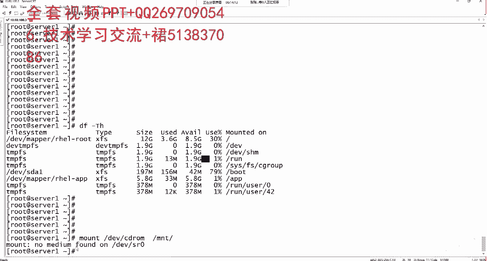
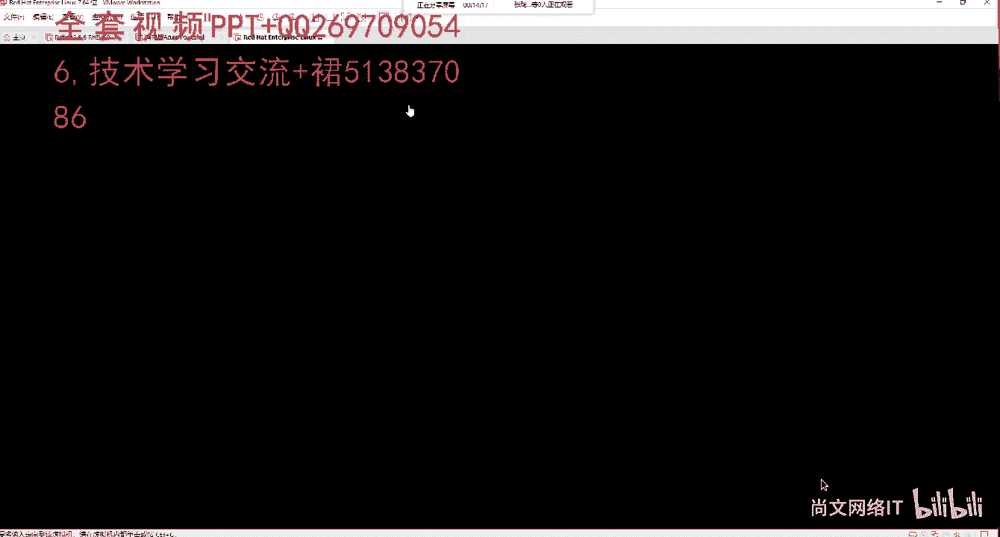
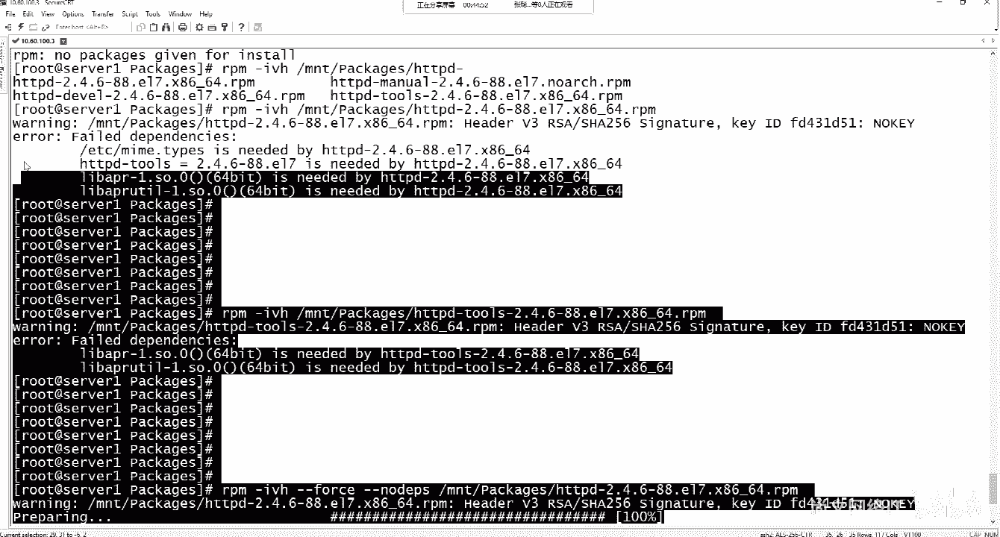
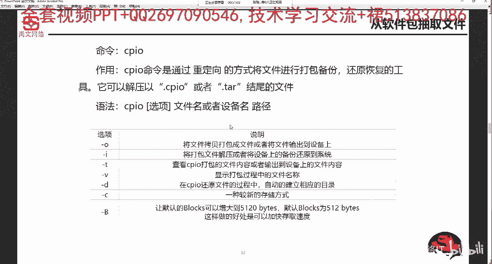

# Linux软件包管理：06-1：RPM格式软件包的安装、更新、查询、卸载和管理 📦

在本节课中，我们将要学习Linux系统中基于RPM格式的软件包管理。RPM是Red Hat Package Manager的缩写，是红帽系列Linux发行版（如Red Hat Enterprise Linux、CentOS）中用于软件安装、查询、更新和卸载的核心工具。我们将从RPM包的基本概念开始，逐步学习其各项操作。

## 软件包管理概述

Linux有多种软件包管理方式。第一种是基于RPM包的安装管理。第二种是编译并安装源码包。第三种是通过YUM工具来安装和管理RPM包。本节我们重点学习第一种方式。

RPM包的扩展名是 `.rpm`。它类似于Windows系统中的 `.exe` 或 `.msi` 安装程序文件。需要注意的是，不同的Linux发行版使用不同的包管理工具。例如，基于Debian的系统（如Kali Linux）使用APT（`apt-get install`）进行管理，而红帽系列则使用RPM和YUM。

## RPM包的命名规则

在安装RPM包之前，理解其完整名称的构成至关重要。一个典型的RPM包完整名称如下：
`zsh-5.0.2-14.el7.x86_64.rpm`

以下是各部分的含义：
*   **zsh**：软件包名称。
*   **5.0.2**：软件版本号（主版本.次版本.修订号）。
*   **14**：发行号（Release），表示该版本的第几次打包。
*   **el7**：表示该包适用于Red Hat Enterprise Linux 7或其兼容系统（如CentOS 7）。`el6` 或 `el8` 则对应其他版本。
*   **x86_64**：表示软件包适用的CPU架构（64位）。如果是32位，则可能是 `i686`。
*   **.rpm**：文件扩展名。

因此，在通过RPM命令安装时，通常需要指定包的完整名称。

## 安装RPM软件包

安装RPM包的基本命令是 `rpm -ivh`。
*   `-i`：代表安装（install）。
*   `-v`：显示安装的详细信息（verbose）。
*   `-h`：以人类可读的格式（如进度条 #）显示安装进度。

以下是安装RPM包的两种常见方式。

### 安装本地RPM包





如果RPM包已经下载到本地系统，可以直接指定其路径进行安装。

**命令示例：**
```bash
rpm -ivh /mnt/packages/zsh-5.0.2-14.el7.x86_64.rpm
```

### 安装来自网络的RPM包

RPM也支持通过直接的URL链接来安装网络上的软件包。

**命令示例：**
```bash
rpm -ivh http://example.com/path/to/package.rpm
```
使用此方式要求您的Linux系统能够访问互联网。

### 实战：从光盘/ISO安装包

上一节我们介绍了安装命令，本节中我们来看看如何从物理光盘或ISO镜像文件安装软件包。首先，需要将光盘或ISO文件挂载到系统目录。

以下是操作步骤：
1.  确保光盘已连接或ISO文件已加载到虚拟光驱。
2.  将光驱设备挂载到一个目录（如 `/mnt`）。
    ```bash
    mount /dev/cdrom /mnt
    ```
    *注意：`/dev/cdrom` 通常是 `/dev/sr0` 块设备的符号链接。光盘文件系统通常是只读的。*
3.  进入挂载点的Packages目录，这里存放了所有RPM包。
    ```bash
    cd /mnt/Packages
    ```
4.  使用 `rpm -ivh` 命令安装所需软件包，例如安装vsftpd（FTP服务器）：
    ```bash
    rpm -ivh vsftpd-3.0.2-29.el7.x86_64.rpm
    ```

## 查询已安装的RPM软件包

安装完成后，我们需要验证软件包是否成功安装。RPM提供了强大的查询功能。

### 查询单个软件包

使用 `rpm -q` 配合 `grep` 命令可以查询特定包是否已安装。

**命令示例：**
```bash
rpm -qa | grep vsftpd
```
*   `-qa`：查询（query）所有（all）已安装的包。
*   `grep vsftpd`：过滤出包含“vsftpd”字样的行。

### 批量查询多个软件包

如果需要一次性检查多个软件包，可以使用以下更高效的方式。

以下是两种批量查询的方法：
1.  **使用 `egrep` 过滤：**
    ```bash
    rpm -qa | egrep ‘vsftpd|python|httpd‘
    ```
    此命令会列出已安装的vsftpd、python和httpd包的信息。
2.  **使用 `--qf` 格式化输出（更详细）：**
    ```bash
    rpm -q --qf ‘%{name}-%{version}-%{release}.%{arch}\n‘ gcc make httpd
    ```
    *   `--qf`：指定查询输出格式。
    *   `%{name}` 等：代表软件包的各种属性变量。
    *   此命令会清晰列出gcc、make、httpd这几个包的名称、版本、发行号和架构，如果未安装则会明确提示。

## RPM的依赖关系问题

在安装复杂软件（如httpd）时，你可能会遇到依赖错误。这意味着要安装的主软件包需要先安装其他一些库或软件包（依赖包）。

**例如，安装httpd时可能提示：**
```bash
error: Failed dependencies:
    httpd-tools = 2.4.6-88.el7 is needed by httpd-2.4.6-88.el7.x86_64
    libapr-1.so.0()(64bit) is needed by httpd-2.4.6-88.el7.x86_64
```

### 强制安装（忽略依赖）

有时，为了测试或特殊需求，可以强制安装并忽略依赖关系，但这可能导致软件无法正常运行。

**命令示例：**
```bash
rpm -ivh --force --nodeps httpd-2.4.6-88.el7.x86_64.rpm
```
*   `--force`：强制安装。
*   `--nodeps`：不检查依赖关系。

**注意：** 正因为手动处理依赖非常繁琐，所以我们后续会学习能自动解决依赖关系的YUM工具。

## 更新、卸载与管理RPM包

### 更新软件包

使用 `-U` 或 `--upgrade` 参数可以升级已安装的软件包。如果软件包未安装，则执行安装操作。

**命令示例：**
```bash
rpm -Uvh package-name-version.rpm
```

若要降级安装旧版本，可以加上 `--oldpackage` 参数。

### 卸载软件包



卸载软件包使用 `-e`（erase）参数，后面只需跟软件包名称，**无需完整名称**。

**命令示例：**
```bash
rpm -e vsftpd
```

### 从RPM包中提取特定文件

如果系统中的一个重要配置文件丢失，我们可以从原始RPM包中提取它。

例如，`/etc/inittab` 文件丢失，我们需要：
1.  首先，查找该文件属于哪个RPM包（如果记得包名可跳过）：
    ```bash
    rpm -qf /etc/inittab
    ```
2.  假设它来自 `initscripts-xxx.rpm` 包。我们可以从该RPM包中提取出 `inittab` 文件：
    ```bash
    rpm2cpio /mnt/Packages/initscripts-xxx.rpm | cpio -idmv ./etc/inittab
    ```
3.  将提取出的文件复制回正确位置：
    ```bash
    cp ./etc/inittab /etc/inittab
    ```

## 总结



本节课中我们一起学习了RPM软件包管理的核心操作。我们了解了RPM包的结构和命名规则，掌握了使用 `rpm -ivh` 进行安装、使用 `rpm -qa` 进行查询、使用 `rpm -e` 进行卸载以及使用 `rpm -Uvh` 进行更新的方法。同时，我们也认识了RPM在依赖管理上的局限性，这为我们接下来学习更先进的YUM包管理工具打下了基础。记住，在大多数生产环境中，推荐使用YUM来简化依赖管理。