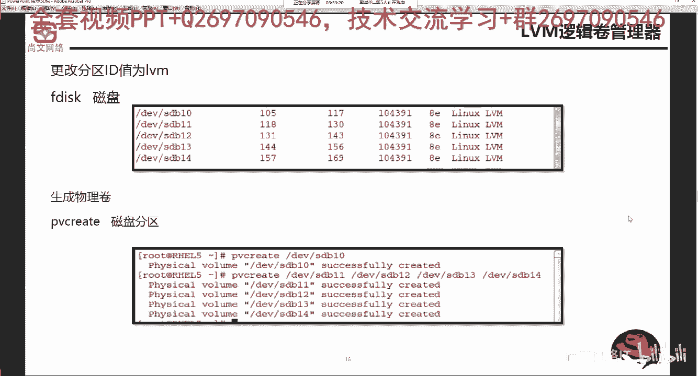
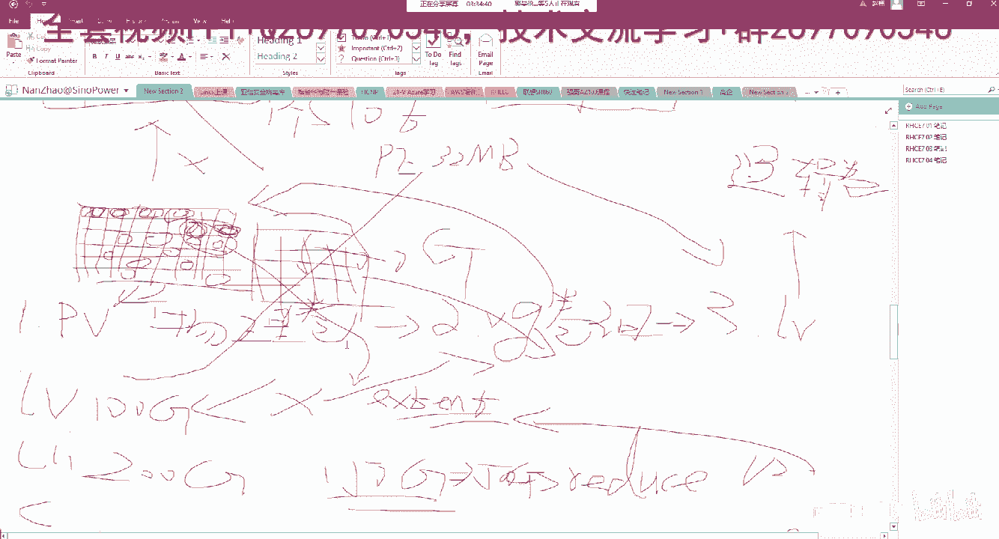
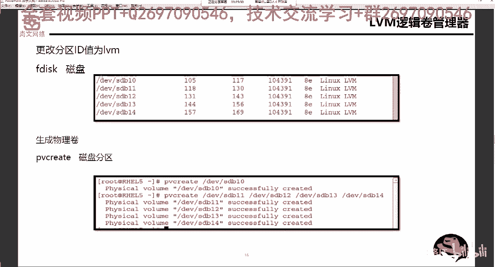

# Linux运维：RHCSA：RHCE8-07-10-1 LVM概念讲解 🗂️

在本节课中，我们将要学习逻辑卷管理器（LVM）的核心概念。LVM是Linux系统中用于管理磁盘存储的强大工具，它允许我们灵活地创建、调整和管理存储空间。

## 概述

逻辑卷管理器（LVM）提供了一种比传统分区更灵活的磁盘管理方式。它通过将物理存储设备抽象化，使我们能够动态地调整存储空间的大小，而无需重新分区或移动数据。

## LVM核心组件

上一节我们概述了LVM，本节中我们来看看构成LVM的三个核心组件。

LVM的架构主要包含以下三个层次：

1.  **物理卷（PV）**
    *   这是LVM的基础。物理卷可以是整个硬盘（如 `/dev/sdb`），也可以是硬盘上的一个分区。在使用前，需要将其ID标记为Linux LVM类型（`8e`）。

2.  **卷组（VG）**
    *   卷组由一个或多个物理卷（PV）组合而成，形成一个统一的存储池。所有加入卷组的物理存储空间将被集中管理。

3.  **逻辑卷（LV）**
    *   逻辑卷是从卷组（VG）中划分出来的、可供用户使用的存储空间。它类似于传统的分区，但可以动态调整大小。创建后，需要格式化为文件系统（如ext4）并挂载才能使用。

## 物理盘区（PE）详解

在了解了LVM的三个核心组件后，我们需要深入理解一个关键概念：物理盘区（PE），它是卷组空间管理的基本单位。

*   **PE（Physical Extent）**：物理盘区。它是卷组（VG）空间分配的最小单位。创建卷组时，需要指定PE的大小（例如4MB、8MB、128MB等）。
*   所有加入卷组的物理卷（PV）都会被等量切割成大小为指定PE值的“格子”。逻辑卷（LV）的容量就是由若干个这样的PE组合而成。
*   PE的大小会影响管理的灵活性。PE值设置得越大，卷组中总的PE数量就越少；反之，PE值越小，PE数量就越多。

## LVM工作流程

以下是使用LVM创建可用存储空间的标准步骤：

1.  **准备物理卷（PV）**
    *   将物理磁盘或分区转换为LVM可识别的物理卷。前提是分区的类型ID必须设置为 `8e`（Linux LVM）。

2.  **创建卷组（VG）**
    *   将一个或多个物理卷（PV）加入到一个卷组（VG）中，形成统一的存储池。

3.  **创建逻辑卷（LV）**
    *   从卷组（VG）中划分出指定大小的空间，创建逻辑卷（LV）。

4.  **格式化与挂载**
    *   将创建好的逻辑卷（LV）格式化为所需的文件系统（例如使用 `mkfs.ext4` 命令）。
    *   将格式化后的逻辑卷挂载到系统的某个目录（如 `/mnt/data`）上，即可开始使用。
    *   为了实现开机自动挂载，需要将挂载信息写入 `/etc/fstab` 配置文件。

## 总结

本节课中我们一起学习了逻辑卷管理器（LVM）的基本概念。我们了解了LVM的三个核心组件：物理卷（PV）、卷组（VG）和逻辑卷（LV），并认识了空间分配的基本单位物理盘区（PE）。最后，我们梳理了从准备物理盘到挂载使用的完整工作流程。掌握这些概念是后续进行LVM实际操作的基础。