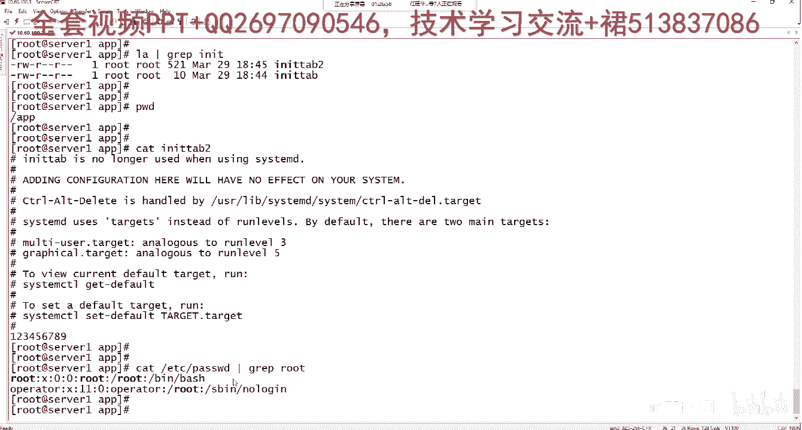
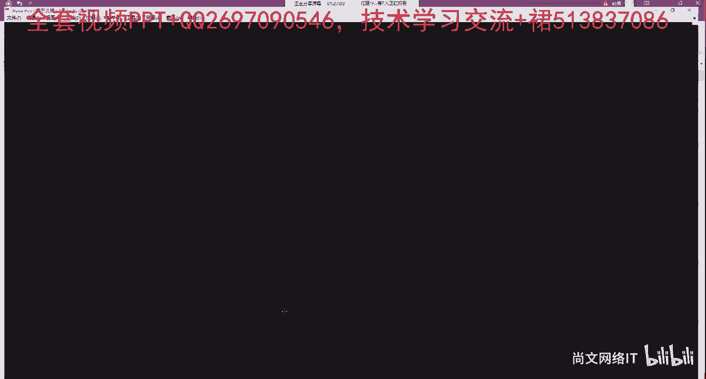

# Linux运维：RHCSA：管道符与重定向 🚀

在本节课中，我们将要学习Linux中两个非常强大的工具：管道符和重定向。它们能帮助我们高效地处理命令的输出，将多个命令串联起来，或者将输出结果保存到文件中。

## 管道符 `|`

上一节我们介绍了命令的基本操作，本节中我们来看看如何将命令连接起来。管道符 `|` 的作用是将一个命令的输出结果，作为另一个命令的输入。

例如，我们想查看某个目录下是否包含与“bash”相关的文件，可以这样做：
```bash
ls /etc | grep bash
```
在这个例子中，`ls /etc` 命令列出了 `/etc` 目录下的所有内容，然后通过管道符 `|` 将结果传递给 `grep bash` 命令。`grep` 命令会筛选出所有包含“bash”关键字的行。

## 输出重定向 `>` 与 `>>`

学会了如何传递数据流，接下来我们看看如何将数据流导向文件。输出重定向可以将命令的输出结果保存到文件中，而不是显示在屏幕上。它有两种主要形式：

以下是两种重定向操作符的区别：
*   **`>`**：将命令的输出**覆盖**到指定文件中。如果文件已存在，原有内容会被清除。
*   **`>>`**：将命令的输出**追加**到指定文件的末尾。原有内容会被保留。

### 示例演示

让我们通过几个例子来理解它们的用法。

首先，使用 `echo` 命令和 `>>` 向文件追加内容：
```bash
echo “alias ll=‘ls -lht’” >> /etc/profile
```
执行后，使用 `cat /etc/profile` 查看文件，你会发现原有的配置信息都在，只是在文件末尾新增了我们添加的别名设置。

接着，我们看看 `>` 的覆盖效果。假设当前目录下有一个文件 `test.txt`。
1.  先向其中追加内容：
    ```bash
    echo “This is a test.” >> test.txt
    cat test.txt # 会显示 “This is a test.”
    ```
2.  然后使用 `>` 覆盖它：
    ```bash
    echo “Hello” > test.txt
    cat test.txt # 此时文件内容只剩下 “Hello”，之前的内容被清除了。
    ```

## 合并文件内容

理解了单个文件的操作，我们还可以利用重定向来合并多个文件。你可以将多个文件的内容合并输出到一个新文件中。

以下是合并文件的操作：
```bash
cat /etc/passwd /app/passwd > /tmp/passwd_merge
```
这条命令先将 `/etc/passwd` 文件的内容输出，紧接着输出 `/app/passwd` 文件的内容，然后通过 `>` 将两者的全部内容**覆盖**写入到新文件 `/tmp/passwd_merge` 中。新文件包含了两个源文件内容的合集。

## 实践与应用

掌握了基本概念后，我们来看看几个实际的应用场景。

### 1. 限制用户交互式登录
有时需要限制某个用户通过Shell登录系统，可以通过修改其登录Shell来实现。

常见的不可登录Shell环境有：
*   `/bin/false`
*   `/dev/null`
*   `/sbin/nologin` （最常用）

操作方法是将 `/sbin/nologin` 写入到用户配置中。例如，直接修改配置文件（用户管理部分后续会详述）：
```bash
echo “/sbin/nologin” >> /etc/shells
# 注意：实际限制用户时，需要使用 `usermod -s /sbin/nologin 用户名` 命令。
```

### 2. 覆盖文件内容
这个操作我们已经学习过，使用 `>` 符号即可实现。
```bash
echo “New Content” > existing_file.txt
```

### 3. 筛选文件中的关键字
要筛选文件中的特定信息，结合管道符 `|` 和 `grep` 命令非常方便。
例如，查看 `/etc/passwd` 文件中关于 `root` 用户的信息：
```bash
cat /etc/passwd | grep root
```
或者更简洁地：
```bash
grep root /etc/passwd
```
执行后，终端会显示出所有包含“root”关键字的行。

---





本节课中我们一起学习了Linux的管道符 `|` 和输出重定向 `>`、`>>`。管道符用于连接命令，使数据能在命令间流动；重定向则用于控制命令输出的去向，是覆盖还是追加到文件。它们是Linux命令行中实现复杂操作和自动化任务的基础，请务必熟练掌握。