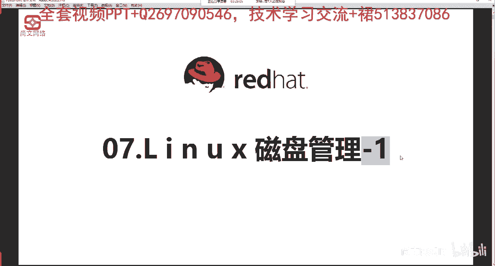
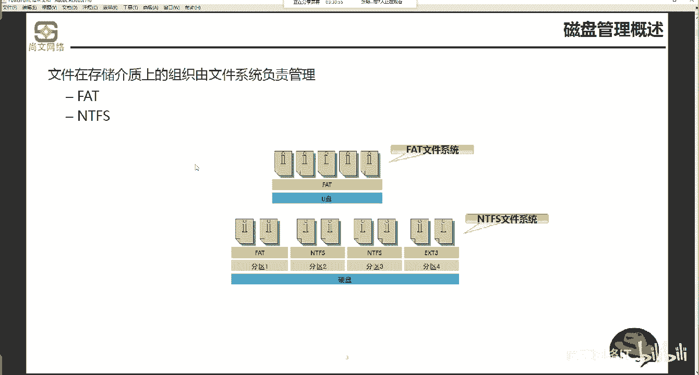
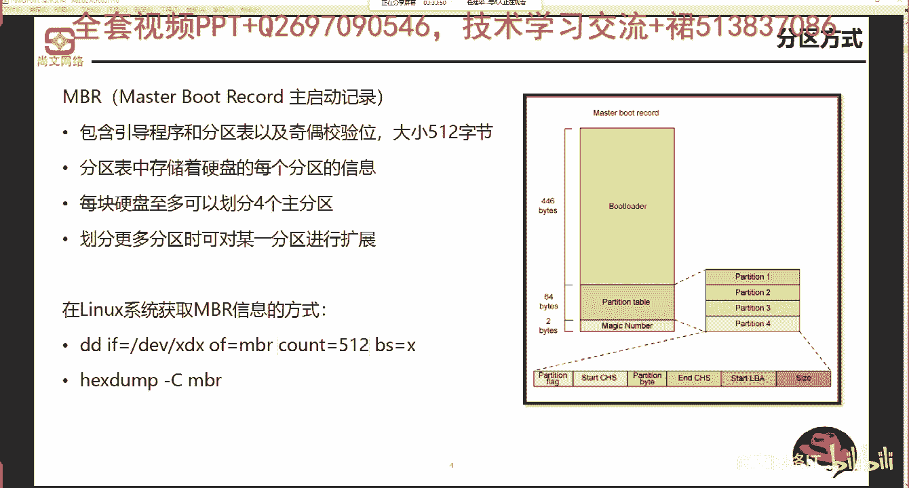
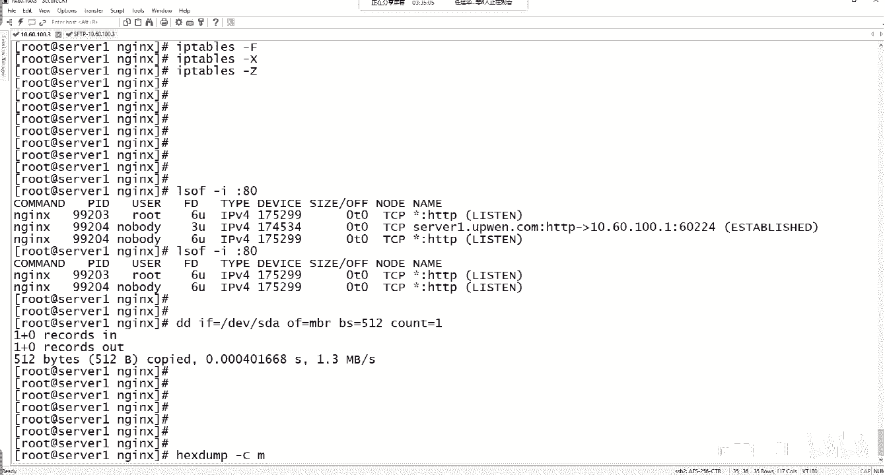
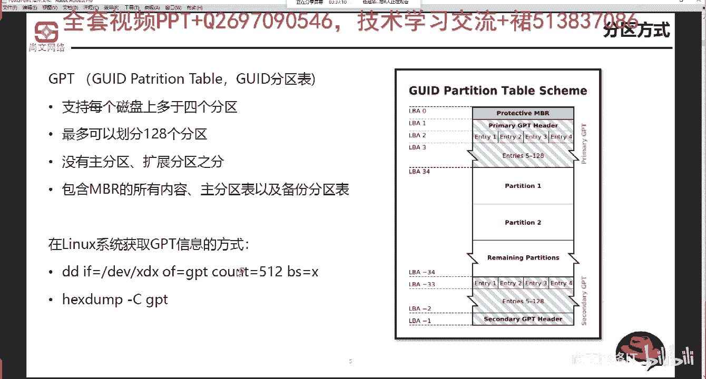
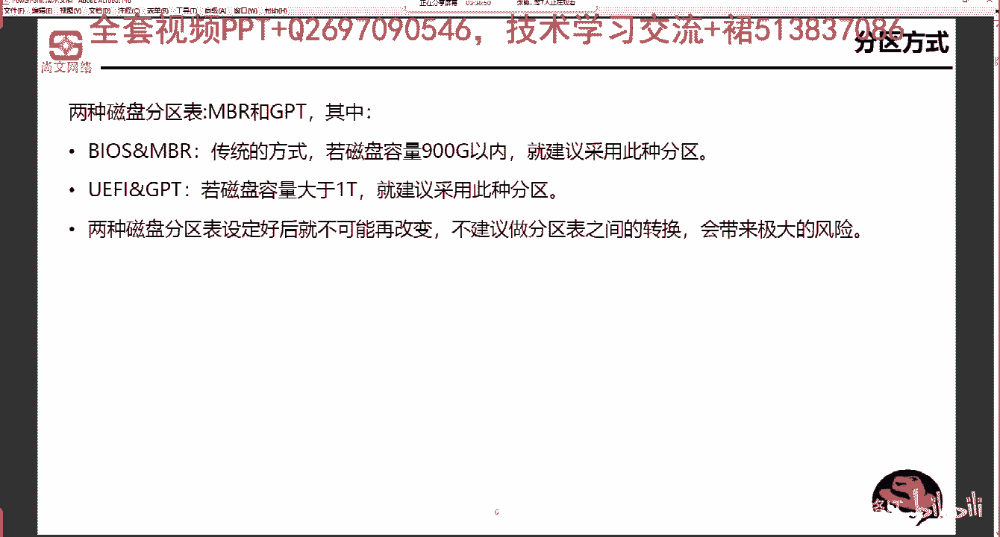

# Linux运维：RHCSA：磁盘分区类型(MBR与GPT) 🖥️💾



在本节课中，我们将学习磁盘分区的基础概念，重点了解两种主流的磁盘分区表类型：MBR和GPT。我们将探讨它们的工作原理、区别以及应用场景，并通过命令实践如何查看这些信息。

---

## 磁盘管理概述 📋

上一节我们介绍了课程的整体结构，本节中我们来看看磁盘管理的基础概念。文件系统是存储在介质上的数据组织方式，由操作系统负责管理。例如，Windows系统常见的文件系统有FAT和NTFS。



---

## 分区方式：MBR (主引导记录) 🔧

MBR，即主引导记录，是一种传统的磁盘分区方式。其结构要点如下：

*   **总大小**：512字节。
*   **引导程序**：前446字节为`boot loader`，负责系统启动引导。
*   **分区表**：随后64字节为`partition table`，即磁盘分区表。

由于分区表中每个分区的起止信息占用16字节，因此64字节最多只能定义4个主分区。如需更多分区，必须引入扩展分区，并在其中创建逻辑分区。

在Linux系统中，我们可以使用命令来获取MBR的信息。

以下是查看MBR信息的两种常用命令：

1.  **`dd`命令**：用途广泛，可用于复制数据、测试磁盘读写性能等。
    ```bash
    dd if=/dev/sda of=mbr.bak bs=512 count=1
    ```
    此命令将第一块磁盘(`/dev/sda`)的前512字节（即MBR）备份到当前目录的`mbr.bak`文件中。输出信息中的传输速度可用于初步判断磁盘性能。



2.  **`hd`命令**：以十六进制格式读取并显示MBR的详细信息。
    ```bash
    hd -C /dev/sda
    ```
    执行此命令后，在输出信息中可以看到包含`GRUB`等引导程序的相关内容。

---

## 分区方式：GPT (GUID分区表) 🆕



GPT，即GUID分区表，是一种更现代的分区方式。它与MBR的主要区别在于：

*   **无分区类型限制**：没有主分区、扩展分区、逻辑分区的概念。
*   **支持更多分区**：最多可创建128个分区。
*   **结构更健壮**：除了包含MBR的兼容信息外，还拥有主分区表和备份分区表，提高了数据安全性。

在Linux系统下，查看GPT分区信息的方法与查看MBR类似，同样可以使用`dd`或`hd`命令，只需指定对应的GPT分区设备即可。

---

## MBR与GPT的应用选择 ⚖️

上一节我们分别介绍了MBR和GPT，本节中我们来看看如何根据实际情况进行选择。分区表类型通常与系统固件配合使用：



*   **BIOS + MBR**：这是一种传统组合。建议在磁盘容量小于1TB（约900GB以内）时使用。
*   **UEFI + GPT**：这是一种现代组合。当磁盘容量大于1TB时，推荐使用此组合。

**重要提示**：磁盘分区表类型一旦设定，不建议随意转换。转换操作可能导致分区表丢失，造成数据无法访问的风险。如果必须更改，稳妥的做法是先备份数据，然后重新初始化磁盘并建立新的分区表。

---

## 总结 📝



本节课中我们一起学习了磁盘分区的两种核心类型：MBR和GPT。我们了解了MBR的512字节结构及其4个主分区的限制，也认识了GPT支持更多分区、结构更健壮的优点。最后，我们明确了根据磁盘大小和系统固件（BIOS或UEFI）来选择合适分区表类型的实践原则。掌握这些基础知识是后续进行磁盘分区、格式化及挂载操作的前提。