# Linux运维：RHCSA：RHCE8-04-1-4：通过终端工具连接Linux系统 🖥️

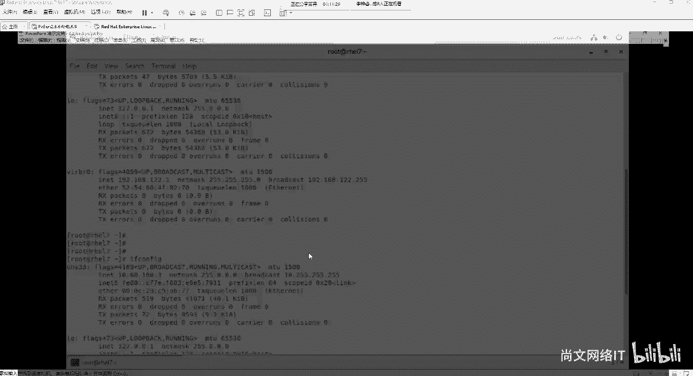

在本节课中，我们将学习如何使用终端工具远程连接到Linux系统。这是Linux系统管理员日常工作中最基础且重要的技能之一。我们将介绍几种常用的终端工具，并解释其背后的连接协议原理。

## 概述

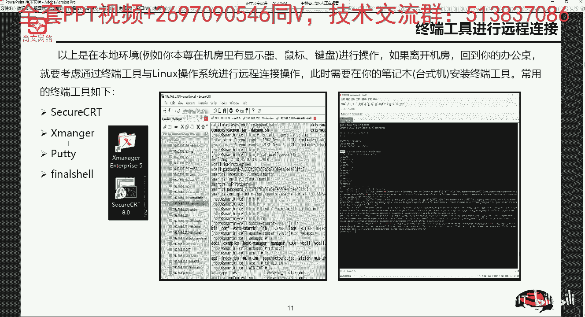

远程连接允许我们从一台计算机（客户端）操作另一台计算机（服务器）。对于Linux服务器管理，我们通常不会直接在服务器前操作，而是通过终端工具进行远程连接。本节将指导你完成这一过程。

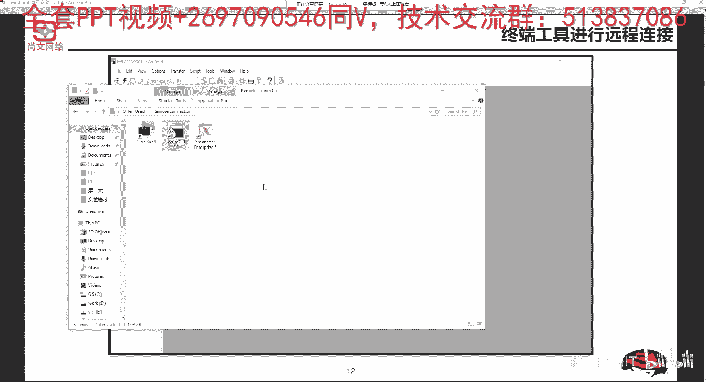

## 常用终端工具介绍

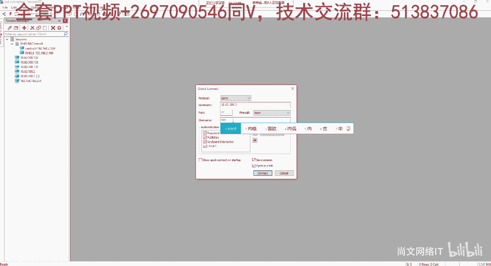

上一节我们了解了远程连接的概念，本节中我们来看看实现连接的具体工具。以下是几种常见的终端工具：

*   **SecureCRT**：一款功能强大的商业终端仿真软件，支持SSH、Telnet等多种协议。
*   **Xmanager**：一个软件套件，包含Xshell（终端连接工具）和XFTP（文件传输工具）等组件。
*   **PuTTY**：一个非常小巧、免费且开源的SSH/Telnet客户端。它是绿色软件，无需安装即可使用。

**注意**：SecureCRT和Xmanager通常需要安装，而PuTTY可以直接运行。

## 使用终端工具建立连接

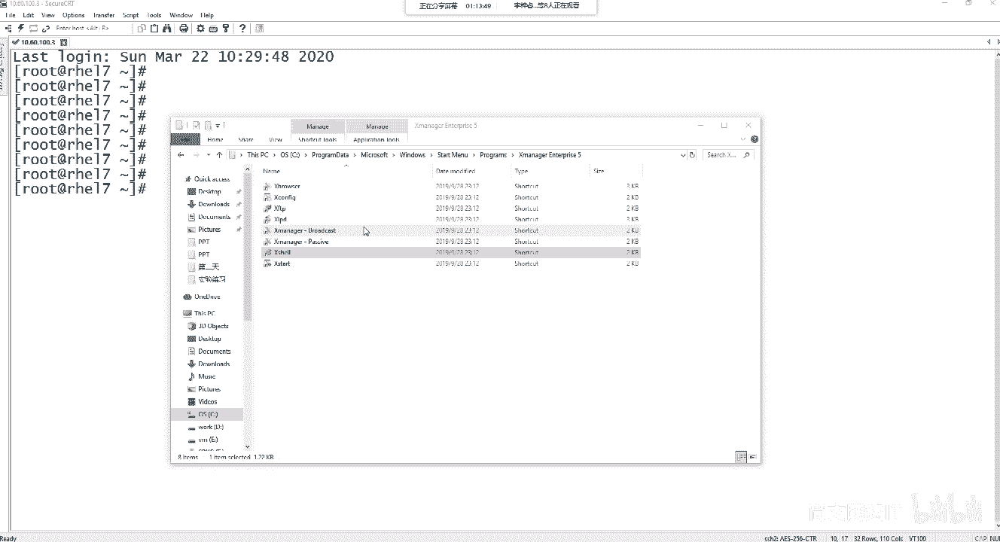

了解了工具类型后，我们来看看如何使用它们建立连接。这里以SecureCRT和Xshell为例进行说明。

### 使用SecureCRT连接

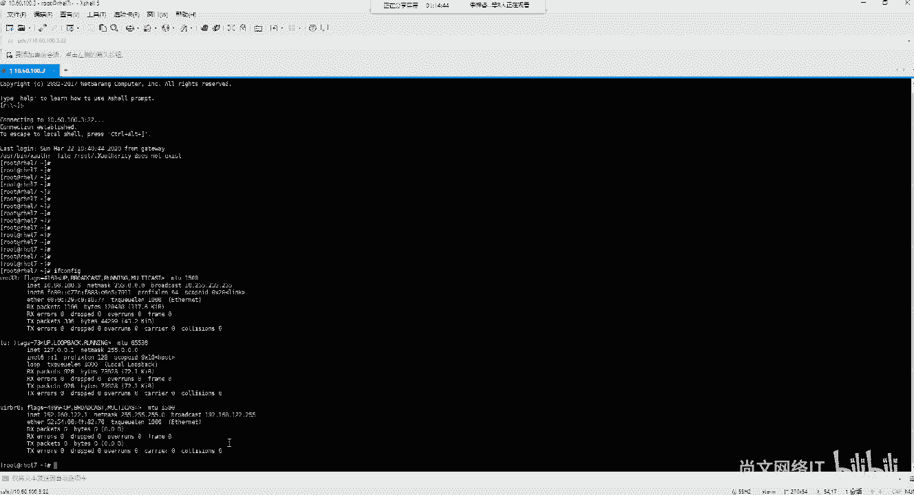

1.  打开SecureCRT软件。
2.  点击工具栏上的“快速连接”（Quick Connect）按钮（通常是一个闪电图标）。
3.  在弹出的对话框中，输入Linux服务器的IP地址（例如 `10.60.100.3`）和用户名（例如 `root`）。
4.  点击“连接”（Connect）。
5.  首次连接时，会弹出主机密钥指纹确认窗口，点击“接受并保存”（Accept & Save）。
6.  输入对应用户的密码，即可成功登录。
7.  登录后，可以按住 `Ctrl` 键并滚动鼠标滚轮来调整终端字体大小。

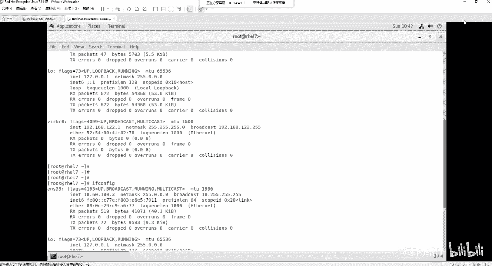

### 使用Xshell连接

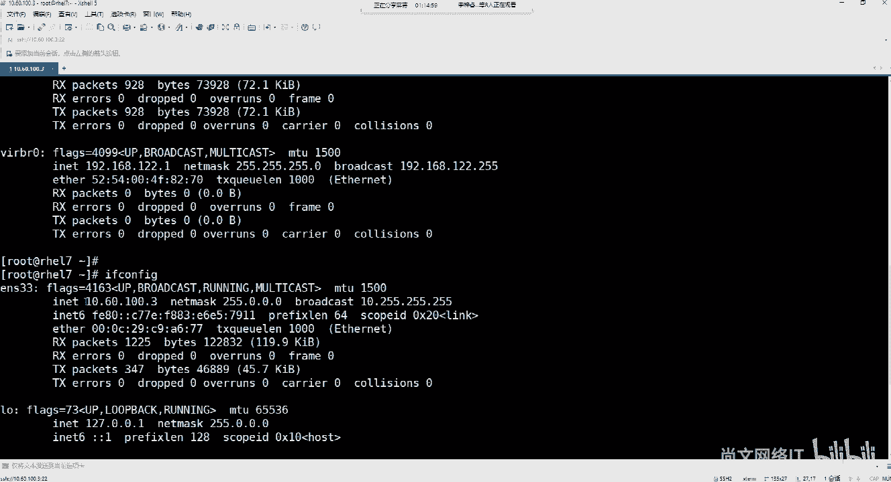

1.  打开Xshell软件。
2.  点击菜单栏的“文件”->“新建”，或直接点击工具栏的“新建会话”按钮。
3.  在“连接”设置中，输入Linux服务器的IP地址（例如 `10.60.100.3`）。
4.  点击“用户身份验证”，输入用户名和密码。
5.  点击“连接”。
6.  同样，首次连接需要确认主机密钥，选择“接受并保存”。
7.  连接成功后，即可在终端中执行命令，例如使用 `ifconfig` 命令查看网络配置。

## 连接协议：SSH

我们通过终端工具成功连接了服务器，那么背后的技术原理是什么呢？这主要依赖于SSH协议。

**SSH**（Secure Shell）是一种为远程登录会话和其他网络服务提供安全性的协议。它比传统的Telnet协议更安全可靠。SSH客户端支持多种操作系统，包括Linux、Windows和macOS。

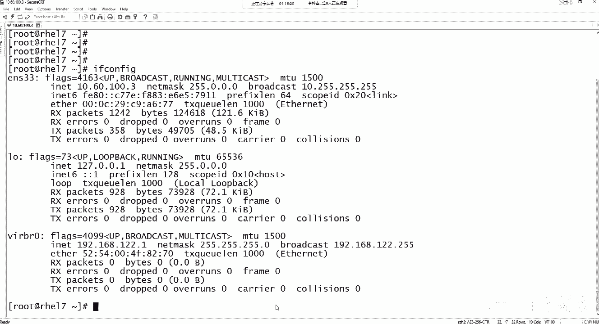

默认情况下，SSH服务使用 **TCP协议的22号端口** 进行通信。

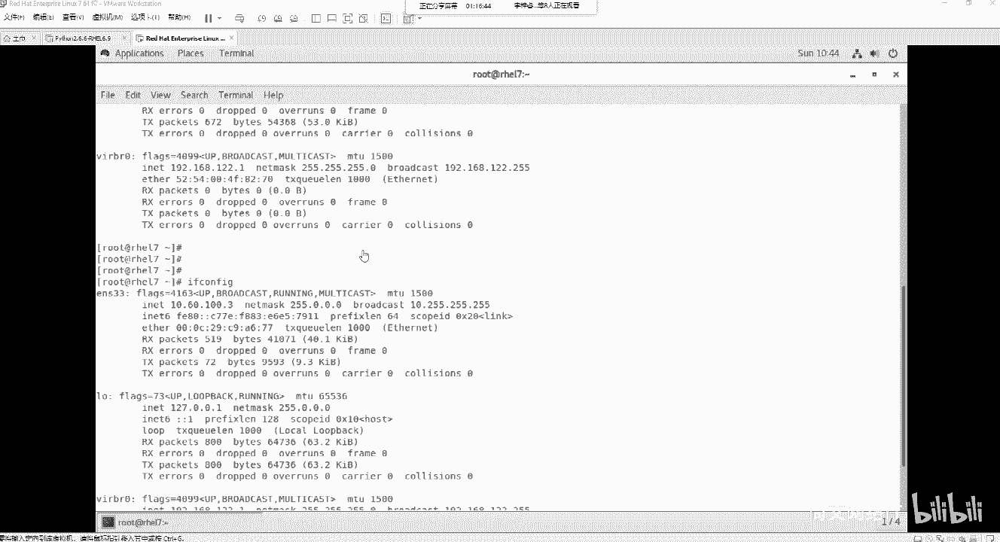

## 验证SSH服务

在通过终端工具连接之前，如何确认服务器端的SSH服务是正常开启的呢？我们可以使用一个简单的命令来测试。

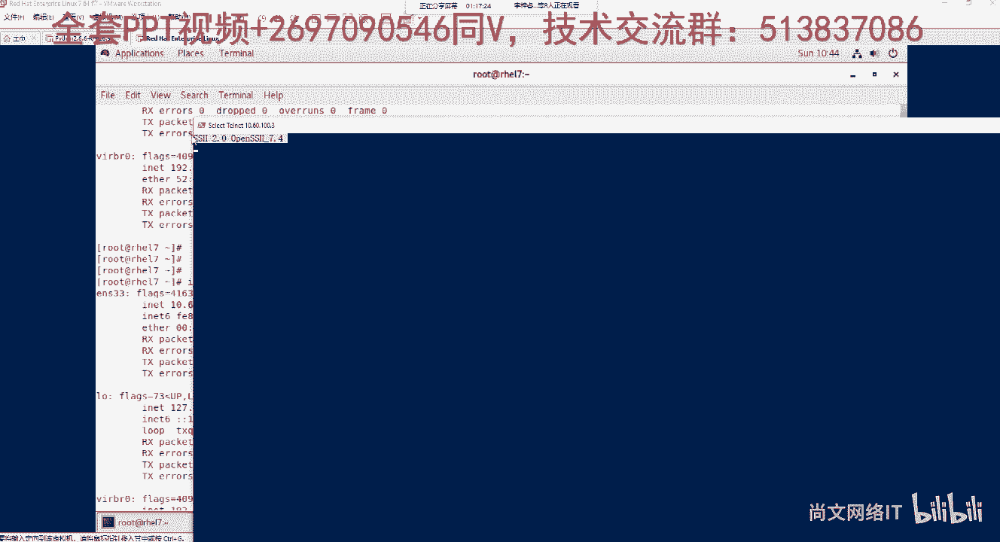

在客户端（例如Windows电脑）的命令提示符（CMD）或PowerShell中，可以使用 `telnet` 命令来探测服务器的22号端口是否开放。

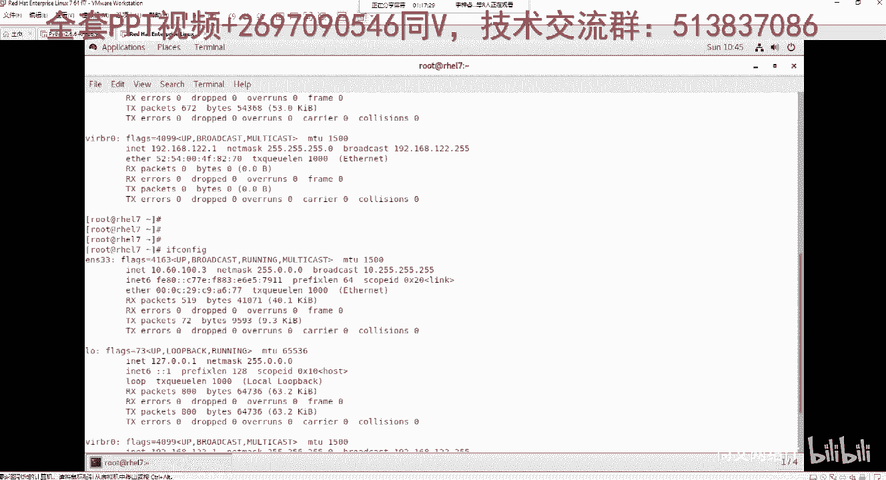

```bash
telnet 10.60.100.3 22
```

如果连接成功并显示类似 `SSH-2.0-OpenSSH_7.4` 的信息，则证明目标服务器的SSH服务正在运行，可以通过终端工具进行连接。

## 总结

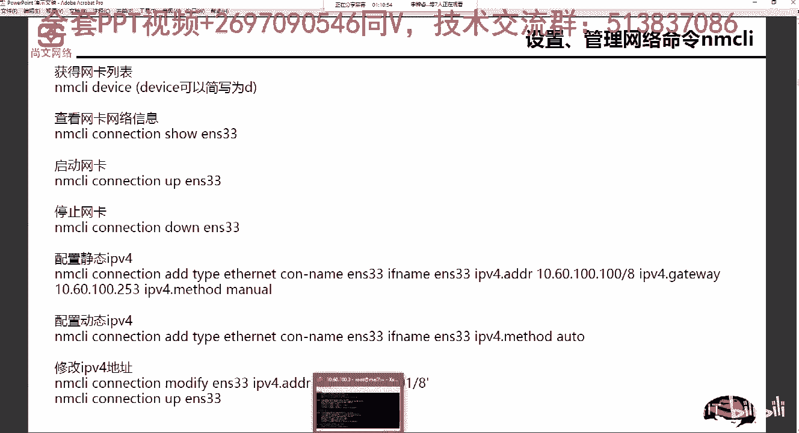

本节课中我们一起学习了如何通过终端工具远程连接Linux系统。我们介绍了SecureCRT、Xshell和PuTTY等常用工具的使用方法，理解了连接所依赖的SSH安全协议及其默认端口（22）。最后，我们还学会了使用 `telnet` 命令来验证SSH服务是否可用。掌握这些是进行后续Linux系统管理和运维操作的基础。