Linux系统管理：04-4-3：系统关机和重启命令

在本节课中，我们将要学习Linux系统中用于关机和重启的核心命令。这些命令是系统管理的基础操作，掌握它们对于维护系统稳定性和执行计划任务至关重要。

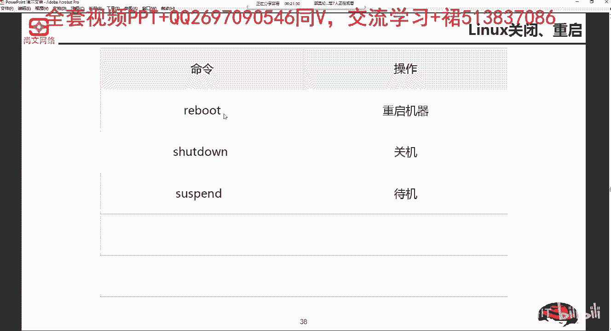

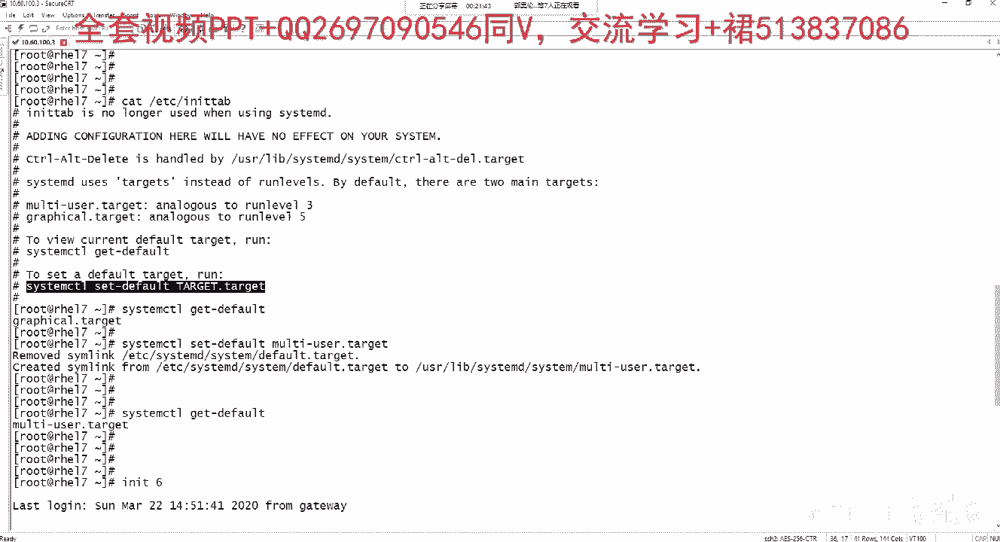

上一节我们介绍了系统运行级别，本节中我们来看看如何安全地关闭或重启系统。

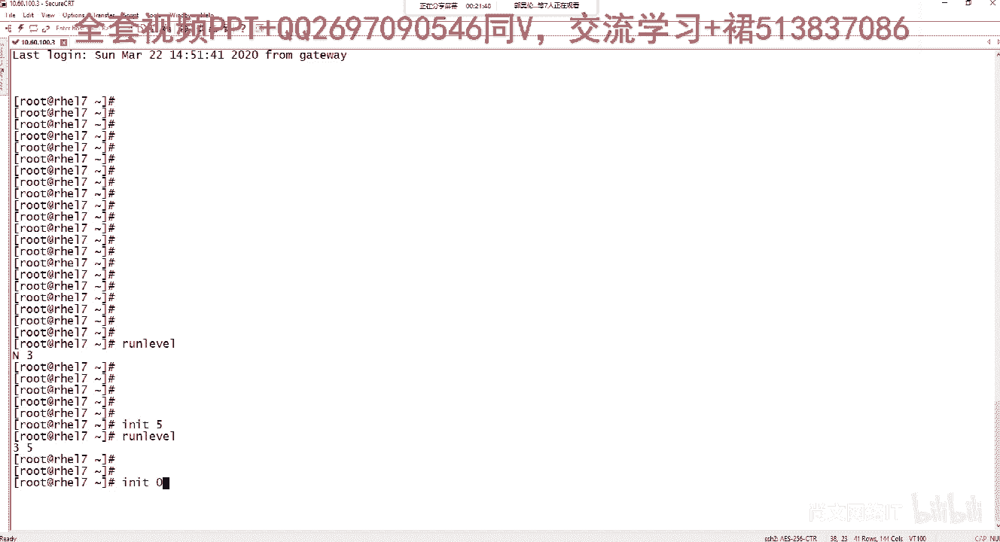

---

### 基本命令

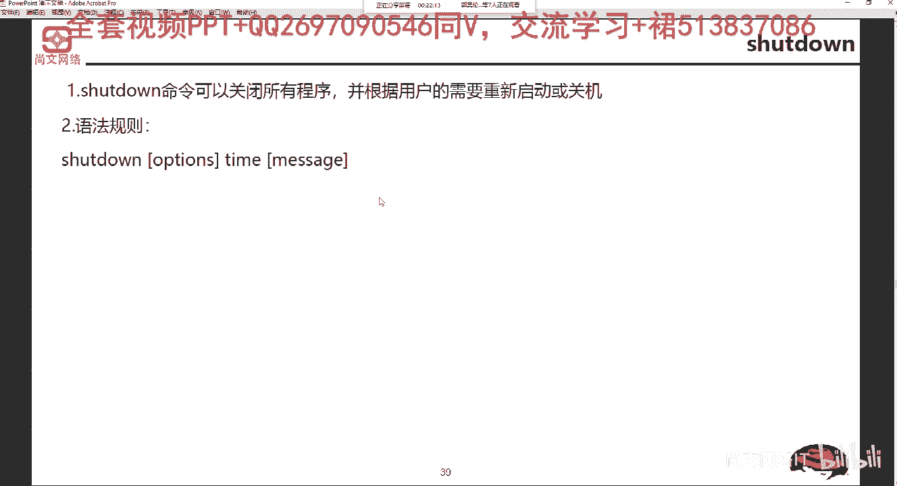

Linux系统提供了几个直接的命令来执行关机和重启操作。

*   `reboot`：用于立即重启系统。
*   `shutdown`：功能强大的关机命令，可以执行关机、重启并设置延迟时间。
*   `poweroff`：用于立即关闭系统并切断电源（如果硬件支持）。

此外，还可以使用 `init` 命令配合运行级别来实现相同功能：
*   `init 6`：等同于 `reboot`，用于重启系统。
*   `init 0`：等同于 `poweroff`，用于关闭系统。

---

### shutdown命令详解

`shutdown` 命令功能最为丰富，它可以安全地关闭所有程序，并根据需要执行重启或关机操作。其基本语法规则如下：

**`shutdown [选项] [时间] [警告信息]`**

以下是 `shutdown` 命令的一些常用参数和选项：

*   **`-r`**：系统关闭后重新启动。例如，`shutdown -r now` 表示立即重启。
*   **`-h`**：系统关闭后停止运行（关机）。例如，`shutdown -h now` 表示立即关机。
*   **`-k`**：并非真正关机或重启，只是向所有已登录用户发送警告信息。
*   **`-c`**：取消一个已计划的关机或重启任务。
*   **`时间`**：指定执行操作的时间。可以设置为 `now`（立即），或格式为 `+m`（m分钟后），或 `hh:mm`（具体的小时和分钟）。
*   **`警告信息`**：发送给所有用户的提示信息。

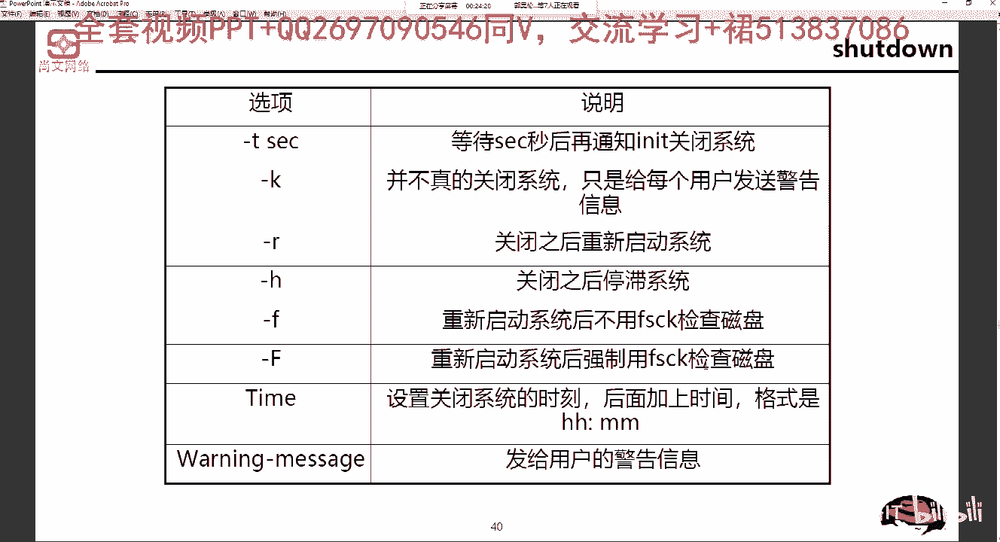

---

### 命令应用示例

为了更好地理解，我们来看几个具体的命令示例：

*   **`shutdown -h now`**：系统立即关机。
*   **`shutdown -h 21:30`**：系统将在今晚21点30分自动关机。
*   **`shutdown -h +10`**：系统将在10分钟后自动关机。
*   **`shutdown -r now`**：系统立即重启。
*   **`shutdown -r +10 “System will reboot for maintenance.”`**：系统将在10分钟后重启，并向所有用户发送提示信息“System will reboot for maintenance.”。

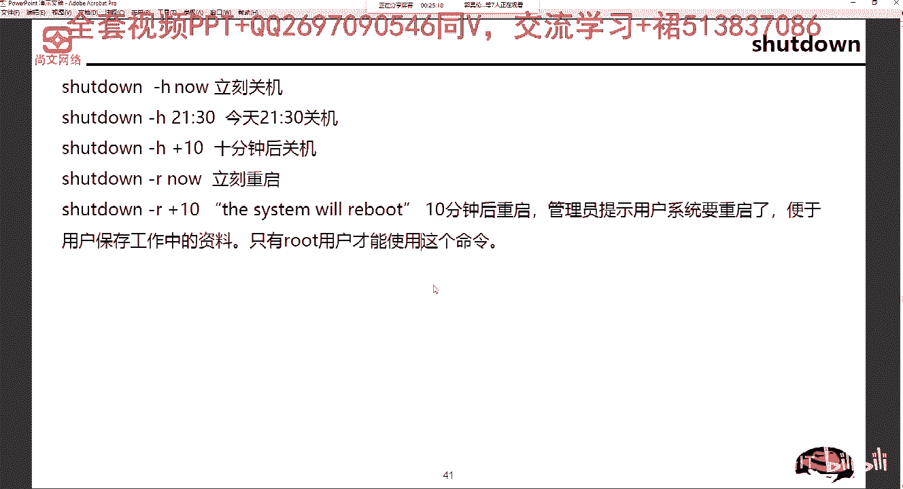

> **注意**：默认情况下，只有 `root` 用户才能执行 `shutdown` 命令。

---

### 相关管理操作

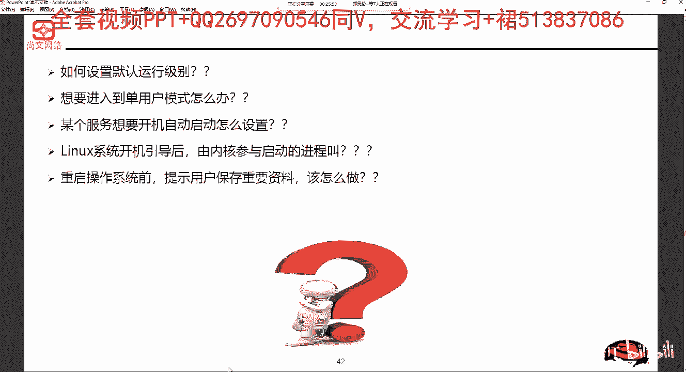

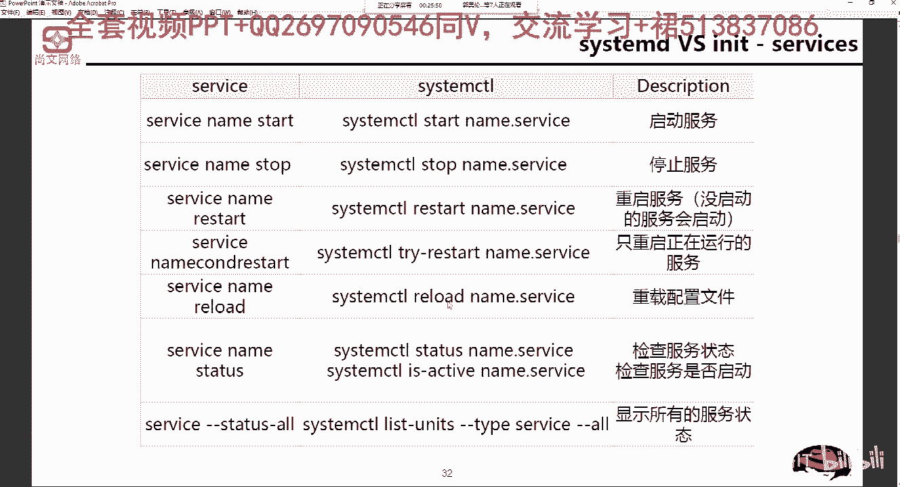

了解关机和重启命令后，这里补充几个相关的系统管理知识点，它们通常在配置系统启动行为时用到。

*   **设置默认运行级别**：可以使用 `systemctl set-default` 命令来设置系统启动后进入的默认目标（相当于传统运行级别）。
*   **进入单用户模式**：在需要系统维护时，可以通过命令 `init 1` 或修改启动参数进入单用户模式（救援模式）。
*   **设置服务开机自启**：在RHEL/CentOS 7及更高版本中，使用 `systemctl enable [服务名]` 命令可以让指定服务在系统启动时自动运行。在老版本（如6.x）中，对应的命令是 `chkconfig [服务名] on`。
*   **系统初始化进程**：在传统的SysV init系统（如RHEL 6.x）中，内核启动后运行的第一个用户空间进程是 **`init`** 进程。在现代系统（使用Systemd）中，这个进程是 `systemd`。

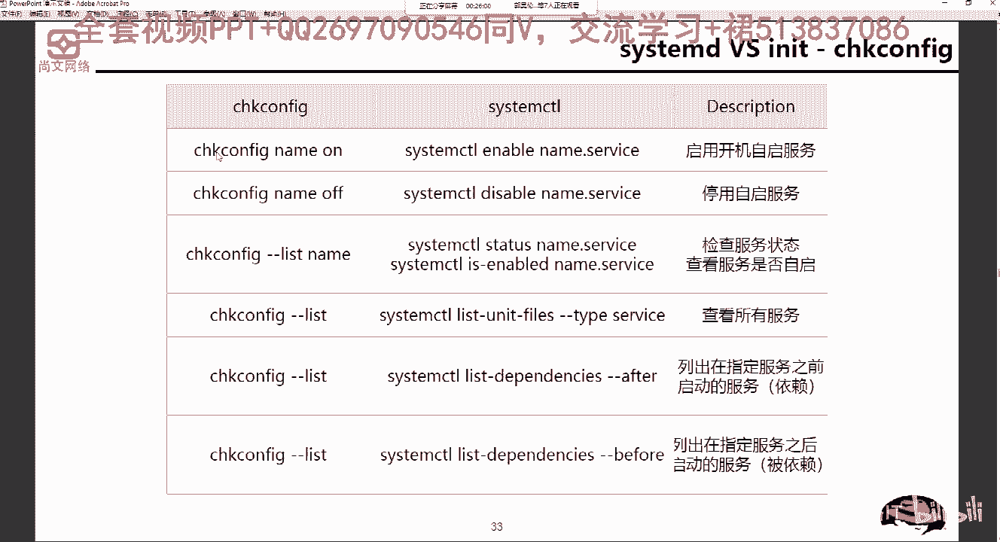

---

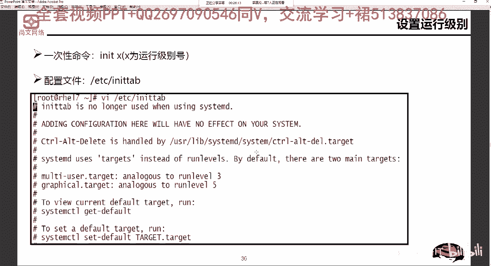

### 实践场景：重启前通知用户

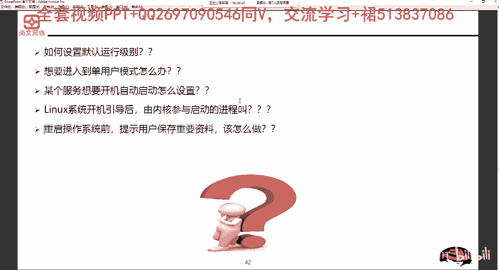

在实际运维中，直接重启服务器可能会影响其他用户的工作。因此，在重启前通知用户保存资料是一个好习惯。

**操作方法**：使用 `shutdown -r +5 “The system will reboot in 5 minutes. Please save your work.”` 命令。这会在5分钟后重启系统，并提前向所有登录用户广播警告信息，提醒他们保存重要资料。

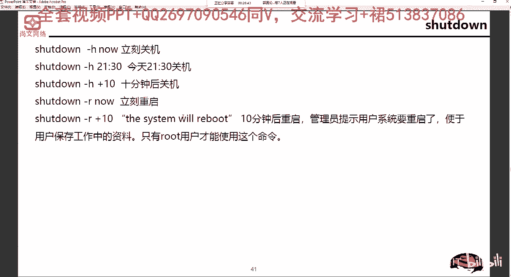

---

本节课中我们一起学习了Linux系统关机和重启的核心命令。我们掌握了 `reboot`、`poweroff` 和功能强大的 `shutdown` 命令的基本用法及常用参数。此外，还了解了与之相关的运行级别设置、服务自启配置等管理操作，以及如何在执行重启前友好地通知用户。这些是每位Linux系统管理员都必须熟练掌握的基础技能。