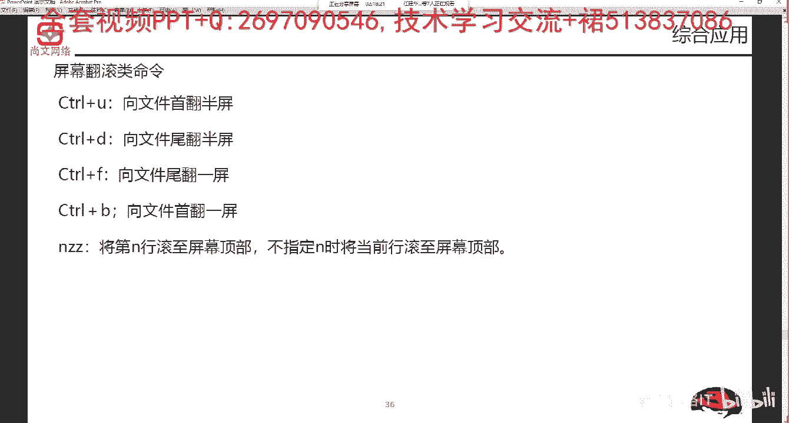
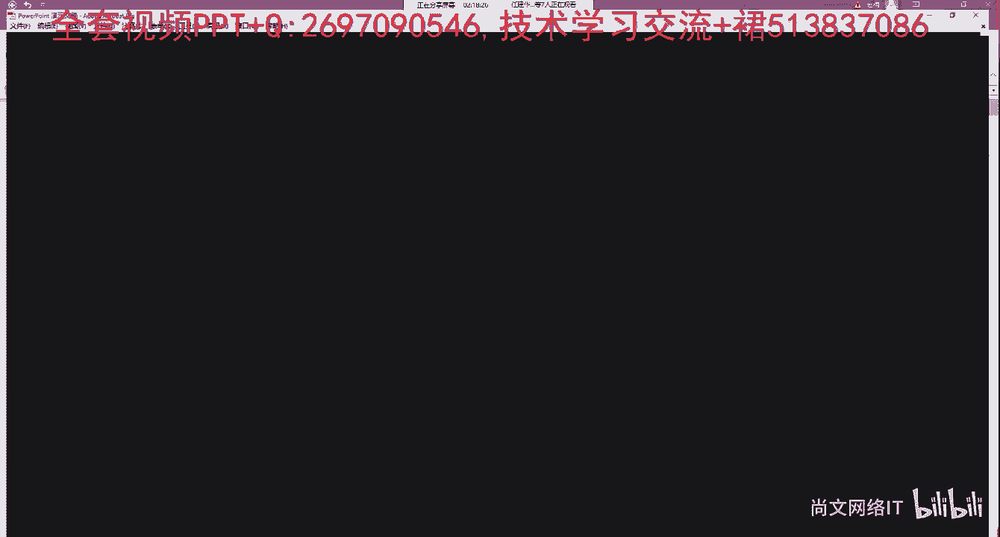
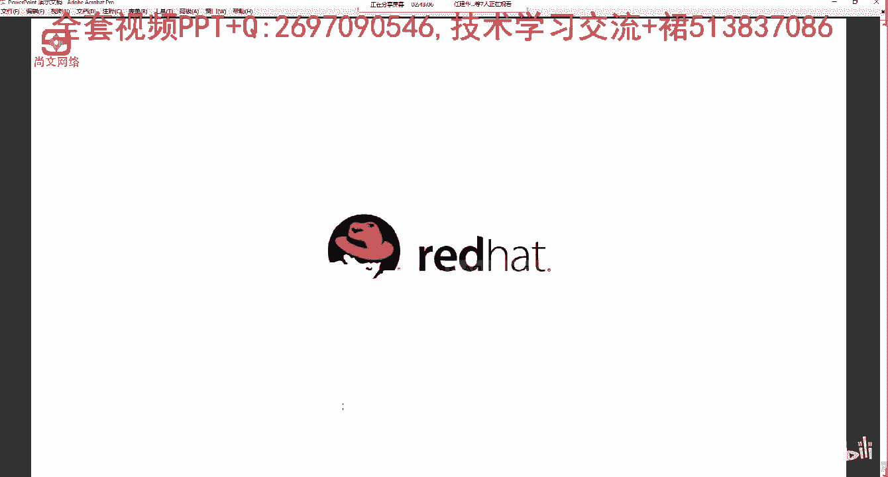

# Linux运维：RHCSA：RHCE8-05-4-2 vi编辑器应用-2 🖥️

## 概述
在本节课中，我们将深入学习vi编辑器的进阶操作，包括屏幕翻滚、多种插入模式、寄存器操作、删除、搜索以及行号设置等实用技巧。掌握这些命令将帮助你更高效地编辑和管理文本文件。

---

## 屏幕翻滚操作 🔄
上一节我们介绍了vi的基本模式，本节中我们来看看如何在大文件中快速移动光标。当文件行数过多时，可以使用以下组合键进行屏幕翻滚。

以下是屏幕翻滚类命令：
*   **`Ctrl + D`**：从当前光标位置**向下**翻滚**半屏**。
*   **`Ctrl + F`**：从当前光标位置**向下**翻滚**一整屏**。
*   **`Ctrl + U`**：从当前光标位置**向上**翻滚**半屏**。
*   **`Ctrl + B`**：从当前光标位置**向上**翻滚**一整屏**。

---

## 进入插入模式 ✏️
了解了如何移动视图后，我们来看看如何向文件中添加内容。从编辑模式进入插入模式有多种方式，它们决定了光标开始插入的位置。

以下是进入插入模式的命令：
*   **`i`**：在**当前光标前**插入。
*   **`I`**：将光标移至**当前行行首**并插入。
*   **`a`**：在**当前光标后**插入。
*   **`A`**：将光标移至**当前行行尾**并插入。
*   **`o`**：在**当前行下方**新开一行并插入。
*   **`O`**：在**当前行上方**新开一行并插入。

完成插入操作后，按 **`ESC`** 键即可从插入模式返回到编辑模式。

---

## 寄存器操作（复制与粘贴）📋
有时我们需要复制多行或特定字符。vi编辑器使用寄存器（可理解为临时存储区）来实现复制粘贴功能。

以下是寄存器操作命令：
*   **`nYY`** 或 **`nyy`**：复制当前行及其下方的 **`n-1`** 行到寄存器。例如，`3yy` 复制3行。
*   **`nYW`** 或 **`nyw`**：复制从光标处开始的 **`n`** 个单词到寄存器。
*   **`p`**：将寄存器中的内容**粘贴**到当前光标之后。

**操作示例**：复制3行并粘贴。
1.  在编辑模式下，输入 `3yy`，屏幕底部会提示“3 lines yanked”。
2.  将光标移动到目标位置。
3.  按 `p` 键，即可将复制的3行内容粘贴出来。

---

## 删除操作 🗑️
编辑文件时，删除是常见操作。vi提供了不同粒度的删除命令。

以下是删除类命令：
*   **`ndd`**：删除当前行及其下方的 **`n-1`** 行。例如，`3dd` 删除3行。
*   **`x`**：删除**光标所在处**的字符。
*   **`X`**：删除**光标前**的字符。
*   **`dw`**：删除从光标处开始的一个单词。
*   **`D`** 或 **`d$`**：删除从光标处到**行尾**的所有内容。
*   **`d0`**：删除从光标处到**行首**的所有内容。

最常用的删除命令是 `ndd`（按行删除）和 `x`（按字符删除）。

---

## 搜索与行号设置 🔍
在大型文件中查找内容或定位特定行非常有用。

### 搜索
在编辑模式下，输入以下命令进入搜索：
*   **`/pattern`**：从光标位置**向下**（向文件末尾方向）搜索“pattern”字符串。按 `n` 键跳转到下一个匹配项。
*   **`?pattern`**：从光标位置**向上**（向文件开头方向）搜索“pattern”字符串。按 `n` 键跳转到上一个匹配项。

### 设置行号
在命令模式（按 `:` 进入）下，可以显示或隐藏行号，便于精确定位。
*   **`:set number`** 或 **`:set nu`**：**显示**行号。
*   **`:set nonumber`** 或 **`:set nonu`**：**隐藏**行号。

---

## 命令模式与保存退出 💾
所有文件级别的操作都需要在命令模式下完成。按 `:` 键可从编辑模式进入命令模式。

以下是常用的保存退出命令：
*   **`:w`**：保存文件。
*   **`:q`**：退出vi（如果文件有修改未保存，会提示错误）。
*   **`:wq`** 或 **`:x`**：保存并退出。
*   **`:q!`**：**不保存**修改，强制退出。
*   **`:wq!`**：强制保存并退出（用于处理只读文件等特殊情况）。

---

## 综合应用示例
让我们通过几个实际问题来巩固所学命令：

1.  **删除某一行**（例如第500行）：
    *   在命令模式下输入 `:500`，光标跳至第500行。
    *   输入 `:set nu` 确认行号。
    *   在编辑模式下，按 `dd` 即可删除该行。

2.  **搜索并定位**：
    *   在打开文件时即可搜索：`vi /path/to/file +/listen`
    *   或在编辑模式下输入 `/listen` 进行搜索。

3.  **复制特定行并粘贴**：
    *   将光标定位到起始行（如第200行）。
    *   输入 `10yy` 复制10行。
    *   将光标移动到目标行（如第800行）。
    *   按 `p` 粘贴。

---

## 总结
本节课我们一起深入学习了vi编辑器的核心操作。我们掌握了：
1.  使用 `Ctrl+D/F/U/B` 进行屏幕翻滚。
2.  使用 `i, I, a, A, o, O` 在不同位置进入插入模式。
3.  使用 `nyy` 和 `p` 进行复制粘贴。
4.  使用 `ndd` 和 `x` 进行删除。
5.  使用 `/` 和 `?` 进行搜索，使用 `:set nu` 显示行号。
6.  使用 `:wq` 和 `:q!` 保存或退出文件。

vi编辑器是Linux系统管理的基石工具，虽然初期学习曲线较陡，但熟练掌握后能极大提升文本处理效率。请务必多加练习，形成肌肉记忆。