# Linux运维／RHCSA／红帽认证／RHCE8-04-1-4 通过终端工具连接Linux系统【尚文网络】 - P1 - 尚文网络IT - BV1ep4y1v7Uk

也。

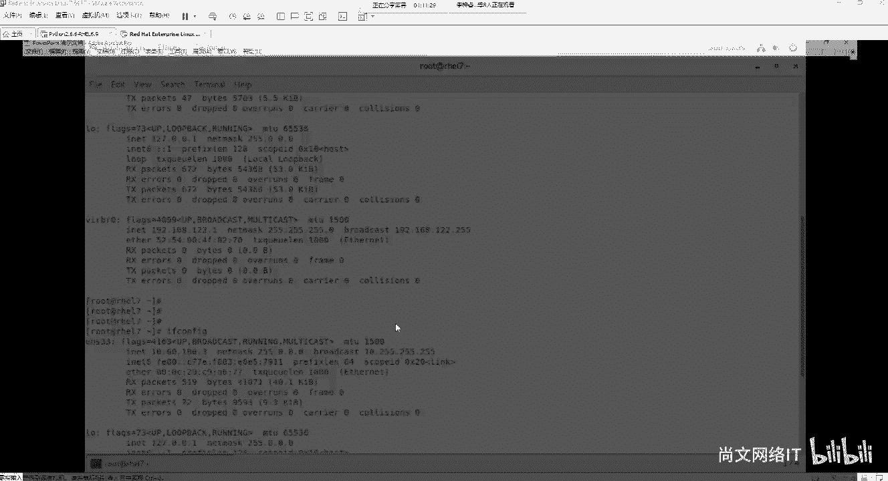

这个先一过啊，我们可以通过终端工具进行远程连接了啊。终端工具啊，之前给大家这个网盘里面有一个是secure CRT，一个是这个X manager是吧？啊，这个我们常用的基本上就是这两种。

当然也可能会用到一些其他的，比如说putty。或者是发 sale，你portty是个非常小巧的一个工具，而且它是一个。呃，绿色的就是不写注册表的，免安装的那种，你直接双击打开就能用。

那么你的这个CRT也好，那个X manager也好，这个东西你需要去安装啊，这个是需要去安装的。

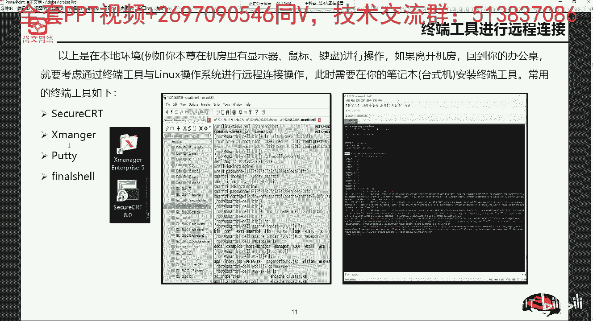

那么我们安装，那么通过终端工具之后呢。然后我们就可以。新建一个连接了是吧？比如说我们以CRT为例啊，是以CRT为例。我们新建一个连接。那我们打开1个CRT，我们来看一下。嗯。这个地方啊打开1个CRT。

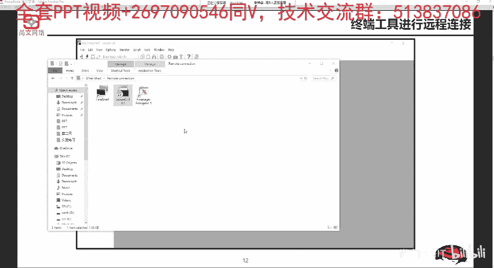

好，我们可以点击这个位置啊，有一个quick connect啊，有一个quick connect，一个闪电的一个标志。好，我们写就10点60点100。3。然后user nameroot。

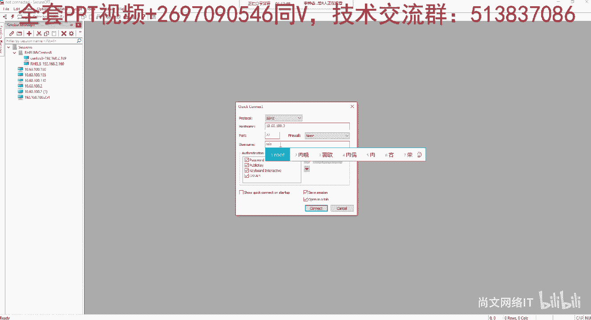

Conneect。然后建立起的这个呃。K的啊这么一种这个通过。122和121的这种哈希啊，包括MD5哈希出来这么一种这个这个密钥。然后我们可以敲。密码啊，你也可以去s一下password啊，点击OK好。

然后呢，我们觉得如果屏幕小，我们按住左边的ctrl，然后滑动我们的滑动我们鼠标的滚轮啊，这个地方就可以。把我们的这个。字体改的大一点是吧，或者是改的小一点。好了。那么我们现在通过这个终端工具啊。

通过终端工具。进行这个连接，或者是我们再打开一个，比如说X manager啊，X manager里面有很多这种组件是吧？比如说有XFTP，有X shell，我们可能会常用的就是X shell啊。

叫叉 shellll。我们也通过它进行一个连接。

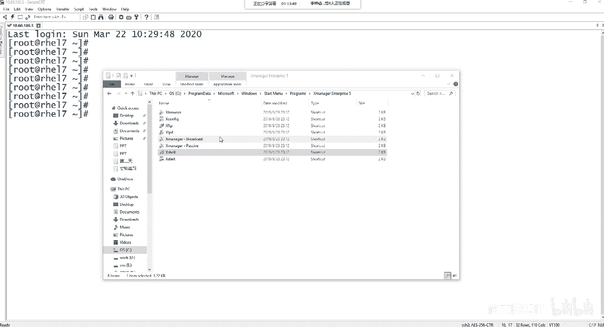

我们在这个地方去新建一个啊，比如说。10点60点100点。然后主机10点60点100点。决定。然后连接。也是一样的道理是吧？主机密钥的指纹。你可以选一次性接收或者是这个。啊。

这个这个有永久的去这个保存啊，当然还有一些其他的方式啊，比如说通过这个建立私钥公钥这种方式。好，我们敲一个用户名啊，我们可以选择技术用户名，然后再敲一个这个密码。好，确定。那么这样的话。

我们是备也可以通过这个。插效啊来进行这个远程终端。比如说我们敲一个命令啊，if confi。这边我们看到了呢，就跟我们在我们的物理级啊做这种操作是一样的。

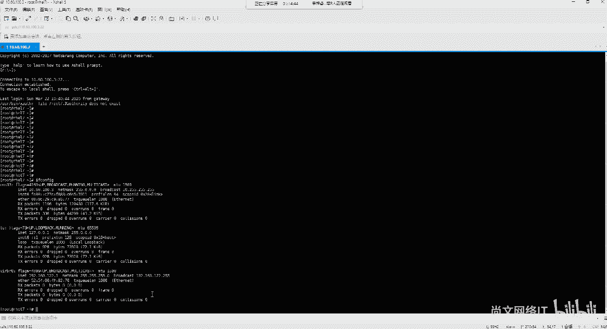

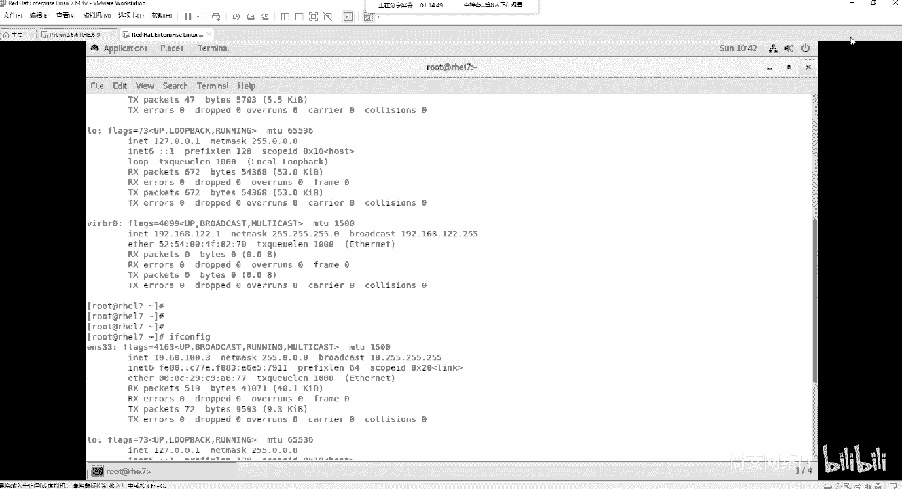

当然你也可以去调整一下我们的大小是吧？比如说改的大一点啊。可以考贝个。我们能看到我们的IP地址10。60。100。3，对吧？那么CRT也是一样的啊，靠个。

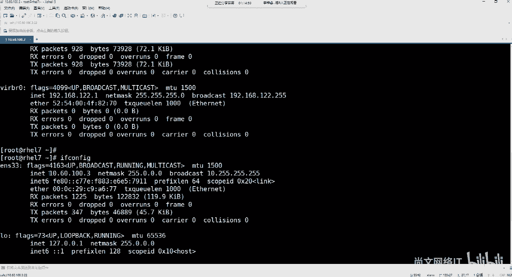

对吧10点60。100。3。这样的话，我们可以通过终端啊，通过不同的这种终端。来进行这个原审连接了。那我们通过远程连接的这种协议啊，基基本上就是通过叫SSH啊，相信大家这个都不陌生啊，SSH。

seecre share host啊这种缩写是由ITF的网络小组来制定的。那么SSH呢是为了建立在应用从技础上的一种安全协议。他肯定是要比tnet啊TELNET啊，比tnet。比较安全要可靠，对吧？

就专门用来做于远程登录规划和其他网络服务提供安全安全性的一个协议。那么呃SSH呢，它的客户端呢也是多种平台的啊，比如说unux、linuxwindows。也可以都用。通常默认情况下。

SS1式协议是需要用到一个叫TCP的22的端口号啊，TCP的1个22的端口号。啊。那么我们来来去来看，如果我们通过。这个客户端啊或者通过我们的终端工具来和远端的一台linux服务器进行连接。也就是说。

首先我们要通过SS10进行这个链接。那么SS链接的前提是什么呢？是我们的linux的。

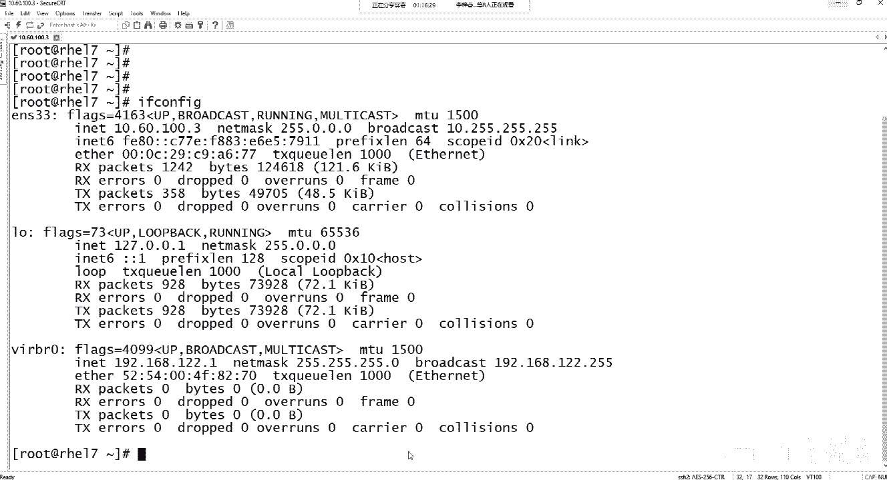

这个机器的。啊，一定要有。就是一定要开通啊，SSE是servver的这种服务。也就是说它上面会开TCP的22账号。那么我们怎么去验证一下啊，我们打开在我们的宿主机是吧？我们就t敲tnet。

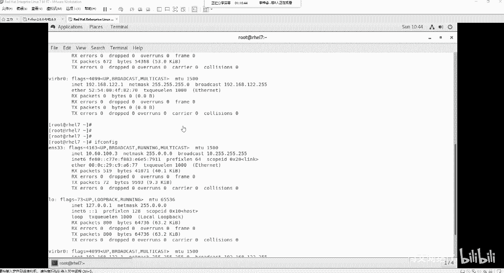

比如说10点60点100点。22啊，通过这样的一种方式。调 letter。10点60点100。322。回出。好，当你看到这个SSA是2。0open SSA是下划线7。4的时候，你就发现你就知道了。

他已经。就通过tnet啊，是可以判断出远端的这个10点60。100。3，它是开了啊这个SSA服务的这么一种协议。

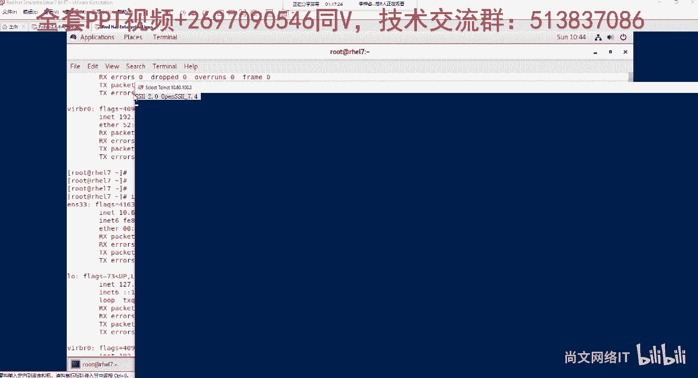

大家要明白啊，通过通过tnet。

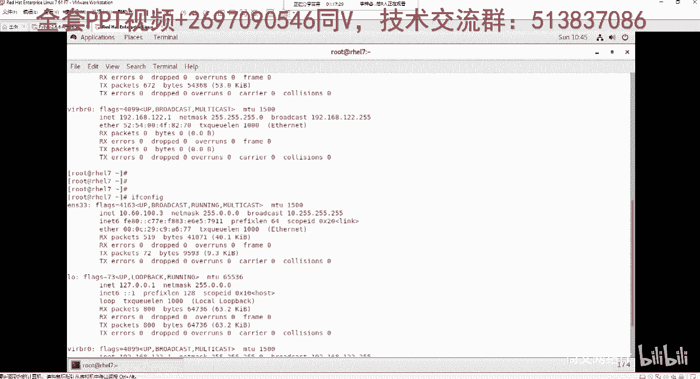

所以我们才可以通过终端工具和我们的linux的讯机啊进行这个连接。他需要又用用到了1个22的一个端号。那我们。比如说。windows的。客户端。通过这个条命令是吧，标net。10点60点100。

322啊，通过这样的一个写法啊来去判断出。他是否。可以和linux的远端22啊进行这个通信。那么第三种我们再回个头来说第三种啊，第三种。第三种的这个网络。啊，是叫NMC1I啊，这又是另外一个工具啊。

NMC1I。然后NMCRI呢是。就是传命量了啊，它不像这个NMTUI啊，TUI就知道了是吧？TUI是带图形的种啊，你可以你可以按左右键上下键进行这个选择。然后这个NMTY呢。

就是我们需要完全的通过这个命令来进行这个。对于一些网卡来进行这个配置。啊，对他进行来这个配置。

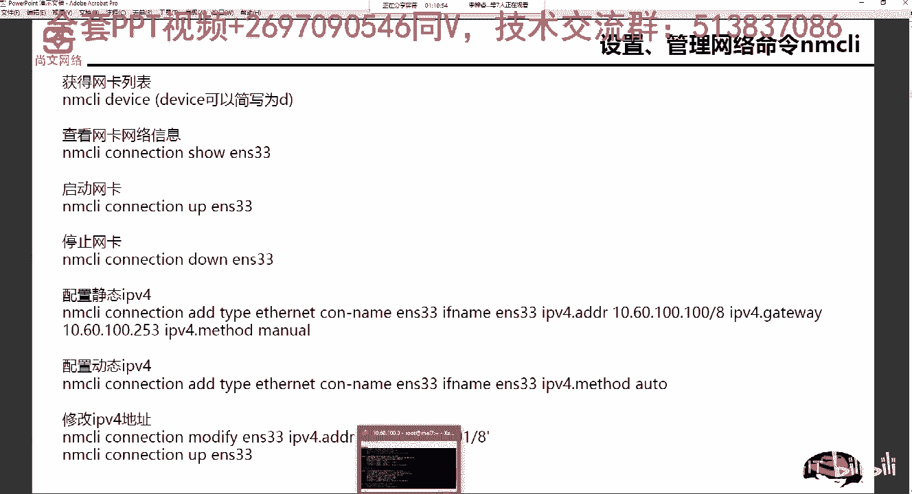