# Linux运维／RHCSA／红帽认证／RHCE8-04-4-3 Linux系统关机和重启的命令【尚文网络】 - P1 - 尚文网络IT - BV1sZ4y1K7YA

好，这个关闭重启啊，这就很简单了是吧？reboot啊，重启杀 down关机啊，sphone待机。那么你与此同时，我们可以说什么IIT空格6就是重启是吧？IIT空格零就是我们的关机。

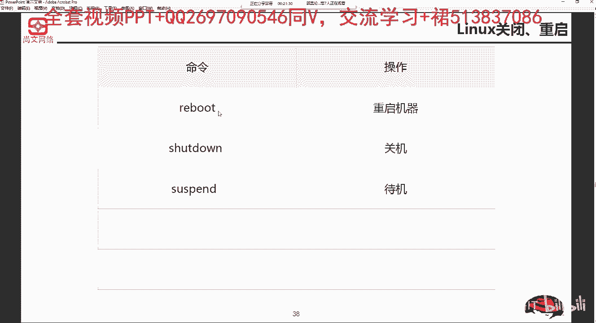

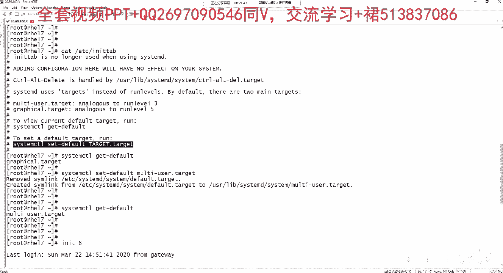

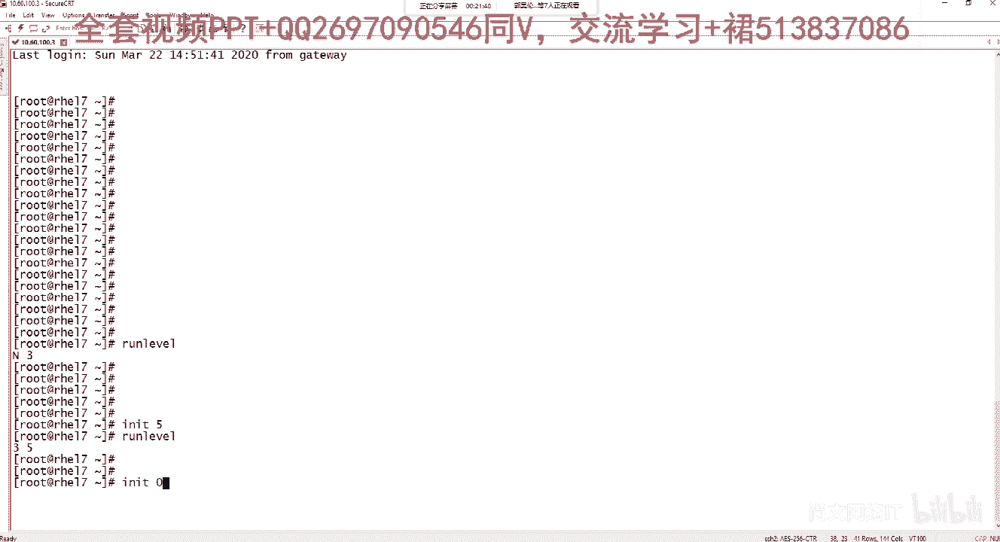

🎼可以的。那么关于这个杀档啊，杀档，我们详细来说一说啊，杀档有一些这个语法的一些参数。杀档呢可以关闭所有的程序，也可以根据需要。进行这个重启。它的语法规则是这个，然后杀档。

然后有一些参数跟上时间或者是这个message啊，或者是消息。

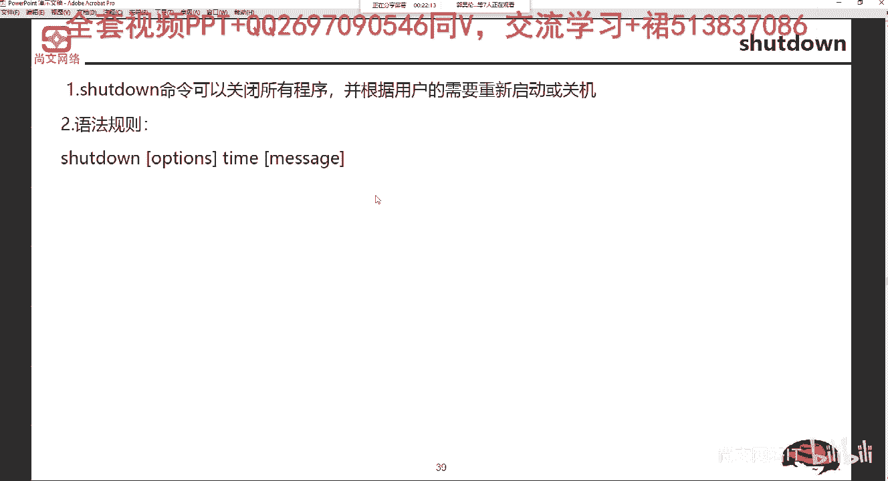

我们来看一些参数。首先，杠T。是这个多少秒是吧？等待多少秒后，我们通知这个。关闭系统啊，去通知关闭系统。那么沙档杠K并不是真正的去关闭系统，只是给进用户发送一个警告。

比如说我今晚上11点要今晚上11点要关机了是吧？我要给每一个用户发送一个warning message啊，发送一这样的消息。那么沙档杠R代表是说关闭之后，我又重新启动操作系统。

也就是说它就是一个重启是吧？沙档空格R杠2指的就是reboot或者是INT空格率。那么沙档杠H关闭之后停止系统，实际上就等于那个什么就是hot啊，或者是IIT空格0。沙2档杠F再重新启动。

用FSCK检查磁盘。这个FSCK是一个文件系统检查一个命令。啊，他来检查文件系统有没有什么。损坏的地方是吧？它通过FICK来进行这个检查。小F呢是不不去做检查。那么大F呢指的就是我在重启之后。

我强制的去做一次检查。可能大家不知道有没有用过这个，比如说windows XP。啊，用过这种winwindow XP。比如说我我我咱们用着用着掉了电是吧？掉了电之后。在你在重启的时候。

你发现它会有一些有一个蓝色的屏幕叫金有一个蓝色的屏幕，它它它再去通过CHK。啊，什么ZHKdi啊这种命令来做一些这个检查。通过这种方式，然后再进入我们操作系统。实际上它就是说相当于是在一边给你检查C盘。

一边给你做文件系统的修复。这样的一个情况，但是。嗯，做完之后很有可能会用很长时间啊，所以说这个地方我们是取决于用不用啊，FICK这个面。啊，道理都是一样的。time设置关闭系统的一个时间。

后面加上要加上这种时间，格式是小时分钟啊小时分钟。running message是发送给用户的一个警告的信息啊，发送给用户的警告信息。

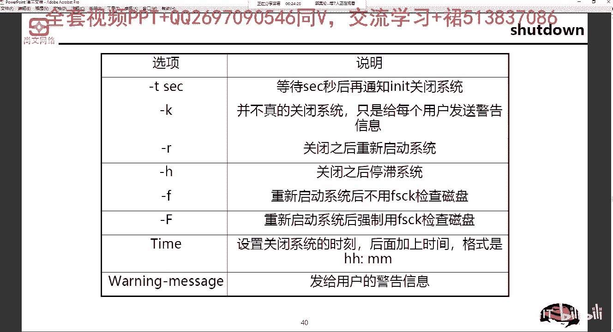

看几个例子吧。沙 down讲一起闹。立刻关机啊，沙档杠H闹立刻关机。然后沙档杠H23点啊，21点30分，今天晚上21点30分，9点半啊关机沙档杠H加时指的是什么呢？我10分钟之后啊要进行这个关机。

沙弹杠R闹，那就是立刻重启，然后沙弹杠R加1，那么这个应该是什么？就是我代表了10分钟之后我要重启，但是我要再重启。之前给我们的一些用户啊提示，比如说这个stem will reboot。啊。

并且只有root用户才能使用杀到那个面啊，属于用root用户才能使用杀到那个面。

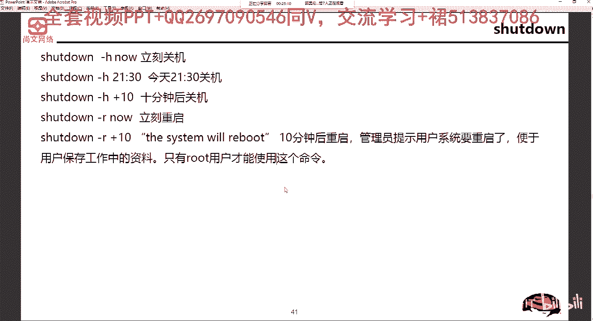

如何设置这个默认的运行级别呢啊，如何设置是不是通过set啊sstem controll set default是吧？用它来设置这个运行级别。如果想要进入单用户模式怎么办？我们可以通过。

IIT空格一啊IIT空格一来这个实现。然后某个服务想要开机自动启动，怎么去设置啊，开机自动启动。开机自动启动应该是什么？叫sstem呃，stem control。

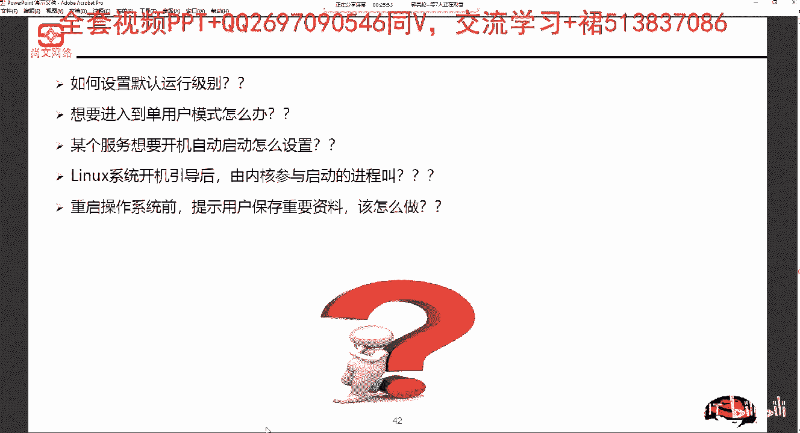

这个地方啊在这个地方。

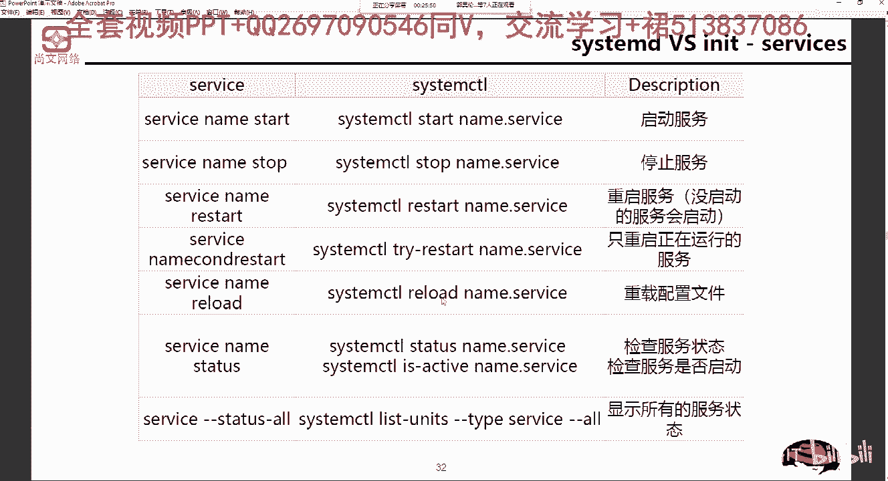

开机自动启动服务是吧？stem controll enable啊哪一个服务啊，enable哪一个服务。那么咱有6连X或者老版本就是check figure啊，某个服务，比如说network啊。

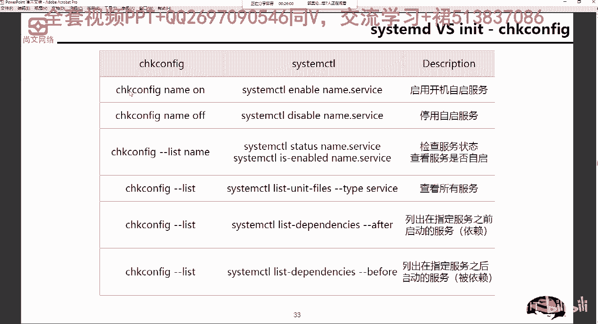

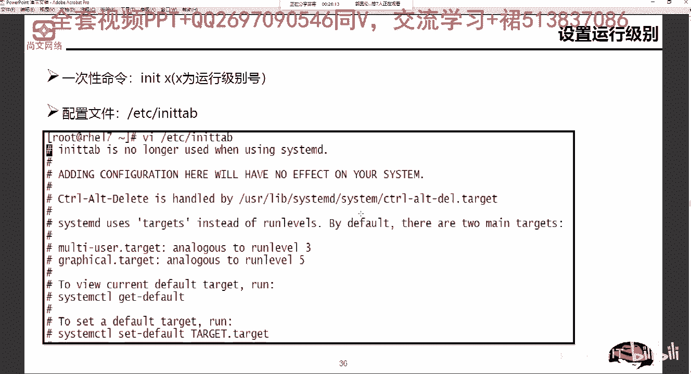

linux系统开机引导后，由内核参与启动的进程叫什么啊？当然这个是6。X的是吧？这个是叫IIT那个进程啊，叫IIT那个进程。

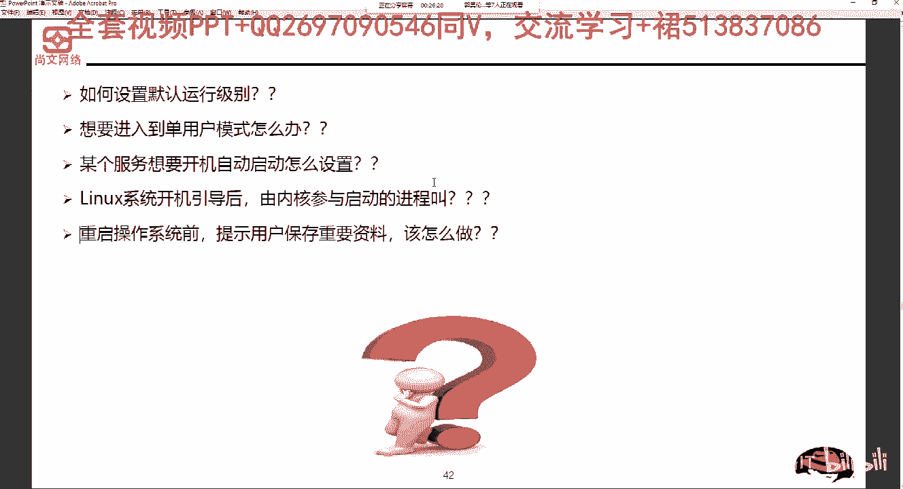

那么重启操作系统前提示用户保存重要资料，我们该怎么做？首先肯定怎么着，首先肯定是要必须要加上一串。message是吧？啊，加上这种message来提示我们要重启了，然后什么时候重启是吧？

然后我们提示要重启，我们要去保存我们这一些备份我们的资料。

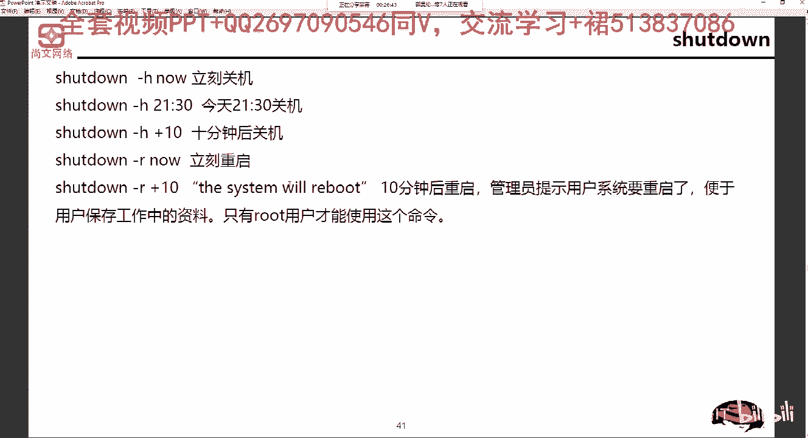

