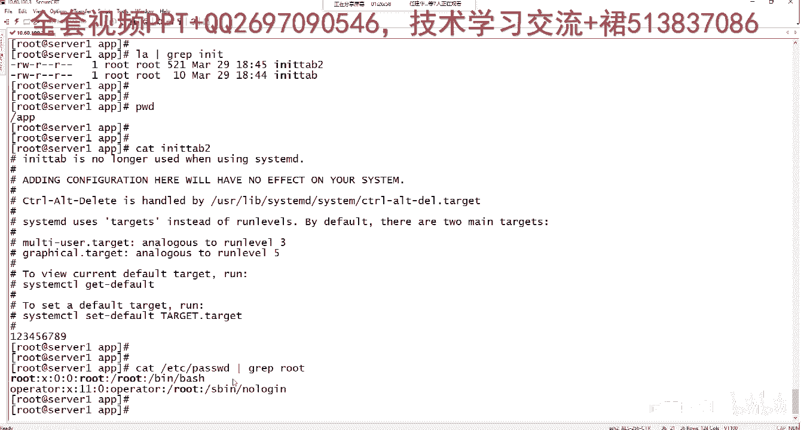
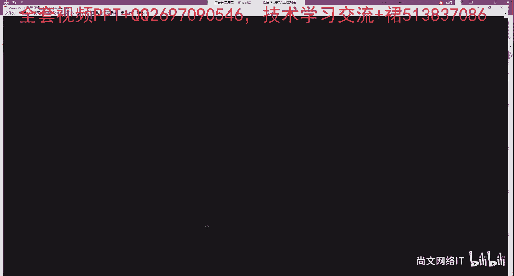

# Linux运维／RHCSA／红帽认证／RHCE8-05-3-5 管道符pipe【尚文网络】 - P1 - 尚文网络IT - BV1Hv41117C3

就可以。那么管道啊管道符判啊，管道符是将这个某个命令结果输出给另外一个命令。首先我们之前已经刚才已经演示过了，对吧？已经演示过了一个命令。就我查看这个目录下面是吧，有没有包含关于比如说这个。

某个目录下面有没有包含拜啥C的对吧？我们敲了之后，我们会发现有啊，它这个地方会有对吧？啊，会有那gra呢就是筛选出前面的这个命令操作一些结果，然后通过关键字拜啥C来进行这个筛选。好。

然后这个那个那个重导redirect啊，我们可以把一个文件输出到这个这个另外一个文件中，它有两种，一个是尖口号，一个监口号。另外一个呢是两个监口号，一个监口号呢可以将结果输出到文件中。

但是你的原文件就被删除了。那么两个文件是将结果追加到文件，原文件的内容都不会被清除。其实我们刚才已经做了一个例子了，对吧？啊，做了一个例子，这个啥例子。

我做了一个echo echo是往里里面也是去追加内容。你追加的什么内容，就是这一串操作啊，这一波操作。那么你你加了这一波操作之后，你通过两个监控号是做了往哪个文件里面ETC跑对吧？

我们可以看它caETC。好废啊。大家可以看，我从这个里面可以输的ETC profile的原文件内容是不是还是在的对吧？这原文件内容还是在的。

只不过是说我在最后追加了一个东西叫什么Lals LE等于LS杠1T。对不对？🎼那么我们通过另外一个命令啊，我们copy的操作，这个都是我们之前学过了copy杠RFP什么意思呢？R是或是再加一个V。

R是这个递归，F是指定文件名，哎V是详息显示出整个的详息过程，P是全员复制，对吧？那个ETC1个文件，比如说呃IITTEB吧啊，复制到哪里APP目录，对吧？这个呢就是显示出一个详细的过程。

我把ETCIIDTEB这个文件复制了一份，复制到哪里呢？APP目录下面，那么CD到APP。LS或者是LA啊g INIT你看我一一筛选它就有了，对吧？INITTEB。好。😮，那么我们现在来来这样做是吧？

啊eical。比如说。This is a test。T me。当前目录下的IITTB。对吧然后我ca一下当前目录选了IITP。我是不是在文件的最后一行追加了一个this is testing。

我之前的这个IITTB的文件的内容没有被删掉，对吧？所以说两个监控号是什么？以append就是追加的这种方式。那我再来啊哎那。一个对吧？比如说我写了个sorry是吧？好了。Yeah。开当前穆小兰。

现在是是不是只剩了一个这个东西，对吧？是不是只剩了它你原先的这个文件的这些内容是不是都都不在了？对吧他是都不在了啊，包括你之前追加的这个ting。那我们我们再来啊，我们再来。ec口是吧。

123456789。当前目录下来IT。好，看一看IITT。同样的，我这个文件里面内容只有什么123456789，对吧？我再来一个操作。那个。🎼ETC目录下的IATTCEB。然后当前目录下的IT。那个。

P笔。然后我又做了一个当前目录学了ITTAAB2。我再看啊。首先。🎼杠A或者是我接A，然后gra那个IIT。首先我们做这样的一个操作，这是什么意思呢？我们原先是不是在APP目录下小pWD是吧？

我当前是在APP目录下，我原先从ETC的。从这个地方对吧？从ETC目录我copy了INTTEBcopy到了这个地方。那么它的名字叫INTTEB。然后我刚才做了这一串神操作，对吧？

好像又多生成了一个叫INTTEB。那么我们做了这个操作，明明是查看。文件的内容查看了哪个文件命容，一个是ETC下的INTTEB我又查看了当前目录下的这个文件INTTEB文件。

然后我们把它两个文件通过一个接口号的方式，又相当于生成了单独一个文件叫INTTEB two。那我们来看cat I。大家看。当我发现我查看这个文件内容的时候。

这些是不是我之前ETC目录下的IITTEB的文件的内容。然后这个123456789是我更改过之后的。IIT就是APP目像IITTB文件的内容。对吧也就是说这一波操作是什么？这一波操作是吧？嗯。

一个监有号。一个间括号。两个间括号。那。两个结控号是代表的是。追加。然后这个一个监务号是代表。覆盖。那么与此同时，我们还可以做什么呢？将多个。文件。合并成为一个新文景。怎么做？对吧。就是这么做。啊。

就是这么做了。ETCIITTV文件是一个，然后我们还可以这样写是吧？斜杠APPINTVB文件是另外一个文件。然后呢，我们可以把它追加到哪里，比如说。TP项。ITTB比如说20。也就是说。

把ETC的IITTEB和APP的IITTEB通过一个方式啊，一个兼容化方式。写到了TMP写的IITTEB2020这个一个新文件。也就这里面的内容是它和它的一个合集。他和他的一个合。好。嗯。

怎么样来限制某个用户不允许交互式登录啊？怎么样来限制？限制。某个用户不允许交互式登录。这个怎么做？然后第二个呢是这个文件中的内容被覆盖啊实现文件中的内容。被覆盖。这是第二个对吧？第三个呢是。筛选是吧。

筛选某个文件。关键字。这几个怎么做啊，这三个。首先第一个限制用户不允许交付式登录。嗯。第一个呢，你是要让首先让每个用户，你要去改他的这个社要环境，对吧？有哪几种摄要环境呢？我们这边直接来写啊。

这边直接来写一下。限制某个用户不允许。交互式登录。第一种。9。并一下的。fs，然后第二种。是。DV下的。不闹。第三种。是SB下的no log in。其中呢，这个S病下的no log in是。最常用的。

那么限制某个允许这个不某个用户不允许交付者登录。首先第一个你你的用户要去改。啊，由。由原先。的默认。默认环境。基本上就是。不影响的不识。你要去改是吧？然后第二种。第二个班第二个呢就是要把。要B。

No log in。写入。写入到ETC。是要匙。选入到ETETC需要。好。那我们顺道想一下。怎么样吧。怎么样吧，SB下的那个no log in。就是怎么SB no log in。去写到我们的。

那个17C4钥匙呢。那我们可以做这样操作。很简单，L口是吧？然后SB下的不是SB下的no log in。怎么样追加到EDC下的。Shelf。啊，就这种方法非常简单。对吧啊，这种方式非常简单的。

那么怎么样第一步怎么样去改我们的呃用户。这个呢我们先不去说啊先不去说，我们会后期会去详细去讲这个那个用户管理的时候，我们会把这个这个地方补充回来啊，汇把补充进来。所以你改这个用用户的这个社交环境呢。

基本上就这这几种方法。第二个呢是实现一个文件中的内容被被覆盖，那就更简单了是吧？就是就这个地方。一我们用一个型号就把它覆盖了，对吧？啊，一个型号就把它覆盖了。

然后筛选ETC passwordword中关于root用户的信息，对吧？这个也很简单，typeETC。然后graff。root是吧啊，通过这个方式来去做。那么我们就可以通过。

这个root啊去group rootot的时候，发现这个文件里面。包含了两行关于root的一些相关的信息。

