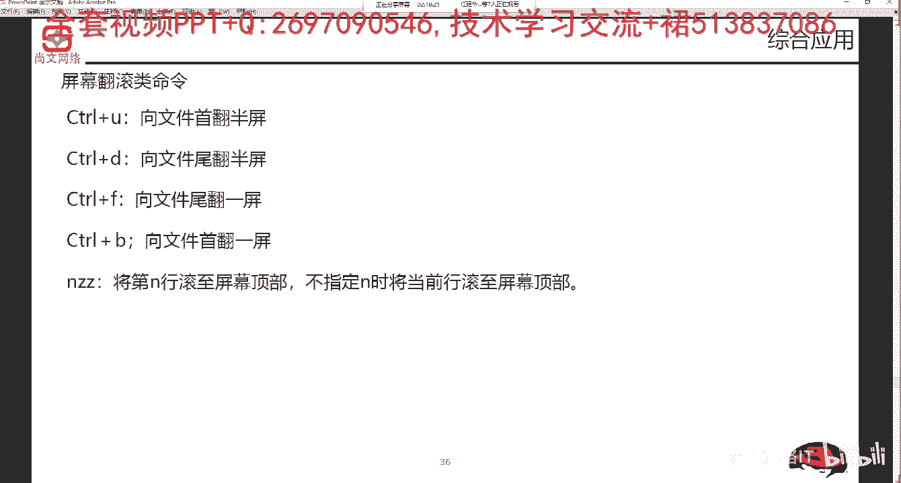
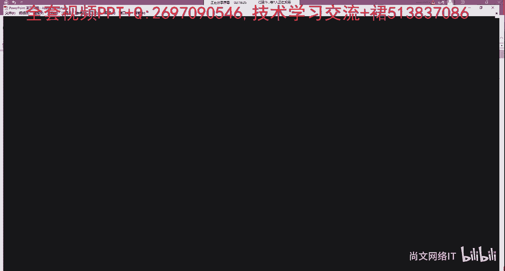
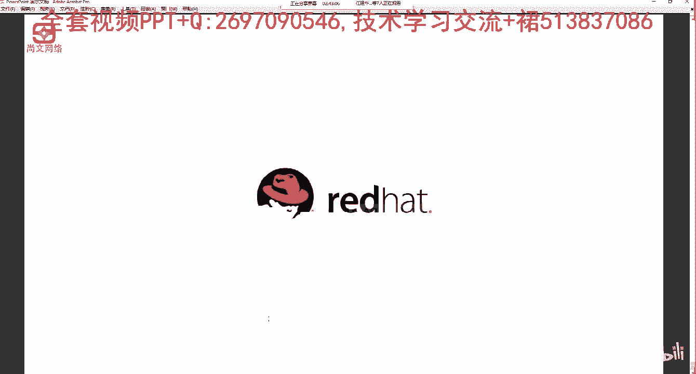

# Linux运维／RHCSA／红帽认证／RHCE8-05-4-2 vi编辑器应用-2【尚文网络】 - P1 - 尚文网络IT - BV1yi4y1M7ne

然后这这个第二个呢就是屏幕。翻滚。专滚类。这种是适用于。文件。中行数过多的应用场景。Conttrol。加B是。那个从下。从上往。下。翻滚来。半瓶。然后。

然后是control加这个control加我看一下，control加F。cctrol加B是从线，我们从上往下吧啊从上往下。然后从上往下的话是首先是cttrol加D。

是翻半瓶。

然后ctrl加B。反一屏。这是从下往上，然后conttrorl。ctrol加油。是从下。往上。翻滚半平。然后ctrol加F。是从下往上翻滚。一瓶。好，这是两种是吧？control加D从上往下翻滚半屏。

concrl加B翻滚一屏ctrol加U是从下往上翻滚半屏。ctrorl加F是从下往上这个翻滚一屏。这是屏幕这个翻滚类。然后这个插入啊进入插入模式。我们刚才不是说了一个小写的I嘛，对吧？小写的I。人费。

这个test fail。啊VR test file我按个小写的I，对吧？从这个编辑模式进入到了插入模式，我按ESC键，就从插入模式就返回到了我们的编辑模式。那么除了这个小写的I之后。

我们还有其他很多的这种操作，比如说大写的I。大小来是在当前行行数。啊，进行这个插入。我们来看。我按出一个大写来，它也会提示什么？杠杠你设置，对吧？我按EES键又返回来了。如果我想光标往下走。

比如说我我我光标移到了这个ge default的时候，我按一个小写来。可以进入插入模式。不是我我向光标再往右边移，我按住大写来。对吧它是在光标的当前的行数来进行这个插入。我再将光标往右边移。

我按一个小写来。对吧小写来，然后进入这个插入啊，按住这个ES我退出。那么这个小写来呢是在当前的光标前，这个地方为什么多了一行？是因为我刚才是在当前的最后防守，比如说在这个地方对吧？小写来啊。

然后在光标前，比如说我t testing。那么我在我按住大写来。是将光标直接定于当前的行数。泰汀。啊，这是小小来和大小来，一个是在光标前，在当前的光标前，一个在当前的这个行的行数。那么小小的A是光标后。

实际上你是这么理解，一个我们我们这个光标在这闪是吧？你按小写来就是。将光标往前往左边去挪动。可以去编辑。那么我按住小小的A。也就是说在光标的右边是吧，在光标后。我可以做什么样的这种操作啊。

做什么样的操作。那么大写的A呢是。小写大写的A是在当前的行数，那么大写的A就是在当前的行尾，对吧？如果我将光标移到随便移到移到一个位置上，比如移到这儿，我按住了大写的A。它的光标直接定于当前行的行尾。

那么比如说testing。对吧testing。那么如果是大写来是在当前的行数。比如敲太。小写的在当前的光标前操作。小写的A在当前的光标后进行操作，这个能看懂是吧？🎼我们比如说在这个地方对吧？

那个我就在这个F啊，以F为例。现在将光标移到了这个杠吧啊，移到这个杠，这个看着看着会比较简单一点。这个杠我按小写来。你看这个这个光标是不是还是在挨着的这个地方，然后它的你相当于是在光标前。

也就是光标左边进行这个编辑。没错吧，那么我同样的在移道光标这个位置，我按住小写了A。你会发现。它是在光标的右边进行这个编辑了。那么我按大写来哎。我是在当前的行首进行这个编辑。那如果按大写了A。

直接王彪移到了那个。这一行的行首行伟。还有除此之外呢，还有一个小写的O啊小写的O小写的O呢是在当前之。那个张前行之下开一行啊，比如说我我现在要在这个get default这一行。

这或者是在hello这个地方，我去去添加一行。那么我按小写的O。对吧他同样都是刚杠你造上，然后他。的光标就置于了当前当前那个哈lo那一行的下面一行，就如说这C testing。好。

那么如果我按住了大写的O。他是在this is testing当前光标前的这一行的之上，我们又写了。比如说你好。对吧。那么。插入的时候我们可以就记这么多啊，在光标前，在光标后，在当前的行首。

在当前的行尾，在当前支行新开一行。然后在当前这号之上新开阳。然后这个移动光标类啊，移动光标类嗯，大家这些了解一下就可以了。那个我们移动光标啊基本上就是。🎼呃，因为你是大一点的这个翻滚的话。

我们就按ctrorl Uctrorl Dctrol F是吧？那么对于一些小范围的这种，比如说行之间呢，我们就按上下左右啊，按你只要记住按上下左右键移动光。🎼那么上下键是按照移动一个光标的。定位到某一行。

那么你按左右键，就是就是当前这一行中对吧？左边右边进行这个。🎼呃，跳动啊，这个光标进行这个跳动。所以说你移动光标之类的东西不是那种屏幕之间那种翻滚类的话，我们按摄下左右就可以了。好。

然后这个计算器的操作啊计算器的操作。那么我们来看啊计算器的操作，第一个叫NYY啊，这个A呢是指的是数字啊，这number是一个数字。复制当前行及器下N行的内容，保存到计数器中。那么N是一个数字。

那么NYW是将当前行机器下N个字符保存到计算器中。啊，保存到计算器中NYL也是啊将当前行机器下N的字符保存到这个这个计数器中。然后P减是相当于从计术器中内容将光标处啊copy出来。

我们来来做一下具体的这个实际的例子。🎼我们比如说啊这个this is testing第一行是吧， testing，我想复制三行出来。对吧我想把它复制三行出来，我敲一个叫3。喂喂。

你要注意啊你要注意你的你要去做这样的操作，你你你的那个输入法一定要是英文的啊，不要是中文的。好，我们把它切换成这个英文的输入法3YY你敲了这个3YY之后。稍等。Yeah。3YY好，我敲了这个3YY之后。

它恰它它的左下角会提示么？三行已经什么ynk啊，三个三个lan已经ynk。那么我现在找一个地方把它给。从计数器里面把它copy出来是吧？那么比如说我就在这个地方吧啊。

在这个地方testing或者是这个井号键中间这个位置。哦，我按一个P键。啊，按一个P键。稍等啊。有一点问题。Yeah。3YY，然后我在最后一行吧，我按一个P键。🎼大家看啊。

我原先最后一行是this is testing，对吧？然后我按住了P检之后，发现多了三行，看到吗？哪三行呢？就是原先的这个文件的这一行，这一行加上这一行，我把这三行。通过3YY对吧？放到了计算器里面。

然后我在最后一行通过按一个P键。我这样的，我这个文件的最后三行是不是就多了this sessioning它然后这个井号键对吧？这个呢就是3YY接，就是说我通过3YY我去copy了三行出来。

然后按P键进行这个。插入啊，我们再来写啊，小写来是光标前啊。呃。光标钱。插入。那么大写来是这个这个光标。那个那个的当前行首。那么小写的是。光标后。插入。然后这个大写的A是。那个当。当前行尾。插入。

然后那个小写的O是。当前行之下。是。开一行。然后大小的屋是当前行。至上。新开一行。啊，达钱之后好像之下是个银行。那么再一个呢，就是关于。关于寄存器的操作。比如说3YY是吧。将当前行。支齐。下3号。

我们直接用数字啊，113号进行复制导G。存。是。那么我按P减对吧？我选定我选定。选这个光标定选定好了具体。某行后。嗯。P节。进行粘贴。也就是说我们从。从那个寄存器拉出。复制的。3号。300万。

那么与此同时，有有有那个3YW是吧？3YW是是将机器行当前下地几个字符来来保存到这个计存器。我们可以做一些这个例子啊，比如说。我们就以他吧啊就以比如说我我我这一行是吧，我有两个ting啊，我敲个2Y。

W啊稍一等。这个地方。好。🎼回到这个地方2Y。W。我将光标呢移到最后一行。按一个P检。有个披件。所以说将当前行的机器下第二个字符啊，把它给copy出来了。把它给 call咗。保存退出。删除。

删除的话是我们去删除第。NDW啊删除D光标处开始集其后N减一个字符。然后DU呢是删除删至行尾。D dollarll是删至呃，删至行首D dollarll是删至行尾。

然后这个NDD啊是删除当前行及其N减一行。X是删除一个字符。那么关于删除的操作的话，我们来做一些常用的这个。🎼比如说我这个地方一行我敲了个EDD。啊。

我写了个EDD那么EDD的话就是说删除当前行机器N减一行。等于说我把当前第一行给删掉了，对吧？啊，把当当前的第一行给删掉了。那我们再来。我想把我将我光标当前是在那个文件的最后两行。

我想把最后两行一个删掉，对吧？2。DD对吧？2DD这样的话，两行就被删掉了。常用的话是NDD。再一个呢就是我一个字符一个字符的删，对吧？这个是我们是这个东西是我们非常常用的。比如说这个testing。

哎，我觉得前面这些A因为我的一些网络原因或者是其他的原因，我多写了这些A，我想按小写的X，对吧？我要把这些A删除掉。对吧那么我随便将光标定到一个位置，我按X。你看他这个A是不是正在慢慢的给。删掉对吧？

我就是一个XX1个X进行这个删。这样的话，之前的那些一串A是不是都被删掉了，对吧？啊，那一串A都被删掉了。这个呢也是常用的一个字符，就是一行一行的删或者是一个字符，一个字符的删。这是删除了这个。

最常用的两种啊最常用的两种。好，删除方面的NDD比如说3DD。删除这个。三行，然后X是一小写的X啊。一个是。一个是。删除。当然这个X小写的X啊，小写。X是。光标。钱。那么大写的还有个大写的X。

我们来看一下。🎼我们我们还是将比如说这个将这些S好了吧？这这一行有一些这个S啊，我们用大写的X啊来进行这个一个一个的删除。那么大写的X呢是指。关掉。ho。字符，然后小写的X是光标前的字符啊。

进行这个删除。那么还有一些应用呢，就是我们可以进行这个搜索啊，进行这个搜索。搜索呢就是呃。可以搜索从高光标的开始处向文件里去搜索一些字符的参数。当然你要搜索的话，是在。这个运行模式。进行搜索。

比如说testing啊，我们就去找有没有testing的关键字啊，要在运行模式。呃，钥是对，要在运行模式。那么我敲一个这个斜杠，比如说testing。它会直接提示了吗？你已经找到了文件的尾，然后继续找。

从头从上往下找。那么这个呢就和就跟我们刚才在讲这个。你在VI的时候。加上这个反斜杠对吧？斜杠testing它的道理是一样的对吧？将光标匹配了第一行行数啊，当前的那个行的行数，如果有多行匹配的话。

我们按按N键从上往下找。那么还有一种呢是问号testing。两种啊，我们可以继续啊来进行往下找问号。他是从上往下找，看到了吧？他从。找的时候是从top就从文件的手进行找，然后继续往下找。

是boton是从上往下进行这个找啊。然后再一个呢就是我们可以设置一些行号啊，设置出一些行号。Set number。冒号 set number。你敲了这个。冒号s。Number啊s number。

敲了这个行号的时候，你就发现前面多了一些数字是吧？12345789111啊等等等等。那么这些呢是代表了你这个某一行的这个行号。那么我们怎么去取消这个行号呢？冒？

set NONU啊set NONU它这样的话就取消了我们的这个这个行号了。NONU。取消好。啊，这样的话就是取消喊号。还有一个呢是set AI啊，set AI是是是自动的去设置这个缩进啊。

这个可能我们这个文件感觉不出来啊，感觉不出来。有有那些长了一些文件，我们就能感觉出来这个自动缩进的这么一个功能啊。setI是设置这个自动缩进。设置自动合进。好，那么从插入模式返回到编辑模式，对吧？

从插入模式在这个地方我们已经说过了。从插入模式返回到了边辑模式，我们要按ESC键，对吧？啊，要按住ESC键，然后这个命令模式啊，这个叫运行叫命令模式或者叫运行模式。运行命令模式。我们要按住这个冒号键啊。

要按住这个冒号键啊，比如说WQ是存盘退出，按Q键是不存盘退出。那么WQ叹号是保存强制退出Q叹号是那个不存盘啊，退出。这个呢我们刚才也已经说过了是吧？你按WQ和WQ。叹号是保存退出。

那么按Q和Q叹号是不保存退出。当然你一定要什么按住shift加冒啊，进入这个运行的呃命令模式。我们来看这个几个例子啊，第一个怎么样去删除HTB康中的第500行的内容。首先我们是不是要去去找，对吧？

我们先把。若贝亚。愿加。500。我们找这个message，我们就以message为例，我要找到500行，对吧？找到了500行光标已经定位了第500行。那么我们怎么样确定它就是第500行呢？

我们可以按冒号set number，对吧？冒号 set number。他会告诉你，这一行就是第500行。那我们定位到了第500行之后，我们怎么去删除呢？我们是不是接按个DE就可以了，对吧？

只要按个滴D键，它原先的那个500行的内容就被删掉了，对吧？啊，就这么简单，那么如何将光标制定义为ACPcom中第一个与lason关键制的第一行，这个其实也很简单。VI加斜杠。Listen。

比如 message。对吧啊，通过这个。通过这种VI加。写个list的方式啊，来进行这个定位。那么将HBcom中第200行之后的第十行复制到第800行。那个我们先光标定定位定制为于第200行。

然后我按1DD对吧？然后我们再去找啊，再去将光标定位到第800行。之后我们按一个P键啊，这样的话200行之后的第十行就可以复制到第800行之后，对吧啊？那么如何保存退出VI电器？是吧冒号WQ。就保存了。

啊，保存退出。那么不保存的话，就是Q或者是Q叹号啊来进行这个操作。那个VI编辑器呢是非常重要的啊，对于linux操系统非常重要的啊，我们要一定要去要会去用它啊，一定要会去用它。

那么再来简单简单的回顾一遍，它三种模式。第一种是编辑模式。我们通过VI或者是VI加ner或者是VI加R，或者是VI加斜杠。我们的参数进入到我们的fi要 name。

按小写的I将光标定就是光标的前前的啊开始插入啊，将光标定位前，开始插入小写的A是光标之后可以开始插入。那么大写的I呢是光这当前这个行的行数。那么大写的A是当前行的行尾。

小写的O是在当当光标定位当前行的之下新开一行大写的O是将光标置于置于当前行的之上新开一行，不管怎么样去做，我们都会进入到这种插入模式，然后进行编辑。编辑完了之后，我按ESC键会从插入模式返回到编辑模式。

那么我这个时候呢，我要去保存退出，那我们就按冒号WQ不保存退出冒号Q对吧？接下来的话，一些屏幕翻滚类的对吧？文那个文文件行数太多，我们可以按crl加UcrlDctrl fcrlB进行翻滚。

那么基于局限的局部的一些行的之间上下移动。我们按上下左右键。对吧进行光标一个字符，一个字符进行这个移动。那么删除的话，我们可以删某行，甚至是一个一个字符的删删的话，一定要大家一定要去谨慎啊。

就是不要不要这个就是有太多的这种花哨，知道吧？我们就记几个常用的啊，删某几行或者是删一个字符就可以了啊，这样的方式是最谨慎的。然后搜索对吧？我们可以从光标开始处从上往下搜，以及从下往上搜。

其实你的这种搜索就相当于是我们的这个。我们的这个记事本对吧？比如NOTnoad对吧？呃，我去我去去找一些东西，对吧？我去我去搜索这个地方有个fin的，看到了吧？是吧？有fin的。

然后你点up实际上就相当于斜杠patteron。那么点down的话是相当于是问号这个paon，对吧？然后set number啊set NONU啊，我们可以去清醒的去定位到某某一行的这个行号。那么。

编辑啊保存WQ啊。不保存Q或Q叹号强制的退出。那VIP辑器呢，我们就说这个这么多，好吧。

