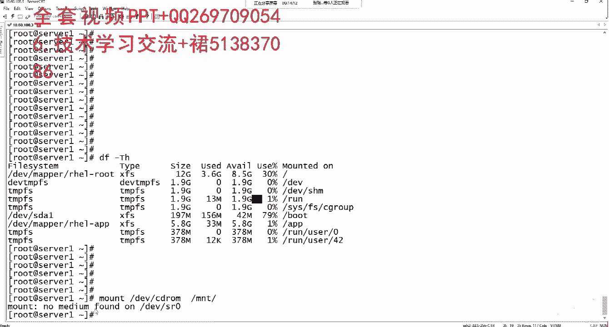
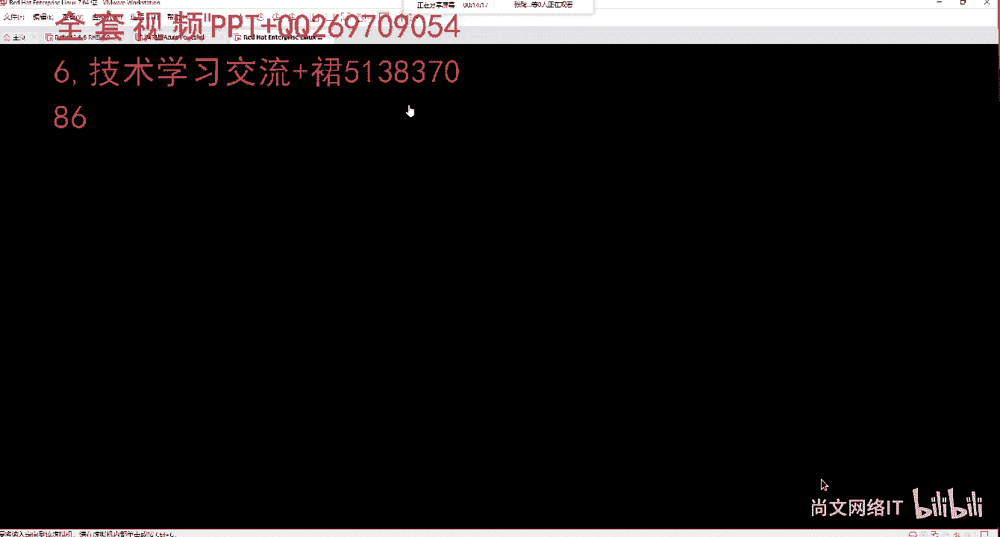
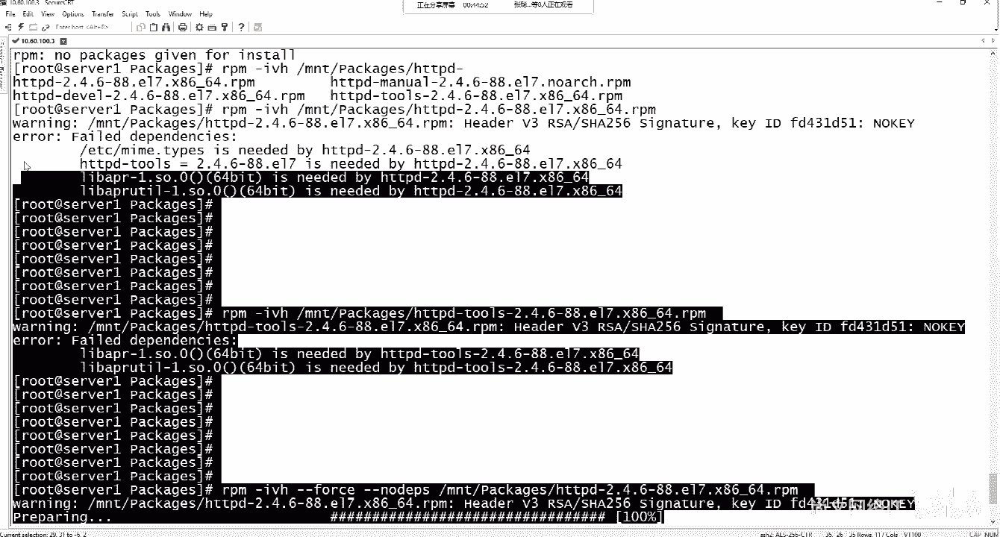
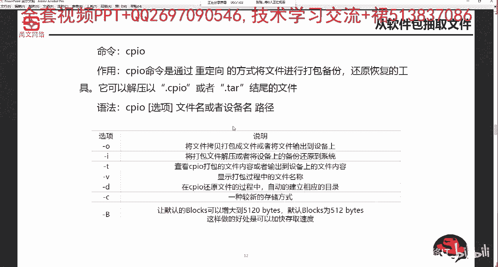

# Linux运维／RHCSA／红帽认证／RHCE8-06-1 rpm格式的软件包安装、更新、查询、卸载和管理【尚文网络】 - P1 - 尚文网络IT - BV175411b7ag

嗯，这一张呢是这个第六张PPT呃，linux软件包的安装管理。那个linux软件包的一个内容呢，就是第一个呢是基于这个叫RPM啊RPM包的这个软件包的安装管理。然后第二个呢是编译并安装。

就是源码包原码包。第三种呢是通过一个东西叫ym啊，YUM叫ym去安装我们的这个RPM的软件包。首先来看一下，就是基于这个我们lininux操作系统啊。那个红帽的啊就红帽的也好。

或者是或者是这个CS的也好。他的这种软件包的名称的扩展名叫点RPM啊。然后这个RPM呢就是。呃。找到这个地方。RPM。是这个red hat。packages，然后manager。就是基于这个什么呢？

基于这个。红帽的包的安装管理啊，叫RPM。你像我们windows的话，一般windows的话基本上就是什么点EXE是吧？或者点MSI这些呢就属于这种可执行的，特别是像这种EXE的。就是属于可执行的这种。

这个安装程序。然后这个RP基于这个linux呢是叫呃，当然我们说我们说啊就是基于这个红帽的。基于这个red hat的。或者是圣图S的。然后那个那除此之外呢，因为我们之前不是说了，有很多的这个。

发行版本对吧？就是linux的。发行版本众多。首先首先呢这个。嗯，红帽。就是red hat。和。那个。汕头S。是一类的是吧？那么可能还会有一类是这个这个这个这个这个德编底半。

这个德编呢我们就是我们目前为止能看能用的到的话就是。诶。我们会用用它做这个什么。安全渗透测试。包括这个就是左用安全做神成测试的时候，我们可能会用到一个东西叫卡里啊。

卡里呢这个它可以基于一个完整的SO就是我们就像装这个什么是一样。那个装那个呃就像。安装。Lux。那个操作系统是一样的啊，他给到你一个一个整包的1个ISO文件。

然后我们可以像装leaing操系统去选软件包，去选我们的这个规划分区是吧？规划完了之后，然后去装装完了之后呢，它有有很多这种关于。关于这个这个渗透测试的一些一些。工具。那么基于这个德边呢。

德边也是一种linux的发行版本啊，它也是一种linux的。那个发行版本。但是他的这种发行发行版本呢，我们就可能就不不太不太会用RPM了。因为它是基于红帽或s素S的这种。那么它的话就是用这种。呃。

叫APT啊APT这种方式，APAPTge啊instore。通过这样的方式啊去安装我们相关的一些软件包啊呃。这是这个这个基于包的啊进行这个安装。然后再一个呢，我们再往下再看。首先来看这个RPM包啊。

就是它是一个点儿RPM啊，它是一个点儿RPM。点RPM啊，那么这种通过它的这种方式进行这个安装的话，首先我们来看第一个。呃，通过一个命令叫RPM杠IVH啊RPM这个命令是专门用来去装RPM包的这种工具。

该是。安装啊就是这个insstore啊，就这种install的这种。通过IRPM杠I啊，I呢就相当于是。instore，然后杠V是显示出这个。显示出信息这个安装的。详细信息。然后H呢。

就是说就是以人类能看得懂的。德方式。就跟那个什么有点有点类似于像这个DF啊，DF减TH或者是DU减。SH啊这是有点就像这个H的这个参数是一样的啊。所以说我们整个整个这个下来之后啊。

那我们可以用到基本了就是RPM杠。IV1式。IPM杠IH。这个命令啊参数进行了这个进行安装。那么这个进行安装的时候呢，我们需要记住啊，就是后面要跟RPM包的软软件包的完整名称啊。

这个一定要记住跟RPM软件包的完整名称。那么我们回个头来看什么是RPM包的。完整名称。首先我们以这个为例啊，就是ZSH杠5。0。2-14。EL7点叉86下划线64。2PM。这个呢就是一个包的完整名称。

我们把它分解来看，第1个ZSH是一个文件名啊，这是一个包的文件名，然后这个五是它的一个主版本号，对吧？那个第二个这个零是它的一个次版本号。那么2-14是它的一个修订号。那么这个医疗期呢，医疗期指的是。

基于。红帽的七版本的操作系统。那么很简单，如果你是一个装在6版本或8版本的话，它应该是叫EL6或E28，对吧？然后点P点呃点那个叉86加线64，我们也说了，它是1个CPU架构的一个平台。

它是1个64位的，对吧？那如果是32位的话，应该是在这个地方，对吧？如果你是1个32位的RPN包的话。嗯，我们应该是在这个地方有说过是吧，它是叫I686啊，就是嗯。世界I686啊。

这是1个32位的一个包。那如果是64位的话，应该是叉86下划线64。啊，然后点RPM。所以说整个这个文软件包的文件名称的话，就包含了文件名，90万号、400万号点修整号。然后你是基于哪个操作系统，对吧？

你说我这个操6操作系统，我去装7基于7了行不行？也可以，但是非常麻烦。那么你说我是7版本的，我去装滤行不行？很大程度是装不上，对吧？所以说我们要根据你具体的这个版本啊。

就是你是60X还是70X去取决于我们去装是126还是127，对吧？然后你这个需要装32位的，还是1个64位的啊，这个我们都需要弄清楚啊，这个呢整个一套下来，就是一个包的完整名称。

所以说我们在RPM杠IVH的时候，后面一定要跟。这种。Bder。完种名称。啊，一定要跟包的完整名称。我们来看这个例子，RPM杠IVH然后MNT目录下面packages是有个GSH5。0。2-14。

127。叉8664。2片5对吧，装完。下面的这个过程啊下面的过程就是你因为你用了杠V的这个参数是可以给你显示出你在安装时候的这个进度表，对吧？一是装装装装装完了装装到百分之百。

对吧就这样呢就是一种这个包括我们能看得懂的这种方式啊，就是IRPM杠IV1。所以说我们在装的时候一定要记住IRPM杠IV1这种参数是连在一块用的啊，这时候连在一块用的。那么第一个这个范例呢。

第一张截这个截图呢装的是我们的这个那个本地的啊，基于本地的RPM包。啥叫本地的呢？就有可能你会把1个RPM包从网上下下来。继续安装，就不你下到本地，下到直接下到我们linux的这个操作系统的本地对吧？

直接下到我们linux操系统本地，然后进这个RPM杠2H。的安装。那么还有一种可能就是说我们把我们的光盘对吧？还记得我们的光盘吗？我们的光盘。这个地方那个这个啊。那个那个H需s7。6。

然后下6思位的DVD也是SO啊，是通过它。嗯，这个呢把我们的光盘挂载到我们的lininux操系统啊，就是挂载到我们的lininux操系统，然后我们可以。搞一个挂载点对吧？挂到哪个地方，比如说MNT下面。

挂在MNT下面呢那我们的这个光盘里面或SO文件里面的这些RPM包可以可以它进行这个安装。实际上我们之前也说过了，我们在第一节课在装操作系统，实际上就是在装各种各样的RPM包，对吧？啊。

所以说就是你在装操作系统的时候，可以通用RPM去安装。那么你装完之后，后期一样可以通过RPM去安装光盘或SO的。里面的这些阿片包啊，这个都是可以了。那么第二个截图呢就是我们可以直接去安装网络包。

就是我有一个绝对的。RPM包的URL像这个，比如说open stack是吧，opent是这种RPM包，它有一个就它直接通过这个公网啊，这网站去发布了这个绝对的这个URL。

我们直接只只要通过URL我们能访问到它就可以了，对吧？那么我们通过这个这个RPM也可以去安装。当然前提是你的机器操作系统一定要联网，对吧？啊。也就它既可以装本地的，也可以装这个网络的啊。

只不过你区分一下这个路径，对吧？就可以。🤧好。然后这个。我们来看一个啊我们来看一个例子。DF减T1尺啊，敲DF减T1尺。这个命令很熟悉了吧，对吧？是整个操作系统，就是我们要查看某个文件系统的使用率。

对吧？我之前一再强调。文件系统它的格式。大小用了多少，剩多少，使用率挂在点对不对？那么我们我们对于这个光盘，我们先以光盘或SU这个RPM为例。首先第一步呢，我们要去挂载，对吧？要去挂载。挂载的话。

我们现在来看，你能不能看到关于比如说CDro也好，或者DVDro也好的一些关键字。你从这个地方应该是看不到一些关于CDrom和DVDro的一些关键词，对吧？所以说我们第一步要进行挂载。

用到一个命呢叫mountt啊MOUNTmount。DEV小的CDron。然后挂载到MNT。它这个地方提示no media放的，是因为我们来看啊我们来看。

可能会有很多这个这个学习的同同志们，他们。

他找他才遇到相同的这个问题啊，我们点击右键啊，找到这个虚拟机，点击设置。然后呢，在这个CDDBD的时候呢，你看这个地方，首先你要去找到ISO的文件。那我的ISO文件直接放在了桌面上了，对吧？

放在桌面上就这个东西。好，然后你不要忘记把这个已连接啊，这个地方方已连接，把这个groupber的选上啊，点击确定。好，那点击确定完了之后呢。我们需DF减去遗址啊。然后呢。

我们继续啊通过通过mounttDVCDro。M问T。这时候呢它提示说嗯DEV下的S20是一个rightite protect。right protect是一个写的保护的动作，对吧？是一个写的保护的动作。

mountin relymountin挂载的时候，它是以指读的方式。也就是说，因为我们都懂计算机的一些知识。我们的光盘我们的光盘大多数情况下，它是一个只读的对吧？除非有什么CDRW啊，除非有CD。

RW或者是DVD。RW对吧？通常情况下我们都叫低V。Wrong。或者是说CD。ro当然CDro有点有有一点老气了是吧？有点太老了，基本上就DVDro。没错吧，那么DVD的rom它。

🎼所知他放的那个盘里面只能做什么re人类啊，这是只读的啊，这是一个这是一个那个计算机方面的一个常识。那我们继续DF减大T小于时。你在这个地方下，你就能看到一个东西叫DEV下来S20。

它的格式叫ISO9660。我们之前已经说过了，基于光驱的对吧？基于光驱的。儿叔。文件。系统格式。一个是SO9660，一定要记住啊，不是9600啊，不是9有很多人会写写成9600，是9660。

然后再一个呢，就是这个。叫UDF。就UDF这是基于SO的。所以说我们第一步是通过。啊mount。直接我直接复制哈，直接复制了。mountt DVCDR MNT。然后呢，它会有一个提示啊。

有个提示说叫DEV下的S20。其实我们要做的操作是什么呢？就是D斜杠DEVCDro。或者是。Yeah。嗯。我们CD啊第一。LL吧。EV。CD wrong。对吧或者是DVD。看这个地方还没有DVD是吧。

我们来这样来啊，来这样看。我直接CD到EV上啊。敲给LA啊敲给LA。嗯，敲1个LA呢，我们能看到大家看这个地方啊，就是。DVDEV下面有1个CDR，我们刚才是不是通过。

看我们的笔记是通过mount DV下的CDro。把我们的光驱挂到了MNT目录下，对吧？但是它提示说叫DEV下的S20，它为什么不叫DEV下的CDro呢？是因为这个样子啊它是因为这个样子。大家看这个地方。

我现在是在D一V目录下，然后我找到了CDro。CDro，你看它是一个什么呢？是一个L啊是一个L。我们之前说过了啊，如果你发现前面是一个L的话，证明它是一个链接文件，而且是一个软链接文件。啊。

是一个是一个软链一些文件。🎼这个链接文件链到了哪里呢？就S20，看到了吧？也就是说你你你挂啊，你忘第V小了S20，然后MNT我我新建一个。简P啊APP下等。S20。

是吧然后mountDV小点30到APP目小点30。我去将DV下来S20挂载到APPS20这个目录下叫DF减T1是。你会发现。在这个地方对吧，在这个地方。嗯。有一点的问题啊有一点点小小的问题。他是挂在了。

我们这个命第二。减PAPP嗯TP下的S20。这样写啊，mountDEVS20那个TNP下的S20。也是没有显示是吧？没有显示，没关系啊没关系，我们这样来看啊。当我通过DV下载30去挂的时候。你发现。

他提示的还是要S20，对吧？所以说对于我们来说啊就是。那个。CD room。和S20。我们呢都叫他。DEV下的S20，只不过说CD2呃CDro是S20的一个链接设备啊，这个大家要理解啊。

这个地方要去理解。然后我现在是在DEVDV目目录下，我去做一个操作L杠AL，然后grave啊这个S20。所以说我通过贵牌S20的时候，我会发现有CDro，还有它自身本身的S20。

而且S20是一个block，是一个块设备啊，它是一个块设备。🎼所以说我们现在可以通过MNT，通过这个那个mountt的操作，可以把它挂载到MNT目录。让我们CD到。MT。

那么这个MNT目录下这些东西所有的就是我们的那个ISO。就是我们在装操作系统的时候，通过ISO引导了的那些。文件都在这里面啊都在这里面。然后呢，大家注意这个地方有一个packages啊。

这个地方有个packages。你会发现这个packages这个文件，这个目录啊很大是吧？这个地方很大。CD到ll packages。我们可以刷一下啊可以刷一下。你看这有这有这么多是吧，有这么多。

我中断一下。呃，有这么多的这种RPM包，这么多RPM包，随便找一个比如star up notification。你看它的名字叫star up notification，这是它的包名，然后它的版本号是0。

400万号是12，求证号是8。10-8，然后你是哪个1。7的版本是吧？然后I686看到了吧？I686是1个32位的操作操作包。那么与此同时，它会配1个64位的这个包啊，64位的这个包。

所以说这个package里面就是关于那个ISO文件里面一些所有的这种这个RPM包。那么我们可以通过安装这通过安装这种方式来进行这个这个RPM进行这个安装。那我们随便装一个啊，我们装一个看一下。呃。

比如说说一个。这个。那个FTP的包吧啊，我们装一个简单一点的FTP的包。MNT。个packages，然后他那个对于linux操作系统来说，做FTP的包叫VSFDPD这个呢这个服务后期我们也会讲。

在讲服务的时候也会详细去说它。然后去装。好。装的时候是非常简单的是吧？啊，PM杠IVH然后去找到对应的那个路径啊，直接装就行了。装的时候它会提示一个，首先有个警告。

这个VSIP包是那个它是有这个通过ICC256做了一个signulator，就是做了一个认证。而且会给你把K的ID给你罗列出来啊罗列出来。然后他在安装的时候会显示你的这个。安装进度对吧？安装进度。

百分之百啊。好，你装装一个包啊，装一个RPM包很简单啊，非常简单，就这么装非常简单。这是装阿RPN包。那么接着我们接着接着往下看啊，我装完了之后，我怎么知道它有没有装重功呢？

对吧这个东西对于对于我们来说可能会是一个疑问。我们怎么样装能装成功，能么怎么这样能查出来呢？我们通过RPM杠Q。对吧RPM杠Q。Q是cry的意思。对吧啊Q是这个这个这个query的意思。鼠标去哪了呢？

我们通过这个IPM杠Q能查得到呃哪些操作系统，就是我们操作系统装了哪些IRPM包啊，我们来这么来看。8PM杠Q。是啊，他说no arguments given for query。

就是没有提供一些相应的这个参数arguments是一个参数的意思是吧？没有提供任何未查询做的这种参数。我们接着往下走，RPM杠QA是查看系统中所安装的所有的PM包，我们来这样做。RPM杠QV。

我回车了对吧？我回车了。那么这一些呢就是我装的就是已经装过了leux操系统，已经装过了包。那我们可以通过管告符的形式MPM杠QA，然后group，比如说VSFDBD。这个呢就是用来查询。

linux系统中所有关于安装包之后，有没有关于已经有VSFTB的一个相关的信息。一看筛选出有证明VSFP这个包是已经装了，啊已经装过了，而且是装成功的。一定是装成功了。所以我们通过IPM杠QA。

然后group VSFTBD啊进行这个查询。那么RPM杠QA呢通过管道符gRPM的软件包的名称啊，就能查询得到。那么再看这个啊这个那么我们去查一个东西啊。我们去查一个东西。比如说我要查两个包啊。

比如说我有没有装一个其他的包，比如说有没有装pyython的包啊，python的包。你看我如果这样写。我可能会这样写。首先我查多个包是吧？我要查VSP我同时也要查这个python的包。那么我查完一个包。

再查另外一个包。也是能查出来的对吧？啊，那么有没有一种方式我既可以同时查python，也可以查VSBD。这样写啊，有有的人可能会幻想，是不是这样写，对吧？我以空格的方式把它显示出来。

这样写这样写是不行的啊，这样写是不行的。他认为你这个东西是找不到的啊，找不到的。呃，有一种方式我们可以这样来看RPME group。我们来这么看。叫e group啊。

e group呢是另外一种这种查询的这种方式啊。大家看。我现在说。RPM。刚QV，然后管道符叫e柜，然后把多个要查询的包，通过管道符把它给排列了起来，对吧？啊，排列起来。那么通过这种方式的话。

我既可以查询到AVSIPB也可以查到python。也可以查到这种python啊，这一块是没问题的。因为第一个啊VSFD是能查得到。然后python的啊它也能这个这个查得到，对吧？这是一种啊这是一种。

我们把他给。写一下。查询已经安装过的RPM包。第一个呢是RPM。杠QV，然后g。那个比如说VSFTD啊，然后第二种是。是查询。多个。高的。名称。因为如果你只是单纯用RPM杠QV的时候。

你只能是一个包一个包查，是吧？如果我想多个包，就像刚才那样查python查VSOP。这样的方式啊。那个这个时候呢，我们要通过RPM。直接复制粘贴了。RPM杠KE group。

然后把多个包通过管道符把它连接起来。那么除此之外。还有一种方式啊还有一种。看的更明显的方式啊，或者是效率更高的一种方式。我们来看这个RPM杠Q杠杠QF。我们是通过一种指定变量name就是变量取名称。

版本号、修正号。架构对吧？一个包的完整名称，我们再回过来看。报名版本。架构对吧？啊就这几个啊就这几个。所以说我们通过这种方式啊取我们的报名白本号。修整号架构，你是1个I686的，还是1个32位的。

还是1个64位的对吧？然后后面呢，我们通过反斜杠作为结尾。GCC make openen MOTFGRBCde等等等等，就这些包是我们要想去查询的包。啊，想要去查询的包。这样的话。

我们通过这种方式可以查到更多的安装包。那么他这种查询方法和我们刚才通过e group啊，通过这种e group，还有一种不同的区别啊，我们呢可以。来看一看啊来看一看。好，我呢通过这个。

将之前已经写好的啊，我通过复制粘贴。回去了。嗯，这个地方有一些问题啊，有一些问题需要注意，我来看一看这个。嗯。MPM杠QV。好。这个要注意。嗯，我们找一个note pad啊，复制一下，看一下啊。

我们做的这个操作啊。首先呢你要注意几个点，第一个啊要注意的。第一个点是在哪呢？就是你在通过查询的时候啊。这两个。引号啊这两个引号。也就是说这两个引号是吧？是。英文。支付这个要注意。然后第二个。在。查询。

每一个。包的时候。要写包的名称。这个包的名称只是写只是包名。不用写那个不用写。包的完整。比如说。并且。每一个。高明。后面用。空格。家。反斜杠。来接尾。大家看到了这个地方了是吧？比如说TCT这是一个报名。

空格反斜稿，make是一个包名，空格反斜杠HCB是一个报名，空格反斜稿。这是的第三步。当你要查到最后一个包的时候。当我们要要写最后一个报名的时候。不需要空格。讲。比如说最后1个GRIBC杠devo啊。

那么我们回撤了之后，我们再啊。好。我们写完了之后呢，我们来看它会提示什么呢？比如说packaged的 GCC is not install store。然后这个make，如果你这个包安装好了之后。

它会把你的什么呢？按照我们的包的名称，版本release号和架构来给我们区分开啊，给我们区分开，写的很详细。比如说我这个make包已经装了。make的3。823make是我们的name是吧。

取了name的这个变量啊，包名。然后这个wason3。然后82是什么？82-23，这是我的release号对吧？然后这个这个架构是一个什么呢？是1个117的，而且是1个64位的包。

所以说我们可以通过这些这种方式呢，通过这种方式进行批量的去查询一批软件包哪一些有没有安装，他给你写的非常明白GCC我没有安装，它就是没有安装，对吧？

比如说这个ACBP这个抓化启用了嗯这个web中间件它没有装，就是没有装，对吧？那么没有装的话，我们通PM进行这个安装啊，通过它进行安装，然后packageRIBC杠store对吧？这种方式。那么。

这个地方很详细，你要比你刚才我们通过这个。这种方式啊以这种方式提供给我们的这个方式，这个资料或信息也多了很多，对吧？啊，多了很多。那么这一个呢就是说我们在装一些，比如说装装。你再搭一些。

比如说LEMP架构的。平台啊，或者是LNMP的平台，或者是你装数据库的，比如说oracle对吧？他需要装一一堆的包，那么我们可以先通过它再去写个脚本啊，我们通过批量的方式去查他需要的哪些包。

比如说makeGCC这都需要一些编译用到的一些包，对吧？那我们可以通过它来进行罗列出来，罗列出来之后，我们他可以通过其他的方式来批量的去把这个包给它安装好啊，这是一种查询了另外一种方法啊。

杠Q是查询杠杠QF是是追加啊，是给我们这个罗列出这个详细的这种呃安装信息啊，你这个包到底是有没有这个安装，对吧？啊，然后我把这个发到群里面啊，发到群里面，我们需要注意的，就是这个格式啊。

因为这个格式有可能在做的时候我们和可能会遇到我们的这种就是你的你的中文字符和你的英文字符这个切换了，对吧？通过这种方式啊，我们要注意我先发到这个笔记本里面。note，然后。

然后这个地方啊这个地方就是通过这样的方式，我们要去掌握啊，一定掌握就你去如果单身去查询一个班的话啊，没有什么太大的意义啊。所以说我们通过批量的方式啊来进行这个查询。这是RPM关于查询。

然后这个安片包呢呃。我们再往下看啊，阿PM包。他的。安装的过程中。啊，RPM其实装很简单啊，装非常简单。我们刚才已经做过了是吧？通过IPM杠IV14。通过这个方式再装，对吧？那个黑非常简单。

但是RPM呢还有一个存在一个比较大的问题啊，什么大的问题呢？他需要有很多的依赖关系，就是说我要装一个包，他可能会依赖其他的包。所谓的依赖关系就是我比如说我这个图上的是吧？

我要装那个my circlecle con server这个包，对吧？有可能会要去装什么呢？依赖包就是你得先把其他的依赖包装完了之后，你才能去装my circle conserv这个安装包这个主包。啊。

这个地方我们要注意，那么VSITP这个东西，你看你装的很顺利，对吧？装的非常顺利。对吧有两种可能。第一种。我们来看啊。这个安装包安装的。比较顺利。能够直接安装到底。存以了两种可能。第一种。有可能。

安装的就是要安装的。书包。不需要依赖关系。第二种可能就是。那个。所有的依赖。关系。包。可能都已经安装好了。啊，就是这两种可能。所以说我们在装一个包的时候，我们要去。啊，我们尽量要去提前再做一步啊。

这是安装之前。就是我们尽量。找到一个包。和其。所有的。依赖宝。好。我们要注意啊，要注意这样一个操作啊。那我们看这个VSFPP这个包非常简单，对吧？所以说有可能是什么呢？

它有可能依赖包已经都需要第一经装完了，不需要不需要再装依赖包了，有可能什么他就根本就不需要依赖包。那我们需要去网上去查。我们需要起床。好，那么再演示一个另外一个啊HDDBD啊。

这个呢也是我们将来要去学习的一个东西，就阿帕奇的一个。外部的啊中间件啊，它是专门用来做这个。外部的发布的这么一个一个东西。多外部发布的这么一个东西。它一个中间件，我们继续啊RPM杠FVH。那个。MNT。

Packages， HDBD。我们来看。那个操作系统啊给到我们了一个默认的一个包就2。4。6点。好吧，也就是它的版本是2。那个那个修呃就是2，然后它的小版本是4，那么它修正了号是6-88。

是1个117的叉8664的1个RPM包，我们就去装它，你在装这个包的时候，你会发现哎，说HTPP杠ts是需要装这个主包的一个依赖包，看到了吧？然后来说labR杠1点SO这是一个一个模块。

那也是需要装它的。然后labut组建的包也是也是一样的。所以说这种方式怎么办？我们需要先去装这个RPM杠t。对吧这个这个HTB的杠t8TM杠AV是。然后这个MNT packagesACP。对吧。

你告猝死。你在装杠ts的时候，你发现我又需要装依赖包，对不对啊，又需要装这样的衣赖包。所以说很麻烦啊非常麻烦。那么我们来看PPT。配合杠杠fors和杠杠no DEPS来强制安装。忽忽略依赖关系。

这个杠杠false是false是强制的意思啊。杠杠false，然后杠杠no DEPSno是不的意思。DEPS是依赖嘛，叫dependence。对吧叫dependence。那么noDEPS是。

我忽略了啊依赖关系啊，强制的去进行忽略依赖关系。那么我们来装一个看一看。RPM杠IVH杠杠那个forth。刚刚。No D EPS。MNT packages，然后HDP。我直接装主包啊，直接装主包。好。

我加了啊杠杠fo和杠杠noEPS，它是不是很顺利的给我们把这个主包给装了。对，不会像之前提示了，说哎，我要装这个。装这个依赖包是吧，装这个依赖包哎，要装他的依赖包，又要装它，又要装它，对吧？啊。

那我们去查一下，我们去查一下IPM杠QA啊，那个gra HVD啊，查一个单独的包，这个包我们已经装好了，对吧？但是个包虽然装是能装好，但是能不能。好用，这个我们需要打一个。你打一个问号的啊。

这个就要打问号的。对吧。为什么？因为我的衣赖包没有装啊，我的衣赖包是没有装的。

所以说我们可以通过这个杠杠for和杠杠n DPS可以忽略啊，可以忽略这种一赖包的这种关系啊，那也就是说正于正处于这个正是因为RPM有这样的一些问题。所以我们。后期的话我们要学另外一个东西叫ym啊。

叫YUM叫ymym呢是也是基于RRPM包管理，它可以自动的去匹配这种处理依赖关系。啊，亚m啊亚m呢也是我们的一个一个一个重点啊一个重点。好，那么安装的话我们就说这么多啊，安装的话就说这么多。

那个那个首先第一步啊，你你如果装本地的对吧？我要去把我们的光驱给它挂在上，对吧？啊？把我们的光驱把它挂在上。然后第二个呢就是呃RPM杠IVH啊，在装的时候。我们需要用的这个杠IV式的这个参数。

然后查询RPM杠QA以及用RPM杠Q或杠杠QF啊，根据这个那个取变量啊，取这个包的变量来去看有没有安装成功。这个呢都把它去了，这个地方都把它去掉。好，然后再一个呢就是去忽略啊依赖关系。

我们去把一个安装包啊进行这个安装好。那么怎么样去卸载啊，我们怎么去卸载啊，怎么去卸载这个包，那么我去能去装也能卸是吧？RPM杠E啊，这个E是erasese啊，是擦出的意思啊，erasese插擦出的意思。

后面要跟的是IRPM软件包的名称，就不需要跟我们的包的完整名称了啊。来查一个啊，我们就说他吧。那么RPM杠E我们只需要去。去写我们的这个HDVD。就可以啊，去写ACDVD。然后阿片我们再。

我们删除了这个HDP这个包，我们再去查的时候，发现就没有这个HDP2。4。6。-88这个包了。删除大屏包。后面跟的只是报名啊只是报名。后面只是跟这个报名就可以了。那么我们怎么去更新一个IP包呢？啊。

怎么去更新一个I包，更新的话通过叫U啊，你要去写成这个大写的U。或者是杠杠upgrade啊，或者是杠杠upgrade。来更新我们一个已经安装的这个包的完整名称啊，要去进行更新。

通过RPM那RPM杠UVH是吧？那个比如说VSFDP。啊，通过UV啊，当然我们现在这个现在没有关于VSIP的一个一个更新的包是吧？首先我们可能要去去下载一个啊，下载一个。然后那个不管是基于网络的。

还是基于网我们下载之后进行这个本地上传，然后再进行安装。我们都需要用到这个U啊，通过U来进行对包的啊进行更新。那么你U和V后面都是要跟你的包的完整名称啊，这个地方要注意。

那么如果加上杠杠old package则是降级眼装。啊，进行这个降级安装。比如说我原先是3。0，是1个3。0的包，对吧？我我我我降级了，装到了1个2。9和2。8的一个包啊，我们需要通过杠杠。

那个old package啊old package进行这个降机安装。好，删除也不用说了是吧？删除后面跟的是这个RPM杠E。那么。从软件包中啊去抽取一个文件。嗯，我们举一个很简单的例子，对吧？

catETCINTTED。这是我们上节课接触了一个最多的一个配置文件，叫ETC小的IITTEB。那么这个ETC小的IITEB它是怎么生成的呢？对吧他是怎么生成的？它一定是来自于某一个阿片包。啊。

他一定是来自于某一个这个这个PM包。那么我们通过啊在另用系统中去修复系统的时候，需要明确知道。比如说我这个ETCITTEB文件丢了，对吧？它丢了，丢了。最后我们要明确它是来自于哪个阿品包。啊。

那时候我们通过一个命令叫RPM toCPIO啊，可以找到丢失文件的相关的RPM包，然后用CPIO这个命令。把文件把它提取出来，然后再复制到丢失的啊相应的这个文件中。通过RPM to cPRO。

那么RPM在安装的时候，是否要跟这个包的完整名称呢？啊，这个呢是是一定要跟的啊，这个地方是一定要跟的。那么RPM包在删除的时候，是否要跟包的完整名称呢？这个不一定啊，这个RPM在删的时候。

只需要跟包的名称就可以了啊，不需要跟那个包的这种啊完整名称。那么我们刚才也说了啊，CPO是通过这个重定向的方式是吧？我们可以把这个文件啊，可以把这个具体的配置文件从包里面抽出来啊。

抽出来之后还原到我们的这个文件的一个具体的位置。

