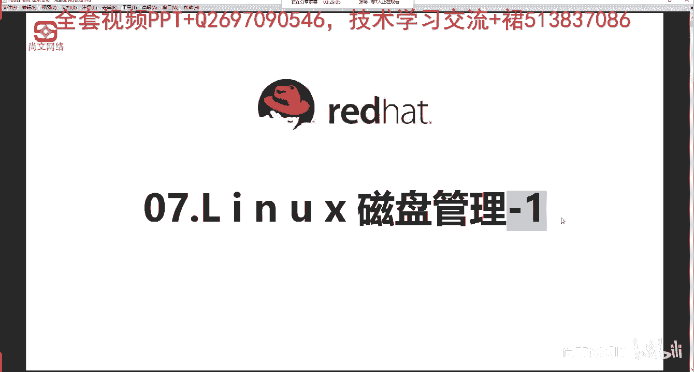
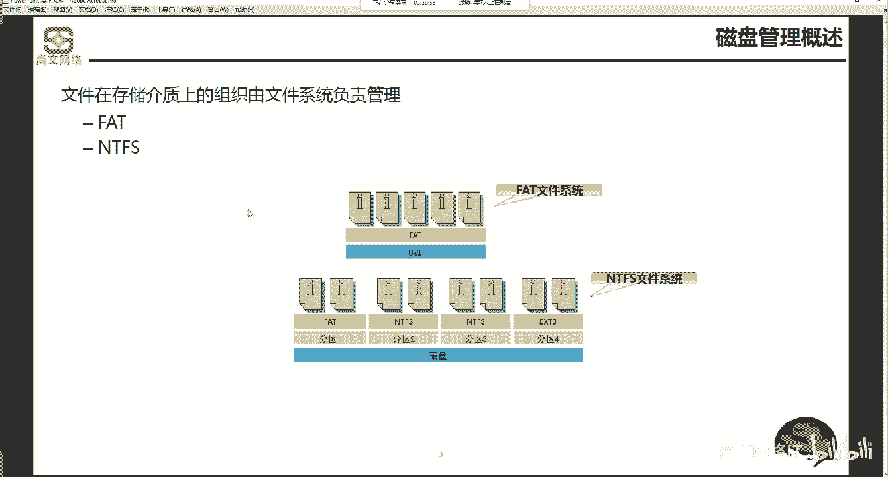
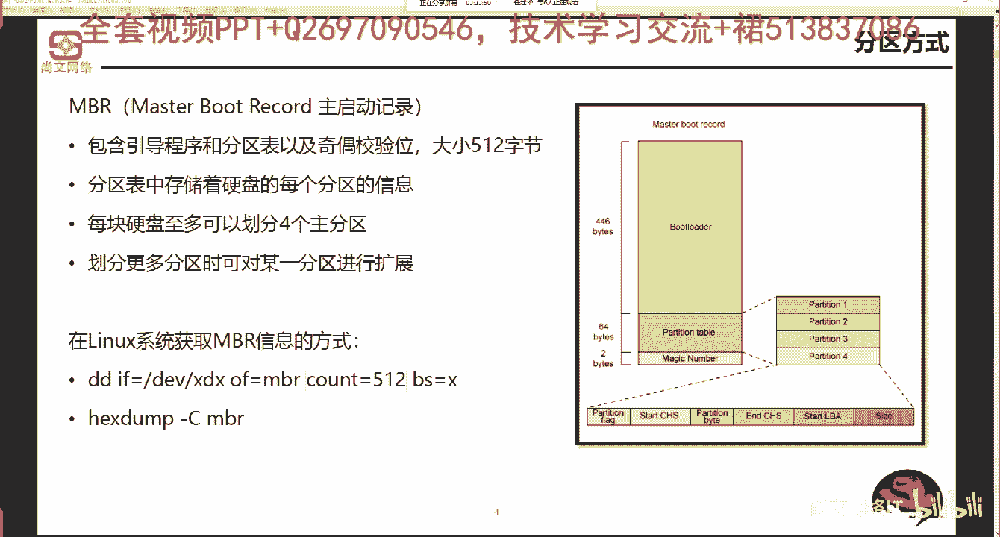
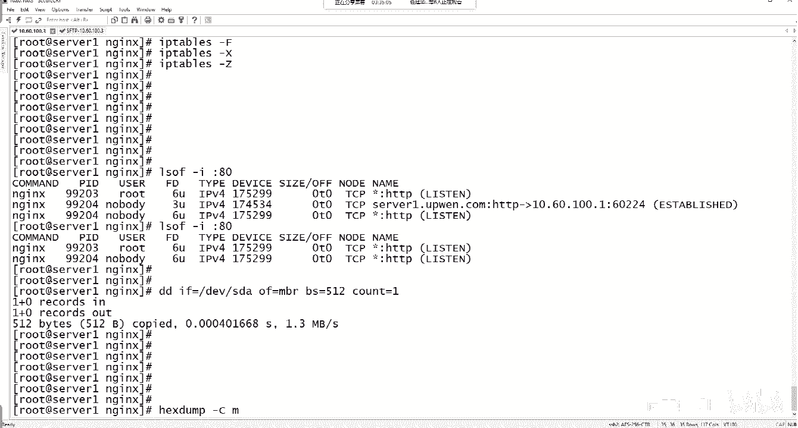
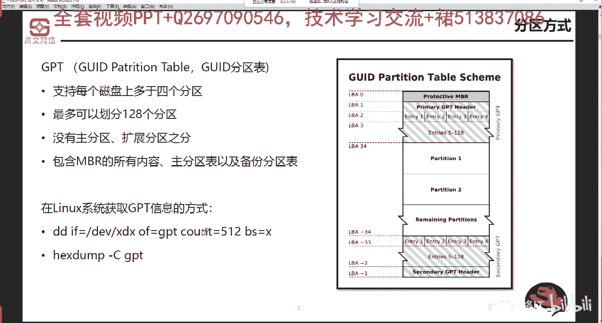
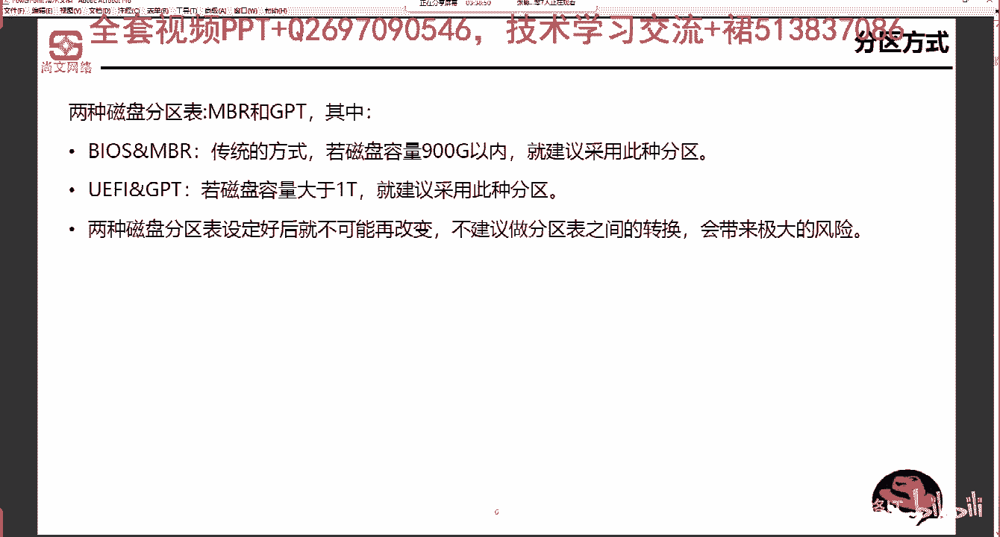

# Linux运维／RHCSA／红帽认证／RHCE8-07-1 磁盘分区类型(MBR&GPT)【尚文网络】 - P1 - 尚文网络IT - BV1dh41197zy

好，然后这个磁盘管理啊，磁盘管理呢一共有两张PPT。有两张PPT那个PPT今天这张PPT呢是第一部分啊，第一部分就是磁盘管理的杠一啊，第一部分。

嗯，第一部分的这个PPT呢主要是这个这个这样的几个几个内容啊，就是了解分区的一些概念啊。当然前期我们在第一天的时候已经了解的差不多了啊，然后第二个呢，就是我们了解一下这个关于因为牵牵扯到硬盘，对吧？

牵扯到硬盘，我们会。额外的再去了解一些我们现在国内外的一些主流的存储厂商的一些产品线。然后呢，再一个就是呃存储方面的一些技术的解决方案。再一个呢就是我们通过一个模拟器，对吧？

我们通过模拟器去掌握到那个怎么样去对一个存储设备啊，或者说对一个存储人链进行这个配置。也就是说我们对于这个操作系统啊操作系统来讲。我们能能认到一块盘，对吧？我们人中能认到一块磁盘。

就是我们是怎么我们通过什么样的一些技术，通过什么样的一些手段，我们能拿到这一块盘。对吧这个呢就是我们再去做对于这个linux套系统啊，对于系统是在呃认到盘之后。

我们肯定要对它进行分区格式化那个然后进行这个挂来进行使用，是吧？那么我们需要前期把前期的这一些。呃，我们能认到盘的这些条件，欠缺条件、技术等等等等。我们需要去摸一摸啊，就是你怎么样能去能认到这一块盘。

首先第一个呢是磁盘管理的一个概述啊，这个首先就是文件系统，对吧？文件系统文件系统我们之前也说过了啊，文件系统它是存储在介质上的组织，由文件系统来来进行这个负责管理。那么对于这个呃windows的来讲。

那ft和NT啊，这个就不多说了，是吧？fat和NT。这是文件系统啊，文件系统。

嗯，分区的方式是吧？此完的这个分区的方式。第一种是这个基于MBR的对吧？MBR叫m record啊注引导记录。呃，它的一个要点就是大小一共就是512个，字己，对吧？一共是512个。呃。

前面446大家可以看图是吧？这个地方446个字节是boot load啊，叫boot load是用来引导程序。开机启动了对吧？不嘟噜的，然后后面64个字节是partition table啊。

是这个磁盘分区表啊，分区表，它是64个字节。那么同时的话我们可以看右边的这个这个图，1234partition1234。因为每一个分区开始与结束的的这个扇区的空间数就是16个字节。

所以64除以16就等于4，导致了我们在MBR上只能画4个主分区。那如果说我想画多个分区必须要引入到什么扩展分区，然后进行通过这个逻辑分区再进行划分。啊，这是整个的这个MBR的一个东西。

那么linux在linux系统，我们怎么去获取1个MBR的一个方式呢？啊，获取信MBR的一个信息的方式呢。有两条命令啊有两条命令。第一条。啊，第一个命令叫DD啊命令。这个DD命令用途非常广非常广。

比如说我想去验证一个分区或者一块盘是否可以可读写的，我们可以通过滴D。然后第二个呢，我们去那个去排错，对吧？去排错。就说你这个盘它的一些相关的文件，对吧？磁盘大小够不够。

我们也可以通过DD命令来进行这个操作，第二个呢叫hat st啊，hats st呢是读取MBR中的一些相关的信息。当然它是一些1六进制的啊，十六进制的一些这个相关的信息。嗯。

我们都知道了MBR一共就是512个字节，对吧？我们可以做这样一个操作，比如DD啊if等于DEV下的这个XDX指的是什么呢？就是你的这块盘，就是你的MBR所在的盘。对吧所在的盘叫比如说DEV小的SDA啊。

这个X代表了是S或者是H。然后这个D呢就代表了是哪块盘啊，盘的号。那个if呢是以。啊，是以input啊，是是是指以这个input的这种方式来进行这个指定。然后OF呢是指以output以输出这种方式。

我们直接去指定MB2对吧？然后你这个count啊count呢是指定你单个块的大小是512BS是。呃，这个地方写的可能有一些问题啊，有些问题应该是BS是512，就是block side应该是512。

然后count应该是等于某一个count呢本身是一个数量，对吧？啊，它是一个数量。那我们来看一下啊，就是MB2呢，我们对于我们来讲，对于我们这台linux操新来讲，现在是不是只有一块盘。

对吧现在就一块盘第一块盘的话，它应该是DEV小的SDA啊，所以我们滴D。等于。第一第一杯小的。SD a。off等于MB2，然后这个BS等于。512。countt等于一。好。这条命令输出了之后对吧？

输出了之后，我们可以看到一个count是吧，就ca in，然后一个count就c out512个字节。写入了啊，重写入了花费了多长时间？连一秒都不到是吧，而且。我们来通过这个数值，每秒读每秒的速度是1。

31。3兆B，也就是每秒写的速度是1。3。所以说通过这个数值，我们还可以去判断出一个硬盘的性能怎么样啊，它的这个读写的性能是怎么样的。我们可以通过DD名来进行一个初步的一个判断，对吧？啊，通过它。好。

然后那个。杠大CNB2。

这个命令呢是用来查询查看我们的关于MBR的一些这个相关的一些读取的这个MBR的信息啊，这个你可能会看不懂，对吧？看不懂，主要呢就是右边这个位置，你可以从个挂b这个地方就能看到了就是。

这个MMBR其实上它包含了什么东西，叫挂b。啊，叫grab。就是说这个这个位置你会看到grab的一些相关的信息。我们那个MBR不是包含了三个部分嘛，比如说这个boot loader是吧。

bo loader，然后这个DPT，然后再加上这个那个magic是吧？呃，除此之外，那么我们通过它就可以看到前面的一些boot loader一些东西，包括你的这个gra的一些相关的这个信息。

挂b一些相关的信息。就是hdump杠C啊MB2。然后呢，这个另外一种分区叫GPT是吧？叫GUID的partition table叫GPTGPT呢这个就没有所谓的主分区逻辑分区扩展分区是分了。

而且它最多可以画128个分区啊，最多可以画128个分区。那个从这个图上就能看得出来，包含了它会包含几个部分。第一个呢是包含了MBR中所有内容。就是MBR有东西他都有。第二个呢就是主分区表。啊。

会有主分区表以及那个备份的分区表啊，备份的分区表。那么呃GPT和MBR之间的区别，首先没有主分区、扩展分区弱有分区，对吧？然后呢，它的优点就是可以画多个分区，比如说最多可以画到条目entr啊。

可以画到什么呢？55到128个这个这个分区啊。那么在linux系统下，如何去获得GPT的一个相关的分区呢？也是通过一样的道理。那我们可以通过滴D命令或者是ha dump杠 C啊。

GPT来获取相关的这个GPT的啊这种分区的方式。一些信息。

那么MBR也好，这个GPT也好，怎么去应用，对吧？我们怎么去就是什么什么样的一些场合，我们可以用MBR什么样的场合我们可以用GPT对吧？首先呢我们来看这两个bios和UEFfi我们上一课已经说过了。

对吧？bi和UEFI的一些区别。那么bios是和那个MB2是基本上是配合在一起了。也就是它是一种传统的这种方式。那我们设定一个限值。如果说你这个盘是900G以内，就是我1T以内。

那我们就可以考虑用MB2。那如果说你的磁盘大于一个T，对吧？大于T，我们就推荐你用GPT所以说我们用了MB2，我们就基本上通过lexibios。那么如果是GPT的话。

我们推荐是用通过UIfi和GPT进行这个分区的一些配合。啊，那么需要注意的就是。两种磁盘分区设定好后就不可能再给备人。如果说我现在审MB2的话，我很难再去转换到GPT。对吧很难回来去转，有有办法啊。

有有非常有办法可以之前转换，但是不建议做分区表之间的转换会带来极大的风险。首先分区表会丢。对吧分区表会丢，然后你分析表丢了，你你的那个什么，你找不到对应的这个分区表，那你的这个分区。也许出现了问题。

就无法造成的正常访问，对吧？所以说我们。要注意两种分区表设定好了之后呢，就不要再去换了。所以说我们把数据背出来了，背出来了之后，我们重新去建立这种分析表的关系啊，这个是OK的，这个是没问题的。啊。

分析的方式。

