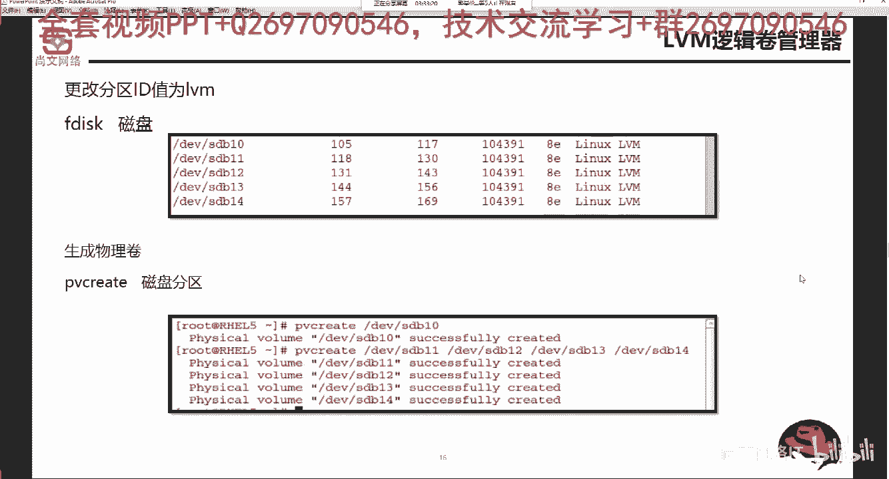
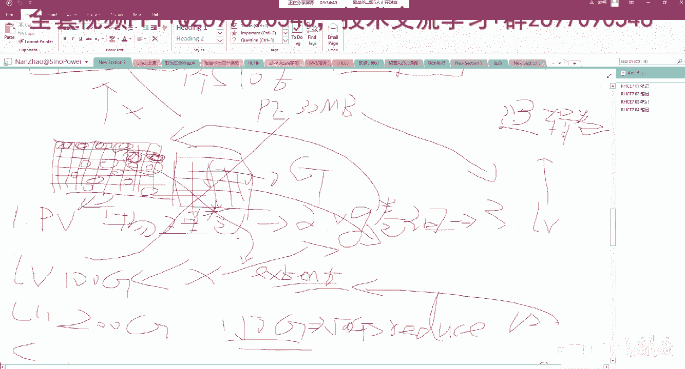
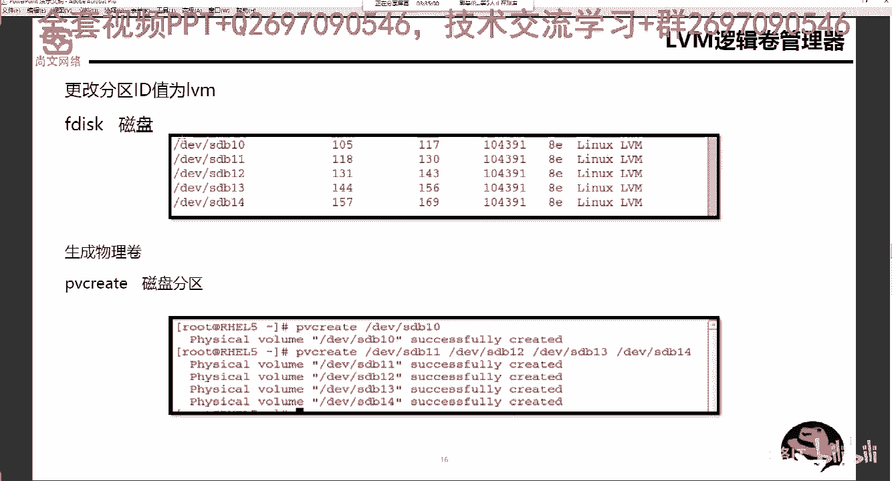

# Linux运维／RHCSA／红帽认证／RHCE8-07-10-1 LVM概念讲解【尚文网络】 - P1 - 尚文网络IT - BV1Fz4y1Z7h6

呃，我们再来看这个逻辑训验管理器啊，逻辑训验管理器LVM逻辑管理器呢，我们在第一天的时候我们已经说过了，对吧？已经大概说过了LVM的一些功能啊，它的一些东西。首先呢它首先要有PV叫物理卷是吧？

第二个呢是这个你把多个物理卷放到1个value group里面。

进行统一的管理。然后在这个val group的基础之上，我们要去新建LV啊逻辑卷。那么在呃创建V7的时候，我们要指定一个东西叫PE是吧？叫PEPE就是physicalcent啊。

就是说我们把我们的这个网那个。我们之前也画过是吧啊，这个PE所谓的就是把我们的这个呃valent group里面每一块盘啊，把它等腾化画成为大小一样的这个格子啊，就这种圈圈是吧？

就是格子这种格子就叫PE啊，那么你PE的个数容量如果越大，比如说最大的，比如说128啊，128兆，那么它的这个PE的格子数就是就越小对吧？以此类推。然后我们在其实这样呢，我们去创建这个LV逻辑卷啊。

创建出逻辑卷之后呢，我们要进行这个格式化分区，就是不是分区，就格式化，然后那个呃挂载使用是吧？与此同时，我们要去那个挂载到我们的实现开机自动挂载啊。

那么LVM呢嗯我们来看。第一个呢，我们要去把我们的几个value，就是我们的几个分区要转化为物理卷啊，转化为这个PV啊，转化为PV的先决条件呢，有是这样的，就是你要去确定某一些分区的它的那个ID为8亿。

啊，V8E。