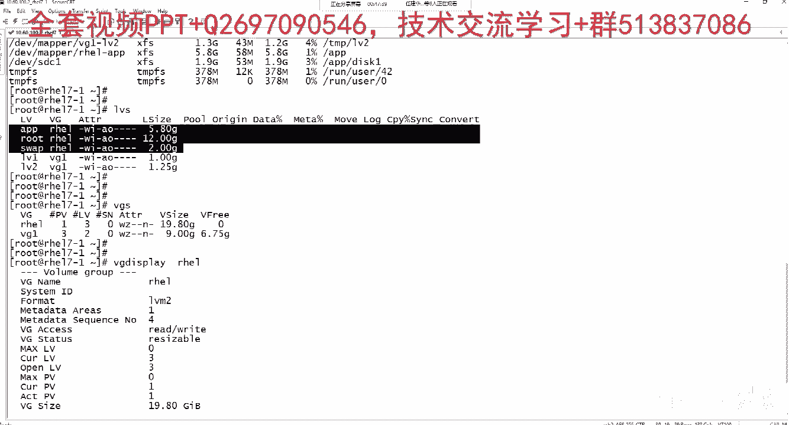
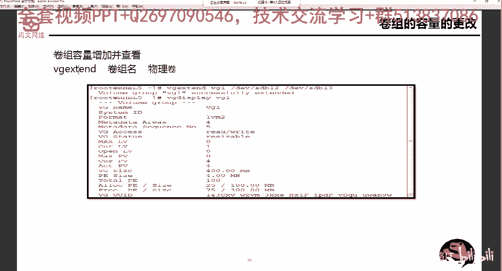
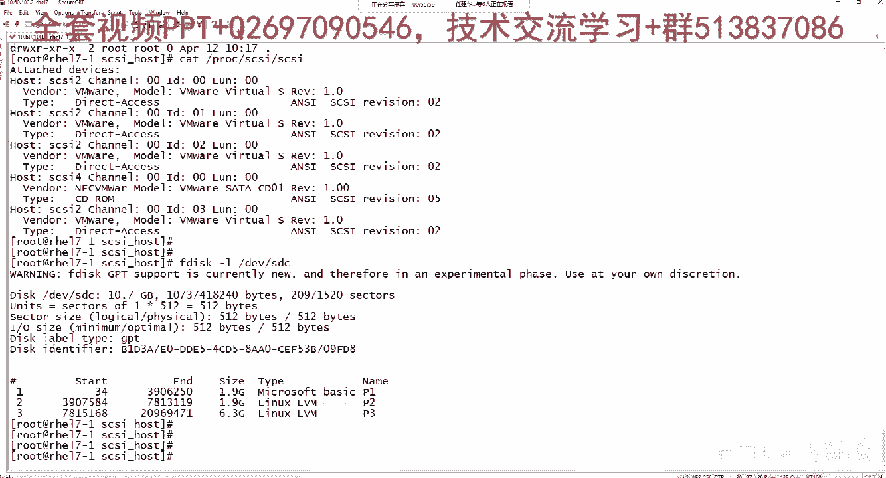
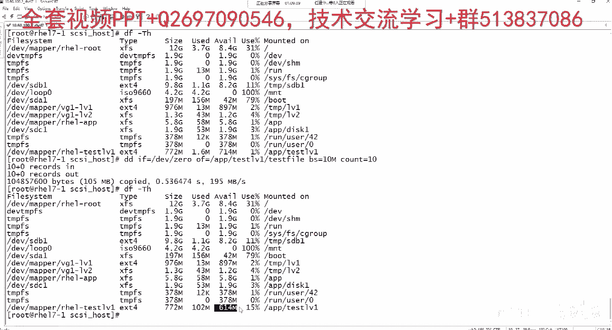

# Linux运维／RHCSA／红帽认证／RHCE8-07-10-3 对LVM中的VG和LV进行扩容和收缩配置【尚文网络】 - P1 - 尚文网络IT - BV1754y1y73R

那如果你你现在有了LVM的一个分区了。

DF减T1H是吧，DF减T1H你能看到，比如说这两个地方是吧，这两个地方是我们上一节课，啊这个，分区啊，通过这个LVM生成了两个分区对吧，生成两个分区，然后我们可以通过啊VGLVS啊。

通过LVS这个命令能看得到，比如说LV1这个LV它是在哪个圈子里面，是在VG1这个圈子里面对吧，然后它的大小是一个G，那VGLV2也是在VG1里，那也就是说从这个地方，我们看到Viper下的VG1杠。

LV1指的就是这个LV对吧，VG一下载LV2指的就是这个LV2，也是他们俩都是在VG1这个圈子里，都在VG一点，那我们可以通过VGS这个命令啊，VGS就能看到VG1的一些信息，比如说我现在有几个PV。

我现在有三个PV，我现在有VG，这里面有没有创建的LV，有两个LV，哪两个就是这个LV和这个LV对吧，然后它的这个VG的大小是9G，还剩6。575G对吧，还剩还剩6。75G说明使用率还不是很高。

那么上面这个呢，就是我们在装操作系统的时候对吧，当时那个20G的一个一个一个一个大小，一个盘呃，有一个PV，然后有LV有三个LV，大家想一想，大家可以想一下，他现在这个REFREE是零。

也就是说他现在已经没有空间了，对吧啊，那么详细的话我们可以通过vg display，通过vg display，比如说RH1通过这个命令我们来看VG啊，就是RH1这个VG里面的一个详细，更详细的信息。

比如说你的状态是可用的对吧，你的状态是那个可用的啊，然后你的这个这个这个模式应该是什么，可读可写对吧，可读可写，然后这个VG大小是比如说数据点8G啊，P的大小是多少四兆啊，P的大小是四个兆。

然后多少个PE是吧，就是你5096×4兆，也就是说差不多是这么大，那么你现在allocate，就是以分配的PE或者是大小是什么，已分配了509，也就是说所有的这个这个size。

这个大小是不是都已经使用了，fit的PE或者size是零，那也就是说我们现在这个RACE，这个VG里面，现在已经没有可用的PE，或者是可用的那个大小了啊，就是没有空间了对吧，就是没有空间了。

那如果假如说我的根啊，我们可以看啊，啊现在是不是current lv啊，current lv是三个LV对吧，三个LV哪三个LV，我们从LVS是不是就能看得到app，是不是R需要这个圈子里root。

是不是在这个圈子里，swap是不是也是在这个圈子里对吧，也就是说这个这三个是，我们之前第一天装操作系统的时候，我们通过分配的时候去分配的对吧。

假如说我们的根，那样，我们的根，我们通过这个地方就能看得到DEV下的map，下的REHL杠root，实际上是不是就是它12个G对吧，这个地方是不是12个G，假如说有一天他上他这个可用了，还剩一个G。

两个G他是已经使用了80%多，90多了，怎么办，这个根马上就要写。

写满了，怎么办对吧，咱这个操作系统它的灵魂，它的核心是不是就是根，为什么它挂在根下面对吧，如果这个时候，如果他快要写完的时候。

我们怎么办，我们是不是不是可以考虑把一个PV对吧，就是说把一块分区或一个盘或者一个盘的分区，比如说DEV下载SDD4，比如说ADEV下来SDC3是吧，通过这样的一些分区，首先把它作为一个PV。

怎么怎么去做PV，通过pv create是吧，通过PVCREIT这个命令。

把一个分区或个盘转化成一个PV啊，生成一个物理卷。

然后我们通过一个命令叫vg it，it是吧，叫vg excel，把这个PV扔到我们的这个物理渲染里面。

对吧啊，我们可以模拟一下啊。

可以模拟一下，比如说我添加一块盘，我添加一块硬盘啊，我直接直接按照默认来就行，下一步嗯，比如说比如说史记吧，做实验是吧，十个G下一步完成好，我现在添加了一个十个G的，等一个盘是吧，确定。

然后那个我们可以现在来看一下。

现在来看一下，点击设置，我们假设这个盘是从存储上划过的那个value，或者划过来那么烂对吧，节课好意思去研究这个东西，画完了之后，大家看1234，这是第四块对吧。

第四块盘的C大C盘应该是叫DV下的SD了对吧，如果是第五块盘，是不是D音微小的SE对吧啊，这个呢就是SD我们可以看一下是吧，fit干啥呀。

我们来找DLV上SDA有没问题。

然后这个SDB也有没问题。

SDC也有没问题，但是唯独就是没有SDD对吧啊。

没有SDD我们上节课是不是说过了，通过一种方法对不重启操作系统之前，是不是可以做扫描磁盘的动作对吧。

cit啊，比如PROCC8C。

啊这个西GC2的channel是一个直点，什么direct access，说明这是一块盘对吧，CRC2的channel是一个direct access。

CRC2的channel是一个direct access，CRC4的channel是一个CDROM，所以说SDA盘是在这SDD盘，是在这SDC盘是在这，也就是说不管是SDSDDSDC。

他的CGC的channel是SCC就是西卡it to啊。

是二这个通道对吧，通过这个channel，那我们现在可以做echo啊，我们之前说过了，是不是啊，那个PCC4。

稍等我看一下啊。

放一下吧，找一下吧，没有吗。

就是在这儿啊，在这size class啊，c it gc host是吧。

在这，注意这个地方是有空格的啊，有空格的cl it把c cos，然后cost2啊，那个进行一个查看。

然后下面sky是吧，通过它好。

然后我们再来看一下啊FG的杠L。

这个地方是不是多了个SDD是吧，DLV下载SD，还有一种是l s b block。

A s b block，我们通过这个人也能看得到对吧。

SDD是不是出来了对吧，是十个G的空间。

所以说这个地方他为什么说是钥匙，要用这个host2。

而不是说用host4或者八十十二对吧，我们可以看到这个目录上节课也看过了是吧。

这个目录，CD目录不太好记，可以CD一点点去看一下。

在这里面它是应该有0~0到32对吧，有这么多，为什么我们在扫的时候不是扫零对吧，不是用host的零的那个sky或者是25的磁感，为什么非要用host的二，就是因为我们通过，通过它来判断出来的对吧。

你是在基于哪个通道啊，你是基于哪个通道啊，这个地方要注意好，我们我们认出来之后呢，我们通过这个pit it命令吧对吧，我们上节课是通过FDC啊，比如f disc那个第LV下的第。

通过它来看看这个地方是LVM对吧，是LVM，一个是1。9G99G一个16。3G的啊，这两个分区我们是把它作为一个LVM啊，如果你是GFG的话，是不是要改为他的那个it是吧，it改为LVM。

然后呢我们可以通过这个通过party的命令。

一边是SD是吧。

首先呢，我们可以先去进行一个这个那个那个make it，label啊，先去做一个这个卷标是吧。

要把它改为这个GPT了是吧啊，GBT的第二个呢，就是我们通过这个making part做一个分区是吧。

起个名啊，比如说PP1文件系统。

这个我们直接回车就行了啊，上节课我们说了。

如果你是启动的话是吧，从哪个开始啊，我如果直接加一个一的话，就是整个这个盘啊，十个G的盘我就给了，总共就做了一个这个分区好。

他说你这样做会会可能会影响一些性能啊。

这个没关系，我们打一个print，打印print，你的这个大小10。7个G的大小，这个整个这个盘子大小就给了number1的这个分区，对吧啊，为什么呢，零大数是零，结束是一。

整个盘的这个分区的大小给了这个number1的分区，它的名称是PP1啊，就是我们刚才在创建的时候是叫PP1，然后呢我们我们之前说过了。

就是你呃quit it第四杠L第一CD嗯。

我们现在是不是通过FD设这个命令，是不是可以做那个查看得到，刚才通过party it命令来创建了这个SDD的，硬盘的分区对吧，四个G的大小，那我们刚才我们上节课也说过了，你要成为一个你要做LVM。

首先你可能要有那个PV嘛啊，物理卷，那你的这个物理卷的话，如果你是要让它成为一个物理卷对吧，必须要让它成的分区的it，比如说DLV下来SDD1对吧，就这个分区啊，比如说LLDEV小SDD。

我刚才是不是只是对SDD这个盘做了一个分区，对吧，就这十个系列大小的区，我现在只有一个SDD的这么一个分区，那么让他的SDD1的分区，要成为一个那个物理卷，我们这填先提条件。

是不是要怎么样让这个分区的it啊，DEV小，SDDE的这个分区的ID为LVM，能认得到的那个ID，比如说8E对吧，82是不是swap的对吧，八三的是不是这个标准的STD的，那么8E的话是不是。

Linux lvm，对不对，我们上节课说过了啊，这就是他的id号啊，如果你是83的话，是这个标准分区了。

如果是八一的是LINUXLVM的对吧，你怎么看，在上面这块也能看出来这个地方看到了吗，对不对，如果你是八三的话，就是那个标准分区，如果是8E的话。

是LINUX啊，LVM再往上看，这是不是有个swap，82是不是代表了linux swap。

没错吧对吧，那好。

那我们现在就是说我们因为刚才是通过gp it，那就是通过parit it啊。

来进行对SD这个盘做了一个格式化。

过了做了一个分区，还没格式化啊，只是做一个分区，那我们现在如果说通过FG4K我们来看啊，能不能把它转成是吧，转成这个八一的啊，Lvm vg。

你敲一个P键对吧，打印出我们的这个分区表，然后怎么样去改它的it呢。

是不是按T键对吧，然后说选择了帕丁森，一了解就是它那么按L键是吧。

我们可以列出来有哪一些LINUXLVM，看看有没有LINUXLVM，哎这个地方叫31，看到了吗，他的这个31看到了吧，啊对不对啊。

那我们再来看它原先的这个tab叫什么，Microsoft basic，看到了，我们找一找有没有microsoft basic，有是有11啊。

比如他的这个it为11，那我们刚才说了，哎，你这个标准不是说LINUXLVM。

应该是8E的一个ID吗，怎么他的这个i it怎么成了31了呢。

对吧啊，这个呢是基于我们party啊，party这种工具来做的。

如果大家要记住啊，大家要记住，我们尽量这样来说啊，尽量这样来说FDC，如果这个工具就是通过，进行的分区，不管是啊这个分区做swap，标准分区，还是比如说LVM啊，他这个做出来之后，尽量的。

通过FD进行后面的管理和分配，就是比如说我画了一个分区啊，就是比如说通过FDC说话，D叫DLV下载SDC啊，或者SD这个分区我是通过FD合作的，那么后期的话可能要对DEV下来，SDD1这个分区进行。

比如说it的，更改，那我们尽量说通过FD这个命令对吧，怎么去更改按T键是吧，然后你可以写个直接是8亿啊，就从LINUX，Lvm，那如果你是通过那个party it，工具进行分区啊。

就像我们刚才通过party d EV下的SDD，给他进行分区，分了个区之后，他是不是叫DV下的SDDE对吧，那如果要对他进行后期的管理，比如说哎我就要让他作为L做做那个LVM的，匹配是吧。

那么我们也是尽量的，尽量的是吧，通过FTK，通过parit it，进行管理，也就是说我们通过FDC的话，我们尽量不要用PARTIT去做相关的动作，那么用party的话。

尽量也就是说不要通过在FD里面进行做啊，明白了这个意思，那么怎么样去对这个LVM是啊，他做的这个分区作为一个LVM，我们通过一个命令叫set it lvm，这叫set it lvm的。

啊啊当然你你的这个你的这个中间呢，你要加这个分区域，分区号啊要加分，序号，就是我们通过这个it it命令啊，it it这种动作，来把我们这个分区号来进行这个表示。

那我们来看一下啊，来看一下好，我们退了啊，我们就不要通过FG4了。

DK下来SDD说一个help。

这个地方是不是有个it是吧，Set number，这个number指的是谁。

对我们打印一个print，是不是指的他对吧，就是这个number啊，Set number，比如说我现在只有一个分区，那就是it it空格一，单位去改变它的flag对吧，改变他这个flag，那么怎么去改。

比如it it，it it1LVM好搞定。

我们再打一个print的时候，他的flag是不是叫LVM了，看到了吧，是不是要LVM了，原先这个地方flag是没有的对吧。

退出FD4杠L，第一我们通过可以通过F1的杠L啊，杠L是list命令是吧。

是查看的意思，查看它的分区，你看他的太火，我们在之前查看的时候是不是叫。

basic对吧。

Microsoft basic，那么我们现在去再去查看的时候，他们的CP叫什么，LINUX的LVM，那么接下来的话我们通过PV和VGDCDE，说value physical value。

它已经成功地创建了。

对吧啊PB看到了吧，呃第一对象SDD1，我现在是不是没有在哪个圈子里面对吧，没他现在是是自己单玩啊，自己单独的，没有在那个圈子里面对吧，没有在哪个单位建筑里，那我们可以通过那个VG啊，一寸的这个面。

是吧，通过vg excel命令跟上卷组名，然后物理卷我们来看VGS现在哪个VG。

哪一个VG是它的空间已经不够了，肯定是我们之前这个操作系统的这个对吧，那么这个时候VG，其实把后面跟卷组名IE需要，然后跟哪个DLV小梁。

vue group i shells已经成功的叫什么excel exceit啊。

扩展了，我已经被扩展了，我再敲VGS，大家看这个地方它的扩，它的容量是不是就够了啊，我们还可以vg display i it。

需要，对啊，他这个free的PE啊可以有这么多啊，有这么多，那我们是不是可以在这个地方，我们再再去创建输出的LV，可以挡L比那个比如说5G是吧啊，或者是用小药，比如说200个P啊，200个PE。

那他P大小是多少四兆，那么四二百乘以四是吧，差不多就是这个这个800兆，我们可以看一下是吧，杠L啊，比如说啊起个名李校长啊，起个名叫，比如说这个这个test lv吧，Lv1，然后哪个在哪个圈子里面呢。

是h l lv a lv test lv1，我们就创建成功了，那么我是在哪个圈子里，是不是在RC2这个卷组里对吧，Lv s，这个地方对吧，我们是不是在RA需要这个加速度，800兆对吧没错。

然后make点X74B1B下的那个RECL，这个卷轴下载test回车了是吧，然后新建一个，比如说杠PAPP一下的，比如test lv11，我们对应下来是吧，mount比V下的IH一下的啊。

test lv1那个P下来，test21好过来，使用BF减大T小H是不是就在这个地方对吧。

那dd啊，it等于下的vg zero，然后VG等于app，LV一一下载一个test v大小是多少，比如说十十兆写多少次啊，比如说写十次，那就是10×10这么多。

对吧啊，那我们再来看啊。

DF线大题小一致，原先我们在写之前是不是772兆啊，available啊，可剩700余四招，那么现在被被用掉了，所以是不是100嘛对吧，现在是还剩614种啊。

我们用了十五百%分之一，那如果想实现这个想实现开机自动挂载，对不对，VRETCTV把它写进去呗，对不对，怎么写，DEV下的那个RA需要下的SLV1对吧，tab键啊，关了一点。

是谁app下的test lv1怎么来对应一下是吧，那你的那个文件系统名，文件系统格式一下C4是吧，参数in false，是不是要进行pass或者done，就这么简单对吧啊，就这么简单，这样的话。

你重启之后就可以实现这个开机自动挂载。

好这个呢就是VG一次了啊。

VG一次的，那么在额外的再就是再跟大家多说一点啊。

再多说一点，pv creit it命令是，生成物理卷，我们之前一再强调是吧，一再强调，说你要在生成物理卷之前，一定要把分区，啊比如说DEV下的SDD1，i it改为LINUX，Lvm。

那我们比如说如果你是FD4的是吧，那就是就是改为a cut，it为8E啊，如果你是party的话，你怎么做，比如说这个it1LVM啊，就他的flag就成了啊，什么那个LINUXBLVM对吧，就这两种。

但实际上啊，实际上如果你不是不做这个it的转换，比如说这个做通过FDC按T键，这玩意按8it就生成了这LINUXLVM，或者是这个party了，我们通过it it e lv吗。

把flag改为了LINUXLV，如果我们直接就是说，比如说一个八三的一个标准啊，或者是你你你PARIT的对吧，我们是比如说这个f disco做了啊，他的id是83，或者是我们的这个PARIT啊，直接。

直接进行的分区，实际上啊也可以，实际上也可以通过pv creit it命令，通过pp壳进行进行这个物理卷的，受众，但是为什么我们之前一直强调说，我们在在生成PVCREIT时候之前。

我们一定要去做这个it的转换，他的目的是什么呢，就是为了方便的管理LV，你想我敲过一个命令FD车是吧。

如果比如说在这个地方敲一个命令啊，敲敲了敲了敲去敲那个FD是杠L对吧，如果你这个地方是你的type，是是那个是max soft basic，或者是前面的这些分区，比如FC可杠LV下的。

SDA你看前面就算了，这个地方如果他是83的it，那么SDE一样可以作为一个pv curit it啊，在P课程一样可以转换，但是你想我怎么能确定对吧，我怎么能确定这个他的这个83。

这个LINUX就是给LVM用的呢对吧，所以我们通过这种标记啊，通过他的it也好，或者他的flag也好，就很方便的去知道啊，很清楚的知道这个分区就是给LVM用的啊，当然我们敲p vs也能看得到对吧。

我们敲p vs这些就是都是通过FG也好，或者是party it也好，做了这个LVM的一个标记，对吧啊，这也也能看得到，但是管理起来就比较麻烦啊，对就是这个啊S12我一看就是LVM，那我就知道了。

那么它对应的就是它对吧啊。

大家要注意啊，就是这个地方一定要注意，你多做一步，多做一步，把id改了，把it改了，这样的话以后你省事。

好这个是VG的啊。

