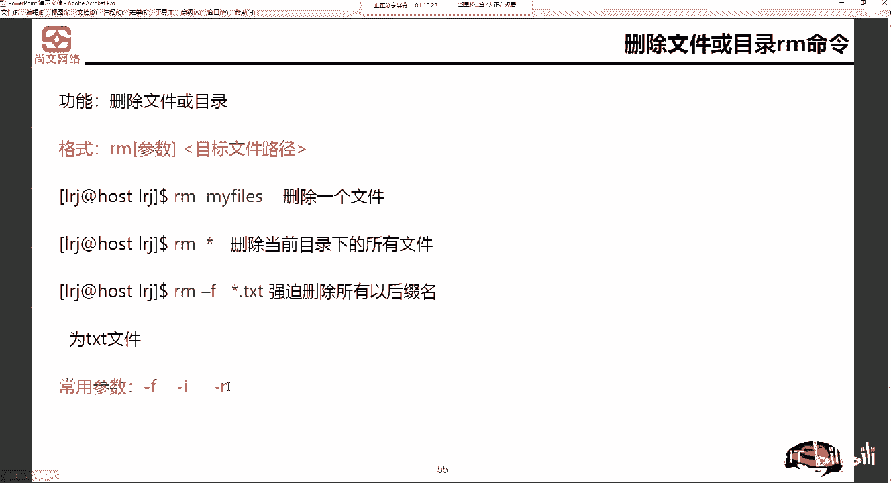
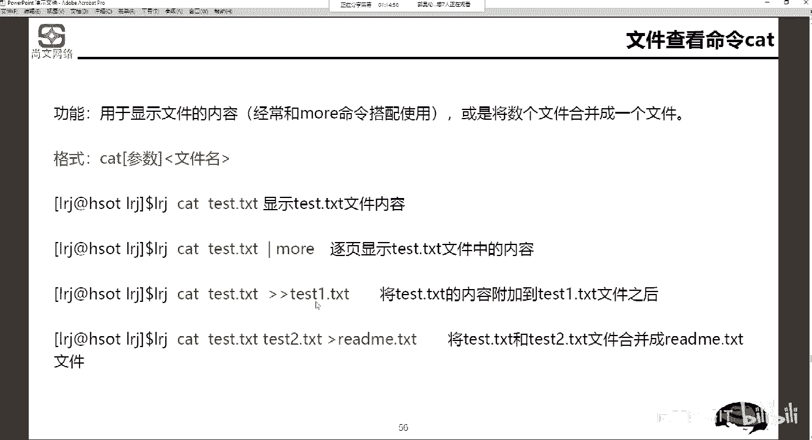

# Linux运维／RHCSA／红帽认证／RHCE804-5-2 Linux基础操作命令【尚文网络】 - P1 - 尚文网络IT - BV1GZ4y1T7Qm

删除。好。然后再再一个呢就是这个toash命令啊toash命令。toash命令呢是生成一个空文件，或者是修改文件的存取修改时间的记录值。啊，生成一个空文件或修改文件的存取啊，修改记录值。

这个touch呢是它相当是创建了一个空文件啊，创建一个空文件。嗯。如果说只是touch空格ABC，那么我们是存是是相来于是创建一个空文件啊，那么这个创建空文件呢又又又分两种循环。

如果说我们这个ABC存在了。啊，如果ABC这个文件存在了，那么它修改的是当前系统的时间。如果不存在啊，这个文件如果原先不存在，那么我们会生成一个空的文。아 저는 코 더 이제。

同时我们可以通过toash命令加参数啊，去把我们的这个文件的日期改为。

一个啊日期的时间啊改为这种一个这种日期的时间啊，我们首先来看一下pas，比如说。啊，test fail。啊，我们创建了一个空文件啊，LS杠1L。🎼我们可以看到这个时间，比如说15点43啊。

15点43有一个这个文件。那么你怎么去判断这个文件是不是空文件呢？我们ca一下就可以了。ca。才测的费。首先里面没有内容，对吧？给我们回输出的是一些就没有。另外一个呢。

我们可以通过这个地方大小可以判断出你的这个文件是不是。空文件。然后通过他来判断出你这个大小是不是空文的。通过他啊来判断出。是不是空了你啊，这个要注意啊要注意。好，那好，我如果我再来啊。

我再来一次pas test。他没有报错，他不会你说提示说我这个文件已经存在了，然后不动让你touch是吧？他一没有报错。那我们我们再来LS杠杠ALT啊，我们活用LS杠ELT。

你会发现它的时间修改时间原先从15点43变为了15点44，看到了吧？这个文件的记录时我就变。文念的记录十去变。这是touch啊touch。

好啊。接下来的话就是对于这个文件进行复制了啊，叫CP啊，叫copy。嗯，copy命令呢可以从文件的一处复制到另外一处。一般在使用CP的时候，是将文件从一个地方复制到另外一个。啊，从一个地方撕到另外一个。

需要指定原文件名和物件名的或目录啊，这个地址它的这个文件名和原文件名和目标文件名的这个名称或目录的名称。它的格式是这个样CP啊，后边后面要加一些这个参数，然后是原文件路径，然后是目标路径文件路径。

一个常用的参数呢是吧有这样几个有杠I杠F杠R杠V和杠P。杠I呢是指定我是以这个忽略啊大小写的这种形式啊来进行这个复制。然后杠F呢是指定我们这个文件的名称。然后杠R呢啊杠R这个地方我们要注意啊啊。

杠R是指的叫递归复值啊，叫递归复值。就地归。低亏回存。然后杠V是显示出详细的这个复制的这些信息。然后杠P。啊，杠屁股。我们在刚才在在makeDR和RMDR的时候指定的杠P的参数是吧？

杠P是递归怎么怎么样。那么CP的话，它的递归是是小写的R。啊，小写R，而不是杠P的。那么这个P指的是什么权限复制。什么叫权限复制呢？你原文件的，比如说这个原文件是root用户创建的。

那么你复制到了一个非root用户的下面的一个文件夹下面。那么你是不是应该你在cpy的时候。你可以指定杠P的参数，把原文件的这些权限啊。通通的啊。权限复制过来，复制到我们的这个目标的这个文件路径啊。

是这样来做。那么我们看两个例子，第一个那CPDE空格d。我们把当前目录下的date1点TST啊，又copy了一份啊，copy成了叫date2点TST。然后第二个CP啊date3点TSRCcopy到哪里？

TMP下的啊d么东西。那么它的目标文件名是不是还叫D3。CS，对吧？我们来看这个例子啊来看例子。首先。

啊，CP。依啲 c。利。点儿啊。我们把ETC下的passter B这个文件copy到了当前目下是吧？那么我们可以加一些参数，比如说杠V。你说家干嘛？杠V是显示出详细的信息，杠R是递归。

然后杠P是权限复制。回车。然后这一块啊这一块它会有一些显示是吧？这个地方就是用了杠V的啊参数啊，用了杠V的参数。我的原文件是ETC下的password，然后这个指定了当前目下。

你名字也叫password。那么当前目录是哪个目是不叫PWD是APP目录是吧？那么我们LS杠ARP我们会发现这个地方多了一个什么pass这个文件啊，多了一个pas这么一个。

一个文件。那么我们可以copy，是不是也可以进行这个移动是吧啊，可以进行这个移动啊，进行移动。嗯，移动的话是。呃把这个很简单了哈，很好理解。那么我们把这个某个文件啊。

从一个文件夹上移动到另外一个文件夹是吧？就如说我们MV啊当前目像了pass word。

我们移动到PMP模像。L杠12T那么passWD这个文件就没了，对吧？啊，就没了。那我们可以看一下LL啊TNP。或者是LS。S杠A17。对吧LS杠ART我们来看看有没有这个passW在这个地方有是吧？

啊，然后它相当于是通过MV的操作啊，MV的操作，把我们的这个。

啊，原来APP目录下有个passtar文件，又给它移动到了TMP目录下。那么在这个地方。啊，在这个地方，那么MV呢同时还可以对一个文件做一个重命名啊，做一个重命名。比如说。

嗯。我们还是。CP杠RFP啊。E t c八等啲。打天不录是吧，考不过来了。华回过来了之后，我们给他起画个名。改个叫pasword是吧？然后原先叫passWD现在是不是叫pasword了，对吧？啊。

但实际上内容是吧ca pass。word内容都是一样的啊，它的内容都是一样的。

好，我可以copy，我可以MV是不我可以改名，我可以可去删除是吧？啊，可以删除RM啊，叫RM。RM是删除一个文件或者是目录，要注意啊，RMDR只是删目录，然后你的这个RM是删除文件或者是目录。

而且RMDR是只能删飞空的。对吧只能去删除这种空目录啊，你非空的目录它删不了。但是RM就不一样了啊，RM就不一样。比如说IM my files啊，删除my files这个文件。

RM空格星删除当前目下的所有文件。RM杠F啊，是强迫啊强制删除所有的TST的文件。那么几个参数呢，杠F是指定文件名，杠I是忽略大小写杠R是呃，不是杠F这个地方是指强制啊强迫fse啊，杠杠fse。

乔治删除。这个文件或者目录，然后杠R是递归啊，是递归删除。

所以说为什么那天看哪个小伙伴里面发的杠M杠F跟。通过递归强制的方式去把该目录给删除了，对吧？啊，是通过这样方式。🎼这linlinux选linux业界的一个梗是吧啊IM空格杠F。

对。

好。然后我们来看啊1S。2M。我们啥也比如说pass word。它会有一个提示是吧？是否要删除regular file啊，是否要删除常规的文件fasport。如果我敲一个N回车，我再敲X。

这个文件是不是还在？如果我IM。pas word，我敲了一个Y回车。那个pasword手据没了。🎼好，我们继续做1个CP的操作啊，CP。啊，我又把pass给copy过来了啊，很快。

然后RM杠FPSWB他有没有让你提示说哎，我要删是不是要删除，那对对，就是他不会给我们一个回退的可能是吧？你如果加了杠F啊，他直接就是强制删除啊，直接就删除。那如果说我们再来那第二，对不对？

然后LS杠1T。我会发现。刚才通过。递V的方式去删了然去加了啊第二test一这个这个目录。那么test2test一后面又有test2，test2又有test3，我直接删除IM杠RF啊。

当前梦想test一。没有任何的提示是吧？没有任何的提示。说哎呦怎你这个下面还有子目录，我删不了，没有啊L等于1T是吧？把泰斯的一这个目录就给删掉。所以说我们删除目录IMDR。或者是什么RM对吧？

都可以删除。

都可以进行删除。

文件查看啊文件查看啊，我们再做1个CP。我们又cooffpy过来了是吧？cat pass到一。

从物。最好。一直往下走。

到这一行全部都是pass W这个文件的内。

这里面就这东西就是它的内容。Kt。

好，然后这个。我们可能还会用用到一个东西叫管道符啊，就是这个东西，一个竖的起，一个竖的小斜线啊，一个竖的小小的竖线。

这个管道服是怎么做的呢？你你是怎么能去拿到这个管道符呢？你按住shift键。加。回车上面的那个反斜杠啊，shiftft键加回车上面的反向杠，你就出来这个竖小竖线了。啊，比如说LS杠1。当前目录是吧。

我要查看当前目录下面有什么样的文件呢或目录呢？然后我去gra啊，去筛一下有没有比如说。password。对吧啊，有没有pass word的？而且你会发现。我们CRT那边这个这边罗列出来，你看这个PSS。

而且是以。黑色加粗的这种方式显示出来的对吧？啊，黑色加粗的方式就是因为它要去匹配什么你的这个gra的关键字啊，是不是我们在APP目录下，是不是该有可以查查出有关于啊PSS相关的一些文件。

那么通过这个查出我们找到了有pas是吧？所以是个管道服啊，就是这么用啊这么用。

那么逐页去显示test的。点TSE中文件的内容。那么这个cat呢还可以呃做一些这个追加和合并的一些这种。操作啊。嗯，我们是通过两个。我们是通过在这儿啊，通过两个。监管号和一个监管号。

那么两个监括号是指将test TST中的文件的内容附加到test的一点TSE中的文件的内容。

我们可以去去做一个东西是吧？啊，我们可以做一个嗯。比如说CP。杠RFP。ETC那个INDT这个文件我们知道了是吧，我们copy过来了。L玩有当然现是在哪个目录啊，APP录下嘛。

有IITTEB有passterD对吧？啊，那么我们可以做catIITTEB以两个监控号的方式。做。实际上这一步是什么呢？是将IITTEB里面文件的内容追加到password的文。

首先我们看看原先pass word的文件里面有什么东西。有这些东西是吧？然后它的最尾部叫test。那么我们再来看t。你会发现。他的头还是哦root，那么它的尾巴是什么呢？

就是那么这些内容是不是就是那个IITTEB这边文件的内容，对吧？啊，就是IITTEB的文文件的内容。

那么一个结管号呢是将。两个文件的内容合并成一个新的文件的内容。

是吧啊要变成一个新的面章内容。我们可以这样做是吧？cat那个IITTEBWD文，然后血压到什么合并到什么。test file中对吧？我们ca一下test file。那么菜司的费用里面是不是就是多了？是。

除了我自身的IITTEB的里面的东西，加上我怕WD中的东西。加上我pasa b的那功。啊，这是两个监口号是合并。啊，不是是居佳一个监控号是。合并对吧？啊，一个监管合并。

好，然后根据我们的这个文件内容啊，如果你看我现在因为我随着我合并的增多是吧？

cat这个test file。嗯，会发现这一屏啊就是我们这这一个屏幕是显示不出所有的这个这个这个呃test file中的内容了，对吧？你看我我现在这个地方，我是这是第一行是吧？你看我只有往下拉的时候。

我才能把这个。tt fail这个文件才能给所有的看清了，对吧？啊，也就是说我一屏我显示不出那么多，所以我可以通过head啊或者是tailllhead呢是显示出某一个文件的前多少行的内容。

那么tail呢是显示出。

文件尾的多少号内容啊，比如说我们。

害了。杠10，然后这个比如说t斯。啊，然后我们在这个地方嗯。我们拉了大一点是吧，拉的大一点。在这个地方哎，我们能看到了t file中的前十行的内容。那么同样的也是啊tll杠10或杠15。然后这个胎测。

是吧我们把能把这个texax file文文件中的最后15行。给我罗列出来。把这个最后手5条给我罗列出来。这一块应该也没什么问题，对吧？啊，也没有什么问题。

那么。这个tailll呢我们单独再来多说一下啊，tailll单独再来说一下。那么tailll呢它有一个参数，我们需要去灵活的去运用啊，有一个参数叫tailll杠。

啊，他要杠F。这个太太太杠F是指什么是指什么意思呢？它是实时的去追踪你的某一个文件里面有没有什么的变动。啊，有没有什么变动？我们比如说。拆测的费用啊。大家看这个地方这个光标的是闪是吧啊。

这个光标这是闪啊，这是闪。我现在呢我克隆一个session啊，我我点击右键啊，点击右键，我克隆一个绘话啊，克隆一个绘话。C点APP。然后我这个。Ale啊，我做一个操作啊，叫Ile就是说。哒啦啦啦，然后。

当前目录下的菜资料。好了，我做了这样一个操作是吧？你看我用到一个监控号，一看就不是什么好事啊，就是可能会把猜测飞中的文件给清空了啊，而且只留了这一行，我们看是不是这个样。啊吧他这会是不是有提示了。

看到了吧？啊，他这个地方是不是有提示了啊，好，我们按照ctrl加C取消。那么我们cat一下t fill。你看原先的t词fi是不是这么多行是吧？这么多。那么我通过这个这种方式我们做了一个追加啊。

做了一个追加。这里面有啥，是不是只有1111这一行？他没有。啊，所以t杠F是一个实时输出的啊跟踪的这么一个参数啊，这个等会非常好用。为什么我们在平常去捡去抓一些日志啊。

抓一些各种中间件的应用的数据库的日志，我们可能会用t杠F啊，去实时的去查看哪一些哪个时间段是吧？哪个日志报了什么样的错误。啊，我们可以通过这个地方啊来把它。

对。看出来啊能看出来。然后这个莫啊莫。帽呢是一般用于显示内容会超过画面长度的啊这么一种情况。因为我们比如说有些文件它确实是。一瓶根本就装不下对吧？我们这个时候呢就会用通过帽，然后这个帽呢呃。

最后我们还是用这个Q键啊跳离啊，用Q键跳离。

我们比如说做这样一个操作是吧？泰INTTEB然后pasWD然后。追焦到哪里呀？t fill啊ca test fail。他现在又成了这么多行了，对吧？然后我一行显示不出来，对吧？啊。

一行肯定就是一屏幕肯定是显示不出来的那我们这个时候可以用mo。下次都不要。啊。我们这个时候呢用空格键啊，用空格键。它这个地方会提示39%是吧？我按一下空格键，往往下翻一屏，到了94，再按一下空格键。

它就跳出来了啊，就跳出来了。

还有一个呢是这个。这个less啊less。

lessice呢和毛都差不多啊，less和毛都差不多。我们来看这个东西啊。roet test fill。如果我这个地方我可以用管道服务来加木看到了吧？是吧也可能也可以回撤。但是呢你不管是用管道服的方式。

还是说。用直接用mo的方式。你会发现他只能从上往下走，他是从下无法往上走。所以说这个时候呢，我们需要通过用这个less命令啊，比如说less。test fill对吧？我可以按住上下键，你看到没有？

按住上下键来回的去翻屏啊，按住上下键来回的去翻屏。如果我想跳出来之后怎么办？就按这个Q键。

啊，按小小的Q键就跳出来。🎼Q键就跳离了啊就跳离了。lessice呢比mo更好用一些啊，它可以上下的去翻动啊上下的去翻动。好，然后我们再来看一个命令。这个饭的。

fin了呢我们会单独拿出111张PPT来去讲它啊，今天我们都知道我们只是需要先知道它是干什么用的。fin了啊本身就是查找的意思是吧？用来查找文件或者是目录啊，为什么要单独拿出一张PPT讲呢？

是因为它的功能非常强大啊，非非常非常重要。非常非常重要啊，我们现在知道fin的只是用来查找文件和ro啊，就可以了啊就可以。

然后gra啊gra呢，我们刚才也做过一些操作是吧？啊，做过一些操作。比如说。S跟LT当前目录，然后控管道和gra，然后有没有passWPSS的这种关键字的，你看给你摄影出来有passW这个问。

对吧那我再比如cat。test fill我们可以我们可以去包含一下graff有没有有没有比如说关于root。这里面还还真有是吧？test文文件中的是不是有包含root的关键字，有，这是一行。

然后这儿又是一行。我们都会给我们进行这个罗列出。所以这个贵妇呢是用来查找筛选出这个相应的这个字符串的。

那么我们还可以通过gri呢去查找我们当前这个操作系统有没有装什么什么样的嗯什么什么样的那个包。比如说RPM杠PV，然后管道g，比如说那个IP。

把屏露出。你能敲IPAADDR这个命令啊，大家注意能敲IPAADDR这个命令，是因为你装了IProot这个包。所以说我们可以通过RPM杠QA的这个方式。

来来寻找啊来寻找有没有IP rootot的这么一种包，哎，还真有对吧？啊，4。10。11。0-14啊，点117。差56。

Tree啊 treee。处理命令是以树状图的形式列出文件的目录结构啊，是以树状的形式啊来列出。然后这个树状的形式呢，我们可以看首先第一个te啊，比如说协方APP，我们直敲命令嘛。

3e。然后大家看这个地方啊，我我发现我敲一个它提示什么com not found是吧啊，com not found。刚乱放的呢这个没有找到啊，这个倒是没关系啊，没关系。呃，我们可以通过一种方式嘛，是吧？

啊，我们看一下，通过一种方式。首先呢我们把我们的光驱把它挂在上。这个地方把我们的光驱挂在上。D。就一个面。DEV实DR，然后到挂到MNT某下CDMNT。然后是这个。Yeah。RPM杠H杠杠UID。

那个Te。好嗯。好了。我们假如不是装完了是吧？然后再来一个命码睡哦，直接罗列出了这么多是吧？我们先不要它。T理。这个。APP目录啊税APP目录。那么通过这个te的这个命令，我们就可以把把那个什么把这个。

APP目录下面有什么样的文件给罗列出来的，看到了吧？它就是一种竖状的结构给我们罗列出来了。那么train命呢。还可以加一些参数是吧？比如说re以杠D啊，re以杠D。吹以港D。你看我们。

我们把这个比如说TMP吧。我们把TMP啊按照这种方式给它罗列出来啊。或者说啊te杠D。APP。这个这下面没有怎目录是吧？啊，然后我们MK一下啊，MK一下。CDD啊CD老DB。啊，对一下。然后te撞地。

好，大家看我刚才通过make第递归的创建了三个目录。然后我通过ree杠D这个操作，看APP目录下有没有相应的这种意。啊，这种竖状的去罗列出我们的这种目录的啊，包括子目录。

我们通过这个杠低的参数就可以给罗列出来了。那如果说我想去只只是去查看。这个第一期的目录。是吧我只能我去查看第一级的目录，我其他的我都不看了，那我就用用大L的参数来制定。那如果是第二级的目录。

会把test star也给浏览出来。那么第三节目录是吧？把他三给罗列出来。那么第四题如果有的话啊，也会给罗列出来是吧？如果没有的话，就就不会罗列了啊，这是出名的。

说明呢就是一个非常比较好好用的一个东西啊，比如说。te杠D杠21是吧？该么多啊。通过这个目录，这个命令，我们可以把什么呢？根目录下面有哪些目录我们都给它罗列出来，对吧？都可以罗列出来，没错吧啊。

那么大家注还要注意看，就是这个病下面怎么有一个有一个。箭头指向了USRB，然后lab64指向了USR64。啊，我们可以去看一下是吧？涉及到跟ALS杠ALRP啊，你看。毛们刚才说了啊，病。在这个地方。

它实际上它是一个L是吧？刚才我们也说了，L指的是一个链接文件，它链到了USRB项目。也就是说这一部分全部都是链接文件。啊，他不是说真真正正的在跟项目域游啊。

它是链接文件链到了USRleb bin等等等等。

啊，是这个呀。好，那么最后一个我们正好说到了这个LN啊LN的命令，在文件和目录之间建立这个连接啊，建立这个连接。那么我们。来看LN命呢是在文件和目录之间去建立一个连接。那么链创建一个链接文件。

那么链接文件呢，我们又把它分为硬链接和软链接。硬链接和软链接硬链接呢，它实际上就是一个指针啊就是一个指针，指向文件的索引节点，但是系统并不为它重新分配I6的节点表。它的优点就是硬链接节省空间。

而且是一种传统的这种leding系统文件整合的这种方式。但是它的缺点就是什么呢？不可以在不同的文件系统之间去建立连接。而且第二个呢，只有管理员用户啊才能去创建一个硬连接。

那么相反的软链接软链接就没有文件系统的限制了，大可以去创建一些这个相关于指项目录的符号链接。当然软链接也有一些问题啊，有些问题。比如说我的原文件。因为它包含了原文件的路径信息。

所以说如果你原文件被干掉了啊，比如说从一个目录移到了其他目录或者被干掉了，那么你的这个这个这个链接文件就就没有用了。啊，就没有用。这个呢我是我们需要注意的啊需要注意的。

那么我们在创建一个链接文件的时候呢，我们要通过LN这个命令。然2M命令是创建一个硬链接。创建一个硬链接啊，然后它指定的是原文件和呃指定的是原文件或者目录以及目标文件和目录。

那么如果我们想创建一个软链接的话，需要加一个杠S的参数。

我们来试一下啊来试一下。C里找APP。No没。我们指定一个文件啊，指定一个文件啊，比如说。All right。APP目录下的，比如说这个呃test。我们指定把它指定到这个。填屁幕。他提示一个什么呢？

创建硬链接文件TMP file失败了，为什么它是。有就是inval的是错误的跨了设备的连接。啊，刚才我们看了啊，刚才看了应链接它的优点是什么？节省空间，但是它的缺点是不能在不同文件系统的文件间建立连接。

这一句话非常的重要啊，这句话是非常的的重要。什么叫不同的文件系统？

我们在这边直接说啊，DF敲1个DF的命令。DF呢是查看我们的整个操作系统的文件系统的结构。首先这个地方有个叫fi system。是吧文件系统。没有系统你会以发现。根也好，APP也好。

是不是相当于两个不同的文件系统。你看文件系统在这个地方是吧？这个地方叫RH2杠root。然后这个地方是叫R2杠APP也就是说这两个是不同的文件系统。虽然我的APP母是挂在是在根下面。明白这个意思吧。

怎么样去判断一个文这个这个是不是不同的文艺系统，就是这么简单，就看这个地方。他和他就是两个不同的文言系统。所以不是不同的V一系统硬电机能不能做到，做不到怎么办？我们这个地方加一个。

我们这个地方加一个杠S的参数。好，回销了，没有任何的报错，是吧？那么。呃，LS杠1T，然后g那个那个我们直接去看TNP啊，去看TMP。嗯。在这个地方看到了吧？是不是有一个test file。

实际上它指的是谁APP模下的test file。那如果我删除掉了啊，IM杠IF。或者是杠F啊。嗯。

然后我们去再看啊IS杠1RT，你会发现这个地方它会闪，看到了吧啊，会闪。为什么我的原文件被删掉了，我这个地方没有用了啊，这个连接文这个软连接文件就没有用了。这是这个链接文件。

硬链接不可以在不同的文件系统创建，然后软链接是可以的，但是软链接原文件被删了啊，那么你的这个链接文件也就没有用了。列出最近这个某个目录中最近修改的文件啊，这个很简单是吧？啊，LS杠ALRT啊。

主要就是我们的这个参T的参数。

然后如何去创建一个空文件？是哪个命令？

touch面令是吧啊，to实面。然后怎么样去强制的去删除文件啊，强制的删是吧？IM。对吧。

🎼然后像一个大树，我我想定位和搜索，对吧？我们可以通过我们可以通过t命令。我们将来也可以通过。

你的搜索和查找，对吧？如何重命名一个文件或者是目录名称，我们通过MV这个操作啊，MV不仅是可以移动，还可以去对一个文件名进行创建啊，进行重命名。那么不同的文件系统可以创建链接文件？啊。

不同的文件系统可以创建吗？可以创建。但是你可以创建的是软链接文件。啊，你可以创建的是这个软链接文件。创业是软链接。那你硬链接为什么不能创建？它本身就要求不能在不同的文件系统，对吧？啊。

只有你软链接文件是可以在不同的文件系统进行这个创建。我们刚才也做了这个操作了，对吧？啊，就在这个地方我们也可以做了做了这种操作啊演示。

好，然后我们这张PPT呢就。

