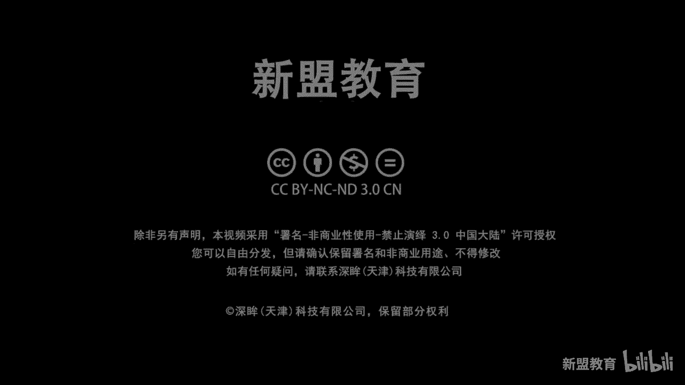
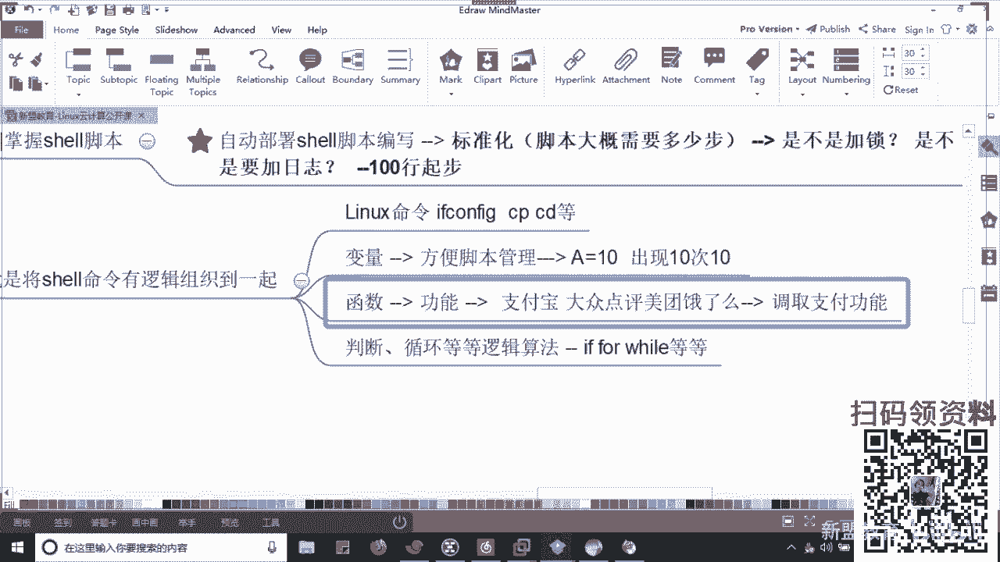
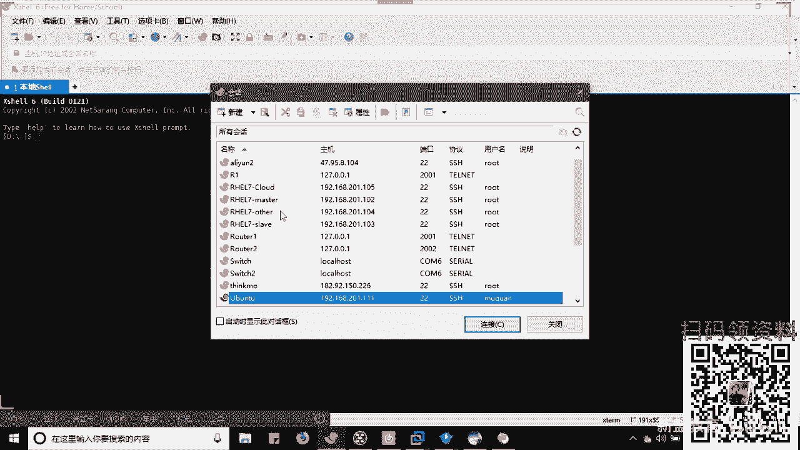
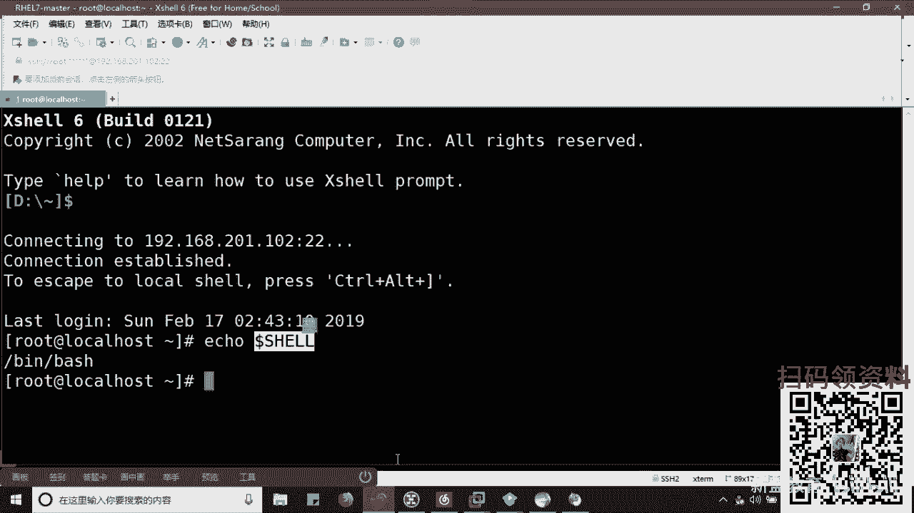
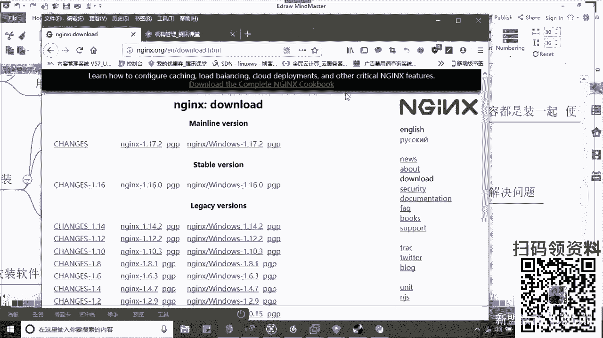
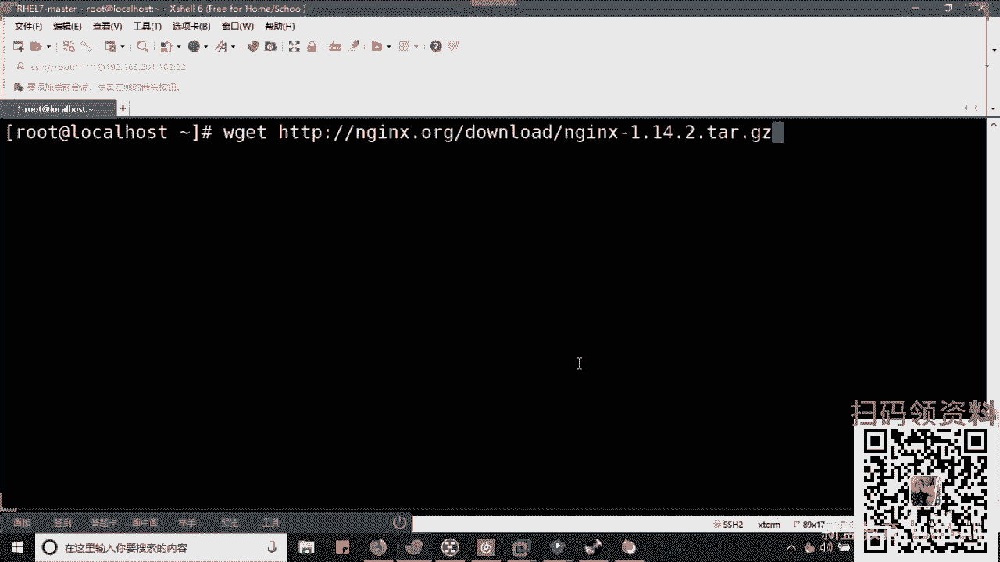
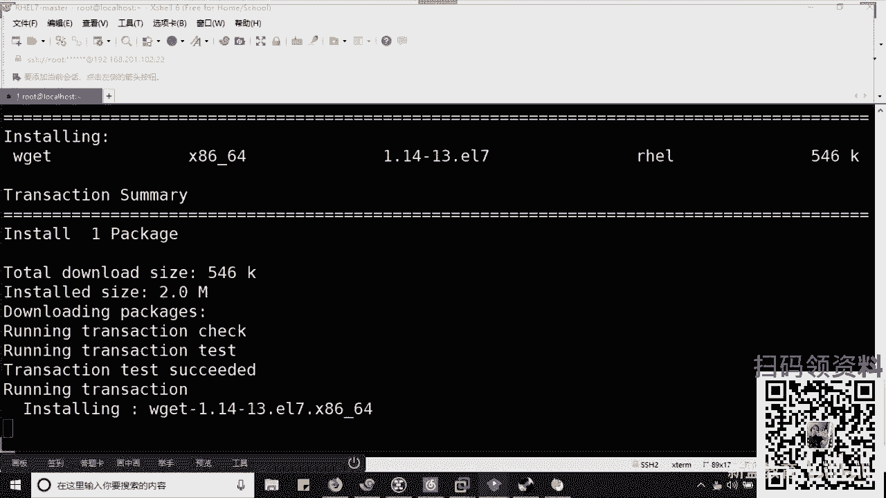
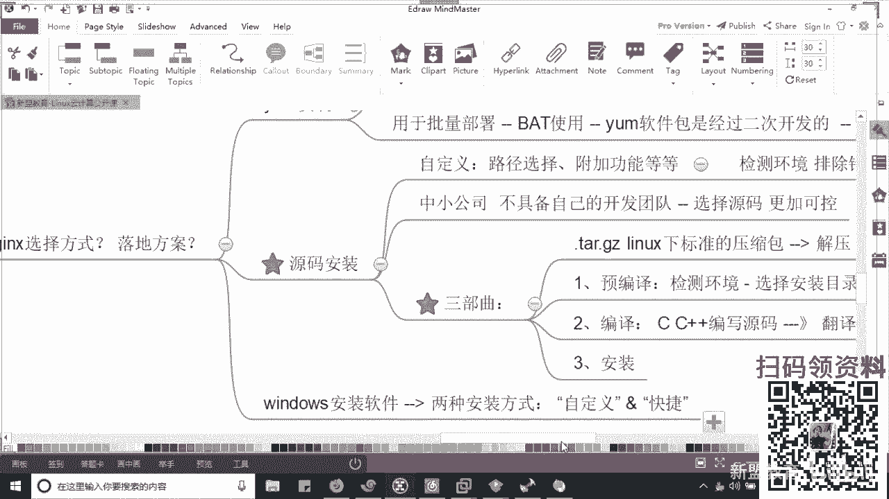
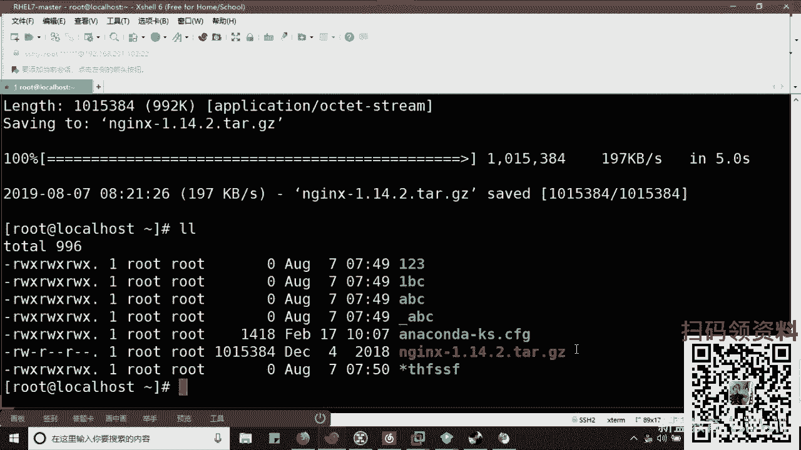

# Linux运维/RHCE零基础入门：Shell脚本入门之批量部署Nginx服务器



## 概述

在本节课中，我们将要学习Shell脚本的基础知识，并动手编写一个用于批量部署Nginx服务器的简易脚本。通过这个过程，你将理解Shell脚本的核心概念、编写规范以及它在自动化运维中的实际价值。

---

## 什么是Shell脚本？🤔

上一节我们概述了课程目标，本节中我们来看看Shell脚本究竟是什么。

Shell脚本是Shell编程的产物。Shell编程的本质，是将一系列Linux命令有逻辑地组织在一起。一个脚本中不仅包含常规的Linux命令（如 `ifconfig`、`cp`、`cd`），还会涉及变量、函数、判断和循环等逻辑结构。

**变量** 的作用是方便对脚本进行管理。例如，定义一个变量 `A=10`，之后在脚本中多次使用 `$A` 来代表值 `10`。如果需要修改这个值，只需修改变量 `A` 的定义一次即可，无需在脚本中逐个修改，这大大提升了效率和可维护性。

**函数** 可以看作是一个独立的功能模块。它类似于支付宝的支付功能，可以在美团、饿了么等多个应用中被调用，而无需在每个应用中重写支付逻辑。在脚本中，函数将特定功能封装起来，便于复用。

将这些元素（命令、变量、函数、逻辑判断）组合起来，就构成了能够完成复杂任务的Shell脚本。

---

## Shell脚本解决了什么问题？💡

上一节我们介绍了Shell脚本的构成，本节中我们来看看它具体解决了运维工作中的哪些痛点。






Shell脚本的核心价值在于 **提升效率** 和 **降低人为错误**。



想象一个场景：公司新采购了1000台服务器，需要你在每一台上源码安装Nginx服务。手动操作每台服务器可能需要20分钟，1000台服务器将耗费巨量时间。此时，你可以将安装Nginx所需的所有步骤（检查环境、下载、编译、安装、配置）写成一个Shell脚本。之后，只需在每台服务器上运行这个脚本，即可自动完成全部部署工作。

脚本自动执行，不仅速度远快于人工，而且能保证每次操作的一致性，避免了因手工操作疏忽导致的错误。因此，所有自动化运维工作的核心思想，都源于此。


对于运维工程师而言，精通Shell脚本是面试的必备要求，就像个人的基本素质。而学习Python则是加分项，它能让你的技术栈更全面，在处理某些特定工具（如用Python开发的Ansible）或编写插件时更具优势。建议先精通Shell，再有精力去学习Python。

---


## 部署方式的选择：源码 vs Yum📦


在开始编写部署脚本前，我们需要明确Nginx的安装方式。这就像在Windows中安装软件，通常有两种选择。

**Yum安装** 类似于“快速安装”。它非常省时，会自动解决软件依赖关系。但缺点是，安装的文件可能分散在系统的各个目录，不便于集中管理。

**源码安装** 类似于“自定义安装”。你需要自己解决依赖、指定安装路径、选择编译功能。它耗时较长，但所有相关文件通常都安装在指定的统一目录下，便于管理和维护。

在大型互联网公司（BAT），可能会使用经过 **二次开发** 的Yum包进行批量部署，以实现标准化和可控性。而对于大多数中小公司，**源码安装** 因其高度的可控性而更为常用。我们本节课要编写的，正是基于源码安装方式的自动化脚本。

---

## Nginx简介与源码安装三部曲🚀

Nginx是一款高性能的HTTP和反向代理服务器，在国内电商网站中应用非常广泛。它主要有三大功能：
1.  **Web服务器**：类似Apache，提供HTTP服务。
2.  **负载均衡/反向代理**：将用户请求分发到后端的多个服务器。
3.  **缓存**：缓存静态内容，加速访问。

需要注意的是，Nginx虽然功能全面，但在单项性能上可能不如专精的软件（如负载均衡不如LVS专业，缓存不如Varnish高效）。我们本节课仅利用其Web服务器功能。

源码安装通常遵循“三部曲”：

以下是安装Nginx的基本命令流程：
```bash
# 1. 解压源码包
tar -zxvf nginx-1.x.x.tar.gz
cd nginx-1.x.x

# 2. 预编译 (配置)
./configure --prefix=/usr/local/nginx --user=nginx --group=nginx --with-http_ssl_module

# 3. 编译与安装
make
make install
```
**预编译 (`./configure`)**：此步骤检查系统环境（如编译器、依赖库），并允许你指定安装路径、启用或禁用特定功能（如SSL支持）。如果缺少依赖，会在此阶段报错。
**编译 (`make`)**：将C/C++源代码翻译成计算机可执行的二进制文件。
**安装 (`make install`)**：将编译好的二进制文件、配置文件等复制到系统中指定的位置。

我们的脚本就是将以上手动步骤，以及过程中可能遇到的依赖问题解决步骤，自动化地组织起来。

---

## 实战：编写Nginx批量部署脚本🛠️

现在，我们将动手编写一个完整的Nginx部署脚本。请记住，脚本的目标是一次性执行成功，因此所有环境检查和依赖安装都应在脚本开始部分完成。

以下是脚本编写的主要步骤和逻辑：

1.  **脚本头信息**：指定Shell解释器、添加作者、时间、描述等注释。
2.  **解决依赖**：提前安装所有可能缺少的软件包（如 `wget`, `gcc`, `openssl-devel` 等）。
3.  **创建用户**：为Nginx服务创建专用的系统用户。
4.  **下载源码**：使用 `wget` 从官网下载Nginx源码包。
5.  **解压与进入目录**：解压下载的包并进入解压后的目录。
6.  **执行安装三部曲**：依次执行 `./configure`、`make`、`make install`。
7.  **启动服务与配置**：启动Nginx，并关闭防火墙（或配置防火墙规则）以允许访问。

一个简化的脚本示例如下：
```bash
#!/bin/bash
# Author: Muxue
# Date: 2023-08-04
# Description: Auto install Nginx from source.

# 1. Install dependencies
yum install -y wget gcc gcc-c++ openssl-devel pcre-devel

# 2. Create nginx user
useradd -s /sbin/nologin nginx

# 3. Download Nginx source code
wget http://nginx.org/download/nginx-1.18.0.tar.gz

# 4. Unpack and enter directory
tar -zxvf nginx-1.18.0.tar.gz
cd nginx-1.18.0

# 5. Configure, make, install
./configure --prefix=/usr/local/nginx --user=nginx --group=nginx --with-http_ssl_module
make -j 8 # 使用8个线程并行编译，加快速度
make install

# 6. Start Nginx and adjust firewall
/usr/local/nginx/sbin/nginx
systemctl stop firewalld # 临时关闭防火墙，生产环境应改为添加规则

echo "Nginx installation and startup completed!"
```
> **注意**：这是一个简化示例。实际生产脚本应包含更完善的错误判断、日志记录和安全性考虑。

执行此脚本后，Nginx服务应自动安装并运行。你可以通过服务器的IP地址访问默认页面进行验证。

---






## 总结

本节课中我们一起学习了Shell脚本的基础知识及其在自动化运维中的重要性。我们从了解Shell脚本的概念和构成开始，探讨了它如何通过自动化重复任务来提升效率和准确性。接着，我们比较了Nginx的两种安装方式，并详细分析了源码安装的“三部曲”。最后，我们亲自动手，将手动安装步骤转化为一个可以自动执行的Shell脚本，实现了Nginx的一键化部署。







记住，这个简单的脚本是自动化运维的起点。在实际工作中，你需要考虑网络超时、安装失败重试、多台服务器批量执行（例如结合Ansible工具）等更复杂的场景。希望本节课能为你打开Shell脚本和自动化运维的大门。