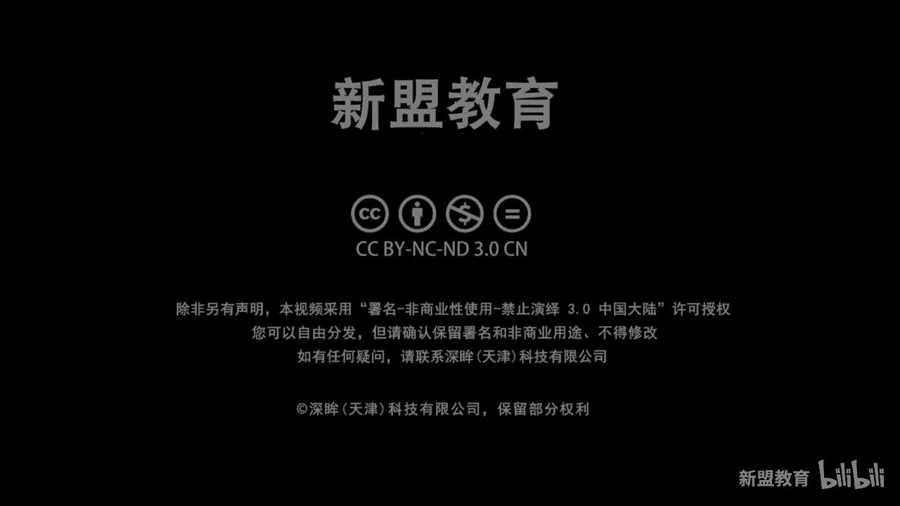
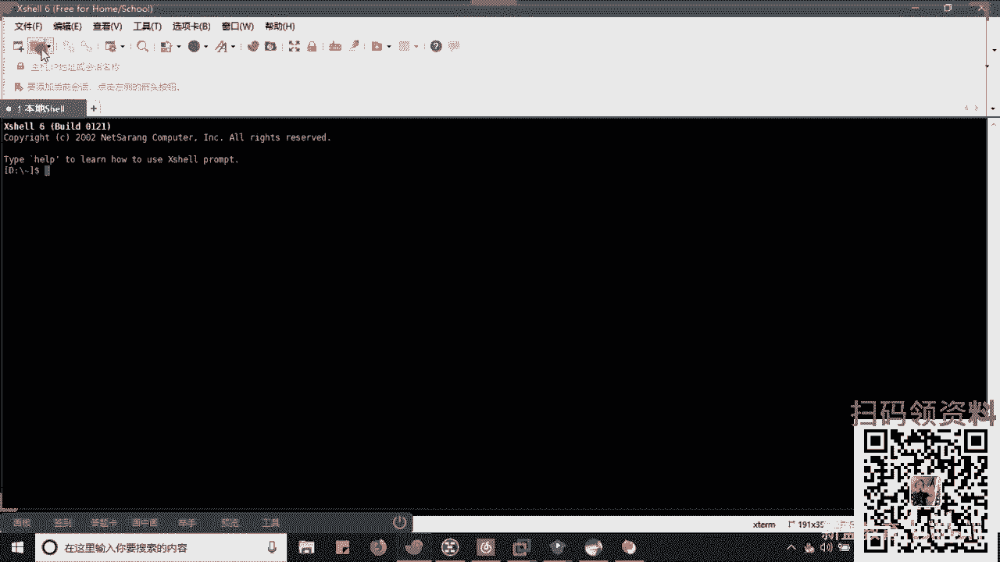
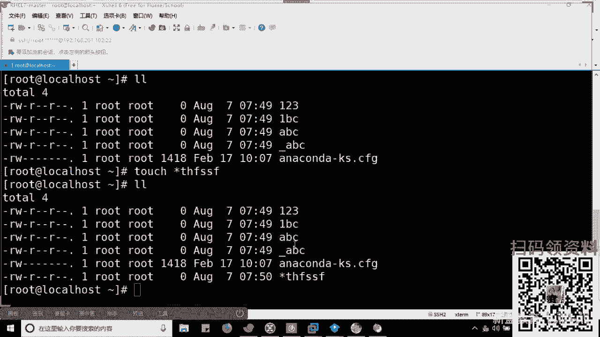
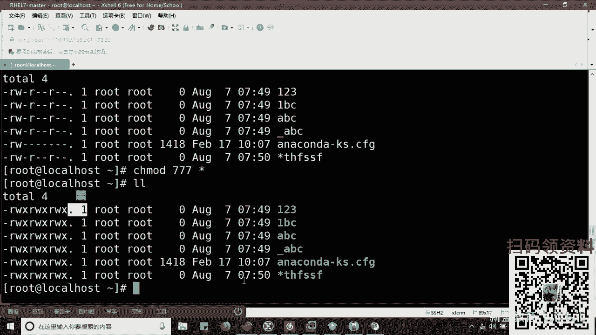
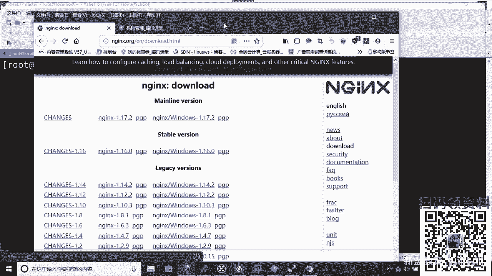

# Linux运维/RHCE零基础入门：Shell脚本入门之批量部署Nginx服务器



## 概述

在本节课中，我们将要学习Shell脚本的基础知识，并动手编写一个用于批量部署Nginx服务器的自动化脚本。通过这个实践，你将理解Shell脚本的核心概念、编写规范以及它在实际运维工作中的价值。

---

## 什么是Shell脚本？🤔

上一节我们概述了课程目标，本节中我们来看看Shell脚本究竟是什么。

Shell脚本是Shell编程的产物。Shell编程的本质，是将一系列Linux命令**有逻辑地组织**在一起。一个脚本中不仅包含普通的Linux命令（如 `ifconfig`、`cp`、`cd`），还会涉及**变量**、**函数**、**判断**和**循环**等逻辑结构。

*   **变量**：用于方便地管理脚本中的值。例如，`A=10`，其中`A`是变量名，`10`是变量值。如果这个值在脚本中出现多次，修改变量`A`的值即可一次性完成所有修改，非常高效。
*   **函数**：可以看作一个**功能模块**。它封装了特定功能，可以在脚本中多次调用，提高代码的复用性。
*   **逻辑结构**：如 `if` 条件判断、`for` 和 `while` 循环等，用于控制脚本的执行流程。

变量和函数通常分为两大类：**环境变量/内置函数**（系统预定义）和**自定义变量/函数**（用户自己编写）。

---





## Shell脚本的价值与作用 💎


了解了Shell脚本的基本构成后，本节我们来看看它解决了运维工作中的哪些核心问题。

Shell脚本的核心价值在于**提升效率**和**降低人为错误**。当需要在成百上千台服务器上重复执行复杂的部署或配置任务时，手动操作不仅耗时，而且极易出错。通过编写脚本，我们可以将这些**重复且繁琐**的步骤固化下来，让脚本自动执行。


此外，精通Shell脚本是运维工程师的必备技能，也是面试中的常见考点。在自动化运维体系中，Shell脚本常用于**持续集成与持续交付（CI/CD）** 流程中的自动化部署环节。一个成熟的生产环境部署脚本，其复杂度往往在**100行以上**，因为它需要处理环境检测、依赖安装、错误处理、日志记录等诸多细节。




---



## Shell脚本的编写规范 📝

在开始动手编写脚本前，我们需要了解一些通用的编写规范，这有助于写出清晰、易维护的代码。

虽然Linux系统对脚本文件名没有强制要求（任何具有可执行权限的文件都可以作为脚本执行），但遵循一定的规范是良好的实践。

以下是常见的脚本编写规范：

1.  **脚本命名**：通常以描述其功能的英文命名，并以 `.sh` 结尾。例如：`auto_install_nginx.sh`。
2.  **存放目录**：公司内部通常会约定一个固定的目录（如 `/usr/local/scripts`）来存放所有自定义脚本。
3.  **脚本内部结构**：
    *   **第一行（Shebang）**：指定脚本解释器。通常使用 `#!/bin/bash`，因为Bash Shell是大多数Linux系统的默认Shell，兼容性好。
    *   **注释头**：在脚本开头用注释说明脚本的用途、作者、创建日期、联系方式等信息。
    *   **变量定义**：在正式逻辑开始前，集中定义脚本中将用到的变量。
    *   **主逻辑**：编写具体的脚本执行步骤。

---

## 实战：编写Nginx批量部署脚本 ⚙️

掌握了基础知识后，本节我们将进入实战环节，编写一个自动化部署Nginx的脚本。

在开始编写前，我们需要明确两个问题：**Nginx的作用**和**部署方式的选择**。

*   **Nginx的三大主要作用**：
    1.  **Web服务器**：类似Apache，用于提供HTTP服务。
    2.  **反向代理与负载均衡**：将客户端请求分发到后端的多个服务器。
    3.  **缓存**：缓存静态或动态内容，加速访问。
*   **部署方式的选择**：Linux下主要有两种安装方式。
    *   **Yum/RPM安装**：类似于“快捷安装”，省时省力，自动解决依赖，但文件分布较散，不便于自定义和管理。
    *   **源码编译安装**：类似于“自定义安装”。耗时较长，需要手动解决依赖和配置，但**高度可控**，所有文件可集中安装到指定目录，便于统一管理。我们的脚本将采用此方式。

源码编译安装通常遵循“三部曲”：
1.  **预编译（`./configure`）**：检测系统环境，指定安装路径（`--prefix`），选择需要启用的功能模块。
2.  **编译（`make`）**：将源代码翻译成机器可执行的二进制文件。
3.  **安装（`make install`）**：将编译好的文件复制到系统中。

我们的脚本思路是：**在脚本开始阶段，一次性安装所有可能缺少的依赖包**，确保后续的“三部曲”能够一次性成功执行。

以下是脚本的核心步骤和代码：

1.  **定义脚本基础信息**
    ```bash
    #!/bin/bash
    # Date: 2023-08-04
    # Author: Muque
    # Description: Auto install Nginx from source code.
    ```

2.  **安装依赖包**
    ```bash
    yum install -y wget gcc gcc-c++ openssl-devel pcre-devel
    ```

3.  **创建Nginx运行用户**
    ```bash
    useradd -s /sbin/nologin nginx
    ```

4.  **下载并解压Nginx源码包**
    ```bash
    wget http://nginx.org/download/nginx-1.18.0.tar.gz
    tar -zxvf nginx-1.18.0.tar.gz
    cd nginx-1.18.0
    ```

5.  **执行“三部曲”**
    ```bash
    # 预编译，指定安装路径、用户、组及功能模块
    ./configure --prefix=/usr/local/nginx --user=nginx --group=nginx --with-http_ssl_module --with-http_stub_status_module

    # 编译，使用多线程加速
    make -j 8

    # 安装
    make install
    ```

6.  **启动Nginx并放行防火墙**
    ```bash
    # 启动Nginx
    /usr/local/nginx/sbin/nginx

    # 关闭防火墙（生产环境建议配置具体规则）
    systemctl stop firewalld
    # 或 systemctl disable --now firewalld
    ```

将以上步骤按顺序组合成一个完整的 `.sh` 文件，并赋予执行权限（`chmod +x script_name.sh`），即可运行。脚本会自动完成从依赖安装到服务启动的全过程。

---

## 总结 🎯




本节课中我们一起学习了Shell脚本的基础知识。我们首先了解了Shell脚本的定义、核心概念（变量、函数、逻辑结构）以及它在提升运维效率和规范操作中的巨大价值。接着，我们探讨了脚本编写的基本规范。最后，通过一个**批量部署Nginx服务器**的实战案例，我们将理论转化为实践，编写了一个完整的自动化安装脚本，并理解了源码安装的“三部曲”流程。


记住，这个脚本是一个简单的起点。一个健壮的生产级脚本还需要加入**错误判断**、**日志记录**、**参数化输入**（如通过变量指定Nginx版本）和**回滚机制**等复杂功能。希望本节课能为你打开Shell脚本编程的大门。