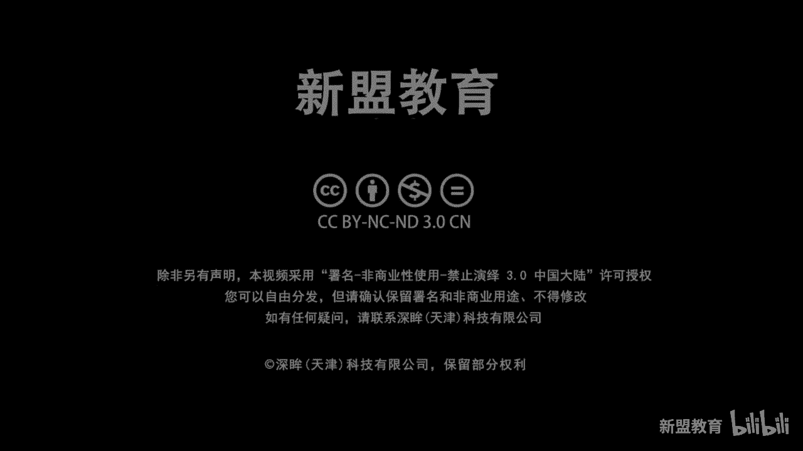
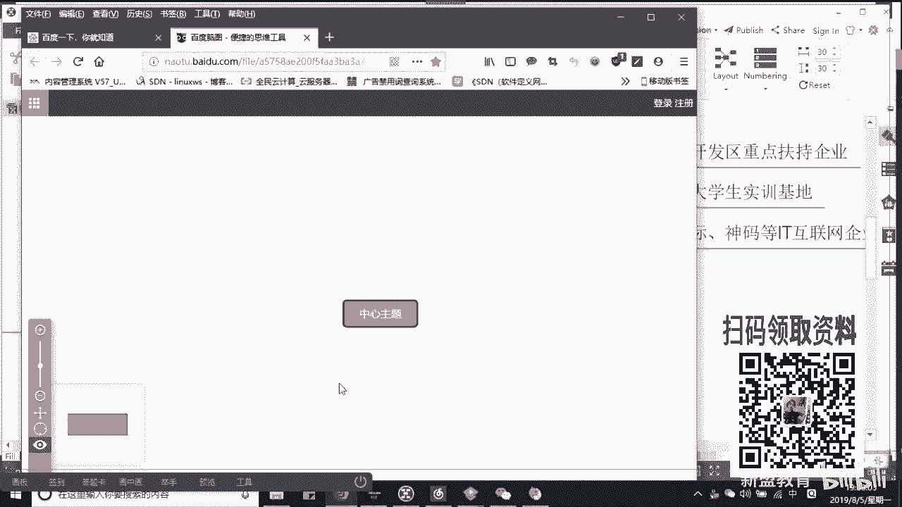
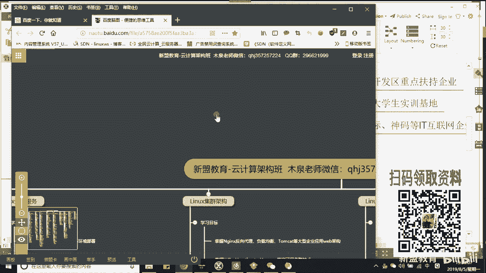
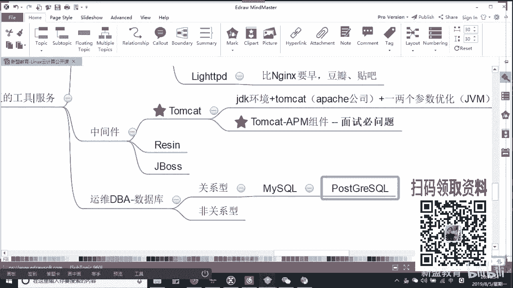

# Linux运维入门：P1：行业发展与技术提升路径

在本节课中，我们将从零基础开始，探讨如何进入Linux运维行业，以及为了职业发展需要学习和提升哪些核心技术。课程将涵盖运维岗位的分类、所需技能树，以及不同技术方向对应的职业前景。

## 行业方向与岗位选择

上一节我们概述了课程目标，本节中我们来看看Linux相关的两大就业方向：开发和运维。

Linux领域的就业主要分为两个方向：
1.  **开发方向**：例如嵌入式开发、硬件驱动开发。代表性语言有C、Java。目前较热门的语言是Python。
2.  **运维方向**：这是大多数人进入Linux领域的选择，门槛相对较低，但发展路径宽广。

对于运维方向，根据技术深度和职责，可以分为初级、高级及细分领域岗位。

### 初级运维岗位

以下是两个常见的初级运维岗位，通常不要求深厚的技术背景即可入门。

*   **桌面运维**：主要负责公司内部PC、打印机等硬件的维护、系统安装及办公软件支持。这类岗位多存在于传统行业、国企或医院，通常属于外包或三方外派，技术成长空间有限。
*   **IDC运维**：工作在数据中心监控室，主要职责是值守监控系统，在出现告警时通知相应公司的运维人员处理。通常需要倒班，对具体技术操作要求不高。

### 高级运维岗位

当掌握了核心技术后，可以向高级运维岗位发展。高级运维不仅需要会部署服务，更要精通排错、理解服务架构与关联，并能进行技术选型和优化设计。

高级运维通常有以下细分技术方向：
1.  **应用运维**：专注于企业常用服务与工具的部署、优化和保障，如Web服务器、数据库等。
2.  **自动化运维**：通过工具实现批量部署、监控和持续集成/交付，提升运维效率。
3.  **云计算运维**：涉及虚拟化、容器化及云平台管理。
4.  **大数据运维**：负责大数据平台（如Hadoop、Spark）的部署和维护。
5.  **运维开发**：结合运维需求进行工具开发，需要编程能力。

## 核心技术栈学习路径

了解了岗位分类后，我们来看看支撑这些岗位的核心技术有哪些，以及应该如何学习。

### 应用运维核心技能

应用运维需要广泛了解企业级开源工具。

**以下是Web服务器相关软件：**
*   **Apache**：历史悠久的Web服务器。
*   **Nginx**：高性能的Web服务器，也常作负载均衡和反向代理。
*   **Tengine**：由淘宝基于Nginx二次开发，国内电商网站常用。
*   **Lighttpd**：轻量级Web服务器，早期豆瓣、贴吧曾使用。

**注意**：Tomcat、JBoss等属于**中间件**，主要用于承载Java应用，与解析HTML/PHP的Web服务器有所区别。

**以下是常见的数据库分类：**
*   **关系型数据库**：如 **`MySQL`**、**`PostgreSQL`**、Oracle。需了解各自优缺点及适用场景。
*   **非关系型数据库（缓存/补充）**：如 **`Redis`**（支持持久化）、**`Memcached`**（纯内存型）。新浪基于Memcached二次研发了 **`MemcacheDB`**。

### 自动化运维核心技能

自动化运维是提升效率的关键，涉及服务的全生命周期管理。

**以下是自动化运维的关键组件：**
1.  **批量部署与配置管理**：
    *   **Ansible**：基于Python开发的自动化工具，使用YAML语法，无需在客户端安装代理。
    *   **SaltStack** / **Puppet**：同样是主流的自动化配置管理工具。
2.  **监控告警**：
    *   **Zabbix**：企业级分布式监控系统，使用PHP编写。
    *   **Prometheus**：主要用于监控容器化平台（如Kubernetes）。
3.  **日志集中管理**：
    *   **ELK/EFK Stack**：用于日志的收集、存储、分析和可视化。是故障排查和业务分析的重要平台。
4.  **持续集成与持续交付（CI/CD）**：
    *   实现开发代码自动测试、构建、部署的流水线。是DevOps文化的核心实践，能极大减少运维的手动干预和发布风险。

### 云计算运维核心技能

云计算是当前基础设施的主流形态，相关技能至关重要。

**以下是云计算的关键技术：**
*   **虚拟化**：如 **`KVM`**（Linux内核级虚拟化）。
*   **容器化**：如 **`Docker`**，相比虚拟机更轻量、快速。
*   **容器编排**：如 **`Kubernetes (K8s)`**，用于管理大规模的Docker容器集群。
*   **云平台**：如 **`OpenStack`**（私有云搭建），或公有云（如阿里云、腾讯云）的服务使用与管理。

### 大数据运维与运维开发

这两个方向对编程能力有更高要求。

*   **大数据运维**：需要熟悉 **`Hadoop`**、**`Spark`** 等生态组件，并结合 **`ELK`** 进行数据分析。常需与Java开发（如数据爬虫）配合。
*   **运维开发**：核心是使用编程语言（主要是**Python**，其次是**Go**）开发运维工具，自动化运维流程。Ansible就是运维开发的产物。

## 职业发展与总结

掌握了不同技术栈后，对应的市场价值和薪酬也会有所差异。

*   **应用运维**：月薪普遍可达10K左右。
*   **精通自动化/云计算/大数据等专项技能**：月薪通常能达到13K或更高，具体取决于技术深度和公司规模。

**本节课中我们一起学习了Linux运维行业的全景图。** 我们从开发和运维两大方向入手，重点剖析了运维领域从初级到高级的岗位分类，并详细列出了支撑这些岗位的核心技术栈，包括应用服务、自动化工具、云计算平台以及大数据相关组件。理解这份学习路径图，能帮助你明确目标，有步骤地提升自我技术，在运维行业中稳步发展。

> 注：技术学习建议循序渐进，先扎实掌握Linux基础和Shell脚本，再根据兴趣选择自动化、云计算或大数据等方向深入。保持持续学习和实践，是技术提升的关键。