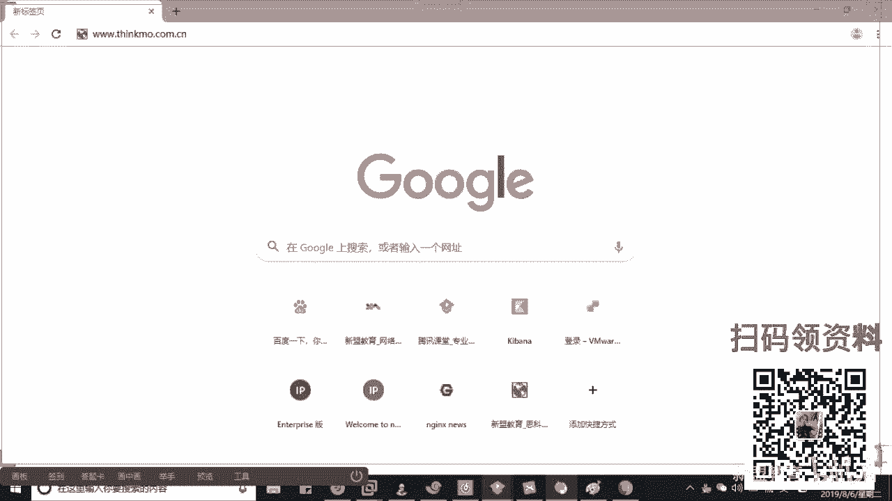

# Linux运维／红帽RHCE零基础入门之DNS域名解析服务的基本应用与主从技术 - P1 - 新盟教育 - BV1zJ411W7Er

Yeah。

必去找他去要好不好啊，可以打开直接去要。呃，简单说一下啊，简单说一下，呃，如果大家是第一次来的话，你可以加小魏，好吧，你也可以去加我的QQ啊，799830458。那目群老师的公开课的时间呢。

是从每周一到每周五的晚上的7点半开始的。那么呃有一个官方群啊，官方群的话呢，是我们的296621999啊。如果大家没有加入到群的，也可以加入进去。那么在群内的文件里边呢。

我们给大家准备了一些的课程学习礼包。你可以在群里边你也可以在我们现在的课堂上去找我们的小魏老师啊去领取我们免费的课程礼包。那么简单的先做一个自我介绍。好吧，咱们这边的话叫做新萌教育啊，叫做新萌教育。

那么新盟教育从09年到现在，我们已经做了将近10周年了啊，已经十年了。那么正好这个月呢也是我们的1周年的一个庆典啊，所以我们的话很有可能会。给大家一些个哎活动，大家到后边的话可以关注我们好不好？

那么本身呢在腾讯课堂5万多家机构，哎，当中排名前101位啊，套票聊药机构，同时也是我们腾讯所认证的一家机构。谢谢啦。腾讯证。好，那么同时的话呢也是和我们这个阿里云做合作的啊，和我们阿里云合作的。

所以大家如果在我们这边的话学习哎也是可以学习到一部分我们关于阿里云产品的内容的好不好啊，那木雪老师的话可能比大家早一些从事这个运维吧，已经做了123456所以算啊得有78年89年的时间了啊。

那么之前的话呢，在我们这个呃58，包括我们这个这个这个阿里的话呢，担任我们这个运维架构师和运维经理的这个岗位啊。那现在的话呢，一方面呢是负责我们现在公开课上的一个技术的分享。

另一方面呢是我们这个系统班的一个辅导教学啊。大家后边的话有任何的问题。你看现在我呢我看到是吧？雅各布啊，WXY是吧？梦职啊独醉啊，亲爱的啊，喊这个亲爱这个名字是吧？优金啊，是吧？优金然后莫言啊，张进步。

LISIRliser是吧？关海听涛，哎，我发现都是咱们之前的老同学了啊啊，有的人得有个小半年没有过来听过课了，是不是？这个没有关系的啊这个没有关系的。首来说公开课的话，我非常欢迎大家。

但是呢我也希望大家来这边是真正能够学到东西的，好不好？哎，所以我们先简单测试一下啊，我希望在我的公开课上大句呢能够自己去准备一个笔记本，好吧，自己准备一个笔记本。😊，好，呃。

这个笔记本是你用手和笔去记录的啊。第二个来说老师我听得懂，唉，我能够听得到的话，麻烦给我刷个一上来，或者给我刷个花。好吧，或者刷一朵花上来啊，桌子转话，哎，老师我觉得这个这个是吧？有一些问题啊。

我没有搞懂，那么大家可以呢干嘛呢？可以直接的把问题问出来好吧，你可以直接把问题问出来，O吗？哎，谢谢实心啊，谢谢实心来同学们，其他同学其他同学能够听到我的声音的话，先给我刷一个一上来啊。

我这边简单的做一个测试。好吧，做个麦的测试，如果ok我们就开始今天的一个学习了啊，如果ok我们开始你该选择oklier好累是吧？好，那么老师我们今天讲什么啊？是不是哎，今天的话呢，我们跟大家说过了。

我们一共从你昨天开始，我们会持续10天。这10天的课程我们会依次进阶啊，会。😊，依次进阶。那么昨天的话讲的是一个零基础我们小白入门，对吧？哎，老师小白入门做什么呀？小白入门。

我们去了解一下如何去学习我们的linux，对不对？以及我们该学习什么内容啊，该学习什么内容。😊，啊，包括我们在企业当中的一个落地点，对不对？啊。

这些都是我们上节课在一个广义上跟大家去简单介绍的那今天我们遇到的第一个内容，大家听来啊，叫什么呢？就是我们的DNS的服务。啊，DS服务其实算是我们在整个企业基础服务中啊。

大家记住是在企业基础服务中最复杂的一个服务啊，最复杂的一服务。这个复杂指的是大家记住，不管在于部署层面上，包括在于它的调试上啊，调试上啊，包括我们在企业的落地点上。其实大家会发一个问题。

就是说老师我的公司并不需要我去部署DS，或者并不需要我去调试，为什么？大部分的中小公司是吧？老师唉，中小的公司。好，我们一般通过的是三方的工具。这有人说老师我可以购买腾讯云啊。

我可以购买阿里的这种域名解析的。对吧可以购买它的服，我们公司只需要去购买一台我们的服务器。好，并且呢在运营商去购买带宽，它会给我一个公网的IP或者我们现在大部分的企业会去购买一个我们的云主机是吧？哎。

或者我们的VPS啊，或者这个阿里的ECS啦，或者腾讯的VMC这些个对不对？啊，我们都是用它自带的这种域名的，再去购买个域名做个备案去使用。哎，基本上不需要你去部署DS服务器。但是大家想一想啊再想一想。

哎，我们问他一个问题啊，DNS的作用是什么？告诉我。😡，作用是什么？来知道的人给我把大家耍出来。哎，老师我不太清楚啊是吧？哎，这个东西我第一次这个这个这个接受霍老师，我想给你一个机会，是不是啊？

没关系的啊，域名解析，对吧？😡，域名解析大家记住了，我们的域名解析是分为方向的，一个叫做正向解析。哎，一个叫做反向解析起来啊，两个哎，我今天这个电脑有点卡，是吧？😊，正向解析和反向解析。我慢点答啊。

正向几个反应解析。那正向解析，这个是你们现在经常在用的。哎，简单我啊，这个是你们天天在用的。就周老师我上网在浏览器当中输入一个域名。比方说3W点sS点com是吧？我想今天晚上和曾老师有一个约会。好。

于是乎我们通过这个域名，其实去寻找的是某个IP也就是我们一个具体的服务器，对吧？感心啦，这是正向解析。😊，有的时候注意了，而有的时候我们不得不干嘛？老师，我现在有1个IP地址。好，那么我想确认一件事情。

就是这个IP地址有没有去绑定某个域名啊，我通过IP去找域名那此时用的叫做反向解析啊，叫做反向解析。😡，但甭管怎么样，我域名的DS的作用，其实是为了去方便各位去上网，没问题吧。我是为了方便各位去上网。😡。

哎，说白了老师，我这个IP地址太多了，大家都知道IP地址的范围是0。0。0。0，一直到25。25。25。255，对吧？你可以自己去算一算，我们把内网什么192什么10什么172去掉以后。

其实还是有几十万，甚至说切的是上亿的IP地址应用在我们的公网当中，对吧？即使它再有限。好，那么他就相当于老师现在我有一个手机啊，我现在呢认识了一堆的朋友，这些朋友都告诉我，哎，我的电话什么187。

我的电话136，我的电话188，我的电话139。好，我问一下大家。😊，他把这些电话我通通都告诉你的时候，你记得住吗？来告诉我你记得住吗？来记得住的人刷给医生。老师，我觉得我的脑戏不是那么足是吧？

反正木雀老师脑子没那么大啊，可能就花生仁那么大啊，我反正我是记不住，你能记住吗？😡，你能记住读对能记得住啥？所有人的些话你能记得住，对不对？哎，你手机号你肯定是记不住的，对不对？

随着越来越多重复性的或者说类似的名易记场了，那怎么办？怎么办？所以大家在记录电话的时候，我们都会相应的去记录他的一个昵称，对吧？哎，我呢给这个电话输入一个昵称或者一个姓名啊，来帮助我去记忆。😡。

那这个姓名就是我们的域名，能理解了吧？它方便你去记录。只不过大家注意了啊，我域名和IP的对应的关系是可以干嘛是多对多的对来。啥意思啊？看好了，我一个域名可以对应多个IT，我1个IP也可以绑定多个域名。

能理解吗？来，李姐先给我刷一上来，就跟你一个人老师我有三个称号是吧？我妈叫我我妈叫什叫我什么儿子啊，然后我爸管我叫做兔崽子，然后你爷爷呢管你叫什么巴拉巴拉一大堆，是不是啊？总之来说。

域名的作用就是帮助大家去记它，哎，方便你上网。但同时呢了，由于是域名可以绑定多个IT所以这个地方我们其实还形成了一层叫做兔仔均衡的作用。😊，你想嘛？不信你再来看，哎，我们打开CMD啊，打开CMD。

你们跟我做同一个操作啊，同一个操作什么操作呢？停哎，稍等一下，有点慢是吧？有点卡。😡，啊，QQ什么3W点百度点com大家看。😡，那此时木群老师这边返回的叫做61。135。169。121125是吧？哎。

看好了，那你看一看你的ID呢。看一下你自己的IP，你看看是不是和我的不太一样啊，我在天津啊，好像天津北京用的是一个。那你要是在广州，你发现老师我就不是这个IP地址了，明白了吗？

那这个时候其实DNS为我们做了一个负载均衡。😡，大家能理解的先给我刷把花上来，好吧，来能理解的话，给我刷个花上来。😡，来了，哎，谢师青。😊，啊，谢小累还好啊？写listser。ok好。

那我们今天给大家去做了好同学们啊，哎，那老师，你说我们这种公司都不去部署，到底我们在哪里去优用它。好，同学们。😊，那一般情况下，我们需要自己去部署DS的企业。第来说类似BATT啊。

或者我们TMV这种一线的互联网公司。说白了我的域名啊，我会购买一大批的这个这个服务器，我自己去绑定，我自己去做解析，要比我把域名给别人去管理要方便高效的多，这是一种借来。第二种是在于我们的国企当中。

举个例子啊，大家都知道国家电网是吧？啊，不是说国家电网不好啊，那么国家电网本身打好了，它在全国各地都有自己的网点啊，那同时我还会具备自己的下属公司，什么二层三级公司，对吧？

那么这些公司其实它会自己去形成一个网络。好，明白了？自己形成一个网络。而这个网络是不能够上我们的公网的。进来。哎，也就是说它不能够访问什么百度啊，什么什么淘宝啊，这些它都上不了。

我只能在我们这个国家电网的网络当中，公司总部与总部或分布与分部之间进行相互的交流。我不知道现在在咱们听课当中，有没有同学老师，我是在国企的啊，大家问明白，即使国企我每个月也是有指标的。

你也是要有自己的什么自己的网站的，啊吧？这个网站上，说白了我要有自己这个站点的介绍，对不对？我自己要有什么啊要这个这个我们员工的介绍，我可能要有打卡，可能要有一些个这个比方说啊啊我们公司的业务的介绍。

😡，但总之你会有一个网站好，你比方说同学们啊看好了，在这个地方，天津国家电网。😡，啊，河南里的和广州好吧，国家电了。😡，那我们首先来说，我都具备服务器，甭管是windows还是windows3啊，哎。

我是不是都会有自己的唯一的ID地址啊？😡，我都会有自己的唯一的网站。😡，全国36个省，我们少说了给34个，是不是？那你告诉我同学们，当我去访问这个网站的时候，你们自己告诉我我是使用什么呀？😡。

我是使ID，他是域名啊。😡，肯定是域米，对不对？那此时越来越多的域米，我们为了管理，大家记住了，实际上我们都会在国家总电网那边啊，国家总电网。😡，啊，会部署于一台我们DS的主服务器进来。😡，祝福器。

然后记住我下游的。😡，分公司甚至二三级的子公司，我们其实都是一些个都是一些个重复型。啊，或者些备用的服务器能理解吗？来理解人给我说个音响来。😡，能理解的人给我算个衣裳。OK感谢石青啊。所以你看一下。

如果你在将来的话，老说我要去到这个这个国家电网，或者说是类似国企的地方去工作，你可能会去自己部署PSS。那同时还有一种情况呢，是在我们的运营商发记了运营商。😊，大家知道运营商就是给我们去提供网络服务的。

对不对？😡。

那你说一个问题吧，我师说我现在的企业足够大了。比方说百度啊，比如我没说倒白吧，说阿里巴好不好？😡，阿里从了中国服务区。啊，除了中国服务区以外，我是不是还会具备我们的国外的海外的？海外的。啊。

我问你一个问题啊，如果老师此时我有一台DNS。😡，服务器好，是在哪里呢？哎，是在我们的国内啊，我在国内而我们的用户在哪里呀？用户在海外好，那相对于国内的用户来说，我海外的用户一定会感觉到非常的卡，对吗？

😊。

非常非常的卡。而相对应的，如果老师我DNS的这台服器，我要是在海外的话，那对于我们大陆或者说对于我们国内的用户。好，你们告诉我什么现象。什么现象告诉同学们。什么现象什么现象？卡对吧？哎，也会感到卡。😊。

所以怎么办？所以怎么办？告诉我解决方案是什么啊？像这种公司呢，我们一般来说都会在海外到了和我们在国内都会有我们的服务器。刚看我们白此时这些服务器我们共同使用域名3W点哎，淘宝是吧？把公司改了啊。

3W淘宝领头。😊，啊淘宝的淘宝。而此小时我都是使用淘宝了，那我如何去区分是吧？这个哥们儿是海外的，这个哥们儿是国内的。😡，好啦，那么一般来说，这台服务器上我们都会去具备多块网卡到了哎，具备多块网卡。😊。

好。这些的网卡我们都是各自的IP网段，哎，我会对应不同的区域，地区或国家。那么从这些不同的地方对应到不同的网卡上，然后我们再做一个二次的转发，解析到我后边具体的服务器上去。

这个地方我们使用的叫做DNS的视图。来，朋们听说过这个的话，给我算个一，没有的话给我说2。😡，啊，我们管它也叫做DNS的分离解析技术。啊，也叫做DS的分离解析技术。啊，没关系没听过的没关系啊。

如果我们有时间，到后面我会给大家讲到的，好吧，即使讲不到，我会给大家一个图。作为我们的一个今天公开课的小作业。😡，我希望大家能够来这别学到东西的啊，你能够有所提升这个作业或者你可以加我的QQ发给我。

我帮助你去答疑，明白了吗？啊，用我们来说，那回过头来，那老师我想要最基本的去步署来啊。记住，甭管是这种解析技术，还是说老师我得有这种主从的技术，我都得基于我原本的正向解析和反向解析之上。😡。

所以我们具体来看一小车，我现在如何的啊，我现在如何的干嘛？哎，去实现我们DNS的解析。好吧，实现DNS解析。那么这里面大家就要明白一个问题，老师我第S解析的一个过程和它的一个原理，对吧？

它的原为不是说哎老师，我们像这个这个你记住啊，你用这种方式的时候，不是说我向我们使用三方的网站，我把域名把我的购物ID一写。好，点击保存，于是乎就生效了。不是这个意思，让同学们。😡，而是什么样子？

看好了，我们画一个图。现当了解一下，我们在没有这种三方工具的时候，好不好？没有三方工具的时候，我们咋地搞的啊咋么搞的。你看。那么首先我们还是这台服器啊，还是这台服器，哎，我们改一个网址吧。

3W点是吧sX点com啊，木小就喜欢他啊，这个找找我们的苍姐啊，郝老师啊，波老师，他们这个办公的地方都在这里啊。😊，好，那么然后呢老师左边的话呢是我们1个PC啊，或者我的客户端。啊或客户端。

那我现在先问一下同学们啊，我想问一下客户端，我的数据其实应该发送给的是这台网关，没错吧，来同学们O腿刷一。如果我们拿家里面或中小型企业网关路由器。啊，网络逻由辑好，给他哎，然后通过他呀再发出去，对吧？

联系到我们的互联网或运营商运营商帮助你去定位具体的服务。啊了啊，我看看你们来，就咱类和石庆俩人吗？其他人呢其他哥们呢，其他哥们，你们是在试这个网站吧，你们别试了，这个网站你访问不到，好不好啊。

你来了浪啊，哎，你好你好啊，你们别访问这个网站了，好吧？这个网站你访问不到的啊。😊，好，观上美学们。😊，那么首先第一步考了啊神第一步记住啊，你们去真正上榜的时候，老师我打开浏览器。

我在浏览器上一搜3W点sex点com。记住它不是一上来我就给网关，我就去找DS不是的。😡，第一步找的是找的是你在本地上起来啊。😡，地上有那么一个文件，大家知道是哪个文件吗？是哪个文件，知道吧？😡，来来。

是哪个文件知道吗？哪个文件有人知道能给我把答案说出来。😡，有能知道吗？哎有人知道对吧？哎，在我们的hosts文件当中啊，这个文件你你反正在C盘里面自己去找吧啊，在C盘里面啊，这个如果是linux的话。

在ETC下啊，那么它里边是可以手动的去写入我们的ID与我们域名的对应关系。😊，干好了。在我们整个互联网当中，甭管是网络，甭管是系统还是其他等等。哎，但凡是我们手动录入的内容。

一定是最最最最最最最最优先的啊，我给三个最重要是说三遍。最最最最优先的你想都不用想，知到吗？哎，我直接去找他好。😡，当好了，于是乎这个里面会不会有我们的东西，就决定了我们是否能够快速的去找到。😡。

如果老师我发现这个文件当中并没有我所想要的是吧？苍老师波老师。😡，那第二步记住了，我要找的叫什么呢？叫做本地DNS服务器。😡，这个名册很容易误导大家。本地本地什么叫本地啊？我在局域网里面吗？

还是说在就在我这台电脑上，就都不是都不是这个本地服务器特指的是那好了，你在你的网卡上，还记得吗？你的网卡上是不是老师我可以去手动的去配置，或者通过DHCD动态获取我们的网卡信息啊？😡，而网卡信息当中。

ID地址、掩码网关，除了它以外，我们是不是还可以去设置2个我们DS的地址啊？😡，来记得的人给我上一。来，记得刷一串花，快弟们，记得刷一串花。好。😊，那一般来说，你们比较爱用什么爱li啊thelay。

还有咱们独萃OK。那一般来说，大家比较爱用的啊，一个是8。8。8。8，这个是谷歌的是吧？还有的114。114。114。114，这两个都是我们常用的啊好。这两个炸一看大家明白都是公网上的，对不对？

某台DS服务器。好，那么我们管你在整个网卡上写入的或者获取到的这个地址，管他们叫做我们的本地DS。😡，于是乎老师，我把数据发送给网关，网关实际上是把数据先发送给了我们这个8。8。8。8。😡，啊，8。8。

8。8啊，我来看看你上面有没有。如果你上面有好，我原路返回给我的客户端。😡，没有问题啊。但如果老师恰好不好，你访问的这个网站啊是吧？由于太那啥了，所以呢不被我们的8。8。8收录起来。😡。

那我们问大家一个问题，我们后边去找谁呀？那么这个上面也没有我的对应关系，来告诉我们找谁，知道刷一，不知道刷二了啊，知道刷一，不知道刷2。😡，你们告诉我告诉我找谁呀。😡，找谁呀？哎，知道你把他爱刷出来吧。

是不是哎，欧哥好久不见啊，欧哥呃，言那个现在在上研吗？在读研吗？😊，啊，来先人呢家人呢。我只看到一个欧哥啊，下儿呢。😊，仲弟吗兄弟吗。兄弟们哎没开学啊。对哎，大家还是还还是有点基础的啊。

对我们会去找什么找我们的叫做根福气。😊，我随便拿来来说话了啊，跟父亲。😊，父亲。跟幅器一共有多少台呀？😡，一共有13台打起来。那么这13台里面记住了，这三个里面只有看看？只有一台在日本，一台在伦敦。

一台在瑞典，其他的10台都在美国对吧？都在美国。而我们访问到根服务器带好了，我会把这个域名拆分成三部分，3W点儿sex好点儿com哎一。好，2啊3。问问大家吧，我们第一次在跟服务器上去定位哪一个部分。

😡，去定位谁啊？去定位谁啊，告诉我。😡，决定了谁啊？123定位谁呀？想想啊。我们去定位谁。哎，去定位3对吧？去队友要 no啊，累好，这个问题就来了啊，大家记住它是往回走的，他会往回走的。😊，啊。差多少。

其实只要一会儿再说吧，一会儿再说吧。😡，这个其实就涉及到一个主从了啊，这涉及到这个其实镜像的话，你就可以把它看作是一个主从，基本上它就是实时同步的，明白吧？哎，但是它有它里面的技术不单纯是用了DS。

还得说其他的啊。好了，我一定是先定位的是后边这个位置啊，后边这个位置决定了一件事情，就是决定了老师我这个网站的属性。😡，哎，我到底是盈利性的是吧，老师，我是这个compy。

我还是说我还是组织性的OR之一是吧？我还是是这个运营商点net，这都是有关系的，还政府government是吧啊，政府 governmentment的这都是有关系的啊。😡，好。

那么于是乎当我定位到了这个某一个老师，我知道了。哎，定位到com了com会告诉你，你是在哪个下游的DS解析当中一步一步对应出来好了。😡，然后再好了，我会把我最终定位的这个哥们儿。

就是实际的IP和域名这个消息返回给你所指定的本地服务器。比方说8。8点吧好。😡，在他这边进行存储，然后进行返回。第二次访问的时候，你只需要去找这个8。8。8就可以了。OK吧，这是非常简单的啊。

这是非常简单的起来。😊，一个简单的原理啊。所以我们话不多说是吧？人狠话不多啊。那么简单来了解一下整个DNS当中，我们哎里面有迭代有递归是吧？这个看你的情况啊，但一般来说一般来说我们都用迭代更换一些啊。

没看啊。😊，啊，那么呃DSDS里边的话，我们其实涉及到的东西比较多。来好了啊，由于你是在这个lindux上，就是windows上好搭建，就是下一步下一步下一步就好了啊。😊，6ux当中呢。

我们会涉及到第一来说我的软件的选择。那软件选择好。这么早期大家记住了，我们一般叫做病的服务，对吧？病的其实不能叫做服务，叫做一个软件包。啊，就是我们安装DS叫做软件并的。😡，但是现在我们有个叫什么来？

叫做病的杠CH rule大起来。😡，啊，这 big的刚ro。那么这里边我们加入了一种叫什么呢？叫做我们的牢笼机制。啊，这个劳动机制。好，我问大家听收过的人给我刷一，没有听说的人刷2啊。😡，有吧。来来来。

有没有吃说过啊？快，其他人啊，你看都听说过是吧？😊，其二呢。这个算是一个插件吧。算一个插件吧，好不好啊。都没有听说过，没关系，我现在给大家留一个小作业啊，这个成为我们今天的一个公开课程的小作业，好吧。

😊，搭家进去简单的自己了解一下。哎，老师说这个这个bin的与我们bin的杠C rootot间的一个差距啊一个区别。这个的话我们在课后我会给大家发一个文档，文档里面会非常详细啊，我数了一下得有一页纸啊。

得有一页纸，所以我就不不去讲了啊，比较多啊，这个我会发给大家的啊，我会发给大家的，别着急。😊，给大家来一个重点的提示吧，是吧？小星星啊，来个小星星。然后我们继续来看，在整个里面的话。

我们今天涉及到的实验，然后第一个来说是正向的。加上反向解析。🎼这个是肯定要做的。第二个来说，我们会受到一个主从服务器啊，主从DS的。是啊。这个就是我们镜像嘛，对吧？

如果有时间我们再去讲这个这个什么这个我们就说视图啊，有时间我们会讲到视图。如果没有时间没关系，我也会把视图的这个笔记和我们的部署的文档发送给大家。大家慢慢学，这些东西挺多的啊吧？这东西挺多的。

包括还有很多一般要说缓存DS对吧？其实一般来说中小公司用的叫做缓存DS啊，缓存DS。缓存DS为什么我就不做了啊？😡，叫你来。这个东西其实就是一个二道贩子。大老师什么叫二道贩子？用天津话的哥哥。

就是导爷知道吗？就是他做一个过手的买卖。😡，只是需要去同步，哎，或者说只是需要将别人的DNS的信息缓存，或者说下载到本地使用。啊，比方说老师我自己布署个PSS，我去下载8。8。8。8的。

直接拿过来就用了，知道吗？哎叫做缓酸，这里边只要一个参数叫做for order啊，叫for word，所以没有什么呃没有什么什么具体去说的了啊，大家自己去了解一下啊。😡，正向和反向解析啊，开来说。

那么这里边我们会涉及到注意啊，会涉及到三个文件。啊，会涉及到三个问题。规矩来啊，按照规矩来。😡，那这三个文件当中请你注意啊，同学们啊，请注意了。这三个文件依次是我们的主配置文件。这个文件的作用会告诉你。

我们现在这个DNS服务器监听的端口啊，我默我问问大家，我DNS默认监听哪个？😊，默认接定哪个。😡，我在哪儿呢？啊，是素峰，你这个跟我说呢。啊，都我说了是吧？哎，默认鉴定的是拿了53对吧？啊，5没好啊。

那我再问大家这一波问一下啊，当们服务好，也会有协议，对不对？那协议本身还会基于某两种协议，一种叫做TCP一种叫做UDP没问题吧，别着，哎呀，妈呀，剧透可不好是啊，剧透可不好啊？问问大家一个问题啊。

我们DNS是基于TCP还是UDP来，老师基于TCP刷一。😊，啊，基于UBP少2同学们来把这转投出来啊，基于TCP的算音，基于UBP少2。😡，你别说，这块儿我会了是吧，你看看自己会不会。😡，来来来。

同们哪个哪个哎，老师2是2啊，记下来啊，我告诉你挖个坑你就得跳啊，挖个坑你就得跳进来。😊，DNS是唯一一个我们特别特别特殊的啊，它是两个都记。进来。两个都给于。我既寄于TCP又基于UDP，你知道吗？😡。

哎，不信的话，你可以回去试一试啊，我们经常在整个的呃公司大公司里边，我们会有一个东西叫做上网行为管理。对吧叫个上网行为果力。😡，这一波就最基本的防火墙是吧？最基本的防火墙往深了讲的话。

老师IPS啊IPS这些个安全设备。😊，好。那么你会发现我们只会叫做最小化原则，啥意思？最小化原则，这是你们未来一定要灵活掌握的啊，权限最小化。啊，端口开放最小化。😡，不要开多了端口知道吧？不要开多了啊。

那么一般来说你的公司当好了，你们告诉我一般公司会开放哪些端口啊。😡，一般公司开到的，你等会高速。记住啊53DS肯定是要开启的啊，53肯定要开启的。还好吗？还好吗？同学们。😊，还好吗还好吗？😊，好。

有说老80是吧，大家记住了啊，哎，22啊，43。😊，啊，就说这两个会给啊这样会给。😊，80会开没错，但是不在Fphone你80是什么呀？😡，80是什么服务？😡，搬什么服？怎么说哎，老师HTP对吧？好。

网站对吧？外b服务啊好，同学们，但是这里面记一件事情啊，记一件事情啊，我说的记下来。哎，是我们现在但凡是BAT级别的公司，或者说中型的公司，包括头条是吧？包括现在58同城这些个。

其实都是禁止我们的HTPP或者说禁止我们web服务器，直接去监听我们的8黎0购的。😊，其实都不是坚定霸领的，知道吗？都不是。😡，但是80确实会开放啊，80没开放。那2个803是被谁鉴听吗？

把这块做补充了啊，这块做补充了，谁先听知道吧？知道32二不道说2。😡，知道吗？知道了，把大家刷赞不知刷二啊，咱们快速讲啊。😡，什吧调度哎，其实叫什么？调度器其实说白了就负载就很慢。😊。

对吧负债之中前边的话有一个什么有个叫做调度器。哎，没错啊，起来哎，由我们的职场是由我们的调度器去监听了8厅门口啊啊，现在正在说外b是不允许的。大家会发现一个问题，就是现在甭管是百度淘宝是吧？阿里。

还有是说是这个这个腾讯，我们的网站前面都是HTPS看到没有？其实在2018年的时候啊，我告诉你们新浪，哎，尤其在2018年前半年，新浪还是HTPP你答应等到了下半年的时候，也变成了HTPPSS了。

起来啊。😊，认证证书了啊。这个鱼啊。然后我们就来看啊，这是第一个文件，记住啊，他会告诉你监听哪个端口。第二来说我们去OK监听哪些地址或者说哪些客户端的请求啊然后的就是我允许谁能够请求我通过我去做解析。

😡，啊，一般我们会做那么多。霍老师，我是否去开启我们的主投？啊，开启的后是否去开启我们的缓存DS服器。这些其实都是在我们主配置文件当中去写的。干嘛。第二个文件叫什么呢？叫做区域配置文件。😡。

这个区域其实就是特指我们的域名。老师，我解析小么域名是吧？我是解析3W点百度点com嗯，还是解析3W点think点com点CN是不是这些反正我得解析一个。啊，但是太好了，这个只是告诉你告诉你解析谁。😡。

好，谢谢。并且会告诉你，我们域名和IT对应的文件的位置。告他可不会告诉你具体的域名和IP怎么对应，他只告诉你位置。并且指定一下，哎，你这个域名是主还是从是吧？你是主还是从，哎，做一个指定下。啊。

第三个叫做数据文件。数据文件说白了，这个是详细的记录了我们。是吧记录了我们域名和我们IP的一个对应关系。姐。来，我把它记下来吧。啊，那么所以你正常来说，如果能够非常全面写的是把主配置文件去修改配置区域。

再去修改数据文件。这三个缺一不可啊，记住这三个缺一不可啊。规规矩矩的来，好吧，规规矩矩来，你别说老师我非得跳步或者我综合这个随着你的能力越来越高，随着你进的东西越来越多，你可以做柔和呀啊。

你可以做柔和的啊，那同学们那现在的话跟着我，你可以打开一个爱奇线浪浪啊，跟着我打开两台福机，我现在准备了两台啊，我现在准备两台一台master，一台slo。😊，啊，这个一会儿去做我们的主从是吧？

我们现在先在主上完成我们的主正向和反向解析，干好了。😡，那么我安装的。名称安装的软件的名称起来啊，杠Y是吧？叫做bin的杠C是 root。这个应该不用我去给大家去介绍是啥东西吧。😡。

是吧你可以发信息了OK。😊，啊，我不一直能发吗？刚好我看到你了呀。起来啊。把它安装上啊呃，大家准备好了吗？来准备好了人给我刷个一上来来准备好了，给我刷个一上来，快快快快快。😊，老师，我想跟着一块做。

先别着急，大律呀，你先别着急，跟着我做。😡，啊，你先别跟着着急我做啊，为啥大家记住很多同学在看我做实验的时候，看到一半文老师我懵了，我说你为啥懵啊？他告诉老师，你命令看不懂啊，大家记住了啊。

在你们去学习任何一个新的，尤其在linux当中，记住现在我讲的不局限于你跟着我写这个DS。哎，但凡是新的技术体系。😡，新地图。或是你现在学DS，还是老师我学渣比赛，还是我学K8S，我学这个CICD啊。

好学白，这些我说的都是咱们企业在用的。😡，你记住，在学习的第一遍上，你不要跟着视频或者跟着录屏，边看边敲，明了了？你千万别那么干。😡，好，正常情况下，这一遍你应该干嘛干嘛？你要是拿个本子。😡。

你要拿个本子去记录我所说的每一个逻辑点。而不是具体的命令，因为命令你看翻笔记都有的。哎，到家了，说师兄好的啊。😊，这个是重点，你第二遍再争再按照你的笔记去敲，看看时代以下。

第三遍脱离笔记这么个学习方法明白吗？同学们linux跟你们说一点都不难。😡，lins是不难的，知道吗？lins是不难的，学习生难的是什么？难的是你能不能够把这里面的逻辑或者学习的方式搞定了，对不对？😡。

啊，这一边从来不成功啊，所以就要跟着我做嘛的，跟着我听吧。好，安装完成之后先态好了，明白？谁搞第一个第一个软，第一个文件叫什么？叫主配置文件，对吧？啊，大家记住啊，我们在linux当中。

软件名称是软件名称，服务名称是服务名称，这两个可能可不是一个名字啊。好。😡，那么我们DS在这里面的主配置文件叫做name幕D进来。内亩地。这目地叫服务名称。好，第二confi进来。啊，VM编辑是吧？

进到这里边改两个位置。第一个看明白，我们把这个看监听53端口没毛病，但是他监听的是127。0。0。1的。😡，于似乎这里面就有一个问题了。哎，老师，我为什么不能够监听，为什么不能去监听我们的？😡。

来告诉我127。0。0。1啊，来，为什么不能告诉我，知道的把大家刷出扣到刷2啊。😡，老师我不记了是吧？老师我不知道可3。😊，老师，我我门敲是吧，我把答案告诉你了，来告诉你们一遍。

为啥为啥这个其实涉及到一部分网络的那容，是不是啊？我问一说，那么首先大家记住一下，首先大家记住哎，不太清楚是吧？哎，只能给本地解析，没错啊，记住127这个网。😡，啊，其实我们在这个做IP划分的时候。

我们其实分成了5类。五类不包含的就是127。0。0。1这个网段。这个点0的这个网络拉进来是做什么用的？这个是用于我们系统测试的。我们管他就做还回接口的IP地址。还回IP。还回街口，记住。

回回接口是真正的，我们叫本地local host，哎，它是本地可见。啥意思？本地可见意味着大家清楚了，你就是同一个局网，但凡除了我这个网卡，我都不认识。😡，理解了吗？来等一走上衣。吧。

意味着你就是局域网，除了我这块网卡，除了我这台机器以外，别人都不认识。😡，啊起来，为什么我要说这个？因为大家好了，你在后期学习我们叫做负载均衡的时候。

会学校叫做LVS它的1个DR模式里边我们就会用到环回口的这个特性。😡，啊，起来。所以我在一个局网当中给舞台设备的环回配置，同1个ID是不冲突的。😡，好，这么多啊，然后回过头来接着说啊。

所以我们想让应该是监听我们本地IP的好吧？本地IP的太好了，192。168。1。201。103，但最好的方式你就写个艾你省事知道吗？省事啊，下一个好了，lo。😊，cra，我允许谁请求我，我处理谁。

我们当然还是给安妮了先来。😡，我们还是给安米了，理解了吧？😡，我们还是给安利啊，就是我允许任何人访问我。😡，理解了，同学们。保存退出。这边就搞那么一个事情，哎，这边就搞那么一个事情。😡，I6个字母。

那这六个字母或准确来说三个字母，你要记不住是吧？你就回小学中学吧啊。😡，第二个区域配置文件也叫name地点儿，叫做RFC1912点钻丝。朋学们，这是区域配置文件。进来之后，你会发现这几个都是模板。

兄弟们啊都是模板。😡，这里面的模板看好了，这个是正向解析解析域名的，这个是用于反向解析解析IT的，能懂吗？啊，那此时我把这个域名做个复制。😡，好。😮，诶，到了。我现在告诉你，我解析的是什么呢？

是我们的think了thinky点儿com点CN。😡，没毛病吧，朋友们好吧，没毛病啊。😡，那么我这台不仅属于master主服务器。好。我们存储的文件上了，这个名称啊，带好了。

名称我建议你们叫做think mostcom点CN点丝啊，加个点S好吧。😡，helIm date，这个说好了，就是我允许谁来同步我，就是我允许谁成为我的下属从夫妻。😡，啊，这三个参数能懂得刷一？啊。

老师有问题问出来。啊，你不给作也行，这个是个名字啊，ZOES啊，这个名字一定要记住了，我把它复制下来。为什么要复制，你先复制下来。😡，保存退出对吧？问题就在于老师，我这个文件我存在哪儿啊？我乱放是吧？

乱放好吧好吧，大姐了。😡，这个文件存放的位置在于我们的啊在于哪呢？在于哇下。😊，内幕低下。在腕下能笔下。所以进来CD的word下nameD下好，同铁们，我有那么多个文件，此时记住了。

正向解析CD杠A一下啊，有个杠A啊，一定要做到杠A。好，我把这个文件叫做name幕地点local host好，把它复制出来一个。😊，好，把它复制出来一个。然后具体的进入到这里面来，看明白？😡。

这个文件叫做我们的正向解析数据文件。😡，这里边记录了详细的ID和域名对应啊。做啥啊到了，做啥，我开着录屏了吧，没开录屏太亏了，今天啊开着啊。好。😊，做什么记住了，这里边我现在告诉你们，记住了。

学们有1个SOA的标识区域。😡，这个区域这个区域接下来。😡，在我们所有DNS的数据文件当中，有且唯一。😡，必须有且为一，并且它必须在这个文件的开头。能懂吗？来能懂531。来两种相一啊。

我们要给你们详细去说啊，还没有详细去说SOAT我详细展开讲，包括它的故事了，包括这里边每个参数了，包括它的使用作用啊，一个小时起步啊，一个小时起步。所以今天我就把它pass掉啊。

有机会我们系统的给大家去讲。😡，那么这里边跟两个东西跟着我作案，把这两个删掉。😡，包括艾特。我解析什么？解析think more点儿com点CN。😡，到了。点儿来结束好吧，这个哥们儿挺怪异的。

正常来说这个直接结束，他没有过点儿，知道了吧？啊，有点有点怪癖。😡，第二个来说，root点儿think点com点CN。第二。这个位置写的是。😡，邮箱管理员邮箱啊，记住我们不支持使用爱它。

但支持使用点改了它，就这两个一定要记下来。😡，从底下的好了，这个位置开始，就是你域名和IT的对应关系了。😡，但是第一个叫做NS加起来NS就是内幕servver。说白了。

现在请你告诉我谁是我的DNS服务器呀，谁是啊。😡，哎，192。168。201。103看到了吗？哎，我自己是这个必须要写上啊，这个必须要写上，必须低。😡，好，大家。

然后然后我们还得给他一个对应的关系拉起来。给个2S，大告说2表示什么呀？NS我整体的域名是NS点think冒点com点CN。这个后边就不用跟这个死缀了。😡，玉名啊，冷懂吗？来懂得上一。😡，来怎么上一啊。

来来来啊，到了NS这个位置写错了，写错了，这个地方应该是NS我们的服务器NS点thinkmo点com点CN点，对吧？这个是我的DNS的域名啊，那拥有域名了，我就得有对应的IP啊。😊，对不对？好。

EE这么翻转吗？翻译吗？😡，是吗？address反正就是address表示老师我翻译成我的地址是谁？好，192。168。2016193到了。😡，记住数字IP后不用跟掉，但域名后一定给点。😡。

玉名后一定给点儿玉名后一定给点重要事，我说三遍啊。好。😡，那么这个大家看IPV6对吧？啊，我们今天肯定没有IPV6的事儿。😊，哎，稍等啊，我点什么了？我哋好啦。啊，我点什么了？哎，稍等啊。啊。啊。

把它关掉，我们再给它。比如说是3WEA好，192。168。201。103好了，我们再给BBS好EA好了，192。168。201。103。😊，好吧，我把我自己作为了DS。😡，好，改好了，保存。并退出。

然后我们安装一个哈，要么HPPD我装一个。网站啊，装一个网站，别着急别着急啊别着急。那么我在这个网站里边呢，随便写点东西，好不好？同们。😡，啊，不带E也可以吗？也可以，但是你标准写法应该是带印的。

明白了吧？啊，你不要看那个啊好。😡，然后我往我这个里边去写入一些个啊，那了H1啊，我去写入一些个我的网站的源代码。啊，叫什么呢？叫做hello啊，或hello是吧？welcome。😊，去哦新个梦。

知道了，把它写入到我们的这个默认的网址的页面上去。sytma cPLstar HPD。好，启动啊，同时呢关闭你的防火墙，好吧，关闭防火墙。走I box。啊，成命量比较高。注同们，此时我们打开你的浏览器。

好不好？打开你的浏览器，打开你的浏览器，打开你的浏览器。😊，啊，这个问题。来看啊讲两题，那么大家告诉我，如果我现在我要是去访问我们的知吧？哎，3W点thinkca点com点CN会发生什么情况。

告诉我什么情况，告诉我。什么情况？什么情况？来，同学们认为我能够访问到我自己部署的刷一啊，刷一认为我访问到的是外网的刷二。😡，一哥。你二莎。那么刚刚来的同学啊刚来的同学啊。

请你们自己啊呃如果有什么问题可以扫描我们这个二维码，好吧，扫描这个二维码去加我们的小魏老师啊，我们的美女小魏老师好吧。啊门小钥匙。那同时呢送给大家一个优惠券啊，送给大家一张我们的优惠券。

这张优惠券的话呢是我们最近十周年啊十周年特惠的一个活动，好吧，哎，不大啊，这张优惠券并不大啊，1000块钱啊，就1000块钱的优惠券好不好？送给大家。送给大家。啊，当可自己去领取啊，好不好啊。

可以自己去领取。😊，呃，一我就给大家看一下试一张好吧。😊，只有一天有效啊，我们今只有今天一天有效期。所大家如果想要学习的话，可以领取这张优惠券之后，找我们的小魏老师去报名。好吧。哎。

因为我们最后再说来看啊，那此时我回收哎，我肯定是访问到了公网上嘛，对吧？大家没有没有傻啊，这个是我们的官网，看到亮，这是我们官网啊，大家可以看到云计算，这是我们的课程啊，这是我们的课程。课程内容的话呢。

在这边啊，有个大纲，大家继续看到大纲里面涉及到的内容，好不好？😊，云计算内容。看一下啊看一下啊还是比较多的是吧？它是比较多的啊，顺便来波广告好不好？好，那此时我现在要做的很了。哎，好同学们。😡，路ot。

登高机。我们打开一个什么呢？打开一个我们的文件，这个这个记事本啊，你别这么打开啊，干嘛呢？右键以管理员的身份打开。😡，右借以管理员的什么档案。哎，老师要去这脑有点卡，东西太多了。😊。

那么右电以管理原式的运行。运行之后，大家业文件打开在哪里啊？在我们的C盘下，在这个地方。路径我给你们了啊，路径我给你们了。好，所有文件。好的。巧了，我要干什么？好吧开什么？9。168。201。

103给1个3W点think梦点。com点C好，这个就是我说的hoss文件啊保存。😡，就好了。保存就好了，关掉。然后来兄弟们告诉我，我们把它重新打开啊，重新打开。

你们告诉我3W点thinkcamo点com点CN访问到哪里了？😊，放到哪里了？回车是吧？大家看啊，这个应该是有，兄弟们稍微等一下，我把它拨一下，清空一下啊，别着急哦，不着急，我没有开系统是吧？

我没有开呢，不好意思啊，不好意思啊，好吧，没有开啊，没有开。😊。

看燥刷新。快速刷新。啊，就有缓存的，把这关掉。关掉啊缓存关掉。设置啊清工缓存。轻空缓存。嗯，在来里清空找一下。嗯，没有清空是吧？木清空，那我们就拿这个来说吧。拿这个来说吧好。

3W点什么singlebo点com点CN。😡，走。此时来说，老是我跳转了吗？告诉我明白，我这边没有跳转，对吧？啊，我看一下清空一下吧，这应该是我之前有的有的有的有的缓存啊。😡。

是吧啊。听说有缓存的。收到啊。别垃紧别ラ急别ラ急别ラ别急别ラ急别ラ紧。好。啊，这俩还有丝。自然也是。关掉是吧，把这也关掉。啊，把这个也关掉。好，我们再来尝试啊，我看看我这边保存上没有啊note。

是吧note打一下。右键啊无痕模式啊无痕模式右键选择。你国理员是择哪嗨是吧？六件选择哪嗨。😊，稍等啊稍等啊。看到这边的CURL当我们很下了，打开文件。张文健。本地所有。

post大家是有对吧？192。168。201点对吧？然后对应的是3W点think点com点CN没有问题啊，没问题。这样子我在本地也去写一个是吧？我在本地也去写一个li上也去写一个。好，写什么呢？192。

168。201点哎，稍等，有点卡啊。192。168。201。103好，并上3Wthink mode点com点CN走保存退出。啊，包就说，那么首先我先在我们的这个上面去讨宝好吧。CURL考虑没CUIL好。

我们选择3Wthink mode点com。点C走。我是不是能够访问到啊，是吧？在我本地网上能访问到这边的话，我看到生效没生效啊，生效没生效。走3W。😡，新加坡。走。点儿com点儿CN走回正。生效了吗？

来看到的以给我刷个66上来啊，刚才没有清缓存啊，没有清缓存啊，注意样一定要清缓存啊，一定要清缓存，缓存才是最快的对吧？来OKOK那么这个是正向的拿起来，这是正向的那是反向的呢？好的好了，反向的来说。

你主配置文件不用动，你要动的是在这个地方，哎，动你的。😊，去配软件。怎么动？好啊，把这个位置啊。😡，复制下来。啊，这大是你为什么要复制啊？因为这个位置分号，如果这个分号没了是吧，你啥都搞不了，知道吧？

你啥都搞不了。😡，啊。分号里边看学们这个位置倒着写啊，我们是什么？我们是点0的网段，对吧？或者说我是专门做的是19103啊，201啊，168啊，192192。168点201点103倒着走啊。

专门对它去解析啊，或者老说我是专门对某一段解析。😡。

写三位表示某一段。好，这个位置改一下吧，是吧？我们一般会这么写，192。168。201点作ance或者叫做ARP。起来叫做ARP。啊，正在说这一方不用。😡，保存啊。没用到DS。

应该把DNS服务器改一下啊，什么没有用到DNS服务器啊，没有用到啊，我这个上面没有用到我用的直接是host，对吧？啊，只接用的是host啊。😊，我怎么用到DS啊，我们要把网卡改掉，对吧？😡。

🎼走nt work。descript if CMA对吧？这个样子去用到它把它改掉。把它改掉走好，192。168。201。103对吧？写的自己吗？啊，写的自己好，那时候我怎么验证它用NSlookup。😊。

🎼没有的话，呢装这个软件叫做bin的杠utti。😡。

Go你。啊，谢在老访问到不着急。🎼如我想让查访们到的话，好了，我这边要用到的。哎，我把这个去掉啊呃，VIMETCho里面把它去掉。好，去掉，然后我们在CUL看明白？此时我们再去找啊，再去找好吧。

3W点thinkcom点com点C。为什么我这边不去做windows也做啊，windows一做你崩了，你们都上不了课了，知道吗？啊，都上不了课了。好，能否问到再来看同学们再来看啊，那这是反过去了。😡。

呃，没有启动system CL restart startnetwork走。喏重启王卡。啊，出去绑卡。好，然后再来走一下大看。访问到了吧啊，这个是走的DS啊，刚刚是走的本地啊，进来。

这个导弹或者我使用NSlookup3W点singlebo点com点心。😡，告诉你了，你的DS服务器是谁，是他你的域名是谁？是他域名对应的ID是谁是他。😡，OK吗？明白？OK就上你。😊，来我的双子。

来O的上个一啊。来来O。😊，我这边好卡呀。是吧。Okay。那么然后我们接着来看啊，用hosse去直接正向解析也可以吧，可以呀，没有问题啊。你要是用hosse的话，那不就是很麻烦嘛，对不对？

你有多少个写多少个，这世界上那么多，你挨个去写嘛，对不对？这不行啊啊，hosse是什么？hose我是本地用，这个上面不用白。😡，这是正向啊，反向解析，大家明白老师怎么做怎么做啊，你把它先记起来。😡，呃。

稍等稍等啊，把这个地址寄来寄来，复制下来，对吧？然后CD word下nameD下跑了CP杠A好了，name地点look up把它复制成我们的对应文件，再去改对应文件。😊，这里边上边是一样的，解析的。好。

thinkchmo点儿com点CN点儿root点thinkmo是吧？think mode点com点CN点进来这两个没什么区别啊。哎，域名和I和和和管理邮箱。

这个地方NS点thinkch mode点儿com点到了此时。😊，这个位置上好了，这个位置上正常来说我们还是要写上的啊，要写上的。并且在这个位置上什么时候省于印，在我的反向极向省于印。😡。

这两个是一定要有的，就是指明我DS是谁。😡，然后后边答好了，后边我要写的103。

啥意思啊？我要解释是这个103，如果是104。😡，那就解析的是104，明白吧？不要说我说我解析102，我解析他，这哥们儿是102好不？解析102干嘛呢？大了在这个位置上用PTR表示表示反向解析啊。

这么少个点儿对。😡，用PTR表示反向解析，我反向解析谁呀？比方说哎我们换一个叫做blog点儿think点儿com点儿CN。😡，啊，用103正常来说，它就是我们的3W点sca点。😡，进来come点C。

じゃあ。看到103啊，这个是103，这是103，对吧？这个后面PTR这个是BBS点thinkcom mode点com点不对？点好，保存退出知好了，这个能看懂吧？

所以我在这边要么第4杠YHTPD我们也做一个啊，也做一个。😊，安装上是吧，启动它，这个我们就不做详细东西了啊。来看。好，sal CTLstar。HP。起来啊，这个不用写了，启动就好了。

然后此时sysableCTL restart启动我们的name D。啊，那题2Slook up早带好了。3Wthink点com点CN。com点CN走，正确吧。BBS点think点com点CN。正确吧。

明友们。😡，正确吧。😡，再个右92。1680201。102告诉你了，它对应的是blog。好，找下103。😡，走对应的是这两个能看都能上一上来。看了吗？是不是我正向反向都能解析啦？😡，能力同学们。

很简单的啊很简单的啊。😊，じ来。这个很简单了，不多说了啊。😊，啊，邮件这个我没有做邮件的啊，没有做邮件的啊，大家说的是那个什么max是吧？Max啊，就叫Max。

那个是在正向里面去做一个优先级的啊邮箱的交换的记录，这个我不记了啊。所以今天我们先给大家讲到这个位置上啊，然后这个位置上大家能够理解吗？啊，我们不想太多啊，我感觉太多的话，可能有同学收不了。

其实老师你说这个这个这个这个简单给大家说一下啊，说一下，如果我们做主从DS的话，你看到了？实际上记住了，我们只需要在那个unow，还记道吧？unow我们有个update上面看到没有？

我们在这个括号里面写的就是我们从服务器的IP。😊，进来从复务器ID允许谁来同步我啊，这块我就先不写了啊吧，这个比较麻烦了啊啊。😡，分离解析的啊，我看一下分离解析在哪里，在这里好，给大家做一下啊。

给大家简单说一下吧，好不好？给大家说一下，看这个图来看这个图给你们找一下。😊，来这个。邮件反向用，不用了啊不用邮件不用这个DS在时上，我们邮件就有其他的方式啊，先别着急，好了好了。

大家可以看到这个湖巴来看到上一，看到上一。简单说啊怎单说啊。

比人说这个地方其实基本上就是运营商。啊，这个位置就是运营商。知道吧？必须算有一台，或者说你们大型的IDC把阿里的腾讯的自己的知道吧？它有一个云服务器，或者说有一台机器做我们DSDS账的话。

我会具备具备什么具备两个网卡，看到没有？这两个网卡是两个公网IP地址段。

他们分别对应着不同地区的用户，通过他们再去后端的转发，看到没？进到北京房或美国机房，以此来形成我们的仕途。啊，按照区域驱等这个视图，其实就是因为我必有这个财数啊，其实他它不是看得见的啊，它不是看得见的。

好吧？这个大家可以自己去去去去网上搜一搜啊吧，这个其实都有的，只有运营商里面会做。我客后的话会给大家分享我们一个。分享一个我们内部的一个一个分离解析的文档，啊，别着急，这个别着急，好不？

这个给大家可以看一下给大家看一下，这个是我们内部教学用到的一个文档。内部教育遇到一部分文档了吧，这个文档我还没总结完呢，还有我现在算算来算去吧，只能算是总结了1234567。呃，应该还有还有9分之。

还有9分之2，10分之2吧，没总结了，5分之1没总结了。啊，我只总结了5分之45分之34百。看一下啊你看一下。对，叫分离解析，把呼叫做师徒。啊，稍等这个比较卡，因为这个太大了，30多兆嘛，100多页。

1000多页啊，不100多1000多页。看一下我今天把word打不开，大家可以看一下啊，可以看一下。😊，看到没有？30多兆听见了吧？啊，这我们切一页文档。啊，谢人的。有点慢啊。

今天我也不知道为什么今天晚把网这打不开，回来再说吧，回来再说吧，好吧，回来再说吧。😊，拿快点说吧，大家有什么问题吗？大家有什么问题吗？那我们这次给大家简单介绍到这边啊，大家如果说老师。

我想跟着你深入学是吧学更多的东西啊，再跟大家说一下我们的课程的大纲啊，课程大纲我发给你们啊，发给你们，你们可以自己看在整个内容上是零基础一直导零计算的。包括我们现在企业的什么CSCDJkins lab。

包括我们的Sable，包括K8Sdocker，包括我们ELK等等技术，其实都是囊括在我们这个课程当中的啊，囊括在课程当中呢，可以看到吗？看这是K8S对吧？底下opt啊，然后我们的JkinsELK对吧？

docker啊，然后我们的ics等等等等啊，非常的多啊非常多。看到没有？😊，多，当然最后的话还有我们个把月的一个半个月到一个月的一个python的一个入门的啊一个学习。这个的话是送给大家的啊。

不到一个月的时间，好吧。那整个课程来说，整个课程来说大家毕了，我们一共价格啊能说一下。啊，我们这边的话系统班好吧，系统班教学的时间是6个月。一个周期。啊，6月1个周期。那目前来说的话啊。

我们大部分同学都会听两遍啊，听两遍啊，因为有的东西他就是难，明白吗？哎，所以大家有可能会着重的去听某些技术点，那可能就是说比方说老师我听8个月啊，听8个月专门听两个月时间啊。第二正向和反向的这。

1620为什么要配置啊，对吧？1620为什么要配置？162把DX指向103不就可以了嘛，对不对？😡，只需要03不就可以了吗？啊，那么课程的单价的话，我们是7380元。那目前来说。

我们改上了十周年的一个庆典。那么送给大家1个1000元的优惠。这个1000的话算是比较大的了啊，很大的算是我们。大家如果后期再等的话，可能过还要再过个5年，还要再过个10年的。

因为课程价格其实我们也是在调高的慢慢的啊，因为内容越来越多，我们之前是5个月的课程，可以变成6个月课程了。好，同时的话可以呢简单说一下啊。同时呢大家可以注意一下。呃，如果想要参加我们内课程呢。

大家可以获取到一份。啊，我们纸质版的。啊，纸版的入门的实践手册。这个是我们自己写的这是我们自己写的。啊，这我自己写的。呃，不对外卖的啊，这个是不对外卖的，好不好？是系统的。那除此之外的话。

好像其他应该没有什多东西了啊，我们都是全程的直播教学啊，直播教学好吧。好，那么送给大家是一个三年的学习的有效期。啥意思？说白了一句话说白了一句话，就是说我安在三年内是可以重复学习。出行啊。

像tonytony的话，我觉得那么长时间了是吧，怎么还不进班呢？tony。我托你。对吧？偷你来了很长时间了，包括冷血玫瑰什么三字经，我记得也很长时间了，沧海记得笑啊，你们自己去掌握吧，好不好？

那今天的话给大家分享到这边啊，我给大家分享到这边啊，大家有什么问题可以单独问我。😊，有什么问题可以单独问我。你有任何问题都可以单独来问我啊，我的Q给大家改过了啊，大家已经领取呃，改名字才知道是吧？

那必须知道啊。😊，我是谁？我是谁？然后呢给大家发一个我们的课程的优惠啊，还是最后一个课程优惠是吧？课程的1个1000元优惠券。学不学的就看大家了，是不是学不学的，只是看各位了。哎个说实话啊。

技术就那么多，你或你早学晚学呢，你越晚学，其实是你这个这个积累东西就越多，对吧？积累东西就越多。因为一件事情我给大家出去不好听的。你说老师过5年了，我想学了，发现又有新技术了。

你不是说你能避开老技术的新技术都是基于老技术来的，你只会越拖欠的东西越多，你不会有轻松的，明白了吧？😡，呃，老，所以我这边的话可能有些困难，经济上是吧？啊，大家看了，如果你的经济上比较的困难。

目前来说我不知道我们是否支持，你可以问问我们的小魏老师啊，我们反正是目前来说每应该是会有1到几个名额的啊，是支持我们使用什么呢？花呗。听过班手。还有信用卡干嘛呢？大家可以直接做12期的分期付款。行了吗？

12期不付啊，这里边所有的利息啊，所有的利息是贴补的。啊，是一次性贴补的，我们会在每周五一次性给大家贴补到你的支付宝账号上去，明白了吗？啊，因为很简单，为什么老是使用三方平台，大家都放心啊。

你给到三方平台上去，基本上是在2到3个月之后，34个月之后才会打到我们的账户上来。明白了吗？好，所以大家如果谁说老师我经济比较困难，可以需要我们的。啊，小魏老师好吧，可以去找我们的小魏老师。啊。

那还有什么问题吗？到诉问题啊。来，先人呢。来来下人。OK好的。😊，没有就算了啊，没有，我给大家放首歌吧，好不好啊？😊，喂，就给大家放首歌啊，想听什么吗？😊，呃，那个激励你们的。PDF我给你发一下吧。

好不好？这个大纲啊，在这呢在这儿呢。😊，你在那个微信上等我吧，或者你加我微信都可以啊。我的微信给你发过去。QHJ357257224啊，这是我的微信好吧，或者你可以QQ找我来。这是呢大纲的PDF啊。

这个是我大纲的PDF。啊，你也可以看导图。啊，你可以看到图。看在这儿呢。今天打开文档好像有点慢啊，知的听到吗？可看到吧？😊，自己看一下啊自己看一下。行，给大家把这个大纲的话，我发到哪里呢？

怎么这块好像课上不能发呀。课上这块不能发文档啊是吧？课上发不了文档啊。呃，单独找我吧，微信好不好？三子江三子佳课上找我吧啊，单独找我吧微信。😊。

好，今天课讲到这边了，放首歌给大家来一首光辉岁月吧。好吧，光辉岁月的话找不到，你怎么会加不到我的微信呢？😊，啊，你怎么加不到我的微信呢？这样子吧，我把我的微信的二维码给你发一下。好不好？

老把文信二维码给你发一下哈。大家可以扫我的微信二维码啊。好，这个是我微信。可以加我啊可以加我好吧，那然后鞠平上给大家放首歌，下课了啊，来首光辉岁月。😊，别加我微信啊。

你扫一下就能找到我了。

🎼。🎼。🎼，🎼，🎼Oh的。🎼，🎼，🎼有贵家的信号。🎼在他生命里。🎼仿佛带表你。🎼已去。🎼はをか食べ。🎼是也是乎。🎼，🎼呼色临震中气。不必走向。🎼风雨。🎼的双眼不系着。🎼没有错。🎼Oh。🎼迎接光辉谁。

うん。🎼雨中抱负紧自。

🎼经我。ち。🎼只生我。🎼未来。🎼问谁又能做到。

🎼，🎼，🎼，🎼あ。🎼，🎼我过分肤色的街巷。现者统地。🎼ま三。🎼こ。🎼色彩闪出的美丽。🎼是因家没有。🎼我多我总意识。🎼你从。🎼Yes。🎼如果拥有变做新。🎼在与你生。🎼そけ。🎼Yeah。🎼I。疫情。🎼我す。

🎼中国好好近住。🎼Yes是。路。🎼温水。🎼不偷都。🎼。🎼，🎼，🎼过だ。🎼只有他。🎼迎接不。🎼Yeah。🎼雨中保。🎼지。🎼一生经过过。🎼你实我。🎼谁又能做。

🎼。

🎼编子后餐。🎼您警报。🎼风雨中好紧自。🎼，🎼Yes色。🎼即使我。🎼Be了。🎼なんてそう。🎼法。🎼Oh。🎼只有茶。🎼许壳。🎼迎接光。の？🎼Oh。🎼好紧致。🎼野生的。没。🎼即实我。

あ好好。

し。

