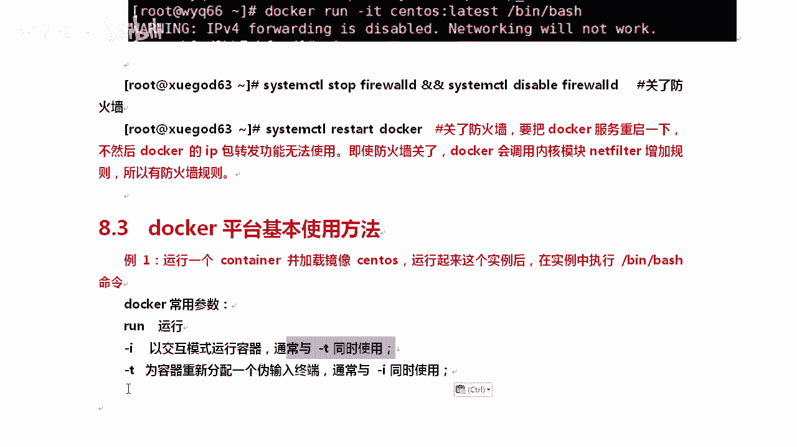
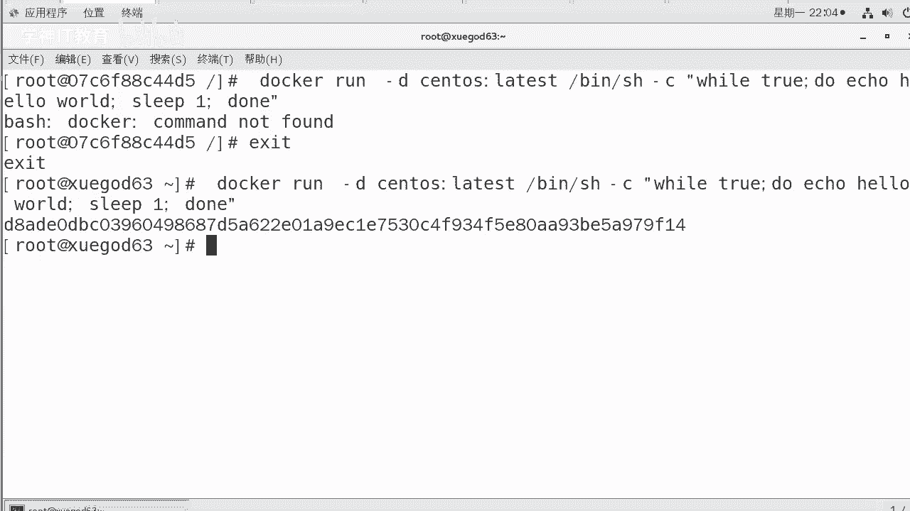
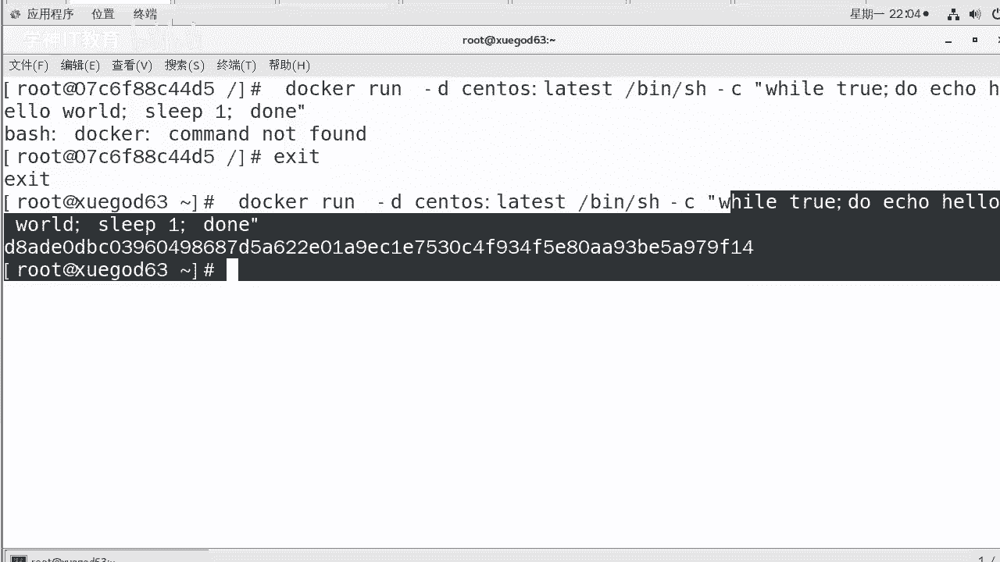
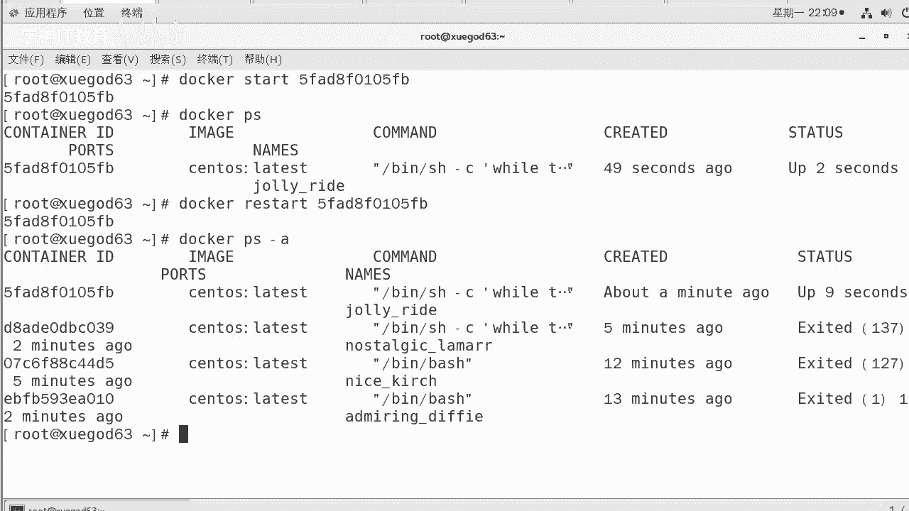
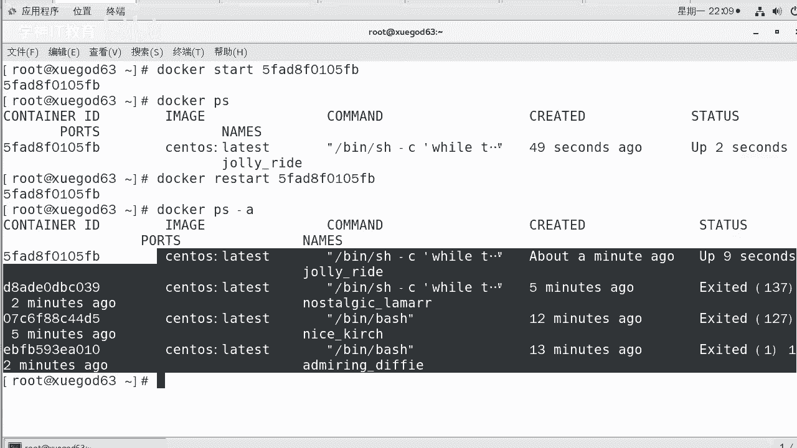
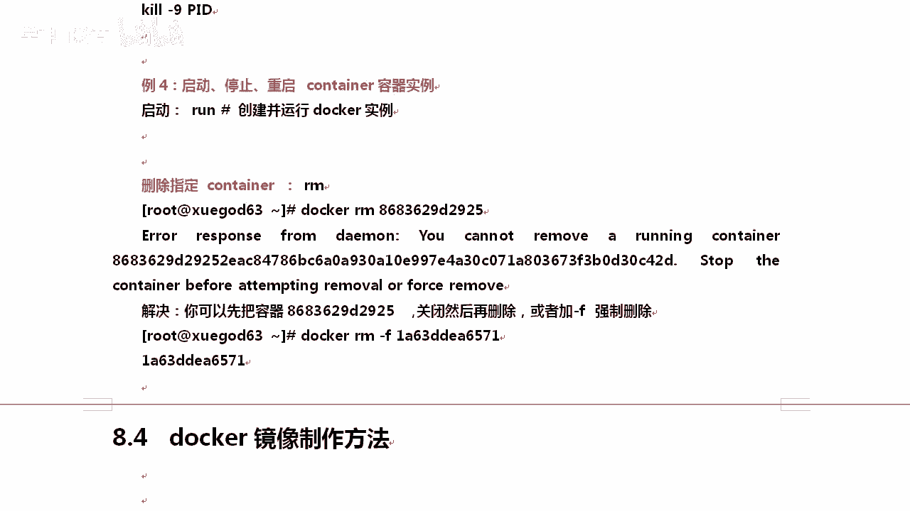

# Docker平台基本使用方法：P3：3-docker平台基本使用方法

在本节课中，我们将要学习Docker平台的基本使用方法，核心是掌握`docker`命令及其常用参数，包括如何运行、管理、查看和删除容器。



## 概述

Docker是一个容器化平台，通过`docker`命令可以管理容器和镜像。本节将介绍最基础的容器生命周期管理命令，包括运行、交互、后台执行、查看日志、停止、启动和删除容器。

## 运行交互式容器

上一节我们介绍了如何获取镜像，本节中我们来看看如何使用镜像运行一个容器。

要运行一个容器并进入其交互式终端，可以使用`docker run`命令配合`-it`参数。`run`是运行容器的意思，`-i`表示以交互模式运行容器，`-t`表示分配一个伪终端，这两个参数通常一起使用。

以下是运行一个基于`centos`镜像的容器的命令示例：
```bash
docker run -it centos:latest /bin/bash
```
*   `-it`：以交互模式运行并分配终端。
*   `centos:latest`：指定要使用的镜像及其标签。
*   `/bin/bash`：指定容器启动后要执行的命令，这里是启动一个Bash shell。

执行此命令后，终端会进入容器内部，提示符会发生变化。此时可以像操作一个独立的Linux系统一样执行命令，例如查看系统版本：
```bash
cat /etc/redhat-release
```
要退出容器并停止它，在容器内部执行`exit`命令即可。

## 运行后台守护容器

有时我们需要让容器在后台长期运行一个服务，而不是进行交互。

这时可以使用`-d`参数，它表示在后台运行容器（守护进程模式）。同时，我们可以使用`bash -c`来执行一段脚本。





以下是创建一个在后台不断输出“hello world”的容器的命令：
```bash
docker run -d centos:latest /bin/bash -c "while true; do echo hello world; sleep 1; done"
```
*   `-d`：让容器在后台运行。
*   `/bin/bash -c "..."`：通过Bash执行一段循环脚本，该脚本每秒输出一次“hello world”。

命令执行后会返回一个长哈希值，这是容器的唯一ID。

## 查看容器日志与状态

由于后台运行的容器没有直接关联终端，我们无法直接看到其输出。

此时，需要使用`docker logs`命令来查看容器的标准输出（日志）。同时，`docker ps`命令用于查看容器的运行状态。

以下是相关命令：
```bash
# 查看指定容器的日志（可使用容器ID的前几位，只要唯一即可）
docker logs <容器ID或名称>

# 列出所有正在运行的容器
docker ps

# 列出所有容器（包括已停止的）
docker ps -a
```
执行`docker ps -a`后，可以看到每个容器的`CONTAINER ID`（容器ID）、`NAMES`（容器名称）和`STATUS`（状态，如`Up`表示运行中，`Exited`表示已退出）。

## 容器的生命周期管理

我们可以像管理虚拟机或进程一样管理容器的生命周期，包括停止、启动、重启和删除。

以下是管理容器生命周期的核心命令：
```bash
# 停止一个正在运行的容器
docker stop <容器ID或名称>





# 启动一个已停止的容器
docker start <容器ID或名称>

# 重启一个容器
docker restart <容器ID或名称>

# 删除一个已停止的容器
docker rm <容器ID或名称>

# 强制删除一个容器（无论是否在运行）
docker rm -f <容器ID或名称>
```
**注意**：直接使用`docker rm`删除一个正在运行的容器会报错，提示不能删除运行中的容器。此时需要先使用`docker stop`停止它，或者使用`docker rm -f`强制删除。

## 总结



本节课中我们一起学习了Docker平台的基本使用方法。我们掌握了如何使用`docker run -it`运行并进入一个交互式容器，以及使用`docker run -d`在后台运行守护容器。我们还学习了如何通过`docker logs`查看容器日志，使用`docker ps`查看容器状态。最后，我们熟悉了管理容器生命周期的关键命令：`stop`、`start`、`restart`和`rm`。这些是操作Docker容器最基础且最重要的技能。