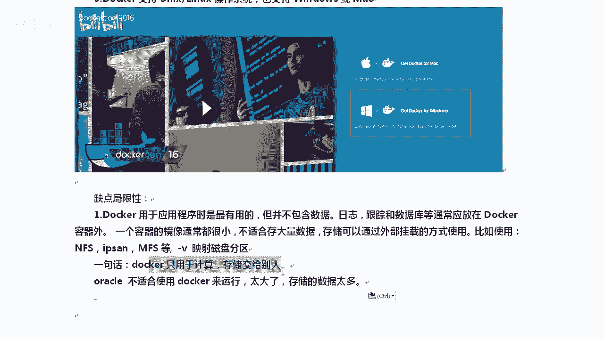
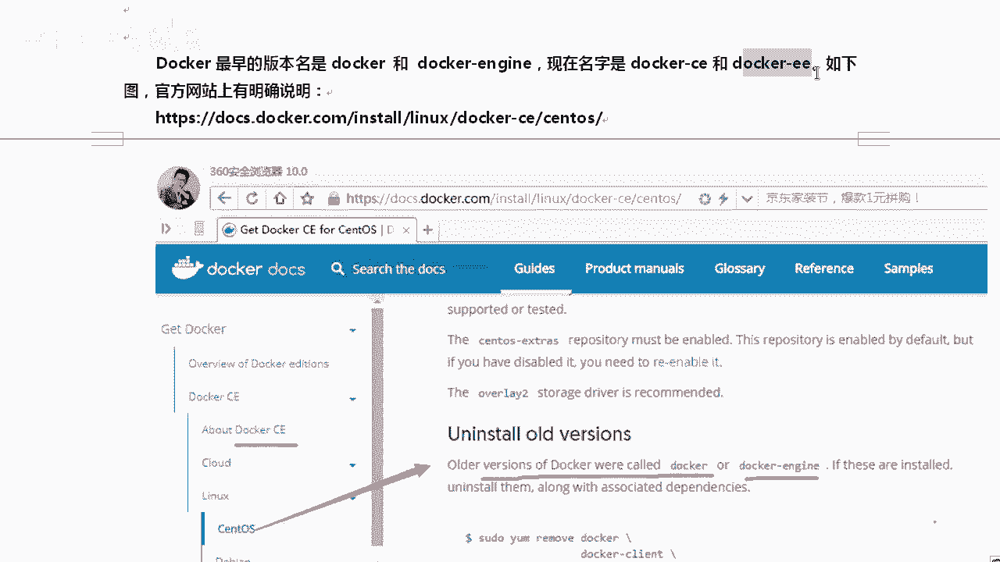

# Linux／Linux运维／Docker／红帽认证／云计算／Linux资料／Linux教程--部署docker容器虚拟化平台 - P1：1-Docker概述 - 学神科技 - BV1cD4y1o77V

那大家好，我是讲师MK。那今天老师要跟大家聊一聊这个刀cker这一块的内容。第一个是docker的概述。那么接下来部署一下docker啊，我们配置一下docker镜像加速地址。

docker基本平台的使用方法，镜像的制作和端口的映射。整个实验环境我们来说一说。我们是基于s7。5系统来做的这个操作，好不好啊，所以你别整一个6六下跑了一个刀口跑起来很困难。刀cker是什么？

我来介绍一下刀cker是一个开源的应用容器引擎啊，让我们的开发者可以打包他们的应用和EI包到一个可移植的容器里面。然后呢，发布到任何流行的机器上都可以啊，几乎没有什么性能上的开销。

而且不依赖于其他语言和框架啊，或者系统就是用起来非常的方便。😊，理解了吧啊，他用的时候，大家用用docker的时候，总觉得会哎这个东西跟虚拟化啊，KVM有点相似，或者VMR虚拟机有点相似。是的。

他用起来确实是这样。😊，知道了吧？我们来聊聊这个什么是沙河，沙河这个地方。沙河有时候啊沙河有时候又叫沙箱，英文名字sand box。😡，好吧，你看因为容器是完全使用了沙盒机制，相互之间不会有任何接口。

好，也就是说它是非常安全的。在计算机领域里面是吧？安全软件先让他在沙河里面跑。如果有恶意行为，我们立马能给他切断。就像我在外面里面跑一个软件一样。如果这个软件突然间是吧，哎，我发现他对外发包了。

或者说啊恶意的复制文件了啊，修改我的文件了，我就可以立马从外部是把它直接给干掉。😊，哦，这也可以算是一一种沙盒。好，docker那个公司来这里啊，docker是由dot cloud公司开啊，基于什么呢？

基于一种技术，这种技术叫做LXZ高级容器引擎技术开发的那么代码是在gihub上。而且基于docker是基于购元的。其实大家在呃开源领域里面，你能接触到基于购元开发的。服务并不是很多好吧，并不是很多啊。

ra的MQ啊消息队列是基于购源的，还有就是docker就是一些一定是一些很新的一些服务，它是基于购源的。我觉得普罗米修斯监控也是基于购源的。

docker它可以让我们开发者打包他们的应用程序到一个可移植的容器中发布到任何流行的机器上，这一句话听着好像能听懂，但是好像没感觉它有多牛，你有那种感觉吗？😊，是吧好像没感觉。

其实他想说的一句话就是他是跨平台的啊，他你看我们现在软件是怎么发布的。你比如说咱们windows下windows下office eX是吧，这个能在叉P下跑吗？我估计大家没跑过，有可能就不能跑，包括一。

比如说我打了一个包叫MK点M包那这个M包它在上或者他是可以跑的。因为大家接触的都是RPM包的那他在开了一下能不能跑他在U two下能不能跑那就不一定了。因为U two下人家是DEB的这种结尾的包好吧。

人家是都是点DEB的下的，就是这个系列的包。😡，所以大家知道吗？就是我们现在所搞的这些东西啊，都是跟跟什么跟操作系统息息相关的。你跑离开我这个操作系统，你这个包可能就跑不了了啊。

最简单哪怕我就不离开你的操作系统。你看就哪怕就这个VSFTP后面有个EL7，大家知道什么意思吗？这个EL7的意思是说我在EL7平台下，就是森特S7或者ERHL7下跑是没有问题的。😡，但是他在6下能跑吗？

😡，你是不是不一定啊，是不是有可能我调用的这个包是吧，在6下就觉得那个包太旧了。😡，啊，包跟包又冲突了。所以大家安装包的时候，尤其原码编译的时候就会觉得很被动。那么有的刀cker就好了。

docker它就是有一个创新，它能怎么样呢？docker的镜像可以以次构建到处运行。只要你机像装了docker的服务，我把我的是吧？我我把我的镜像扔给你，无论你是什么stoS还是Uban two的。

反正都能跑下。😡，这样了吧。OK。啊，还有一个小小小的扩展术语，这个术语大家知道一下就是LX知道一下叫linux啊，linux是一种内核虚拟化技术。而docker正是基于这种技术做出来的一个产品。

基于这种技术做的不仅仅只有一个docker楚了吧？就像大家一说到虚拟机有 box也有是吧？是KBM也算是虚拟机，这种技术可以可能诞生好多产品，其中docker这个产品算是最出名的。

那这种技术主要是怎么来做的呢？它是通过内核的name space命名空间来实现用户之间的隔离。好吧，用户实力之间的隔离C group实现资源的调度。😊，一个能把你们隔离开，一个能给你们分配资源。

资源就是硬件的资源。啊，这样分开了以后，你就可以虚拟化的那种方式去跑了。好，那这是do考的官方网站啊，我估计大家以前从来没有打开过，你自己现在就打开看一眼。凡涉及到官方网站的时候。

我都喜欢跟大家说说一声，我者你打开看一下。

啊，这个开源的站点你应该打开看一下。那么接下来我问大家个问题啊，这个刀坎是什么意思啊？

刀坎是马头工人的意思啊。这样了吧，是码头工人意思。那docker的logo是什么呢？对，这就是docker的logo。😡。

看到了吧？一个鲸鱼啊，蓝鲸蓝鲸本来就是最大的不露动物是吧？上面怕啊很多集装箱，就说明我是一艘巨轮，我能扛很多货物，而且隔离性还很好。😊，很明确是吧？其实整个这个已经说的很清楚了。

你看docker相当于是经营coner，就是集装箱coner这个单词才是容器集装箱的意思。

啊，docker本身是马头工人的意思。OKdocker的开源代码，那么是在这里啊，叫moby，原来是get up是吧，点com docker。后来换名字了，换成Mo笔了啊。

大家知道一下这种集装箱有什么好处，大家知道吗？你通过了解集装箱，你就应该能因为集装箱大家都见见了很多了，都很知道。你像如果没有集装箱的时候，那个隔离性也是很差的。在没有集装箱的那个情况下。

比如说海上我去运输的时候，因为现在那个。😡，嗯，快递小哥一样，开个三轮车是吧，大包小包的随便往里一放，万一有一个坏了，另一个是受感染了是吧？那有集装箱如果封闭的很好的话，哪怕水果烂了，香水也不会受影响。

就是我的隔离性是非常好的。而我们刀口恰恰就有这种隔离性。😡，良好的隔离性。接下来我们来聊一聊docker容器技术跟虚拟机技术相比，为什么要聊这个呢？因为一会我们把一个docker实力跑起来，跑完以后。

你会发现哎这个docker跟KBM好像没什么区别。啊，或者说跟虚拟机的这种技术没什么区别，因为都是相当于跑了一个实例。那么区别到底在哪里呢？我画一张图让他看一下啊。来。来，我们看这张图，好吧。

从这个层次上我们来聊一聊。首先呢container就代表容器这种技术并不并不是说一定是docker啊。然后VM它也不是说VML虚拟机，就是虚拟机这类技术。好吧，对于VM虚拟机这一类技术。

他们都是怎么跑一个服务呢，是这样的，现在黑色上跑个硬件，也就是s这个地方，然后装一个操作系统，你可以装sS7也可以装个win10装完以后，如果是linux下，我们可以装一个KBM。好不好？

那你也可以装1个VMR装VMR以后，你是不是得装操作系统。比如说你装个s通S7。5的系统，装完系统以后，再在系统上把软件所需要的二进制和库是吧装好，然后你才能把外部服务器，我我这少写个B啊。

才能把外部服务器抛起来。对吧我们现在跑的都是这样。比如说我现在就是我在lininux啊真机上装了个linux虚拟机，装完那个虚拟机，然后我们去y instore hTTP在安装它的时候。

还要把一大堆的库给安装上，否则我的阿帕奇是跑不起来的。😊，对吧那么docker就不是这样了哦，好了container看到了吗？叫share OS共享操作系统。😊，好，他是这样的。

硬件硬件上面有s通S系统，系统上跑一个导口服务。好吧，跑完这个docker服务以后，服务上会有一些。其实这个时候我们就该把镜像下载下来了。docker服务跑起来以后，我们去下载一个镜像，好吧。

那么镜像里面自带了程序的库，然后自带了对应的服务的程序。也就是说他没有什么，对他没有。😡，没有什么没有操作系统，没有gues OS。😡，知道吧？它跟那跟你的物理机是共享操作系统的。

因为你是共享操作系统的，所以我就不需要像VV5。假如说我要在这里reboot一下，大家都知道这个时间很长，因为我不需要，所以我就相当于在本地起了个记芯本或者起了一个什么QQ软件一样。😡。

啊，所以docker的速度启动起来就会很快。大家能理解吧？你要起一个docker实际就会很快，因为它不需要再去做内核那些。😊。

操作啊，什么质检啊等等那些东西。刀cker相当于相对于VM虚拟机来说，少了虚拟机操作系统这一层，所以刀cker的效率就比虚拟机高，有同的高多少？效率确实挺高。我们拿着开机这个事儿来说啊。

你们VMV尔虚拟机开一个机器用多长时间？😡，那有很很多同学说老师我10秒就能搞定了，或者我30秒就可以搞定了，是吧？这些速度都是非常的棒的。大家如果正常的物理机启动的话。

那可能升至有时5分钟都还没搞不起来。😡，啊，得5分钟，你等自检的时间长。但是你看一下，我们在刀口上起一个实例，我们需要1到2秒钟。12哎，这个就浅了。

行不行？不信，我跟你讲信MK得永生啊，来我们来看一下，我们来做一下，给大家演示一下。😊。

既然大家不信，我们把这个刀卡的架构给大家说一说，一会儿跑一下，让你看一下在刀cker上，你看我们VMV虚拟机，哪怕我就还原快照是吧，都不可能1到2秒钟前，但刀坎上他他是可以的啊。😡，好。

整个刀口的这个框架是什么呢？你看一下。嗯，dockerNG你可以理解成是docker的服务。docker，我们整个跑的过程就是这样的，先运行一个docker。啊，运行完了以后。

从docker hub上或者说docker的一些镜像服务器上去把sto s镜像下载到本地，下完以后启动docker容器实力，这就起活了。那后期我们可以使用docker看的嗯，从本地或者从远端进行管理。

这样了吧，这个流程其实还是很清楚的是吧？123就三步骤跑刀坎下镜向起伏。不难吧，这个这流程其实并不是很难啊，服务器A上运行dockerNG这个你就理想成docker的服务。

在NG上可以起很多的coner，想起container，想起容器，你得容器，你想想杯子是个容器，容器里面得倒入东西才行，倒的就是镜像。😡，好吧，我们把那个松度S镜像下来，放到刀口容器上就能跑。OK。😊。

清楚了吧。这个不难，对不对？docker can可以对他进行控制。我们来看一下docker hub。

docker hub是docker的官方镜像存储站点，就是所有的镜像都放到人家身上，就相当于stoS的那个样务源一样，知道了吧？我们把sS加的包都放到stoS的样务源上。

那么其中提供了很多什么镜像公用户下载，比如说U one two啊，stoS，我们可以通过docker hub上的用户去，你也可以发布自己的镜像。好不好？也可以发布自己的镜像。

说到这个docker hub上，其实就是在网站上创，你也可以创建一个属于自己的docker仓库啊，里面放上你自己的包。docker hub还有什么 hub？其实在港IT这个行业里面。

还有一个hub还挺出名的。😡，听说过这个吗？get home。有没有自己的get的行码？有的话，你就敲个一，没有的话，敲个2。

啊。要有啊对，要有作为一个成功的开源人士或运或者运维人才，你一定要注册一个get hub或者docker hub的账号，为了啥？啊，你想想。面试的时候跟面试官说，我在gt hub上有10个开源项目。

我在dock hub do hub上是吧啊，有自己维护着20个dock的镜像，那就跟菜鸟不是立马就不是一个档次了。😡，清楚了吧，你的工资就可以往上翻一翻了。

证明你室内的时候就到。啊，没有用过的同学，赶紧自己去注册一个get hubub账号。我作为运营人员是吧，你需要有一个你应该上get hub啊，这个次数比比看什么优酷了。😊。

啊，腾讯视频呢比看那个还要多才行啊。来，我们来看一下docker docker里边核心技术是name space啊，namespace可以实现进程网络信息甚至文件系统。

主机名的隔离C group主要是资源，那个是隔离。这个C group对资源的度量。这个当然是没什么概念。这个C group就相当于什么呢？如果把它可视化一下，s group其实就能指定。

比如说我我用几个CPU，我用多大内存，就像whereware这个一样。外面是不是靠这个界面？对不对？打VM面背后还有自己的技术，你看的这是个界面，我们s group就可以尝你用多大内存。😡。

用多少硬盘这个都可以设置啊，甚至你对硬盘的读写速率啊都可以。甚至我说你能用。

1个CPU的几秒钟时间，我都可以。

啊，我都可以啊。哎，再看这当然还有很多的特性啊，什么文件系统隔离，日志隔离、网络隔离啊，变更。它提供了交务式的sll。docker可以分配一个虚拟终端，并关联到任何容器的标准输入上，好不好？

你可以跑一个shall。这就告诉你，其实刀坎是没有没有什么没有这个界面的。好，你知道吗？为什么他特意提一下，你像我们可能用这个都用习惯了，用linux用习惯了，都有terminal。

都有终端docker默认没有终端。好，你要用的话，你得给他给他匹配一个终端上去才行，否则你没办法跟docker进行交互。啊，他还有很多的优点啊，比如说我比VMR小啊，几乎VM能干的事我都能干啊。

你在笔记本上各方面都很容易把它给部署一下。

啊，还有还有docker啊，可以在公有云上，然后对于开发人员说，我只需要开发出来一个自己的镜像就行了。不用再担心说哎，你们公司用的是Uban two系统，我们公司用的是森通S系统。

他们公司用的是开里系统。你不用想那个你你只要开发出来一个lininux的镜像，那么在lininux上就通斥。这就确实你们没有做个开发人员，你不理解他要打好多包，知道吧？啊。

谷歌、亚马逊都支持了刀坎支持windows吗？😡，刀cker一开始是不支持的，后来是吧，在windows下也可以跑，一开始是不支持的啊。

不过后话说现在那个微微软。对，这个linux支持的也挺棒的是吧，也拥抱了一下linux以前。以前比昂盖爱斯啊或者鲍尔默是吧，主持微软的时候就是。把lindows视为眼中钉，对着干是吧？现在换了总裁了。

好一点了啊，好很多了，应该是很多东西都支持了。

好像那个微软的MSciircle啊，微软的MSciircle现在也可以在lininux下去跑。以前微软的数据库是不可能在lininux下跑的。来局限性，当然刀口也有局限性了，对吧？

docker对于运用程序来说是有用的，你别把它是吧，存数据啊，日志啦，还有数据库等等，一般都应该放到刀cker的外边。知道吧？都应该放在外边，容器的镜像通常都很小，不适合存大量的数据，好不好？

一般数据都是通过外部挂的方式挂上去的。也就是说，刀口用于计算存储交给别人，明白了吧？像二口这一类的就不太适合拿，因为它太大了。😡。

啊，其实mysqcle还好啊，最适合的就是阿帕奇NG这一类的。再或者说你们公司是做游戏服务器的那个游戏。运行的那个程序安装刀坎。好不好？对我们在这里快速的把刀口给安装一下。安装刀口有三种方法。

youint docker啊，或者我卡考你啊，样 int docker样 instore do NG样 instore do杠C以上三种方法，哪个是正确的？猜一下，为什么要这样去问呢？

因为你去搜docker的安装，这三种方法都有讲。就是网上会有这三种方法，最终。一最终让你自己都不知道到底应该有哪种方法是对的。😡，那老师再跟大家聊一下啊，其实啊他们三个都正确啊。

但是呢嗯你们还好有我知道了吧？因为什么？因为这三个其实安装上以后，像那个配置文件啦，还各方面差别还是挺大的，甚至它的位置也是比较大的。我当年搞刀cker的时候，我说这三种方法都有啊。

到底哪一种方法是对的，看看说吧网上所有的文章是吧，啊，哪种文章都行，都能搭出来。😡，而且没人能说得清他们之间三个关系。好，我来跟大家说一下啊，对，有时候你还扯不清他们三个之间的关系。我说正确答案吗。

正确答案应该是docker store怎么杠docker C有同学因为CE是社区版，不是啊，那么在官方这个地方有一个说口好吧，就是ckerCScker大家后期如果你实在看不懂一些东西的时候。

你就上上它的官方网站上去看Ocker最早的版本叫做docker和 nG后来呢改名字了啊改成docker C和docker eE就是付费版，你得交钱CE的话就相当于了。你不用交钱。😊。

好吧，在这个官方网站上有这个，所以一般情况下，他会说an install old，就是你在安装someto s，你要安装这个docker的时候。

他说告诉你应该卸掉旧版本old version docker被称为docker或者docker NG啊，你需要木 docker等等等，全都卸干净了以后再去装新的懂我的意思了吧？

OK。😊，好，所以这个地方大家要清楚啊，17年之初的时候，docker将它的开源的项目名字也命名原来某笔了啊，某笔继成了原先的刀cker项目啊，是社区维护的一个开源版本。啊。

docker C是维护的就docker公司维护的一个项目基于mo啊的一个免费的一个容器产品。意义的话自然是必然的啊商业产品。因为docker这样的公司他也需要挣钱，咱也能理解。

否则你也用不用不了这么好的社区版，对吧？是片M包的啊，所以我们经常我们经常用的一般都是docker杠C很少去片啊，而且是样么的方式安装。刀口这一块很少去需要你去做那个啊原版编译，这个不需要。好。

这是刀口的概述，稍后我们来安装一下。

