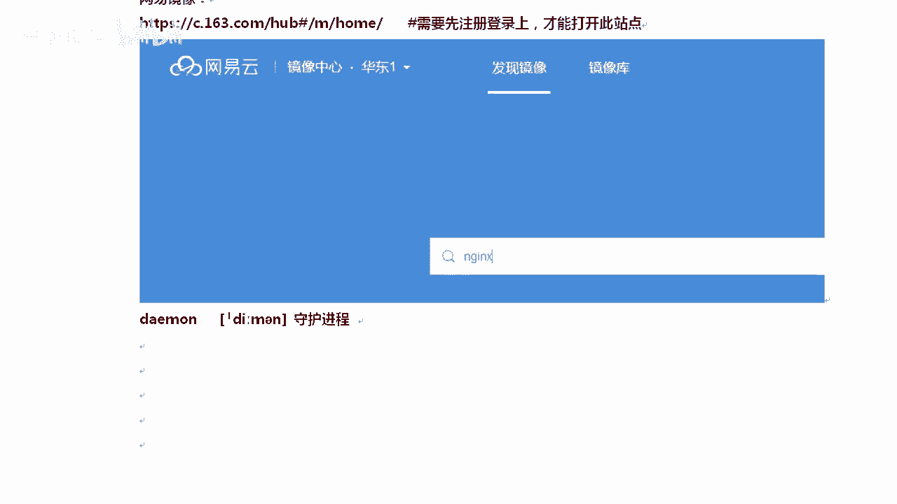
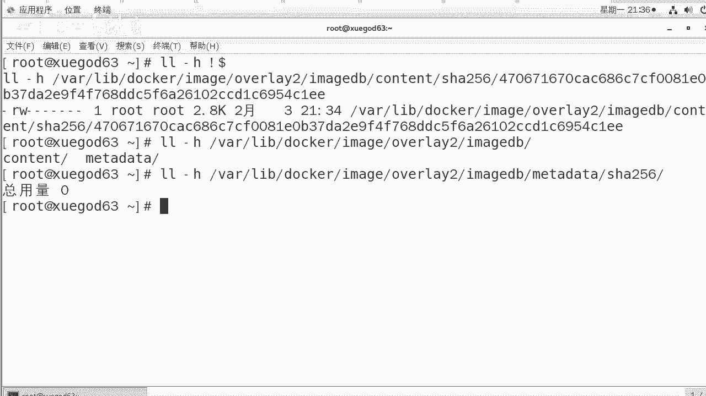
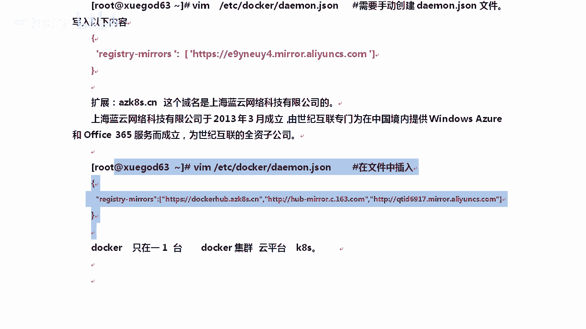

# Linux／Linux运维／Docker／红帽认证／云计算／Linux资料／Linux教程--部署docker容器虚拟化平台 - P2：2-部署docker容器虚拟化平台并配置docker镜像加速地址 - 学神科技 - BV1cD4y1o77V

那么我们来安装一下这个dockerstoS7。5的平台IP地址是1。63，对吧？好，第一个你需要安装一些E赖包，y installstore的一些E赖包，大家是需要装的。这先回撤啊。

y你可能很少见这个啊，还有一个device map设备映射相关的，还有LVM two，也就是逻辑卷。啊，逻辑卷相关的那个包，因为有时候他需要挂在一些设备的时候，会用到逻辑卷这一块的东西。好。

这边先让他慢慢安装着，好不好？安装了这些docker依赖包，安装完了以后，你需要配置国内的docker样源。什么意思啊？因为我想安装，因为系统里面自带的那个是很老的包，就是好吧，我们如果你不安装这个。

你是安装不了docker C的。清楚了，你必须安装它，否则的话我们操作系统你直接要么instore docker也是能直接装上的。但装的这个docker版本太老了。好吧，你要想装docker C版。

那你需要这样去做这个事，要么fi manager杠杠按的。😡，能看出来啥意思吗？其实就是把docker这个文件保存一下。我更喜欢用W get杠大写的O。好吧。

但是但是在这里有比如方说W get刚大起来哦，我存到ETC下的什么ym点repo下那下存到这下边。也是可以的，或者你你拿这一条命令也行。我这个命令大家用的很少。我在这里给大家演示一下，让大家知道一下啊。

好，稍等。马上OK啊。他会在哪呢？在ETCE点reple下，其实就是在你这下面再产生一个reple文件。啊，把它给下一下一下，是下的阿里云的。这样会速度快一些。

你看他会告诉你reple save two ETC项。😡，对吧yriple点Ddocker CE杠reple。这样多了一个。文件我们可以看一下啊。

多少个样目文件。要么的这个原。好不好？对，微信微。好，拿到这个以后呢，我们就可以去安装docker了。安装docker的时候，我们把cl。这几个包装一下啊。我们当然他。先让他下着啊，98兆是吧？

这样的话速度是不是嗯这样的速度会很快啊。

y么insstore docker C docker C client和container哎。啊，LO这个包的作用。看到了吗？CLI是命令行的工具包。container容器。知道了吧？

如果你实在不知道哪个包的作用，你可以使用样。😡，写少写M啊，我们可以使用y in软件包的命令，这样可以查看软件包的具体作用。知道了吗？各位。对，如果你实在不知道的话，我也不知道这个包的作用是啥。

你可以这样去搜一搜。😡。

好，我们当任他啊。好，你看一下啊，他在下载的时候说当o的这个包不存在是吧，我们再试一下啊。啊，再试一下。我什么也没做啊，什么也没做。你看到了吗？就是你用外网这种源的时候，有时候是吧，他就是找不到。

清楚了吧，你重新再执行一遍就OK了。其实大家明明看到，就是刚才那个包就没有找到。我重新执行了一下，他就找到了，好不好？好，我这边已经安装成功了啊，安装成功了。

我们s team我们来启动一下s team start docker，然后and ands team enable docker，让它开机启动啊。

开机启动一下。哦，开机启动完了以后，看一下版本号吧。刀坎。我们学刀坎其实更多的就学这一个命令。因为这个刀坎命令后面可以加好多参数。一会儿你慢慢你就知道了啊，我们看一下。

我们当前这个版本是docker19，这个19这个版本还可以啊。

呃，O。好不好？19来再往下我们来看一下刀cker in。好，刀口音付。回撤这样的话能看整个docker服务的一些基本信息。我们大体上看一下啊。

你看do会 infer这里上面写的，比如说我们当前ser啊coner有几个有几个运行着的，有几个挂起，有几个stop。

对不对？我的当前这个docker里面有几个镜像，就像veve尔看的时候一样，你你都有哪些情况？OK我的文件系统是什么？然后呢。

story driver存储器用的是什么overlay overover two是吧？然后叉FS这一块的。

啊，常白再往下，我们来看看啊，还有。还有哪些呢？我们的系统内核是s7的64位的总内存1点是吧？总内存这个就是物理机的内存啊，物理机的内存docker rootot BIL在哪呢？在这。

也就是docker，比如说就相当于是docker的根啊。干嘛是呢？比如说我存了一些docker镜像，就是放在这个目录下。当然这个目录下还有好多啊，总总的来说就在这个docker目录下。好吧。

比如说有container相关的network爬插件相关的。好吧，包括存储这块的，还有Eage镜像相关的镜像都放在了这。有同学老师这个镜像是不是就我一眼就能看得见，你你看不出来的啊。清楚了吧。好吧。

他不会让你他会他已经把镜像给你拆开了，不是说就是A点ISOB点ISO不是那样的。😡。

他会跟你分开的啊。好，我们拿到这儿，这是查看刀口的基本信息。看完了以后，我们现在在干嘛，还有印象吗？我现在想要运行待会。没印象了，看一下这个第一步骤，docker已经跑起来了啊。

服务器第二个步骤是下载镜像。那我们来下载一下镜像。

就是打会卡大家要知道。以前我们讲比如说搭个stoS啊，不是搭个阿帕奇，搭个NG会比较难。那么docker这个地方安装包已经。不用你安装了，因为所有的安装包都给你集成到镜像里了。

所以这个时候我们就需要把docker镜像给下载下来。而下载镜像又是从国外下的，所以我会教你很多下载方式，三al。刀cker设sometoS默认设试一下啊。好，我默认测试一下，等等他。这边先设置着啊。

看这啊readis看到了吗？😡，默认他会去这里面去找那个镜像。啊，如果有时候你这个地方是吧呃，res tree，你可以理解成是仓库地址，进像仓库的地址，默认他会去这里面去找啊。

好不好？对。因为很多同学说，哎，你这个拉镜像到底去哪拉的，就是他就是在这啊默认。😡，啊，去这个网站上找。找什么？找docker镜像。有时候你你又怎么样，你又访问不了他。

所以就导致你拉取镜像的时候根本拉不出来。😡，大家能理解我的意思吗？对你有时候想去这里面拉，但是拉不出来。啊，他会的。我看我这边拉出来了没有啊。你看docker searchsome s。

然后告诉你al error怎么办？我从这里是吧，index什么什么拉不出来。😡，TRS hand的shake。T out。握手超时啊。怎么办？重新试一下。啊，因为你走的是国外的网站。每招。重新试一下。

你看这一次就拉出来了。

是不是？好，这里还有个日语的是吧？你想下什么镜像的时候是吧，你多尝试几次，出现这种tmo out一般都是网络的问题啊。嗯，我想把这个sS镜像下载下来，它是the official build S。

其他的不是official的。😡。

啊，你可以把它稍微缩小一点啊。

凡是office是OK的地方，那说明它是官方构建的。你可以基于他这个镜像上再去做你自己的镜像，这样的话就很轻松了，知道吧？这样就很轻松了啊，新星数越多，说明它越OK。

比如说我想做一个sto s7上安装好unable的程序，或者我想在sto7上安装unsable。以前大家是要么insstoreable。那么现在你只要把这个sto7unable镜像下载下来就行了。OK。

😊，你可以直接下一个这样的，比如说松度SLNMPPP56。把它下载下来也是可以的。这样的话直接一个lab环境就搭好了LNMP的环境就搭好了。啊，很多啊。行不行？对它都是有对应的这些环境的。

我想做一个在s图S像已经安装好java的环境，那你就下这些镜像就行了。它是基于orac口java8做的一个镜像。啊，他有很多现成的镜像供你去下。好不好？好。这个清楚了。那如果你你可以去下一下。

比如说我们这个时候docker power。你不是已经C40到了吗？40的时候，你可以把这个名字直接复制过来啊。比如说我把这个名字直接复制过来。😡，带上什么，带上前面那个杠。

一般这个是代表的是用户的名字啊，然后呢，后面是具体。静香的名字。因为他需要区分一下啊，因为你可以叫stoS7杠de，我也可以叫stoSde。我是MKstoSde，你是这个人的。😡，好吧，那么在当的时候。

如果说当的时候也出现了什么time out。怎么。报错了报错了，这种情况下是一般都是网络的问题。啊，如果你的网络没有问题，那你可以怎么样？你可以直接下载，如果有问题，你就换一个刀cker镜像下载地址。

通常情况下你是有问题的。所以这个时候我们怎么办？就像我们以前用阿里用样务源的时候，大家总觉得样务源有问题。那这个时候怎么办呢？我们换一个本地的，换一个清华的，换一个阿里的，换一个网易的。刀口那个也叫。

但是它不叫样源，它叫刀cker镜像加速器啊，它能提升你炮往下拉的速度，还记得这个标题吗？啊，第二步骤你可以泡。懂意思吗？泡就是往下拽一个镜像，当然你也可以把自己的镜像push。

我也可以把镜像push到这上面，这都可以。好不好？OK。😊，清楚了吧。你想下什么样的镜像都行。然后有有同学说我想下买srcle的可以吗？你也可以这样，你可以送得来，你可以直接在这里输入上买scle。😡。

测试的时候，这样测试出来很多关于mysql的。看到了吧，甚至我想设。win10行不行？可以吗？还有。有win10的。我看有没有win1官方的啊。对，win10也有啊。PXE然后。

你看这个人搞了1个win10的win10的。啊，win7的也有都有啊。因为他也支持windows。好。我们来搞搞阿里巴巴这个事，阿里巴巴你需要登录一下这个容器，登录上这个控制台。

或者使用你的支付宝账号进行登录。第一次登录的时候是需要输入一下独立的密码啊，阿里云上的一个平台在这个云平台登上去以后。就是相当于他的一个开发平台。在这里有一个整个页面登上去以后，在它右右边啊左边。

镜像加速器镜像加速器以后，你可以复制一下，这就是属于你自己的镜像加速器地址。啊，使用镜像使用镜加速器可以提升获取刀口官方镜像的速度。看到了吧？对。OK那么看到了以后，那这个怎么用呢？

在U斑 two下生屠 sm windows下分别怎么做。比如说U斑 two下推荐你用1。10以上docker版本，我们是1。19。是没有问题的吧。是没有问题的，用的时候很简单T。😡。

相当于你创建一下demon啊，demon demonmon点jason这个文件写完以后在这里面写res trees。仓库的镜像是这个写上去以后，把什么restar一下刀壳就行。所以这个步骤不难是吧？

是不。当然你也可以上什呢，上啊网易上网易上也有啊。网易这个人家是必须先注册，然后才能打开这个网站。如果你不注册，你是打不开的。

里边也有对应的刀口定像。好不好？那么还有一个是低门，低门是守护进城。我在这说一下，其实大家您有没有用过腾讯的？家速地址或者腾讯的样员。其实大家很少用腾讯的是吧？所以在这吐槽一下，因为你没有充钱。

所以大家很少用腾你像网易有镜像加速，腾讯的就很少。😡。

是吧包括那个亚务员了，大家一般就是阿里啊。

腾讯啊阿里或者163网易搜狐、新华是你熟悉的这几个。腾讯呢就很少了啊。

不是你习惯性用阿里是，你有时候就根本找不到腾讯的。如果你登录上腾讯的云主机，你看一下腾讯的那个。呃，默认的样务源里面，云主机的默认样务源只能是人家自己内部云平台用，你外部人是用不了的。

对，换句话说，你没有充会员。刀坎刀口后面李们哎，没有这个文件，你看啊，只有1个K点G啊。😡，这一次。啊，这次来。我们后面学那个pyython的时候，还会用到这个jason啊。啊，这次这种文件是干嘛的呢？

我们打开啊，这个文件需要你自己创建。😊，他的写法是这样写。以前我们是叉ML去存一些文件，存一些配置文件。它是这样的。好吧，你就把这一段复制上去就行。保存退出，这是一个是吧，那万一阿里云的不好使了呢？😡。

而且你要记住他的地址还不一定是阿里云啊，阿里云CS点CO。好吧，保存退出就行了。那有同学说老师，你这个我先保存一下啊。😡，好，如果说你有多个的时候。假如我我觉得写一个不够，写一个不够的话。

我想写多个写多个也可以。样子是这样的。还是ray tree好不好？然后呢。😡，冒号后面方框啊，这有方框，它后面跟上。比如说我这个AZK啊AZK8S点CN这是相当于亚马逊的。然后呢。

这个地方163的好不好？都有啊H。阿里云的都有。那我们来跟大家介绍一下啊，首先这个AZK8S点CN啊，后面163这这两个公司大家都认识是吗？亚马阿里云的嘛？这个不是亚马逊的啊，这是这个域名呢。

首先你直接访问这个网站是打不开的啊。那么你去查这个域名的。😡。

归属，那这个域名是谁呢？是上海蓝云网络科技有限公司，那这个公司好像很陌生，对吧？但是你看一下，上海蓝云网络科技有限公司成立于2013年，它是有谁呢？是世纪互联。世纪互联听说过吗？就是专门做IDC机房的。

在国内数一数二的世纪互联光环新网就在北京这边，还有上海这边都非常有名的IDC机房。那么是由世纪互联怎么样为在中国境内提供windows服务，还有office365。

就是3office365在线微软的那个office365专门成立的是世纪互联的一个全资全资的一个子公司，现在一下子就顺了是吧？实际上相当于AZK8S这一块更多的是微软在提供这个服务。明白了吗？

为什么要说这个事呢？因为。😡，提供的这个速度挺快的，有时候比阿里云还快。知道吧？尤其你在去做K8S的时候去搭一些服务的时候。所以我优先如果你多个多个，就是你下不下来镜像的时候，你把它拍到前面。😡。

只不过这个公司大家比较陌生。啊，这个K8S当然有同学说老师windows Az是干嘛的对吧？这个是微软的K8S。😊，提供商啊K8S提供商就相当于嗯。😊，你像阿里云是是open stack的提供商。

就KBM的提供商。大家要知道。😡。

这是微软的啊，微软提供的1个K8S的服务一个提供商。什么意思呢？你要知道我们现在怎么样。我们现在的docker，就我今天讲的这个docker能在几台机量跑。我今天讲的docker。只在一台机箱。是吧。

对我我今天讲的这个只在一台一台机箱够满足你的需求吗？满足不了。所以我们需要很多台很多台的时候，你就可以理解成docker的一个集群了。😡，对吧你需要一个docker的一个语音平台。

那云平台docker的云平台是谁呢？是KYS。啊，那这种情况下，你是不是得自己去搭？如果有的公司不会打，我想用付费版的，就像我不会搭啊，就像有些公司不会搭opent，我想用付费版的opent。

那就是阿里云。那么付费版的K8Sdocker云平台有很多。😡，好不好？阿里云有提供。啊，windows也提供了这样的一个服务，亚马逊也提供了这样的服务。明白了吧，现在能扯清那个关系了吗？好。

我们在这里聊了一下这个事啊，让大家知道一下这个公司好吧，扩展一些个小知识。好，我们不保存退出了啊。好。啊。这样的话，我只保只用这个阿里云的啊保存退出。完事以后执行这个。

阿里云给我们的意见是执行一下s team demon reload是吧，然后再执行一下restar。对吧。实际上那个de reload并不需要执行啊。好，那么最后呢。

docker我们infer看一下是不是真的搞定了。docker infer的时候，这个时候你会发现你会发现这里多了一个是吧？OK看read tree mirrors走的是这个。啊，多了一个。

不仅仅只有他了啊，镜像这个地方走可以走这儿了。清楚了吧。那么在这个时候我们去，比如说我们要docker。泡 s s的时候就快了，这时候就就很快了啊，我们可以看一下。啊，你看这个速度就很棒了是吧？好几兆。

大概这个速度有一兆啊，你看到这个数字的变化就行，一共73兆。整个镜像在下载的时候需要下73张。那我很顺利的就把刀cker这个镜像给下载下来了。好不好？下下来以后呢，显然大家都有一个概念，就是哎。

老师这个镜像放哪了？😡，啊，你可以查看啊docker images。OK这样的话，你能看到这个镜像大概是237兆。啊，他下载完了以后会给你解压，解压到哪了呢？在这里啊。😊，LS。刀cker in下。

等会一fer回车回完车以后，你看这个地方。我想 lab上的docker。它不是一个文件啊，你要注意一下docker下的images。交道了吧。他不是一个文件。清楚了吧，以ageDB看到了吧？

相当于是个数据库了，eage数据DB就相当于是一个数据库。😡，content什内容，然后上256，你看到了吧？这都是。😡，他把他已经把他给拆开了。看见docker images。看到了吗？

image ID是不是跟这个啥后面那个纸一样，他已经给你拆开了，有图上在这下边有东西吗？😡，就这。所以你你不要觉得哎，下一这是不是就是一个普通的文件，它不是一个普通的文件啊。😡，好不好？然后呢。

这里面显示的2。8K是吧，还有它不仅仅是在这一个下面DB下面还有什么啊met data matter data3256，还有内容。😡，知道吧他是整个跟你分开了。😡。

大家知道一下就行啊。好，他自己有自己的内内部的一套存储机制。

来，我们拿到这以后啊，我们拿到这以后呢，我们。还有一种方法也是可以的。我刚才这个地方是修改了demondemon的一个配置文件。除了修改demon配置文件以后，你还可以有一种方法就是修改启动脚本。好吧。

修改docker的启动脚本其实也是可以的。我不建议大家去修改docker启动脚本。如果有一天dmon这个地方不好使，那你就修改启动脚本。OKVIM修改一下这个启动脚本是这样的啊，VM在哪呢？

USR lab system team d team docker下的service，它的service文件是在这里打开这个文件啊，在第十四行的时候。😊，s number往下走。

第14十4行十4行有1个EXECstar其实。都可以啊，我们正常正常这个刀cker启动的这个。😡，进程叫dockerD啊dockerD然后杠H后面可以加很多多的参数。好吧。能理解了吧？

对我们在他他已经加了一个con啊coner的一个参数，我们不用管它，我们在它下面再加一个参数，加这个参数。😡，比说你要是往阿里云上走，你把这个参数加上去。reiss阿里云是吧，把这个参数往上加一下。

然后保存退出，这也是可以的。清楚了吧，我就不保存退出了啊。OK。啊，显然这种东西当然我就怕他改改脚改脚本的时候，一下子就改乱了。

有没有这种可能有可能。啊，你就在这里添加一下就行。我推荐大家用什么呢？用这个加配置文件。

好，第一名。用这种方式啊。因为这种方式不容易出错，改完以后重启刀cker让它生效好。demon system team demonmon reload记住demonload其实只有在修改了s team脚本的时候才需要重新加载。

如果你只是修改了服务的配置文件，其实没有必要执行这个。这样吧。是不需要执行的啊。好，那么还有一种是什么呢？第三种方法就是这个。把之前下载好的镜像可以尝试导入。

比如说我们把之前下载好的docker sHDDP的镜像，你可以把它传到linux上。传完以后，docker load杠I这样的话往里载入一下。这样也是可以的，你可以尝试。啊。

直接给你给他do load载入一下，这是本地的方式。啊，在线和本地。那还有一种方式你可以直接下载其他站点上的影响docker炮163。啊，给一个这样你下来下来，它前面会有有163的这个标识啊。

会有1个163的标识。OK。到现在，大家对这个刀口镜像有过了解吗？

你们用的刀cker经，以前我们接触的生头S经常都好几个G，因那因为那里面什么包都有刀cker，这个地方一定是越小越好。所以你看我这个导入是只有200多兆。😡，啊，只有200多兆整个这个docker镜像。

它相当于是对程序和程序依赖库打了个包。啊，当然还加了docker容器，人家本身的一些技术。好吧，但是整体上你粗略的，你可以给他理解成他就是打个包。所以我所以我我依赖的包在其他平台上我都能跑。

只要我在这个linux内核下没问题就行。😡，清楚了，一般程序是吧，主要对依赖的库比较依赖的多一些，好不好？软件是依赖操作系统中的一些库和二进制的啊，我们只要把这些东西打包起一起。啊。

我不用你物理机上的这些库，所以我操的起就很简单了。好不好？好，那么现在就可以用了。对，现在就可以用了。还有一个是这样的啊，s team cTL点com。打开打开在这里面，你可以加一个什么呢？加一条语句。

就是开启路由转发功能。因为docker，你想让刀cker容器实力可以上网，需要路由转发这个功能等于保存退出。实际上这个功能。呃，你启动了一下什么呢？当我们去启动刀卡的时候，这个功能自动就开了。啊。

不过你可以cut一下，你看一下，我现在没有去让他生效啊，你看默认已经开了，你也可以手动加一下，加和不加都行。😡。

这样了吧？因为你每次在启动docker服务的时候，docker这个服务自动就帮你给开启了路由转换功能。如果有时候没开啊，没开的时候，他会你看，比如说我们去docker run去运行一个实例的时候。

他会告诉你说warning警告IPV4ing disable没开。

他会他会让你开一下，那那个时候你就开一下就行。😡，好不好？

OK开完这个docker以后，我们把防火墙关一下啊，因为防火墙有时候80端口出不来。如果你开着的话，你看AP table杠L杠N。规则挺多的，连基本的IP table都起来。我把防火墙快速的关一下。好。

C team stop，然后呢让他也diable开机不启动。接下来。好不好？接下来有个很奇特的现象，IP tables杠。我们还是APT杠L，现在规则什么都没有。😡。

对吧这个时候你需要把什么呢？把re一下docker。大家看我启重启了一小docker服务是吧，重启版docker服务，你不是没有规则吗？你看。😡。

它会自动给你加载一些docker的链，甚至docker怎么怎么样怎么样是吧？因为他用了docker，用了一些。什么NE的一些功能啊，路由转发的一些功能还会你看加了好多for的这一块。

啊，for的这个列里面会加很多规则，所以这个是需要的。那我问大家一个问题，你能看见规则防火墙开了还是没开呢？😊，告诉我。这个时候。firewood防火墙开了吗？

没有，清楚了吧，他是袋子的状态，他是没开没开就能有规则吗？😡，思考一下，明明我没看啊，哪来的规则呀，而且还生效了。好，看啊，虽然关了防火墙，好吧，关了防火墙，你要把docker服务重新启一下。

不然docker你的IP转发包的一些东西转不出去。啊，你记住技术关了啊，docker也会调用内核模块net filter去增加规则。啊，所以有防火墙规则。

firework和app table只是调用net filter这个模块的一个工具，真正起到防火墙，起到策略啊，起到这个信息过滤是net filter filter。而这个东西是在内核里的。

所以你关不关防火墙，我只要能调用net filter就行。

OK。好，稍后呢我们来聊一下刀卡的使用。

