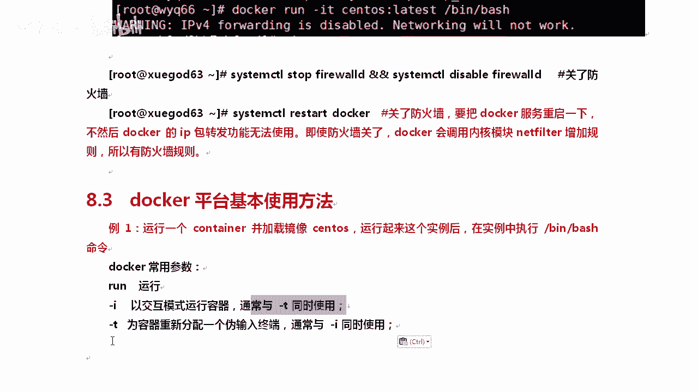
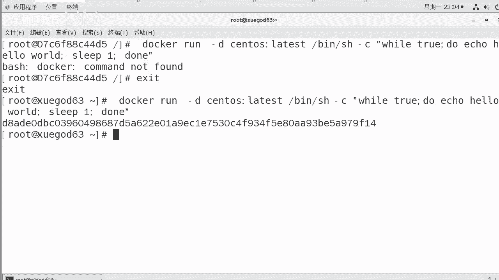
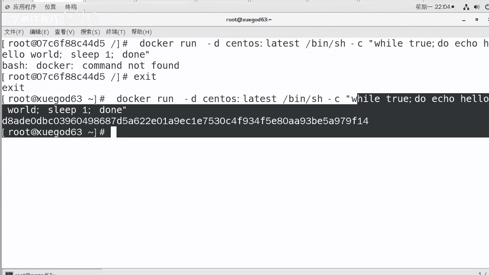
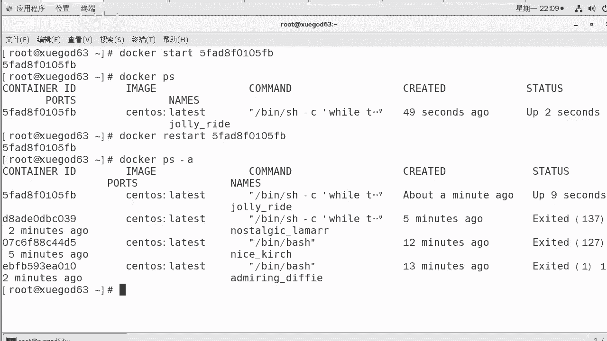
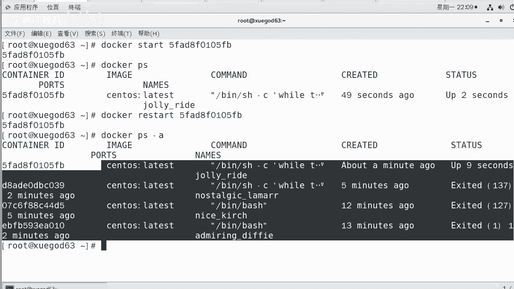
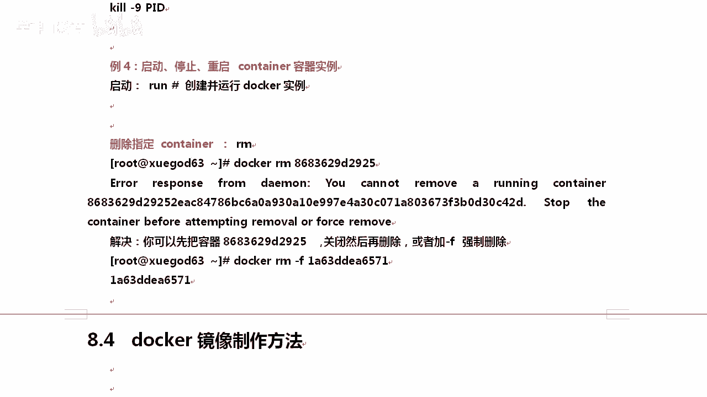

# Linux／Linux运维／Docker／红帽认证／云计算／Linux资料／Linux教程--部署docker容器虚拟化平台 - P3：3-docker平台基本使用方法 - 学神科技 - BV1cD4y1o77V

我们来聊一下docker平台的基本使用方法。啊，其实就是在说docker这个命令，知道了吧？比如说第一个我想运行一个container容器，并加载sS这个镜像运行起来以后呢。

在实例里面去执行bsh这个命令。嗯，那么杠I啊run是运行的意思，docker有很多参数啊。其实接下来我们讲docker就是讲docker的一个命令，这个命令后面可以跟很多的参数。

那么run是运行的意思，I的话是以交互模式运行容器，通常和T一起使用T是什么意思呢？分配一个为终端，通常和I同时使用。

这什么意思？告诉你IT两个参数就不要分加了。知道吧？要用I就跟上T，理解了吧。好，我们来跑一下。运行之前呢docker之前我们从外网下了一个镜像，那拿到这个镜像，我们想运行。

那就是docker run杠IT就可以了。好，后面可以写上这个镜像。调用这个镜像的时候，你可以直接调用镜像ID啊。但是我往上粘个这个，大家好像也不知道它是啥意思。所以一般情况下我们不会粘ID啊。

我们自己敲的时候，我们写上sS。😊，啊，当然有很多的s。所以这个时候我们通过冒号做分割，后面跟上tag标签lattiOK这就可以了。这样后面跟上bsh啊，你也可以写并下的bsh。一样的啊啊。

因为我们我们的什么，我们这个拜事就在冰箱。😡，啊，你可以这样，也可以写回一下车开数122秒钟出来了。这已经不是我们原来的这个机器了。原来叫这个现在已经变成这了。他已经是自己一个独立的。

起来以后就感觉是个一个真实的机器。退出的时候得用EXIT因为你调用的是bash这个程序，你不要比如哎，这是一个，当然这个上网也没有任何问题啊。😡，啊，也没有任何问题。

你感觉就相当于起了一个独立的linux系统一样。😡，退出的时候，这个是不行的。这样是不行的哦，因为我们这里面就不带这些东西。因。清楚了吧。啊，看那个速度感受一下。回车。12。出来了吧。这样的话。

你起一个实力确实要比你在森特S，你比VMV尔上起一个实力快多了。😡，感受到了吧。那么起来以后呢，你可以看一下我默认装的这个版本号是多少。ETC下的red heart release。爽不爽？愤度S8。

1。那已经是8。1了啊，大家可以自己去下一下那个8。1好不好？card card完了以后，EXIT推出就行了。😊，啊，退出就行了。退出完了以后，我们再往下看下一个。嗯，那我这个退出就退出了。

所以我希望在容器里面跑一个长久运行的一个服务啊，比如说我跑一个不断向STD。啊，STD就是标准输出好不，这一块是吧，去。显示hello world啊，OK显示一下这个地方，我要那你用杠D就行。

杠D是在后台运行，杠C是后面跟上待完成的命令。OK。😊，什么意思呢？我把这个命令先粘到这啊，docker run钢地。😡，跟上镜像bsh后面可以加一个杠C参数，可以呃这样后面可以加一串什么呢？

很少大家用bsh后面加杠C这种写法是吧？实际上它后面可以写一段代码，这一段代码就是一个脚本。那我写到一行，大家可能看不懂，我把它分一下好不好？分号可以分割吗？where to循环do do的事是什么呢？

ecle hell world对外输出输出完了以后，sleep一停一秒停一秒完了以后就是当。这个能看得懂吗？就是典型的一个死循环嘛，不停的对外输出。你可以通过封号把它合到一起。😡，OK好。

我们来执行一下，他会不停的向你的这个。😊，啊，标准。让你的哎，稍等啊，我得推出一下，因为我现在还在刀口那边呢。好。echo helllow world，大家有有印象吗？

就不停的向你这个屏幕屏幕上去输出hello worldhellow world。但是实际上你看他已经在后台跑了，它会弹出一个哈希值啊，弹出这个哈希值，你可以理解成是容器的ID就像进程有进程号一样。😡。

容器也有自己的。OK但是你看不到是吧，你怎么知道他真的输出了呢？😡。

这个时候我们需要从日志里面去读。

知道吧？因为他没有terminal终端，所以在这个时候我们需要做这个事。从容器中去读取日志，好吧，查看输出的内容，用于后期检查docker实例，在标准输出中弹出的错误信息。

语法docker logs日志跟上容器的name或者ID好，我们这个跟上。跟这个ID就行，跟这个ID需要全部复制上吗？😡，不用，只要唯一就行。你看我就随便我就取4位，其实这也可可以的。好吧。

你就取5位也是可以的。OK那名字在哪呢？你可以刀口PS。刀cker相当于是一个进程。刀ckerPS以后，在这里name这一些它会随机起一个名字啊，但这个名字可以你自己定义啊自己定制。OK。好。

这样我们就起来了起来你也能看到。最重要的是我们也能看看到这个输出啊。你后面也可以跟这个名字啊，也可以跟这个ID两种方式都行。dockerPS列出所有运行中的那退出的呢。退出的是看不到的。好不好？

所以说docker还是比较好学的PS你会吧？😡，显S杠UAX。都知道是吧，查看所有的对，我们刀cker也可以刀erPS杠AA的话，就不是没有运行的，也能给你找到。啊，OK好。😊，好吧，这里面有几个嗯。

这样的话大家看着还是不舒服啊，看这。😊，sus是状态，这是up，还有这个是退出的。前面我跑到这两个已经退出了。嗯，他已经退出了。我想干掉一个呢。我想杀掉那个我要把那个进程，你不是跑着呢？杀掉是吧。

comman。😡，counttenID看到了吧？我想杀掉这个。会吗？其实就是在我原有的命令前面相当于加了个docker。我提示一下你。我想杀死一个容器，比如说杀死一个正在后台跑的容器。查看ID以后。

我们上次进程是不是Q杠9，然后跟上PID。我们那个也一样，只不过我们这个不需要杠9了。😡，啊，你就直接刀口。Q就行，所以命令呢也很好记。放这。这样就Q掉了。Q完了以后呢，你带刀ckerPS看一下。

到会PS看一下，他也退出了3秒前退出的。好不好？OK。那么还有一就是比如说我想有些退出的，我想再把它给启动起来。怎么办？对吧刚才退出了那么多，我想把它给启一下，那你可以启动停止重启。好吧。

刀cker rush创建并运行。清楚了吧，启动是启动已经停止的那些。OK。那我们先来起一下啊，比如说我们先给大家简单的运行一个再。OKdocker run杠 dis跟上镜像，然后呢。

bsh batch后面起一个。这样的话他肯定跑起来了，跑起来，我现在想把它给关了，那你可以这样，docker，就我不想Q掉它是吧？

刚才我们是Q掉它dockerPS我们看到了这个进程正在跑啊那他的PID是这个，我可以把它给stop一下。😡，就像我们的虚拟机一样，也可以stop是吧？也可以删掉，这样给他stop掉。稍等等他啊。

stop完了以后，我们再看一下。行不行？好，stop stop完了EPS你看你就看不到了，看不到了。那我想把它再起来呢，那当然你把它改成start。😊，这样他就有起来了。好，就像一个虚拟机一样。啊。

你也可以re一下。😡，前提是你已经 run过了啊。如果你不存在，那就不行了。好，这就是它的启动。那我想删除呢？嗯，你要知道没在后台跑的那几个。好不好，你想删除呢？刀坎。对。刀口PS杠A。

这些东西都占着我们的空间的，我想给它干掉，就像我们的虚拟机一样，我们的虚拟机是吧虽然把它停了，但是它也一样占我的空间。有一天我想把它给删掉。😡。

想一想。删除文件怎么删的？是RM删除刀cker也是这样。刀口后面跟上。就行了，假如说我跟上这个PID，那你就跟上他就行了。😡，是不是？删了吗？删的时候报了一个小错是L。😡，你知道是怎么解决吗？

以大家现在的这个水平，其实你是能解决的。😡，知道了吧？你报错了以后，你别慌了，老师给我解决下这个问题，我报错了，你自己连问题都没看懂。😡，那你这样的话就不可能有进步的空间。因为工作中总有你不会的地方。

总有你学习上没有遇到过的东西，对吧？每个人的业务还不一样的，很简单，先看懂一下ar response返回一个错误，说什么呢？说你不能移除啊呃什么呢？a runningning containerer。

你不能移除一个正在运行中的coner啊，那那O啊，那这后面这个这就是con的 ID啊，stop啊，你把它stop一下就行了或者。😡，foralce remove强制干掉了。😡，你删文件的时候。

是不是也经常加这个呀？是不是也经常加LF，我们这个也可以。刀erMM。F。F后面跟上我们的PID就行了。这样我就强制干掉他。真干掉了吗？那你可以刀会PS看一下，没了吧。😡，啊，当然这个你不仅这没了。

你从这里看也没了啊，现在的话是3个。啊，三个实际上应该是4个。知道了吧，我们当前是吧，这里面已经看。看这样去看时间就行，一共只有3个，实际上我已经创建了4个。就要删除。会来吧。启动它还有RM删除啊。

你正常你可以把它关了或者加F强制干掉它。这就可以了，这是他一个小小的基本操作。后期还有更多的刀cker命令啊。

那么稍后我们聊一下do卡的镜像。