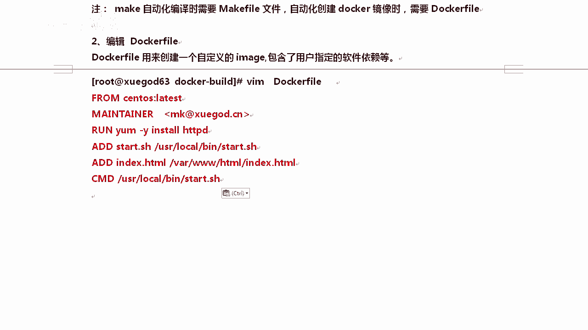
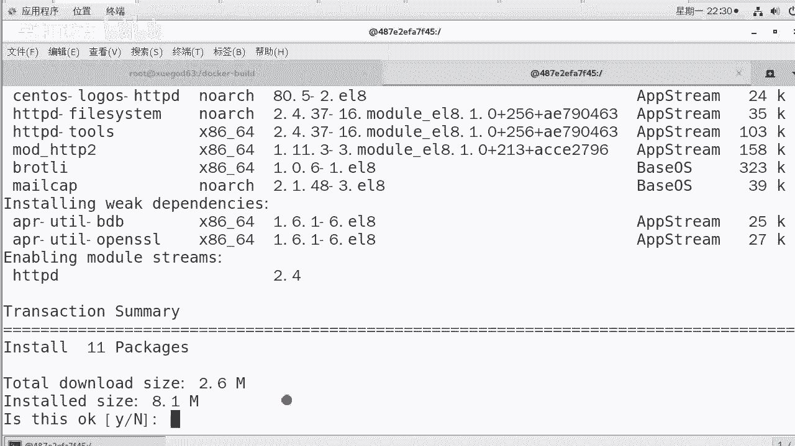

# Linux／Linux运维／Docker／红帽认证／云计算／Linux资料／Linux教程--部署docker容器虚拟化平台 - P4：4-docker镜像制作和发布方法 - 学神科技 - BV1cD4y1o77V

我们来聊一下这个啊叫docker commit，好吧？docker commit和docker built这两种方式可以制作docker的镜像。哦。

我们来看第一种docker commit这种方式是比较简单的。一般情况下，后期我们会以更多的使用docker built即使用docker feel的方式去啊。自动化制作这个镜像。好。

我们来了解一下dockercom啊，创建一个安装好了阿帕奇的web服务器的镜像。就是我想在里面装上自己的服务。那这个时候怎么办呢？我们来做一下这个操作。他是这样的啊，刀口 run杠IT。啊。

salS你可以写lati也可以不写啊，因为我当前只有一个stoS镜像。肯定启的是他启动完了以后，比如说我们在这里样instore是吧？假如你你安装一下啊。这样的话，我可以安装一个阿帕奇。

对吧只是基于松通S8下的。安装一个阿玛强，安装完了以后，你给他退出一下。就行了。好，这边先让他安装着。安装完了以后呢，docker commit怎么做？他是这样的。可以根据容器当前的状态做一个镜像。

比如说我创建一个安装了阿帕奇工具的一个sS镜像，做的时候就是docker commitit，后面跟上container容器的ID，再跟上新的image name就可以了，明白了吗？

container ID新的image name。这就可以了，跟上容器达D跟上。

Oh。你可以开着，也可以关着啊。你看但是这个已经说什么fe当的失败了，是吧？😡，重新再下一层就行。啊，重新再下一下就行了。好。我们。让他慢慢去下着啊，但是这样有点慢啊，我就不等了。

其实你看到他已经正常在走了啊，我我干脆怎么样呢？我创建个东西，你看啊OPT下，我在OPT下悄悄的什么创建1个touchOPT下创建个HTTPD点。😡。

12娇问。好不好？然后呢，我退出，我就可以基于什么，基于这个镜像去创建了。知道了吧，你看dockerPS我们当前这个如果你退出了，你就用这个。啊。这9秒钟刚退出的PID是这个con IDD是这个。

那我就可以这样去做这个事。dockercom好吧，跟上这个跟上它以后呢，我去起一个s，我也叫s。那这次我叫阿帕奇，代表我这上面是安装了阿帕奇的那这就起火了。对do images。他就会多出来一个镜像。

原来叫拉提斯的，这是你的镜像，这是我的镜像。那基于这个我的镜像，你看我比你多了一些东西，因为我。😡，呃，安装的时候安装了一半是吧，我我给终结了。好，那我可以基于我这个来搞一个吗？也可以。

docker run杠I我就有我的镜像啊，sal s你看这个时候就就很有必要是吧？把t写上去了。如果不写的话，默认还是蓝的。啊，我基于这个。镜像来起一下，比如说我们起一下一个blash。

是怎么证明这是我的镜像呢？我去OPT下看一下。你看是由误。当时安装的这些东西。或者创建的文件。如果你执行完了的话，你可以RPM杠QA，你去查一下HTTPD啊，能找到就是没有问题。因为我们没有没有安装。

所以没有找到。但是你从这你已经能看得出来了。这就说明我们可以。

可以怎么样？我们可以基于一个docker实力去创建一个镜像了。好吧，但这种镜像。不太好，比如说你这个东西至少阿帕奇没有开机启动吧。😡，对吧我还得在每次镜像起来以后，再手动起一下。显然这个是不好的。

对不对？对，显然它是不好的。所以呢我们希望通过第二种方法，docker build去创建一个基于s s的HDDP的 webb镜像。这次就要开机启动了啊，使用docker field去创建啊。

使用docker build创建镜像时，你需要有一个docker feel。啊，需要这样个文件来执行镜像docker feel呢有点像原码编译时产生的make feel。

我们是不是有了make feel才能make？

对我们有了docker feel才能进行build构建。好，那说这个有什么用呢？我我给你来个说。😡，就是为什么要创建刀号镜像？😡，我跟你聊一个问题啊，以前你们装web服务器，先装系统，再装外部。😡，啊。

在装浪环境20分钟吧。如果实间啊我们实战中有个场景，我说你两秒钟给我搭1个外服务器。你是不是就懵了？是不是？如果我们公司要求今天新开20个游戏服务器，200台啊，200个服务2分钟搞定。能搞定吗？

会不会？啊。对，这个确实是不好弄。那这个时候怎么办呢？我们可以提前生成web服务器的刀cker镜像。到那个时候我们直接加载就行。这样12两秒钟就起来一个实力，咱们就OK了。好不好？

所以呢这个时候我们来做一下啊，那么创建docker feel这个操作还是很轻松的。我们来看一下EXI退出。

退出以后MK好，DIR就行了。MKDRR我们去创建一下do口 build。我们可以创建一下docker build，就是创建了一个空文件来跟一下啊，其他目录像也是可以的。

CD到这下面CD到这下面VIM我们去。写一下这个docker view。好不好？等会费。打开里边写什么内容呢？嗯，就写你要干的活就行，我先把它粘到这。好不好，那每一行保存推出它代表的含义是什么？

我们来看一下啊。

好，我们可以创建一下这个dcker file。OK创建一个do，然后呢，dog是用来自定义image的啊VM打开dog那么这里面什么意思呢？from我是基于哪一个镜像来创建我的镜像的。

你必须得有这个镜像啊，这个镜像，作者是谁？run是run后面是run啊，这个代表后后面跟上你要执行的命令I是代表是添加的意思，我可以将本地的一个文件添加到我们。

镜像里面docker镜像里啊，将star的启动脚本填进去，将index的首页是吧，放到默认的这个页面里，你还有copy命令。啊，我只是测了一个页面，你也可以将你们网站网站的代码直接部署到3WHTM下面。

😡，这样的话，镜像一旦起来，你们的网站就OK了。是CMD这个是最后运行的。清楚了吗？

好，当然每个注释其实我也给大家写了啊，at是。将语文件拷到新产生镜像的文件系统对应的路径上。所有拷贝到新镜像好不好，权限是0755，这个权限正常。CMD呢这个是说当docker启动成功以后会怎么样？

实力起来以后，服务怎么起来呀？那这个时候会执行CMD后面的命令，所以CMD后面一般会跟一个开机启动的脚本或者服务。你希望你的服务可以开机启动，或者说随着docker启动而启动。

就要加1个CMD这个东西是必会的啊。啊，而且里边只能有一条，有多条，我也只只行最后一条。好，那么这就OK了，创建start和默认的index页面吧。哎。

在这下面好不好？我们去创建创建阿帕奇启动脚本大会盟。😡，有同说我们原码编译的时候执行过阿8G启动脚本，那个不行。好吧，那个太复杂了，知道吧？你你那个过程太复杂。

我们这个地方只需要这一条命令进行HTTP后面跟上这个参数。😡，就可以让我们的阿帕奇RPM包安装的啊开机启动。有这个就够了。😡，好吧，然后完事以后给他加个可执行的权限。

后面我们就可以调用这个把阿帕奇给清起来。其实阿帕奇每一次阿RP安包安装的，后面都会带一个这个参数，就大体上这个参数你可以理解成它是。

他是什么意思呢？在这里。好吧，这是官方的给的一个参数，就是six teamD，然后注册st teamD用的一个参数。啊，实际上我们系统里并没有CTMD这个服务。啊，我们加上这个参数。

那就干脆干脆给他加上。因为一般情况下，我们阿帕自启动的时候都带着这个参数的。好不好？好嗯，再就是创建index页面。

这个页面很简单啊，我们创建一个测试页就行。也可以使用copy的方式。docker feel这个文件你想怎么写都行，甚至它就跟一门开发语言一样，甚至在里面写点寻呃，很复杂的，其他的操作都是可以的。好不。

等大家真正的用的时候，你你去具体查一查docker feel里边的那写项就行，这些已经基本上够难实。😡，啊，这是创建了一个普通页面，也就是到现在我三个文件准备成功。准备成功，我们就可以刀口buil了。

来。Docker。等号 buildil啊可以按 table补齐啊。如果你不会写这个build。😡，杠TT是代表t标签的意思。

好，我把这个先给大家写到这吧，是。

我们创建完index以后，docker build创建新的镜像语法是docker build杠T后面跟上附镜像的名字，还有镜像的什么？看个标签，再就是docker feel文件所在的路径啊。

所以后面你一般加个这个标签就行。比如说我们使用docker build创建一个新的镜像，命名为somHTPD。

看到啊。doker build杠T我们叫做松头S。ADDPD啊来。s透SHTGB当前目录下有docker，所以我们就直接写当前目录只有回去了，它就能自动搞定了。step第一个是吧。

我是基于原有的s透S镜镜像来做的，它会启一个其实它会启动一个实例的啊，它会启动一个新的实例。其实。

我们可以看一下啊。因为我正常情况下，我的刀口。你看。其实他会启动一个新的实力来自己去做这个事。你看现在我正在运行do口 run，正在安装HTTP。正在安装正在执行第三个步骤。

啊，他会基于我们原有的这个镜像起一个实例，起完这个实例以后去在这个实例里面，你也你也能看到啊，就是刀考样目嘛，在这个实例里面去执行对应的样目。执行完了以后，他会把这个实例推出。然后呢。

基于这个实例再做出来一个。

什么就跟doercom一样，基于你这个实力安装好阿帕奇的这个实力，再做出来一个镜像。

好，我们等等他啊，让他呃执行着。因为样么安装的这一块稍微慢一点啊，等等他。

好，我们接着往下继续啊。那么如果你碰到了这种情况下，说哎下的时候下不下来，下不下来怎么办呢？其实其实是这样的啊，比如说我现在自己起了一个刀口，我们去安装的时候。

假如说我们样么insstoreLRZSZ这个包我们安装的时候是没有任何问题的。😊。

好，你可以看到nothing to do是吧？我这个包是已经安装上了。

那么呃阿帕奇的话，我们也可以尝试一下，你可以手动试一下啊，就是主要是你的网络。你看我现在已经找到包了是吧，总共下载2。6兆B嘛，是吧？有一些医赖包下的是阿帕奇2。4，他问你要不要下。

那这个时候肯定是要下，但是下的时候有时候有可能你这个没有速度，你看我这一次就很顺利的荡下来了。😡。

啊，有时候是吧他就荡不下来，因为你走的是外网这个园。😡。

可能C样，这种情况下你你怎么样，你退出重试一下就行了。我把这也个退出一下。对你就再再次再重新执行一次就行，没事。好不好？多尝试两次。

直到他安装成功就行。来。那么在安装的过程中，他会把6个步骤都执行完，只是在安装这一块的时候会慢一点。然后安装完，如果安装完了，安装完了会执行第四个步骤，将star调到这儿，然后再加index调到这儿。

最后呢，你的镜像就构建成功了。我们再次查看的时候，你就能看到。好，你就能看到stoSHDDP这个镜像了。

好不好？这一边你看这一次。当然他啊。让他速度看一下他的速度。你就可以给他下下来。😡，好，这一块大家就多尝试几次好吧，多尝试几次啊。你看这个地方y杠外因s道是吧？HDTPD这个没有问题啊。啊。

主要是网络的问题，多尝试两次就可以了，肯定是能荡下来的，毫无疑问啊。

因为我在这儿第一次就是就是网络的问题啊。你看我在荡的时候。😡。

是吧上次档的时候就没有当下来。

啊，就没有荡下来，但是下次再荡的时候就荡下来了。你看这一次。

好吧，这一次你看就开始正式下来就能荡下来啊。

好，这没事啊，肯定能起来。起来以后呢，这个怎么发布呢？😊，加这事对吧。好吧，C image发布这个方式，你有两种方式，一种是C是吗？C two。还有一种是push到do hub上，我们来s一下啊。

就是s you two。

C image to他包意思就是将好不好？docker save保存将高高是导出来的镜像的名字，然后跟上本地镜像的标签。交了吧。OK你可以尝试这样去做一下，这样会把呃某个镜像给你保存下来。

比如说我想将当前的一个镜像给保留下来也是可以的。

多少er。Emails。好，那比如说我想将谁呢？我比如说我保出来这一个叫docker sHTTP好吧，我想将这个阿帕奇这个镜像保留出来，保存到本地可以吗？可以。我本来想保存HDDP的。我就不等他了啊。

这样的话，他会存到本地。稍到呢。稍等一下啊，他正在往硬盘里写。好，那等了一会儿你可以看到这个已经下下来。那你可以将这个dockerS这个镜像是吧导导出或者导入都行。知道吧？你可以把它存到什么。

存到本地啊。好，本地这不已经有这个镜像了吗？你可以给它存到本地。你可以把它存到什么，存到物理机上。也是没有问题的。好，我把它删一下啊。IM。刀口给他删掉了。删了以后，假如说我已经是吧传到了我本地。

比如说呃在这里是吧，我已经扔到我。扔到什么，扔扔给别人了，别人是吧，希望导入到他自己的平台上，那也可以的那我们可以把这个假如说那是我传到本。传到本地的一个，你可以把那个镜像怎么样？

刚才刀口 save那个镜像再拉上。传上了传给别人。这样的就像我们本地安装一个软件包一样，这个速度呢也是比较快的。好不好？等等好，他在上传的过程中，我们再聊聊。

聊聊这个镜像的一个操作啊。如果我想导入本地的镜像，假如说我本地已经有一些镜像了，你想删除你docker里的镜像，那就是docker rMIdocker IM是删除已经正在运行的实例。I的话是删除镜像。

好吧，docker image可以发发现镜像，你可以删删完以后导入的时候是docker load，这样就可以导入成功了。😡。

哦，我看我这边查完了没有没有。

好，那这个清楚了，还有一种就是发布了。

看这第二种方法，你就不存到本地的，我存到docker half上。那这个步骤大概就是这样的，先注册账号，注册完了以后，docker log in杠U跟上你的用户名，跟上你的密码，跟上你的邮箱。

这样就可以登录到do half上登上去以后，你可以docker pushushS就可以直接传金像了啊下的是doS。这个流程大家知道一下，但一般情况下我们不会讲这个，我们会讲什么呢？

我们会讲使用阿里云的私有仓库来发布你的镜像。

好不好？能讲，因为这个更实用一些，国外的那个你速度太慢，你根本用不了过程也一样，注册的阿里云的账号。😡，是吧登录上去登录上去，然后进行上传和下载就可以了。好不好？流程是一样的啊。

好，这边已经传上去了，传上去，我关了它。

来个本地导入啊。Docker。漏的。杠A。达考送 noOS。给他导一下啊。导到你本地啊，这比你在线取下载快多了。为什么我非要导入这个镜像呢？因为这个镜像可以开机启动阿帕奇。😡。

我刚才不是呃手动生成的没生成成功吗？啊，因为网络的问题。好。这样的话就可以整个导入到平台了啊，一会儿我们去聊聊端口映射啊。那这样的话就整个导入导这里面了，导入完了以后。

你可以docker images看一下。啊，我们这个镜像已经出来了。啊，清楚了吧。HDDP啊可以给你。改了一下。好，稍后我们聊一下端口音射。

那这是镜像的制作和发布。