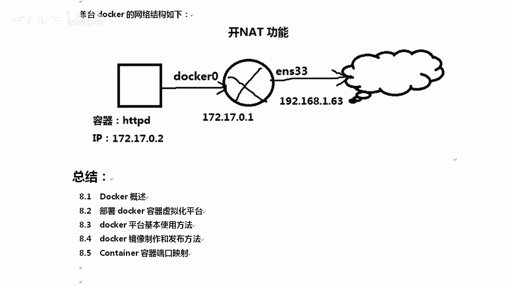

# Linux／Linux运维／Docker／红帽认证／云计算／Linux资料／Linux教程--部署docker容器虚拟化平台 - P5：5-Container容器端口映射 - 学神科技 - BV1cD4y1o77V

那我们聊一下端口映射，有同学说你起完这个以后，我怎么访问到呢？所以这个时候需要用个端口映射呃，你可以把I tables清空一下，清空再重启。其实我不用清空啊，因为我已经重启。重启过了。很简单。

docker run还是运行杠D后台杠P杠P端口音射8080，跟上你的stoS镜像就行了。OKP的话，前面是物理机的80，后面是容器的80，就是把容器的80映射到物理机的80上。那有同学说老师。

我一台机器只有1个80，我要印射两个，那个时候怎么办？对，那个时候我们可以给docker起一个公网的IP。因为你因为现在docker的IP是172的网段，并不是就相当于我们NAT的那种模式。

刀考现在的网络模式就相当于虚拟机的NAT清楚了吧？杠P所以要做这种端口映射，才能直接去访问到sSHTTPD回车就行了。OK。😊，回完车以后，刀卡PS可以看一下，这里有一个端口音射啊。好吧。

而且nt state去看你物理机上，你物理机上会有1个80端口的。

这个80端口listen监听的是谁呢？是docker proxy，他会有个代理。

交了吧。

我们去访问一下。

访问1。63。可以访问成功。啊，可以访问成功。那么能访问成功了以后。

这样的话，端口映射就OK了。好吧，但是呢大家要知道啊，就是现在你你所用的这个。😡。

它相当于是VM桥接的方啊，net模式啊，现在docker实力运行的网络模式就像VM night VMware的n模式啊，后期我会给大家讲docker配置静态IP就像桥接的模式。😡。

啊，当多个端口映射的时候，你可以使用K8S负载的方式。就相那LVS1样，大家都可以访问是吗？访问。D二分发器上的80，然后分给后面的。

失力。OK你也可以做成调节的方式，直接访。那我们可以看看啊，正在运行这个你想访问正在运行的docker，那就是dockerEXE好，EXECIT后面跟上容器的ID和name跟着b就行了。我就能进去了。

我进去可以给你看一下它的I好不好？😊。

dockerESI这是刚才运行的这个ID号，拿到它跟上bash。

这我就能进到docker里边了啊，你可以CD的挖一下3WHM可以看一下，好吧，比如说我们acle AA往里追加一下，当然一般不会这样去操作啊。改完以后呢，你可以看一下刷新。是不是有AA。好。

而且我的IP是多少呢？你想知道吗？😡，IP可以这样IPADDR有多少衣服vi。对不起，没有，你连 a table好，他没有义付con一个命令。😡，你得MPAADDR用这个命令。你大你能看到ETH0。

它的IP是172170。2。他跟谁调解到一起了，知道吗？😡。

你如果安装完刀口以后，本地会有一个。

什么看哪。

本地会多出来1个B20。他走B2啊刀坎零他走刀口零这个桥。通过他来做NATT转发。

啊，就相当于路由器的一个接口一样。我们都走都扔给什么，1720。0。172170。2的所有数据都扔给他。然后他再通过防火墙的。

NT转换功能出去。好不好？

就是这样一个情况。

容器0。2扔给D20docker0啊，然后呢，他开启路由转换功能，通过1。63出去。你也可以后期用调接的方式。

OK。这是今天讲的内容，我们讲了docker的概述啊，容器基本的使用方法，镜像和端口音射。后期还有更多精彩这个内容，好不好？希望大家是吧能够回去多练习一下。其实刀坎并不是很难啊。加油。

