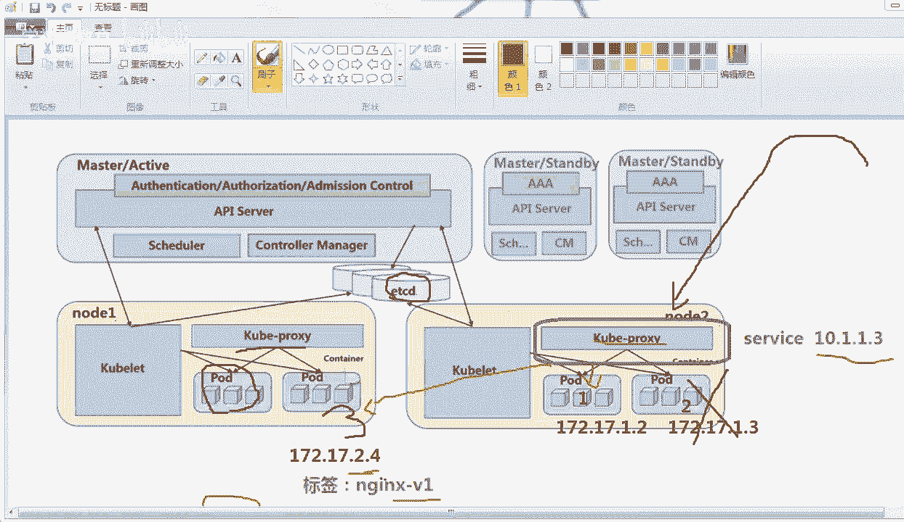
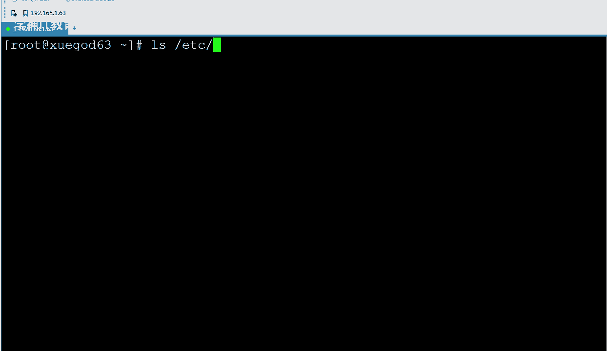
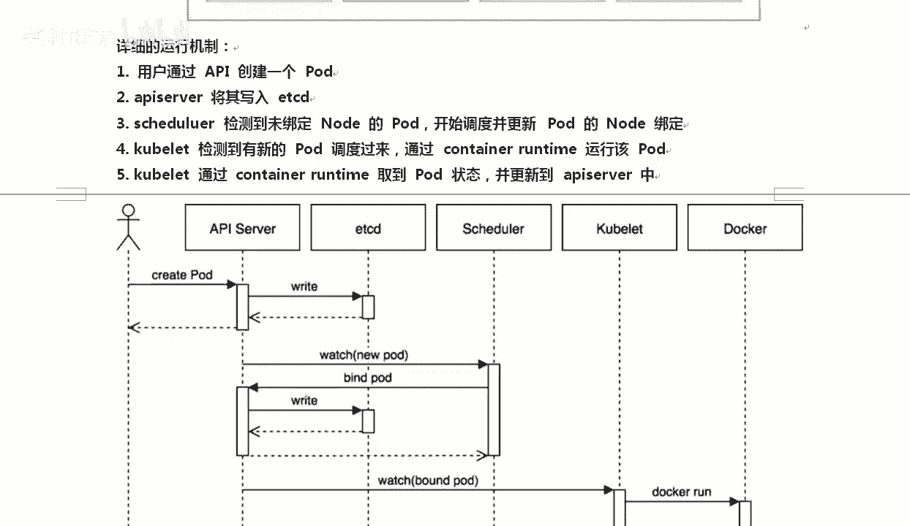

# Kubernetes入门：1：Kubernetes简介 🚀

在本节课中，我们将要学习Kubernetes（简称K8S）的基本概念、核心组件及其工作原理。Kubernetes是一个强大的容器集群管理系统，能够自动化应用的部署、扩展和管理。通过本节课的学习，您将对K8S的架构有一个清晰的认识。

## 什么是Kubernetes？

Kubernetes是谷歌开源的容器集群管理系统。它基于Docker构建，提供了一套完整的容器调度服务。Kubernetes能够管理大规模的容器集群，实现资源的调度、负载均衡、服务发现、动态扩展和收缩等功能。其官方网站是 `https://kubernetes.io`，该网站提供了中文版本。

## Kubernetes核心架构

上一节我们介绍了Kubernetes的基本定义，本节中我们来看看它的核心架构。Kubernetes集群主要由控制节点（Master）和工作节点（Node）组成。

### Master节点

Master节点是Kubernetes集群的控制中心，负责整个集群的管理和控制。它包含以下几个核心组件：

以下是Master节点的主要组件列表：
*   **API Server**：提供HTTP RESTful API，是集群内所有组件通信和用户命令处理的入口。
*   **Controller Manager**：负责集群中所有资源对象（如Pod、Service）的自动化控制中心。
*   **Scheduler**：负责将Pod调度到合适的Node节点上运行。
*   **etcd**：一个分布式的键值存储数据库，用于保存整个集群的配置数据和状态信息。其数据模型类似于 `key: value` 对。

### Node节点

Node节点是Kubernetes集群中真正运行工作负载的机器。每个Node节点上运行着以下关键组件：

以下是Node节点的主要组件列表：
*   **kubelet**：负责与Master节点通信，并管理本节点上Pod的生命周期，如创建、启动和监控。
*   **kube-proxy**：负责实现Service的网络通信和负载均衡功能，可以看作是一个网络代理和负载均衡器。
*   **容器运行时**：如Docker，负责运行容器。

## 核心概念详解

了解了Master和Node的组成后，我们来看看Kubernetes中几个最重要的抽象概念。

### Pod

Pod是Kubernetes中最小的可部署和管理的单元。一个Pod可以包含一个或多个紧密关联的容器，这些容器共享网络和存储资源。Pod可以被视为一个应用的特定实例。

### ReplicaSet 与 Deployment

ReplicaSet用于确保指定数量的Pod副本始终处于运行状态。例如，定义 `replicas: 3` 意味着Kubernetes会始终维持3个相同的Pod实例。

Deployment是更高一层的抽象，它管理ReplicaSet，并提供了对Pod的声明式更新、回滚等功能。当某个Pod失效时，Deployment会自动创建新的Pod来替换，确保服务的可用性。

### Service

由于Pod的IP地址不是固定的，Service被引入作为服务的稳定访问入口。Service通过 **Label Selector** 与后端的Pod副本关联。客户端只需访问Service的固定地址，Service会通过kube-proxy将流量负载均衡到后端的多个Pod上。

## Kubernetes工作流程

最后，我们通过一个创建Pod的例子，来理解Kubernetes内部各组件是如何协同工作的。

以下是创建一个Pod的典型工作流程：
1.  用户通过`kubectl`命令或API向API Server发起创建Pod的请求。
2.  API Server将Pod的配置信息写入etcd数据库。
3.  Scheduler检测到有一个未调度的Pod，根据算法选择一台合适的Node节点，并将绑定信息更新到etcd。
4.  目标Node节点上的kubelet监听到有新的Pod需要创建，它调用容器运行时（如Docker）拉取镜像并启动容器。
5.  kubelet将Pod的状态报告给API Server，API Server再次将状态写入etcd。

通过这个流程，Kubernetes完成了从用户指令到容器运行的整个自动化过程。

---

本节课中我们一起学习了Kubernetes的基本概念、Master/Node架构、核心组件（如Pod、Deployment、Service）的作用以及集群的大致工作流程。理解这些基础是后续进行实践操作的关键。在接下来的课程中，我们将动手使用kubeadm工具搭建一个K8S集群。