# Docker容器管理：1：容器命名与资源配额控制

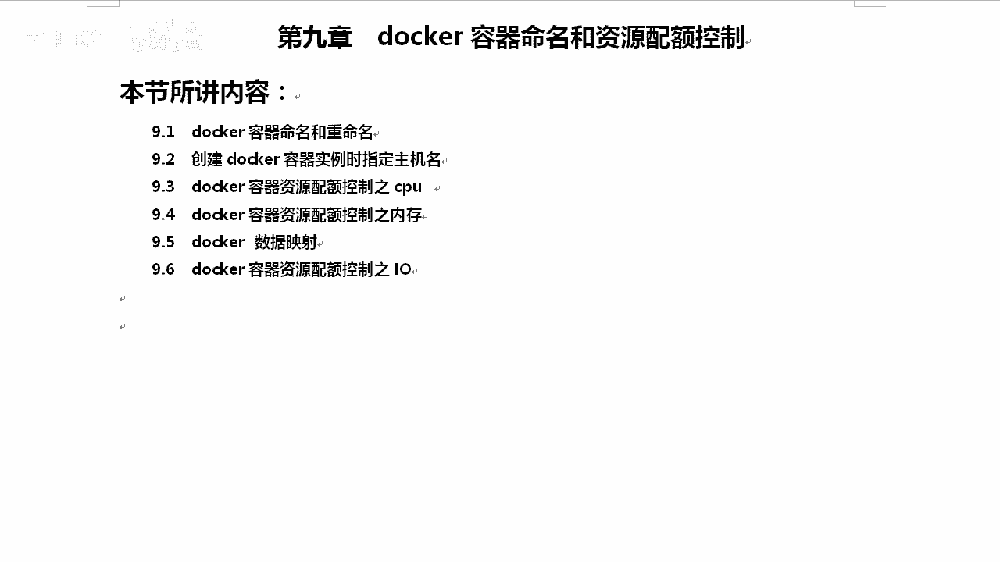

在本节课中，我们将学习Docker容器的命名、重命名以及如何设置容器的重启策略。这些是管理Docker容器的基础操作，对于后续的资源控制和运维工作至关重要。

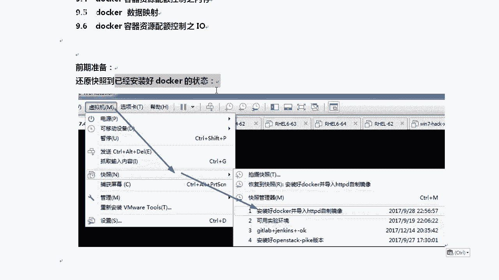

## 容器命名与重命名

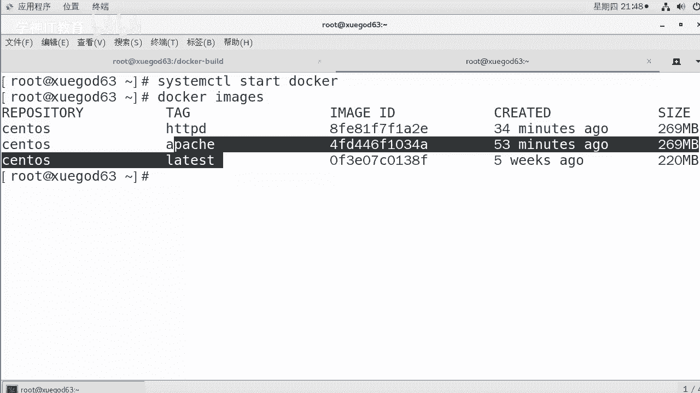

上一节我们介绍了Docker的基本概念，本节中我们来看看如何为容器指定一个易于识别的名称，而不是使用系统自动生成的随机ID。

创建容器时，可以使用 `--name` 参数为其指定一个自定义名称。其基本命令格式如下：

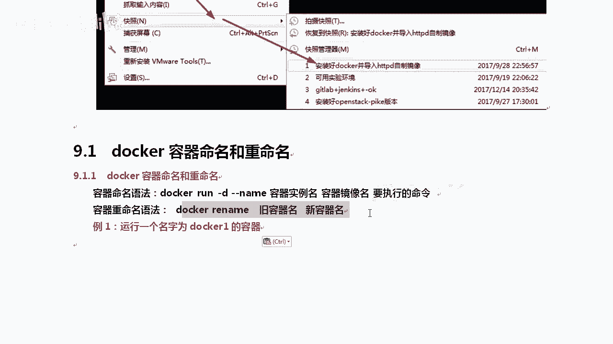

```bash
docker run -d --name <容器名称> <镜像名称> <要执行的命令>
```

例如，要以后台模式运行一个名为 `docker1` 的容器，可以使用：

```bash
docker run -d --name docker1 centos bash
```

运行后，使用 `docker ps` 命令可以清晰地看到容器的名称。

如果需要对已存在的容器进行重命名，可以使用 `docker rename` 命令。其语法是：

```bash
docker rename <旧容器名称> <新容器名称>
```

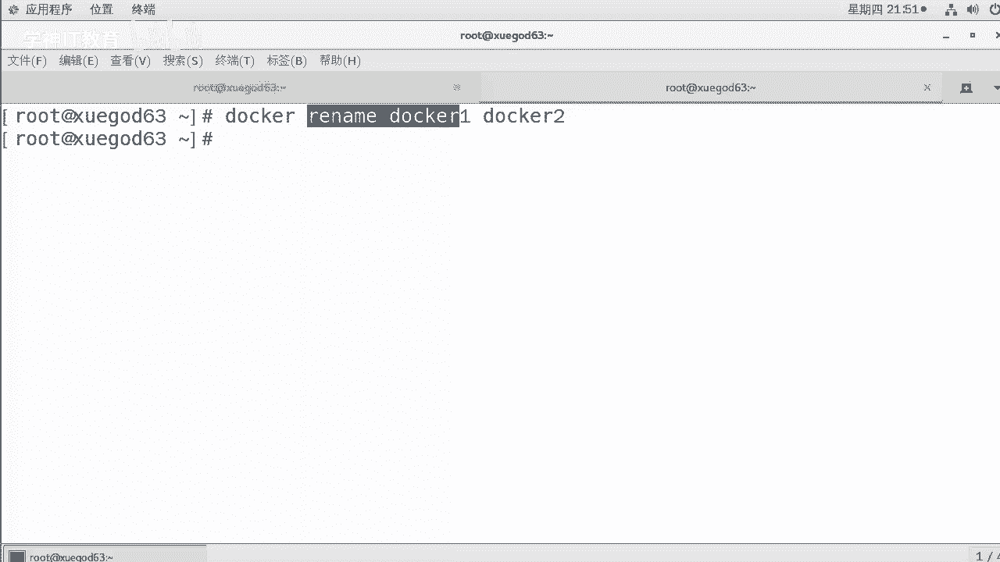

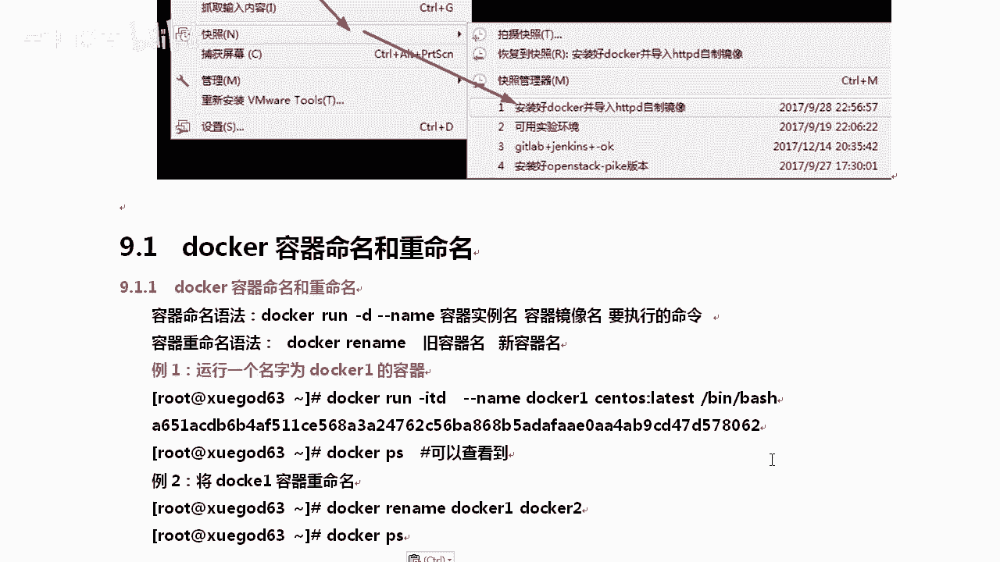

例如，将容器 `docker1` 重命名为 `docker2`：

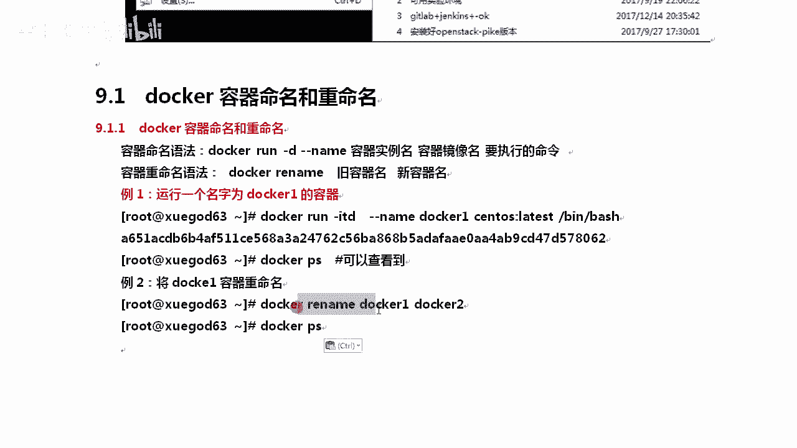

```bash
docker rename docker1 docker2
```

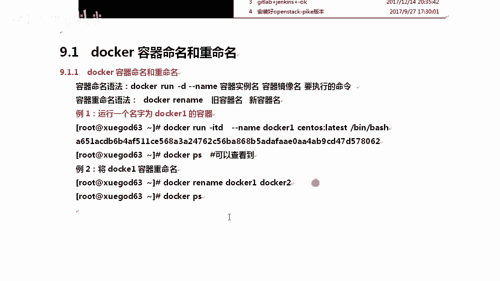

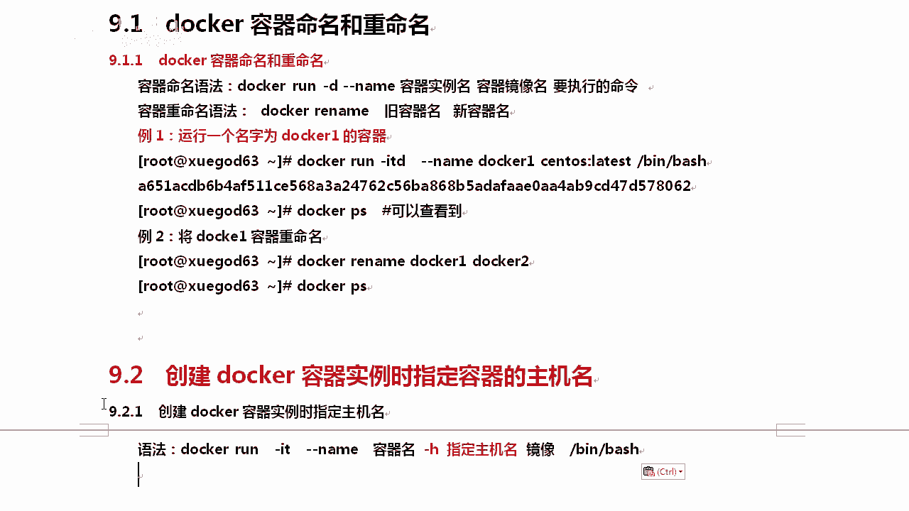

## 指定容器主机名

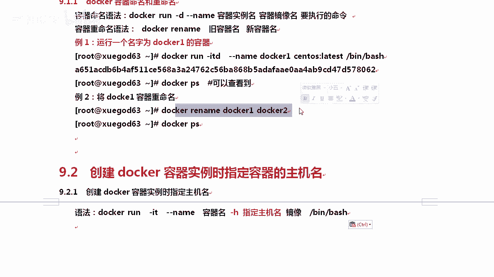

除了容器实例名，我们还可以在创建容器时指定其内部的主机名（hostname），这有助于在容器内部进行网络识别和管理。

使用 `-h` 或 `--hostname` 参数可以指定容器的主机名。命令格式如下：

```bash
docker run -it --name <容器名称> -h <主机名> <镜像名称> bash
```

例如，创建一个名为 `docker3`、主机名为 `docker63` 的容器：

```bash
docker run -it --name docker3 -h docker63 centos bash
```

创建成功后，进入容器执行 `hostname` 命令，即可看到主机名已被设置为 `docker63`。

## 容器重启策略

在实际运维中，我们通常希望某些关键容器在退出或宿主机重启后能够自动启动。Docker提供了灵活的重启策略来控制这一行为。

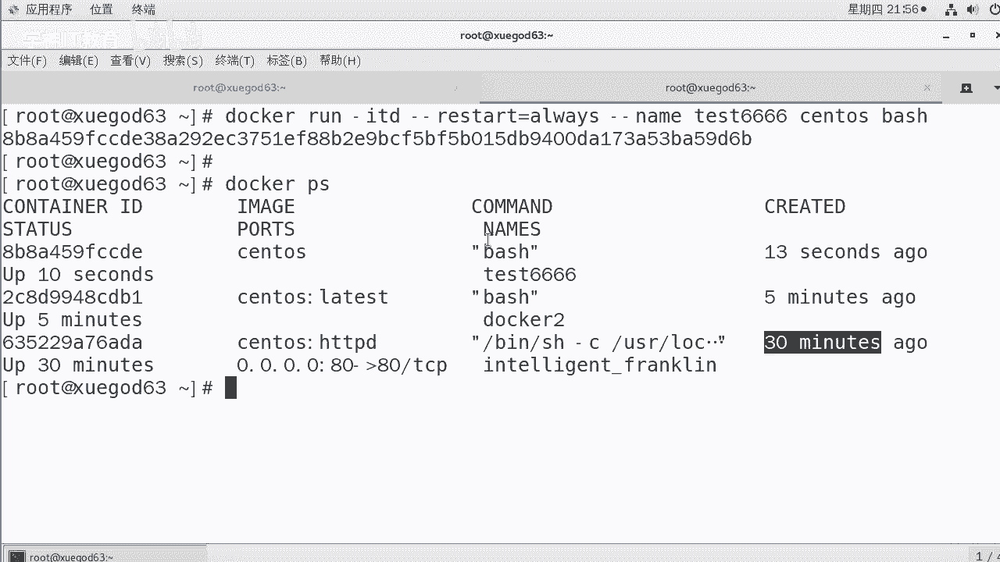

在创建容器时，通过 `--restart` 参数可以设置重启策略。以下是可用的策略选项：

*   **no**：默认策略。容器退出后不自动重启。
*   **on-failure**：仅在容器非正常退出（退出状态码非0）时重启。
*   **on-failure:3**：容器非正常退出时，最多尝试重启3次。
*   **always**：无论容器因何原因退出，总是尝试重启容器。
*   **unless-stopped**：总是重启容器，除非是用户手动执行 `docker stop` 命令停止了它。

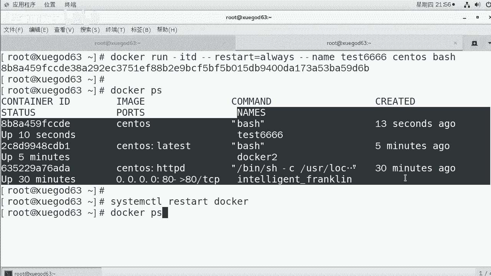

例如，创建一个总是自动重启的容器：

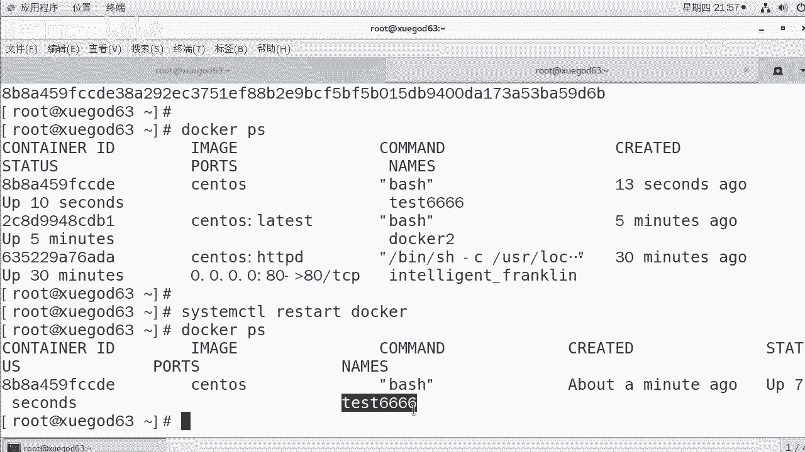

```bash
docker run -itd --restart=always --name test666 centos bash
```

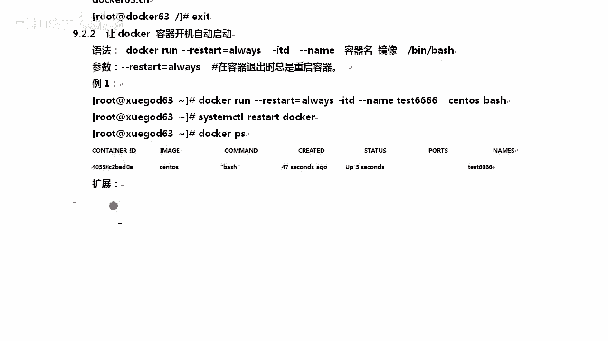

为了验证效果，可以重启Docker服务，然后使用 `docker ps` 检查 `test666` 容器是否依然在运行。

## 更新容器重启策略

对于已经运行的容器，我们也可以动态地修改其重启策略，这需要使用 `docker update` 命令。

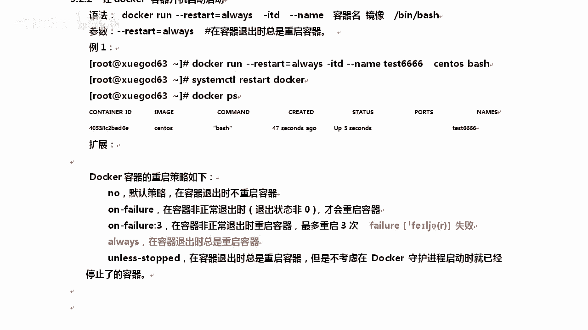

以下是更新容器重启策略的命令格式：

```bash
docker update --restart=<策略> <容器名称>
```

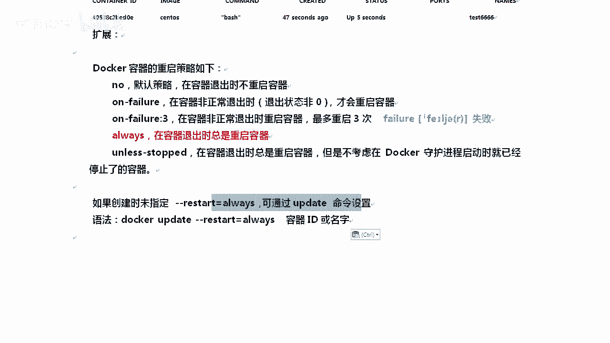

例如，将一个名为 `test888` 的容器的重启策略更新为 `always`：

```bash
docker update --restart=always test888
```

更新后，可以重启Docker服务来验证新策略是否生效。

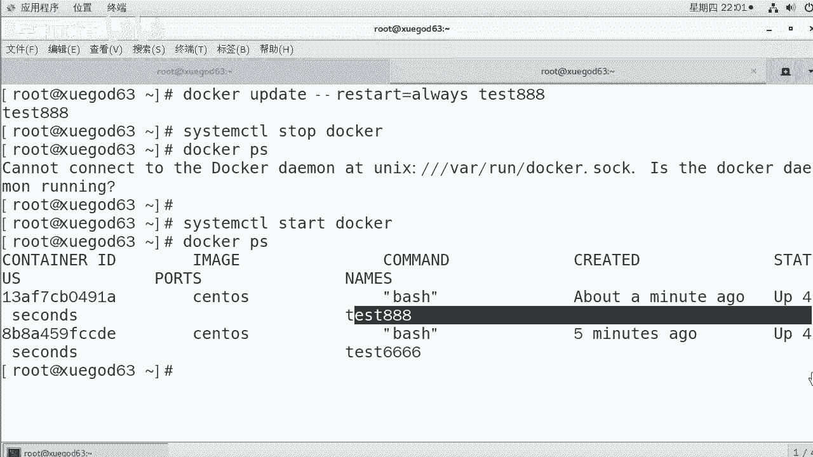

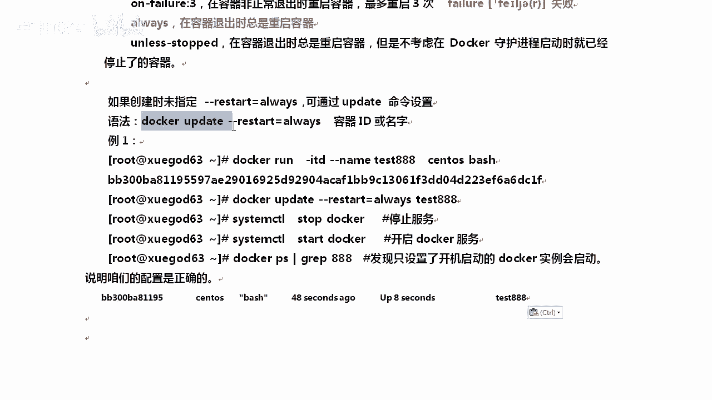

本节课中我们一起学习了Docker容器管理的基础操作：如何为容器命名和重命名，如何指定容器的主机名，以及如何设置和更新容器的自动重启策略。掌握这些命令是高效管理容器化应用的第一步。