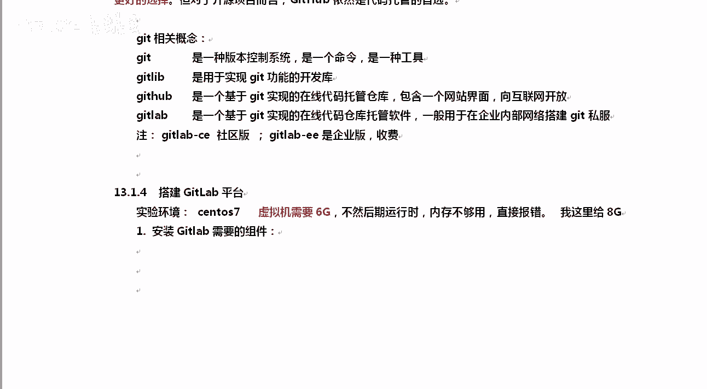
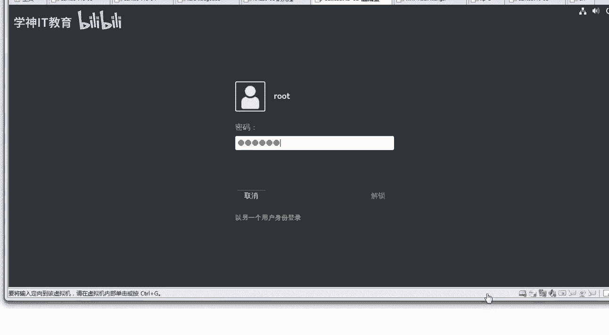
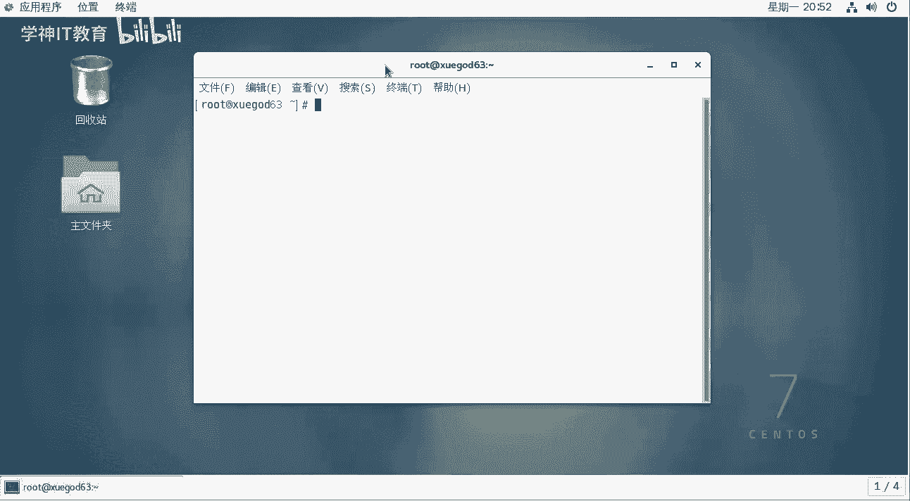
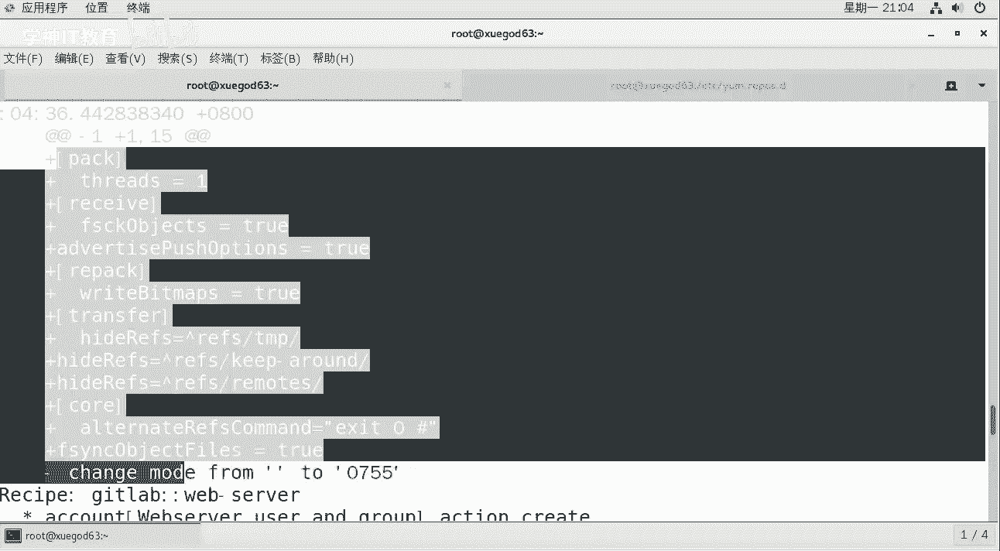
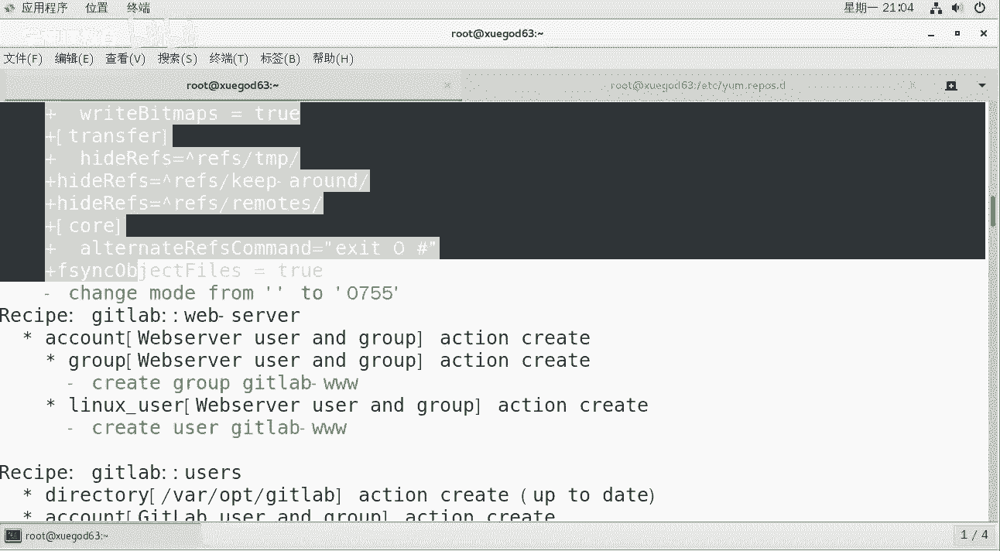
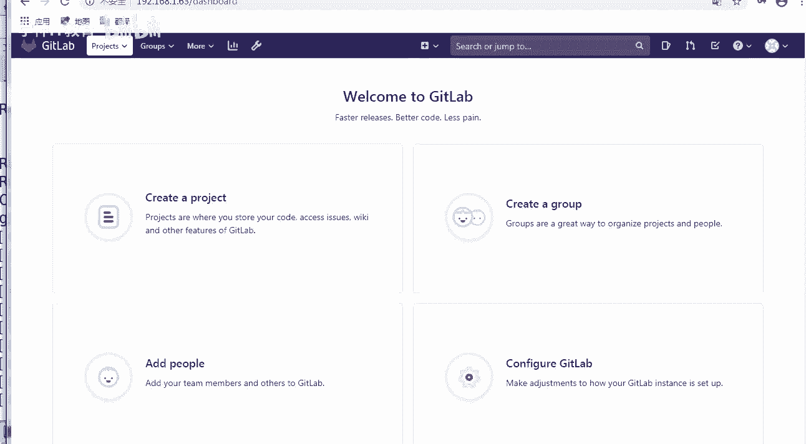

# Linux运维：1：持续集成概述与GitLab平台搭建 🚀

在本节课中，我们将学习持续集成（CI）的基本概念，并动手搭建一个用于代码管理的GitLab平台。这是构建自动化开发运维（DevOps）环境的第一步。

## 持续集成概述 🔄

上一节我们提到了课程目标，本节中我们来详细了解一下核心概念。

持续集成（Continuous Integration，简称 **CI**）是指开发者在代码开发过程中，频繁地将代码集成到主干分支，并进行自动化测试的实践。其核心公式可以理解为：

**代码提交 -> 自动构建 -> 自动化测试**

与传统的版本控制系统（如SVN）不同，CI/CD流程可以实现代码提交后的自动编译（例如将C语言代码编译为二进制文件）和自动化测试，极大提升了开发效率和代码质量。

在此基础上，还有两个延伸概念：
*   **持续交付（Continuous Delivery）**：在持续集成的基础上，将通过测试的代码自动部署到预生产环境。
*   **持续部署（Continuous Deployment）**：在持续交付的基础上，进一步自动化部署到生产环境。但出于安全考虑，最后一步生产部署通常建议手动确认。

对于业务简单、更新不频繁的项目，手动部署或许可行。但对于像大型软件（如QQ、微信）这样功能模块众多、需要频繁集成和测试的项目，自动化CI/CD工具就成为必需品。

## Jenkins与GitLab简介 ⚙️

上一节我们介绍了CI的概念，本节中我们来看看实现CI/CD的关键工具。

真正实现DevOps理念的流行工具组合是 **GitLab** 与 **Jenkins**。
*   **Jenkins** 是一个开源的、基于Java开发的持续集成工具。它用于监控并执行重复性的任务，为软件项目提供一个开放的自动化平台。
*   **Git** 是一个分布式版本控制系统命令。
*   **GitHub** 是一个基于Git的公共代码托管平台。
*   **GitLab** 是一个基于Ruby on Rails开发的开源应用程序，用于实现企业内部私有的Git仓库管理，并提供了丰富的Web管理界面。

对于企业而言，代码是核心资产，必须存放在私有的内网环境中。GitLab相比GitHub的主要优势在于：
1.  可以免费创建私有仓库并支持无限协作成员。
2.  对代码权限有更精细的控制，例如可以只分享部分代码库，安全性更高。




因此，**GitLab是企业搭建内部代码管理平台的首选**。它分为社区版（CE）和企业版（EE），我们使用免费的社区版即可。





## 搭建GitLab平台 🛠️

了解了工具后，本节我们将完成GitLab平台的安装与初始化配置。

**环境准备**
搭建GitLab需要一台CentOS 7系统的虚拟机，建议分配至少6GB内存，否则运行时可能因内存不足而报错。

以下是安装前的依赖包安装与基础环境配置步骤：

```bash
# 1. 安装必要的依赖包
yum install -y curl policycoreutils-python openssh-server postfix

# 2. 启动Postfix邮件服务并设置开机自启（用于GitLab发送邮件通知）
systemctl enable postfix
systemctl start postfix

# 3. 关闭防火墙或配置相应规则（建议学习环境直接关闭）
systemctl stop firewalld
systemctl disable firewalld
```





**安装GitLab**
我们可以从清华大学开源镜像站快速下载GitLab安装包进行安装。

```bash
# 进入安装包所在目录，使用rpm命令安装
rpm -ivh gitlab-ce-<版本号>.rpm
```
安装过程可能需要几分钟，因为GitLab集成了Web服务器（Nginx）、数据库（PostgreSQL）、监控等多个组件。

**配置GitLab**
安装完成后，需要修改其配置文件以设置正确的访问地址。

1.  编辑GitLab主配置文件：
    ```bash
    vim /etc/gitlab/gitlab.rb
    ```
2.  找到并修改 `external_url` 配置项，将其值改为你的服务器IP或域名，例如：
    ```
    external_url 'http://192.168.1.63'
    ```
3.  保存退出后，**必须**执行以下命令重新配置GitLab，使更改生效：
    ```bash
    gitlab-ctl reconfigure
    ```
    此命令会根据新的配置，重新生成所有组件的配置文件，过程可能需要2-5分钟。

**访问与初始化**
配置完成后，可以通过浏览器访问上面设置的 `external_url` 地址。

1.  首次访问会强制为默认的 `root` 管理员用户设置密码。请设置一个强密码（至少8位，包含字母、数字、符号）。
2.  使用 `root` 账号和刚设置的密码登录，即可进入GitLab的管理界面。

如果访问时出现“502”错误，通常是服务器内存不足导致，请检查并增大虚拟机内存分配。

## 总结 📝

本节课中我们一起学习了：
1.  **持续集成（CI）**、持续交付和持续部署的核心概念及其在复杂项目中的重要性。
2.  **GitLab与Jenkins** 在DevOps流程中的角色，以及GitLab相较于GitHub在企业内部使用的优势。
3.  **GitLab社区版的完整安装与初始化配置过程**，包括环境准备、软件安装、网络配置和首次登录。



至此，我们已经成功搭建了代码管理平台GitLab。在接下来的课程中，我们将学习Git的基本使用，并集成Jenkins，构建完整的自动化CI/CD流水线。