# Linux运维：2-5：搭建DNS服务器实现域名解析 🖥️

在本节课中，我们将学习DNS（域名系统）的基本概念，并动手搭建一个DNS服务器，实现域名解析功能。我们将从理论入手，逐步完成DNS服务器的安装、配置，并实现内网域名解析和递归查询。

---

## DNS基础概念 🌐

DNS，全称域名系统，是互联网中用于将域名转换为IP地址的服务。它运行在UDP协议之上，默认使用端口53。DNS采用分布式、层次化的树形结构来管理域名空间，这使得全球的域名管理既分散又统一。

### 域名空间结构

域名空间像一棵倒置的树，从根域开始，向下分为顶级域、二级域、子域等。
*   **根域**：位于最顶层，全球共有13组根服务器。
*   **顶级域**：如 `.com`（商业机构）、`.edu`（教育机构）、`.cn`（国家代码）等。
*   **二级域/子域**：在顶级域下注册的域名，如 `baidu.com`，`www` 则是 `baidu.com` 的一个子域。

一个完整的域名，如 `www.xuegod.cn`，被称为**完全合格域名**。

### DNS查询过程

当客户端请求解析一个域名（如 `www.163.com`）时，过程可能涉及多个DNS服务器：
1.  客户端查询本地DNS缓存和 hosts 文件。
2.  未找到则向**本地DNS服务器**（如运营商DNS）发起查询。
3.  本地DNS服务器若没有记录，会从**根DNS服务器**开始，进行**迭代查询**，层层向下（如 `.com` 域服务器 -> `163.com` 域服务器）寻找答案。
4.  最终，权威DNS服务器将IP地址返回给本地DNS服务器，本地DNS服务器再返回给客户端，并缓存此记录。

**递归查询**与**迭代查询**的区别在于：递归查询中，DNS服务器必须给客户端返回最终结果（它负责问到底）；迭代查询中，DNS服务器只返回下一个最佳查询地址，由客户端继续询问。

### DNS记录类型

DNS的信息以**资源记录**的形式存储在区域文件中，主要类型包括：
*   **SOA记录**：起始授权记录，定义区域的全局参数，如管理邮箱、序列号、刷新时间等。
*   **NS记录**：域名服务器记录，指明该域名由哪台DNS服务器负责解析。
*   **A记录**：将域名指向一个IPv4地址。
*   **AAAA记录**：将域名指向一个IPv6地址。
*   **CNAME记录**：别名记录，将一个域名指向另一个域名。
*   **MX记录**：邮件交换记录，用于电子邮件服务。
*   **PTR记录**：指针记录，用于反向解析，将IP地址映射到域名。

---

## 安装BIND DNS服务器 🔧

上一节我们介绍了DNS的核心概念，本节中我们来看看如何安装DNS服务器软件。在Linux系统中，最常用的DNS服务器软件是 **BIND**。

我们使用 `yum` 包管理器进行安装，它会自动处理依赖关系。

```bash
yum install -y bind bind-utils bind-chroot
```

安装的软件包说明：
*   `bind`：DNS服务的主程序包。
*   `bind-utils`：提供DNS查询工具（如 `dig`, `nslookup`）。
*   `bind-chroot`：为BIND服务提供沙箱环境，增强安全性。

安装完成后，可以启动服务并检查状态：

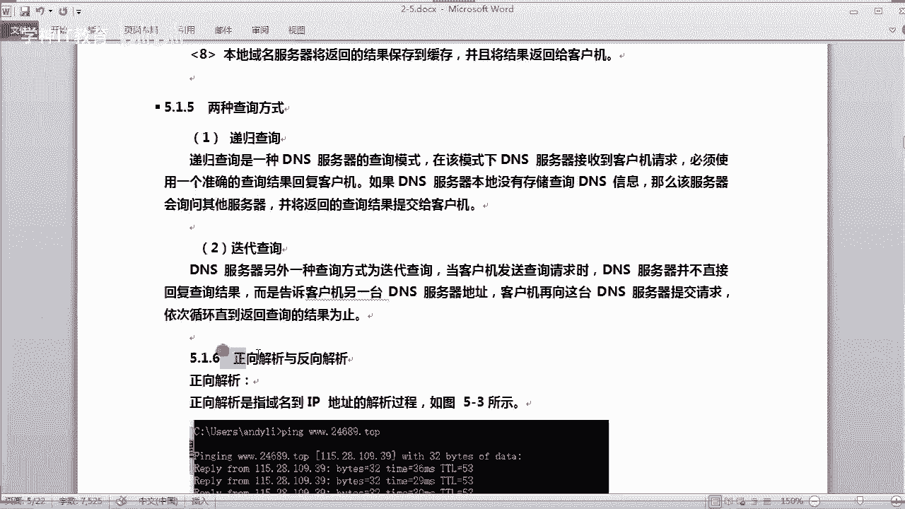

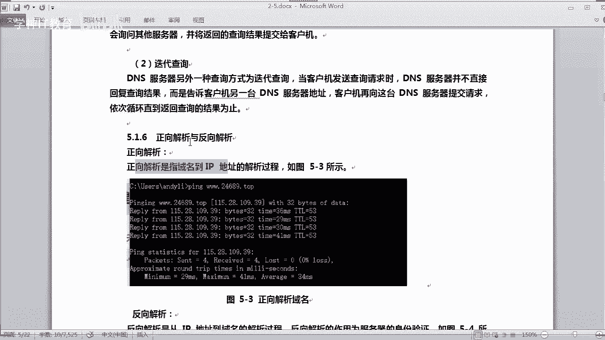

```bash
systemctl start named   # 启动 named 服务
systemctl status named  # 查看服务状态
ss -tunlp | grep :53    # 检查53端口是否监听
```

默认配置下，服务仅监听在本地回环地址（127.0.0.1）。

---

## 配置主DNS服务器 ⚙️

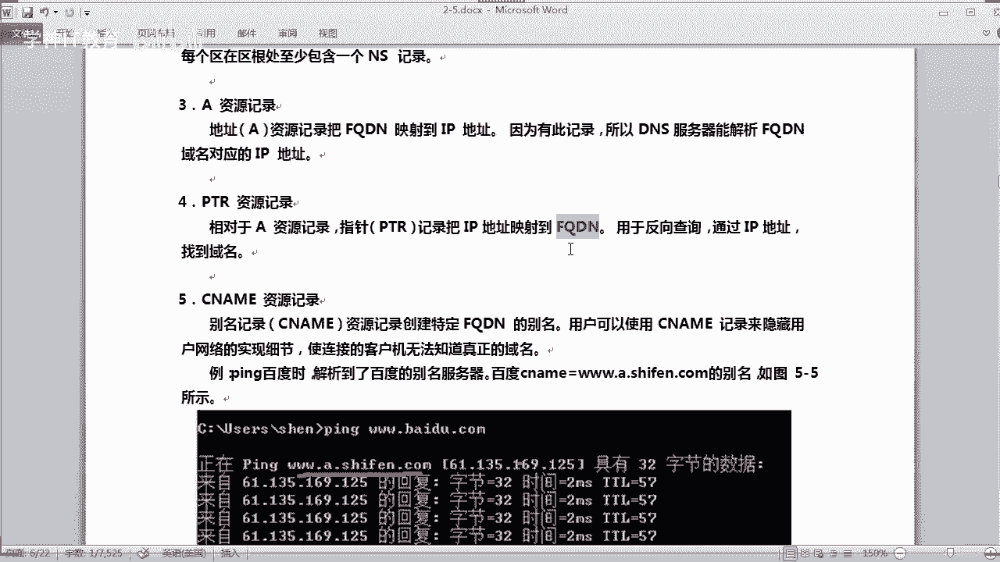

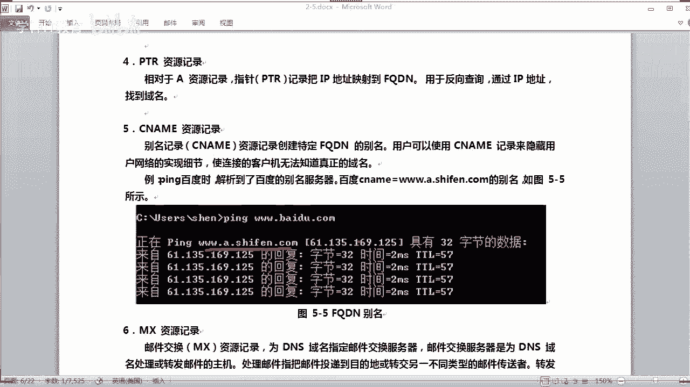

现在我们已经安装了BIND软件，接下来进入核心环节：配置一个主DNS服务器，使其能够解析我们自定义的内网域名。

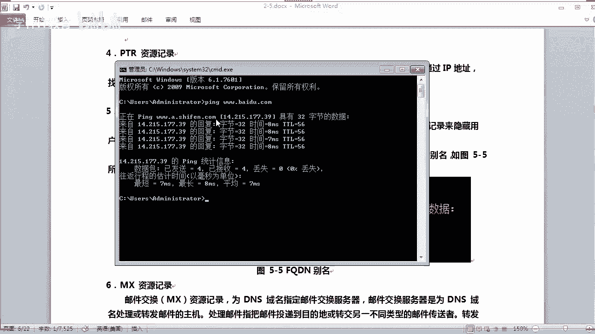

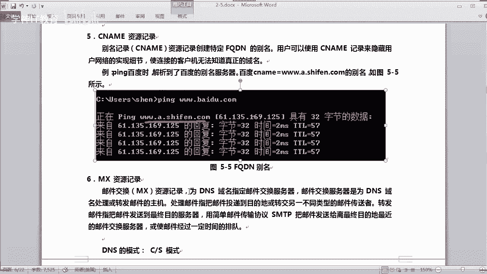

### 1. 备份与编辑主配置文件

首先，备份默认配置文件，这是一个好习惯。

```bash
cp /etc/named.conf /etc/named.conf.backup
```

然后，编辑主配置文件 `/etc/named.conf`。我们需要修改几个关键部分：

```bash
vi /etc/named.conf
```

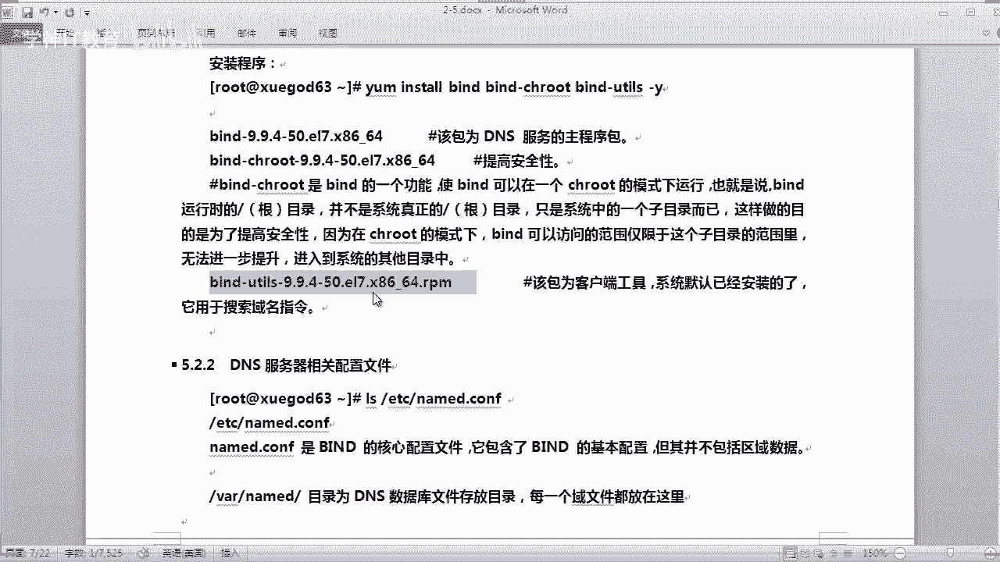

找到以下选项并进行修改：
*   `listen-on port 53`：将 `127.0.0.1` 改为 `any`，以监听所有网络接口。
*   `allow-query`：将 `localhost` 改为 `any`，允许所有客户端查询。
*   `dnssec-validation`：在相应选项块中，将其设置为 `no`，以简化初始配置。

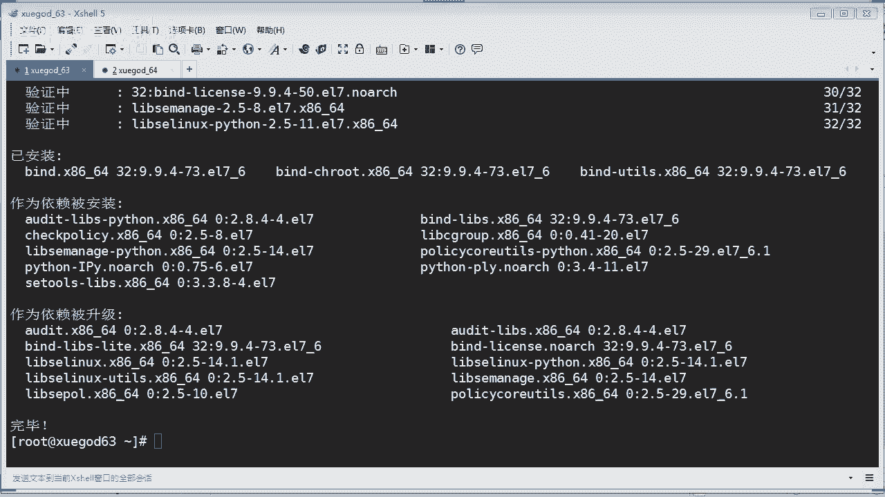

修改后的关键部分示例如下：
```
options {
    listen-on port 53 { any; };
    listen-on-v6 port 53 { any; };
    allow-query     { any; };
    ...
    dnssec-validation no;
    ...
};
```

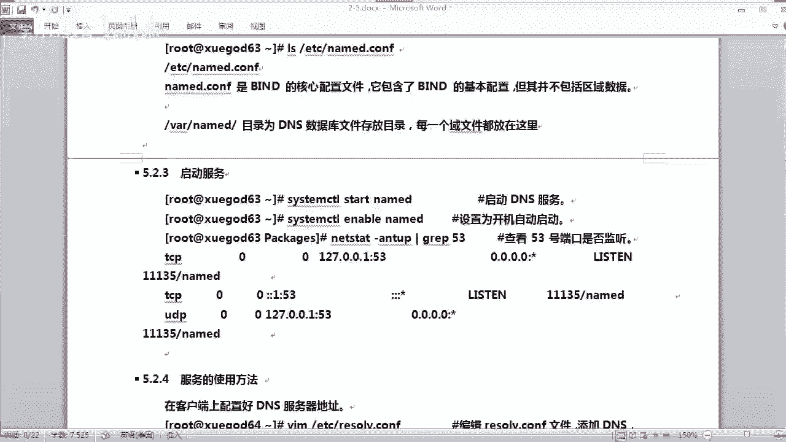

### 2. 定义正向解析区域

在主配置文件的末尾，我们需要添加一个正向解析区域声明，例如我们要管理 `xuegod.cn` 这个域。

在 `/etc/named.conf` 文件末尾添加：
```
zone "xuegod.cn" IN {
    type master;                 # 类型为主服务器
    file "xuegod.cn.zone";       # 区域数据文件名
    allow-update { none; };
};
```

**参数解释**：
*   `type master`：表示这是主DNS服务器。
*   `file “xuegod.cn.zone”`：指定该区域的资源记录存储文件，位于 `/var/named/` 目录下。

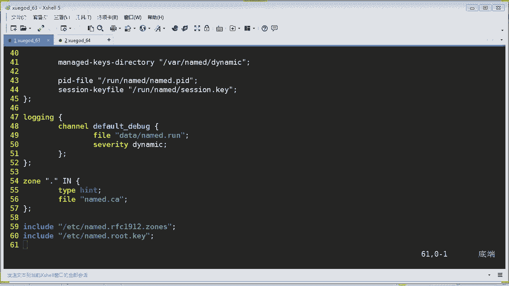

### 3. 创建区域数据文件

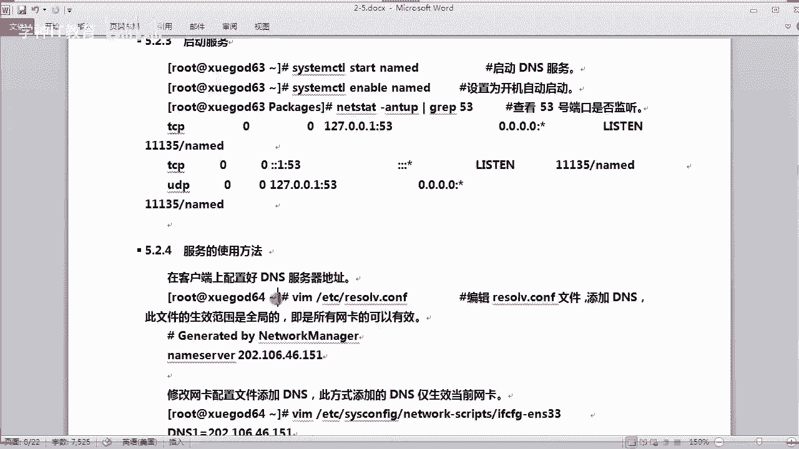

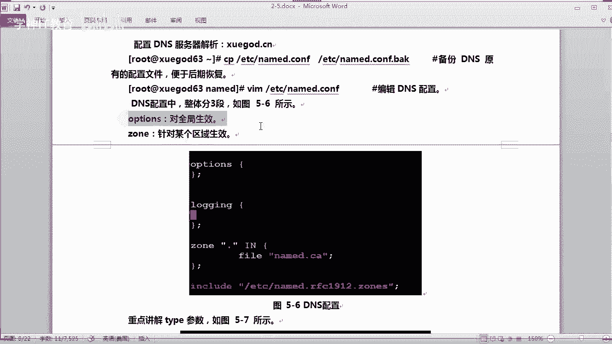

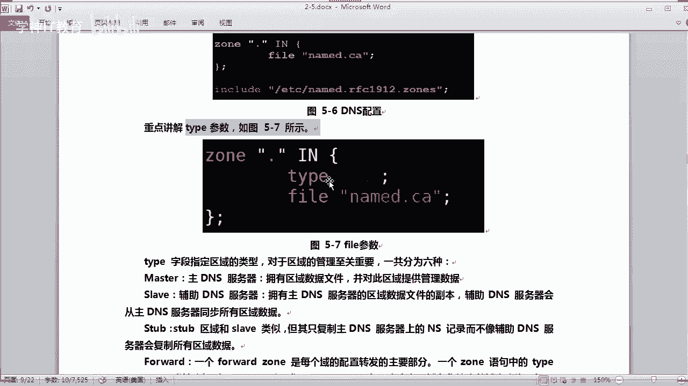

区域数据文件是存储具体域名与IP映射关系的地方。我们基于模板创建它。

```bash
cd /var/named
cp -p named.localhost xuegod.cn.zone # -p 选项保留原文件权限属性
```

接着，编辑这个区域文件 `xuegod.cn.zone`：

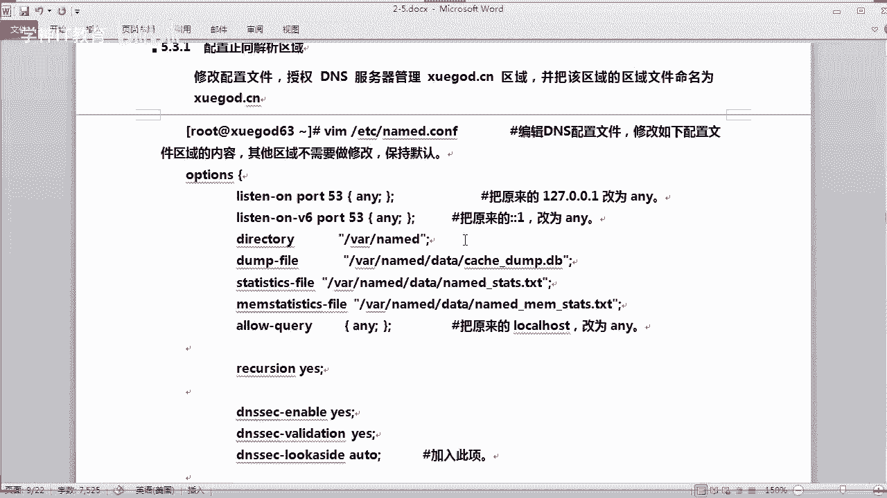

```bash
vi /var/named/xuegod.cn.zone
```

文件初始内容是一个模板，我们需要将其修改为如下格式：
```
$TTL 1D
@       IN SOA  dns.xuegod.cn. root.xuegod.cn. (
                                        0       ; serial
                                        1D      ; refresh
                                        1H      ; retry
                                        1W      ; expire
                                        3H )    ; minimum
        IN NS   dns.xuegod.cn.
dns     IN A    192.168.2.63
www     IN A    192.168.2.63
ftp     IN CNAME www.xuegod.cn.
```

**配置项解析**：
*   `$TTL 1D`：默认缓存生存时间，为1天。
*   `SOA记录`：定义了区域管理信息，如主DNS服务器（`dns.xuegod.cn.`）、管理员邮箱（`root.xuegod.cn.`，注意@用点代替）、序列号等。
*   `NS记录`：指明该域的权威DNS服务器是 `dns.xuegod.cn`。
*   `A记录`：将 `dns.xuegod.cn` 和 `www.xuegod.cn` 都解析到IP `192.168.2.63`。
*   `CNAME记录`：为 `ftp.xuegod.cn` 创建一个别名，指向 `www.xuegod.cn`。

**注意**：在区域文件中，完整的域名（FQDN）末尾的 “.” 不能省略，如 `dns.xuegod.cn.`。

### 4. 检查配置并重启服务

配置完成后，务必使用BIND自带的工具检查配置文件语法是否正确。

```bash
named-checkconf /etc/named.conf      # 检查主配置文件
named-checkzone xuegod.cn /var/named/xuegod.cn.zone # 检查区域文件
```

如果检查没有报错，就可以重启DNS服务了。

```bash
systemctl restart named
systemctl enable named  # 设置开机自启
```

---

## 测试DNS服务器 ✅

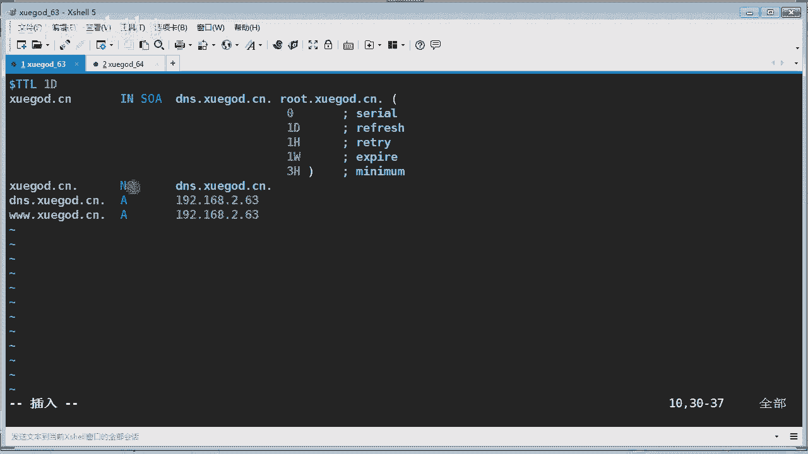

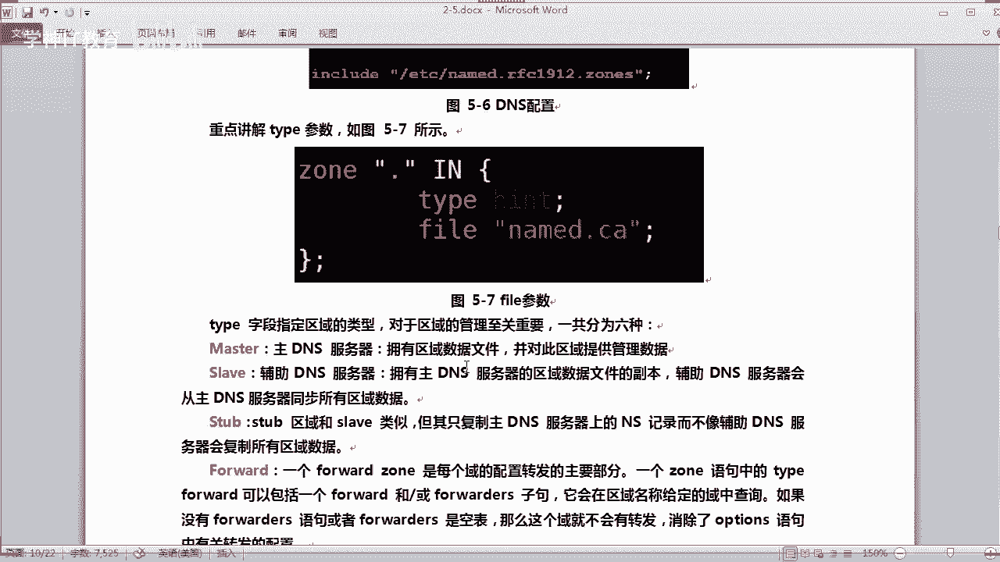

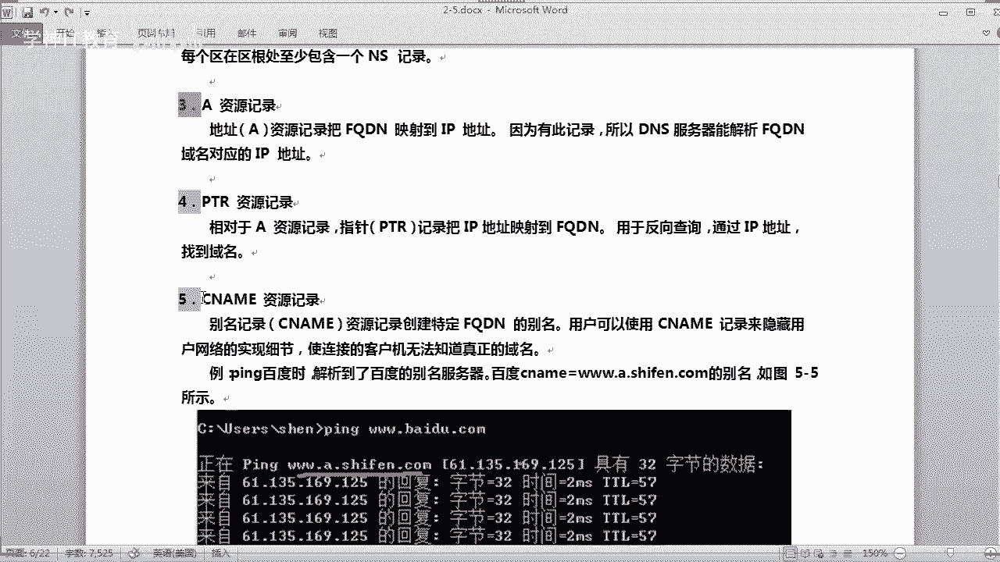

配置完成后，我们需要验证DNS服务器是否工作正常。首先，将测试机器的DNS服务器指向我们刚搭建的服务器。

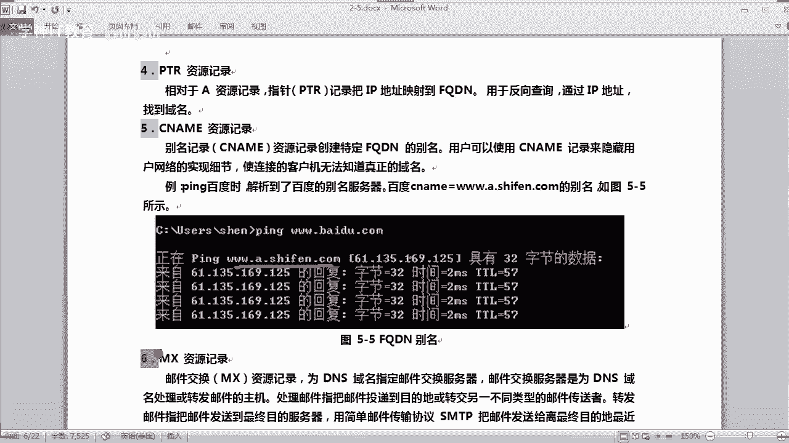

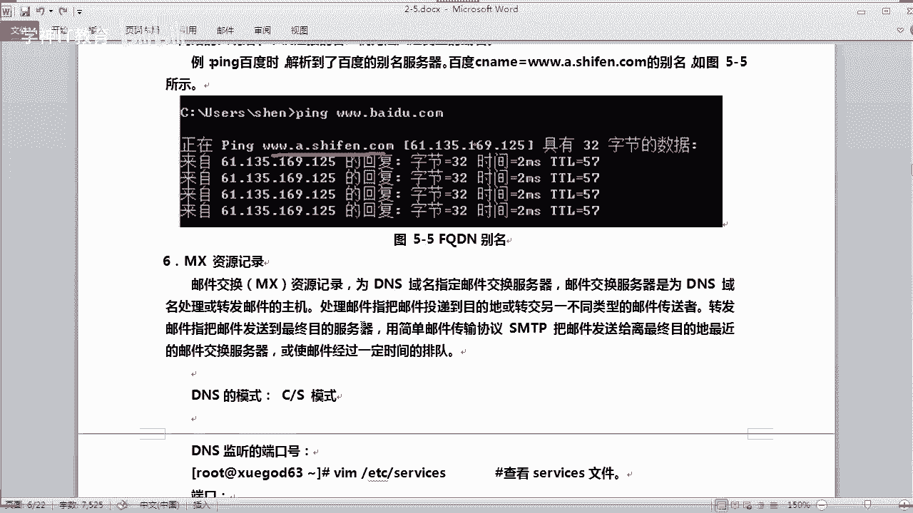

### 1. 修改本地DNS设置

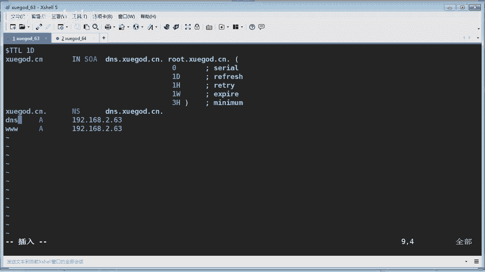

在服务器本机（IP: 192.168.2.63）上，编辑网卡配置文件或 `/etc/resolv.conf`，将DNS服务器指向自己。

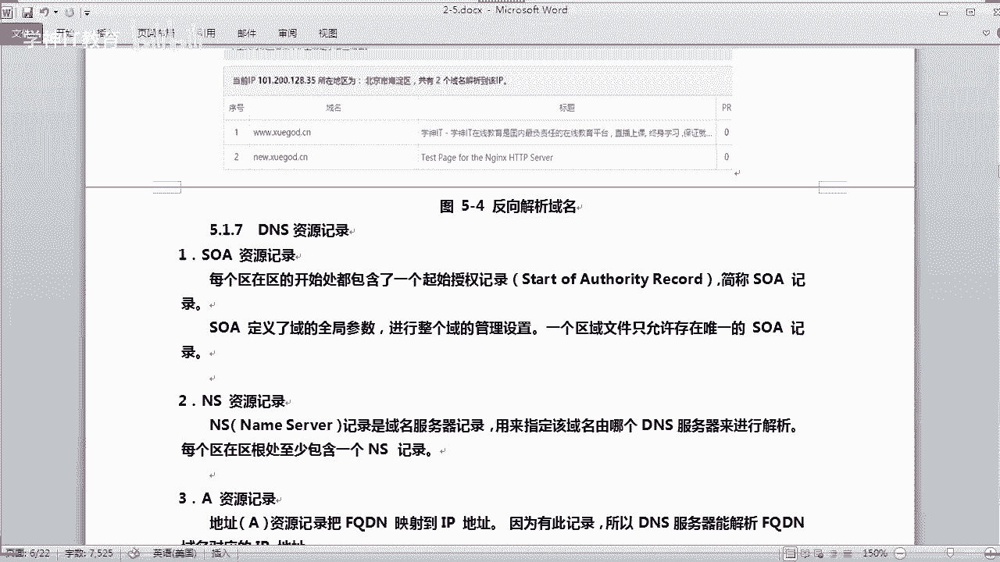

例如，修改 `/etc/resolv.conf`：
```
nameserver 192.168.2.63
```

### 2. 使用工具进行解析测试

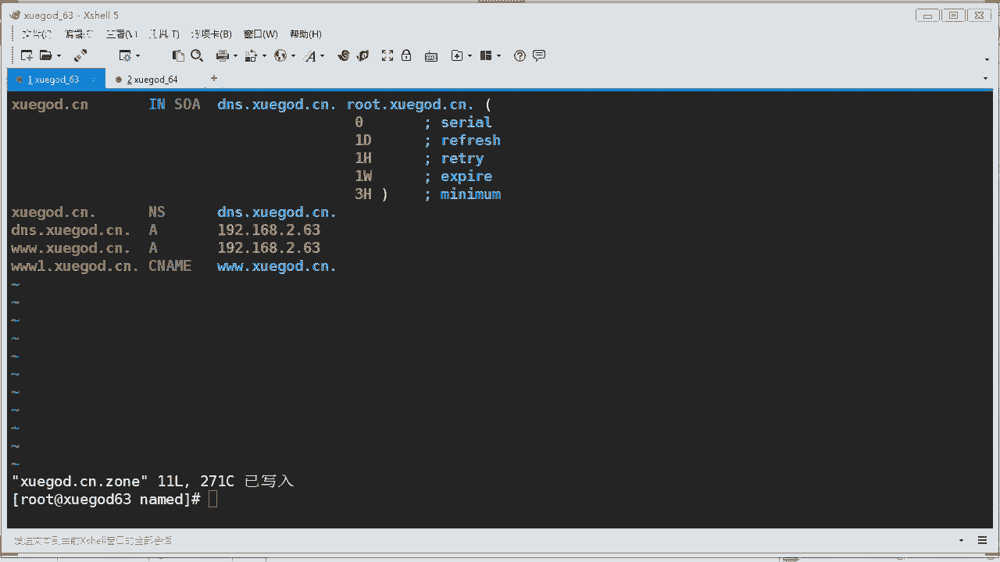

使用 `nslookup` 或 `dig` 命令测试解析：

```bash
# 测试解析我们自定义的域名
nslookup www.xuegod.cn
# 或
dig www.xuegod.cn

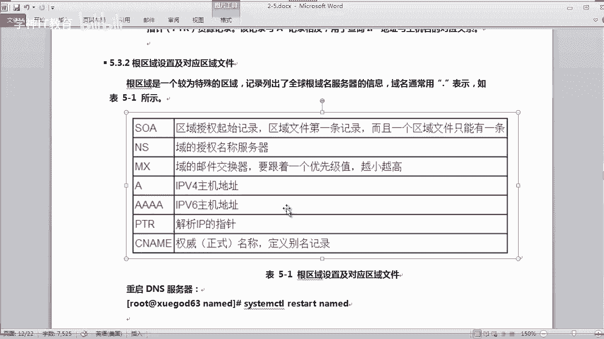

# 测试递归查询外部域名（如百度）
nslookup www.baidu.com
```

如果能够正确返回 `www.xuegod.cn` 对应的IP地址 `192.168.2.63`，并且也能解析出 `www.baidu.com` 的IP，说明我们的**主DNS服务器**和**递归查询功能**均已配置成功。

### 3. 客户端测试

在局域网内的另一台客户端机器上，将其DNS服务器地址设置为 `192.168.2.63`，重复上述测试步骤。如果也能成功解析内网和外网域名，则证明DNS服务已能在网络中正常提供解析服务。

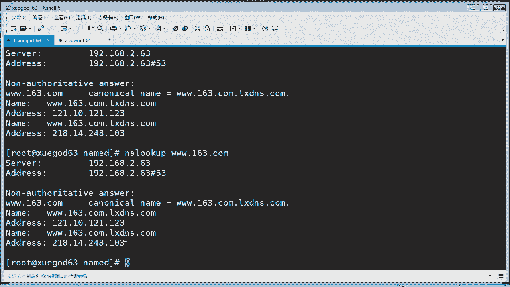

---

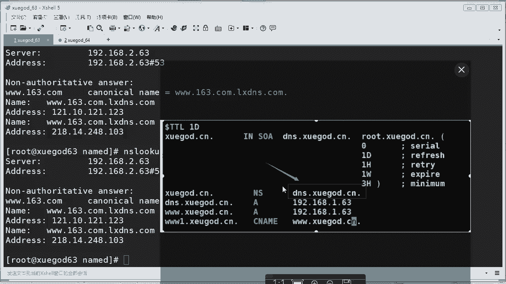

## 总结 📚

本节课中我们一起学习了DNS的基础知识，并完成了一个主DNS服务器的搭建。
1.  **理论部分**：我们了解了DNS的层次结构、查询流程（递归/迭代）以及核心的资源记录类型（SOA, NS, A, CNAME等）。
2.  **实践部分**：我们安装了BIND软件，通过编辑 `/etc/named.conf` 主配置文件和 `/var/named/xuegod.cn.zone` 区域数据文件，成功配置了一个能够解析自定义内网域名（`xuegod.cn`）并支持递归查询外网域名的DNS服务器。
3.  **测试验证**：我们使用 `nslookup` 和 `dig` 命令验证了DNS服务器的正向解析功能。

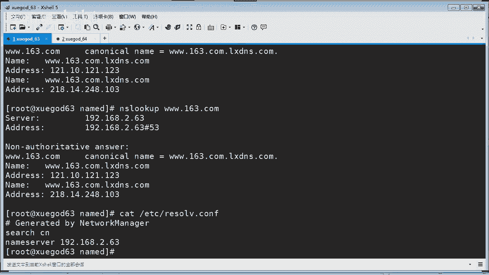

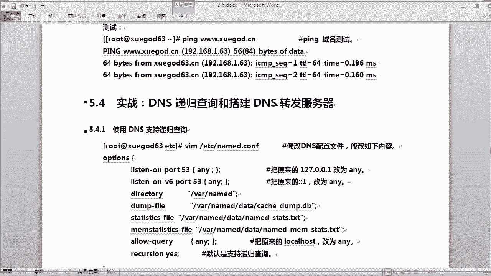

通过这个实验，你已经掌握了搭建基础DNS服务的关键步骤。在后续课程中，我们将在此基础上，进一步学习如何配置**DNS转发服务器**和**主从DNS同步**，以构建更健壮、高效的域名解析架构。