# Linux运维：2-5：搭建DNS服务器实现域名解析（下） 🔧

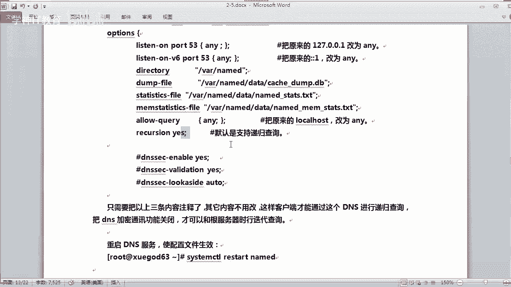

在本节课中，我们将继续深入学习DNS服务器的配置，重点掌握递归查询、转发服务器以及主从DNS服务器的搭建方法。通过实战操作，你将能够构建一个功能完善的内部DNS解析环境。

---

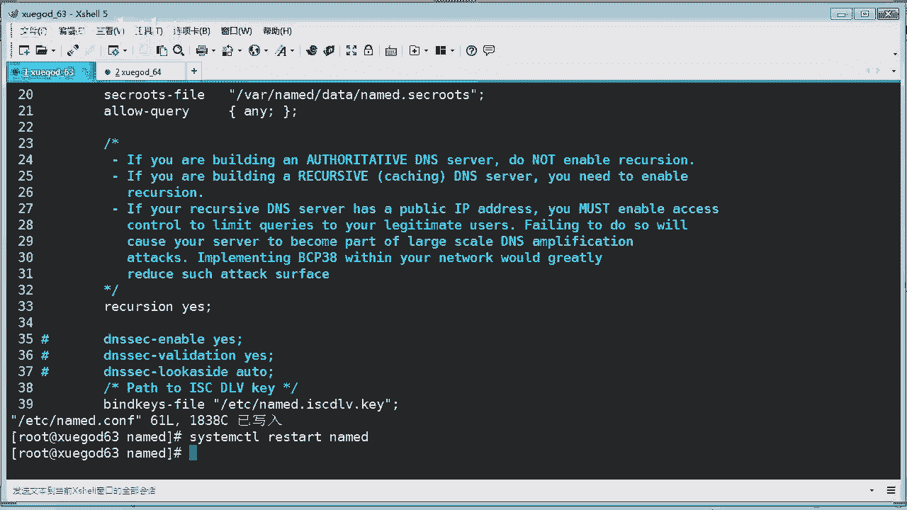

## 配置DNS递归查询 🔄

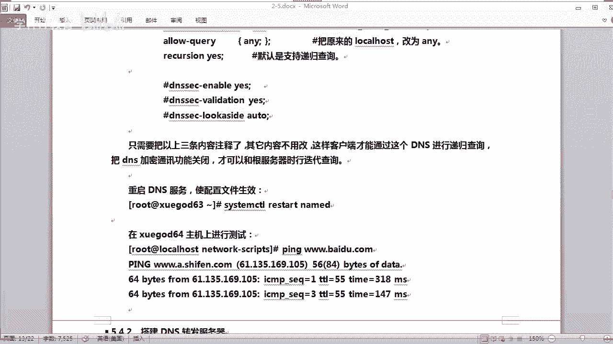

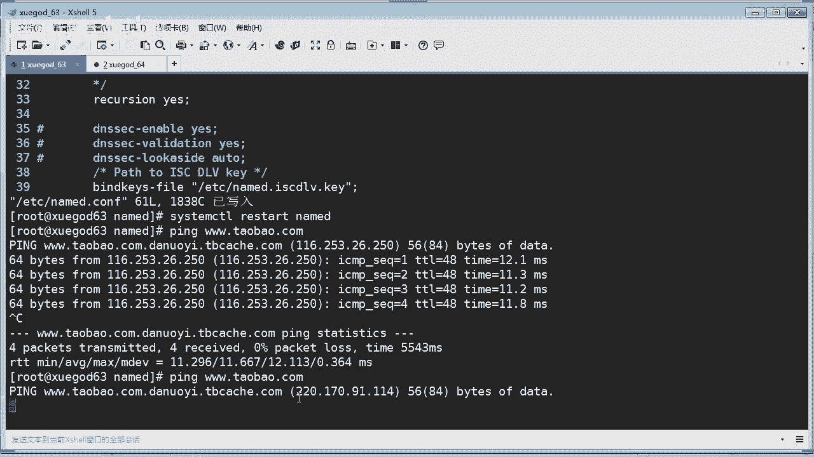

上一节我们介绍了DNS的基本配置，本节中我们来看看如何配置DNS服务器以支持递归查询。递归查询是指DNS服务器代替客户端向其他DNS服务器层层查询，直到获得最终解析结果的过程。

在BIND的配置文件 `/etc/named.conf` 中，有一个关键参数控制递归查询。

```bash
recursion yes; // 默认值为 yes，表示开启递归查询
```

默认情况下，BIND服务已开启递归查询，因此你的DNS服务器可以直接解析互联网域名。为了确保递归查询正常工作，有时需要关闭一些高级功能（如加密通信），以避免与根服务器进行迭代查询时产生冲突。

以下是配置步骤：

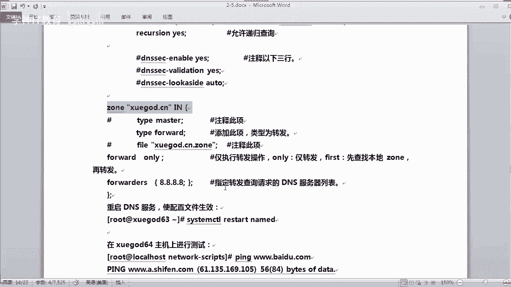

1.  打开主配置文件。
    ```bash
    vim /etc/named.conf
    ```
2.  确认 `recursion` 参数值为 `yes`。
3.  注释掉 `dnssec` 相关的行（例如 `dnssec-enable`、`dnssec-validation` 等），以关闭DNSSEC验证等加密通信功能。
    ```bash
    // dnssec-enable yes;
    // dnssec-validation yes;
    ```
4.  保存并退出编辑器。
5.  重启BIND服务使配置生效，并检查是否有错误。
    ```bash
    systemctl restart named
    systemctl status named
    ```

配置完成后，你的DNS服务器就支持递归查询了。可以使用 `nslookup` 或 `dig` 命令测试解析一个外网域名（如 `www.taobao.com`），观察解析过程。

---

## 配置DNS转发服务器 ➡️

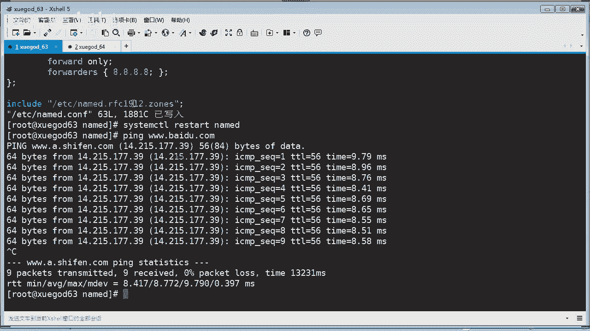

如果你的DNS服务器不想自己进行递归查询，可以将查询请求转发给另一台指定的DNS服务器（如公共DNS），这台服务器就成为了转发服务器。

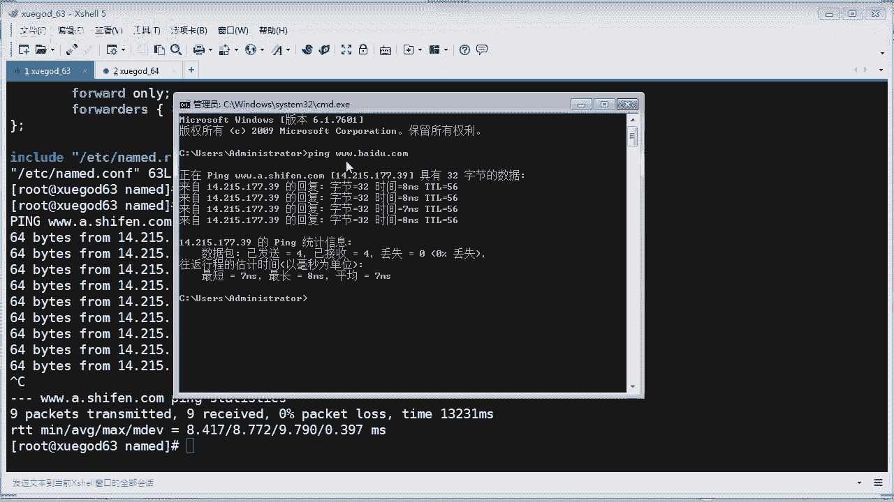

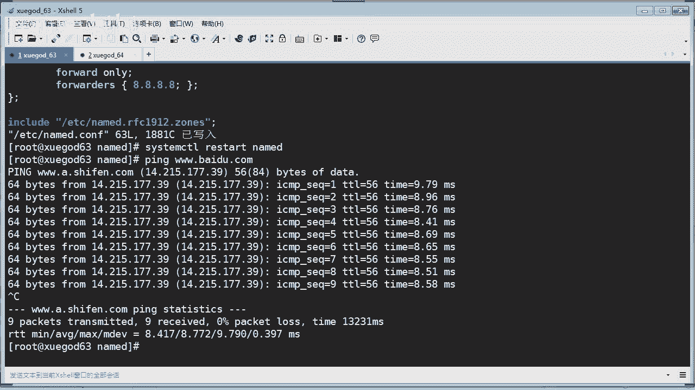

配置转发也是在 `/etc/named.conf` 文件的 `options` 区域块中完成。

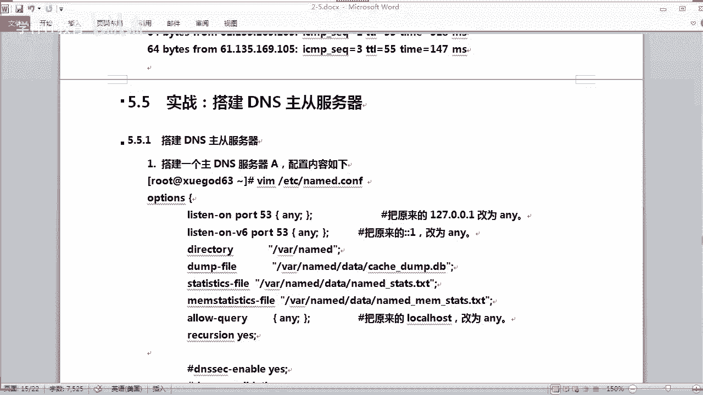

以下是配置一个仅进行转发的DNS服务器的步骤：

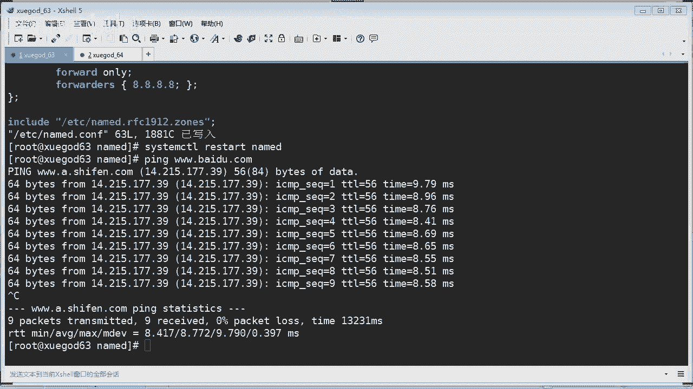

1.  编辑主配置文件。
    ```bash
    vim /etc/named.conf
    ```
2.  在 `options` 块中，添加以下配置，将查询转发到谷歌的公共DNS（8.8.8.8）。
    ```bash
    forward only; // 仅进行转发，不自行递归查询
    forwarders { 8.8.8.8; }; // 指定转发目标DNS服务器列表
    ```
    **注意**：配置语句末尾的分号必不可少，否则服务会启动失败。
3.  保存并退出。
4.  重启BIND服务。
    ```bash
    systemctl restart named
    ```

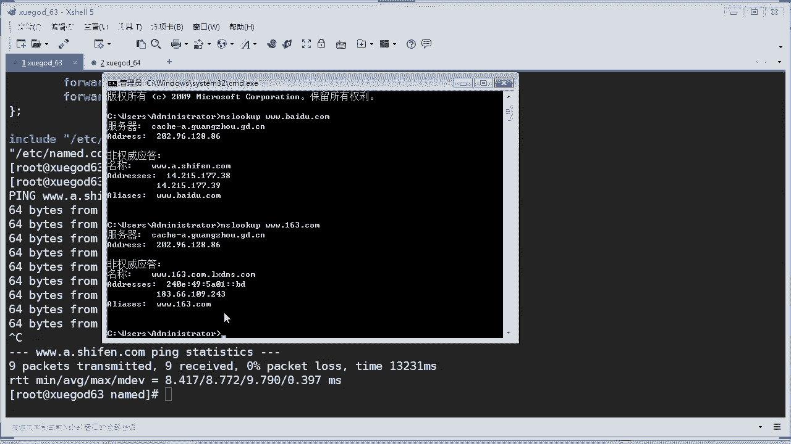

现在，所有到达此DNS服务器的查询请求都会被转发到 `8.8.8.8` 进行解析。你可以通过 `nslookup` 命令测试，观察解析结果中的服务器地址是否变为转发目标地址。

---

## 搭建主从DNS服务器 🖥️🖥️

为了提高DNS服务的可靠性和负载能力，可以搭建主从（Master-Slave）DNS服务器。主服务器负责维护区域数据文件，从服务器自动从主服务器同步数据。

### 配置主服务器（Master）

首先，我们需要将之前可能改为转发的配置恢复，并设置主服务器允许从服务器同步数据。

1.  编辑主服务器的 `/etc/named.conf`。
    ```bash
    vim /etc/named.conf
    ```
2.  确保区域类型为 `master`。
    ```bash
    zone “xuegod.cn” IN {
        type master;
        file “xuegod.cn.zone”;
        allow-transfer { 192.168.2.0/24; }; // 允许此网段的主机作为从服务器同步数据
    };
    ```
3.  保存退出并重启服务。

### 配置从服务器（Slave）

接下来，在另一台主机上配置从服务器。

1.  安装BIND软件包。
    ```bash
    yum install -y bind
    ```
2.  编辑从服务器的 `/etc/named.conf`。
    ```bash
    vim /etc/named.conf
    ```
3.  配置区域块，指定类型为 `slave`，并告知主服务器的地址。
    ```bash
    zone “xuegod.cn” IN {
        type slave;
        file “slaves/xuegod.cn.zone.slave”; // 同步后的数据文件存放位置和名称
        masters { 192.168.2.63; }; // 指定主服务器的IP地址
    };
    ```
    **注意**：`masters` 是复数形式，且后面有 `s`。
4.  保存退出并重启从服务器的BIND服务。
5.  检查 `/var/named/slaves/` 目录下是否生成了 `xuegod.cn.zone.slave` 文件。如果文件存在，说明区域数据已成功从主服务器同步。

**重要提示**：主从服务器的时间必须同步，否则可能导致数据同步问题。在生产环境中，建议配置NTP服务。

### 实现简单的DNS负载均衡

DNS还可以用于实现简单的负载均衡。例如，一个域名对应多个IP地址，DNS服务器会以轮询方式返回这些地址，将访问流量分散到不同的服务器上。

在主服务器的区域数据文件（如 `xuegod.cn.zone`）中，可以为同一个主机名添加多条A记录：

```bash
www    IN    A    192.168.2.63
www    IN    A    192.168.2.64
```

这样，当客户端查询 `www.xuegod.cn` 时，DNS服务器会依次返回 `192.168.2.63` 和 `192.168.2.64`。这仅是一种简单的负载分发方式，大型网站通常使用更专业的负载均衡器或CDN。

---

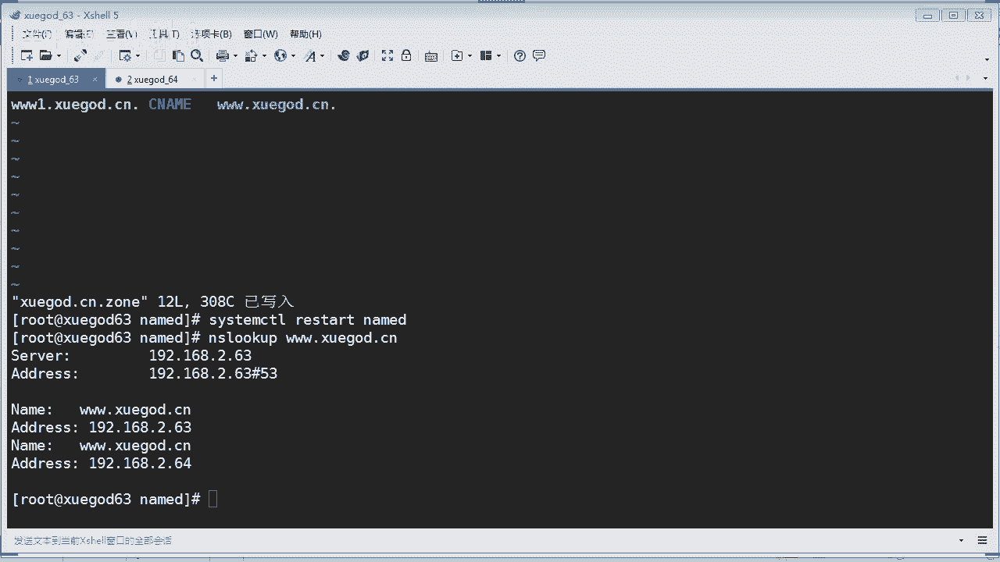

## 配置主从密钥认证 🔐

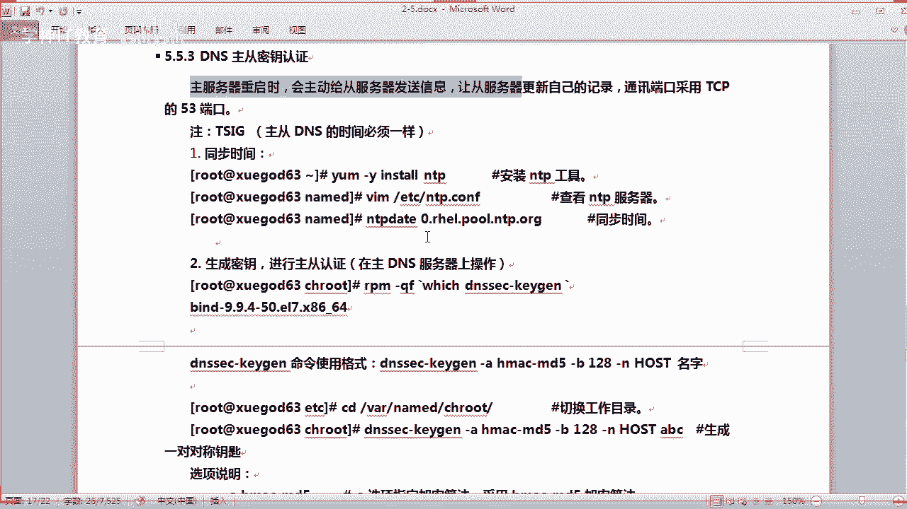

为了提高安全性，主从服务器之间的数据传输可以进行加密。这需要通过密钥认证来实现。

### 生成密钥对

在主服务器上，使用 `dnssec-keygen` 工具生成密钥对。

```bash
dnssec-keygen -a HMAC-MD5 -b 128 -n HOST abc-key
```
*   `-a HMAC-MD5`：指定加密算法。
*   `-b 128`：指定密钥长度为128位。
*   `-n HOST abc-key`：指定密钥类型和名称。

命令执行后，会生成两个文件：`Kabc-key.+xxx+.key` 和 `Kabc-key.+xxx+.private`。我们需要用到 `.key` 文件中的密钥字符串。

### 配置主服务器使用密钥认证

1.  在主服务器的 `/etc/named.conf` 中，启用会话密钥。
    ```bash
    session-keyfile “/var/named/session.key”;
    ```
2.  在 `options` 块或文件顶部，定义密钥。
    ```bash
    key abc-key {
        algorithm hmac-md5;
        secret “粘贴你的密钥字符串”; // 从生成的 .key 文件中获取
    };
    ```
3.  修改区域配置，使用密钥进行通信，并允许通过密钥传输。
    ```bash
    zone “xuegod.cn” IN {
        type master;
        file “xuegod.cn.zone”;
        allow-transfer { key abc-key; }; // 使用密钥认证的传输
    };
    ```
4.  保存并重启服务。

### 配置从服务器使用密钥认证

1.  在从服务器的 `/etc/named.conf` 中，进行与主服务器相同的密钥定义。
2.  修改区域配置，指定通过密钥与主服务器通信。
    ```bash
    zone “xuegod.cn” IN {
        type slave;
        file “slaves/xuegod.cn.zone.slave”;
        masters { 192.168.2.63 key abc-key; }; // 使用密钥连接主服务器
    };
    ```
3.  保存并重启服务。

配置完成后，可以测试删除从服务器上的区域数据文件并重启服务，如果文件能重新生成，说明通过密钥认证的同步成功。

---

## 常用DNS测试工具 🛠️

配置过程中，可以使用以下工具进行测试和诊断：

*   **`nslookup`**：交互式查询域名。
    ```bash
    nslookup
    > server 192.168.2.63 // 指定使用的DNS服务器
    > www.xuegod.cn // 查询域名
    ```
*   **`dig`**：功能更强大的DNS查询工具，显示详细信息。
    ```bash
    dig @8.8.8.8 www.xuegod.cn // 指定使用谷歌DNS查询
    ```

---

## 总结 📚

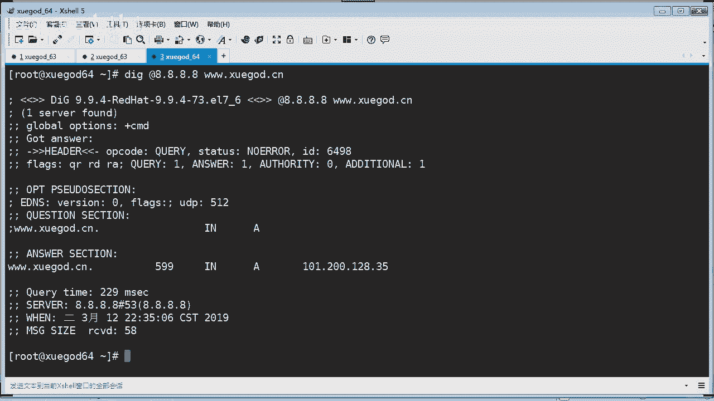

本节课中我们一起学习了DNS服务器的高级配置。
*   我们了解了如何**配置递归查询**，让DNS服务器能解析外部域名。
*   我们实践了如何设置**转发服务器**，将查询任务委托给其他DNS。
*   我们详细演练了**搭建主从DNS服务器**的完整过程，包括基本同步和更安全的**密钥认证同步**，以实现服务的冗余和负载分担。
*   我们还介绍了利用DNS记录进行**简单负载均衡**的方法以及常用的测试命令。

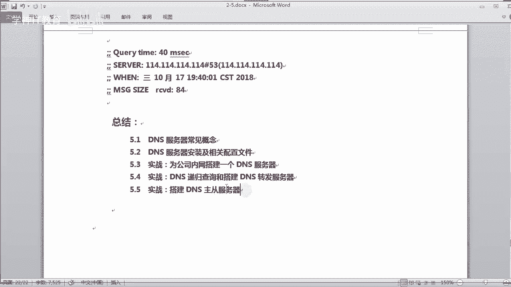

通过这些知识，你将能够根据实际需求，部署和管理一个稳定、安全的内部DNS解析体系。