# Linux运维：02：FTP_SSL配置及NFS配置

在本节课中，我们将要学习如何为FTP服务配置SSL证书以实现加密传输，以及如何配置和使用NFS（网络文件系统）来实现文件共享。我们将从生成自签名证书开始，逐步配置FTP服务，然后转向NFS的安装、配置和挂载。

---

## 📜 概述：FTP与SSL加密

上一节我们介绍了FTP的基本配置。本节中，我们来看看如何提升FTP服务的安全性，即通过SSL/TLS证书对数据传输进行加密。这类似于将普通的HTTP网站升级为HTTPS。

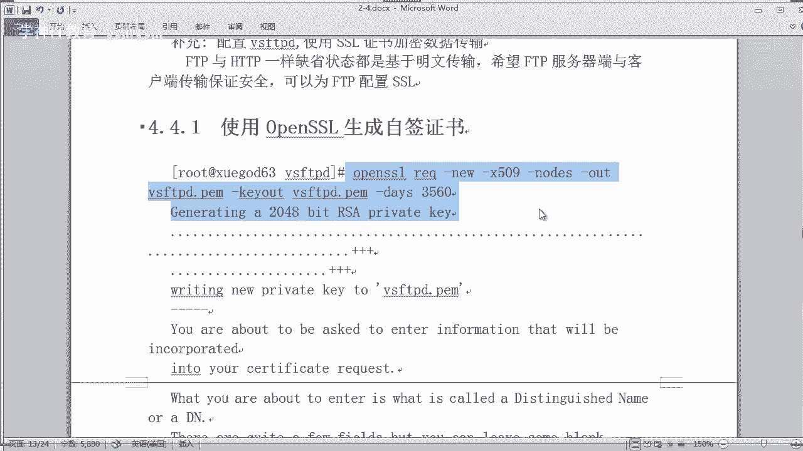

### 生成自签名SSL证书

首先，我们需要使用OpenSSL工具生成一个自签名的SSL证书。这个证书将用于加密FTP服务器与客户端之间的通信。

以下是生成证书的命令步骤：

```bash
openssl req -x509 -nodes -newkey rsa:2048 -keyout /etc/vsftpd/ssl/vsftpd.pem -out /etc/vsftpd/ssl/vsftpd.pem -days 3650
```

执行命令后，需要填写一些证书信息（如国家、省份、组织名称等），这些信息可以自定义填写。生成的证书和私钥将合并保存在同一个文件 `vsftpd.pem` 中。

接着，我们将证书文件移动到专用目录并设置权限：

```bash
mkdir /etc/vsftpd/.ssl
mv vsftpd.pem /etc/vsftpd/.ssl/
chmod 400 /etc/vsftpd/.ssl/vsftpd.pem
```

### 配置VSFTPD以支持SSL

证书准备就绪后，我们需要修改VSFTPD的主配置文件，启用SSL支持并指定证书路径。

打开配置文件 `/etc/vsftpd/vsftpd.conf`，在文件中添加以下配置项：

```
# 启用SSL支持
ssl_enable=YES
# 不允许匿名用户使用SSL
allow_anon_ssl=NO
# 强制所有非匿名用户使用加密登录和数据传输
force_local_data_ssl=YES
force_local_logins_ssl=YES
# 指定SSL协议版本
ssl_tlsv1=YES
ssl_sslv2=NO
ssl_sslv3=NO
# 安全相关配置
require_ssl_reuse=NO
ssl_ciphers=HIGH
# 指定SSL证书和密钥文件路径
rsa_cert_file=/etc/vsftpd/.ssl/vsftpd.pem
rsa_private_key_file=/etc/vsftpd/.ssl/vsftpd.pem
```

**注意**：配置不要放在文件末尾，应放在文件中部偏后的位置，以免出错。保存文件后，重启VSFTPD服务使配置生效：

```bash
systemctl restart vsftpd
```

如果重启失败，请检查配置文件语法或OpenSSL版本兼容性。

### 使用支持SSL的FTP客户端连接

配置完成后，普通的FTP客户端将无法连接，必须使用支持SSL/TLS加密的客户端。在连接时，需要选择“FTP over TLS”或类似的加密协议，并接受服务器的自签名证书。

---

## 🔗 过渡到NFS配置

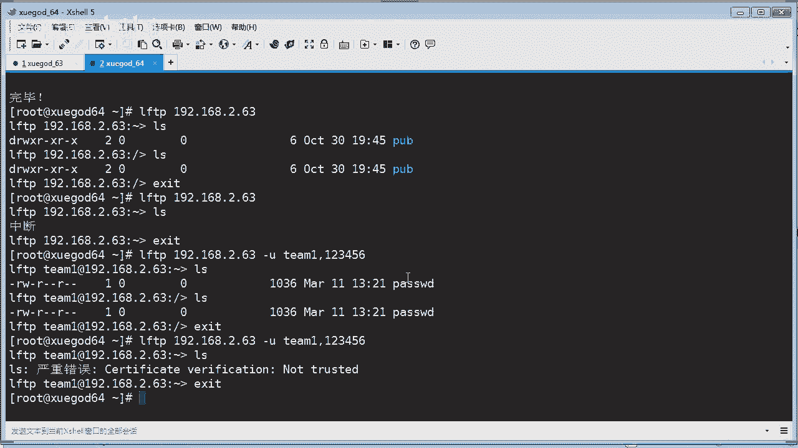

在实现了安全的FTP文件传输后，我们来看另一种在Linux系统间共享文件的常用方式——NFS。NFS允许我们将远程服务器的目录挂载到本地，像访问本地文件夹一样访问其中的文件。

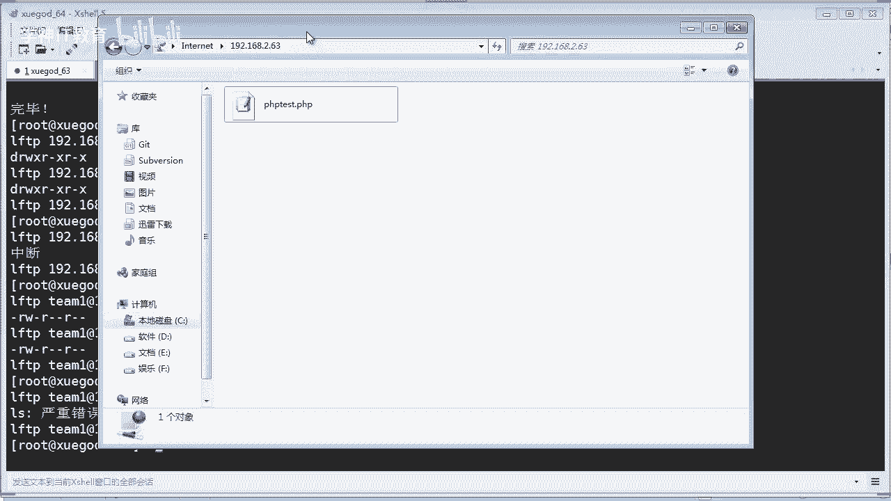

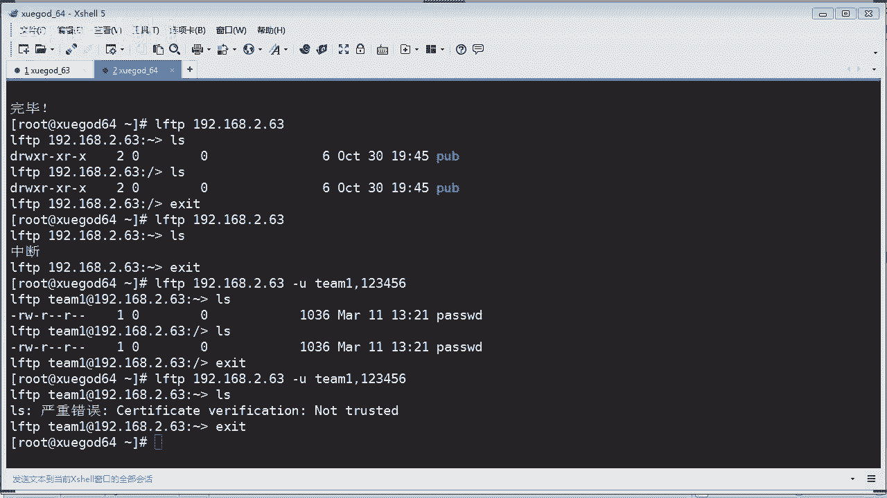

---

## 📁 NFS网络文件系统配置

NFS（Network File System）是一种支持网络文件共享的协议。它默认使用TCP 2049端口。配置NFS主要分为服务端（共享目录）和客户端（挂载目录）两部分。

### 安装与启动NFS服务

首先，在作为服务端的机器上安装NFS所需的软件包：

```bash
yum install -y nfs-utils rpcbind
```

安装完成后，启动相关服务并设置为开机自启：

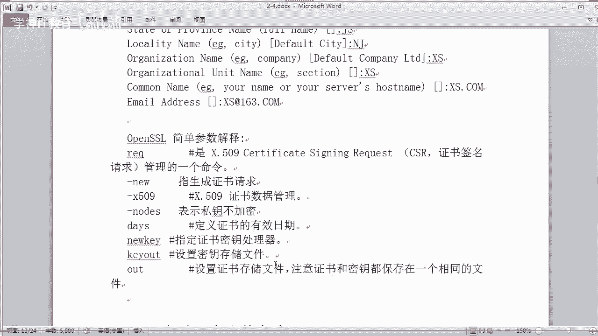

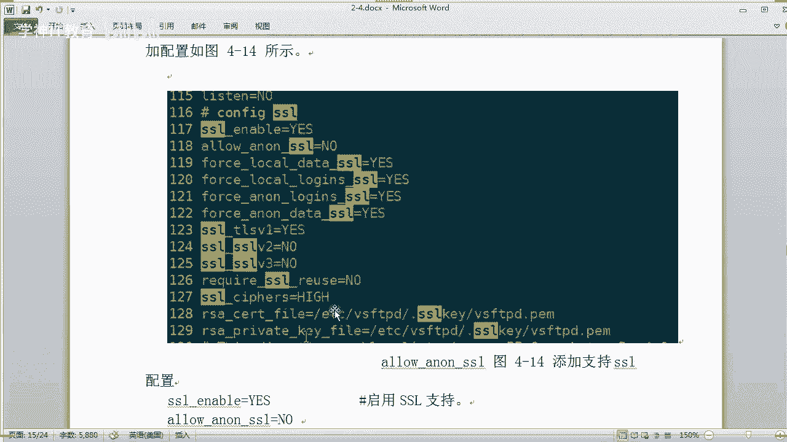

```bash
systemctl start rpcbind
systemctl start nfs
systemctl enable rpcbind
systemctl enable nfs
```

可以使用以下命令检查NFS服务端口是否正常监听：

```bash
netstat -tlnp | grep 2049
```

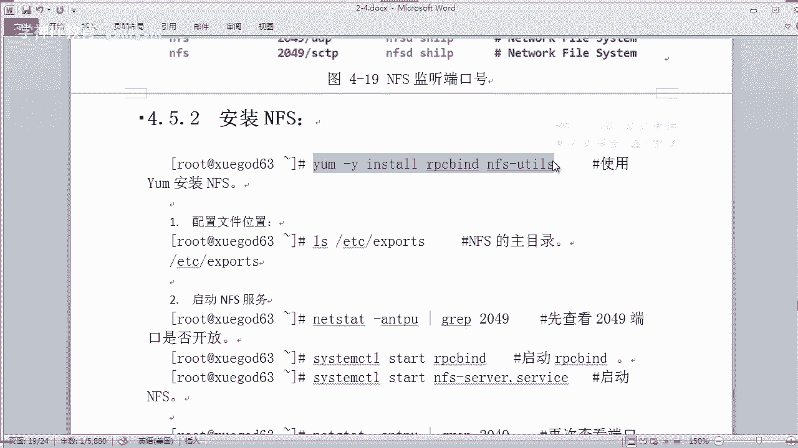

### 配置NFS共享目录

NFS的共享配置通过 `/etc/exports` 文件定义。例如，我们要将 `/opt` 目录共享给所有客户端，并赋予读写权限。

编辑 `/etc/exports` 文件：

```
/opt *(rw)
```

其中：
*   `/opt` 是要共享的目录。
*   `*` 表示允许所有IP地址的客户端访问。
*   `(rw)` 表示授予读写权限。

保存文件后，需要让配置生效。可以重启NFS服务，或者使用 `exportfs` 命令：

```bash
exportfs -rv
```

然后查看当前共享的目录列表：

```bash
showmount -e localhost
```

### 在客户端挂载NFS共享

在另一台作为客户端的Linux机器上，我们同样需要安装 `nfs-utils` 包。然后，将服务端共享的目录挂载到本地。

例如，将服务端（IP: 192.168.2.63）的 `/opt` 目录挂载到本地的 `/mnt/nfs` 目录：

```bash
mount -t nfs 192.168.2.63:/opt /mnt/nfs
```

挂载成功后，在客户端访问 `/mnt/nfs`，就能看到服务端 `/opt` 目录下的所有文件。

### 设置开机自动挂载

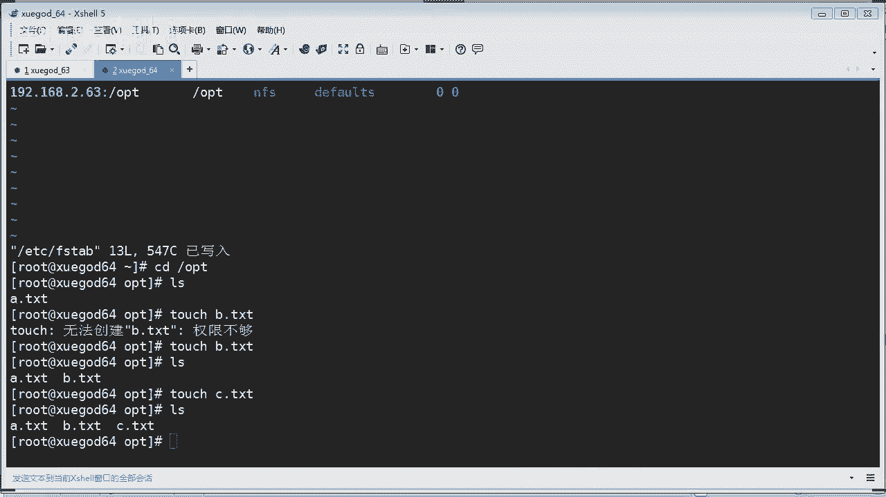

为了实现重启后自动挂载，我们需要将挂载信息写入 `/etc/fstab` 文件。

编辑 `/etc/fstab`，添加如下一行：

```
192.168.2.63:/opt /mnt/nfs nfs defaults 0 0
```

### 解决NFS挂载的权限问题

在客户端向挂载的NFS目录写入文件时，可能会遇到“权限不够”的错误。这是因为NFS服务默认以一个特定用户（通常是 `nfsnobody`）的身份运行。

解决方法是在服务端，修改共享目录的所有者为 `nfsnobody`：

```bash
chown -R nfsnobody:nfsnobody /opt
```

修改后，客户端即可正常进行读写操作。

### NFS配置参数与挂载优化

在 `/etc/exports` 配置文件中，可以添加更多参数以实现精细控制。以下是一些常用参数示例：

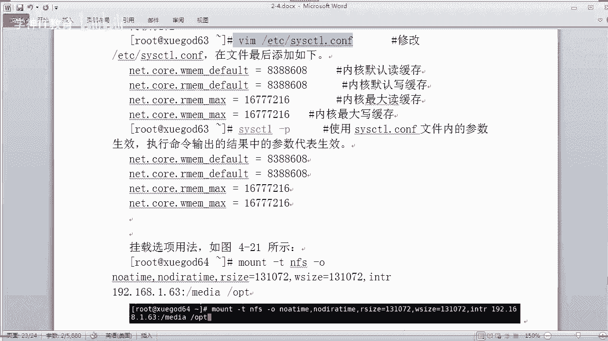

*   **指定网段和权限**：`192.168.1.0/24(rw,sync)` 表示只允许192.168.1.0网段的客户端读写，并且数据同步写入内存和硬盘。
*   **root权限映射**：`*(rw,no_root_squash)` 表示客户端的root用户在共享目录中保持root权限（慎用）。

在客户端挂载时，也可以通过 `-o` 选项添加参数来优化性能或功能：

```bash
mount -t nfs -o noatime,nodiratime,rsize=32768,wsize=32768 192.168.2.63:/opt /mnt/nfs
```

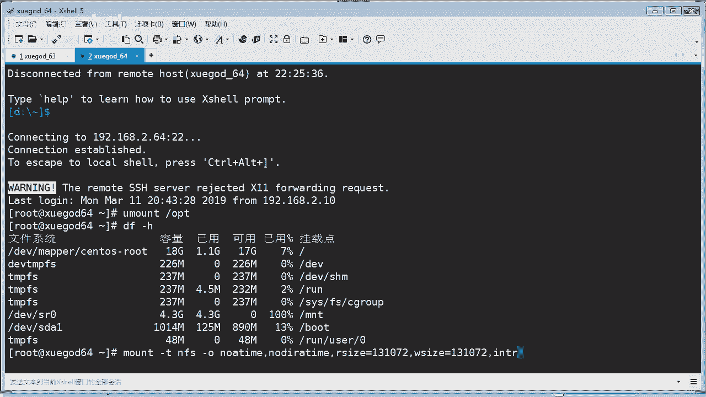

常用优化参数解释：
*   `noatime`：不更新文件的访问时间，可以减少I/O操作，提升性能。
*   `nodiratime`：不更新目录的访问时间。
*   `rsize/wsize`：设置读取和写入的数据块大小，影响传输性能。

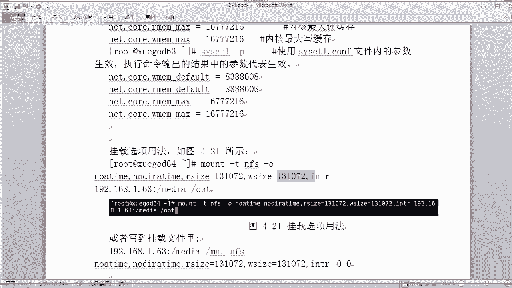

对于高并发环境，还可以在内核层面调整NFS的缓存参数，编辑 `/etc/sysctl.conf` 文件并执行 `sysctl -p` 生效。

---

## ✅ 总结

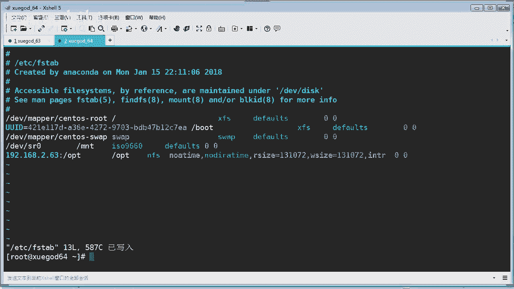

本节课中我们一起学习了两个重要的网络服务配置：
1.  **FTP over SSL**：我们使用OpenSSL生成了自签名证书，并配置了VSFTPD服务，实现了FTP数据传输的加密，显著提升了安全性。
2.  **NFS网络文件系统**：我们完成了NFS服务端的安装与共享目录配置，并在客户端成功挂载使用。此外，还了解了如何设置开机自动挂载、解决权限问题以及进行基本的挂载参数优化。

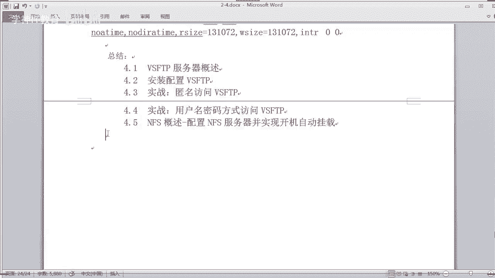

通过本章的学习，你掌握了在Linux环境下实现安全文件传输和便捷文件共享的两种实用技能。