# MySQL基础教程：01：SQL基础与数据库操作 🗄️

在本节课中，我们将学习SQL（结构化查询语言）的基础知识，了解其核心概念、语句结构，并掌握MySQL中最基本的数据库和表操作。

---

## 什么是SQL？ 🤔

结构化查询语言（Structured Query Language），简称SQL，是一种特殊目的的编程语言。它用于存储数据、查询、更新和管理关系型数据库系统。SQL也是一种数据库脚本文件的扩展名，通常以 `.sql` 结尾。

从上述定义可以看出，与数据库相关的岗位主要有两种：
*   **DBA**：数据库管理员，负责数据库的运维和管理。
*   **DBD**：数据库开发人员，负责编写SQL脚本和数据库逻辑。

SQL标准最初由美国国家标准局制定，后由国际标准化组织（ISO）颁布为国际标准。常见的数据库软件如Oracle、MySQL、SQL Server等都遵循SQL标准。

---

## 常见的SQL语句类型 📝

以下是SQL语句的六大分类，理解这些分类有助于我们系统地学习。

### 1. 数据查询语言（DQL）
数据查询语言用于从数据库表中检索数据，确定数据如何展示。其核心关键字是 **`SELECT`**。
*   其他常用关键字：`WHERE`, `ORDER BY`, `GROUP BY`, `HAVING`。

### 2. 数据操作语言（DML）
数据操作语言用于对表中的数据进行“增、删、改”操作。
*   核心动词：**`INSERT`**（插入）、**`UPDATE`**（更新）、**`DELETE`**（删除）。

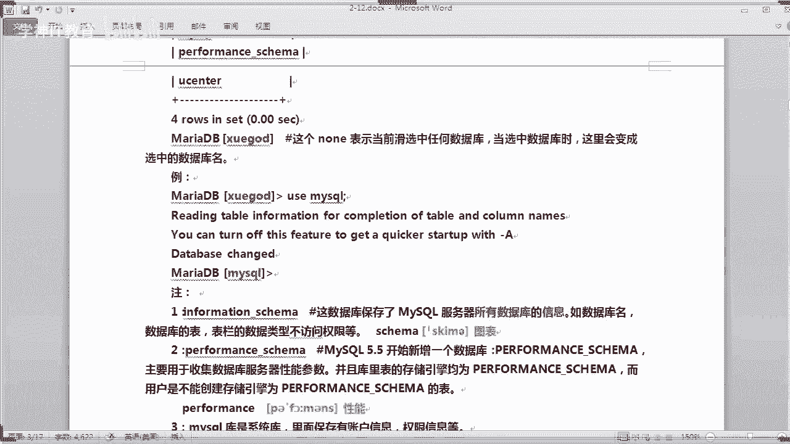

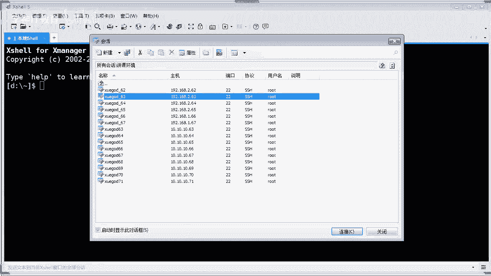

### 3. 事务处理语言（TPL）
事务处理语言用于将多条SQL语句组合成一个整体（事务），确保数据操作的完整性和一致性。
*   常用语句：`BEGIN TRANSACTION`, `COMMIT`, `ROLLBACK`。

### 4. 数据控制语言（DCL）
数据控制语言用于控制数据库的访问权限。
*   核心动词：**`GRANT`**（授权）、**`REVOKE`**（撤销权限）。

### 5. 数据定义语言（DDL）
数据定义语言用于定义和修改数据库结构，如创建、删除、修改表。
*   核心动词：**`CREATE`**（创建）、**`DROP`**（删除）、**`ALTER`**（修改）。

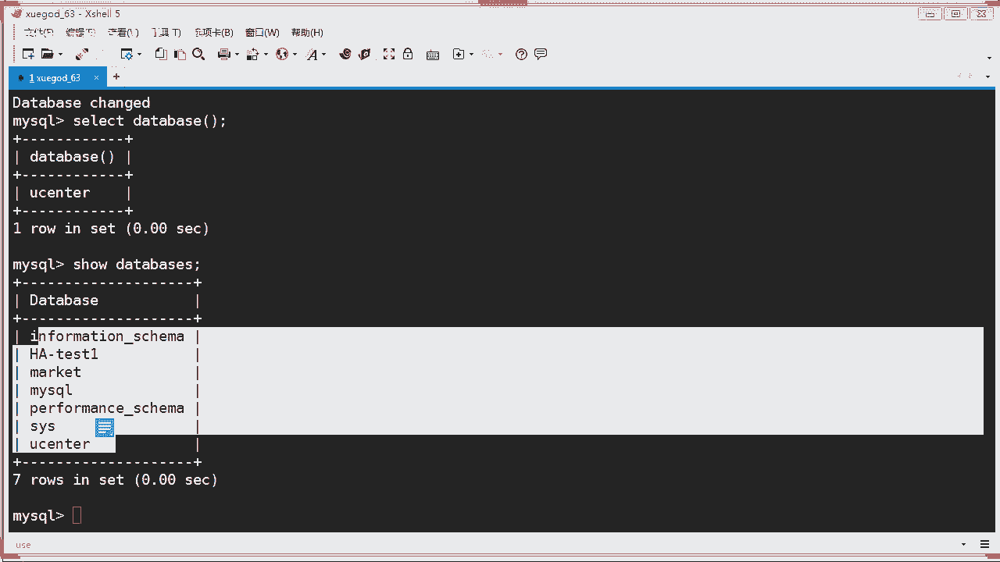

### 6. 指针控制语言（CCL）
指针控制语言用于在数据库编程中声明变量、控制游标等，通常在存储过程中使用。
*   常用语句：`DECLARE CURSOR`, `FETCH INTO`。

学习时无需死记硬背，重在理解每类语言的作用和常用关键字。

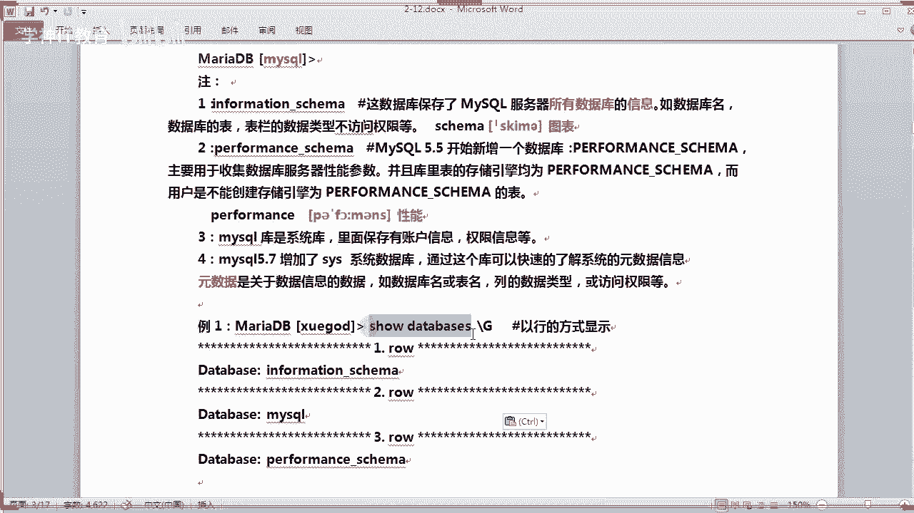

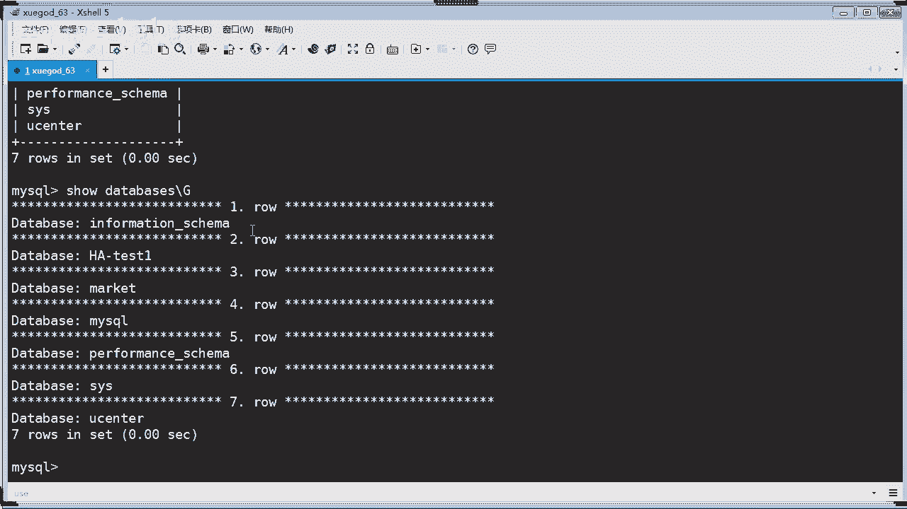

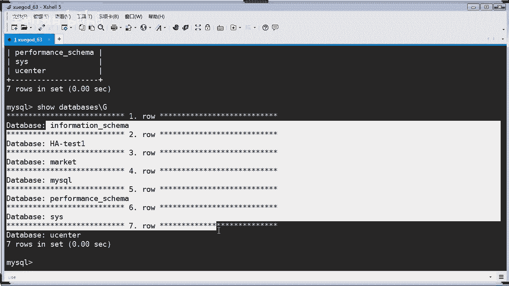

---

## 数据库的基本概念 🗃️

数据库是一个有组织的数据集合。我们可以用一个比喻来理解：
*   **数据库服务器**：相当于存放档案的“档案柜”（硬件）。
*   **数据库**：相当于档案柜中的“抽屉”。
*   **表**：相当于抽屉里的“文件”。
*   **表中的记录**：相当于文件里的“每一条信息”。

---

## MySQL基础操作实践 🛠️

上一节我们介绍了SQL的基本概念，本节中我们来看看如何在MySQL中进行实际操作。

### 连接MySQL数据库

使用以下命令登录MySQL服务器：
```bash
mysql -u root -p
```
*   `-u`：指定用户名。
*   `-p`：提示输入密码（为安全起见，密码不直接显示在命令中）。
*   如需连接远程数据库，可加上 `-h` 参数指定主机地址。

登录时可直接指定要使用的数据库：
```bash
mysql -u root -p database_name
```
也可以在登录后执行单条SQL命令：
```bash
mysql -u root -p -e "SHOW DATABASES;"
```

### 查看与切换数据库

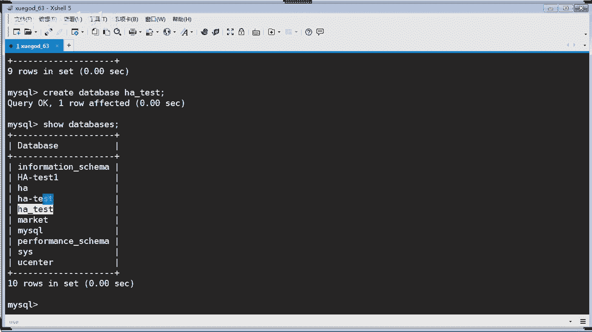

以下是查看和切换数据库的常用命令。

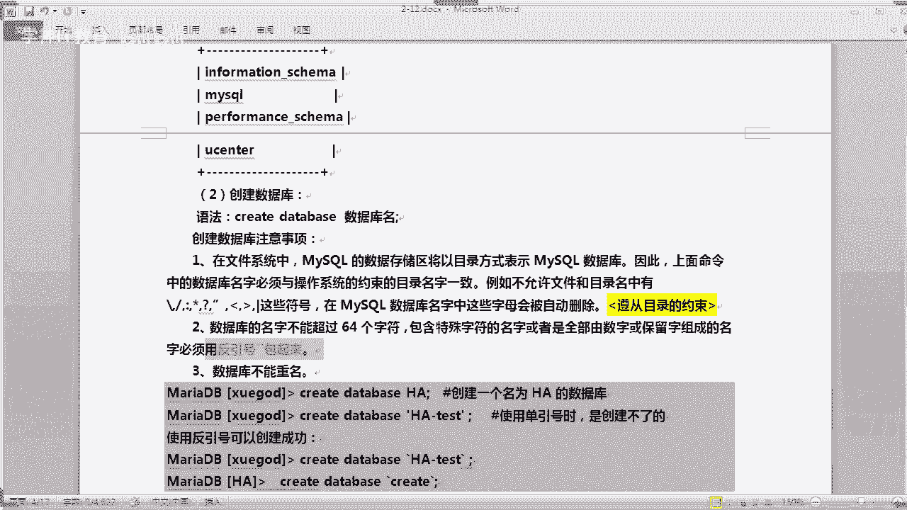

*   **查看所有数据库**：`SHOW DATABASES;`
*   **查看当前使用的数据库**：`SELECT DATABASE();`
*   **切换/使用某个数据库**：`USE database_name;`

MySQL 5.7 默认包含以下几个系统数据库：
*   `information_schema`：保存了MySQL服务器所有数据库的元数据信息。
*   `mysql`：最重要的系统库，存储账户和权限信息。
*   `performance_schema`：用于收集数据库服务器性能参数。
*   `sys`：5.7版本新增，提供更便捷的系统元数据访问视图。

### 创建数据库

使用 `CREATE DATABASE` 语句创建数据库。
```sql
CREATE DATABASE ha;
```
创建时，可以指定字符集等属性，更严谨的写法是：
```sql
CREATE DATABASE IF NOT EXISTS `ha` DEFAULT CHARACTER SET utf8;
```
**注意事项**：
1.  数据库名需遵循操作系统目录命名规则，不能包含 `/`、`\`、`:`、`*`、`?`、`"`、`<`、`>`、`|` 等特殊字符。
2.  数据库名长度不能超过64个字符。
3.  若名称包含特殊字符、纯数字或是SQL保留关键字（如 `SELECT`、`CREATE`），必须使用反引号 **`` ` ``** 包裹。

### 删除数据库

使用 `DROP DATABASE` 语句删除数据库。**此操作不可逆，请谨慎使用！**
```sql
DROP DATABASE ha;
```
建议使用判断语句，避免因数据库不存在而报错：
```sql
DROP DATABASE IF EXISTS ha;
```

---

## 数据表的基本操作 📊

数据库创建好后，我们可以在其中创建表来存储数据。

### 创建表

首先，使用 `USE` 命令进入目标数据库，然后使用 `CREATE TABLE` 语句创建表。
```sql
USE ha_test;
CREATE TABLE student (
    id INT(20),
    name VARCHAR(20),
    age INT
);
```
以上语句创建了一个名为 `student` 的表，包含三个字段：`id`（整数）、`name`（可变长度字符串）、`age`（整数）。

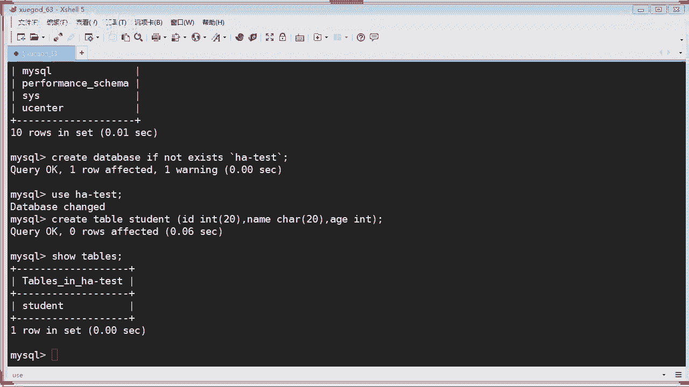

### 查看表结构与信息

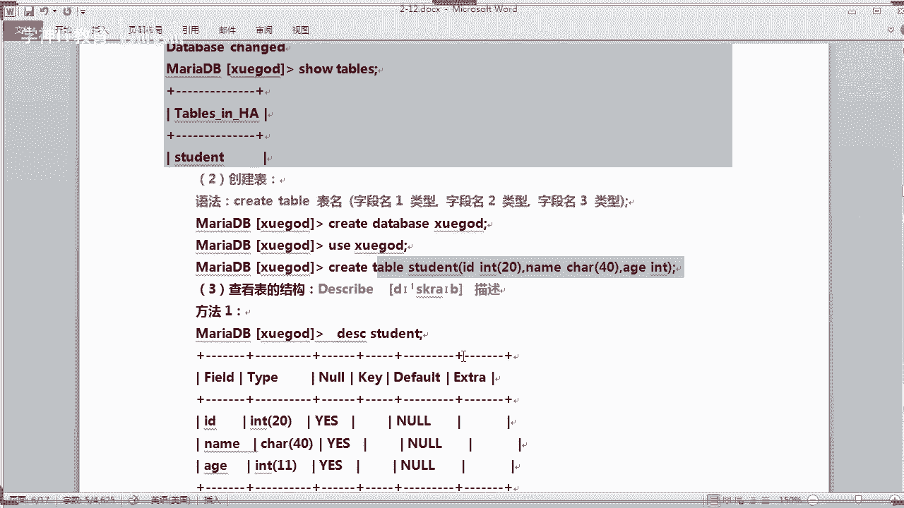

创建表后，可以通过多种方式查看其结构。

*   **查看当前数据库的所有表**：`SHOW TABLES;`
*   **查看表结构（最常用）**：`DESC student;` 或 `DESCRIBE student;`
*   **查看创建表的SQL语句**：`SHOW CREATE TABLE student\G` （`\G` 使结果以更清晰的行的方式显示）
*   **跨库查看表结构**：`DESC mysql.user;`

### 删除表

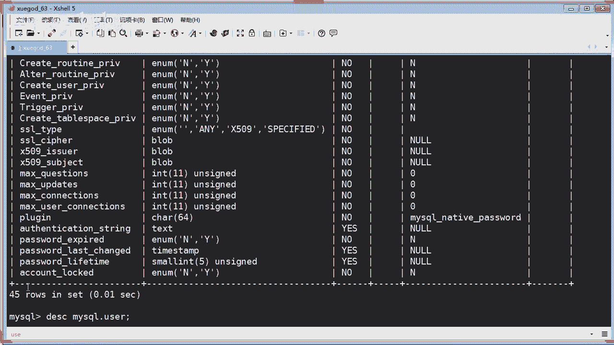

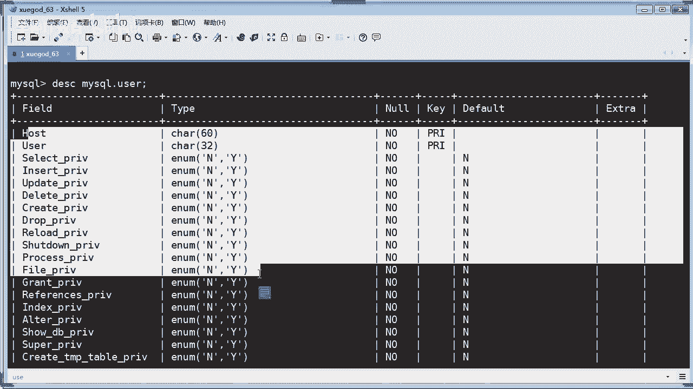

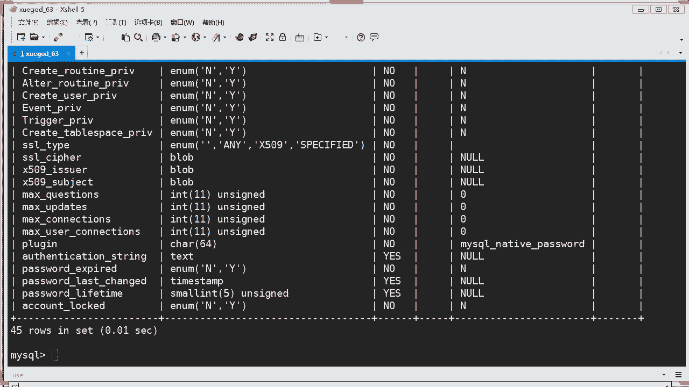

使用 `DROP TABLE` 语句删除表。同样，这是一个危险操作。
```sql
DROP TABLE student;
```
更安全的写法是：
```sql
DROP TABLE IF EXISTS student;
```

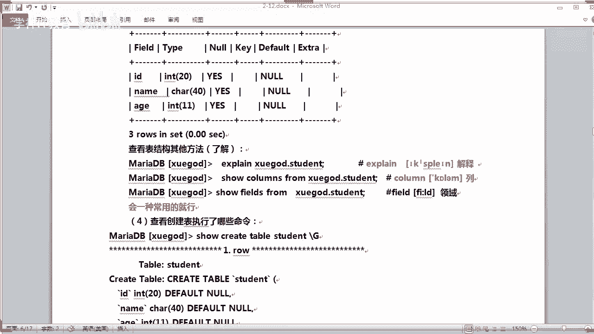

---

## 总结 📚

本节课中我们一起学习了SQL和MySQL的基础知识：
1.  **SQL概述**：了解了SQL是一种用于管理关系型数据库的编程语言及其主要分类（DQL, DML, DDL等）。
2.  **数据库操作**：掌握了如何连接MySQL、查看/切换数据库、以及使用 `CREATE DATABASE` 和 `DROP DATABASE` 创建和删除数据库，并学习了命名约束和安全写法。
3.  **数据表操作**：学会了在数据库中创建表（`CREATE TABLE`）、查看表信息（`DESC`, `SHOW CREATE TABLE`）以及删除表（`DROP TABLE`）的基本命令。

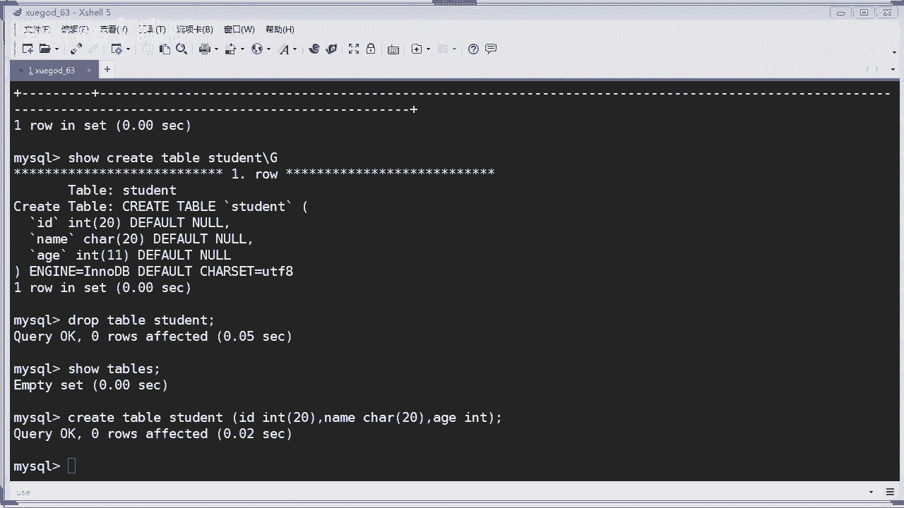

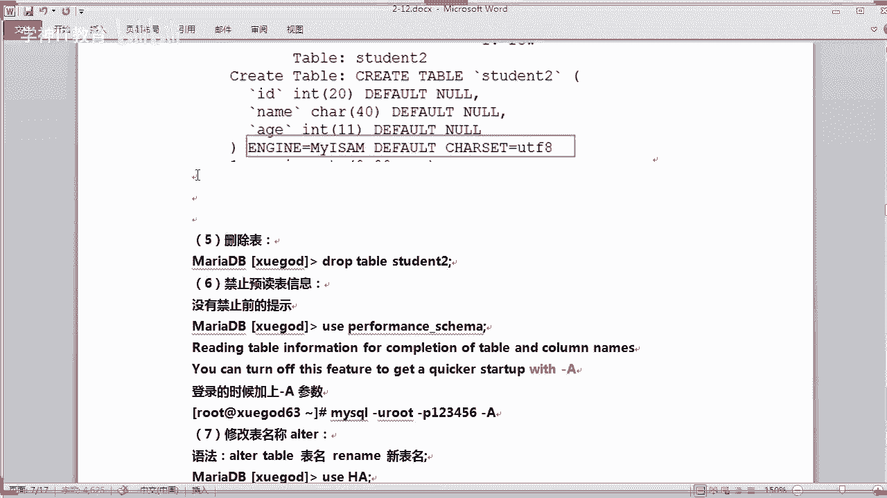

这些是操作MySQL的基石，后续更复杂的数据查询和操作都将在此基础上进行。请务必在理解的基础上多加练习。