# MySQL基础教程：02：表操作与数据管理

在本节课中，我们将学习如何修改数据库表的结构，以及如何对表中的数据进行增、删、改、查等基本操作。这是管理数据库内容的核心技能。

## 登录数据库时隐藏提示信息

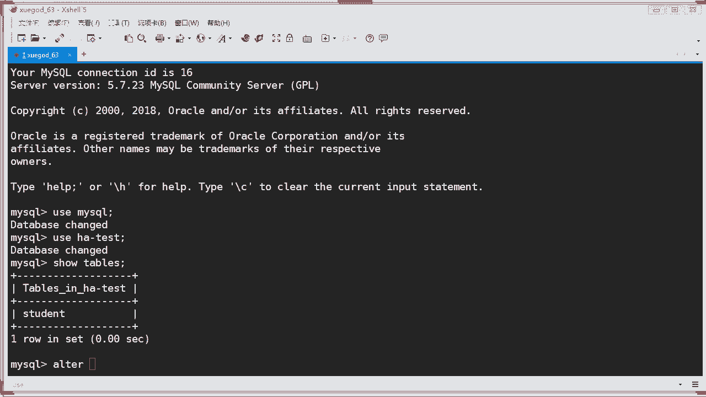

在登录MySQL时，系统默认会显示一些易读的表信息。如果你不希望看到这些提示，可以在登录命令后加上 `-A` 参数。

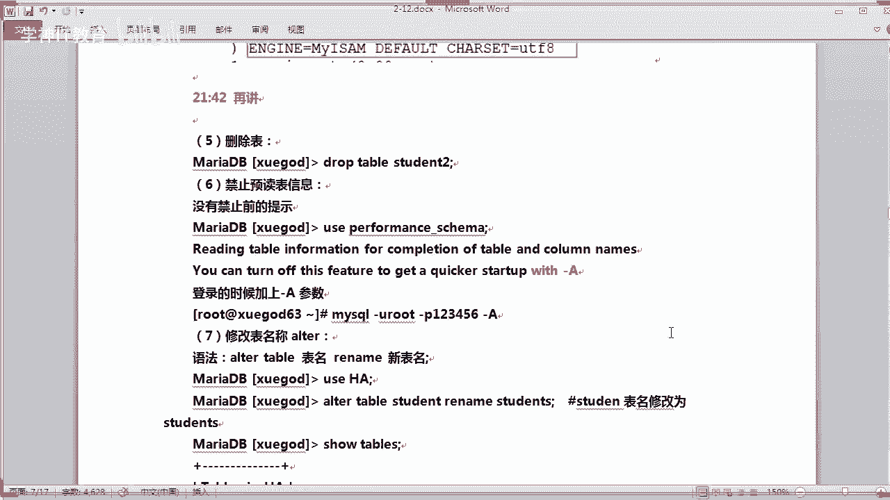

```bash
mysql -u root -p -A
```

执行此命令后，将直接进入数据库，不再显示易读表信息。

## 修改表结构

上一节我们介绍了如何创建和删除表。本节中，我们来看看如何修改一个已存在的表。

### 重命名表

要修改表的名称，可以使用 `ALTER TABLE` 语句配合 `RENAME` 关键字。`ALTER` 属于数据定义语言（DDL），因为它会重新定义表的结构。

例如，将表 `student` 重命名为 `students`：

```sql
ALTER TABLE student RENAME TO students;
```

执行后，表的名称被修改，但表结构保持不变。

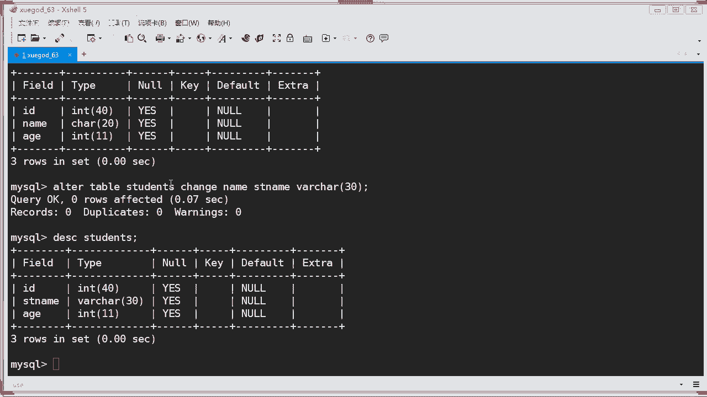

### 修改字段类型与长度

如果需要修改表中某个字段的数据类型或长度，可以使用 `ALTER TABLE` 语句配合 `MODIFY` 关键字。

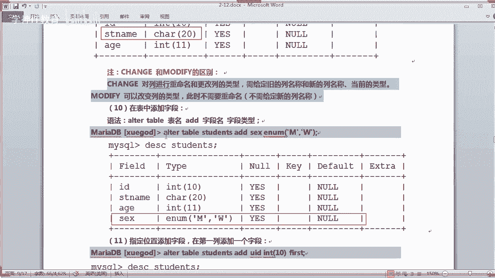

例如，将 `students` 表中 `id` 字段的长度从 20 修改为 40：

```sql
ALTER TABLE students MODIFY id INT(40);
```

### 重命名字段并修改其属性

如果要同时修改字段的名称、类型和长度，需要使用 `CHANGE` 关键字。你需要指定旧字段名和新字段名。

例如，将 `students` 表中的 `name` 字段重命名为 `st_name`，并将其类型改为 `VARCHAR(30)`：

```sql
ALTER TABLE students CHANGE name st_name VARCHAR(30);
```

以下是 `CHANGE` 和 `MODIFY` 关键字的区别总结：
*   **CHANGE**：可以对列进行重命名和更改列的类型，需要给定旧的列名和新的列名。
*   **MODIFY**：可以改变列的类型和长度，但不能用于重命名列。

### 为表增加字段

在实际工作中，经常需要为已有的表添加新的字段。这可以通过 `ALTER TABLE` 语句配合 `ADD` 关键字实现。

例如，为 `students` 表增加一个表示性别的字段 `sex`，其类型为枚举（ENUM），只能取 ‘M’（男）或 ‘W’（女）两个值：

```sql
ALTER TABLE students ADD sex ENUM('M', 'W');
```

默认情况下，新增的字段会排在所有现有字段之后。

#### 指定新增字段的位置

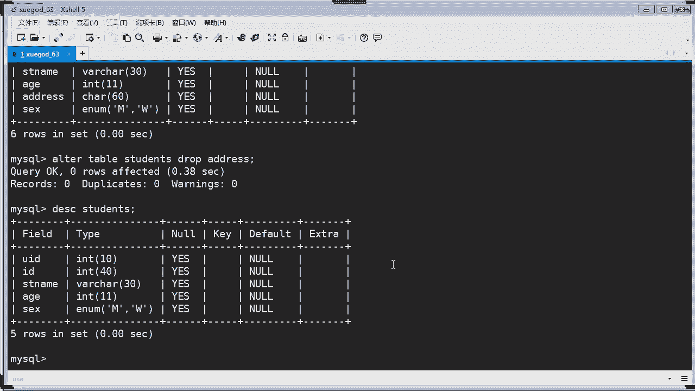

你可以指定新字段添加在表的什么位置。

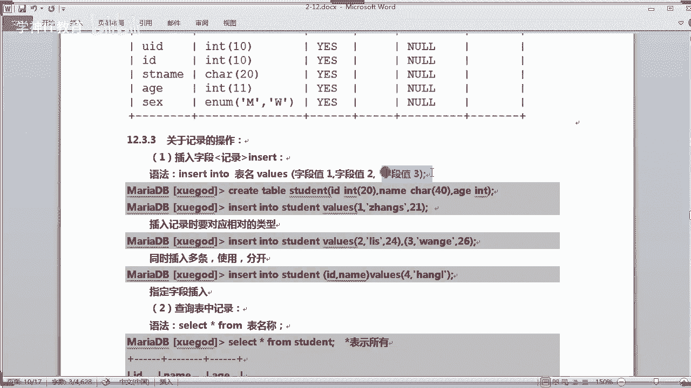

*   **添加到第一列**：使用 `FIRST` 关键字。
    ```sql
    ALTER TABLE students ADD uid INT(10) FIRST;
    ```
*   **添加到指定列之后**：使用 `AFTER` 关键字。
    ```sql
    ALTER TABLE students ADD address VARCHAR(60) AFTER age;
    ```

### 删除表中的字段

要删除表中的一个字段（注意：这会删除该字段下的所有数据），可以使用 `DROP` 关键字。

例如，删除 `students` 表中的 `address` 字段：

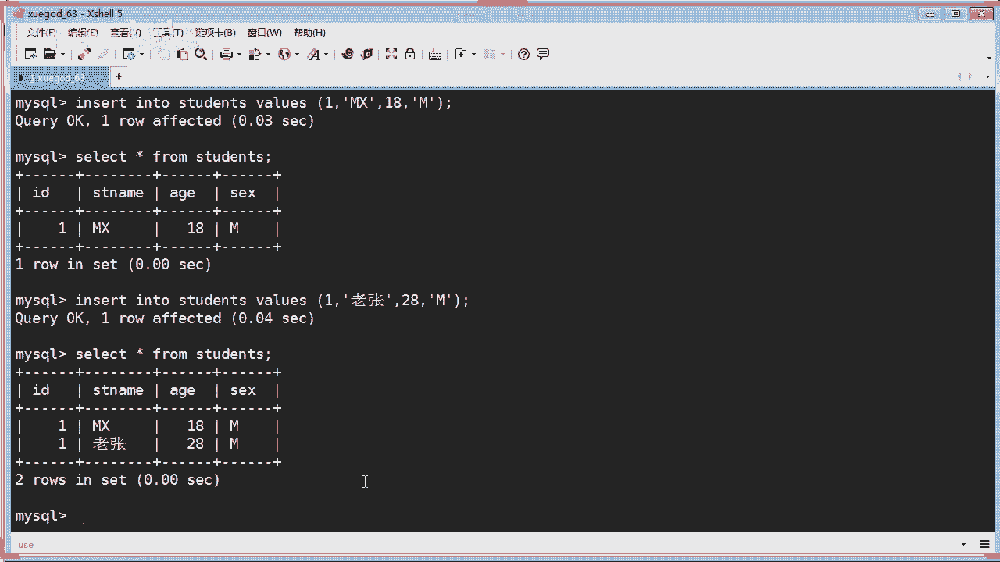

```sql
ALTER TABLE students DROP address;
```

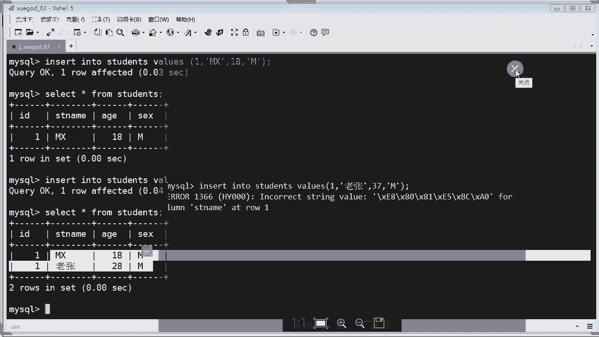

## 管理表数据

在定义了表结构之后，接下来我们学习如何操作表中的数据。

### 插入数据

向表中插入数据使用 `INSERT INTO` 语句。

以下是插入数据的基本语法：
```sql
INSERT INTO table_name (column1, column2, ...) VALUES (value1, value2, ...);
```

#### 插入完整行数据

为 `students` 表的所有字段插入一条记录：
```sql
INSERT INTO students VALUES (1, ‘MX‘, 18, ‘M‘);
```
字符串类型的值需要用引号括起来。

#### 插入多行数据

可以一次性插入多条记录，用逗号分隔：
```sql
INSERT INTO students VALUES (2, ‘老张‘, 28, ‘M‘), (3, ‘老K‘, 38, ‘M‘);
```

#### 插入指定字段的数据

如果只想为部分字段插入数据，必须在语句中明确指定这些字段名。
```sql
INSERT INTO students (st_name) VALUES (‘MK‘);
```
未被指定的字段将自动填入空值（NULL），前提是该字段允许为空。

### 删除数据

从表中删除数据使用 `DELETE FROM` 语句。**务必谨慎使用，最好先备份数据。**

#### 删除特定行

使用 `WHERE` 子句指定删除条件，只删除满足条件的行。
```sql
DELETE FROM students WHERE id = 4;
```

#### 删除空值行

要删除某个字段值为空的记录，需使用 `IS NULL` 进行判断。
```sql
DELETE FROM students WHERE id IS NULL;
```

#### 使用复合条件删除

`WHERE` 子句可以组合多个条件。
*   **AND**：两个条件必须同时成立。
    ```sql
    DELETE FROM students WHERE id = 3 AND age = 48; -- 无满足条件的行，不删除
    ```
*   **OR**：两个条件满足其一即可。
    ```sql
    DELETE FROM students WHERE id = 3 OR age = 48; -- 删除 id=3 的行
    ```

### 更新数据

修改表中已有的数据使用 `UPDATE` 语句，同样需要配合 `WHERE` 子句来精确定位要修改的行。

例如，将 `students` 表中年龄为28岁的记录的性别改为 ‘W‘：
```sql
UPDATE students SET sex = ‘W‘ WHERE age = 28;
```

**警告**：如果不加 `WHERE` 条件，将更新表中**所有行**的该字段值。
```sql
UPDATE students SET sex = ‘W‘; -- 将所有记录的 sex 字段改为 ‘W‘
```

### 查询数据

查询数据是数据库最常用的操作，使用 `SELECT` 语句。

#### 基本查询

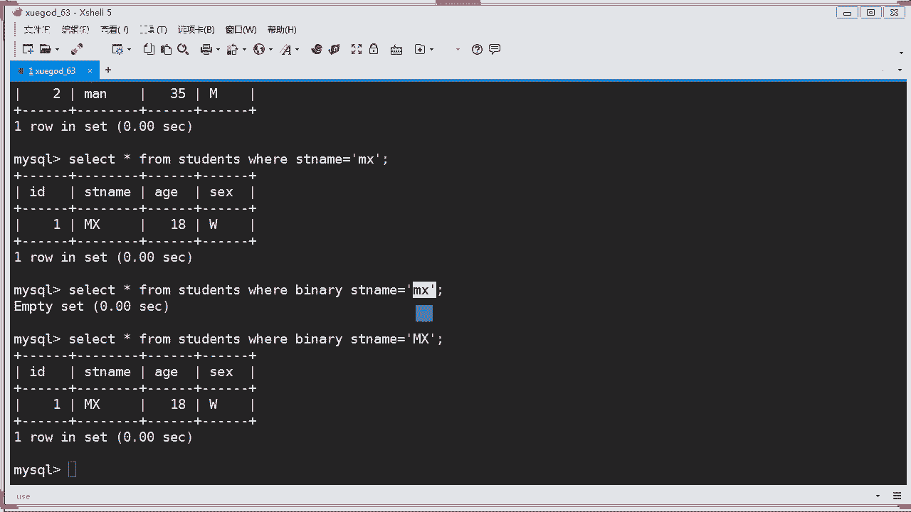

查询 `students` 表中的所有数据：
```sql
SELECT * FROM students;
```

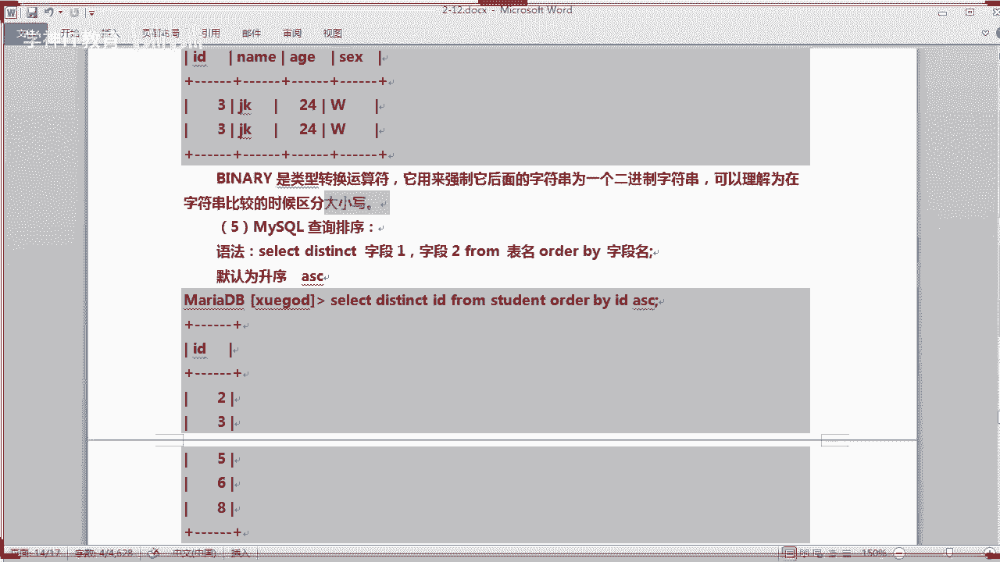

#### 查询指定列

只显示 `id` 和 `st_name` 列：
```sql
SELECT id, st_name FROM students;
```

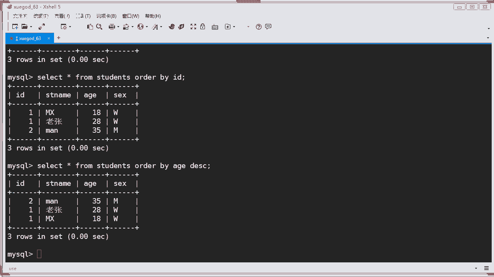

#### 去重查询

使用 `DISTINCT` 关键字去除查询结果中完全相同的行。
```sql
SELECT DISTINCT id FROM students;
```
合并多个字段去重时，会将这几个字段的组合视为一个整体。

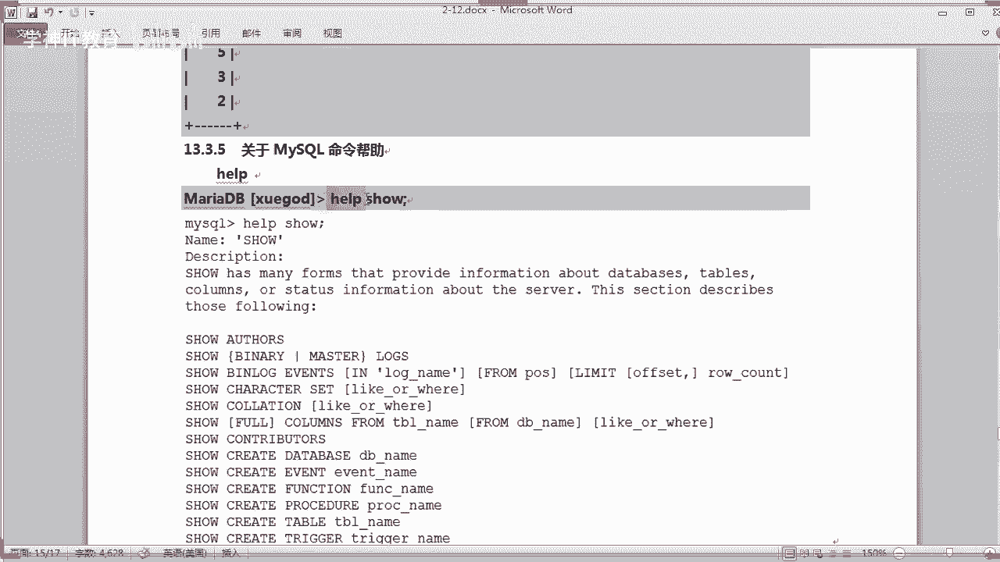

#### 条件查询

使用 `WHERE` 子句进行过滤。
```sql
SELECT * FROM students WHERE id = 1 AND age > 20;
```
可以使用 `=`、`>`、`<`、`>=`、`<=`、`!=` 或 `<>`（不等于）等运算符。

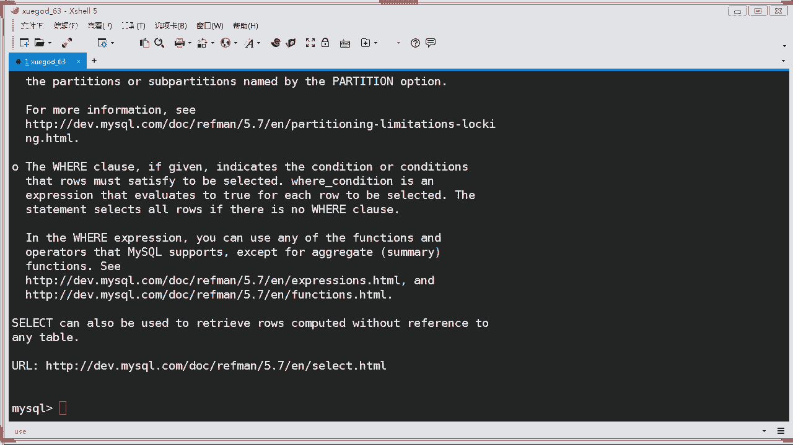

#### 区分大小写查询

默认情况下，MySQL 的字符串比较不区分大小写。如需区分，可使用 `BINARY` 关键字。
```sql
SELECT * FROM students WHERE BINARY st_name = ‘mx‘; -- 查不到 ‘MX‘
SELECT * FROM students WHERE BINARY st_name = ‘MX‘; -- 可以查到 ‘MX‘
```

#### 结果排序

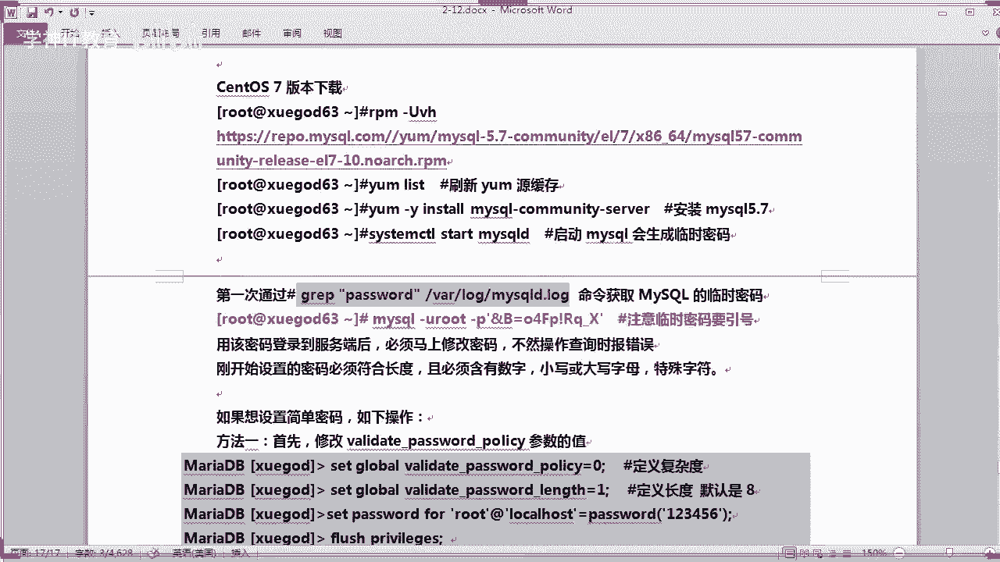

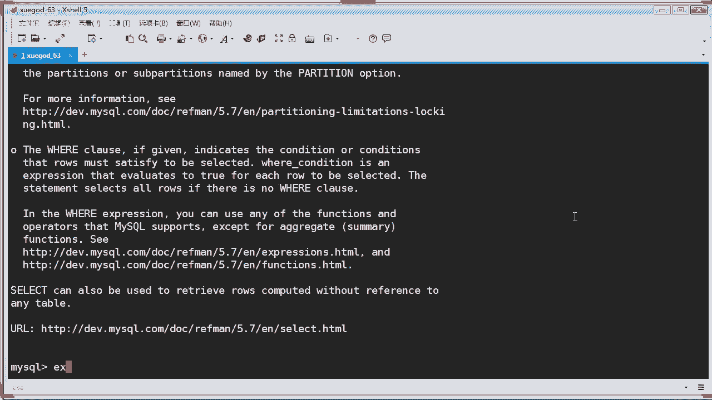

使用 `ORDER BY` 子句对查询结果进行排序。
*   **升序**：`ASC`（默认）。
    ```sql
    SELECT * FROM students ORDER BY age;
    ```
*   **降序**：`DESC`。
    ```sql
    SELECT * FROM students ORDER BY age DESC;
    ```

## 使用帮助文档

MySQL 提供了强大的帮助系统。如果你不确定某个命令的详细用法，可以使用 `HELP` 命令查询。
```sql
HELP SELECT;
```
这将显示 `SELECT` 语句的完整语法和选项说明。

## MySQL 5.7 安装注意事项

升级或安装 MySQL 5.7 版本时，需要注意以下两点：

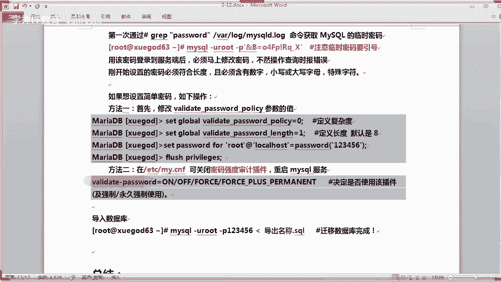

1.  **首次登录使用临时密码**：安装完成后，会在日志文件中生成一个临时密码。登录时，如果密码包含特殊字符，需要用引号括起来。
    ```bash
    mysql -u root -p‘临时密码‘
    ```

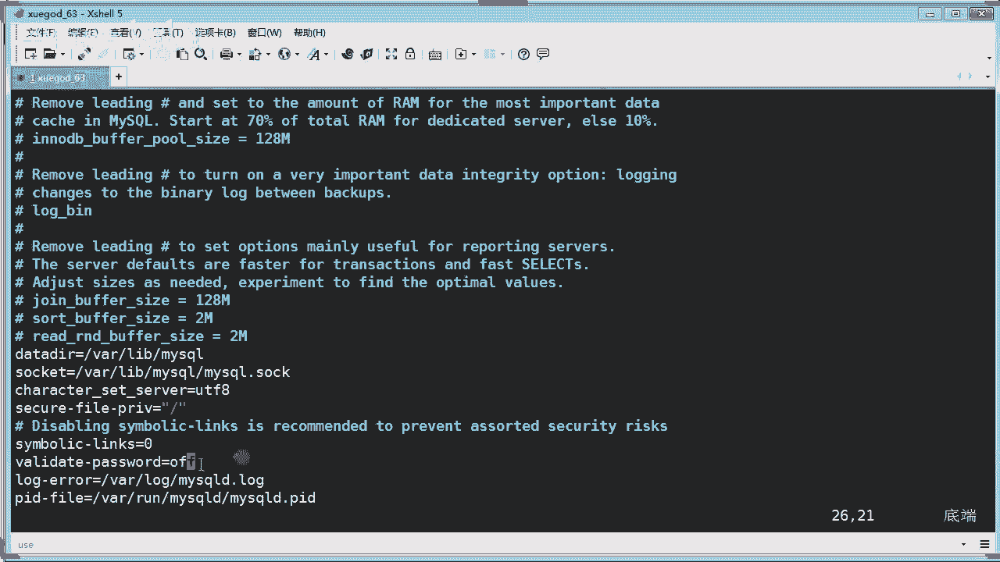

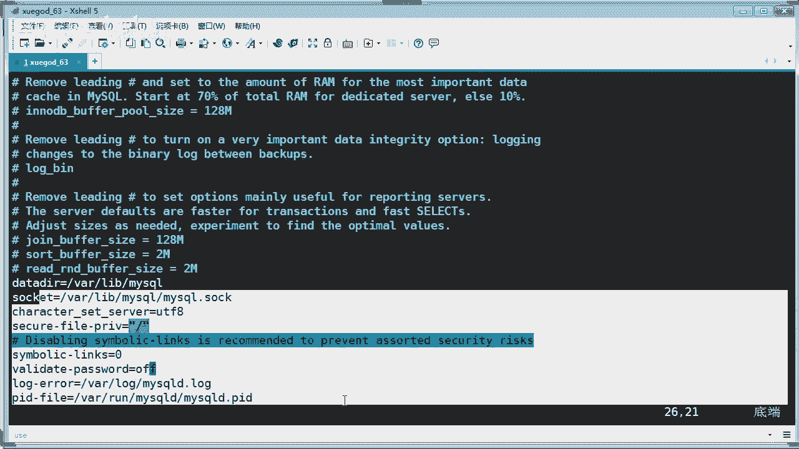

2.  **修改密码策略**：首次登录后，必须修改密码，且默认密码策略要求较高（需包含大小写字母、数字和特殊字符）。有两种方法简化：
    *   **方法一**：临时降低密码策略强度，然后修改密码。
        ```sql
        SET GLOBAL validate_password_policy=0;
        SET GLOBAL validate_password_length=4;
        SET PASSWORD = PASSWORD(‘123456‘);
        FLUSH PRIVILEGES;
        ```
    *   **方法二**：在 MySQL 配置文件（如 `my.cnf`）中禁用密码验证插件，然后重启 MySQL 服务。
        ```
        [mysqld]
        validate_password=OFF
        ```

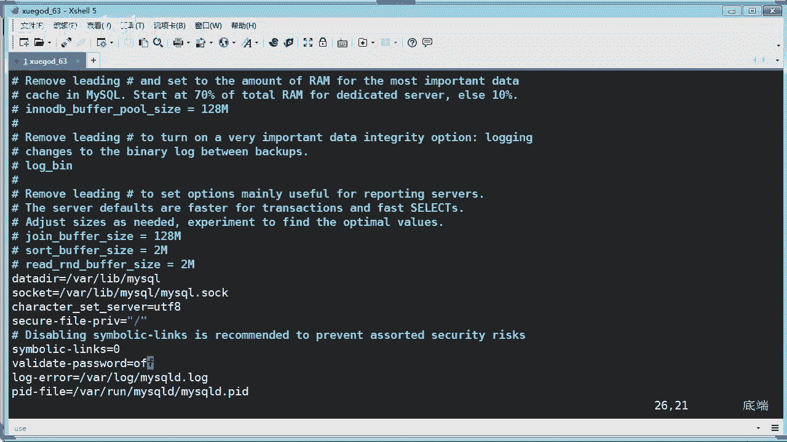

---

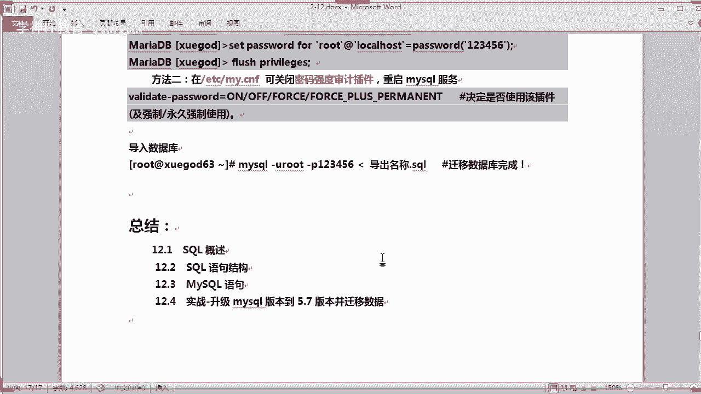

本节课中我们一起学习了如何修改表结构（重命名、增删改字段），以及如何对数据进行插入、删除、更新和查询。掌握这些基础的 SQL 语句是进行数据库管理和运维的关键第一步。