# Linux运维：RHCE：Apache安装与配置

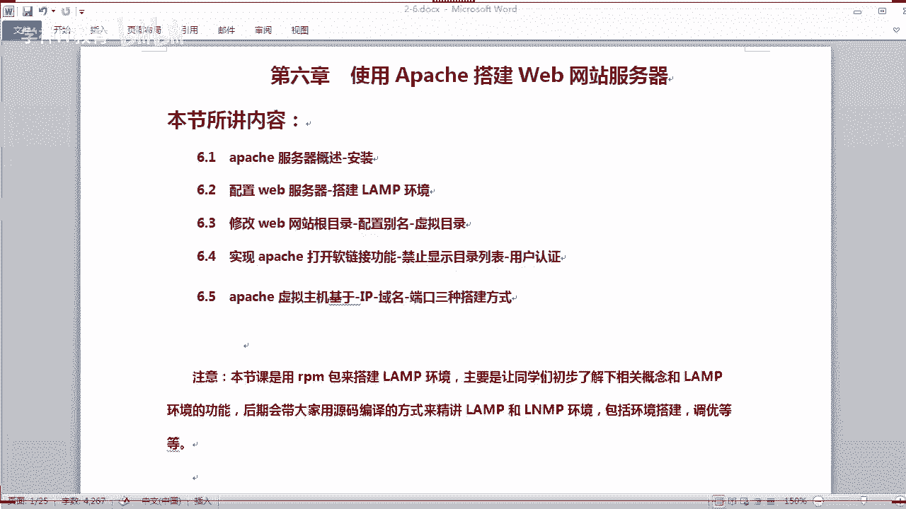

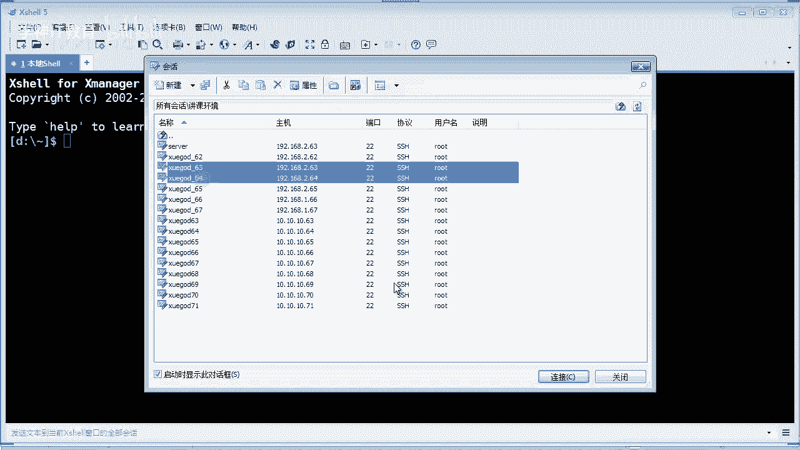

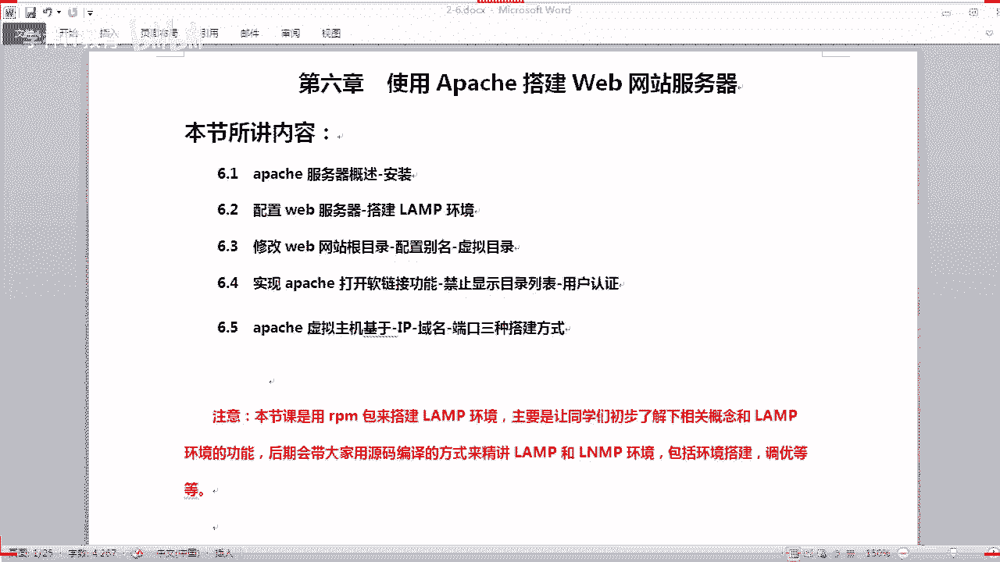

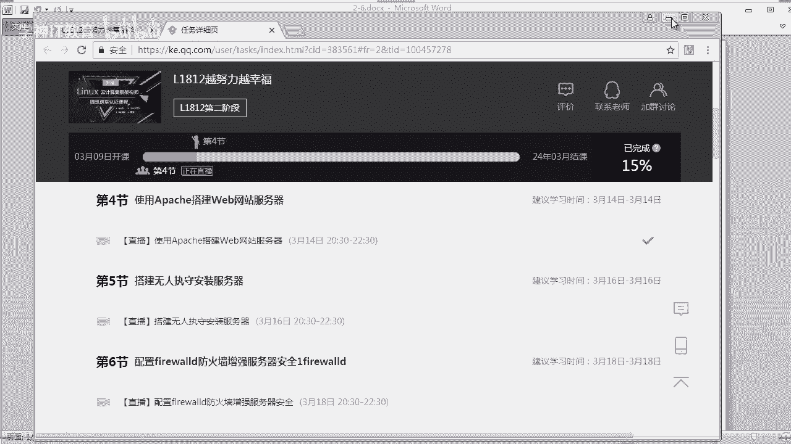

## 概述
在本节课中，我们将学习如何在Linux系统上使用RPM包安装和配置Apache Web服务器，并搭建基础的LAMP（Linux, Apache, MySQL/MariaDB, PHP）环境。这是构建动态网站最常用的解决方案之一。

---

## Apache Web服务器简介
Web服务器，也称为万维网服务器，主要功能是提供网上信息浏览服务。在Linux系统中，常见的Web服务器软件有Apache、Nginx和Tomcat等。本节课的主角是Apache。

Apache HTTP Server（简称Apache）是Apache软件基金会下的一个开源项目。它是一个模块化的、跨平台的网页服务器软件，因其快速、可靠和安全性而被广泛使用，是最流行的Web服务器软件之一。

LAMP是一组常被一起使用来搭建动态网站或服务器的开源软件，包括：
*   **L**inux 操作系统
*   **A**pache Web服务器
*   **M**ySQL/MariaDB 数据库
*   **P**HP 脚本语言

在CentOS 7及以上系统中，默认使用MariaDB作为MySQL的分支替代品。

---

## 安装Apache及相关软件
我们将使用YUM包管理器来安装Apache、MariaDB和PHP，这是最快捷的安装方式。

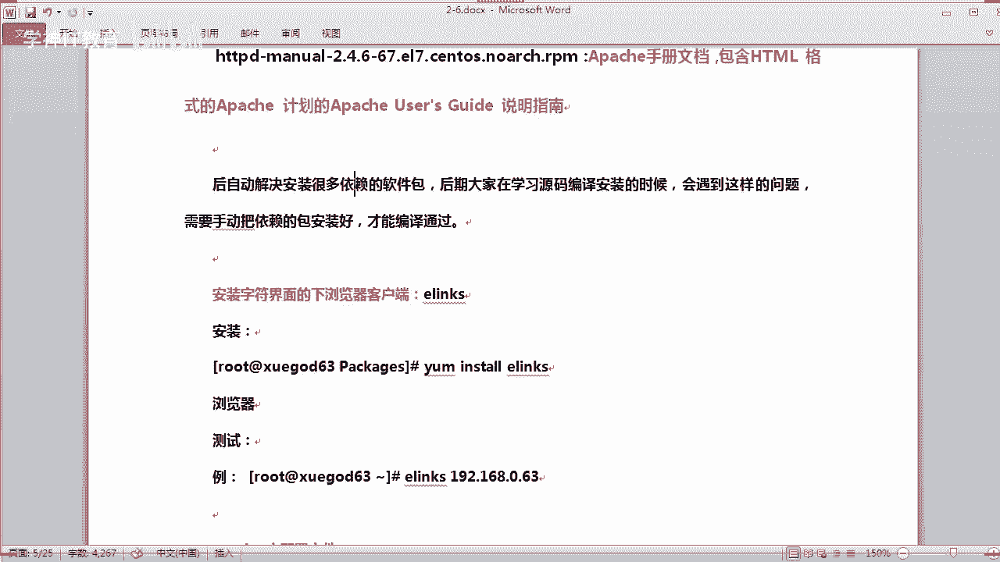

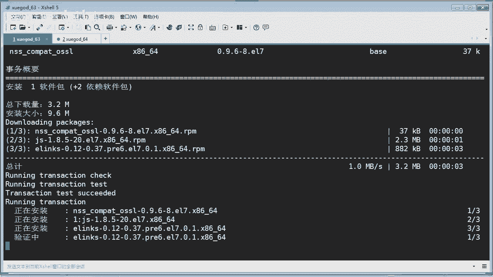

以下是安装命令：
```bash
yum -y install httpd
yum -y install elinks
yum -y install mariadb mariadb-server
yum -y install php php-mysql
```

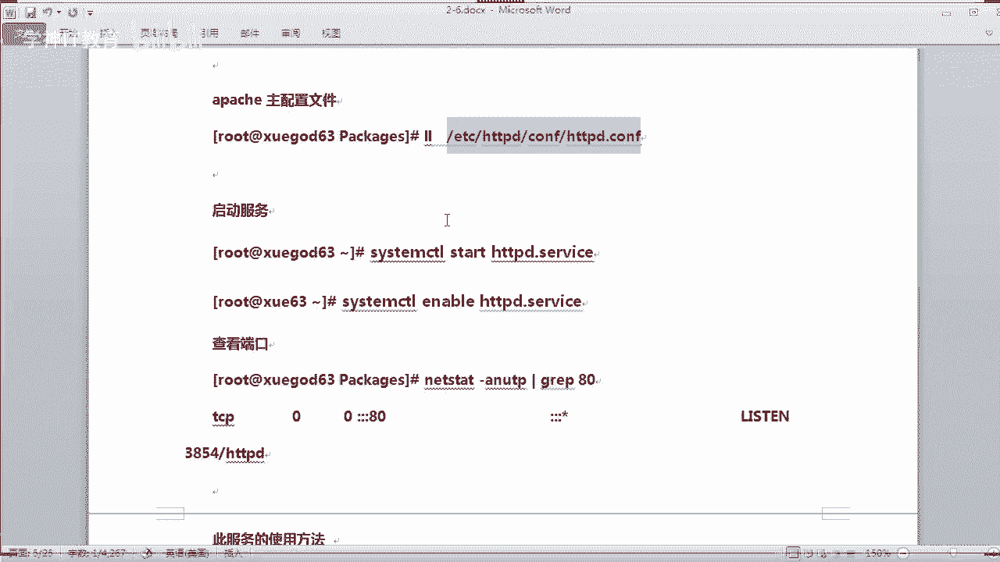

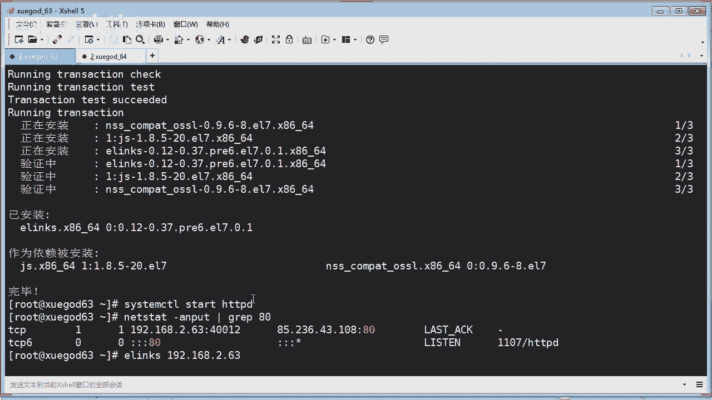

**命令解析：**
*   `yum -y install httpd`：安装Apache主程序包及其依赖。
*   `yum -y install elinks`：安装一个字符界面下的浏览器，方便在服务器上测试网页。
*   `yum -y install mariadb mariadb-server`：安装MariaDB数据库的客户端和服务端。
*   `yum -y install php php-mysql`：安装PHP环境以及连接MySQL数据库的驱动模块。

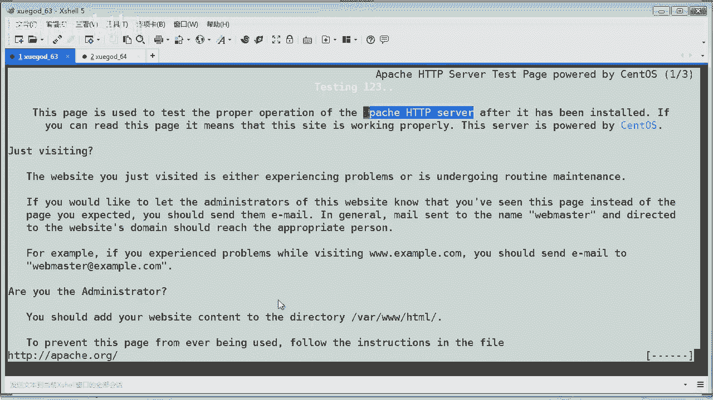

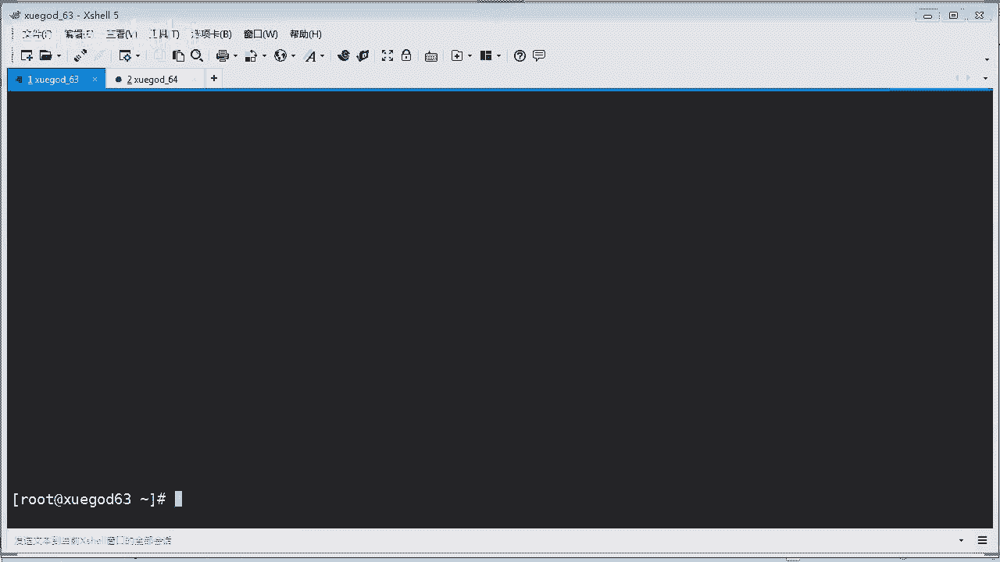

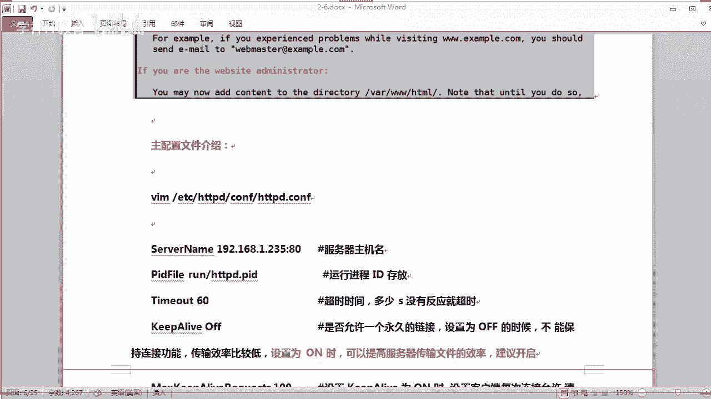

安装完成后，启动Apache和MariaDB服务，并设置为开机自启：
```bash
systemctl start httpd
systemctl start mariadb
systemctl enable httpd
systemctl enable mariadb
```

使用`netstat -antp | grep :80`命令可以检查Apache是否正在监听80端口。

---

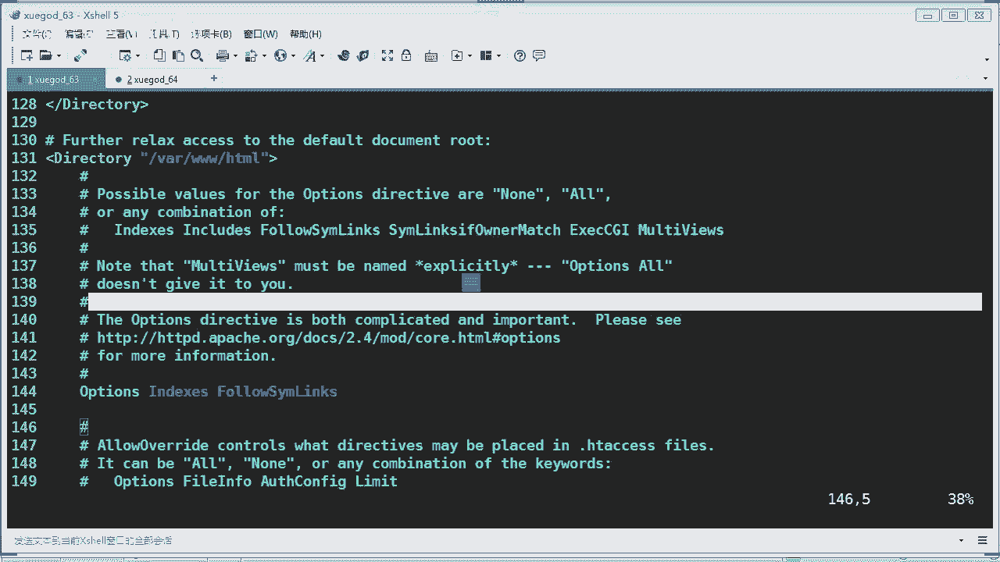

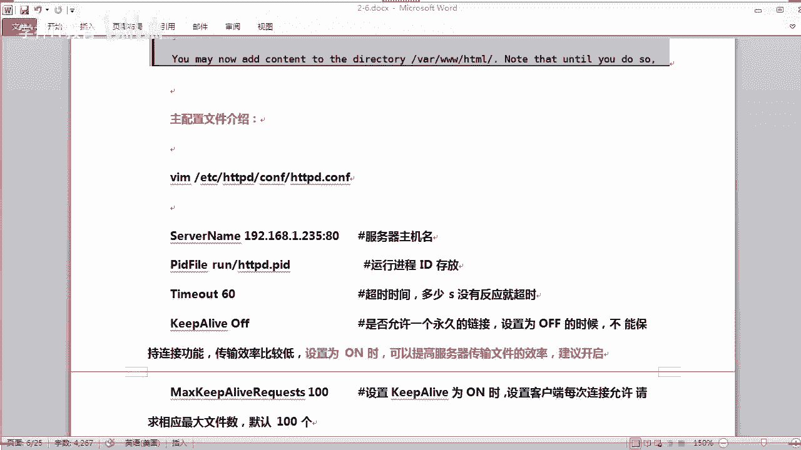

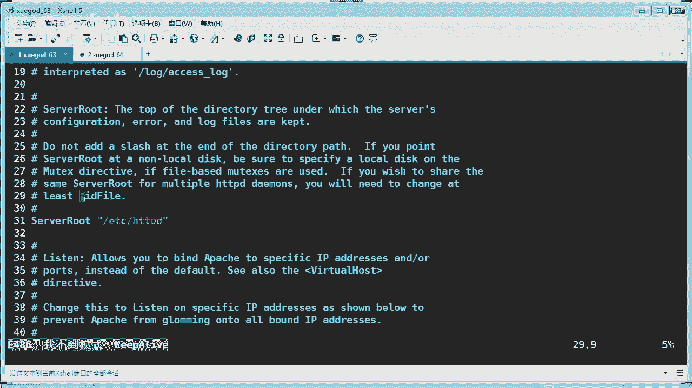

## Apache主配置文件详解
Apache安装后，其核心配置文件位于`/etc/httpd/conf/httpd.conf`。理解关键配置项对后续管理至关重要。

上一节我们安装了Apache，本节中我们来看看其核心配置文件的主要参数。

以下是配置文件中需要关注的核心参数：

*   **`Listen 80`**：设置Apache监听的端口号，默认为80。
*   **`User apache`** 和 **`Group apache`**：指定运行Apache服务的用户和组。
*   **`ServerAdmin root@localhost`**：设置管理员的邮箱地址。
*   **`ServerName www.example.com:80`**：设置服务器的主机名。需要取消注释并填写自己的域名或IP地址。
*   **`DocumentRoot "/var/www/html"`**：这是**网站根目录**，你的网页程序代码默认就放在这个目录下。
*   **`<Directory "/var/www/html">`**：针对网站根目录的权限配置区块。
    *   `Options Indexes FollowSymLinks`：`Indexes`参数允许当目录下没有默认首页文件时显示目录列表；`FollowSymLinks`允许跟踪符号链接（软链接）。
    *   `AllowOverride None`：指定是否允许目录下的`.htaccess`文件覆盖这里的配置。
    *   `Require all granted`：允许所有客户端访问。
*   **`DirectoryIndex index.html index.php`**：定义默认的首页文件。Apache会按顺序查找这些文件并显示第一个找到的。
*   **`IncludeOptional conf.d/*.conf`**：加载`/etc/httpd/conf.d/`目录下所有以`.conf`结尾的配置文件。这允许我们将不同站点的配置放在单独的文件中管理。

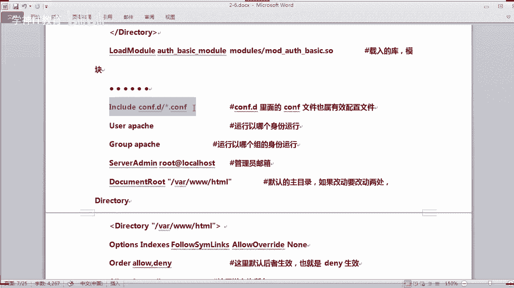

**重要提示**：生产环境中，通常建议禁用`Options Indexes`以防止目录浏览泄露文件结构。

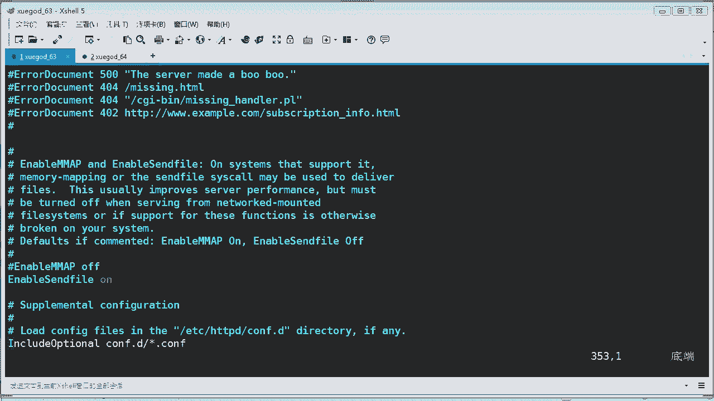

---

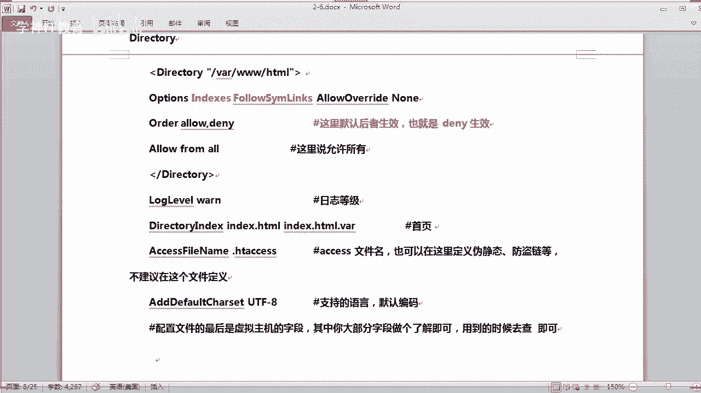

## 测试LAMP环境
软件安装并启动后，我们需要测试整个LAMP环境是否工作正常。

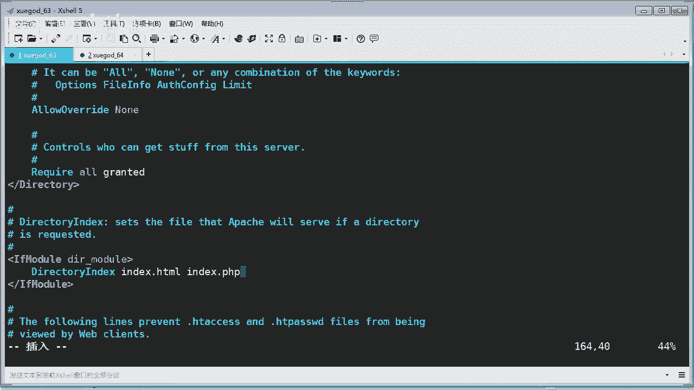

### 1. 测试Apache基础服务
在浏览器或使用`elinks`命令访问服务器的IP地址（如`http://192.168.2.63`），如果看到Apache的默认测试页面，说明服务已正常运行。

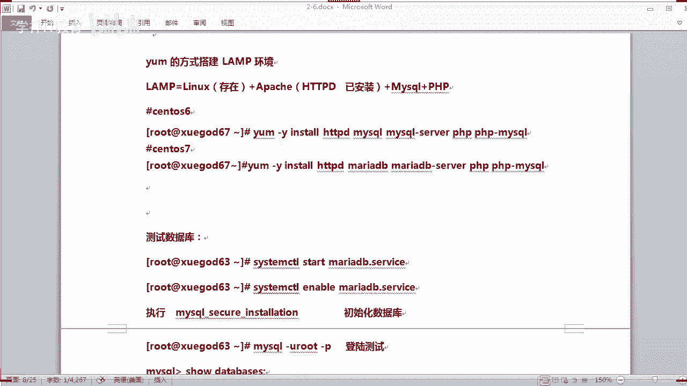

### 2. 测试PHP解析
在网站根目录`/var/www/html/`下创建一个PHP测试文件：
```bash
vim /var/www/html/index.php
```
文件内容为：
```php
<?php phpinfo(); ?>
```
保存后，重启Apache服务：`systemctl restart httpd`。
再次访问服务器IP，如果能看到显示PHP版本、模块等详细信息的页面，说明Apache已成功解析PHP代码。

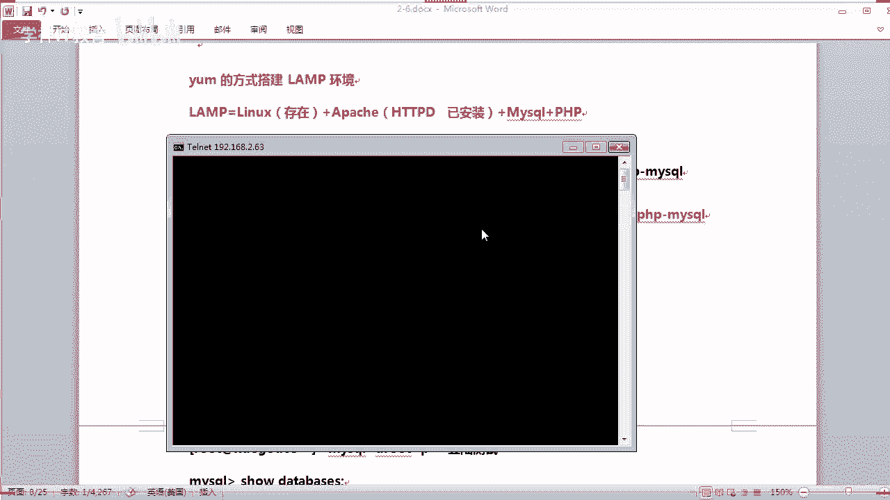

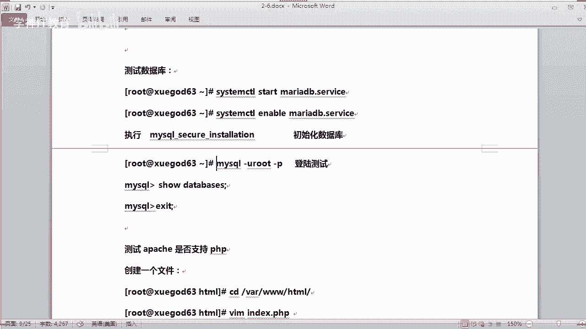

### 3. 配置MariaDB安全
初始安装的MariaDB的root用户没有密码，且存在测试数据库，需要进行安全加固。执行以下命令：
```bash
mysql_secure_installation
```
根据提示进行以下操作：
1.  为root用户设置密码。
2.  移除匿名用户。
3.  禁止root用户远程登录。
4.  移除测试数据库`test`。
5.  重新加载权限表。

完成后，使用`mysql -u root -p`并输入密码来登录数据库。

---

## 基础配置实战
现在，我们来根据需求对Apache进行一些基础配置。

### 修改默认配置
编辑主配置文件`/etc/httpd/conf/httpd.conf`，确保以下常见配置项符合你的要求：
*   `ServerAdmin`：修改为你的管理邮箱。
*   `ServerName`：取消注释并设置为你的服务器域名或IP。
*   `DocumentRoot`：如需更改网站文件存放位置，可修改此路径（需同步调整对应`<Directory>`区块）。
*   `DirectoryIndex`：可以调整默认首页文件的优先级，例如将`index.php`放在`index.html`前面。

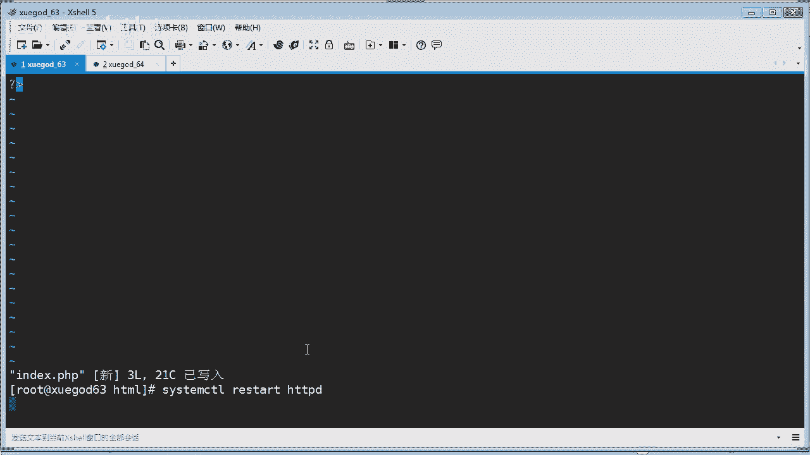

### 禁用Apache默认欢迎页
Apache的默认欢迎页配置文件位于`/etc/httpd/conf.d/welcome.conf`。如果你不希望显示它，可以注释掉该文件中的所有内容，然后重启Apache服务。
```bash
# 注释welcome.conf中的所有配置行
systemctl restart httpd
```
禁用后，访问网站根目录将显示目录列表（如果`Options Indexes`开启）或你自定义的首页文件。

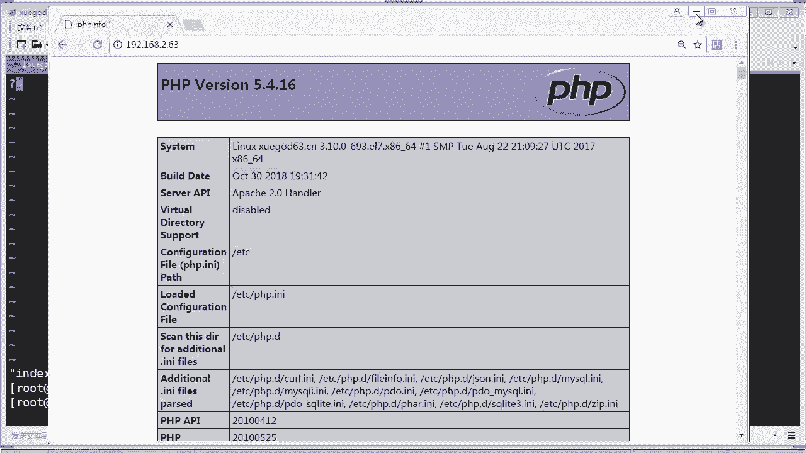

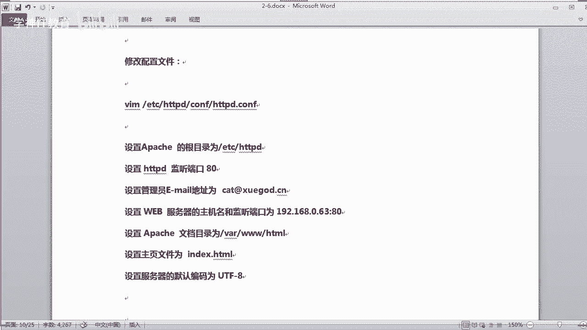

### 创建自定义首页
在网站根目录下创建你自己的首页文件，例如`index.html`：
```html
Welcome to XueShen Tech.
```
保存后，访问服务器IP即可看到自定义内容。

---

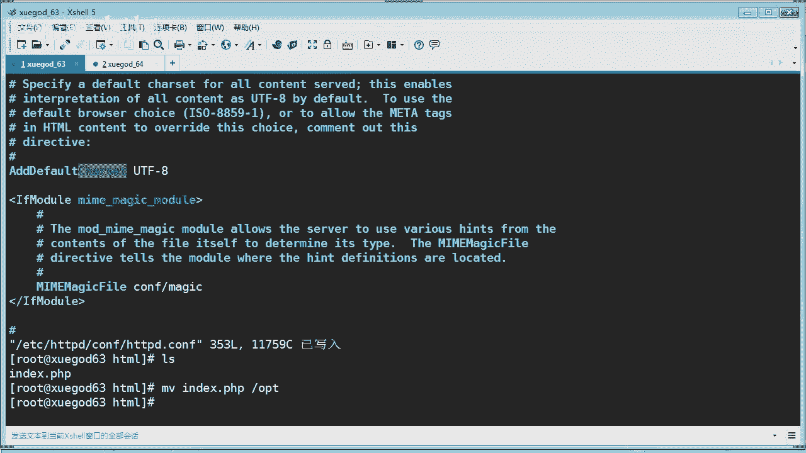

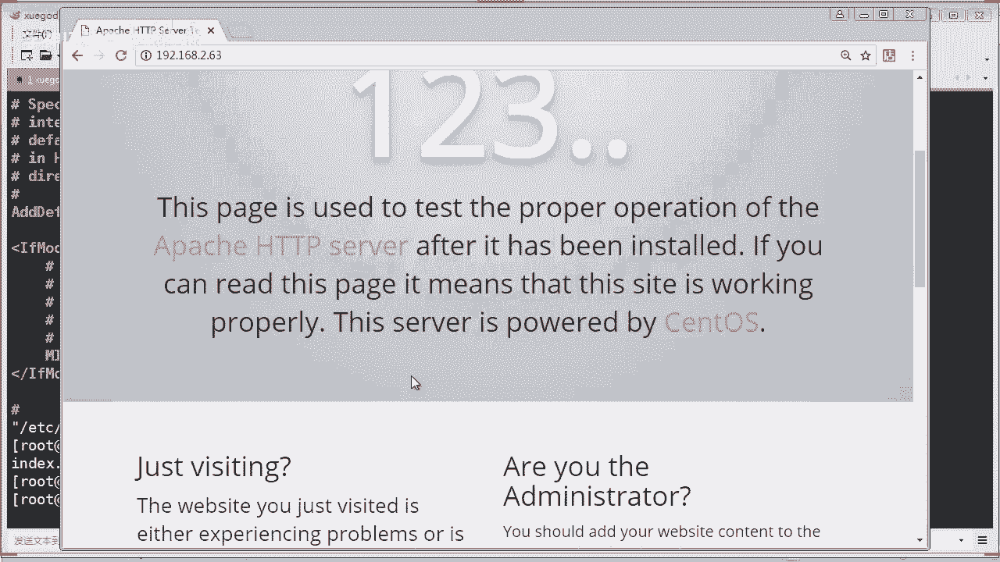

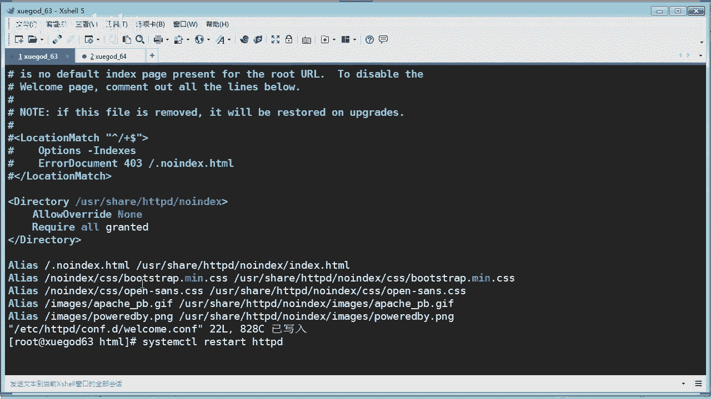

## 总结
本节课我们一起学习了LAMP环境的基础搭建与配置。我们使用YUM安装了Apache、MariaDB和PHP，了解了Apache主配置文件的关键参数，并成功测试了PHP页面的解析。最后，我们还进行了修改管理员信息、禁用默认页和创建自定义首页等基础配置实战。

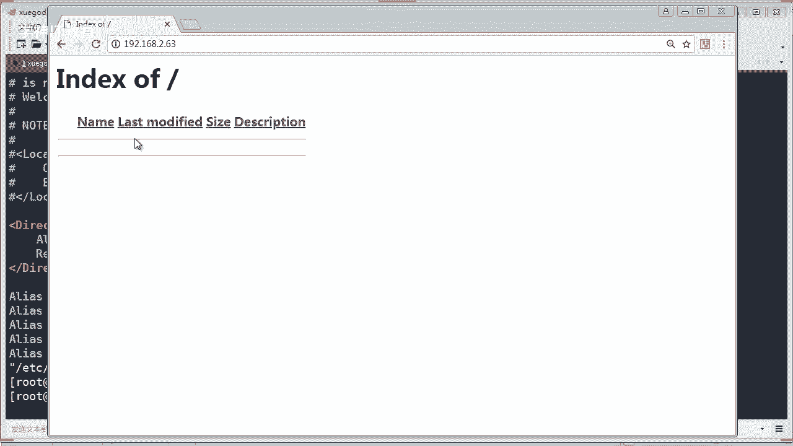

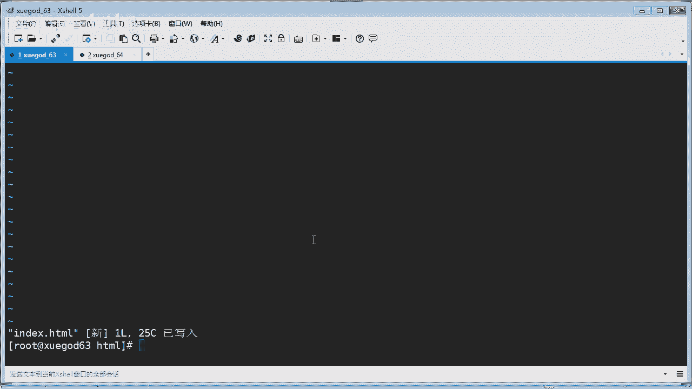

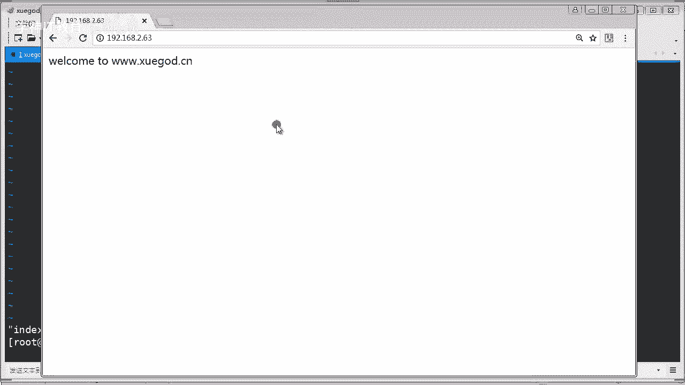

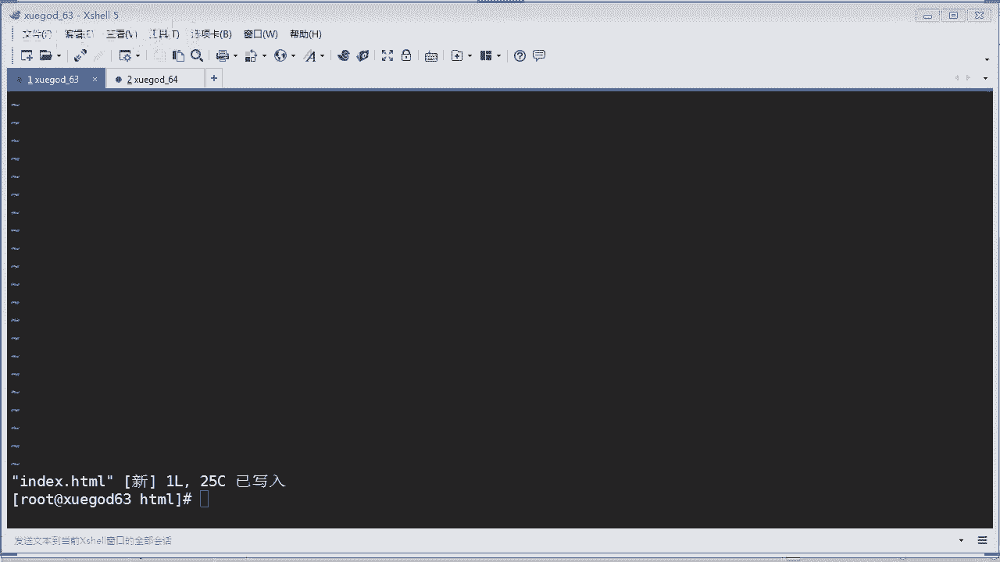

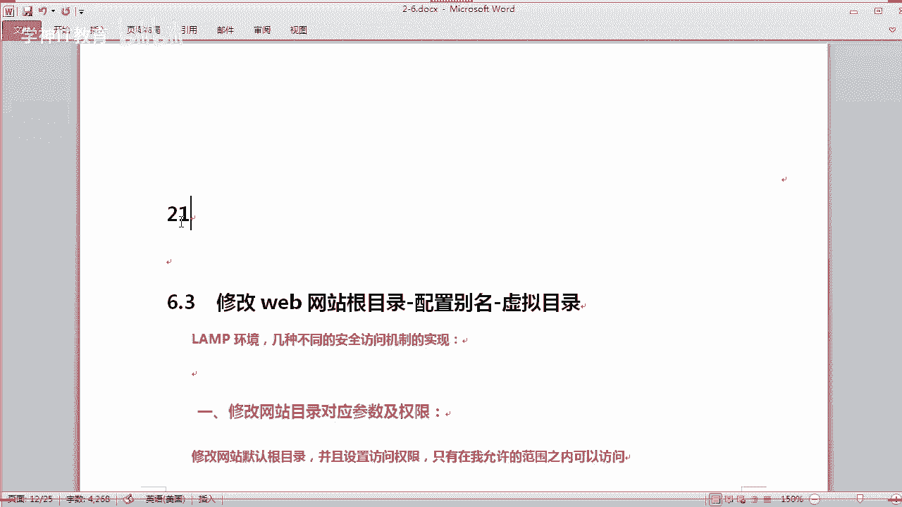

通过本节课，你应该已经掌握了在CentOS/RHEL系统上快速部署一个可工作的Web应用平台的方法。后续课程中，我们将深入讲解使用源码编译方式搭建LAMP/LNMP环境，以及更高级的配置，如虚拟主机、用户认证和性能优化等。