# Linux运维：02：rsync概述与安装

在本节课中，我们将要学习一个在Linux运维中非常实用的工具——rsync。我们将了解它是什么、如何安装，并初步探索其基本用法，为后续实现数据实时同步打下基础。

## 什么是rsync？ 🔍

rsync是一个同步工具，也可以称为备份工具。它是Linux系统下的数据镜像备份工具，使用快速增量备份算法。rsync支持远程同步，可以在不同主机之间进行同步，实现全量备份和增量备份，并能保持文件的链接和权限等原有属性。它采用优化的同步算法，在传输前执行压缩，从而减少带宽占用，使传输更快。因此，rsync非常适合用于集中式备份或异地备份、异地容灾等应用场景。同时，rsync支持本地复制，或通过SSH、rsync守护进程等方式与其他主机进行同步。

rsync是Samba项目的一部分，其作者也是Linux内核的贡献者之一。目前，在CentOS 7.4系统中，通过yum安装的rsync版本通常是3.1.2。

## rsync的特点 ✨

以下是rsync的主要优点：

1.  **镜像保存**：可以镜像保存整个目录树和文件系统。
2.  **保持属性**：能够保持原文件的权限、时间、软链接等属性。
3.  **安装简便**：无需特殊权限即可安装。
4.  **传输高效**：首次同步时复制全部内容，后续只传输发生变化的部分（增量备份）。
5.  **压缩传输**：传输前进行压缩，有效节省带宽。
6.  **传输安全**：支持通过SSH等安全协议进行传输。
7.  **支持匿名传输**：方便进行网站镜像。
8.  **选择性保持**：可以通过参数灵活控制需要保持的属性。

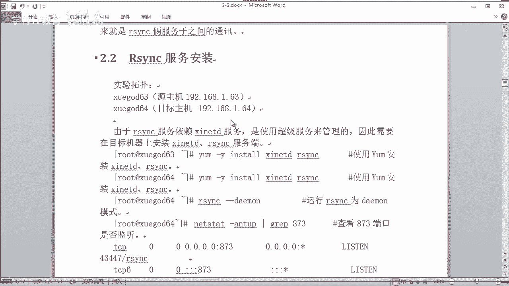

## rsync的工作原理 ⚙️

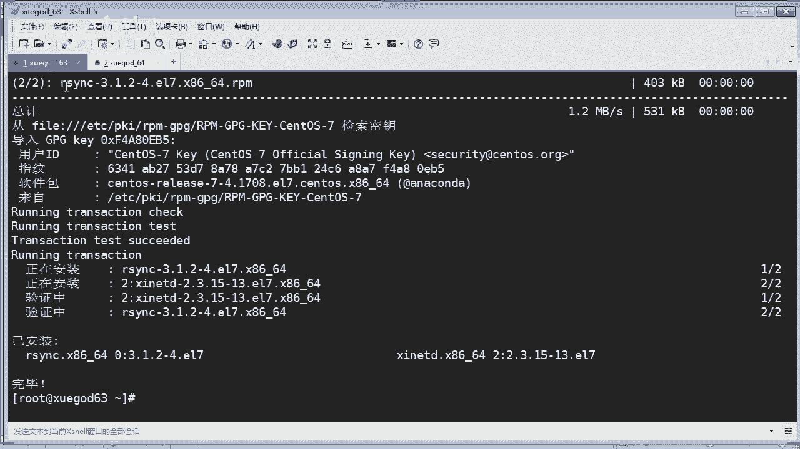

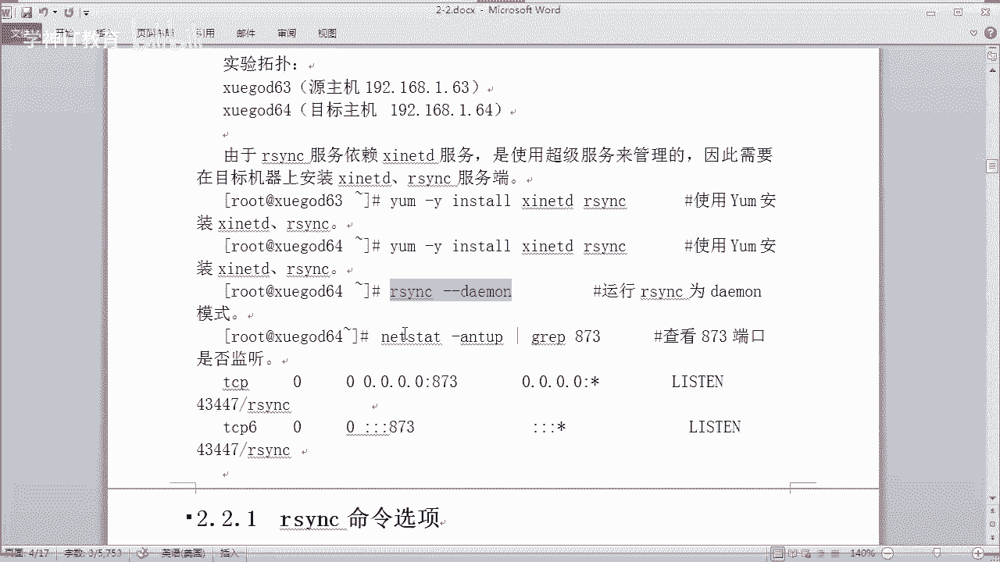

rsync采用客户端-服务器（C/S）架构运行。其守护进程默认监听 **873** 端口。

在备份场景中，涉及几个核心概念：
*   **发起端**：负责发起rsync同步操作的客户机。
*   **备份源**：存放原始数据的服务器，负责响应客户机的同步请求。
*   **服务端**：运行rsync守护进程（`rsyncd`）的主机。
*   **客户端**：存放备份数据的目标主机。

数据同步有两种主要方式：
*   **推送（Push）**：由一台主机主动将数据传送到其他机器。这种方式服务器开销较大，适合备份目标较少的情况。
*   **拉取（Pull）**：由客户端主动从服务器拉取数据。这种方式可能导致数据同步不及时，但服务器压力较小。

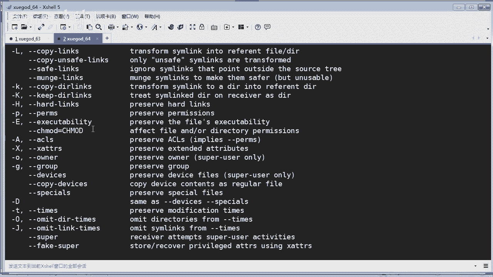

## 安装rsync 💻

上一节我们介绍了rsync的基本概念和原理，本节中我们来看看如何在系统中安装它。

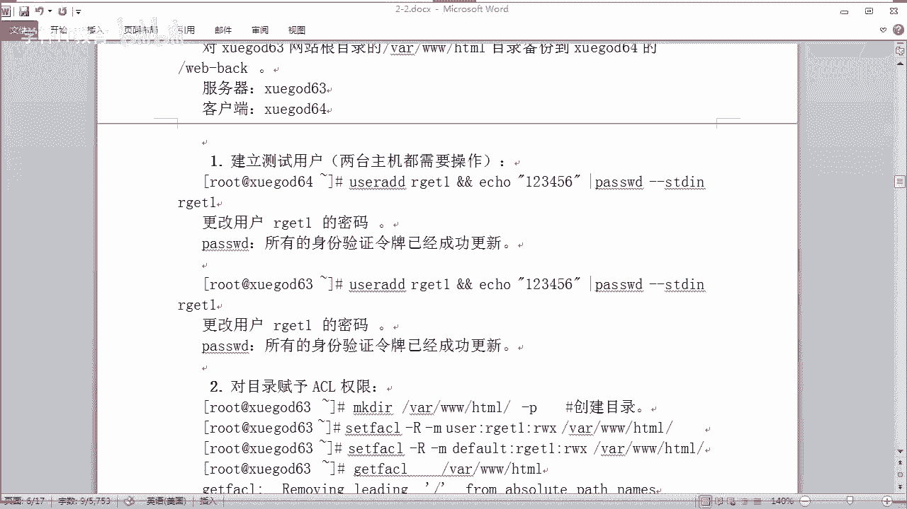

安装过程非常简单，我们可以使用yum包管理器进行安装。rsync依赖于`xinetd`服务（一个管理`rsyncd`、`telnet`等服务的超级守护进程），我们可以一并安装。

以下是安装命令：
```bash
yum install -y rsync xinetd
```

执行上述命令后，系统会从配置的yum源（如阿里云镜像）下载并安装rsync及其依赖。安装完成后，可以通过`rsync --version`命令查看版本号以确认安装成功。

## 基本使用：通过SSH协议同步 🚀

安装完成后，我们可以先体验一下rsync最基本的用法——通过SSH协议进行同步。这种方式利用了系统现有的SSH用户认证。

首先，我们需要在**源主机**（例如192.168.2.63）和**目标主机**（例如192.168.2.64）上创建一个用于测试的系统用户。
```bash
useradd rsync_test
echo “123456” | passwd --stdin rsync_test
```

假设我们要将源主机上Apache的默认网站目录 `/var/www/html` 同步到目标主机。我们需要确保测试用户对该目录有相应权限。这里使用ACL权限为例：
```bash
setfacl -R -m u:rsync_test:rwx /var/www/html
setfacl -R -m d:u:rsync_test:rwx /var/www/html
```

在源主机创建测试文件：
```bash
touch /var/www/html/index.html
```

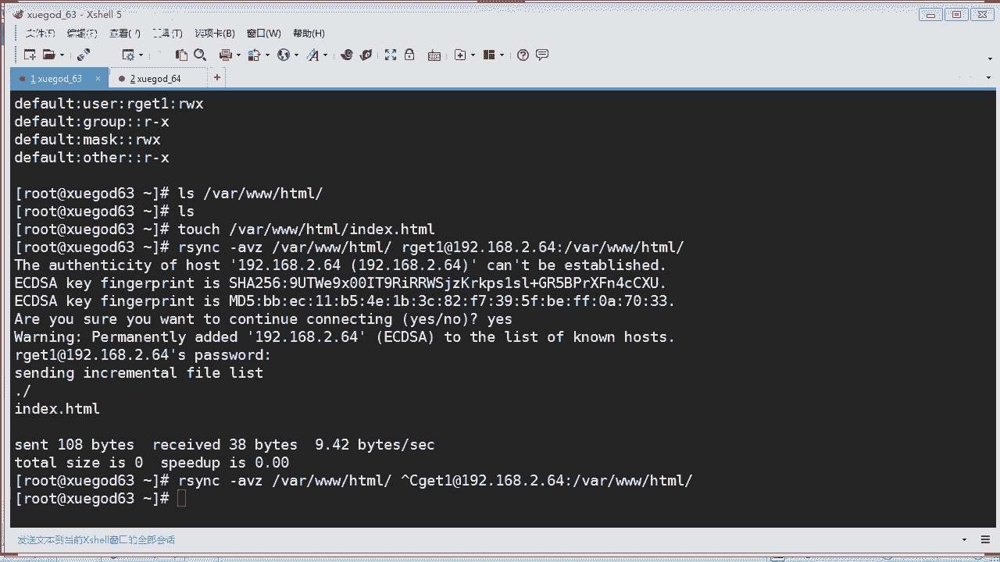

在目标主机清空对应目录（如果是首次同步则无需此步）：
```bash
rm -rf /var/www/html/*
```

现在，从源主机（发起端）使用rsync命令将数据**推送**到目标主机：
```bash
rsync -avz /var/www/html/ rsync_test@192.168.2.64:/var/www/html/
```
*   `-a`：归档模式，保持文件属性。
*   `-v`：详细输出模式。
*   `-z`：传输时进行压缩。

执行命令后，会提示输入`rsync_test`用户的SSH密码（123456）。输入后，文件即开始同步。

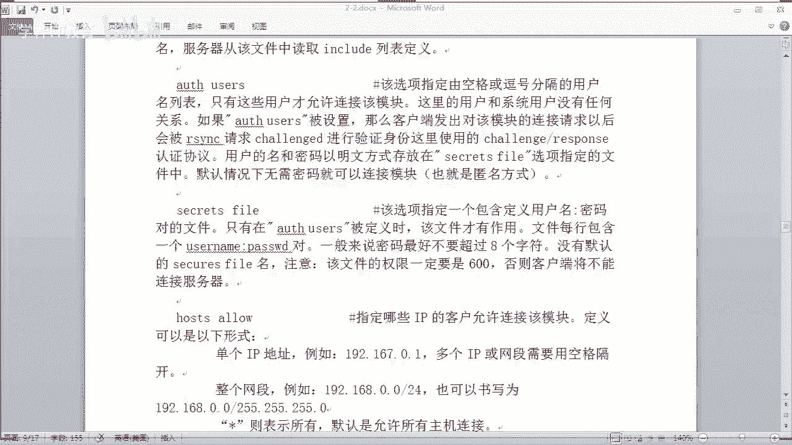

**拓展：使用非默认SSH端口**
如果目标主机的SSH服务端口不是默认的22，可以使用`-e`参数指定：
```bash
rsync -avz -e ‘ssh -p 2222’ /var/www/html/ rsync_test@192.168.2.64:/var/www/html/
```

## 配置rsync守护进程模式 🛡️

通过SSH同步虽然简单，但需要系统用户身份，且受SSH配置影响。rsync还提供了另一种更专业、更灵活的同步方式——守护进程模式。本节中我们来看看如何配置和使用它。

在此模式下，rsync使用自己的协议和用户认证体系，不依赖系统用户，因此不受SSH端口更改的影响。

**1. 编辑配置文件**
rsync守护进程的配置文件是 `/etc/rsyncd.conf`。我们需要创建并编辑它。注意，配置文件中应避免使用中文注释，否则可能导致错误。
```bash
vim /etc/rsyncd.conf
```
一个基础的配置示例如下：
```ini
uid = root
gid = root
address = 192.168.2.64
port = 873
hosts allow = 192.168.2.0/24
use chroot = yes
max connections = 5
pid file = /var/run/rsyncd.pid
lock file = /var/run/rsync.lock
log file = /var/log/rsyncd.log
motd file = /etc/rsyncd.motd

[wwwroot]
path = /var/www/html
comment = wwwroot dir
read only = no
list = yes
auth users = rsync_user
secrets file = /etc/rsyncd.passwd
```
*   `[wwwroot]`：定义一个同步模块，客户端通过模块名访问。
*   `auth users`：定义用于认证的虚拟用户（非系统用户）。
*   `secrets file`：指定存储虚拟用户密码的文件。

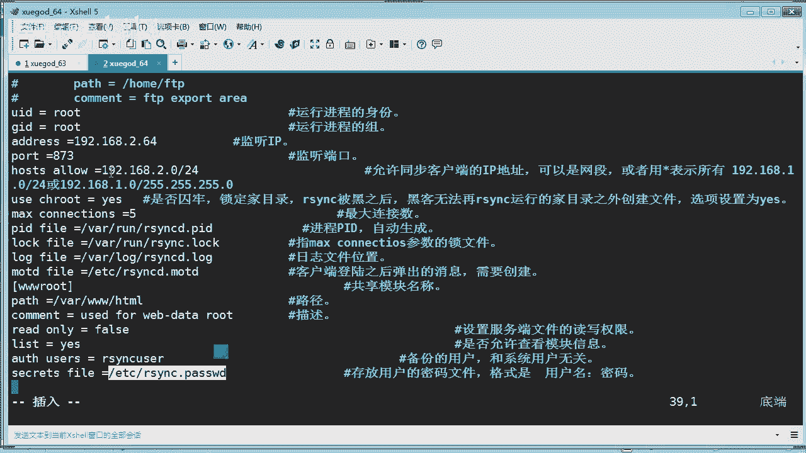

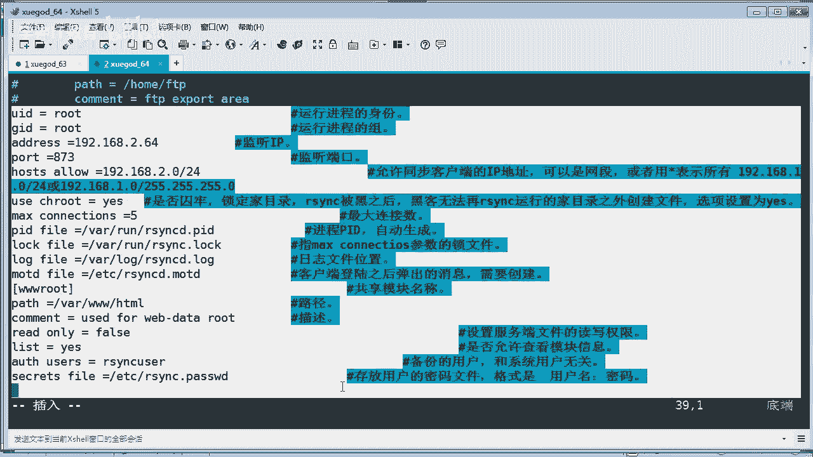

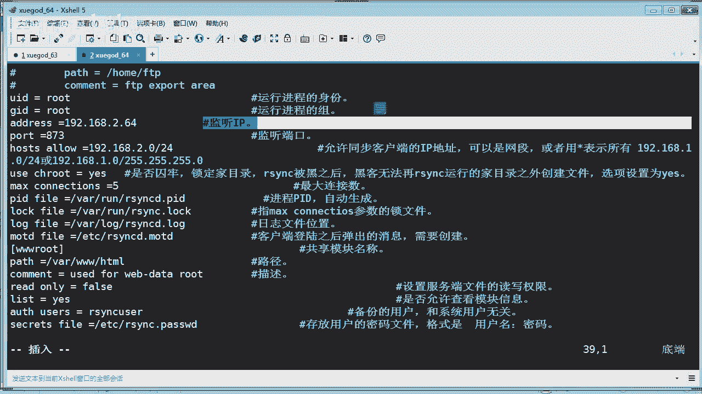

**2. 创建辅助文件**
创建欢迎信息文件和密码文件：
```bash
echo “Welcome to Rsync Server” > /etc/rsyncd.motd
echo “rsync_user:password123” > /etc/rsyncd.passwd
```
密码文件的格式是`用户名:密码`。必须严格设置该文件的权限：
```bash
chmod 600 /etc/rsyncd.passwd
```

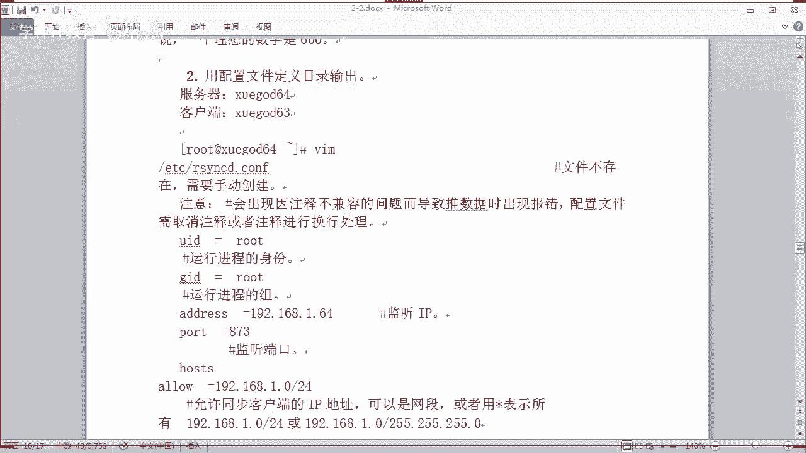

**3. 启动守护进程**
启动xinetd服务并设置开机自启，然后以后台守护进程方式启动rsync：
```bash
systemctl start xinetd
systemctl enable xinetd
rsync --daemon --config=/etc/rsyncd.conf
```
使用 `netstat -antp | grep 873` 命令检查873端口是否在监听。

**4. 客户端同步测试**
现在，可以从客户端（例如192.168.2.63）向服务端同步数据了。命令格式中直接使用模块名`wwwroot`：
```bash
rsync -avz /var/www/html/ rsync_user@192.168.2.64::wwwroot
```
输入密码`password123`后，数据开始同步。

**5. 使用密码文件（免交互）**
为了避免每次手动输入密码，可以在客户端创建密码文件（仅包含密码）：
```bash
echo “password123” > /etc/rsyncd.client.passwd
chmod 600 /etc/rsyncd.client.passwd
```
然后使用`--password-file`参数：
```bash
rsync -avz --password-file=/etc/rsyncd.client.passwd /var/www/html/ rsync_user@192.168.2.64::wwwroot
```

## 实现定时自动同步 ⏰

手动执行同步命令毕竟不便，在生产环境中，我们通常需要定时自动执行同步任务。结合上面学习的守护进程模式，我们可以轻松实现这一点。

我们可以编写一个简单的Shell脚本，然后利用Linux的`crontab`计划任务功能定时执行它。

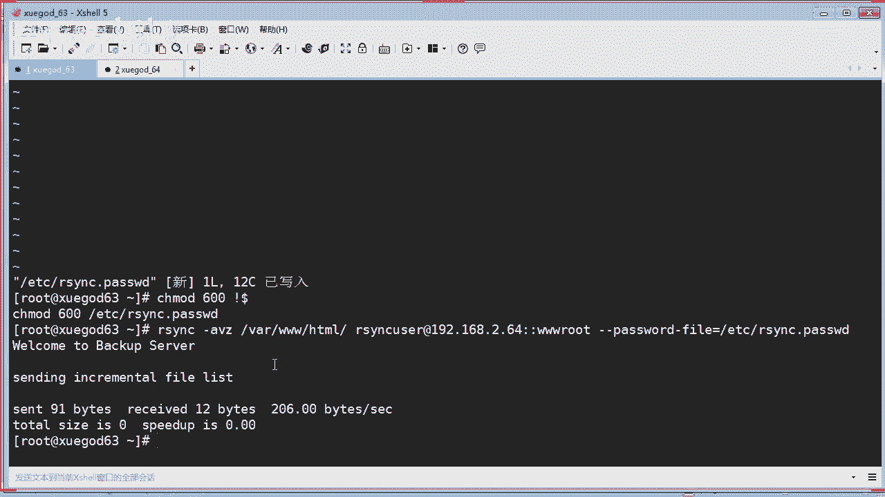

**1. 编写同步脚本**
创建一个脚本文件，例如 `/opt/auto_backup.sh`：
```bash
#!/bin/bash
rsync -avz --password-file=/etc/rsyncd.client.passwd /var/www/html/ rsync_user@192.168.2.64::wwwroot
```
给脚本添加执行权限：
```bash
chmod +x /opt/auto_backup.sh
```

**2. 配置计划任务**
使用`crontab -e`编辑当前用户的计划任务。例如，设置每天凌晨3点执行同步：
```bash
0 3 * * * /opt/auto_backup.sh &
```
*   `0 3 * * *` 表示每天3点0分。
*   `&` 符号表示在后台执行。

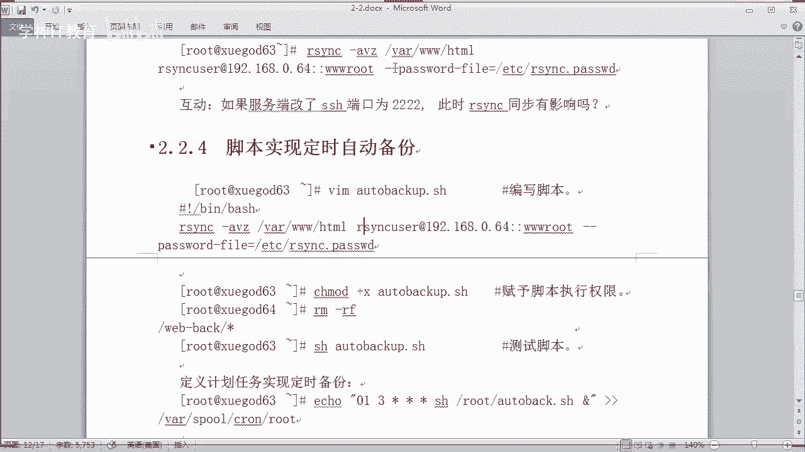

保存退出后，计划任务即生效。可以使用 `crontab -l` 查看已设置的任务。

## 总结 📚

本节课中我们一起学习了Linux下强大的同步工具rsync。我们从了解rsync的概念、特点和原理开始，然后完成了rsync的安装。我们实践了两种基本的同步方式：通过SSH协议的系统用户同步，以及更灵活、更专业的守护进程模式同步。最后，我们还学习了如何通过编写脚本和配置计划任务来实现定时自动同步，为自动化运维迈出了一步。

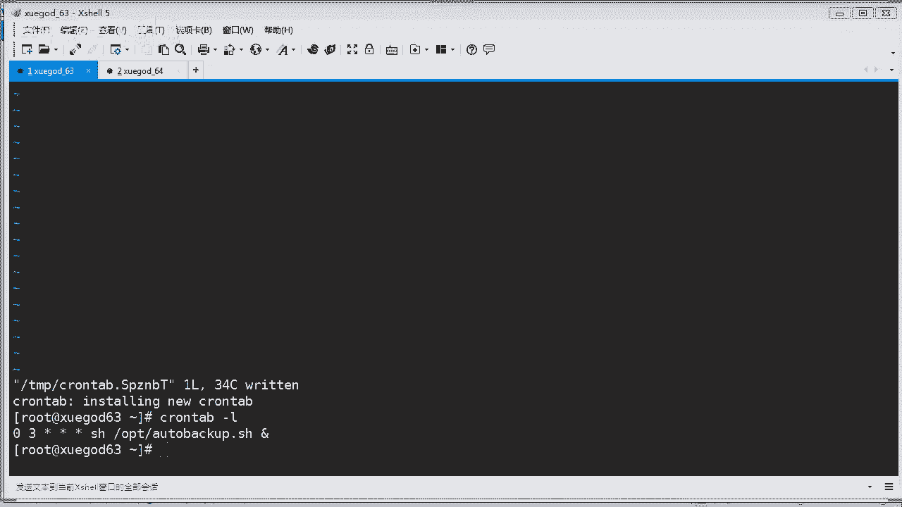

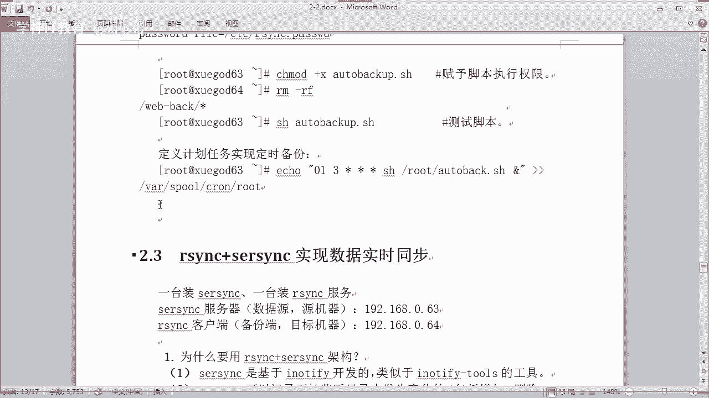

理解并掌握rsync的这些基础用法，是后续实现更复杂的实时同步方案的重要基石。