# Linux运维：RHCE：rsync配置与实时同步02 🚀

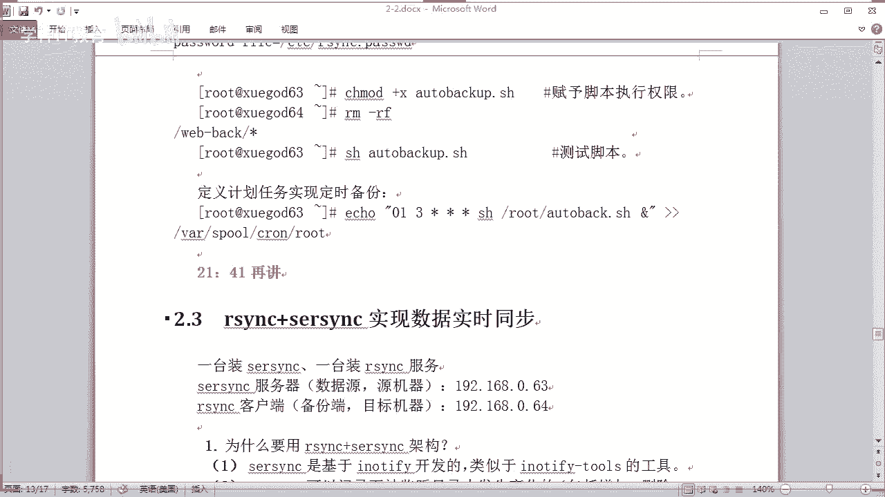

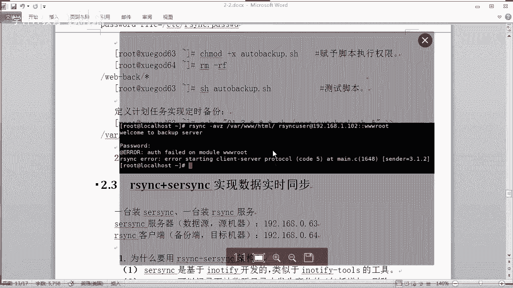

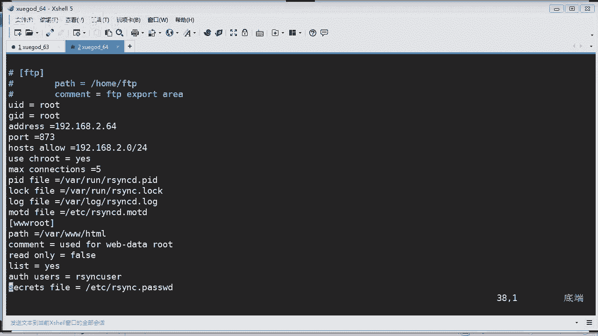

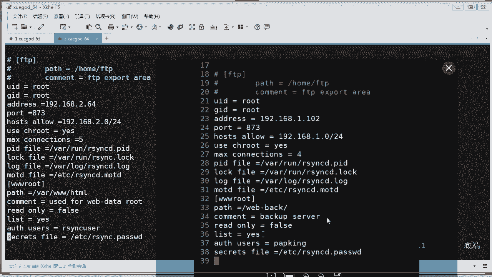

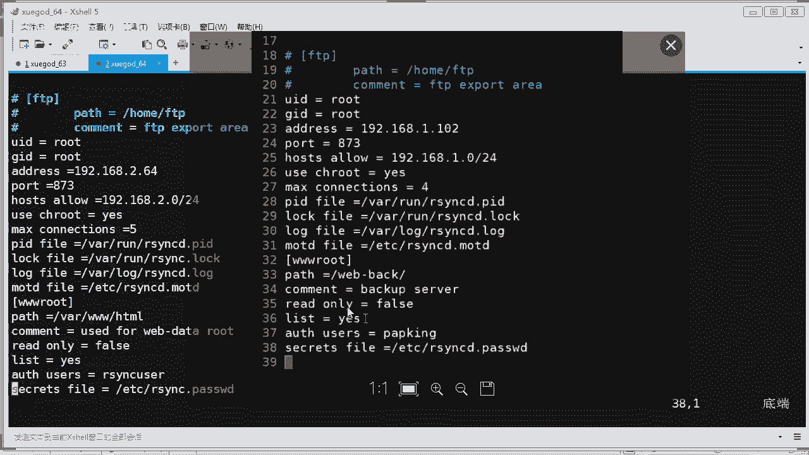

在本节课中，我们将深入学习rsync的高级应用，特别是如何结合sersync工具实现数据的实时同步。我们将从解决常见配置问题开始，逐步讲解实时同步的原理、部署步骤以及生产环境中的优化方案。

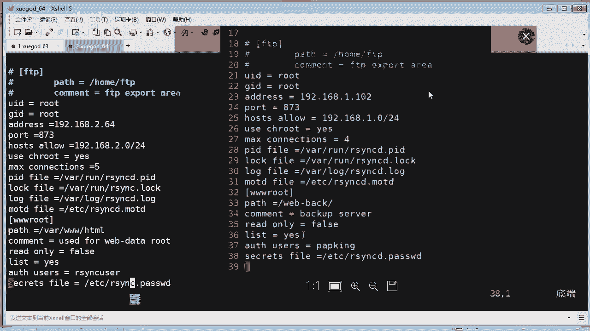

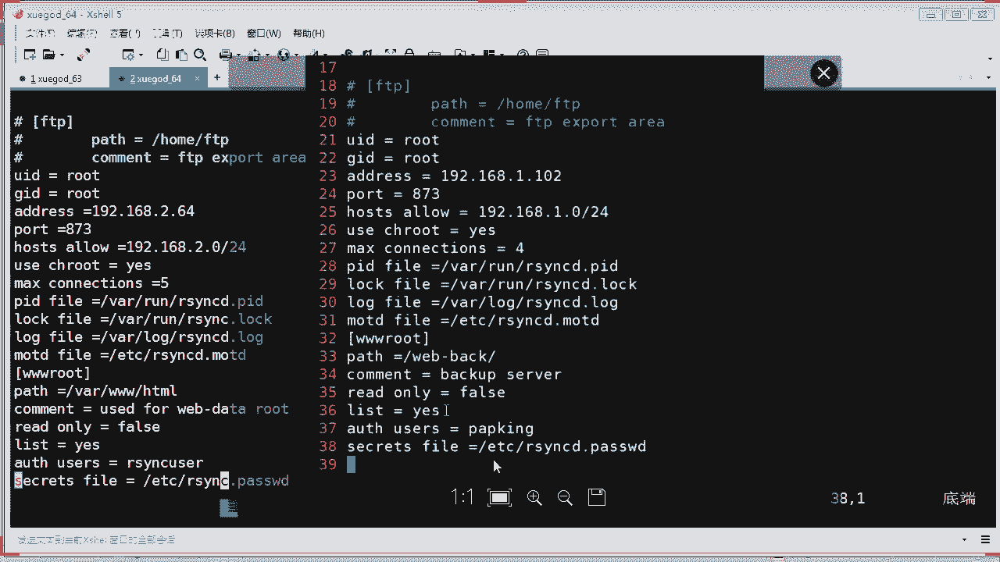

## 常见问题排查 🔍

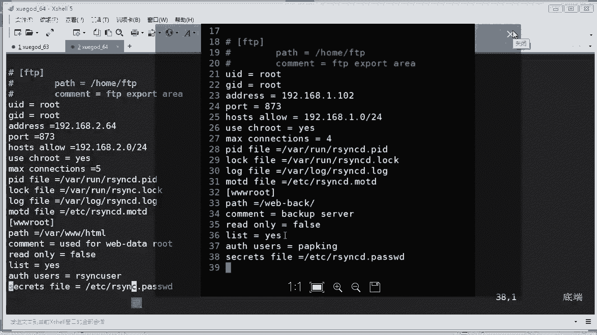

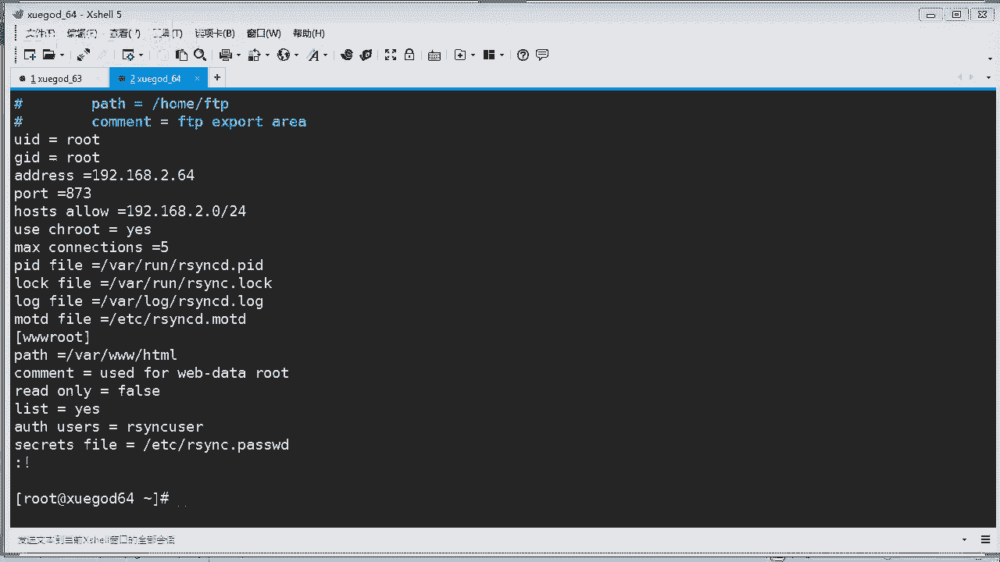

上一节我们介绍了rsync的基本配置，但在实践中可能会遇到问题。本节我们首先来看看一个典型的配置错误案例。

有同学反馈总是提示“模块问题”。这通常是由于配置文件格式不正确导致的。

以下是配置文件的注意事项：
*   **避免中文注释**：配置文件中不能包含中文注释或多余的空格。
*   **路径与名称一致**：创建密码文件时，文件名必须与配置文件中`secrets file`参数指定的路径完全一致。
*   **重启服务**：修改配置文件后，需要先停止旧的rsync守护进程，再重新启动以加载新配置。

**核心配置示例**：
```bash
# /etc/rsyncd.conf 的正确格式示例
[wwwroot]
path = /var/www/html
read only = no
auth users = rsyncuser
secrets file = /etc/rsync.password
```

## 实时同步原理与架构 🏗️

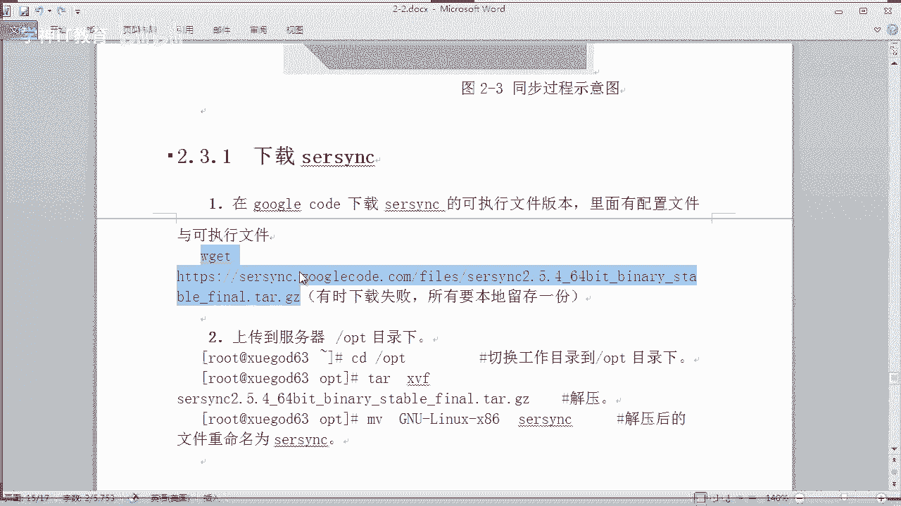

解决了基础配置问题后，我们来看看如何实现更高效的同步。传统的rsync定时同步存在延迟，而实时同步可以即刻响应数据变化。

rsync本身不具备监控功能，因此我们需要借助**sersync**工具。sersync基于Inotify开发，可以实时监控指定目录的文件变化（增、删、改），并立即触发rsync同步，只同步发生变化的部分，效率极高。

**同步架构流程**：
1.  **数据源服务器**：安装并运行sersync，监控本地数据目录。
2.  **备份服务器**：配置为rsync服务端，准备接收数据。
3.  **触发同步**：当数据源目录发生任何变化，sersync立刻调用rsync客户端，将变化推送到备份服务器。

## 部署sersync实现实时同步 ⚙️

了解了原理，接下来我们动手部署sersync。我们以192.168.1.63作为数据源（客户端），192.168.1.64作为备份目标（服务端）。

### 1. 下载与安装sersync

由于网络原因，可以从共享资源获取或通过特定链接下载sersync安装包。

以下是安装步骤：
```bash
# 解压安装包
tar -zxvf sersync2.5.4_64bit_binary_stable_final.tar.gz
# 重命名目录以便管理
mv GNU-Linux-x86 /opt/sersync
```

### 2. 配置sersync

进入安装目录，编辑主要的配置文件`confxml.xml`。

以下是需要修改的关键配置项：
*   **本地监控路径**：`<localpath watch="/var/www/html">` 指定要监控的目录。
*   **远程主机与模块**：`<remote ip="192.168.1.64" name="wwwroot"/>` 指定备份服务器的IP和rsync模块名。
*   **启用认证**：`<auth start="true" ... />` 设置为`true`。
*   **认证用户与密码文件**：在auth标签内，正确填写rsync用户名和密码文件路径，例如：
    ```xml
    <auth start="true" users="rsyncuser" passwordfile="/etc/rsync.password"/>
    ```

### 3. 启动sersync服务

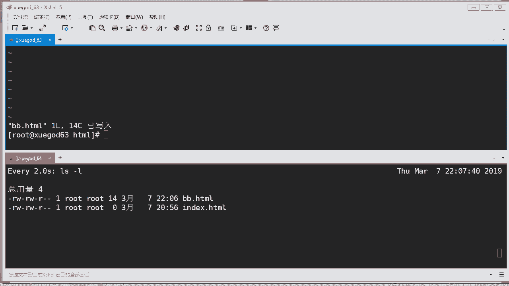

配置完成后，使用提供的脚本启动sersync守护进程。

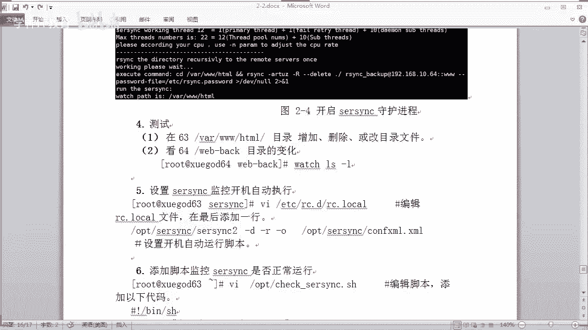

**启动命令**：
```bash
/opt/sersync/sersync2 -d -r -o /opt/sersync/confxml.xml
```
参数说明：`-d`以守护进程运行，`-r`在启动时先整体同步一次，`-o`指定配置文件。

### 4. 测试实时同步

启动后，可以在备份服务器上使用`watch`命令实时观察目录变化。

**测试操作**：
在数据源服务器（63）的`/var/www/html`目录下进行任何文件操作（创建、删除、修改内容、重命名），备份服务器（64）的对应目录会立刻发生相同变化，实现实时同步。

## 生产环境优化 🛡️

实现了基本功能后，我们需要确保服务在生產環境中的可靠性和持續性。

### 1. 设置开机自启动

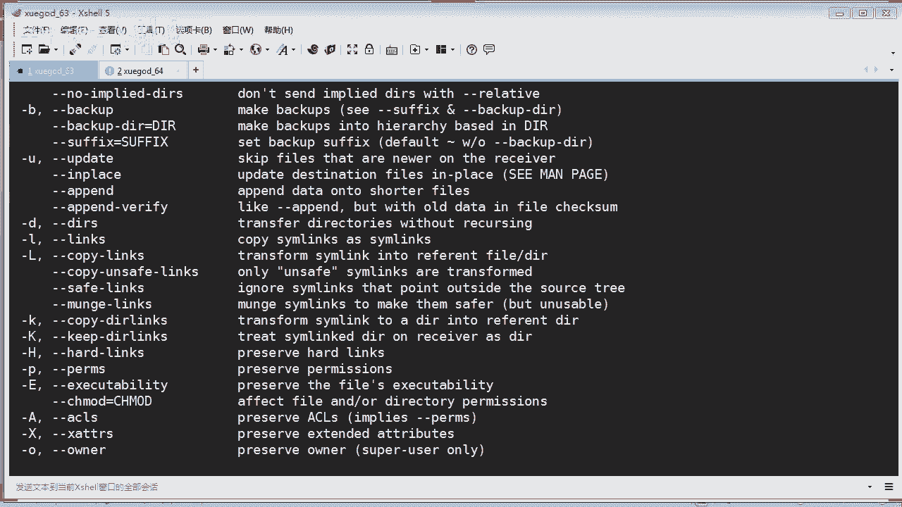

为了避免服务器重启后服务中断，需要将sersync加入开机启动项。

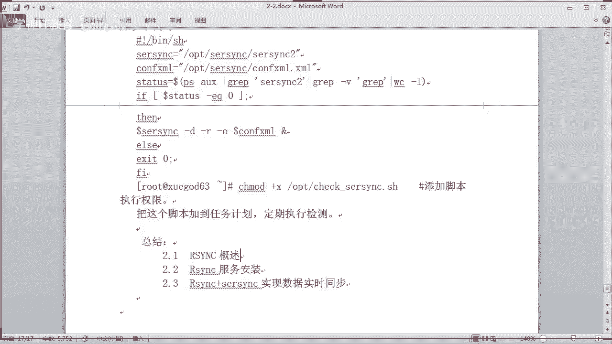

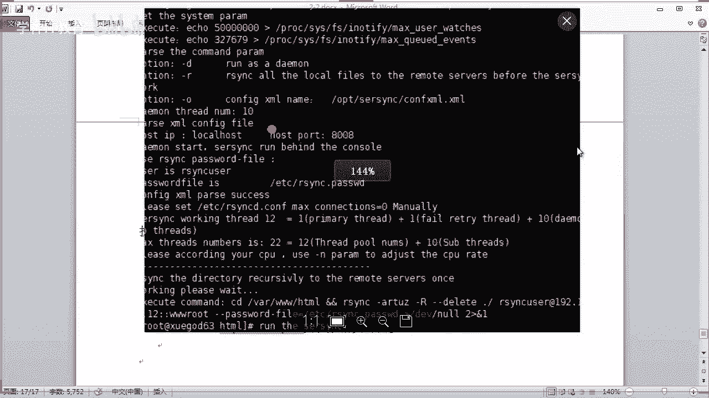

编辑`/etc/rc.d/rc.local`文件，添加启动命令：
```bash
/opt/sersync/sersync2 -d -r -o /opt/sersync/confxml.xml
```
并赋予`rc.local`文件执行权限：`chmod +x /etc/rc.d/rc.local`

### 2. 编写监控脚本

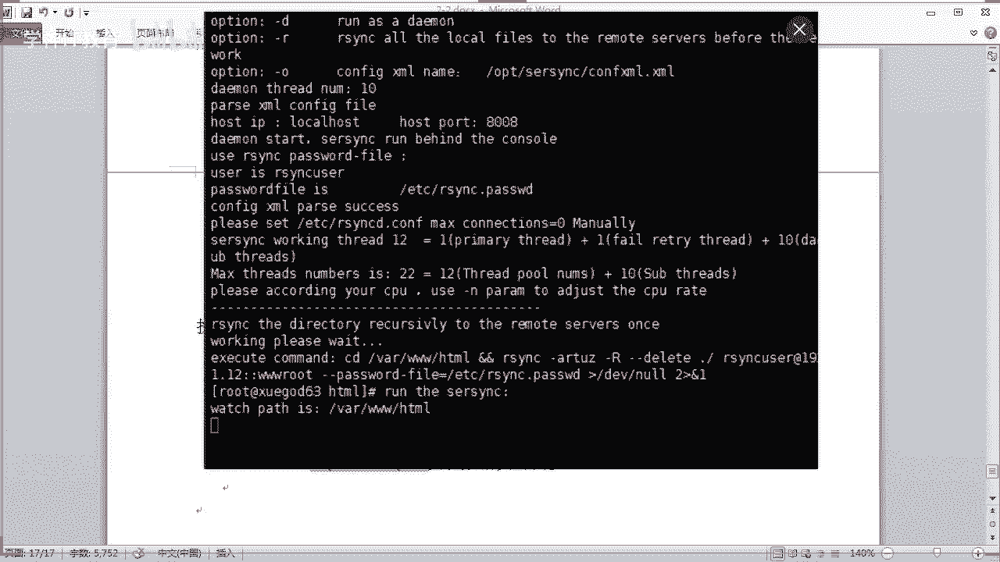

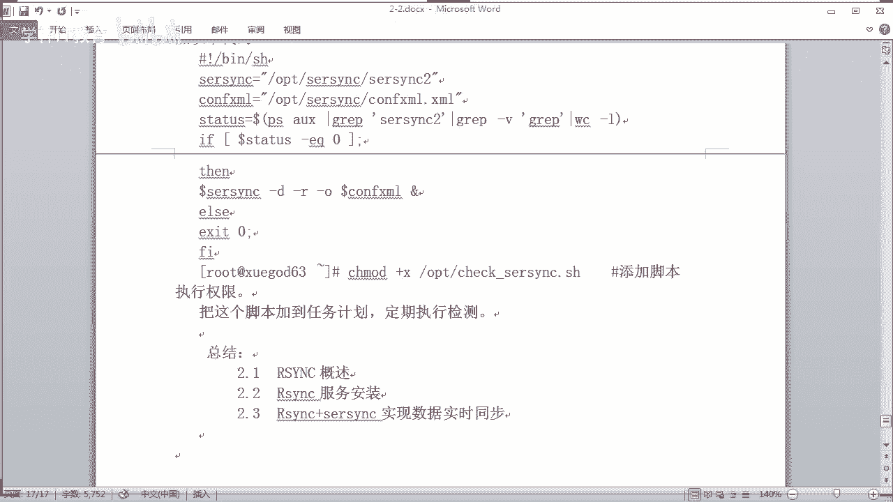

可以编写一个Shell脚本，定期检查sersync进程是否存活，如果进程意外停止则自动重启。

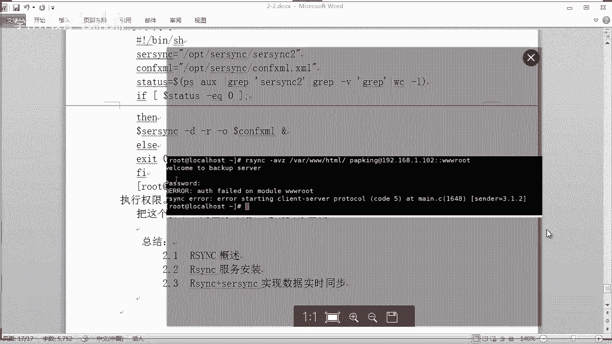

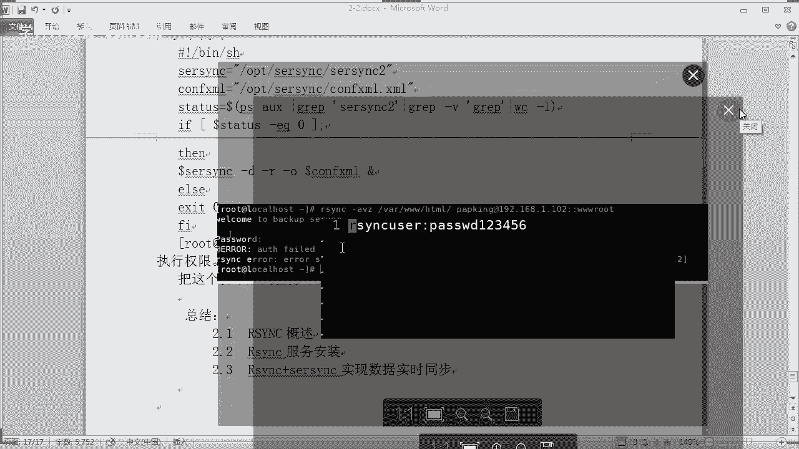

**示例监控脚本 (`/opt/check_sersync.sh`)**：
```bash
#!/bin/bash
sersync_path="/opt/sersync/sersync2"
conf_path="/opt/sersync/confxml.xml"
status=$(ps aux | grep sersync2 | grep -v grep | wc -l)
if [ $status -eq 0 ]; then
    $sersync_path -d -r -o $conf_path
fi
```
赋予脚本执行权限：`chmod +x /opt/check_sersync.sh`

### 3. 加入计划任务

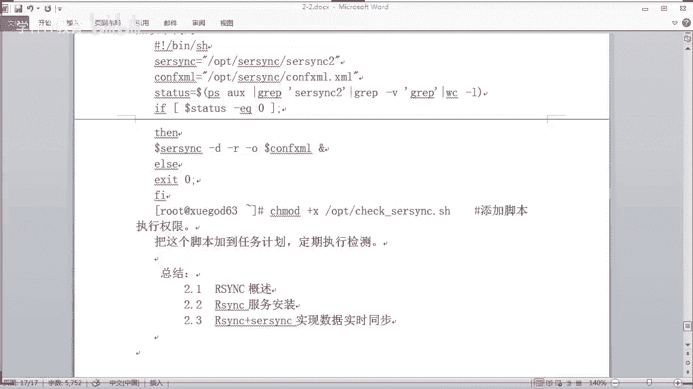

将监控脚本加入Crontab计划任务，实现定时检测（例如每5分钟检测一次）。

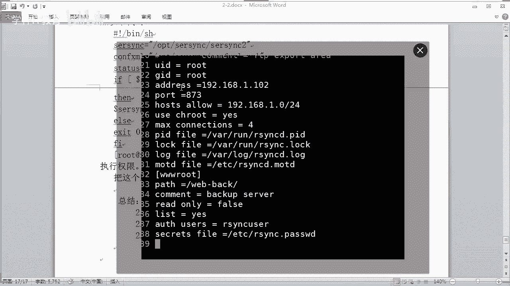

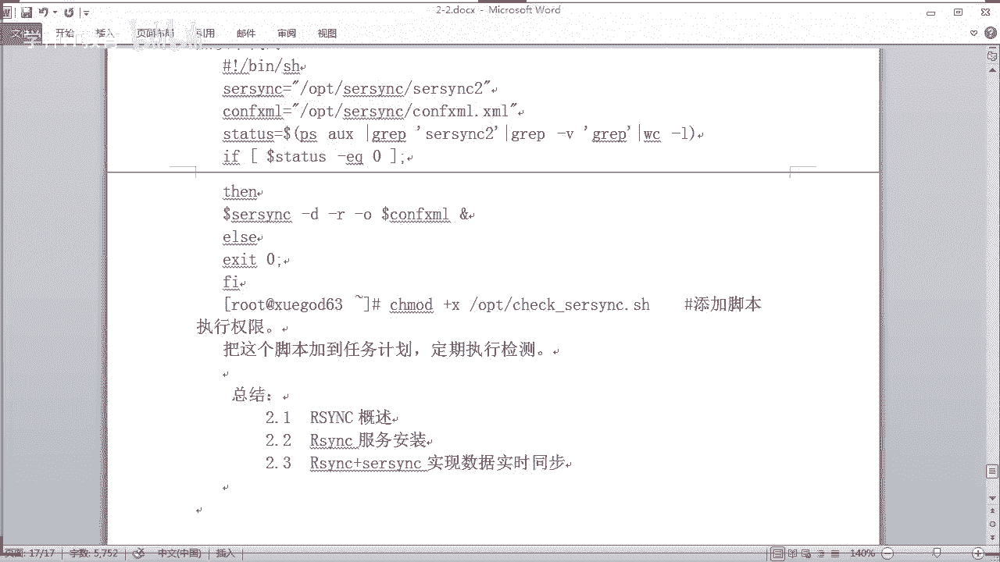

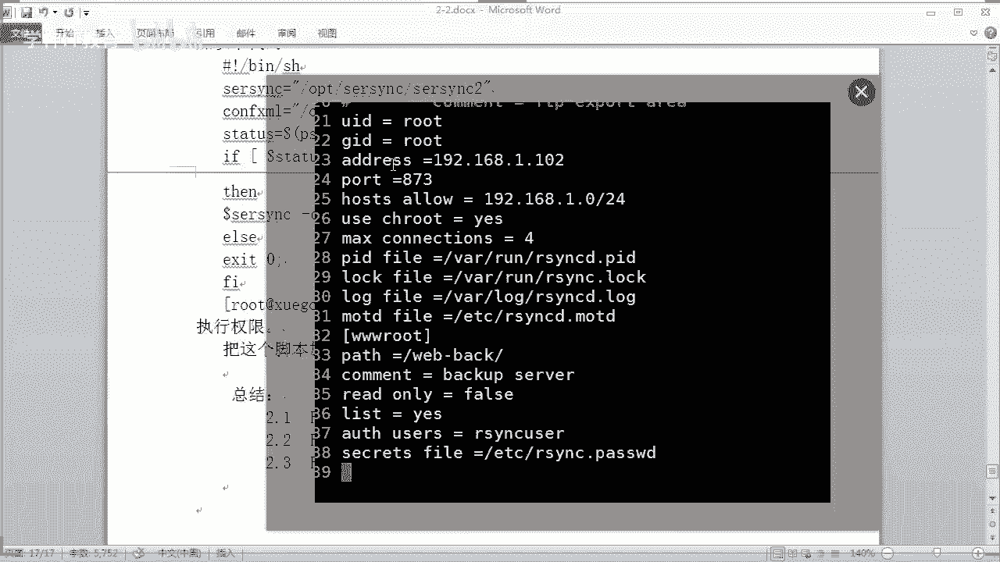

**编辑计划任务**：
```bash
crontab -e
# 添加以下行
*/5 * * * * /bin/bash /opt/check_sersync.sh > /dev/null 2>&1
```

## 总结 📚

本节课中我们一起深入学习了rsync的高级应用。我们从排查配置错误入手，理解了sersync实现实时同步的原理，并完成了从下载安装、配置、测试到生产环境优化的完整部署流程。

关键知识点包括：
1.  **实时同步原理**：sersync监控 + rsync同步，实现高效、即时数据备份。
2.  **核心配置**：正确编辑`confxml.xml`文件，关联本地路径、远程主机及认证信息。
3.  **服务管理**：掌握启动命令，并设置开机自启和进程监控，确保服务高可用。
4.  **应用场景**：此架构非常适合需要多台Web服务器间实时同步代码、负载均衡等生产环境。

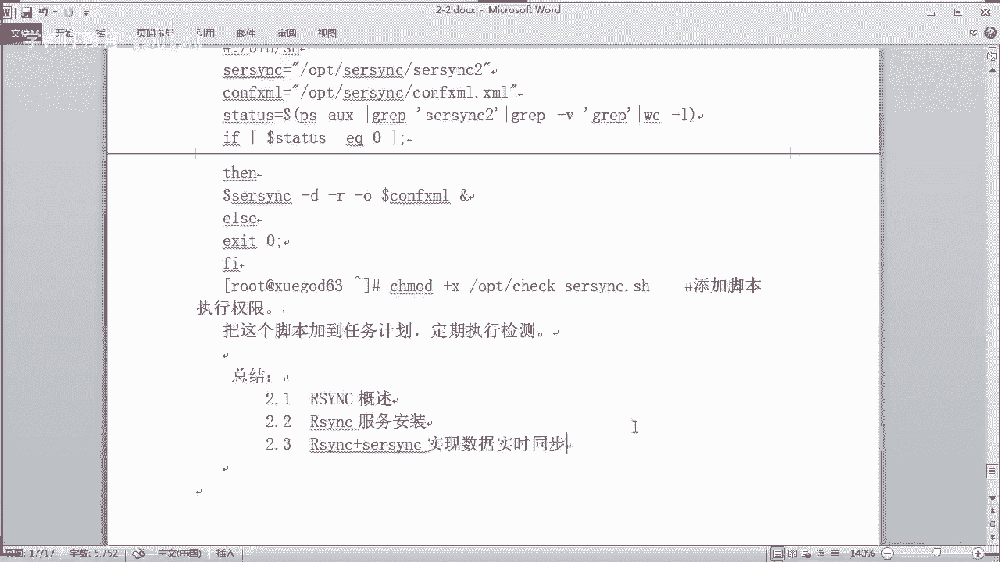

通过本课的学习，你已掌握了一个在生产环境中极为实用的数据同步与备份解决方案。请务必完成实验，加深理解。