# Linux运维：第七章：无人值守安装服务器配置教程 🚀

## 概述
在本节课中，我们将学习如何搭建一个无人值守安装服务器。通过这种方式，可以实现批量自动化安装Linux系统，无需人工干预，极大地提高了服务器部署的效率。我们将使用PXE、DHCP、TFTP和FTP等技术组合来实现这一目标。

---

## PXE原理与概念 🔍
上一节我们介绍了无人值守安装的基本概念，本节中我们来看看其核心原理。

PXE严格来说并非一种安装方式，而是一种引导方式。进行PXE安装的必要条件是，待安装的计算机必须包含一个支持PXE协议的网卡。这种网卡能够从网络启动并安装系统。

协议分为客户端和服务器端。PXE客户端程序通常存放在网卡的ROM中。当计算机引导时，BIOS会将PXE客户端程序调入内存执行。该客户端会将放置在远程服务器上的文件通过网络下载到本地执行。

运行PXE协议需要设置DHCP服务器和TFTP服务器。DHCP服务器用于给PXE客户端（即待安装系统的主机）分配IP地址。由于是给PXE客户端分配地址，因此在配置DHCP服务器时，需要增加相应的PXE设置。此外，PXE客户端的ROM中已经包含了TFTP客户端，因此它可以通过TFTP协议下载所需的启动文件。

---

## Kickstart工作原理 ⚙️
了解了网络引导的原理后，我们来看看实现无人值守安装的核心软件。

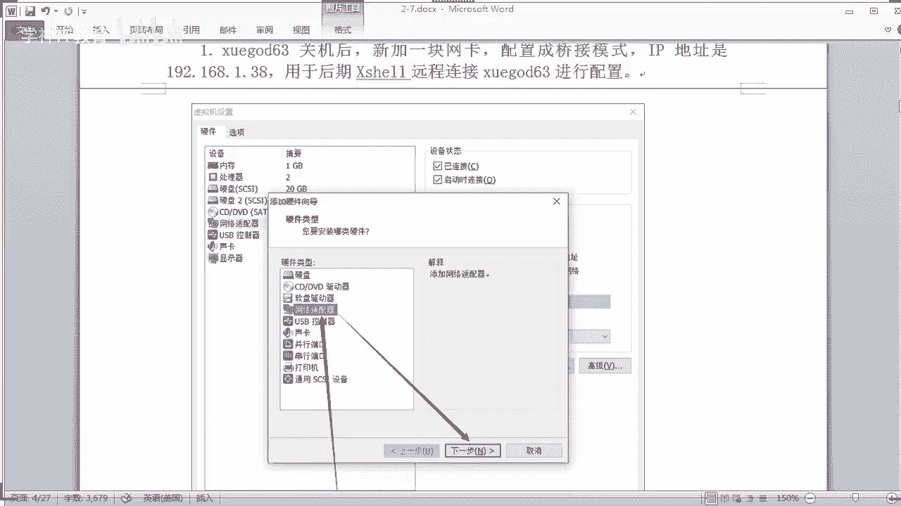

Kickstart是一种无人值守安装方式。它的工作原理是通过记录典型安装过程中所需人工干预填写的各种参数，并生成一个名为`ks.cfg`的应答文件。在后续的安装过程中，当出现需要填写参数的情况时，安装程序会首先查找这个应答文件，并按照文件中预设的参数自动填写，从而实现无人干预。

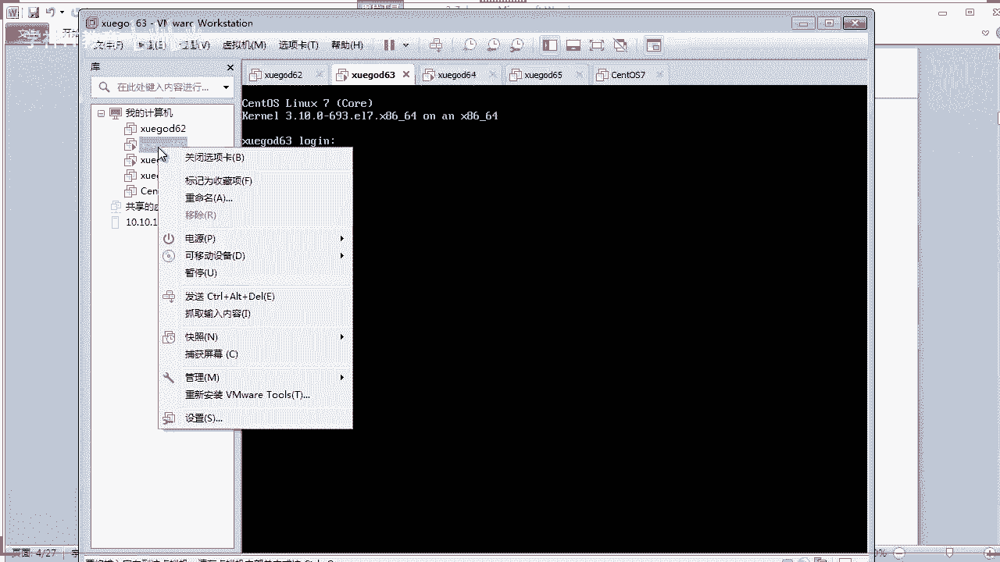

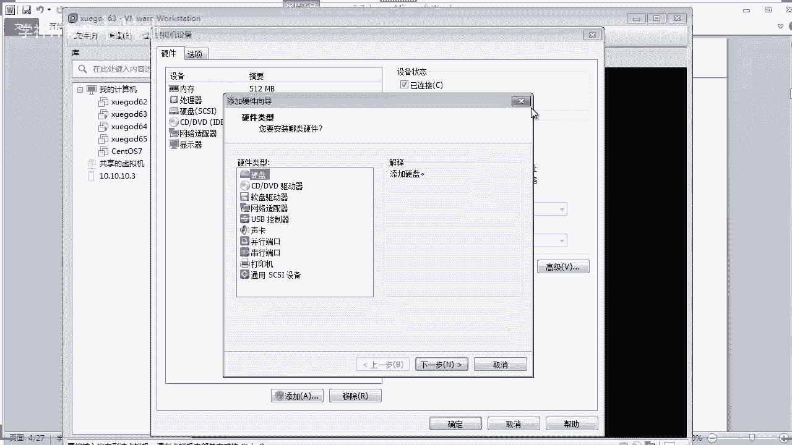


这个应答文件涵盖了安装过程中所有需要配置的参数，例如键盘语言、是否开启防火墙、磁盘分区方案、软件包选择等。安装程序只需被告知从何处获取这个`ks.cfg`文件，即可自动完成整个安装过程。安装完毕后，系统还会根据应答文件中的设置进行后续配置，如是否重启、是否配置软件源等。

---

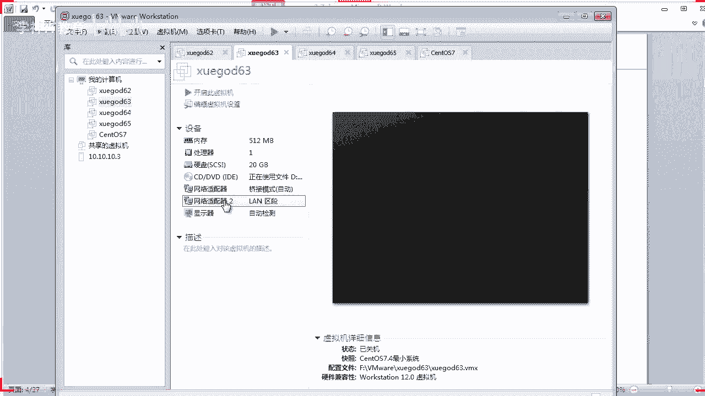

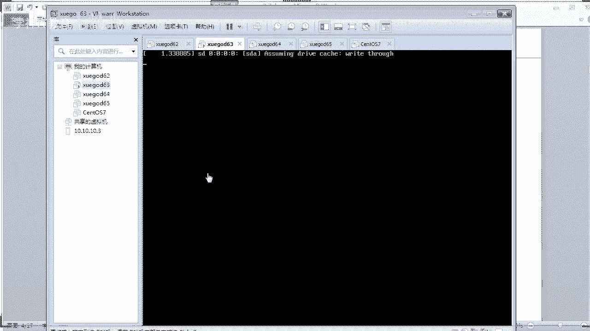

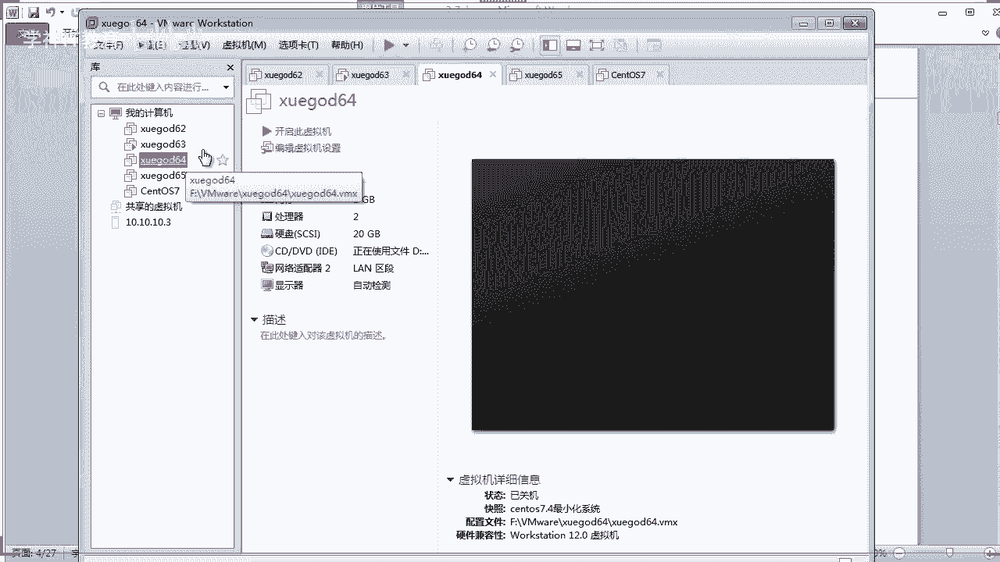

## 实验环境搭建 🛠️
在开始配置之前，我们需要搭建实验环境。建议准备三台虚拟机：一台作为服务器端，另外两台作为客户端用于测试。

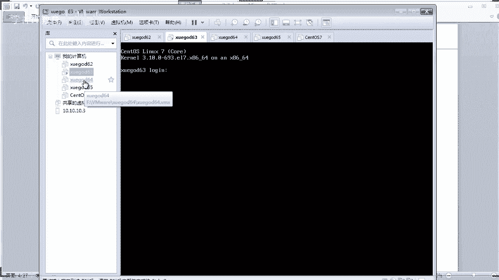

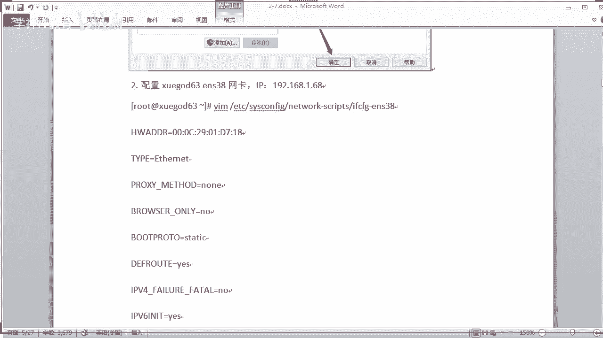

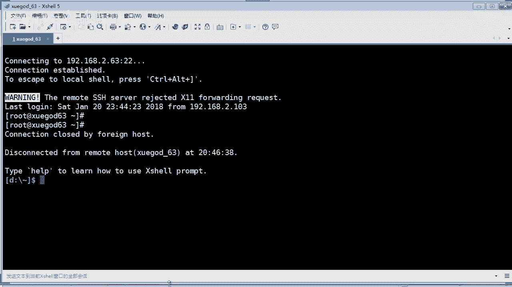

以下是服务器端网络配置的关键步骤：
1.  为服务器端配置两张网卡。
2.  第一张网卡设置为桥接模式，用于通过SSH工具（如Xshell）连接并进行配置。
3.  第二张网卡设置为特定的LAN区段（例如`LAN区段1`），用于与待安装的客户端处于同一网络，进行PXE引导。
4.  客户端虚拟机只需一张网卡，并将其同样设置为`LAN区段1`。

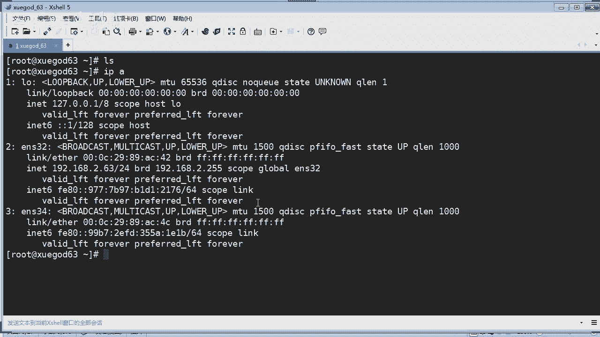

**注意**：请勿在服务器端的LAN区段网卡上使用NAT或主机模式，以避免与实验环境中的DHCP服务冲突。LAN模式可以模拟出一个纯粹的局域网环境。

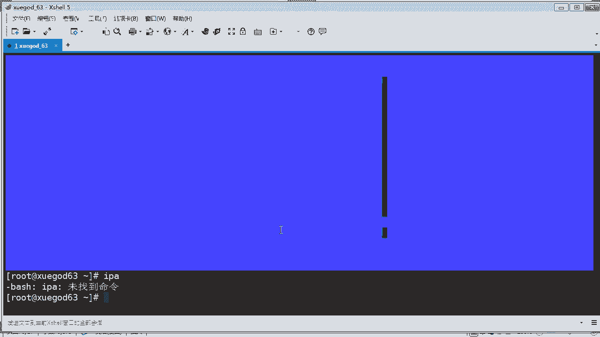

配置完成后，启动服务器端，并通过SSH连接其桥接网卡的IP地址进行后续操作。

---

## 服务安装与配置 📦
环境准备就绪后，我们开始在服务器端安装和配置所需的各种服务。

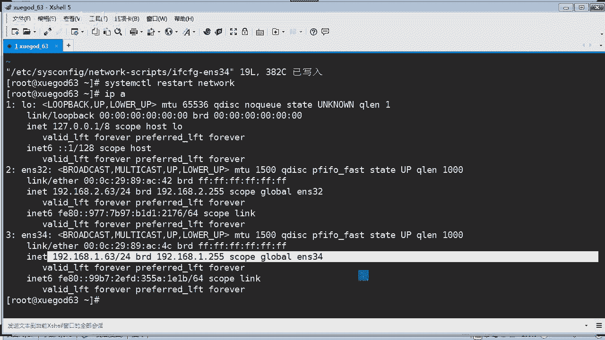

### 1. 配置静态IP地址
首先，我们需要为服务器端的第二张网卡（ens34）配置一个静态IP地址，以便后续服务能够正常绑定。

编辑网卡配置文件 `/etc/sysconfig/network-scripts/ifcfg-ens34`，内容如下：
```bash
TYPE=Ethernet
BOOTPROTO=static
NAME=ens34
DEVICE=ens34
ONBOOT=yes
IPADDR=192.168.1.63
NETMASK=255.255.255.0
GATEWAY=192.168.1.1
```
配置完成后，重启网络服务：`systemctl restart network`。

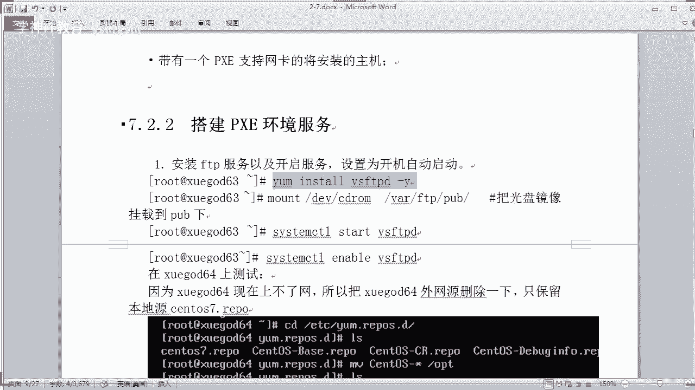

### 2. 安装与配置VSFTPD
FTP服务器用于提供系统安装镜像和应答文件的大文件传输。

执行以下命令安装VSFTPD：
```bash
yum install -y vsftpd
```
将CentOS安装光盘镜像挂载到FTP的默认共享目录：
```bash
mount /dev/cdrom /var/ftp/pub/
```
启动VSFTPD服务并设置为开机自启：
```bash
systemctl start vsftpd
systemctl enable vsftpd
```
可以使用`lftp`命令测试FTP服务是否正常。

### 3. 安装与配置TFTP-Server
TFTP服务器用于传输PXE启动所需的小文件。

执行以下命令安装TFTP及相关服务：
```bash
yum install -y tftp-server tftp xinetd
```
创建TFTP服务的工作目录：
```bash
mkdir /tftpboot
```
编辑TFTP配置文件 `/etc/xinetd.d/tftp`，修改服务器路径并启用服务：
```bash
service tftp
{
    socket_type = dgram
    protocol = udp
    wait = yes
    user = root
    server = /usr/sbin/in.tftpd
    server_args = -s /tftpboot
    disable = no
    per_source = 11
    cps = 100 2
    flags = IPv4
}
```
启动`xinetd`服务（它管理TFTP）并设置开机自启：
```bash
systemctl start xinetd
systemctl enable xinetd
```
可以使用`tftp`命令测试服务是否正常。

### 4. 安装Kickstart及启动文件
安装Kickstart工具及包含PXE启动文件的`syslinux`包：
```bash
yum install -y system-config-kickstart syslinux
```
将必要的启动文件复制到TFTP目录：
```bash
cp /usr/share/syslinux/pxelinux.0 /tftpboot/
cp /mnt/images/pxeboot/{vmlinuz,initrd.img} /tftpboot/
cp /mnt/isolinux/isolinux.cfg /tftpboot/pxelinux.cfg/default
```
为默认配置文件赋予可读权限：
```bash
chmod 644 /tftpboot/pxelinux.cfg/default
```

### 5. 安装与配置DHCP服务器
DHCP服务器为PXE客户端分配IP地址并告知其引导文件位置。

执行以下命令安装DHCP：
```bash
yum install -y dhcp
```
编辑DHCP主配置文件 `/etc/dhcp/dhcpd.conf`，内容如下：
```bash
subnet 192.168.1.0 netmask 255.255.255.0 {
    range 192.168.1.100 192.168.1.200;
    option domain-name-servers 192.168.1.63;
    option routers 192.168.1.1;
    default-lease-time 600;
    max-lease-time 7200;
    next-server 192.168.1.63;
    filename "pxelinux.0";
}
```
**关键配置说明**：
*   `next-server 192.168.1.63;` 指定TFTP服务器的地址。
*   `filename "pxelinux.0";` 指定PXE客户端需要下载的初始引导文件。

启动DHCP服务并设置为开机自启：
```bash
systemctl start dhcpd
systemctl enable dhcpd
```
此时可以启动一台客户端虚拟机，测试其能否自动获取到`192.168.1.0/24`网段的IP地址。

---

## 配置PXE引导菜单 📝
DHCP服务配置成功后，我们需要配置PXE的引导菜单，告诉客户端如何继续安装。

编辑TFTP目录下的默认引导菜单文件 `/tftpboot/pxelinux.cfg/default`：
1.  找到第一行 `default vesamenu.c32`，将其修改为 `default linux`。这表示默认引导入口名为`linux`。
2.  找到以 `label linux` 开头的段落（通常在61行附近），修改其`append`初始化行。关键是将安装源和应答文件的路径指向我们的FTP服务器：
```bash
append initrd=initrd.img inst.stage2=ftp://192.168.1.63/pub inst.ks=ftp://192.168.1.63/ks.cfg quiet
```
**参数解释**：
*   `inst.stage2=ftp://192.168.1.63/pub`：指定系统安装镜像的来源路径（FTP）。
*   `inst.ks=ftp://192.168.1.63/ks.cfg`：指定Kickstart应答文件的下载路径（FTP）。

---

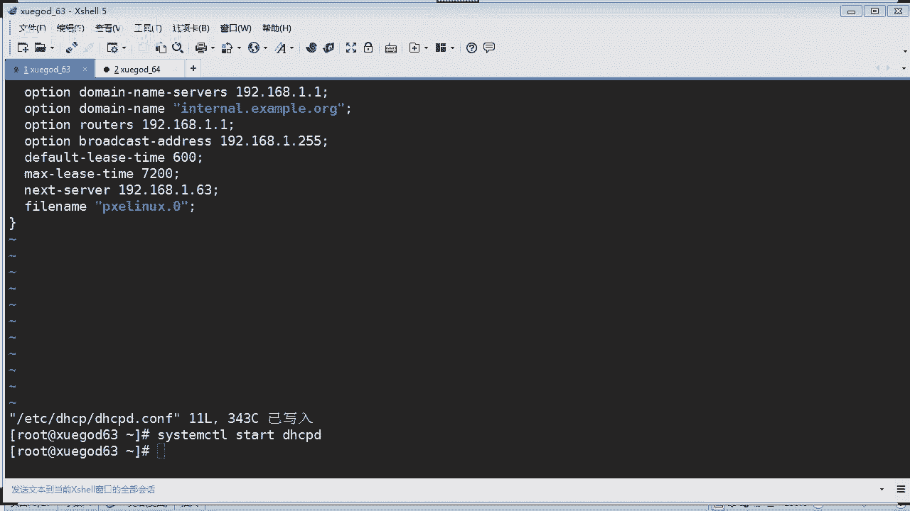

## 创建Kickstart应答文件 🗂️
这是无人值守安装的核心，它定义了系统安装的所有细节。

我们可以使用`system-config-kickstart`图形工具生成，但在无图形界面的服务器上，我们也可以手动编写。一个基本的`ks.cfg`应答文件示例如下，请将其保存到FTP根目录 `/var/ftp/ks.cfg`：
```bash
# 平台架构与安装方式
install
text
url --url="ftp://192.168.1.63/pub"
lang en_US.UTF-8
keyboard us
timezone Asia/Shanghai
auth --useshadow --passalgo=sha512
rootpw --plaintext 123456
# 注意：生产环境应使用加密密码
# rootpw --iscrypted $6$加密字符串

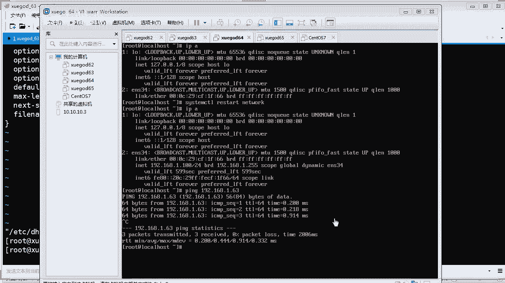

# 网络与安全配置
network --bootproto=dhcp --device=ens34
firewall --disabled
selinux --disabled

# 安装后引导配置
bootloader --location=mbr
zerombr
clearpart --all --initlabel
part /boot --fstype="xfs" --size=200
part / --fstype="xfs" --size=10240
part swap --fstype="swap" --size=1024

# 软件包选择
%packages
@^minimal
@core
vim-enhanced
%end

# 安装后脚本（例如配置Yum源）
%post
cat > /etc/yum.repos.d/local.repo << EOF
[local]
name=Local Repository
baseurl=ftp://192.168.1.63/pub
enabled=1
gpgcheck=0
EOF
%end

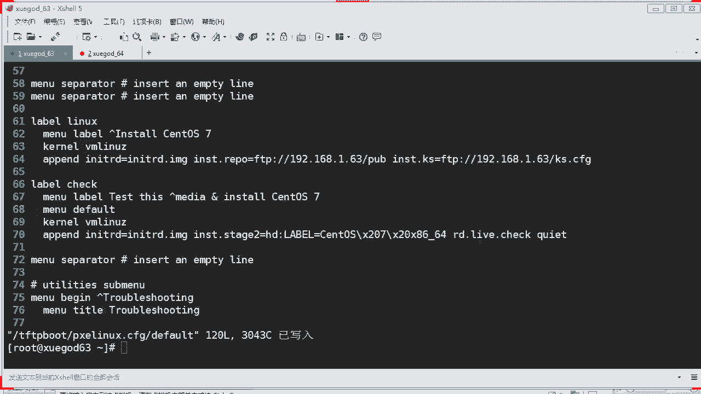

# 重启系统
reboot
```
**文件说明**：
此文件定义了最小化安装、自动分区、设置root密码、禁用防火墙和SELinux、安装后自动配置本地Yum源并重启等操作。

---

## 实战测试 🧪
所有配置完成后，就可以进行实战测试了。

1.  确保服务器端的所有服务（DHCP、TFTP/xinetd、VSFTPD）均已正常运行。
2.  新建或重启一台客户端虚拟机，将其网络适配器设置为与服务器端第二张网卡相同的LAN区段。
3.  启动客户端虚拟机，并将其BIOS启动顺序设置为**网络引导优先**，或确保硬盘无系统以触发网络引导。
4.  客户端将自动从DHCP服务器获取IP，从TFTP服务器下载引导文件，然后根据`pxelinux.cfg/default`的指引，从FTP服务器下载安装镜像和`ks.cfg`应答文件。
5.  系统将开始全自动安装，无需任何手动干预。安装完成后，系统会自动重启。

---

## 总结
本节课中，我们一起学习了搭建无人值守安装服务器的完整流程。

我们首先了解了PXE网络引导和Kickstart自动应答的原理。然后，我们逐步搭建了实验环境，并安装了DHCP、TFTP和FTP服务。通过配置这些服务，我们实现了为客户端自动分配IP、提供启动文件和系统安装源的功能。接着，我们创建了核心的Kickstart应答文件，定义了系统安装的所有细节。最后，我们通过实战测试验证了整个无人值守安装流程的可行性。

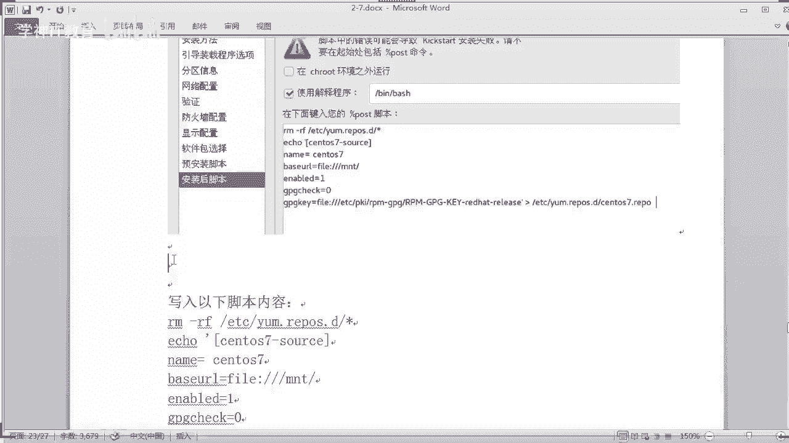

掌握这项技术，可以极大地简化大规模Linux服务器的部署工作，实现高效、统一的系统安装。