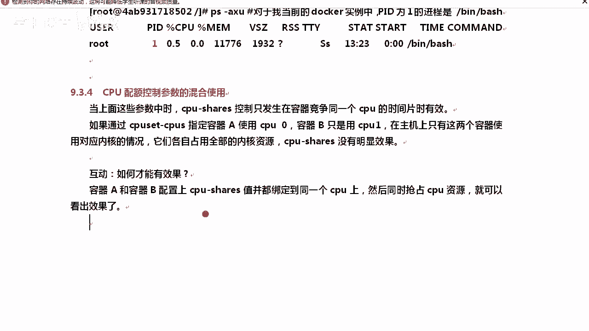
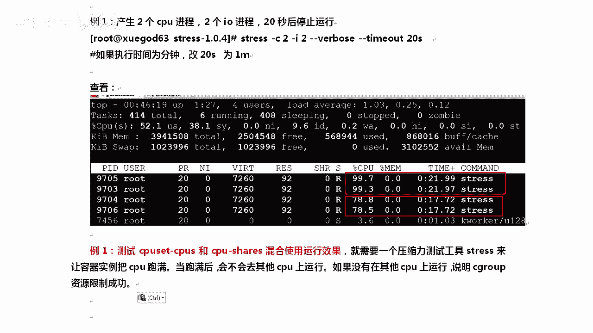
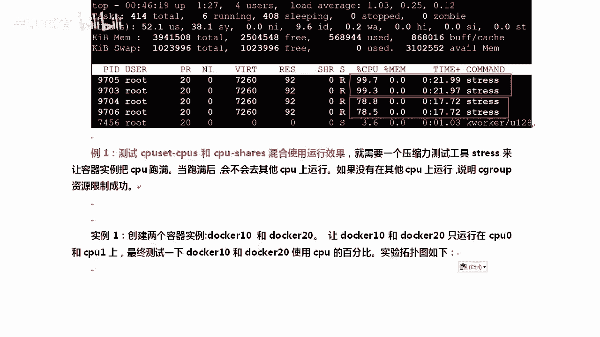
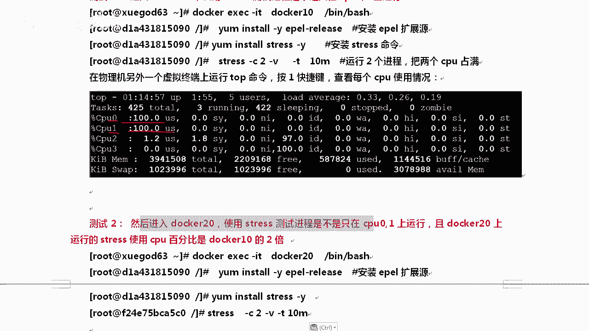
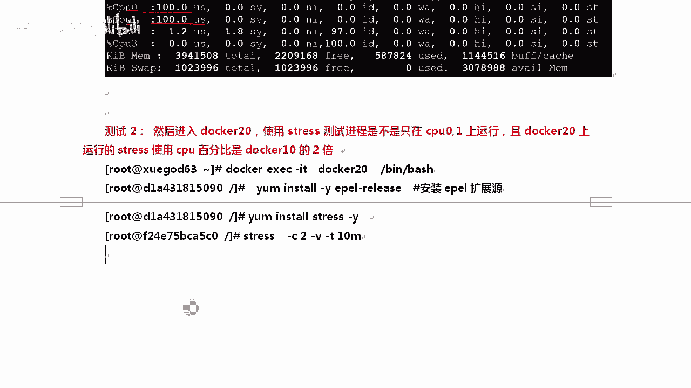
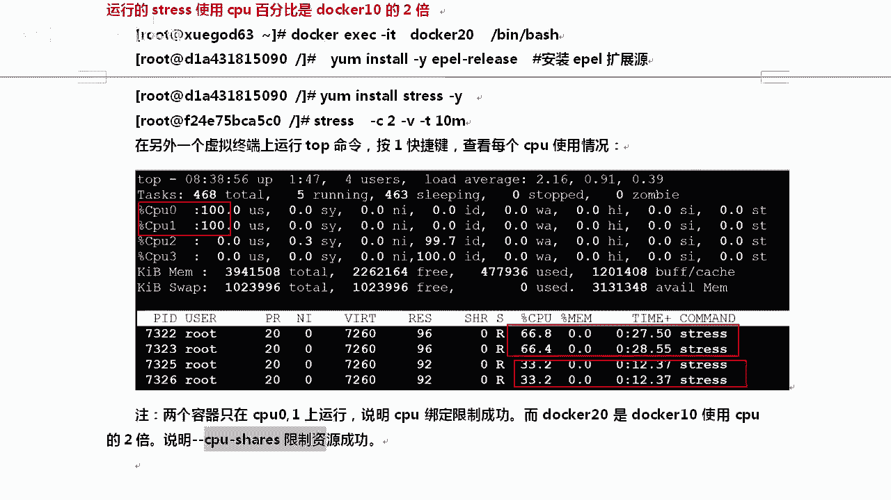
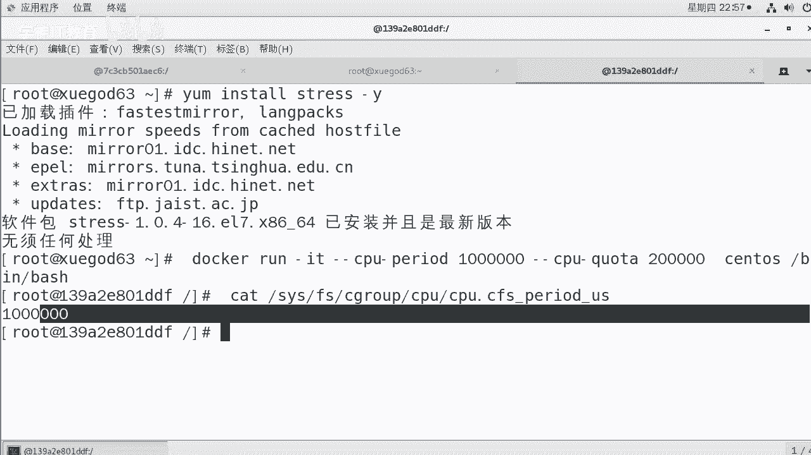

# Docker容器资源配额控制：2：CPU配额控制

## 概述
在本节课中，我们将要学习Docker容器资源配额控制的核心部分——CPU控制。我们将了解Docker如何通过Linux内核的Cgroup机制来限制容器对CPU资源的使用，并学习多种控制CPU配额的方法，包括权重分配、CPU核心绑定以及周期配额。

## Cgroup机制简介
上一节我们介绍了容器命名，本节中我们来看看资源配额控制的基础。Docker通过Linux内核的Cgroup机制来控制容器的资源使用。Cgroup是Control Groups的缩写，它可以限制进程对物理资源（如CPU、内存、磁盘I/O）的使用。Docker等项目利用Cgroup来实现精细化的资源控制。

## 为何需要CPU配额控制
为什么要对容器进行CPU配额控制呢？当多个容器在同一主机上运行时，为了防止某个容器（例如被攻击的容器）占用所有硬件资源，导致其他容器无法正常工作，我们必须对资源进行限制。Docker的CPU控制远比简单的“使用1个或2个CPU核心”更为精细。

## CPU份额（权重）控制
首先，我们来看看如何为Docker容器指定CPU的使用份额。这通过`--cpu-shares`参数实现。

**核心概念公式/代码**：
```bash
docker run -it --cpu-shares 512 <镜像名>
```

*   `--cpu-shares`参数用于设置容器的CPU权重，默认值为1024。
*   这个值是一个相对权重，并不保证容器一定能获得1个CPU核心或固定的CPU频率。它是一种弹性机制，旨在最大化利用空闲资源。

以下是关于CPU份额权重的关键点列表：
*   **权重比较**：当多个容器竞争同一个CPU核心时，权重高的容器获得CPU时间片的机会更大。例如，容器A权重为1000，容器B权重为500，则A获得CPU的机会大约是B的两倍。
*   **空闲资源利用**：如果权重高的容器处于空闲状态，那么权重低的容器可以占用更多的CPU资源，避免了资源浪费。
*   **单容器场景**：如果主机上只运行了一个容器，即使其CPU份额设置得很低，它也可以独占整个CPU资源。

**如何验证配置**：创建容器后，可以通过查看Cgroup文件系统来验证配置是否生效。
```bash
cat /sys/fs/cgroup/cpu/docker/<容器ID>/cpu.shares
```
如果该文件中的值为512，则说明配置成功。

## CPU核心绑定
接下来，我们学习如何将容器绑定到特定的CPU核心上运行。这对于多核CPU服务器尤其有用，可以减少CPU上下文切换，提升性能。这通过`--cpuset-cpus`参数实现。

**核心概念公式/代码**：
```bash
docker run -it --cpuset-cpus="0-2" <镜像名>
```

上述命令将容器限制只能在CPU0、CPU1和CPU2上运行。

**背景知识：CPU亲和力**：在Linux中，可以使用`taskset`命令为进程设置CPU亲和力。这有助于我们理解Docker的CPU绑定原理。
```bash
# 将PID为1089的进程绑定到CPU1和CPU2上运行
taskset -cp 1,2 1089
# 查看PID为1的进程的CPU亲和力
taskset -cp 1
```

**验证Docker CPU绑定**：为容器设置CPU绑定后，可以进入容器内部，使用`taskset`命令查看其进程的CPU亲和力，确认绑定生效。

## 混合使用份额与绑定
现在，我们将CPU份额控制与核心绑定结合起来使用。`--cpu-shares`的权重效果只有在多个容器竞争**同一个**CPU核心时才会显现。



因此，为了测试权重分配的效果，我们需要：
1.  创建两个容器（例如`docker10`和`docker20`）。
2.  使用`--cpuset-cpus`将两个容器绑定到相同的CPU核心上（例如`0,1`）。
3.  为它们设置不同的CPU份额（例如512和1024）。
4.  同时在两个容器内运行CPU压力测试，观察它们对绑定核心的资源占用比例。


## CPU压力测试工具：stress
为了将CPU跑满以进行测试，我们需要一个工具。`stress`是一个常用的系统压力测试工具。

**安装与核心参数**：
```bash
# 在CentOS/RHEL系统上安装
yum install -y epel-release
yum install -y stress
```
`stress`命令的常用参数：
*   `-c N`：产生N个进程，每个进程反复计算随机数的平方根，用于压测CPU。
*   `-i N`：产生N个进程，每个进程反复调用`sync()`，用于产生IO压力。
*   `-t N`：指定测试运行N秒后停止。

**示例**：产生2个CPU压测进程和2个IO压测进程，运行20秒。
```bash
stress -c 2 -i 2 -t 20
```

## 实践：测试混合配额效果
以下是测试CPU份额与绑定混合效果的步骤概要：
1.  **创建容器**：
    ```bash
    # 容器docker10，权重512，绑定CPU0,1
    docker run -itd --name docker10 --cpuset-cpus="0,1" --cpu-shares=512 centos:7
    # 容器docker20，权重1024，绑定CPU0,1
    docker run -itd --name docker20 --cpuset-cpus="0,1" --cpu-shares=1024 centos:7
    ```
2.  **进入容器并安装stress**：分别进入两个容器，安装`stress`工具。如果镜像中无法直接安装，可能需要从外部传入预编译的二进制包。
3.  **运行压力测试**：在两个容器中同时运行`stress -c 2`命令。
4.  **观察结果**：在宿主机上运行`top`命令，按`1`查看所有CPU核心的利用率。你将观察到：
    *   CPU0和CPU1的利用率接近100%。
    *   CPU2和CPU3的利用率很低。
    *   在两个竞争核心上，`docker20`（权重1024）占用的CPU时间大约是`docker10`（权重512）的两倍（如66% vs 33%）。





这证明了CPU绑定和份额权重控制同时生效。

## CPU周期与配额限制（了解）
最后，我们了解一种更绝对的CPU控制方式：`--cpu-period`和`--cpu-quota`。它们以微秒为单位，设置了容器在固定周期内能使用的CPU时间上限，属于硬性限制。

**核心概念**：
*   `--cpu-period`：指定一个周期长度（默认100000微秒，即0.1秒）。
*   `--cpu-quota`：指定在该周期内容器最多可以使用的CPU时间。

**示例**：设置容器每1秒（1000000微秒）内，只能使用0.2秒（200000微秒）的CPU时间。
```bash
docker run -it --cpu-period=1000000 --cpu-quota=200000 <镜像名>
```
这意味着该容器的CPU使用率最高将被限制在20%。





**验证**：可以通过查看Cgroup文件来确认设置。
```bash
cat /sys/fs/cgroup/cpu/docker/<容器ID>/cpu.cfs_period_us
cat /sys/fs/cgroup/cpu/docker/<容器ID>/cpu.cfs_quota_us
```



## 总结
本节课中我们一起学习了Docker容器CPU资源配额控制的多种方法：
1.  **CPU份额（`--cpu-shares`）**：一种基于权重的弹性共享机制，在多个容器竞争CPU时按比例分配时间片。
2.  **CPU核心绑定（`--cpuset-cpus`）**：将容器进程限定在指定的CPU核心上运行，有助于提升缓存利用率和性能。
3.  **CPU周期配额（`--cpu-period`/`--cpu-quota`）**：提供硬性的CPU使用时间上限，实现更精确的绝对限制。
4.  **压力测试工具**：学会了使用`stress`工具来模拟CPU高负载，验证配额控制的效果。




通过结合使用这些技术，你可以有效地管理和隔离容器间的CPU资源，确保容器化应用的稳定性和性能。