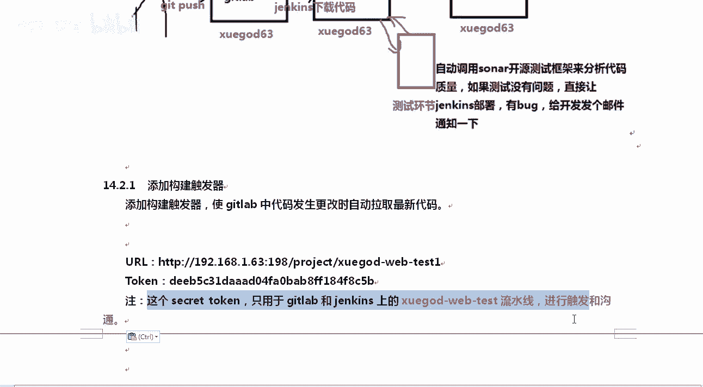
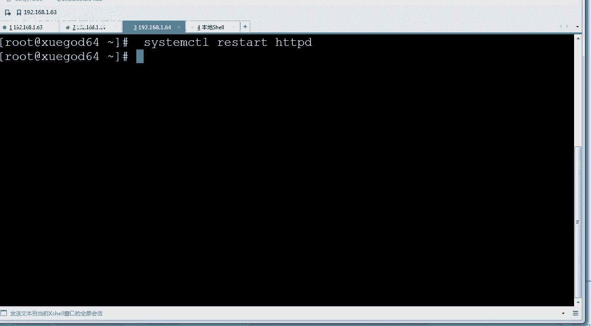
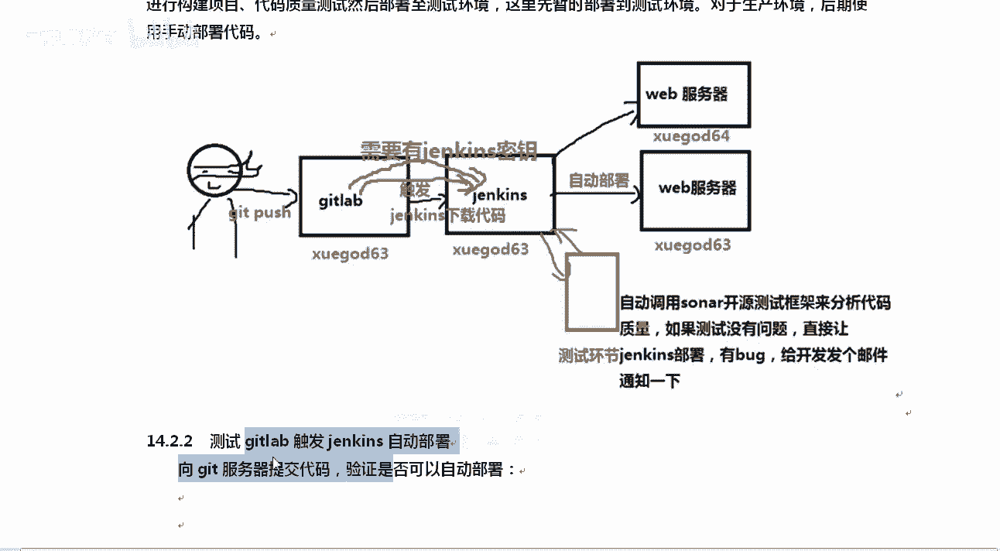
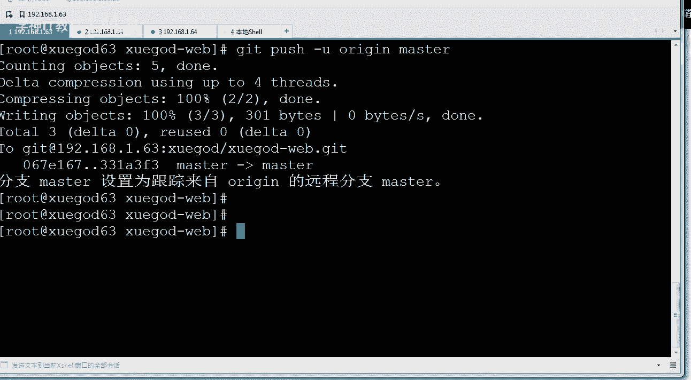
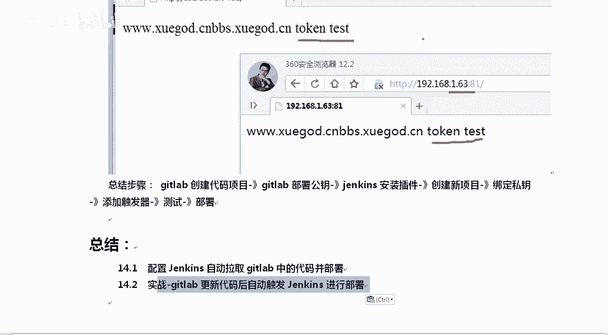

# Linux运维：RHCE：扩展-GitLab与Jenkins持续集成平台使用方法 - P2：2-实战-gitlab更新代码后自动触发Jenkins进行部署

在本节课中，我们将学习如何配置GitLab与Jenkins，实现当GitLab仓库代码更新时，自动触发Jenkins执行构建与部署任务。这是持续集成/持续部署（CI/CD）流程中的核心环节。

## 概述与原理

上一节我们介绍了Jenkins与GitLab的基本集成。本节中我们来看看如何实现自动化触发。

实现自动触发的核心是**触发器**。其原理是：当开发人员向GitLab仓库推送（Push）代码后，GitLab通过其**Webhook**功能，主动通知Jenkins。Jenkins收到通知后，自动拉取最新代码并执行预设的构建与部署脚本。

为了实现双方的安全通信，需要交换密钥：
*   GitLab需要持有Jenkins的令牌（Token），用于向Jenkins发起触发请求。
*   Jenkins需要持有GitLab的私钥，用于拉取GitLab上的代码。

## 实战步骤

以下是配置GitLab Webhook自动触发Jenkins的详细步骤。

### 第一步：在Jenkins项目中配置触发器



所有自动化操作都由Jenkins完成。首先，我们需要在对应的Jenkins任务中设置构建触发器。



1.  进入你的Jenkins任务，点击 **`配置`**。
2.  在配置页面中找到 **`构建触发器`** 板块。
3.  勾选 **`Build when a change is pushed to GitLab`** 选项。这表示当GitLab有代码推送时触发构建。
4.  系统会显示一个 **`URL`** 和一个 **`Secret token`** 生成按钮。
    *   **`URL`**：是GitLab Webhook需要调用的Jenkins接口地址。
    *   **`Secret token`**：是用于身份验证的令牌，需要生成并复制保存。
5.  点击 **`Generate`** 生成令牌，并立即复制。稍后需要在GitLab中使用。
6.  记录下 **`URL`** 和 **`Secret token`**，点击页面底部的 **`保存`** 按钮。

### 第二步：在GitLab中配置Webhook

接下来，我们需要在对应的GitLab项目中设置Webhook，使其能向Jenkins发送通知。

1.  以管理员身份登录GitLab，进入 **`管理中心`** -> **`设置`** -> **`网络`**。
2.  展开 **`外发请求`** 区域，勾选 **`允许来自Webhook和服务对本地网络的请求`**，然后点击 **`保存`**。此步骤允许GitLab向部署在内网的Jenkins发送请求。
3.  进入你需要配置的GitLab项目，点击 **`设置`** -> **`Webhook`**。
4.  在添加Webhook页面中：
    *   **`URL`**：填写第一步中从Jenkins复制来的URL地址。
    *   **`Secret token`**：填写第一步中生成并复制的Secret token。
    *   **`触发器`**：至少勾选 **`Push events`**（推送事件）。
5.  点击 **`添加Webhook`**。

### 第三步：测试Webhook连接

添加Webhook后，必须测试其是否能够正常工作。

1.  在GitLab的Webhook页面，找到刚添加的Webhook，点击 **`测试`** -> **`Push events`**。
2.  GitLab会模拟一次推送事件，向Jenkins发送请求。如果测试成功，页面会提示 **`Hook executed successfully: HTTP 200`**。
3.  同时，回到Jenkins面板，你应该能看到一个新的构建任务被自动触发，并且状态为 **`Started by GitLab push by ...`**。



### 第四步：模拟开发流程进行验证

现在，我们来模拟一次真实的代码提交，验证整个自动化流程。

1.  在本地或测试服务器上克隆GitLab项目：
    ```bash
    git clone <你的GitLab项目地址>
    cd <项目目录>
    ```
2.  修改项目文件，例如向`index.html`添加内容：
    ```bash
    echo "test 111" >> index.html
    ```
3.  将修改提交并推送到GitLab：
    ```bash
    git add index.html
    git commit -m "修改了HTML文件"
    git push origin master
    ```
4.  观察Jenkins面板：
    *   推送完成后，Jenkins会自动启动一个新的构建任务（如`#5`）。
    *   等待构建完成，状态应为 **`成功`**。
5.  访问部署好的网站，确认修改已生效。



如果网站内容已更新为包含“test 111”，则说明整个“GitLab推送 -> 触发Jenkins -> 自动构建部署”的流程已完全跑通。

## 总结

本节课中我们一起学习了如何搭建GitLab与Jenkins之间的自动化触发链路。关键步骤总结如下：
1.  **Jenkins配置**：在任务中启用GitLab构建触发器，获取`URL`和`Secret token`。
2.  **GitLab配置**：在项目设置中添加Webhook，填入Jenkins提供的`URL`和`Secret token`。
3.  **双向认证**：确保Jenkins拥有拉取GitLab代码的SSH密钥，GitLab拥有触发Jenkins的令牌。
4.  **流程测试**：通过测试按钮和真实代码提交验证自动化流程是否生效。



通过以上配置，我们实现了基本的持续集成流程，为更复杂的自动化测试、质量检查和多环境部署打下了坚实基础。