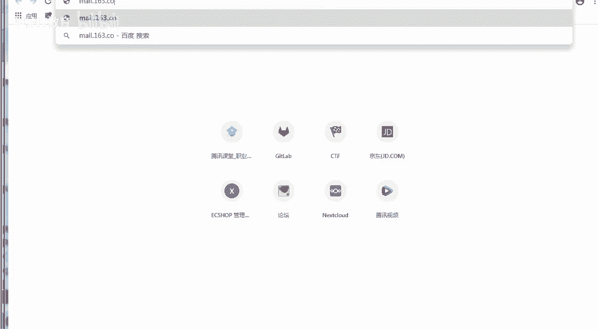
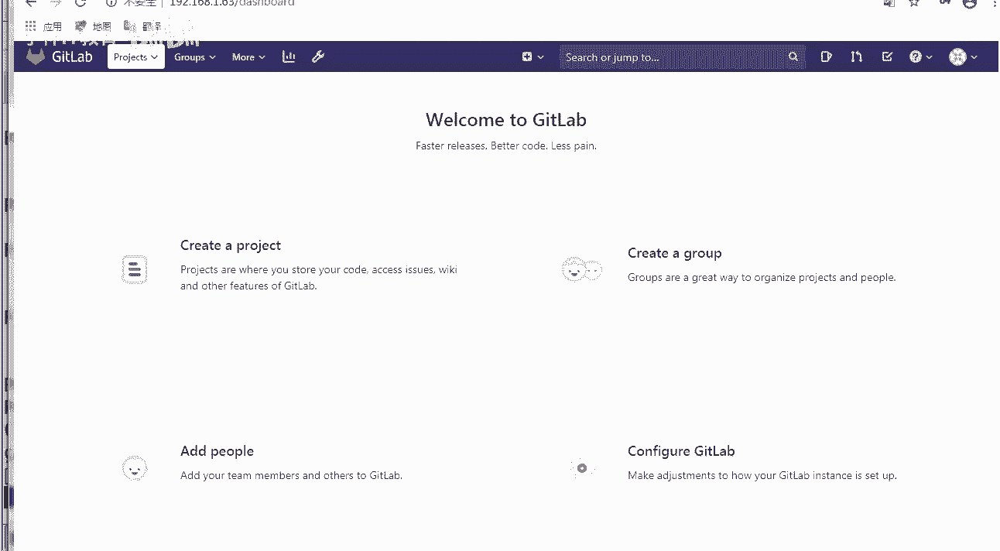
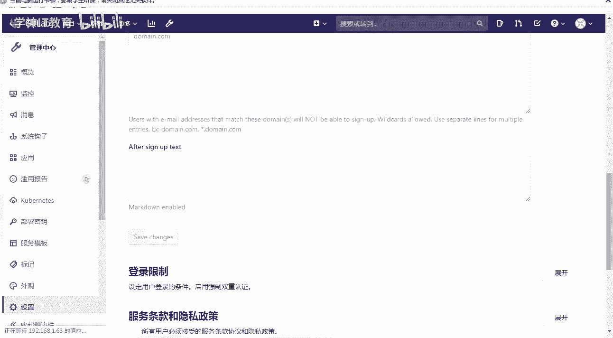
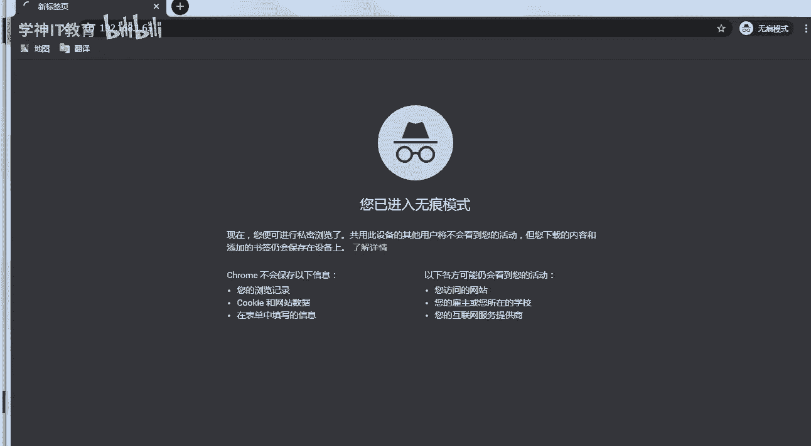

# GitLab与Jenkins结合构建持续集成-CI环境：P2：配置GitLab邮件服务与平台汉化 🛠️

在本节课中，我们将学习如何为GitLab配置邮件服务，以便在账号注册、合并请求等场景下发送通知邮件。同时，我们也会将GitLab平台的界面语言切换为简体中文，使其更易于使用。

## 邮件服务配置 📧

上一节我们完成了GitLab的安装与基础访问。本节中，我们来看看如何配置邮件服务。GitLab的邮件功能在许多场景下都非常有用，例如用户注册验证、密码修改通知等。

### 获取邮箱授权码

配置邮件服务前，需要从您的邮箱服务商（如163、QQ邮箱）获取一个“授权码”。授权码用于第三方应用安全登录您的邮箱，并非您的邮箱登录密码。

以下是获取163邮箱授权码的步骤：
1.  登录您的163邮箱。
2.  进入“设置” -> “POP3/SMTP/IMAP”选项。
3.  开启“POP3/SMTP服务”和“IMAP/SMTP服务”。
4.  根据提示，使用绑定的手机号获取并设置“授权码”。请妥善保管此授权码。

### 修改GitLab配置文件

GitLab的主配置文件位于 `/etc/gitlab/gitlab.rb`。我们需要修改此文件来配置SMTP邮件服务。

以下是需要修改的关键配置项。请找到对应行（通常在609行附近），并取消注释（删除行首的 `#` 号）进行修改：

```ruby
gitlab_rails['smtp_enable'] = true
gitlab_rails['smtp_address'] = "smtp.163.com"
gitlab_rails['smtp_port'] = 465
gitlab_rails['smtp_user_name'] = "your_email@163.com"
gitlab_rails['smtp_password'] = "your_authorization_code"
gitlab_rails['smtp_domain'] = "163.com"
gitlab_rails['smtp_authentication'] = "login"
gitlab_rails['smtp_enable_starttls_auto'] = true
gitlab_rails['smtp_tls'] = true
```

**核心概念说明**：
*   **`smtp_port`**：端口号设置为 `465`，这是因为我们启用了 `smtp_tls` 加密传输。标准的非加密SMTP端口是 `25`。
*   **`smtp_password`**：此处应填写您上一步获取的**授权码**，而非邮箱登录密码。

### 应用配置并测试

配置文件修改完成后，需要重新配置GitLab以使更改生效。



```bash
sudo gitlab-ctl reconfigure
```




执行此命令后，可以通过GitLab提供的控制台工具测试邮件发送功能。


以下是测试邮件发送的步骤：
1.  进入GitLab Rails控制台：
    ```bash
    sudo gitlab-rails console
    ```
2.  等待控制台加载完成，出现 `irb(main):001:0>` 提示符。
3.  输入以下Ruby脚本（请替换 `recipient@example.com` 为您的测试邮箱地址）：
    ```ruby
    Notify.test_email('recipient@example.com', '邮件主题', '邮件正文').deliver_now
    ```
4.  执行后，检查您的测试邮箱是否收到了标题为“邮件主题”、内容为“邮件正文”的邮件。如果收到，说明邮件服务配置成功。

## 平台界面汉化 🇨🇳

配置好邮件服务后，我们来看看如何将GitLab的界面切换为中文。新版本的GitLab（如12.9及以上）已内置多语言支持，无需额外安装汉化包。

以下是切换语言的步骤：
1.  使用管理员账号登录GitLab。
2.  点击右上角用户头像，在下拉菜单中选择 **“Settings”（设置）**。
3.  在左侧导航栏中，点击 **“Preferences”（偏好设置）**。
4.  页面下拉找到 **“Localization”（本地化）** 区域。
5.  在 **“Language”（语言）** 下拉菜单中，选择 **“简体中文”**。
6.  滚动到页面底部，点击 **“Save changes”（保存更改）** 按钮。
7.  刷新页面，即可看到GitLab界面已切换为简体中文。

## 关闭公开注册功能 🔒

默认情况下，GitLab允许任何人注册账号。对于企业内部代码管理平台，这通常是不安全的。我们应该关闭公开注册功能，所有用户账号由管理员统一创建和管理。

以下是关闭公开注册的步骤：
1.  以管理员身份登录GitLab。
2.  点击顶部导航栏的 **“管理中心”**（扳手图标）。
3.  在左侧边栏，点击 **“设置”** -> **“通用”**。
4.  展开 **“账号与限制”** 区域。
5.  找到 **“注册限制”** 下的 **“允许注册”** 选项。
6.  取消勾选该复选框。
7.  滚动到页面底部，点击 **“保存更改”** 按钮。

完成此设置后，新用户访问您的GitLab实例时将看不到注册入口，只能通过管理员创建的账号进行登录。



## 总结 📝



本节课中我们一起学习了GitLab平台的两项重要配置。
*   首先，我们配置了SMTP邮件服务，通过修改 `/etc/gitlab/gitlab.rb` 配置文件并获取邮箱授权码，实现了GitLab的邮件通知功能。
*   其次，我们将平台界面语言切换为简体中文，并关闭了公开注册功能，使GitLab更符合企业内部使用的安全和易用性要求。


完成这些基础配置后，我们的GitLab环境已经准备就绪。下一节，我们将开始实际使用GitLab，创建项目、管理用户和代码仓库。