# Linux运维：P2：FTP_SSL配置及NFS配置_02 🔧

在本节课中，我们将要学习如何为FTP服务配置SSL加密以实现更安全的数据传输，以及如何安装和配置NFS（网络文件系统）来实现跨网络的目录共享。我们将从生成自签名证书开始，逐步完成FTP的SSL配置，然后转向NFS的安装、共享目录设置和客户端挂载。

---

## FTP服务SSL加密配置 🔐

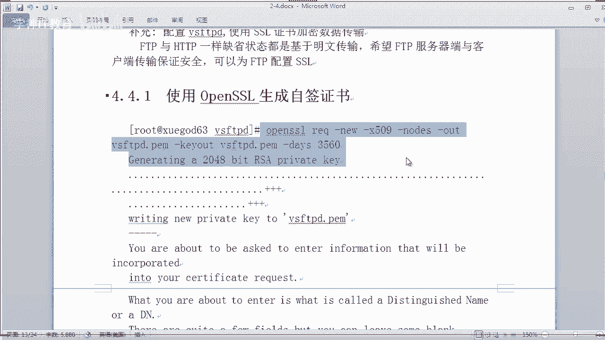

上一节我们介绍了FTP的基本配置与访问控制。本节中我们来看看如何为FTP服务启用SSL/TLS加密，以保护数据传输过程，防止信息在传输中被窃取。

FTP服务默认使用明文传输数据，这在公网环境中存在安全风险。通过配置SSL证书，可以实现类似HTTPS的加密传输。

### 生成自签名SSL证书

首先，我们需要在FTP服务器上使用OpenSSL工具生成一个自签名证书。

```bash
# 使用openssl生成证书和密钥，并合并到同一个文件中
openssl req -x509 -nodes -newkey rsa:2048 -keyout /etc/vsftpd/vsftpd.pem -out /etc/vsftpd/vsftpd.pem -days 3650
```

执行上述命令后，会提示输入证书信息（如国家、省份、组织名称等），这些信息可以自定义填写。生成的证书文件`vsftpd.pem`同时包含了证书和私钥。

为了便于管理，我们将证书文件移动到特定目录并设置权限。

```bash
# 创建隐藏目录存放证书
mkdir /etc/vsftpd/.sslkeys
# 移动证书文件
mv /etc/vsftpd/vsftpd.pem /etc/vsftpd/.sslkeys/
# 设置严格的权限，仅允许root读取
chmod 400 /etc/vsftpd/.sslkeys/vsftpd.pem
```

### 配置VSFTPD支持SSL

接下来，我们需要修改VSFTPD的主配置文件，使其支持SSL加密访问。

编辑配置文件`/etc/vsftpd/vsftpd.conf`，在文件中添加以下配置项：

```
# 启用SSL支持
ssl_enable=YES
# 不允许匿名用户使用SSL
allow_anon_ssl=NO
# 强制所有非匿名用户使用加密登录和数据传输
force_local_data_ssl=YES
force_local_logins_ssl=YES
# 指定SSL协议版本
ssl_tlsv1=YES
ssl_sslv2=NO
ssl_sslv3=NO
# 安全相关配置
require_ssl_reuse=NO
ssl_ciphers=HIGH
# 指定SSL证书和密钥文件路径
rsa_cert_file=/etc/vsftpd/.sslkeys/vsftpd.pem
rsa_private_key_file=/etc/vsftpd/.sslkeys/vsftpd.pem
```

**注意**：配置应放在文件中部，不要放在文件末尾，否则可能导致服务启动失败。保存修改后，重启VSFTPD服务。

```bash
systemctl restart vsftpd
```

如果重启成功且无报错，说明SSL配置生效。此时，普通的FTP客户端将无法连接，必须使用支持SSL/TLS的客户端（如FileZilla）并选择“显式的FTP over TLS”加密方式才能连接。连接时，客户端会提示证书未知，选择信任并继续即可。

---

## NFS网络文件系统配置 📁

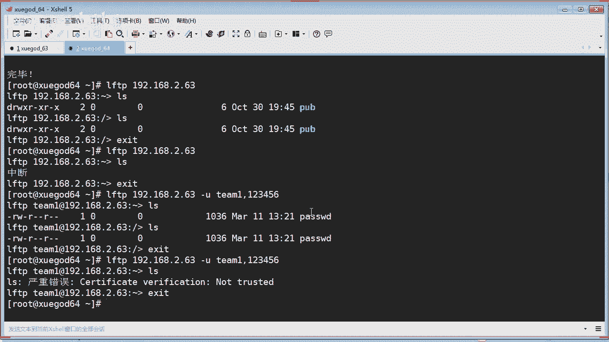

完成了FTP的安全加固后，我们转向另一个重要的网络服务——NFS。NFS允许系统通过网络共享目录和文件，客户端可以像访问本地文件一样访问远程文件，常用于在多台服务器间同步网站代码等场景。

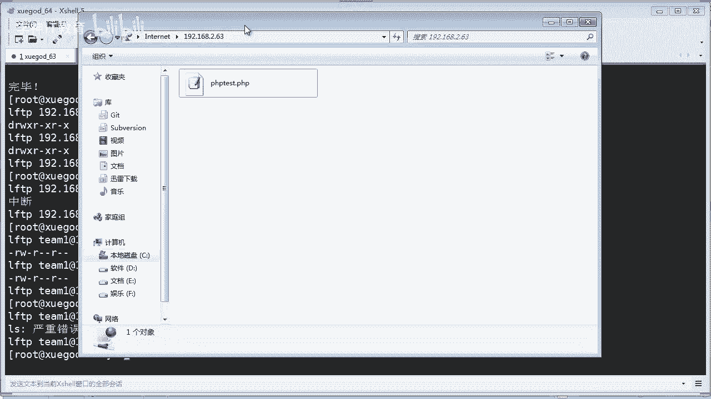

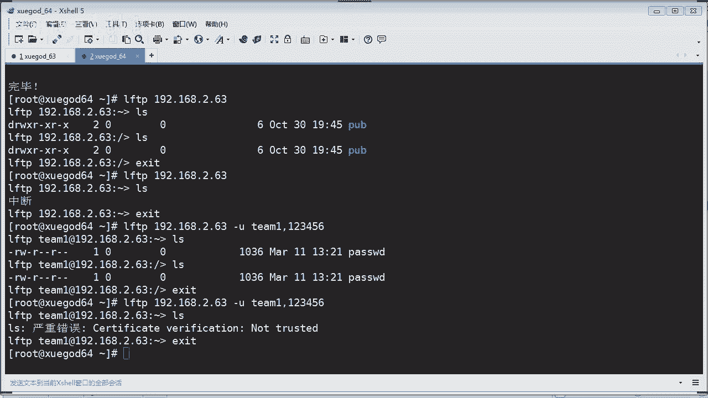

### 安装与启动NFS服务

在作为NFS服务器的机器上，安装NFS软件包及其依赖。

```bash
yum install -y nfs-utils rpcbind
```

安装完成后，启动相关服务并设置为开机自启。

```bash
# 启动RPC绑定服务（NFS依赖）
systemctl start rpcbind
# 启动NFS服务
systemctl start nfs
# 设置开机自启
systemctl enable rpcbind nfs
```

使用`netstat`命令检查NFS默认端口2049是否在监听，以确认服务启动成功。


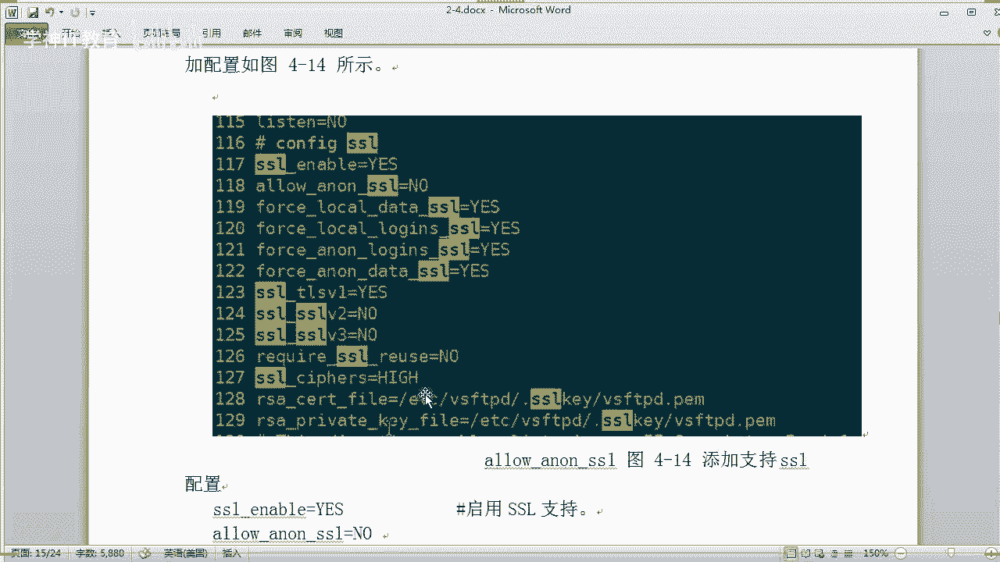

```bash
netstat -tunlp | grep 2049
```

### 配置NFS共享目录

NFS的共享配置非常简单，主要通过编辑`/etc/exports`文件实现。

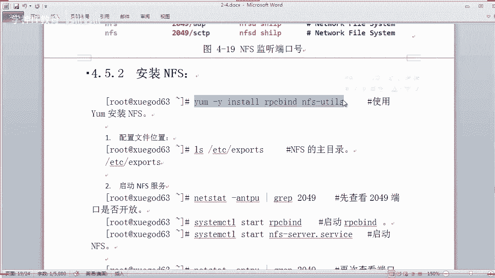

假设我们要将`/opt`目录共享给所有客户端，并赋予读写权限。

编辑`/etc/exports`文件，添加如下一行：

```
/opt *(rw)
```

*   `*`：表示允许所有IP地址的客户端访问。可以替换为特定网段，如`192.168.2.0/24`。
*   `rw`：表示授予读写权限。`ro`表示只读。

保存文件后，需要让配置生效。有两种方法：

1.  重启NFS服务：`systemctl restart nfs`
2.  重新导出共享列表（无需重启）：`exportfs -rv`

执行后，可以使用`showmount -e localhost`命令查看当前共享出的目录列表。

在服务端的`/opt`目录下创建测试文件，供客户端验证。

```bash
echo "This is a test file." > /opt/test.txt
```

### 客户端挂载NFS共享

在另一台作为客户端的Linux机器上，同样需要安装`nfs-utils`包。然后，将服务器共享的目录挂载到本地。

```bash
# 创建本地挂载点（如果不存在）
mkdir -p /mnt/nfs_share
# 挂载NFS共享
mount -t nfs 192.168.2.63:/opt /mnt/nfs_share
```

挂载成功后，使用`df -h`命令可以看到挂载信息。进入`/mnt/nfs_share`目录，应该能看到服务端创建的`test.txt`文件。

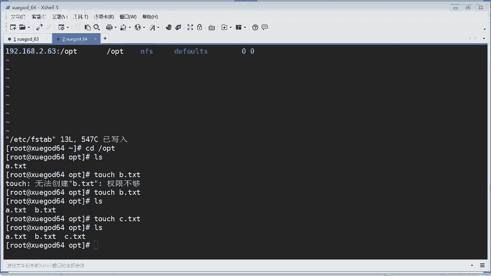

为了实现开机自动挂载，需要将挂载信息写入`/etc/fstab`文件。

```
192.168.2.63:/opt /mnt/nfs_share nfs defaults 0 0
```

### 权限问题与优化配置

在客户端挂载后，可能会遇到无法创建文件（权限不足）的问题。这是因为NFS服务默认使用`nfsnobody`用户来映射客户端用户。解决方法是在服务端修改共享目录的属主。

```bash
chown -R nfsnobody:nfsnobody /opt
```

此外，在挂载时可以使用一些参数进行优化，例如：

*   `noatime`：不更新文件的访问时间，提升I/O性能。
*   `nodiratime`：不更新目录的访问时间。
*   `rsize`/`wsize`：设置读取和写入的块大小，影响传输缓冲区。

挂载命令示例：

```bash
mount -t nfs -o noatime,nodiratime,rsize=32768,wsize=32768 192.168.2.63:/opt /mnt/nfs_share
```

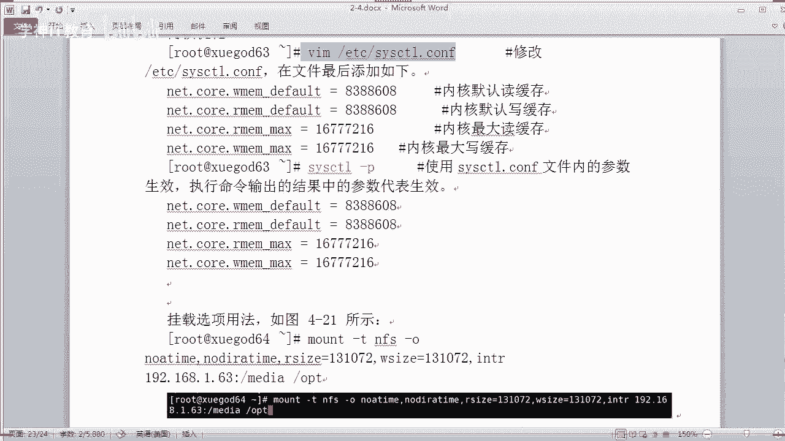

对应的`/etc/fstab`条目可以写为：

```
192.168.2.63:/opt /mnt/nfs_share nfs noatime,nodiratime,rsize=32768,wsize=32768 0 0
```

对于高并发环境，还可以在内核层面调整NFS的读写缓存大小，相关参数在`/etc/sysctl.conf`中配置。

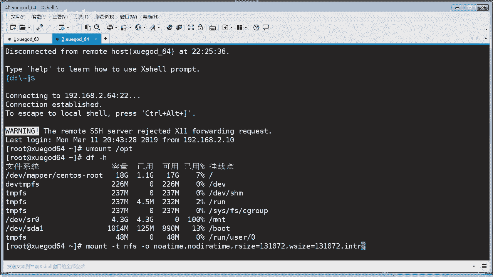

---

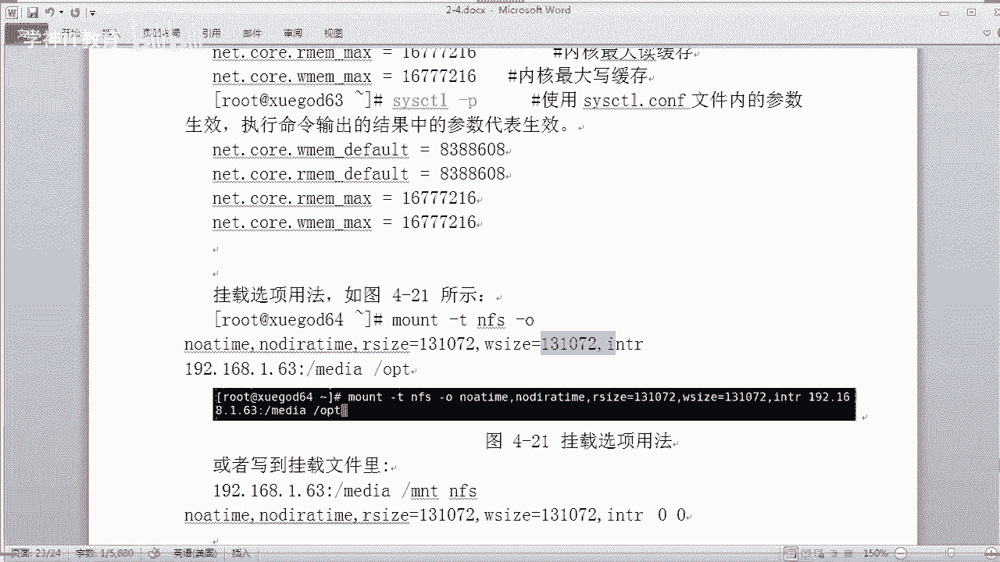

## 总结 📝

本节课中我们一起学习了两个重要的网络服务配置。

首先，我们为VSFTPD服务配置了SSL/TLS加密。通过使用OpenSSL生成自签名证书，并修改服务配置，我们实现了FTP数据的安全加密传输，显著提升了在公网环境下的安全性。

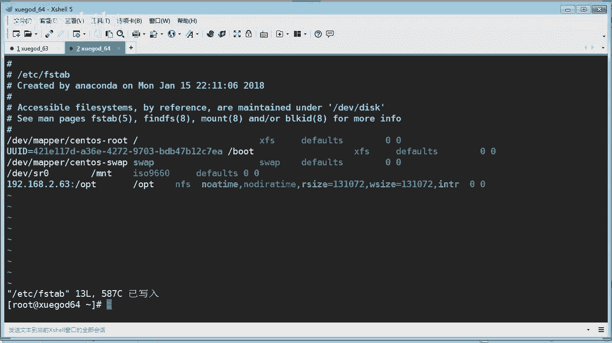

其次，我们安装和配置了NFS网络文件系统。从服务端的软件安装、共享目录配置，到客户端的挂载使用，我们完整地实践了NFS的部署流程。同时，我们也了解了如何解决常见的权限问题，并通过调整挂载参数和内核参数对NFS性能进行初步优化。

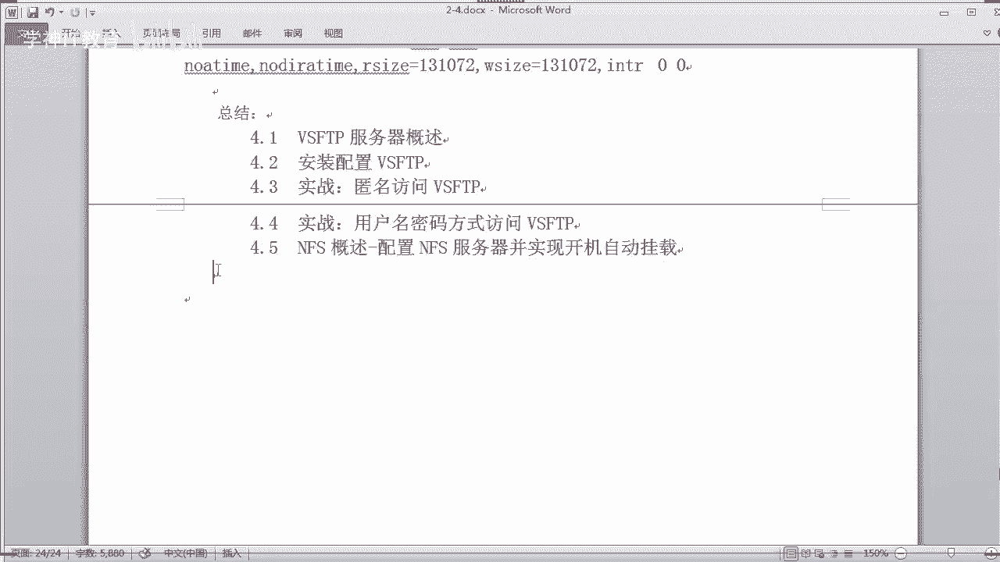

通过本节的学习，你不仅掌握了增强FTP安全性的方法，也获得了在多台服务器间高效共享文件的能力，这些都是Linux系统运维中的实用技能。