# Linux运维：RHCE：firewalld配置教程

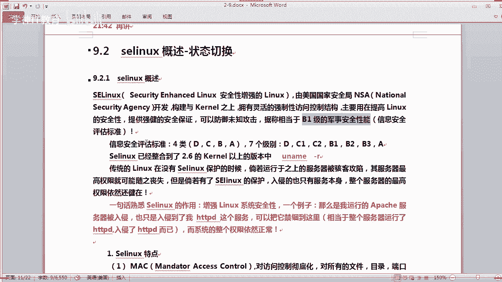

在本教程中，我们将学习Linux系统中的防火墙管理，重点介绍SELinux的基本概念以及新一代动态防火墙工具firewalld的配置方法。我们将从核心概念入手，逐步讲解其工作原理、配置方式，并通过实例演示如何管理端口和服务。

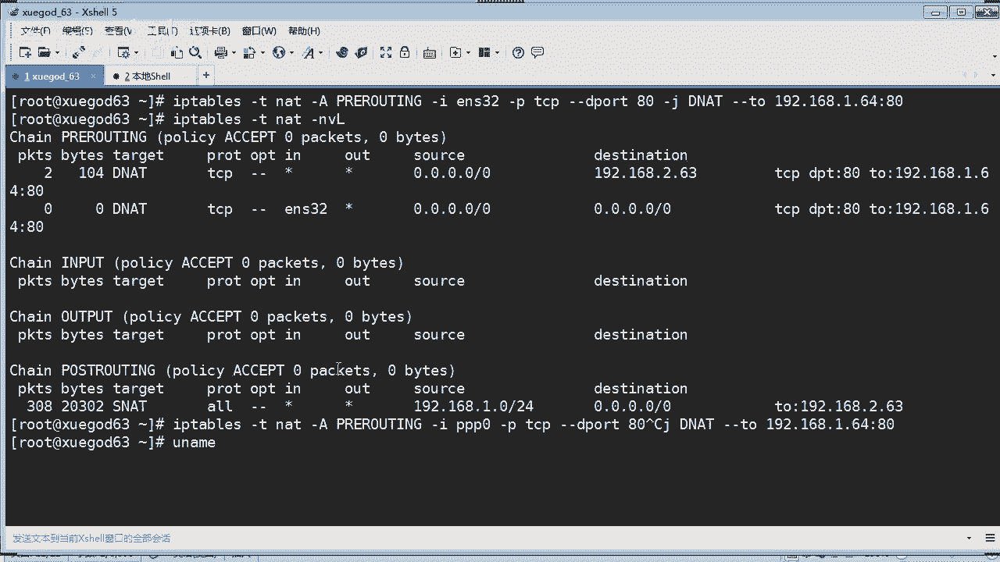

---

## SELinux：安全增强型Linux

上一节我们介绍了传统的iptables防火墙，本节中我们来看看另一个影响系统安全的重要组件——SELinux。

SELinux（Security-Enhanced Linux）是一个由美国国家安全局（NSA）开发的安全增强型Linux。它构建在内核之上，提供了一个灵活的强制性访问控制（MAC）结构，旨在提高Linux系统的安全性，提供强健的安全保障，可防御未知威胁。其安全标准达到了B1级军事安全性能。

在信息安全评估标准中，安全级别从低到高分为D、C1、C2、B1、B2、B3、A类。SELinux处于B1级别，这表明其安全级别非常高。

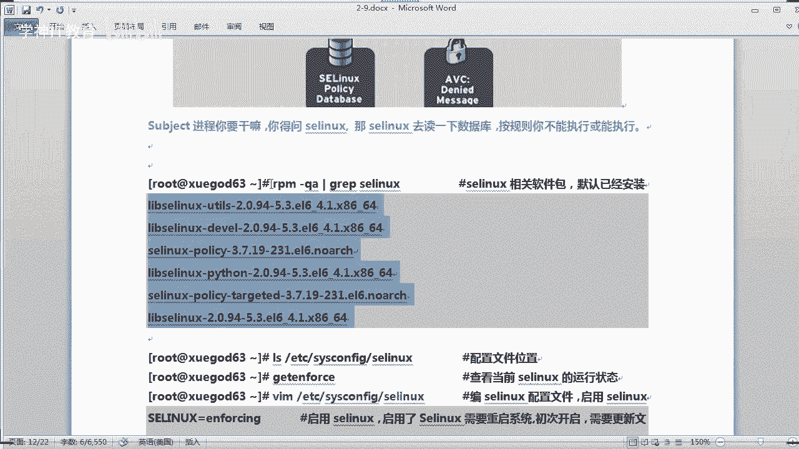

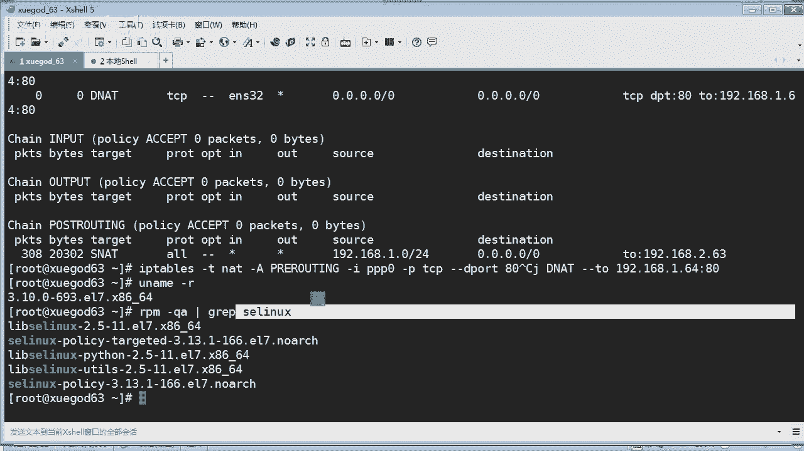

SELinux已整合到Linux内核中（2.6以上版本的内核均已包含）。在没有SELinux保护的传统Linux系统中，如果服务器被入侵，攻击者可能获得服务器的最高权限。而在启用SELinux的系统上，入侵行为通常会被限制在受攻击的服务本身，整个服务器的最高权限依然安全。

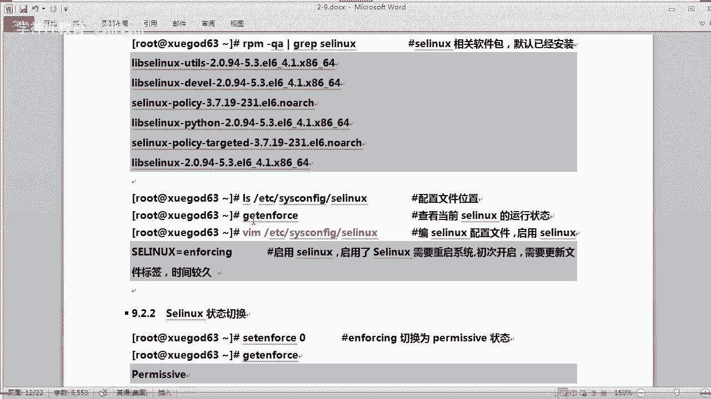

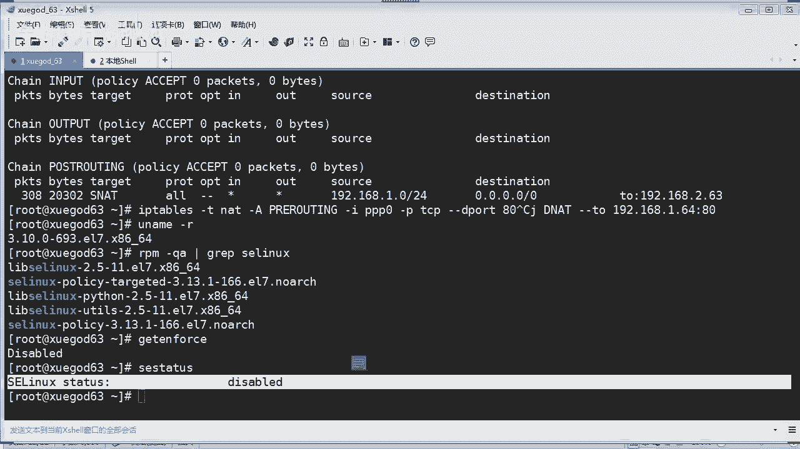

**例如**：假设运行Apache服务被入侵。如果开启了SELinux，入侵者只能影响Apache服务本身，其活动被禁锢在该服务范围内，无法操作整个系统。

### SELinux的核心特点

以下是SELinux的三个主要特点：

1.  **MAC（强制访问控制）彻底化**：对所有文件、目录、端口的访问都基于预设的策略。这些策略由管理员设定，一般用户无权更改。
2.  **RBAC（基于角色的访问控制）**：遵循最小权限原则，为用户划分角色。即使是root用户，如果不在相关策略配置中，也可能无法执行某些管理操作。
3.  **TE（类型强制）**：对进程赋予最小运行权限。其核心是为文件赋予“类型”标签，为进程赋予“域”标签。系统可以规定某个“域”的进程只能访问特定“类型”的文件。

**例如**：`vim`进程被赋予只能读取标签为 `type_t` 的文件的权限。如果 `a.txt` 文件的标签是 `type_t`，则`vim`可以读取它；如果其标签是 `type_t2`，则`vim`无法读取。

### SELinux的工作模式

SELinux有三种运行模式：

*   **enforcing**：强制模式。违反策略的行为将被阻止并记录。
*   **permissive**：宽容模式。违反策略的行为不会被阻止，但会被记录到日志中。
*   **disabled**：关闭模式。SELinux被完全禁用。

其工作原理是：当一个进程尝试执行操作时，SELinux会查询其策略数据库。如果该操作在允许范围内（即在“白名单”中），则放行；如果未被允许，则拒绝执行。

在生产环境中，由于SELinux配置复杂且可能导致服务异常，**绝大多数情况下会选择将其关闭**。我们可以使用 `getenforce` 或 `sestatus` 命令查看当前状态，使用 `setenforce [0|1]` 命令临时切换模式（0为permissive，1为enforcing）。永久修改需编辑 `/etc/selinux/config` 文件。

---

## firewalld：动态防火墙管理工具

了解了SELinux后，我们进入本节的重点——firewalld。它是从RHEL/CentOS 7开始引入的动态防火墙管理工具。

### firewalld 与 iptables 的关系

首先需要明确firewalld与iptables的关系：

*   **iptables服务模式**：用户通过命令添加规则后，需要执行 `service iptables save` 等命令将规则保存到配置文件中。任何规则的变更都需要重新加载整个规则集到内核。这种模式可称为“静态防火墙”。
*   **firewalld动态模式**：任何规则的变更都无需重载整个防火墙规则列表，只需将变更部分更新到运行中的防火墙即可。这解决了iptables静态管理的不便。

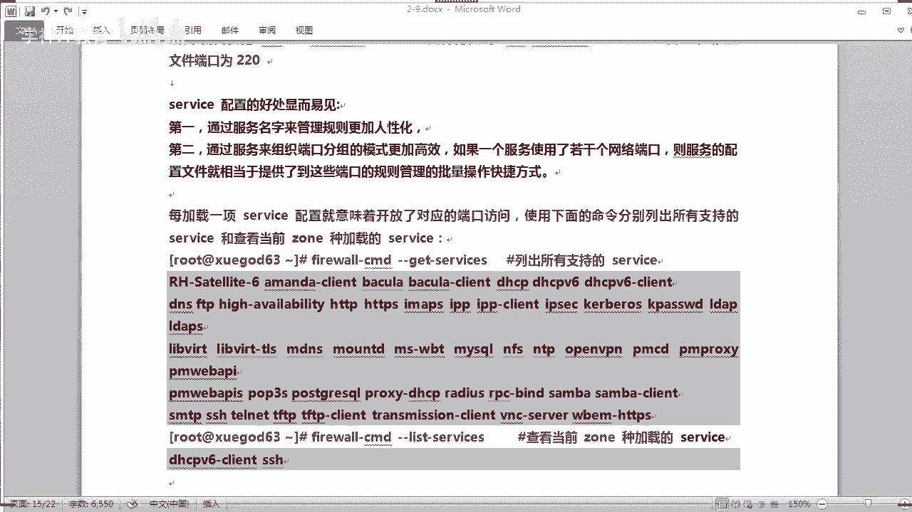

firewalld是一个守护进程，提供了命令行和图形化配置工具。**它并非替代iptables，而是作为一个配置管理外壳**。其底层依然使用iptables作为防火墙规则管理接口，并通过内核的netfilter来执行规则。你可以将firewalld和iptables理解为操作netfilter的两种不同工具。

### 核心概念：区域（Zone）与服务（Service）

firewalld引入了两个核心概念来简化管理：区域（Zone）和服务（Service）。

**1. 区域（Zone）**
一个区域就是一套预定义的过滤规则。网络数据包必须经过某个区域的检查才能入站或出站。不同区域规则的严格程度和安全强度不同。
可以将区域想象成安检门，有的严格，有的宽松。firewalld预定义了9个区域，并将网络接口（网卡）关联到不同的区域。

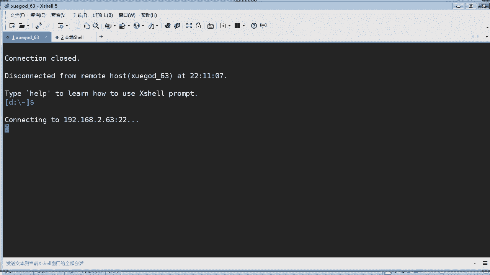

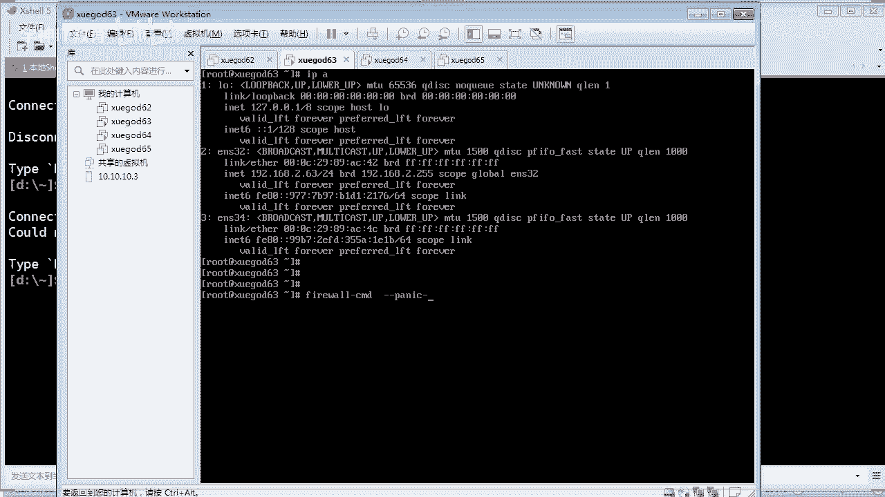

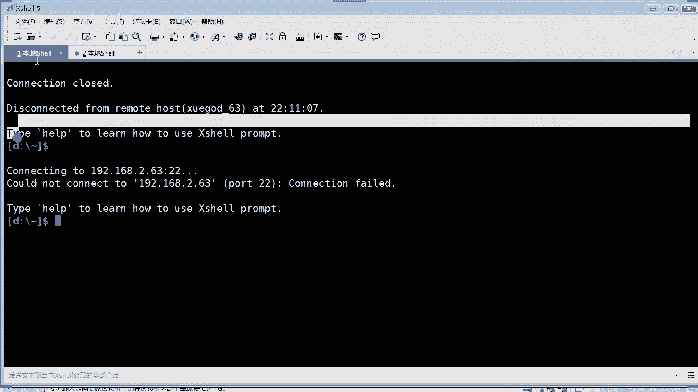

以下是9个默认区域及其简要说明：

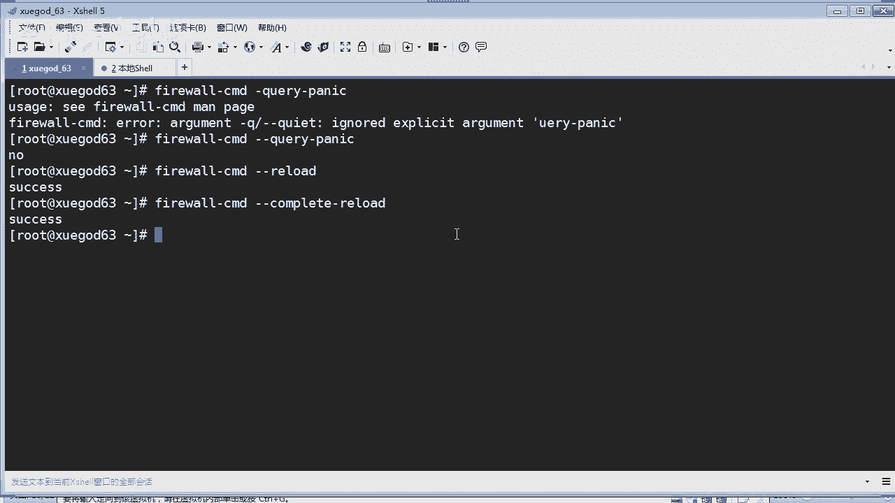

*   **drop（丢弃）**：任何传入的网络数据包都被丢弃，无任何回复。只允许传出连接。
*   **block（限制）**：任何传入连接都被IPv4的icmp-host-prohibited信息和IPv6的icmp6-adm-prohibited信息拒绝。
*   **public（公共）**：**默认区域**。不相信网络内的其他计算机，只接收经过选择的连接（即白名单内的服务）。
*   **external（外部）**：用于启用了伪装功能的外部网络。不相信其他计算机，只接收经过选择的连接。
*   **dmz（非军事区）**：用于可公开访问但内部网络访问受限的计算机。
*   **work（工作）**：用于工作区。基本相信网络内的其他计算机。
*   **home（家庭）**：用于家庭网络。信任网络内的其他计算机。
*   **internal（内部）**：用于内部网络。信任网络内的其他计算机。
*   **trusted（信任）**：接受所有的网络连接。

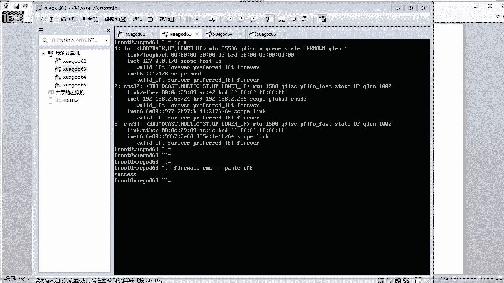

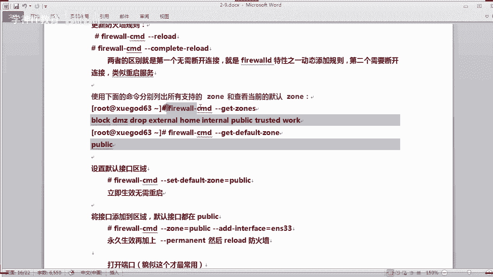

**2. 服务（Service）**
服务配置文件定义了某项网络服务（如ssh、http）所需的端口和协议。firewalld默认提供了70多种服务的定义。
服务配置文件位于两个目录：
*   `/usr/lib/firewalld/services/`：系统预定义的服务，不建议直接修改。
*   `/etc/firewalld/services/`：用户自定义或覆盖的服务配置，应在此目录操作。

使用服务的好处是可以通过服务名来管理一组端口，更加高效和人性化。例如，一个服务可能使用多个端口，通过服务配置可以批量管理。

### firewalld 基础配置与管理

现在，我们来看看如何使用firewalld进行基本的配置操作。

**查看与设置默认区域**
```bash
# 查看所有可用区域
firewall-cmd --get-zones
# 查看当前默认区域
firewall-cmd --get-default-zone
# 查看当前活动的区域及其绑定的接口
firewall-cmd --get-active-zones
# 设置默认区域为 work
firewall-cmd --set-default-zone=work
```

**管理端口和服务**
以下是管理当前区域（如public）端口和服务的常用命令：
```bash
# 查看当前区域已开放的服务
firewall-cmd --list-services
# 查看当前区域已开放的端口
firewall-cmd --list-ports
# 查看当前区域所有配置（包括服务、端口、接口等）
firewall-cmd --list-all
# 查看指定区域（如work）的所有配置
firewall-cmd --zone=work --list-all

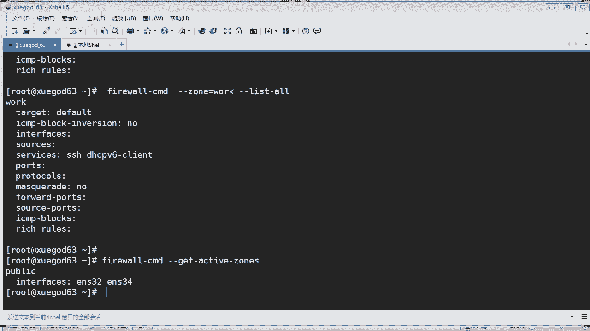

# 添加一个端口（临时生效，重启后失效）
firewall-cmd --add-port=8080/tcp
# 添加一个端口并永久生效（写入配置文件）
firewall-cmd --add-port=8080/tcp --permanent
# 重载防火墙配置（使永久规则立即生效，不断开现有连接）
firewall-cmd --reload

# 添加一项服务（如http）
firewall-cmd --add-service=http
# 移除一项服务
firewall-cmd --remove-service=http
# 添加一项服务并永久生效
firewall-cmd --add-service=http --permanent
```

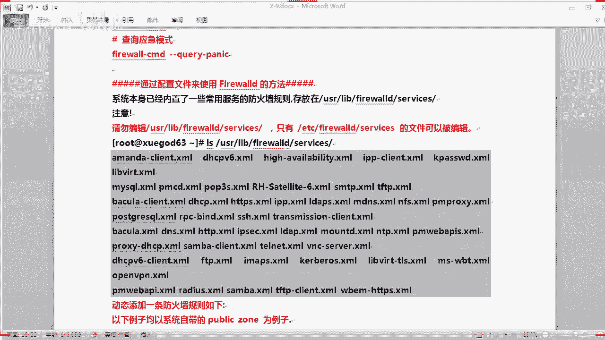

**紧急模式**
```bash
# 启用紧急模式，拒绝所有网络包（谨慎使用！可能导致SSH断开）
firewall-cmd --panic-on
# 关闭紧急模式
firewall-cmd --panic-off
# 查看紧急模式状态
firewall-cmd --query-panic
```

### 实战配置：通过配置文件管理服务

命令行方式适合临时调整，而通过配置文件进行管理则更规范、持久。我们以开放HTTP（80端口）服务为例。

**方法一：直接修改区域配置文件（以public区域为例）**
1.  编辑区域配置文件：`vim /etc/firewalld/zones/public.xml`
2.  在 `<zone>` 标签内添加服务引用。例如，添加HTTP服务：
    ```xml
    <?xml version="1.0" encoding="utf-8"?>
    <zone>
      <short>Public</short>
      ...
      <!-- 添加这行 -->
      <service name="http"/>
      ...
    </zone>
    ```
3.  重载防火墙配置：`firewall-cmd --reload`

**方法二：自定义服务并引用（更推荐）**
此方法适用于默认服务配置不满足需求时，例如需要修改服务端口或创建全新服务。

1.  **复制默认服务模板**：将系统预定义的http服务配置复制到用户配置目录。
    ```bash
    cp /usr/lib/firewalld/services/http.xml /etc/firewalld/services/myweb.xml
    ```
2.  **修改自定义服务文件**：编辑 `/etc/firewalld/services/myweb.xml`。
    ```xml
    <?xml version="1.0" encoding="utf-8"?>
    <service>
      <short>My Web Service</short>
      <description>This is my custom web service running on port 8080.</description>
      <!-- 定义端口，可以添加多个port标签 -->
      <port protocol="tcp" port="8080"/>
      <!-- 如果需要，还可以定义模块、目标地址等 -->
    </service>
    ```
3.  **在区域配置中引用自定义服务**：编辑 `/etc/firewalld/zones/public.xml`，添加：
    ```xml
    <service name="myweb"/>
    ```
    > **注意**：此处 `name` 属性值 `myweb` 对应自定义服务文件名 `myweb.xml` 的前缀。

4.  **重载防火墙配置**：`firewall-cmd --reload`

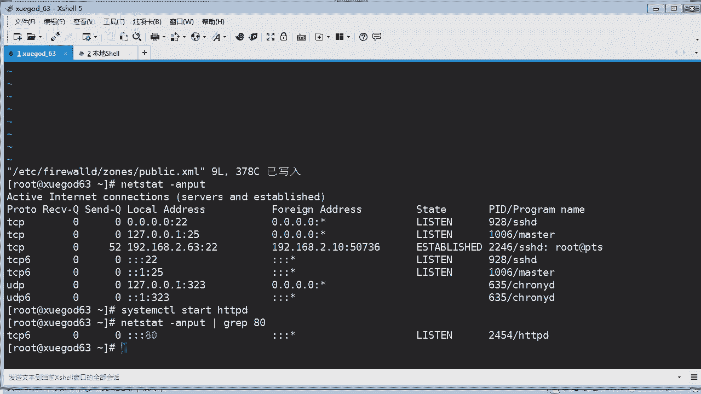

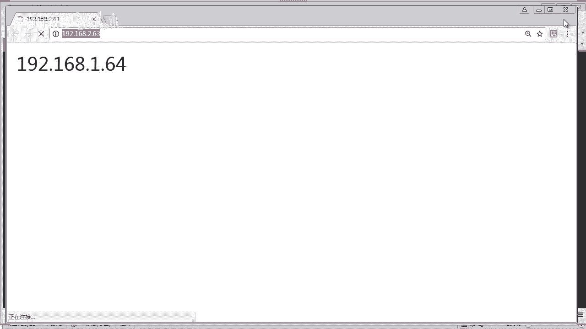

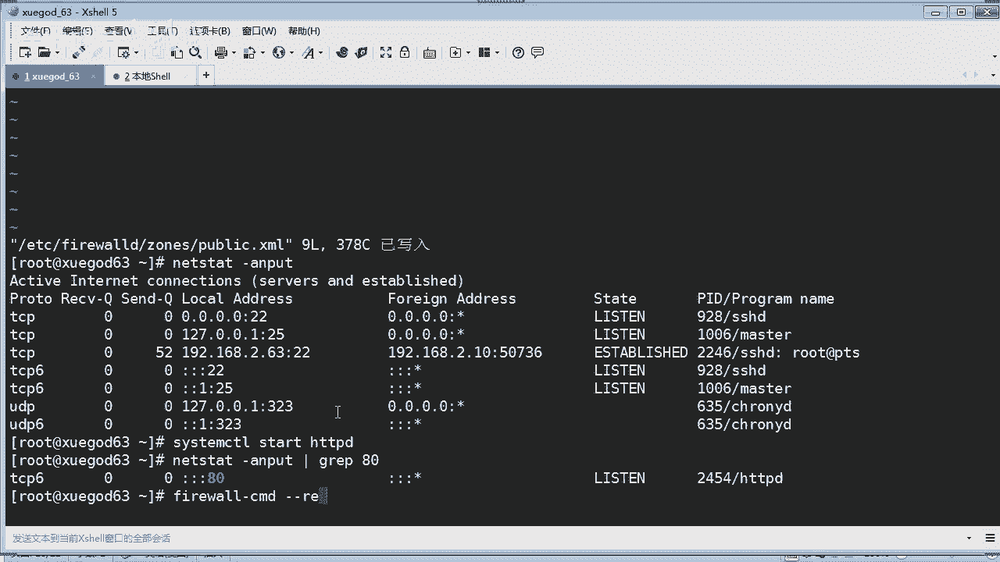


**修改SSH服务默认端口**
为了提高安全性，我们常会修改SSH默认的22端口。这需要同时修改SSH服务配置和防火墙规则。

1.  **复制并修改SSH服务配置**：
    ```bash
    cp /usr/lib/firewalld/services/ssh.xml /etc/firewalld/services/
    vim /etc/firewalld/services/ssh.xml
    ```
    将文件中的 `<port protocol="tcp" port="22"/>` 修改为新的端口，例如 `<port protocol="tcp" port="22222"/>`。

2.  **修改SSH守护进程配置**：
    ```bash
    vim /etc/ssh/sshd_config
    ```
    找到 `#Port 22` 这一行，取消注释并将 `22` 改为 `22222`。

3.  **重启SSH服务并重载防火墙**：
    ```bash
    systemctl restart sshd
    firewall-cmd --reload
    ```
    > **重要**：执行 `firewall-cmd --reload` 时，旧的SSH连接可能会中断。请确保在新的端口（22222）上测试连接成功后再关闭原有会话。

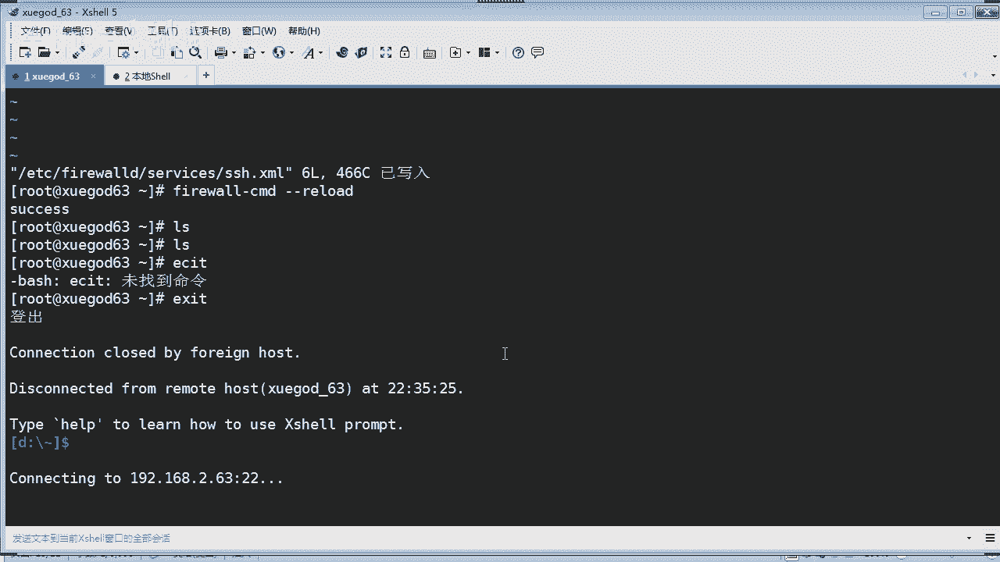

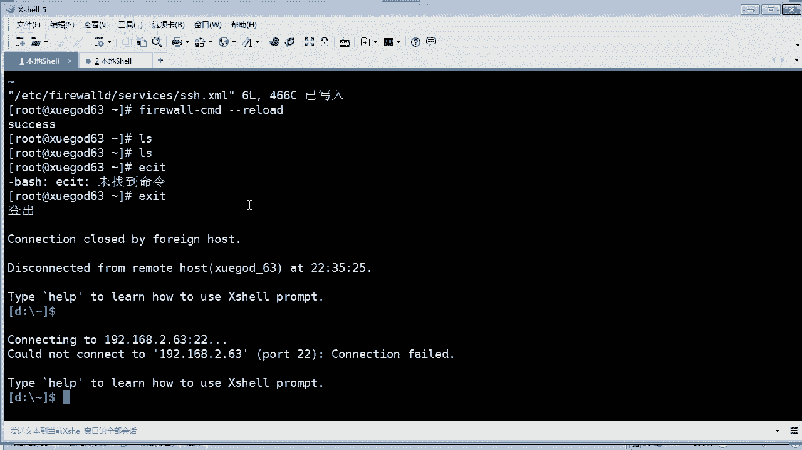

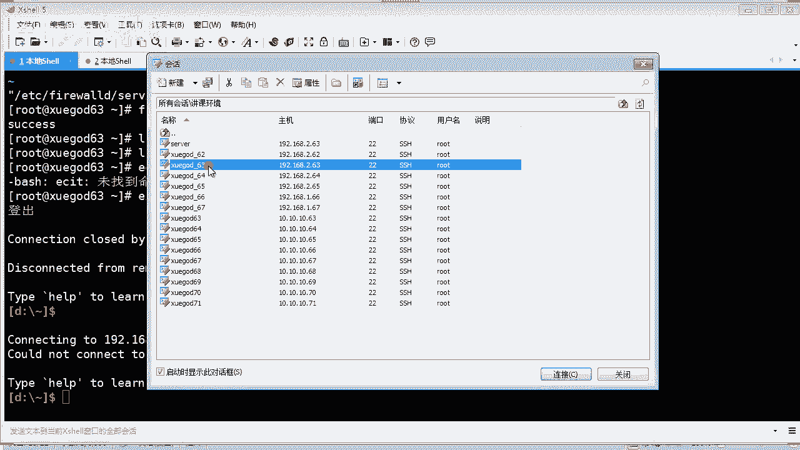

### 配置地址转换（SNAT/DNAT）

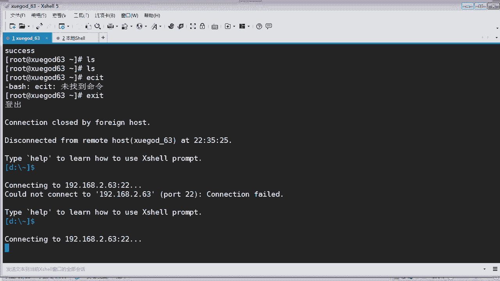

firewalld同样支持配置SNAT（源地址转换）和DNAT（目的地址转换）。

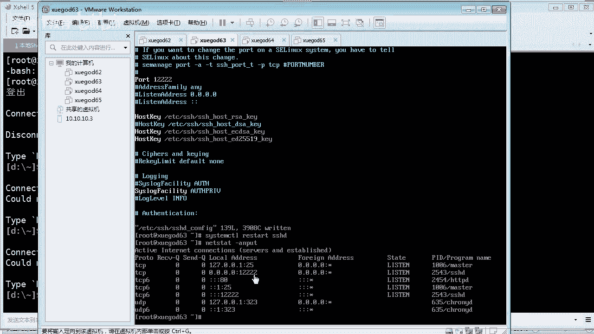

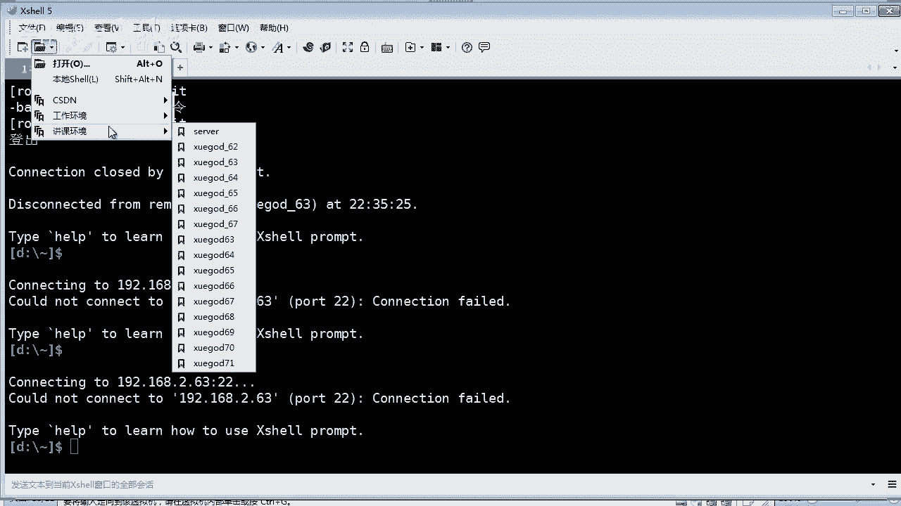

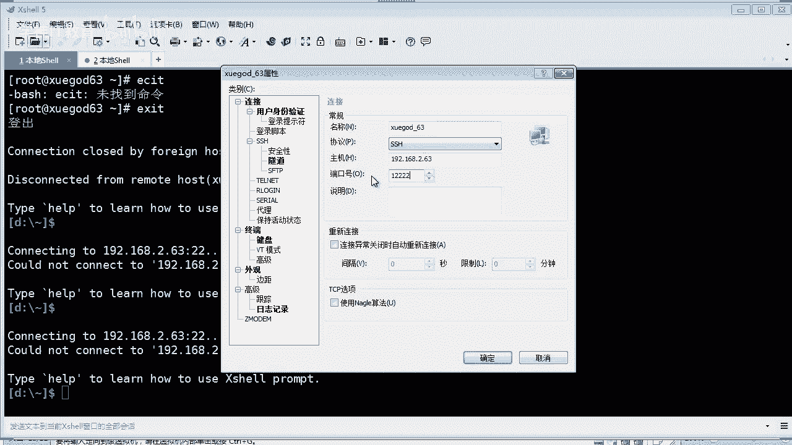

**配置DNAT（端口转发）示例**：将到达本机80端口的流量转发到内部服务器192.168.1.100的8080端口。
```bash
firewall-cmd --permanent --zone=public --add-forward-port=port=80:proto=tcp:toport=8080:toaddr=192.168.1.100
firewall-cmd --reload
```

**配置SNAT示例**：为内部网络192.168.1.0/24做出口地址伪装。
```bash
firewall-cmd --permanent --zone=external --add-masquerade
firewall-cmd --reload
```
更复杂的规则可能需要通过 `--direct` 参数直接调用iptables规则，或者编辑 `rich-rule`。

---

## 总结

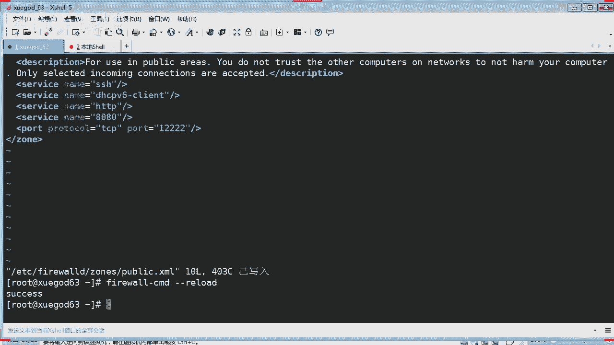

本节课中我们一起学习了Linux系统防火墙管理的两个重要方面。

首先，我们了解了**SELinux**的基本概念、特点和工作模式，认识到它是一个高安全级别的强制访问控制系统，但在生产环境中通常因其复杂性而被关闭。

然后，我们深入学习了**firewalld**动态防火墙管理工具。我们理解了它与iptables的关系，掌握了其核心概念——**区域（Zone）** 和 **服务（Service）**。通过大量的命令和配置实例，我们学习了如何查看和管理区域、如何开放端口和服务、如何通过配置文件进行持久化配置，以及如何修改服务端口和创建自定义服务。

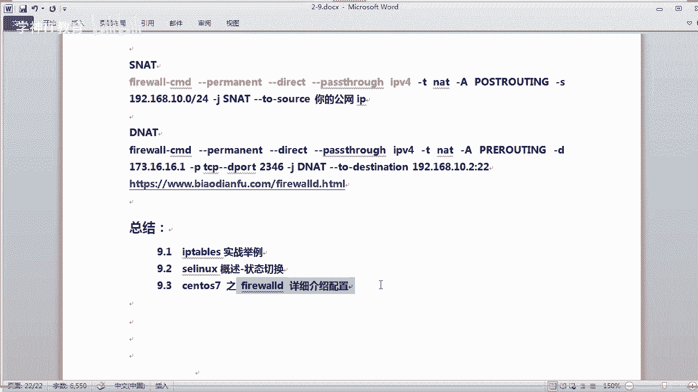

firewalld通过区域和服务的抽象，提供了比iptables更结构化的管理方式，特别适合基于服务的防火墙策略管理。而iptables则更直接、灵活。在实际工作中，可以根据习惯和场景选择使用。目前，两者在生产环境中都有广泛应用。