# Linux运维：RHCE：iptables配置02 🔧

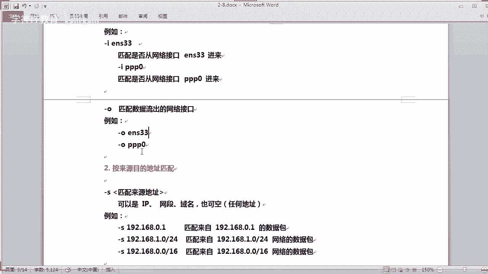

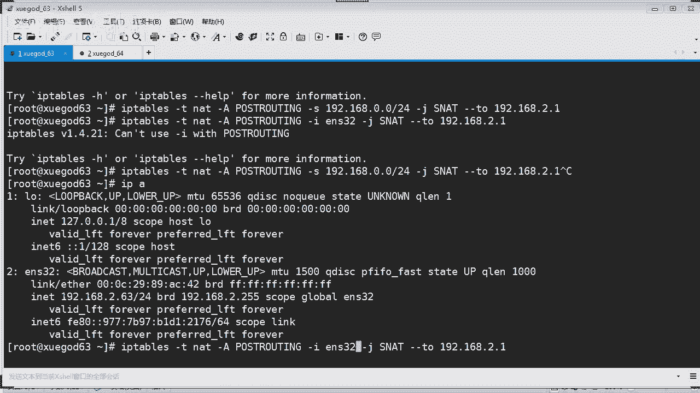

在本节课中，我们将深入学习iptables的详细配置方法，包括如何匹配网络接口、地址、端口，以及如何设置各种动作规则。通过具体的命令示例，我们将掌握构建精细防火墙策略的核心技能。

## 概述 📖

上一节我们介绍了iptables的基本概念和表链结构。本节中，我们来看看如何编写具体的规则，通过匹配源地址、目标地址、协议、端口等条件，并执行接受、拒绝或地址转换等动作，来构建有效的防火墙策略。

## 规则配置详解

### 匹配网络接口

规则可以指定数据包流入或流出的具体网络接口。

```
iptables -t nat -A PREROUTING -i ens32 -j MASQUERADE
```

*   `-i ens32`: 表示匹配从 `ens32` 网卡流入的数据包。
*   注意：如果指定的网卡不存在，规则虽然能添加，但永远不会匹配成功。

### 匹配地址与协议

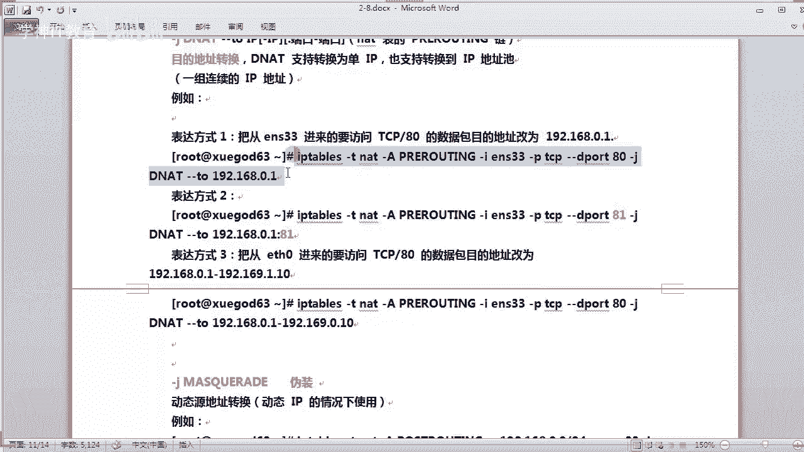

以下是匹配源地址、目标地址和协议的基本参数。

*   `-s`: 匹配源IP地址或网段（如 `192.168.1.0/24`）。
*   `-d`: 匹配目标IP地址、网段或域名。
*   `-p`: 匹配协议类型，如 `tcp`、`udp`、`icmp`。

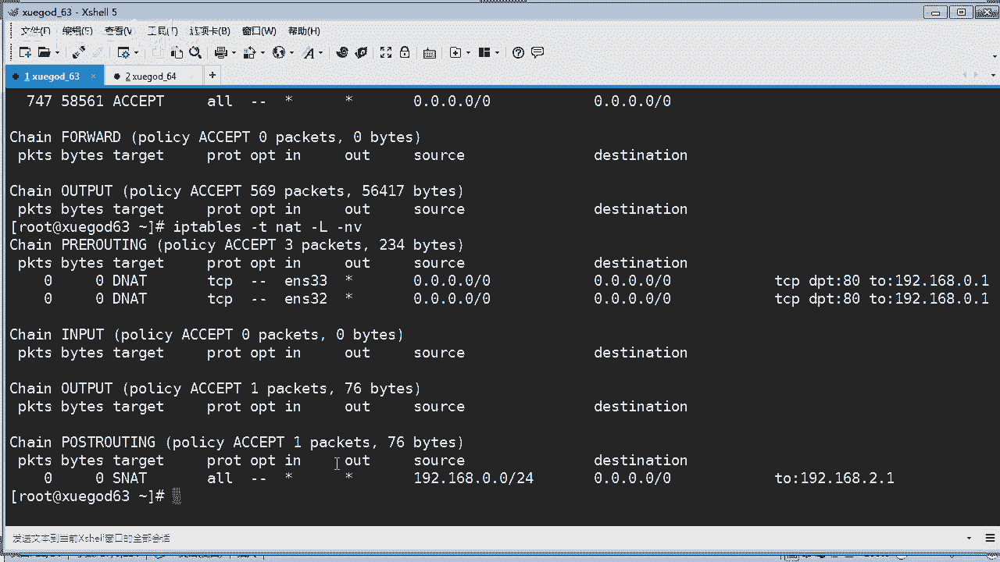

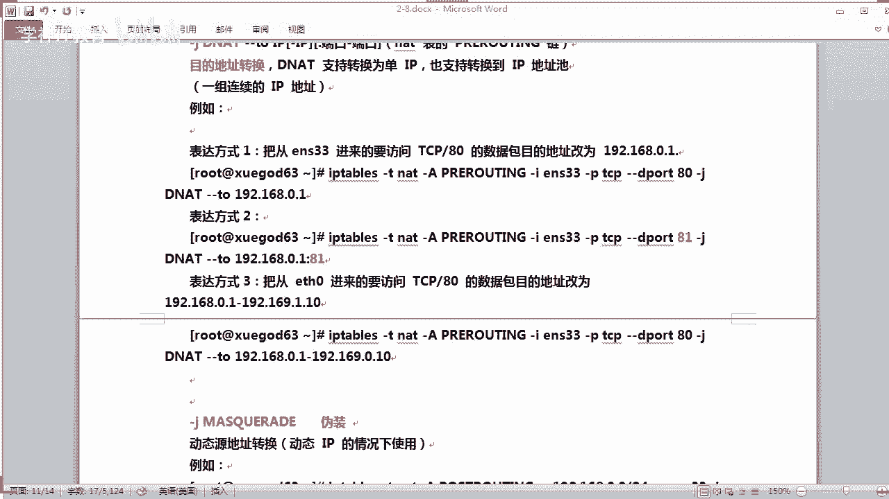

### 匹配端口

端口匹配分为源端口和目标端口，必须与 `-p` 参数结合使用以指定协议。

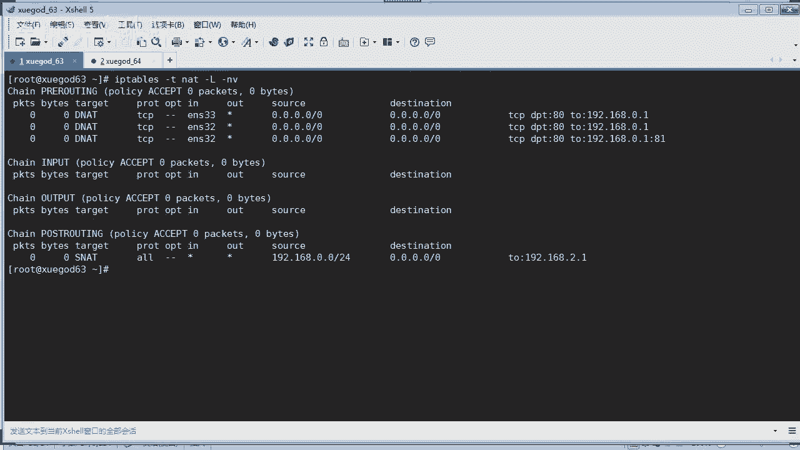

*   `--sport`: 匹配源端口。可以是指定端口（如 `--sport 8080`）或端口范围（如 `--sport 1000:3000`）。
*   `--dport`: 匹配目标端口，用法与 `--sport` 相同。

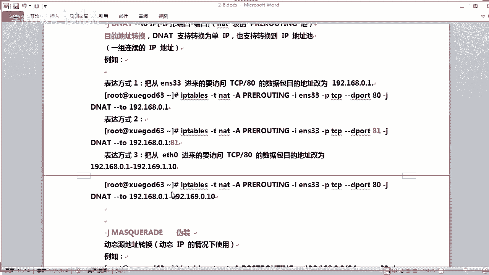

应用举例：匹配目标端口为53的UDP协议数据包。
```
iptables -A INPUT -p udp --dport 53 -j ACCEPT
```

### 联合匹配

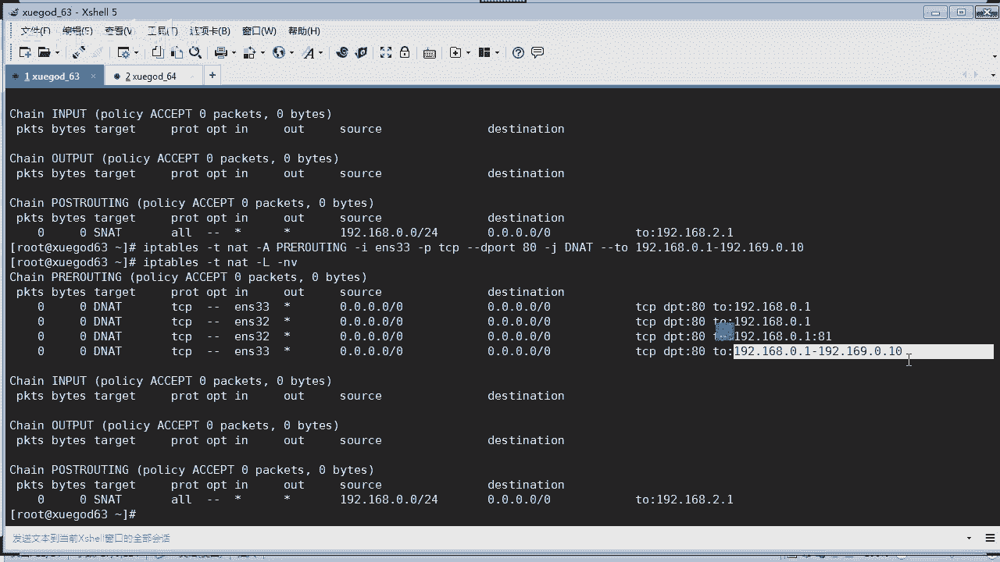

可以将地址、端口和协议条件组合，形成更精确的匹配规则。

例如，以下规则仅允许源IP为 `192.168.1.100` 的机器访问 `www.abc.com` 的80端口。
```
iptables -A FORWARD -s 192.168.1.100 -d www.abc.com -p tcp --dport 80 -j ACCEPT
```
条件越多，匹配范围越小，规则越严格。

### 规则动作

匹配条件后，需要指定对数据包执行的动作。

*   `ACCEPT`: 允许数据包通过。
*   `DROP`: 丢弃数据包，不回应任何信息。
*   `REJECT`: 拒绝数据包，并向发送方返回错误信息。
*   `SNAT`: 源地址转换，常用于内网机器访问外网。
*   `DNAT`: 目标地址转换，常用于端口转发或负载均衡。
*   `MASQUERADE`: 动态源地址转换（伪装），适用于网关出口IP不固定的情况。

使用 `-j` 参数指定动作，例如 `-j ACCEPT`。

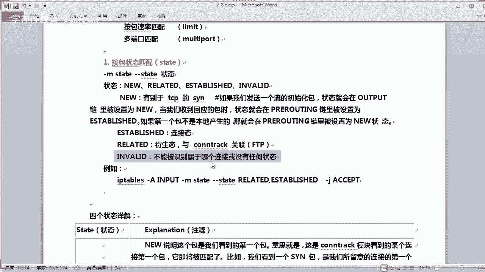

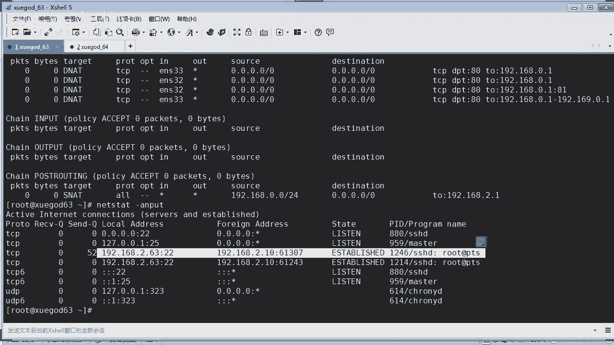

### 地址转换示例

**源地址转换**：将内网 `192.168.1.0/24` 网段的数据包源地址转换为网关公网IP `1.2.3.4` 后发出。
```
iptables -t nat -A POSTROUTING -s 192.168.1.0/24 -j SNAT --to-source 1.2.3.4
```
也可以转换到多个公网IP（地址池）。
```
iptables -t nat -A POSTROUTING -s 192.168.1.0/24 -j SNAT --to-source 1.2.3.4-1.2.3.6
```

**目标地址转换**：将所有从 `ens33` 网卡进入且访问本机80端口的请求，转发到内网服务器 `192.168.0.1`。
```
iptables -t nat -A PREROUTING -i ens33 -p tcp --dport 80 -j DNAT --to-destination 192.168.0.1
```
甚至可以转发到特定端口，例如将80端口的请求转发到内网服务器的81端口。
```
iptables -t nat -A PREROUTING -i ens33 -p tcp --dport 80 -j DNAT --to-destination 192.168.0.1:81
```
或者转发到一个服务器网段，实现简单的负载均衡。
```
iptables -t nat -A PREROUTING -i ens33 -p tcp --dport 80 -j DNAT --to-destination 192.168.0.1-192.168.0.10
```

**动态伪装**：适用于拨号上网等出口IP动态变化的场景。
```
iptables -t nat -A POSTROUTING -s 192.168.1.0/24 -o ens33 -j MASQUERADE
```

## 高级匹配模块

除了基本匹配，iptables还支持通过附加模块进行更精细的控制。

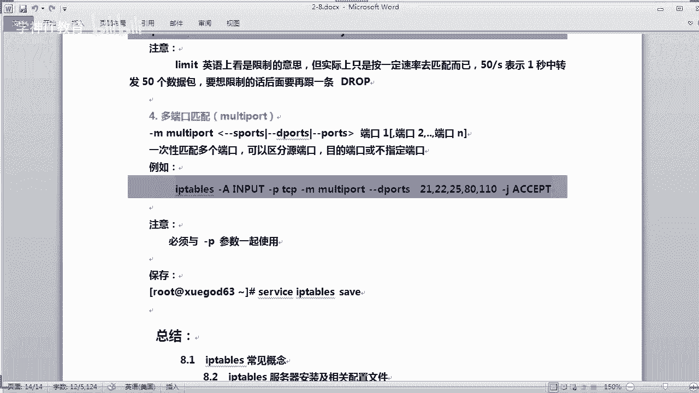

### 状态匹配

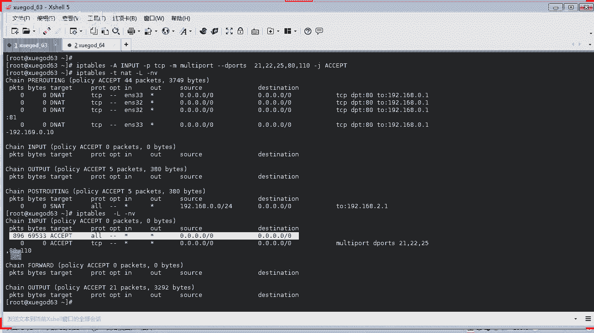

根据连接状态进行匹配，非常常用。
*   `NEW`: 新建连接。
*   `ESTABLISHED`: 已建立的连接。
*   `RELATED`: 相关联的连接（如FTP数据传输连接）。
*   `INVALID`: 无效的连接包。

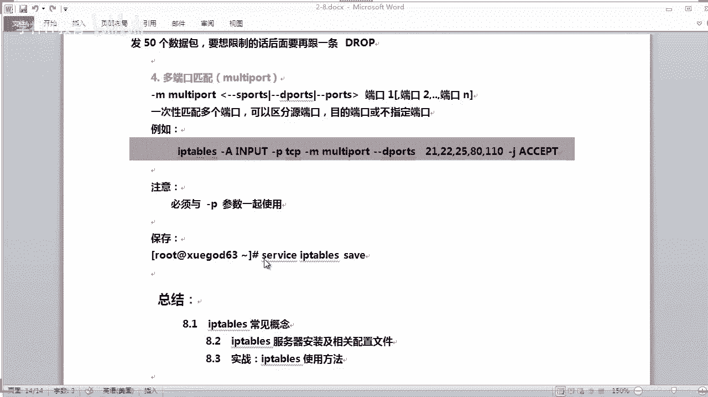

示例：放行已建立和相关联的连接，这对于FTP等协议的正常工作至关重要。
```
iptables -A INPUT -m state --state ESTABLISHED,RELATED -j ACCEPT
```

### MAC地址匹配

基于数据包的源MAC地址进行匹配。**注意**：数据包经过路由器后MAC地址会改变，因此此匹配通常在初跳路由器上使用。
```
iptables -A FORWARD -m mac --mac-source 00:11:22:33:44:55 -j DROP
```

### 速率匹配

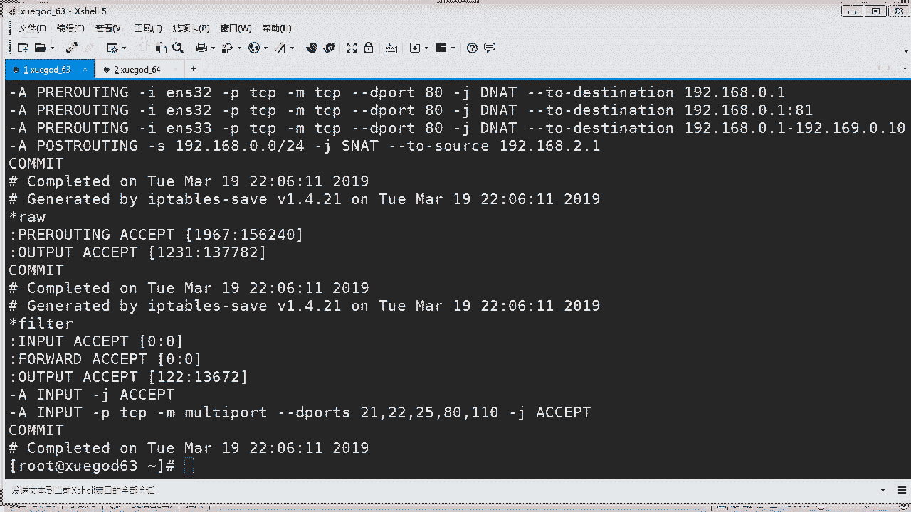

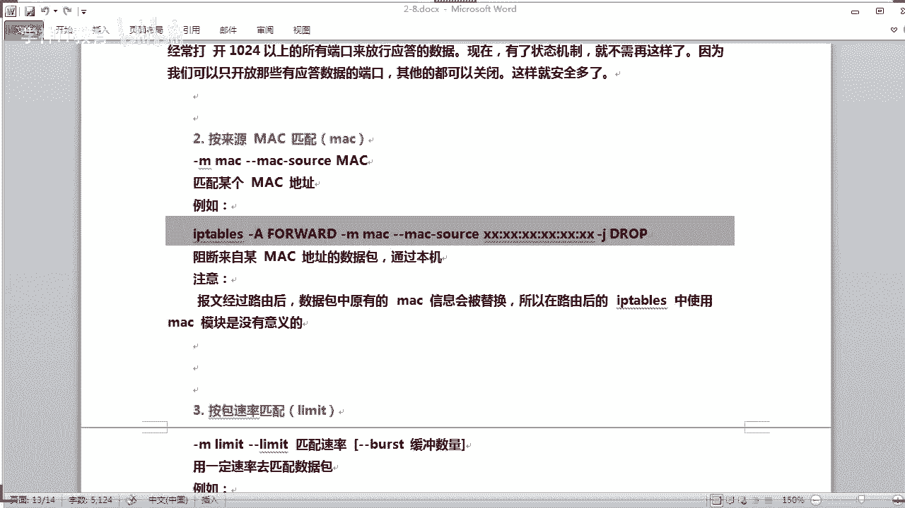

限制单位时间内通过的数据包数量，可用于简单的流量控制。
```
# 每秒允许最多50个包
iptables -A INPUT -m limit --limit 50/sec -j ACCEPT
# 超过限制的包则丢弃
iptables -A INPUT -j DROP
```

### 多端口匹配

一次性匹配多个离散的端口，简化规则配置。
```
iptables -A INPUT -p tcp -m multiport --dports 21,22,25,80,110 -j ACCEPT
```

## 规则保存与管理

### 保存规则

内存中的iptables规则在重启后会丢失，必须保存到配置文件中。
```
service iptables save
```
或
```
iptables-save > /etc/sysconfig/iptables
```
规则将被保存至 `/etc/sysconfig/iptables` 文件。

### 规则持久化

系统重启时会自动加载 `/etc/sysconfig/iptables` 文件中的规则。如果临时清空了内存中的规则，可以通过重启服务或直接载入配置文件来恢复。
```
service iptables restart
```
或
```
iptables-restore < /etc/sysconfig/iptables
```

## 配置实例：Web与FTP服务器防火墙

以下我们通过一个实例，为一台同时提供SSH、Web和FTP服务的服务器配置防火墙。

1.  **清空现有规则并设置默认策略**：默认拒绝所有入站连接，但允许所有出站和已建立的连接。
    ```
    iptables -F
    iptables -P INPUT DROP
    iptables -P FORWARD DROP
    iptables -P OUTPUT ACCEPT
    ```

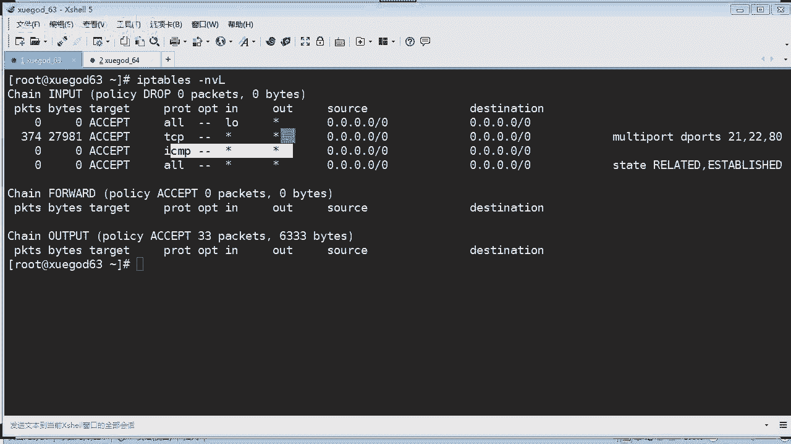

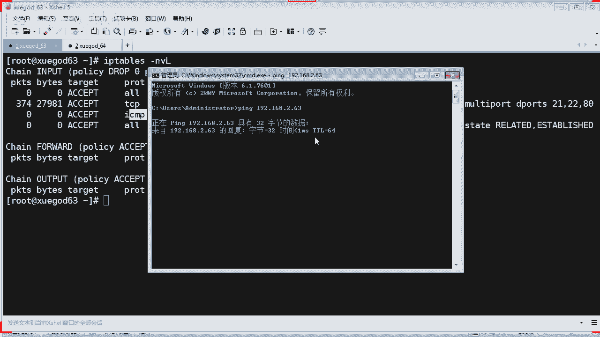

2.  **允许本地回环接口通信**：许多服务需要与本地回环地址通信。
    ```
    iptables -A INPUT -i lo -j ACCEPT
    ```

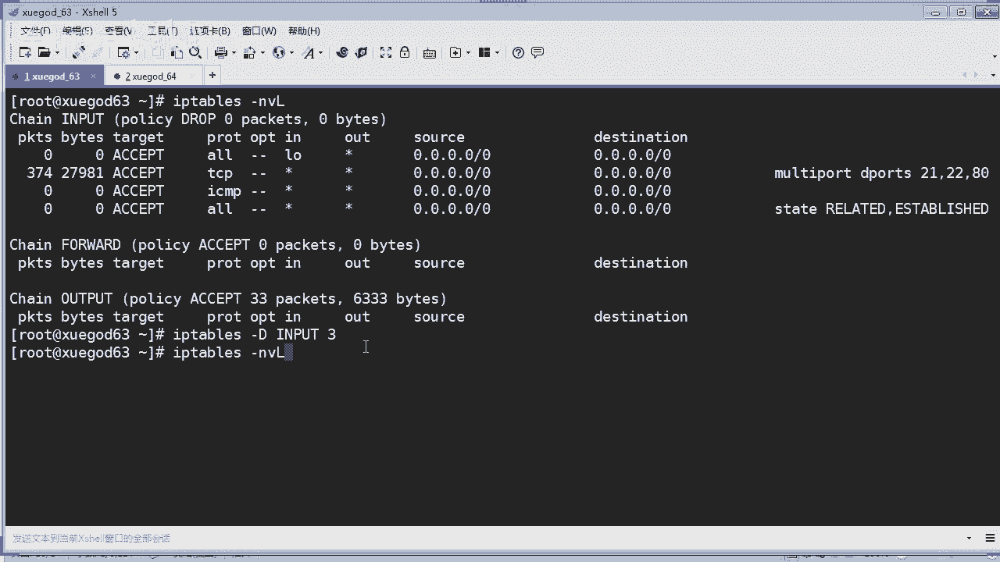

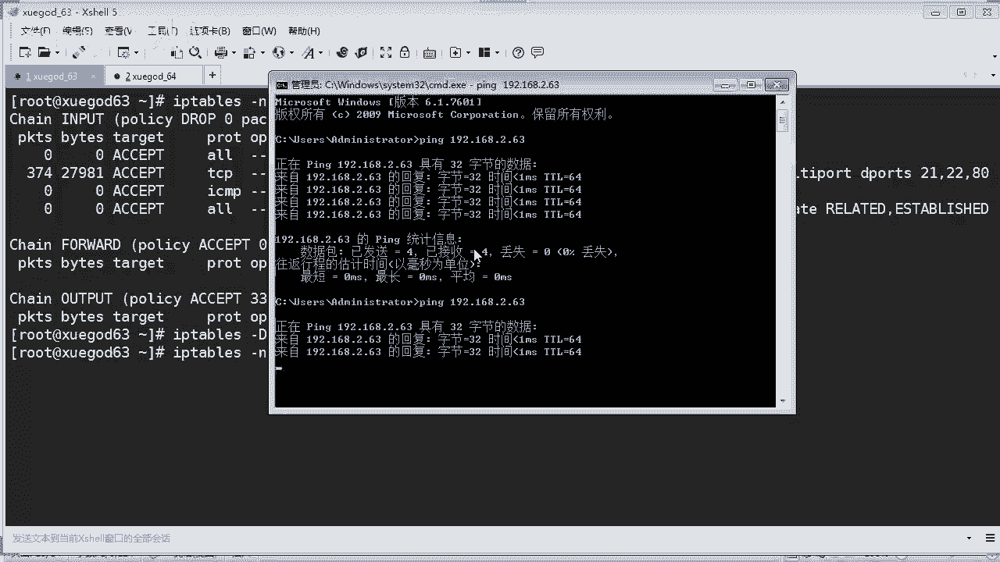

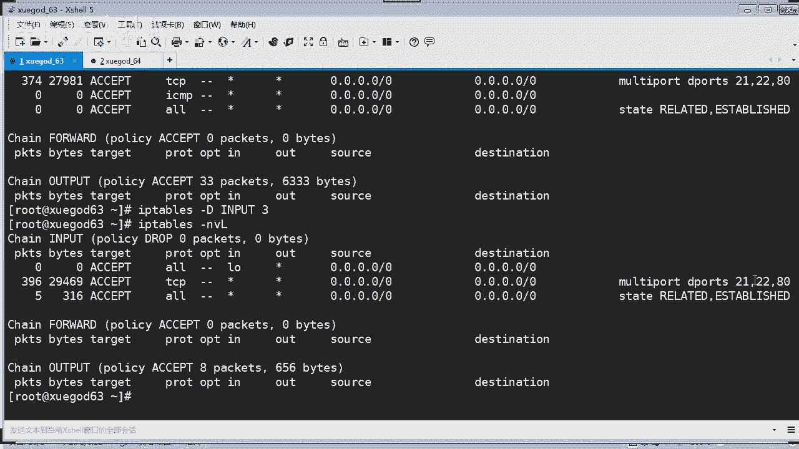

3.  **允许状态为ESTABLISHED和RELATED的连接**：确保应答包和FTP等协议的数据连接能通过。
    ```
    iptables -A INPUT -m state --state ESTABLISHED,RELATED -j ACCEPT
    ```

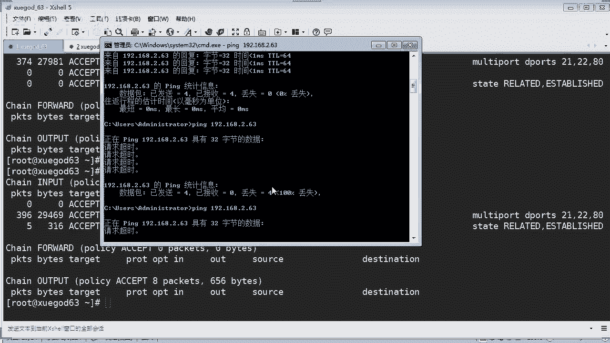

4.  **放行必要的服务端口**：使用多端口匹配放行SSH、Web、FTP控制端口。
    ```
    iptables -A INPUT -p tcp -m multiport --dports 21,22,80 -j ACCEPT
    ```
    FTP被动模式可能需要额外开放端口范围，此处仅为示例。

5.  **允许ICMP（Ping）**：根据需求决定是否放行。
    ```
    iptables -A INPUT -p icmp -j ACCEPT
    ```

6.  **保存规则**。
    ```
    service iptables save
    ```

## 总结 🎯

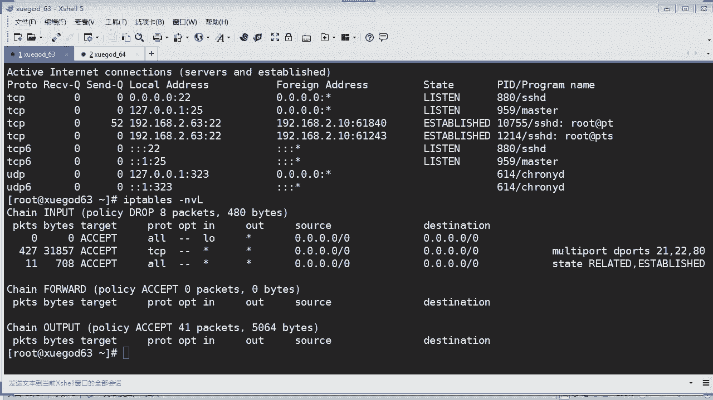

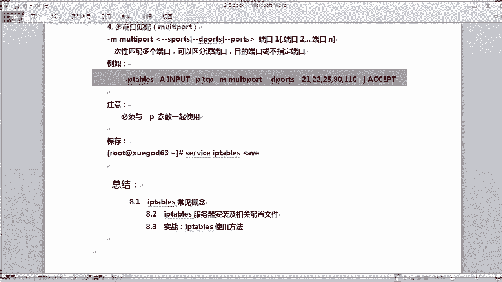

本节课我们一起学习了iptables的核心配置方法。我们掌握了如何通过匹配源/目标地址、端口、协议、连接状态等条件来编写精确的规则，并执行接受、拒绝或网络地址转换等动作。我们还通过一个Web/FTP服务器的配置实例，将理论知识应用于实践，构建了一个基础的防火墙策略。记住，配置防火墙时，采用“默认拒绝，按需放行”的原则，并确保保存规则使其永久生效。下一节我们将进行更多的实操练习。