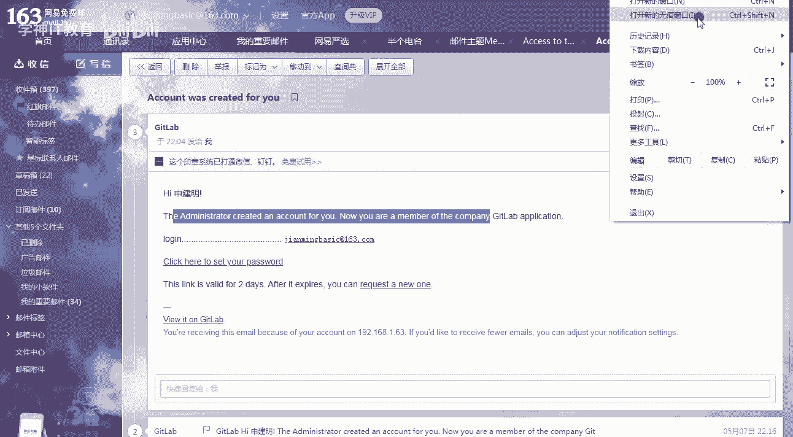
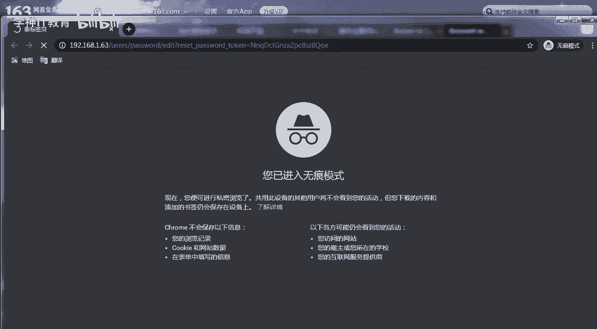
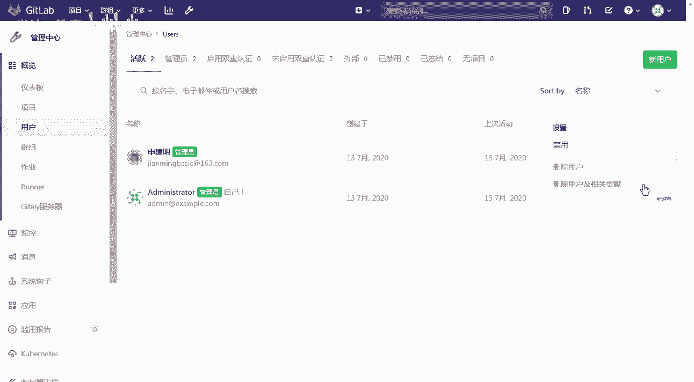
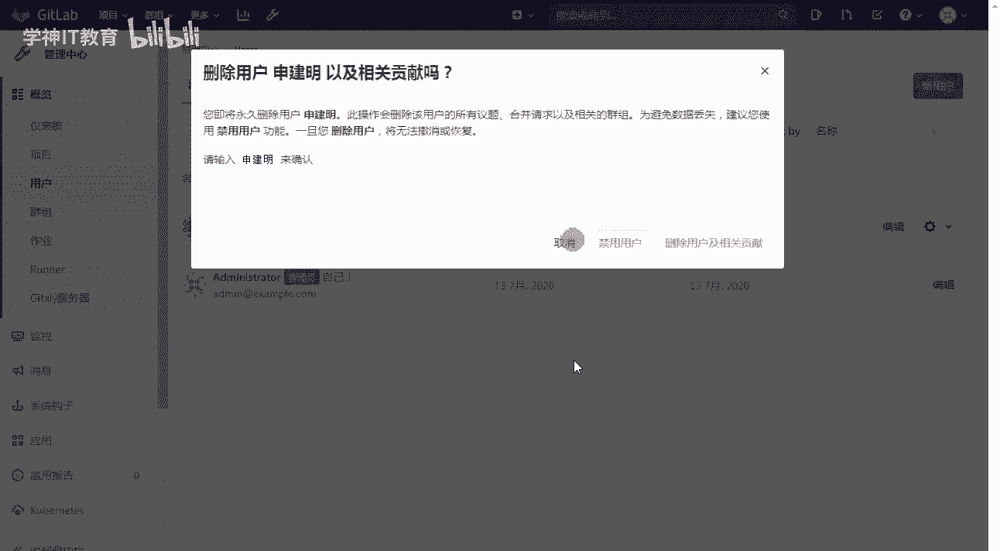
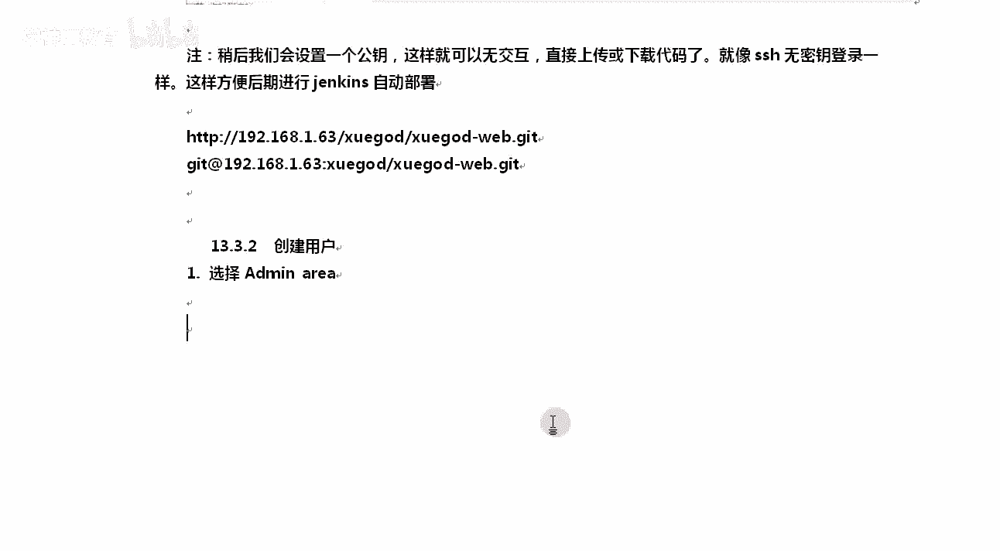

# GitLab与Jenkins结合构建持续集成-CI环境：P3：3-GitLab日常使用方法 🚀

## 概述
在本节课程中，我们将学习GitLab的日常使用方法。我们将从创建项目组和项目开始，逐步介绍用户管理、权限设置以及基本的代码仓库操作，为后续与Jenkins集成打下基础。

---

## 创建项目组与项目

上一节我们介绍了GitLab的基本概念，本节中我们来看看如何创建和管理项目。

在GitLab中，项目必须归属于一个项目组。只有属于该组的成员才能访问组内的项目。

以下是创建项目组的步骤：
1.  点击GitLab首页的“管理”区域。
2.  选择“新建群组”。
3.  填写组名，例如 `xuegod-web`。组名不应包含空格，因为它会生成对应的访问URL路径。
4.  填写描述，例如“学神Web开发组”。
5.  设置可见性级别：
    *   **私有**：仅组内成员可查看。
    *   **内部**：任何登录用户可查看。
    *   **公开**：互联网上任何人都可查看。
6.  配置组内权限，例如允许“开发人员”和“维护人员”在组内创建项目。
7.  点击“创建群组”。

创建组后，即可在组内创建项目。

以下是创建项目的步骤：
1.  在组页面或管理界面，点击“新建项目”。
2.  输入项目名称，例如 `xuegod_web`。
3.  选择项目所属的群组（例如 `xuegod-web`），而非默认的 `root`。
4.  填写项目描述。
5.  设置项目可见性。**注意**：如果所属群组设置为“私有”，则项目只能选择“私有”模式。
6.  点击“创建项目”。

项目创建成功后，会提供用于克隆仓库的HTTP或SSH地址。

---

## 用户管理与权限配置

我们已经创建了项目和组，接下来需要将用户添加到组中并分配权限。

首先，需要创建一个用户。

以下是创建用户的步骤：
1.  进入“管理中心” -> “用户”。
2.  点击“新建用户”。
3.  填写用户信息：
    *   **名称**：用户真实姓名，例如“孙建明”。
    *   **用户名**：登录账号，例如 `jianming_sun`。
    *   **邮箱**：用户邮箱。
4.  在“权限”部分，为用户分配合适的访问级别，例如“管理员”或“普通用户”。
5.  创建用户后，系统会向该邮箱发送密码重置链接。

用户创建后，需要将其添加到特定的项目组中。

以下是添加用户到组的步骤：
1.  进入目标群组（如 `xuegod-web`）的页面。
2.  点击“群组成员” -> “邀请成员”。
3.  搜索并选择要添加的用户。
4.  为该用户分配组内角色：
    *   **报告者**：可查看项目，但无法推送代码。
    *   **开发人员**：可克隆、推送代码到非受保护分支。
    *   **维护人员**：拥有更高权限，可管理项目设置。
    *   **所有者**：组内的最高权限。
5.  点击“邀请”。

**管理员操作提示**：以管理员身份登录后，可以直接编辑任何用户的密码或信息，也可以删除用户及其所有贡献。删除操作需要二次确认，以防止误操作。





---

## 基本代码仓库操作



用户配置完成后，我们就可以开始使用GitLab仓库进行基本的代码管理了。

以下是使用Git进行基本操作的流程：
1.  **全局配置**：在本地Git中设置用户名和邮箱。
    ```bash
    git config --global user.name "Your Name"
    git config --global user.email "your.email@example.com"
    ```
2.  **克隆仓库**：将远程GitLab仓库克隆到本地。
    ```bash
    git clone http://your-gitlab-address/xuegod-web/xuegod_web.git
    ```
3.  **添加与提交**：在本地进行修改后，添加文件并提交更改。
    ```bash
    git add .
    git commit -m "描述本次提交的内容"
    ```
4.  **推送更改**：将本地提交推送到远程仓库的指定分支（如 `master`）。
    ```bash
    git push origin master
    ```



在GitLab网页端也可以直接进行简单的文件操作，例如创建新文件。

以下是网页端创建文件的步骤：
1.  进入项目仓库页面。
2.  点击“新建文件”。
3.  输入文件名，例如 `index.html`。
4.  选择目标分支（如 `master`）。
5.  在编辑器中编写文件内容。
6.  填写提交信息，描述此次更改。
7.  点击“提交更改”。

这样，代码的第一个版本就成功提交到了GitLab仓库中。

---



## 总结
本节课中我们一起学习了GitLab的日常核心操作。我们掌握了如何创建和管理项目组与项目，了解了用户权限的配置方法，并实践了通过命令行和网页端进行基本的代码仓库操作。这些是使用GitLab进行团队协作和代码管理的基础，也是后续将其与Jenkins等工具结合，构建自动化流水线的前提。