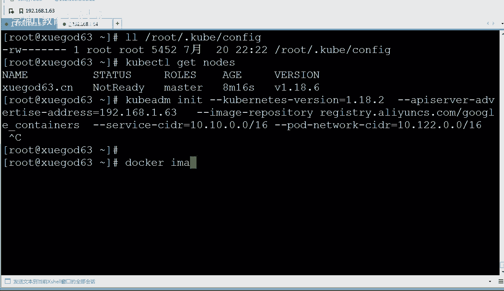
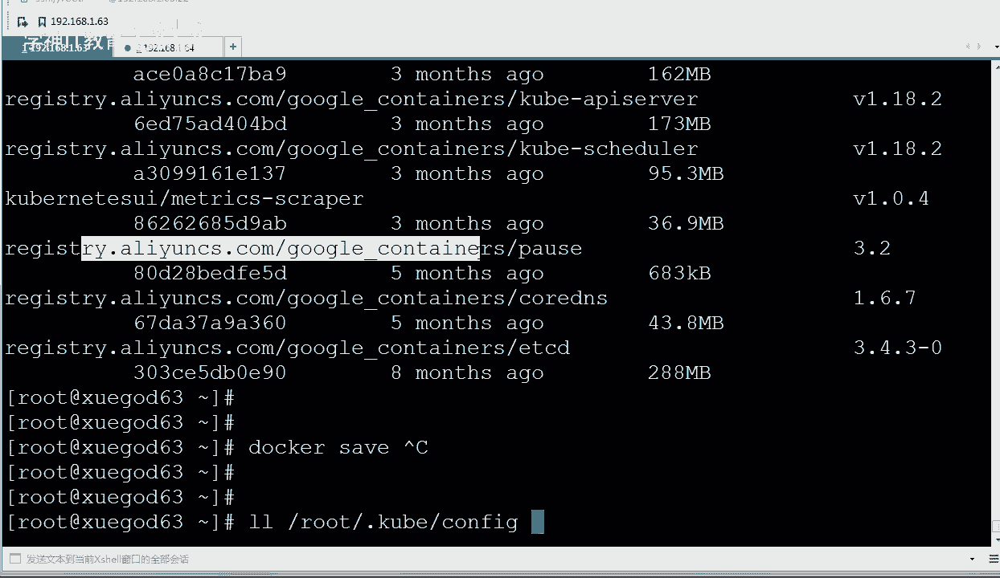
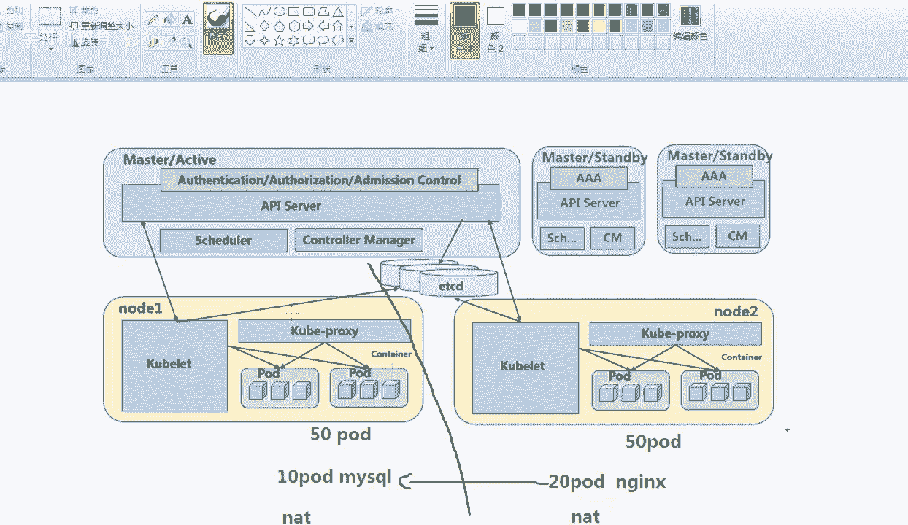
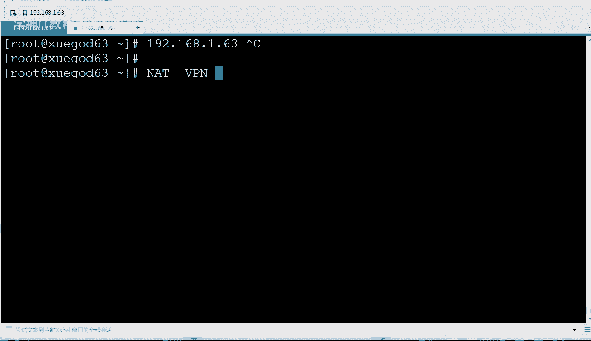
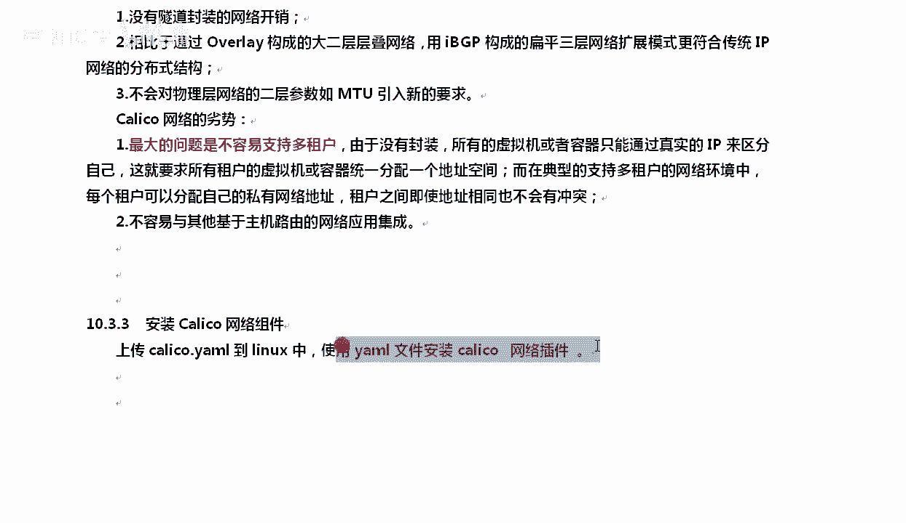
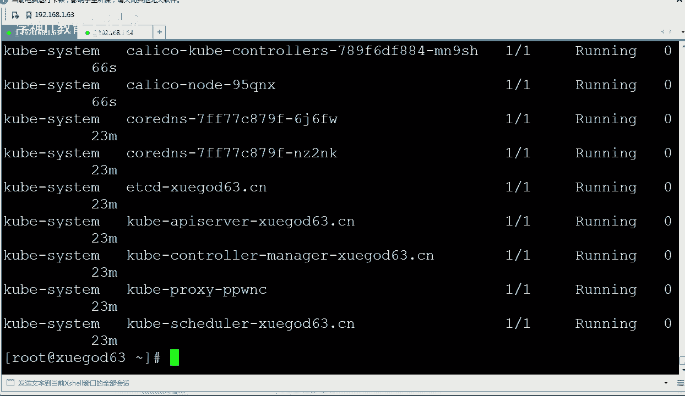
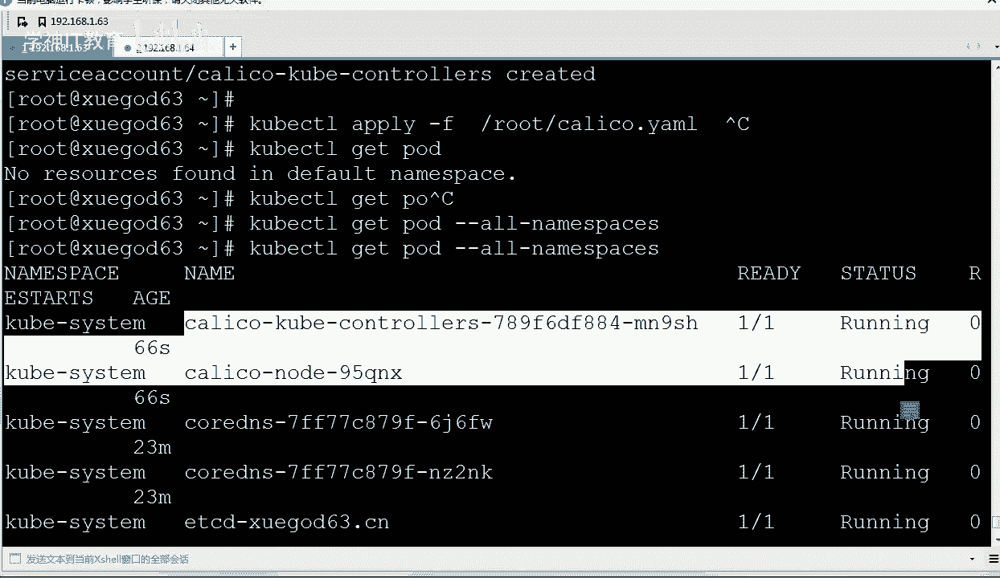
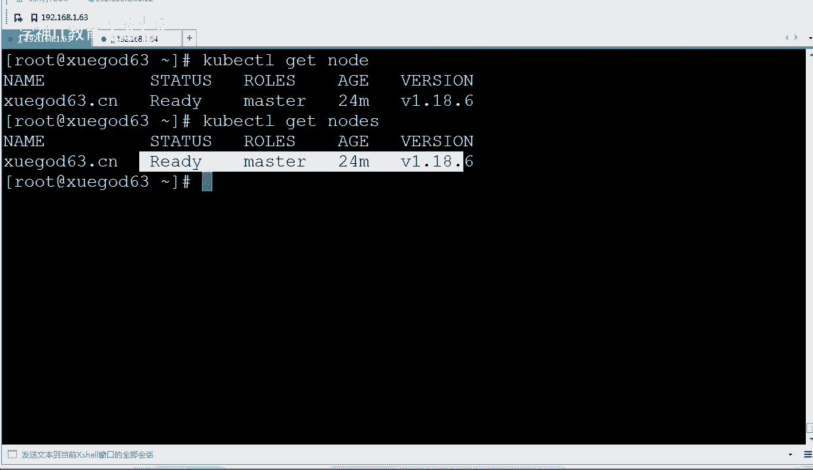
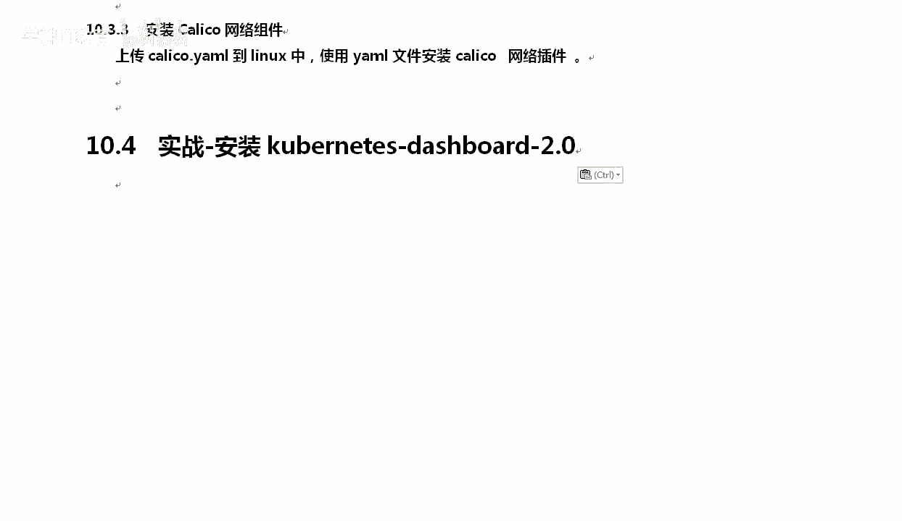

# Kubernetes集群搭建教程：P3：安装Kubernetes网络组件-Calico



## 概述
在本节课程中，我们将学习如何为Kubernetes集群安装网络组件Calico。网络组件是Kubernetes集群的核心部分，它负责管理集群中各个Pod（容器组）之间的网络通信。我们将了解Calico的基本原理、优势与劣势，并完成其安装与验证。

## 网络组件的重要性
上一节我们完成了Kubernetes集群的初始化。然而，默认情况下，不同节点上的Pod无法直接通信。本节中，我们来看看如何解决这个问题。



Kubernetes集群中的Pod需要跨节点通信。例如，一个Deployment可能需要100个Pod实例，这些实例可能分布在不同的节点上，并且彼此需要通信。另一种情况是，运行MySQL服务的Pod需要与运行Nginx服务的Pod进行通信，而它们可能位于不同的物理主机上。

Docker默认的网络模式类似于虚拟机的NAT模式。在不同主机上，采用NAT模式的容器无法直接通信，因为它们处于不同的网络段。这就需要一个网络方案来打通这些隔离的网络。

## Calico网络方案介绍
Calico是一种用于容器间通信的网络方案。它也在OpenStack等虚拟化平台中使用。Calico将每个主机视为互联网中的一个路由器，使用BGP协议同步路由，并使用iptables实现安全访问策略。

**Calico的核心特点**：
*   不使用隧道或NAT技术。
*   将二层和三层流量都转换为三层流量。
*   通过主机上的路由表进行数据包转发。

简单来说，Calico能实现不同物理机器上的Pod相互通信，它通过三层路由实现，避免了传统二层隔离技术（如VLAN）在拆包和封装时的性能损耗。

## 其他网络方案对比
Kubernetes有多种网络方案，以下是其中几种：

以下是几种常见网络方案的简要对比：

*   **Flannel**：一种Overlay（层叠）网络方案。它在每个节点上为容器数据包进行封装，然后通过隧道传输到目标节点。性能会受到封装开销的影响。
*   **Overlay**：另一种基于隧道封装的层叠网络方案。它在底层网络之上构建一个虚拟网络层以实现跨主机通信，数据性能也会受到影响。
*   **Calico**：使用BGP协议构成扁平的三层网络，没有隧道封装开销，因此网络延迟性能通常更好。

## Calico的优缺点
每种方案都有其适用场景。Calico的优缺点如下：

**优势**：
*   属于非层叠网络，将二层转为三层。
*   没有隧道封装的开销，网络性能较好。
*   配置和管理相对简单。



**劣势**：
*   对多租户（Multi-tenancy）场景的支持不如Flannel等方案灵活。在需要为多个完全隔离的用户群体提供服务的公共云环境中，配置会变得复杂。



因此，对于企业内部自建的Kubernetes集群，Calico通常是一个优秀且足够的选择。

## 安装Calico网络插件
接下来，我们开始安装Calico。你需要将提供的Calico YAML配置文件上传到Linux服务器上。

我们将使用`kubectl apply`命令来应用这个配置文件，从而创建所需的资源。

```bash
kubectl apply -f calico.yaml
```

这个命令会创建Calico所需的Deployment和Service等资源。

## 验证安装结果
安装完成后，我们需要验证Calico是否正常运行。

首先，检查Calico相关的Pod是否处于运行状态。由于Calico Pod运行在`kube-system`命名空间下，我们需要指定查看所有命名空间。



```bash
kubectl get pods --all-namespaces
```

在输出中，你应该能看到`calico-node`相关的Pod状态为`Running`。

然后，我们再次检查所有节点的状态，确认它们都已准备就绪（Ready）。



```bash
kubectl get nodes
```



现在，Master节点的状态应该显示为`Ready`。`kubectl`是管理Kubernetes集群的核心命令，后续我们会像使用Docker命令一样频繁地使用它来运行Pod、查看状态等。





## 总结
本节课中，我们一起学习了Kubernetes网络组件Calico。我们了解了Pod跨节点通信的必要性，对比了Calico与其他网络方案（如Flannel）的特点和适用场景。最后，我们通过应用YAML配置文件成功安装了Calico，并验证了其运行状态，为我们的Kubernetes集群提供了网络通信能力。下一节，我们将继续安装Dashboard，这是一个Web管理界面。