# GitLab与Jenkins结合构建持续集成-CI环境：P4：Git客户端使用技巧 🛠️

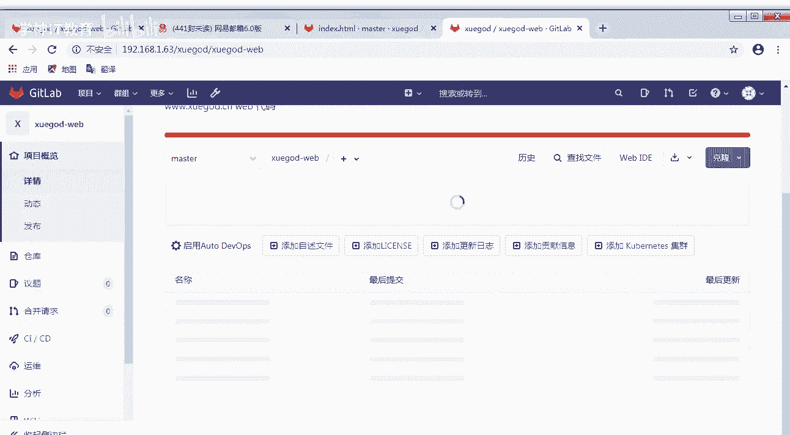

在本节课程中，我们将学习如何在客户端使用Git，包括克隆仓库、配置用户信息、提交代码、管理分支以及版本回滚等核心操作。掌握这些技巧是构建自动化CI/CD流程的基础。

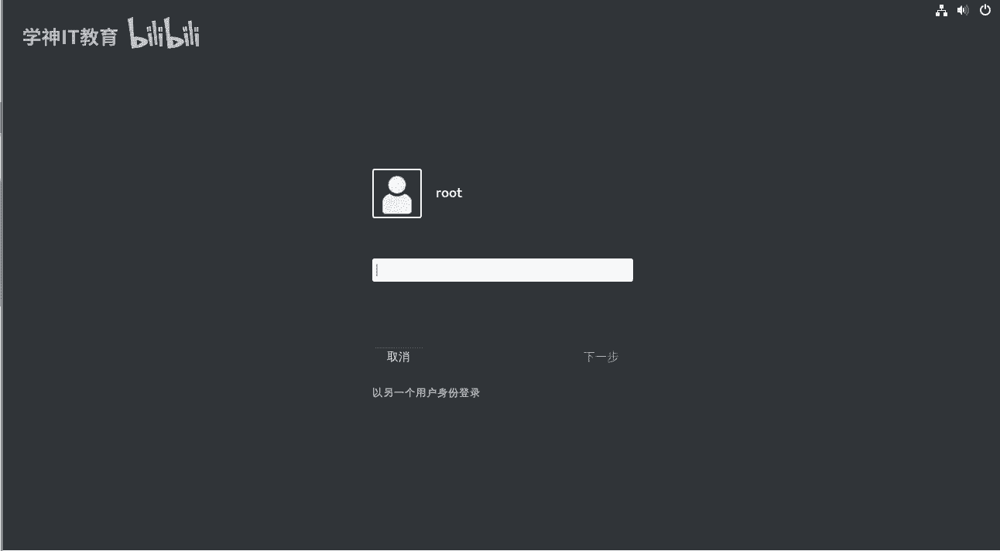

## 概述

上一节我们介绍了GitLab的Web界面操作。本节中，我们来看看如何在命令行客户端使用Git，将本地代码与远程GitLab仓库进行同步和管理。

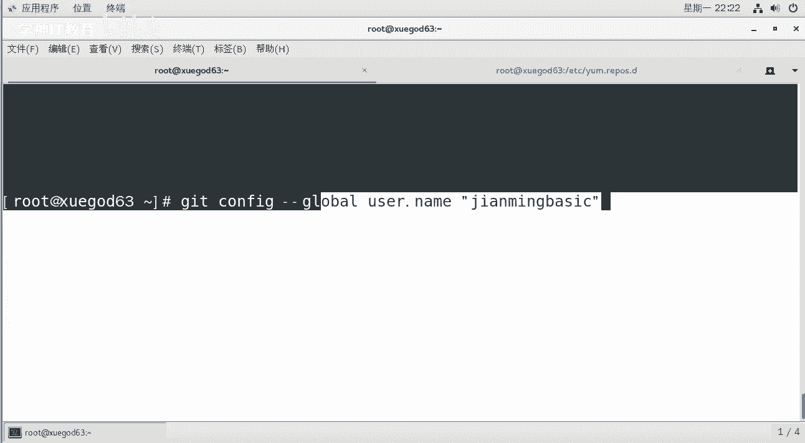

## 克隆远程仓库

首先，我们需要将GitLab上的远程仓库克隆到本地。操作步骤如下：

1.  在GitLab项目页面，找到并复制以HTTP方式克隆仓库的地址。
2.  在终端中，使用 `git clone` 命令进行克隆。

以下是克隆仓库的命令示例：
```bash
git clone http://your-gitlab-server/username/project.git
```
克隆完成后，当前目录下会生成一个与项目同名的文件夹，其中包含项目文件和一个隐藏的 `.git` 目录，该目录用于存储Git的所有版本信息。

## 配置用户信息

为了在提交代码时标识作者身份，需要配置用户名和邮箱。

你可以设置全局配置，对所有项目生效：
```bash
git config --global user.name "Your Name"
git config --global user.email "your.email@example.com"
```
全局配置信息会保存在用户家目录下的 `.gitconfig` 文件中。

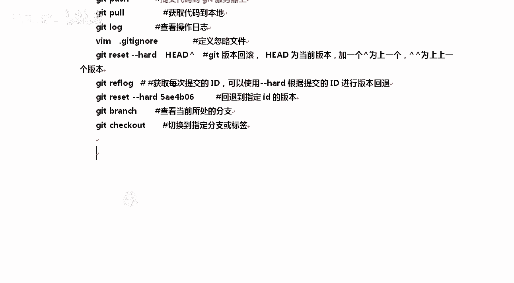

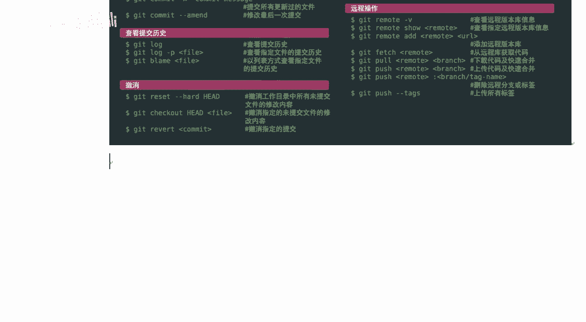

如果只想为当前项目单独配置，可以在项目目录下执行（不添加 `--global` 参数）：
```bash
git config user.name "Your Name"
git config user.email "your.email@example.com"
```
项目级配置的优先级高于全局配置，信息保存在项目下的 `.git/config` 文件中。

## Git核心工作流程与常用命令

Git的基本工作流程可以概括为：工作区 -> 暂存区 -> 本地仓库 -> 远程仓库。

以下是完成这个流程的核心命令列表：
*   `git add <file>`：将工作区的文件修改添加到暂存区。
*   `git commit -m “message”`：将暂存区的内容提交到本地仓库，并附上提交说明。
*   `git push`：将本地仓库的提交推送到远程仓库。
*   `git pull`：从远程仓库拉取最新代码到本地（适用于已克隆的项目）。
*   `git status`：查看工作区和暂存区的状态。
*   `git log` / `git reflog`：查看提交历史。`reflog` 记录了所有操作历史，可用于找回丢失的提交。
*   `git reset --hard HEAD^`：回滚到上一个提交版本。`HEAD^^` 代表上上个版本，也可使用具体的提交ID。

## 分支管理

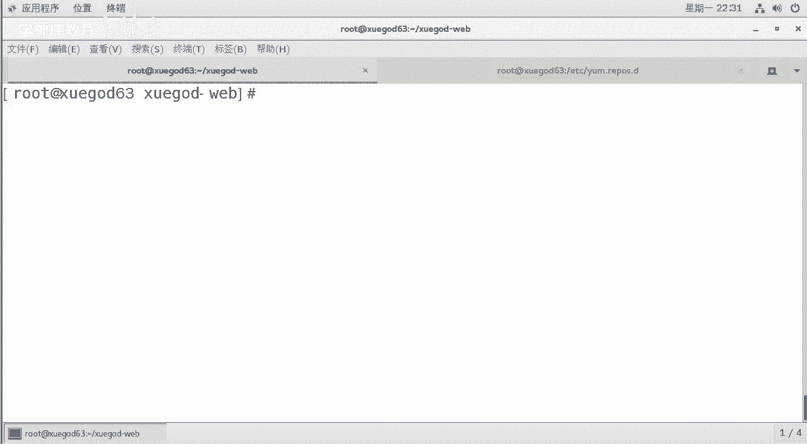

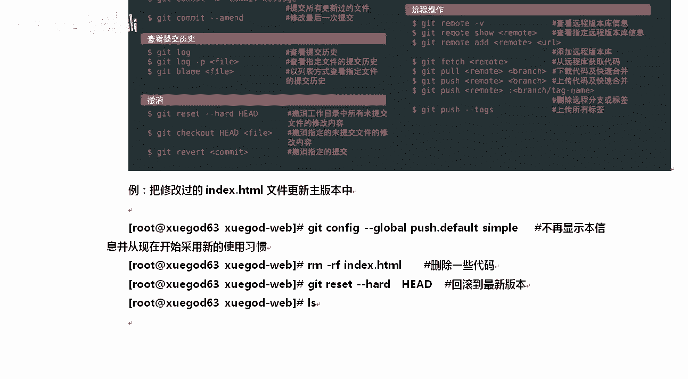

分支是Git的强大功能，允许你在独立的线上开发新功能。

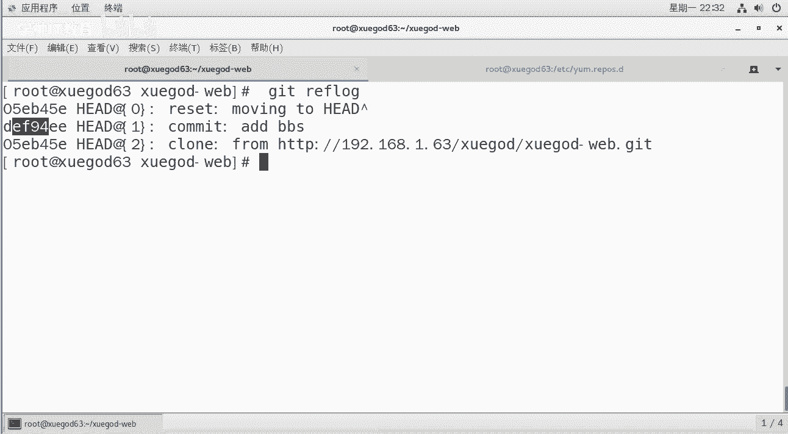

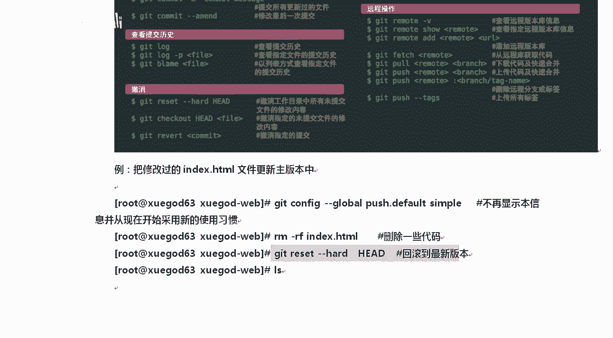

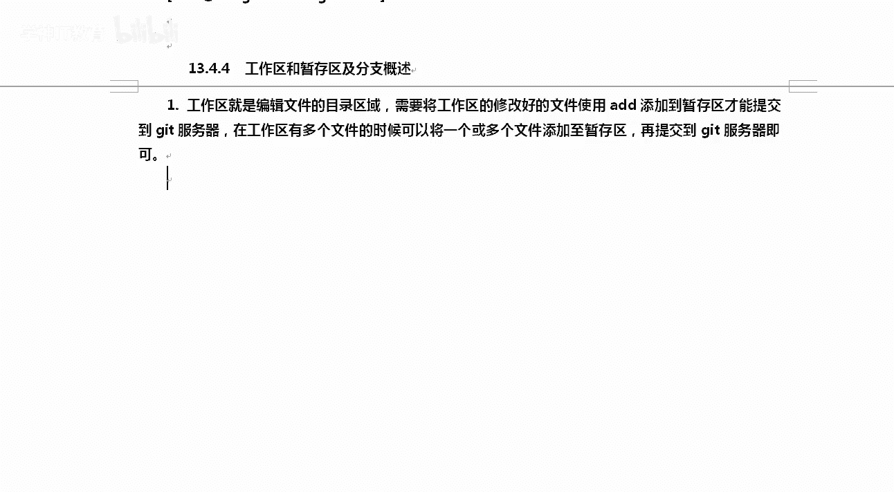

以下是分支的常用操作命令：
*   `git branch`：查看所有分支，当前分支前会标有 `*` 号。
*   `git branch <branch_name>`：创建新分支。
*   `git checkout <branch_name>`：切换到指定分支。
*   `git checkout -b <branch_name>`：创建并切换到新分支（合并了上述两条命令）。
*   `git merge <branch_name>`：将指定分支合并到当前分支。例如，在 `master` 分支上执行 `git merge dev`，可将 `dev` 分支的修改合并进来。
*   `git push origin <branch_name>`：将本地分支推送到远程仓库。

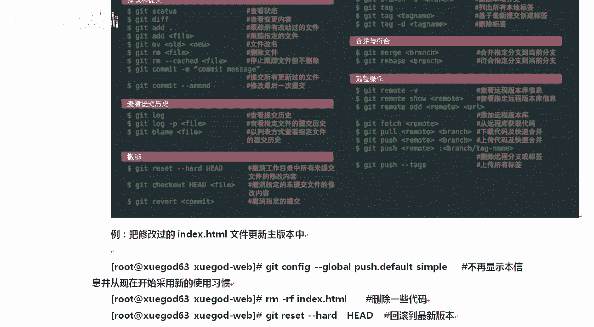

## 实战演练

让我们通过一个简单的例子来串联上述命令。

1.  **修改并提交文件**：
    ```bash
    # 1. 创建一个新文件
    echo “Hello Git” > test.txt
    # 2. 添加到暂存区
    git add test.txt
    # 3. 提交到本地仓库
    git commit -m “Add test.txt”
    # 4. 推送到远程仓库
    git push
    ```

2.  **创建与合并分支**：
    ```bash
    # 1. 创建并切换到新分支 feature
    git checkout -b feature
    # 2. 在新分支上修改并提交
    echo “New feature” >> feature.txt
    git add feature.txt
    git commit -m “Add new feature”
    git push origin feature
    # 3. 切换回主分支
    git checkout master
    # 4. 合并 feature 分支
    git merge feature
    # 5. 将合并后的结果推送到远程
    git push
    ```

3.  **版本回滚**（如果不小心提交了错误内容）：
    ```bash
    # 查看提交历史，获取要回退版本的ID
    git log --oneline
    # 回退到指定版本 (假设版本ID为 a1b2c3d)
    git reset --hard a1b2c3d
    # 强制推送到远程仓库（注意：这会覆盖远程历史，团队协作时需谨慎）
    git push --force
    ```

## 总结

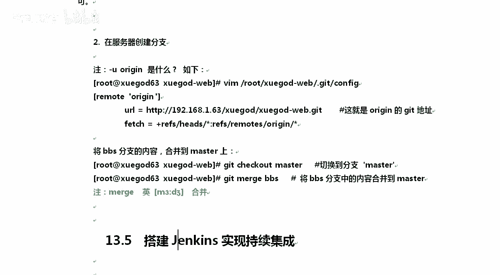

本节课中我们一起学习了Git客户端的基本使用技巧。我们掌握了如何克隆仓库、配置用户信息，理解了 `add`、`commit`、`push` 这个核心工作流，并实践了分支的创建、合并以及版本回滚操作。这些是日常开发和参与CI/CD流程的必备技能。下一节，我们将开始学习如何与Jenkins进行集成。