# Kubernetes实战教程：P5：通过Kubernetes Dashboard创建容器 🚀

## 概述
在本节课中，我们将学习如何使用Kubernetes Dashboard的图形化界面来创建和管理容器。我们将创建一个Nginx应用，并为其配置服务，从而理解Kubernetes中Pod、Service和外部访问的基本工作流程。

---

## 检查集群状态 ✅

在开始创建容器之前，首先需要确认Kubernetes集群的节点状态是否正常。

上一节我们介绍了集群的搭建，本节中我们来看看如何通过Dashboard进行操作。请确保所有节点（例如node1: 192.168.1.63 和 node2: 192.168.1.64）都处于“Ready”状态。在Dashboard的“节点”页面，可以查看CPU和内存的使用情况，确认当前负载正常。

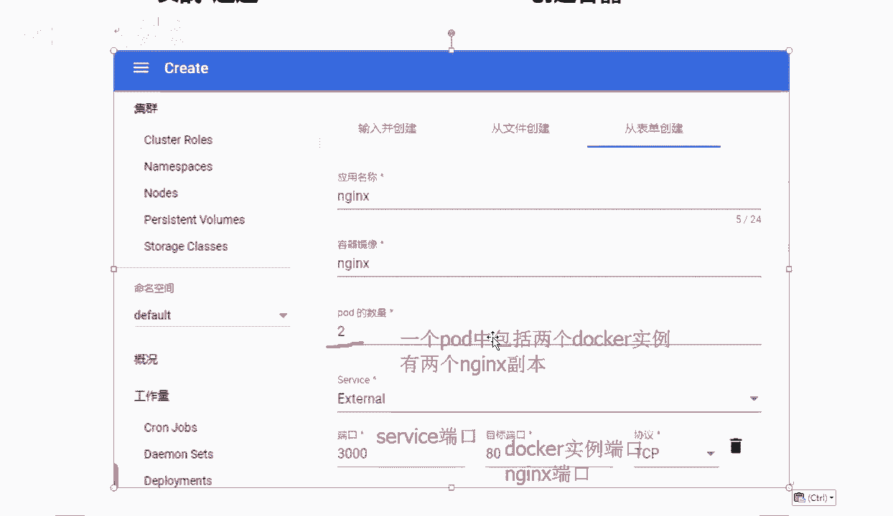

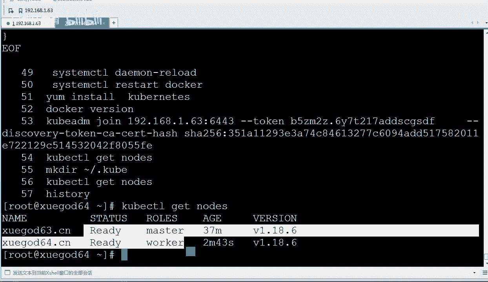

---

## 浏览Dashboard基础概念 🔍

在创建资源前，我们先熟悉Dashboard界面中的几个核心概念。

*   **命名空间（Namespace）**： 默认存在 `default` 等命名空间，用于资源隔离。
*   **工作负载（Workloads）**： 主要包括Pod（po）和副本集（ReplicaSet），当前还没有任何Pod运行。
*   **服务（Service）**： 提供服务的发现和负载均衡功能。

---

## 通过表单创建Nginx部署 📝

Kubernetes通常使用YAML或JSON文件定义资源，但Dashboard提供了便捷的表单创建方式。以下是创建Nginx部署的步骤。

1.  **选择创建方式**： 点击“创建”，选择“指定表单方式创建应用”。
2.  **配置应用详情**：
    *   **应用名称**： 例如 `my-nginx`。
    *   **容器镜像**： 填写 `nginx`。如果本地没有，集群会自动从Docker Hub拉取。
    *   **副本数**： 设置为 `2`。这将创建两个相同的Pod副本。
3.  **配置服务（Service）**：
    *   勾选“服务”，并选择类型为 **`External`（对外）**。
    *   **服务端口**： 设置为 `3000`。这是Service对外暴露的端口。
    *   **容器端口**： 设置为 `80`。这是Nginx容器内部监听的端口。
4.  **部署**： 点击“部署”按钮。

系统将创建一个名为 `my-nginx` 的Deployment资源，该资源会确保始终有2个运行Nginx的Pod。同时，会创建一个对应的Service。

> **核心概念**：一个Pod是Kubernetes中最小的可部署单元，可以包含一个或多个容器。本例中，每个Pod包含一个Nginx容器。

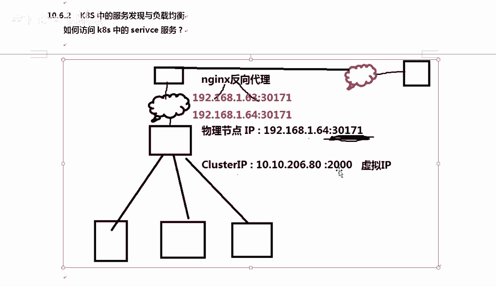

---

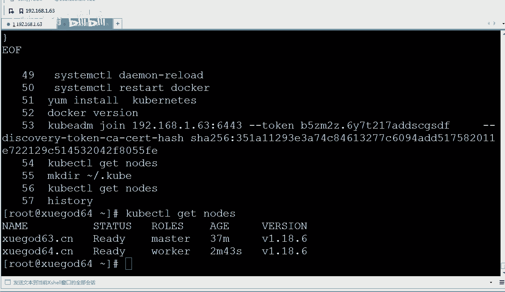

## 验证部署与访问应用 🌐

部署完成后，需要等待所有资源状态变为绿色（正常）。

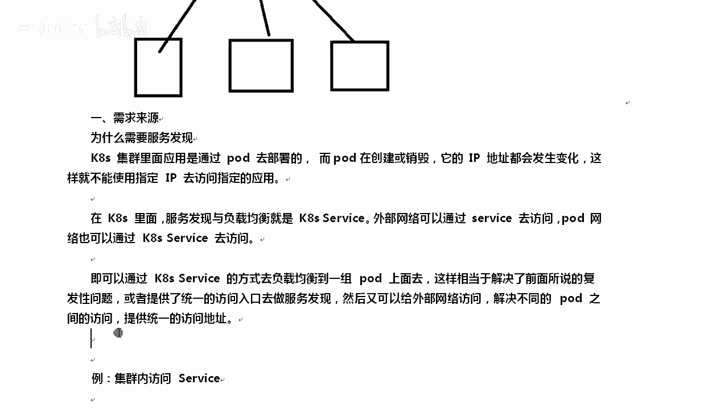

**验证步骤：**
1.  在“概览”或“工作负载”页面，确认Deployment和Pod的状态均为绿色。
2.  在“服务”页面，找到名为 `my-nginx` 的服务。可以看到其外部端点（Endpoints）显示了一个 `NodePort`，例如 `31770`。

**访问应用：**
现在，可以通过集群中**任意节点**的IP地址加上 `NodePort` 来访问Nginx服务。
访问格式为：`http://<节点IP>:<NodePort>`
例如：
*   `http://192.168.1.63:31770`
*   `http://192.168.1.64:31770`

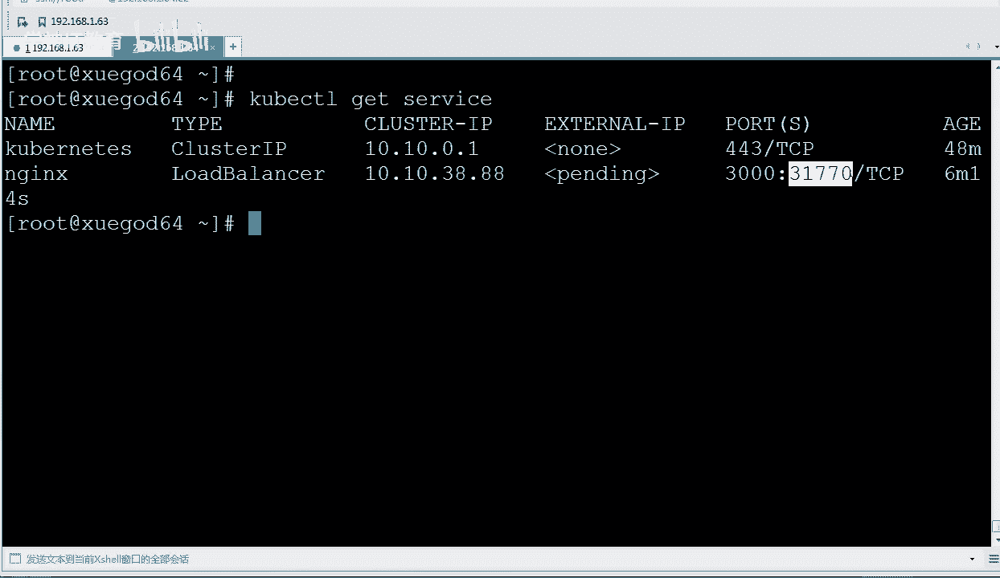

两个地址均可访问到Nginx的欢迎页面。这体现了Kubernetes服务的高可用性。

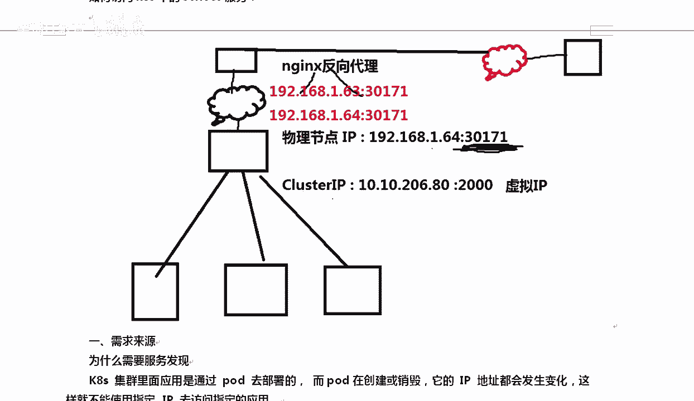

---

## 深入理解Service与集群内部通信 🧠

有同学可能会问，之前表单中填写的3000端口是做什么用的？这引出了Kubernetes **服务发现** 的核心概念。

### 为什么需要Service？
Pod的IP地址不是固定的，在创建、销毁或重启时会发生变化。如果直接依赖Pod IP访问应用，会非常不稳定。Service提供了一个稳定的访问入口。

### Service的类型与访问方式
*   **ClusterIP**： 默认类型，为服务分配一个集群内部的虚拟IP（VIP），只能在集群内部访问。
*   **NodePort**： 在ClusterIP基础上，在每个节点上开放一个静态端口（`30000-32767`），将流量转发到Service。这就是我们刚才访问应用的方式。
*   **LoadBalancer**： 在NodePort基础上，使用云服务商提供的负载均衡器。

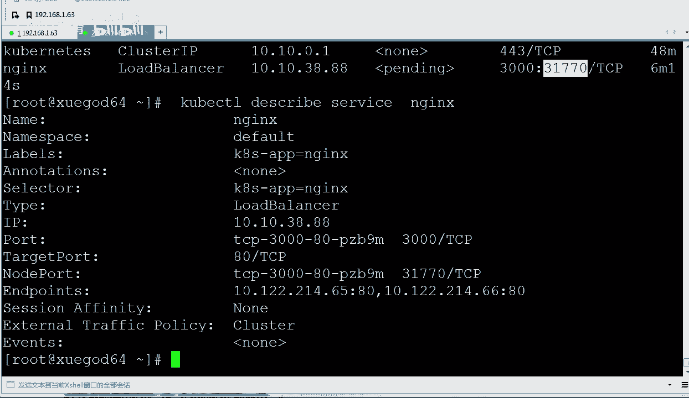

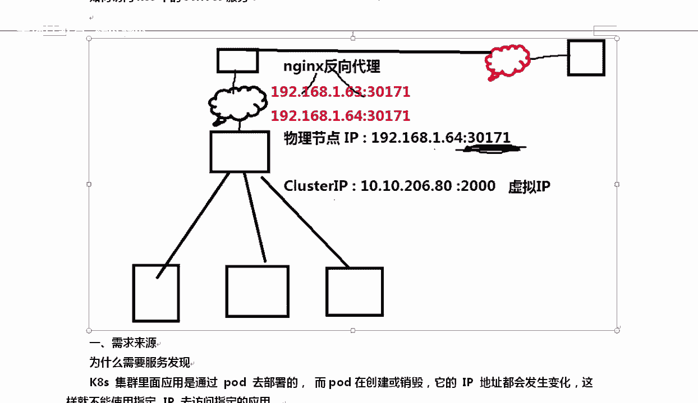

### 查看Service详情
可以通过命令行查看服务的详细信息，理解流量转发路径：

```bash
kubectl get service my-nginx
kubectl describe service my-nginx
```

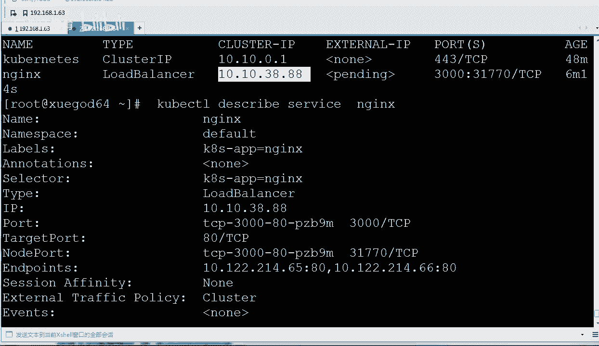

在描述信息中，可以看到：
*   **Selector**： `app=my-nginx`。Service通过这个标签（Label）选择后端哪些Pod来接收流量。
*   **Cluster-IP**： 例如 `10.96.0.1`。这是服务的集群内部虚拟IP。
*   **Port**： `3000` -> `80`。表示Service的3000端口映射到Pod的80端口。
*   **Endpoints**： 列出两个Pod的实际IP地址和端口，例如 `10.244.1.2:80, 10.244.2.3:80`。

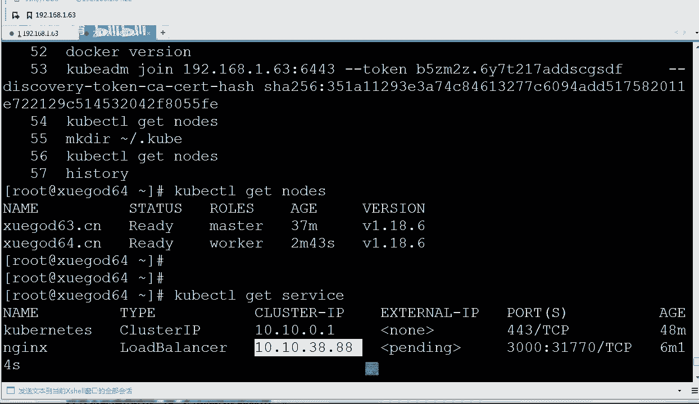

### 集群内部访问演示
Service的ClusterIP在集群内部是可达的。我们可以进入一个Pod内部，尝试访问该Service。

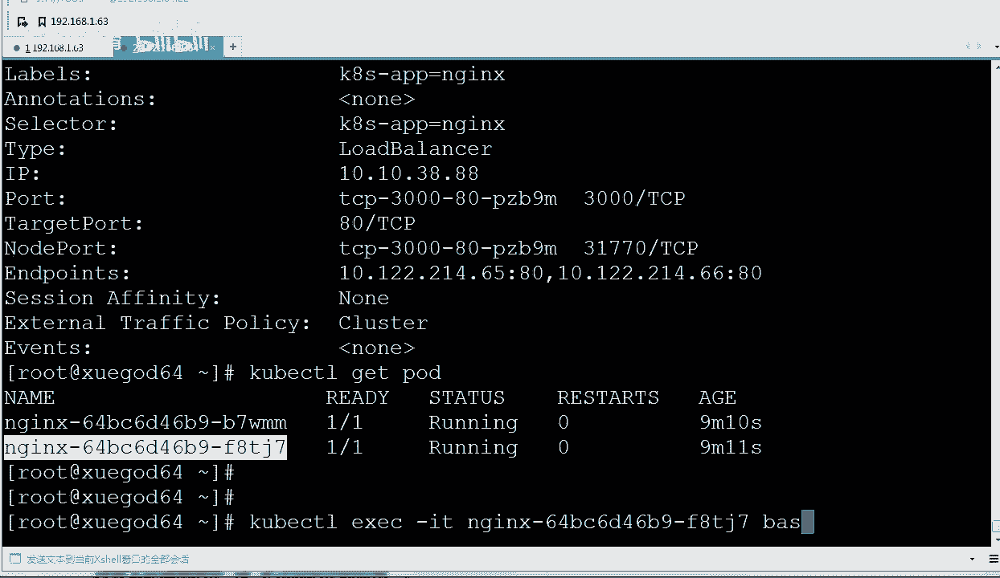

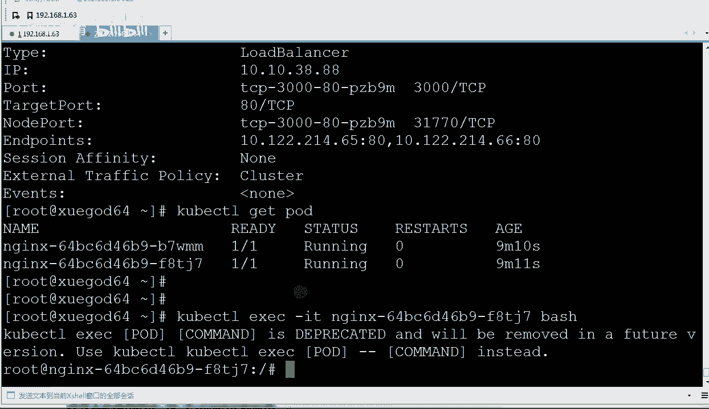

```bash
# 进入一个Pod（例如my-nginx的某个Pod）的内部
kubectl exec -it <pod-name> -- /bin/bash
# 在Pod内部使用curl访问Service的ClusterIP和端口
curl http://<cluster-ip>:3000
```

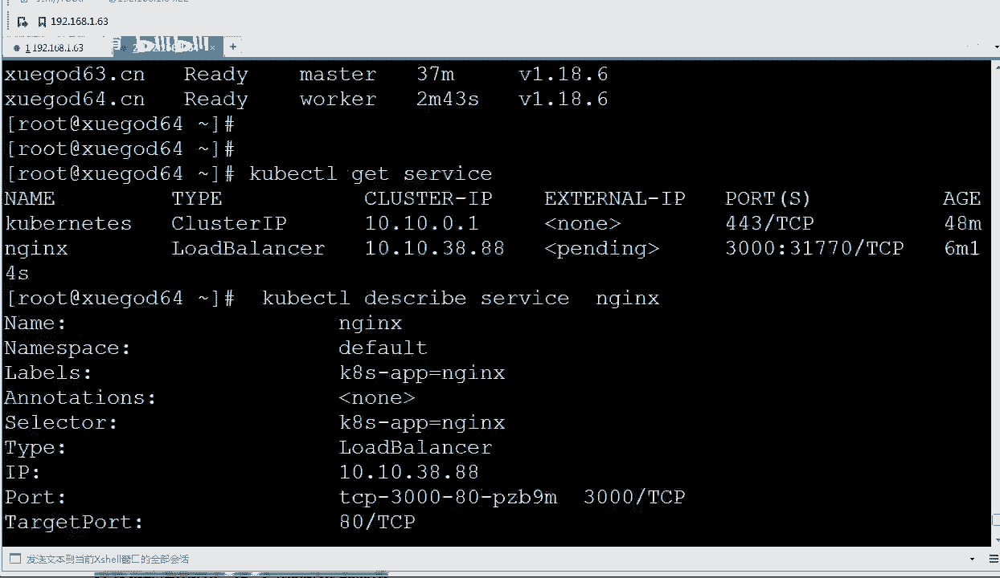

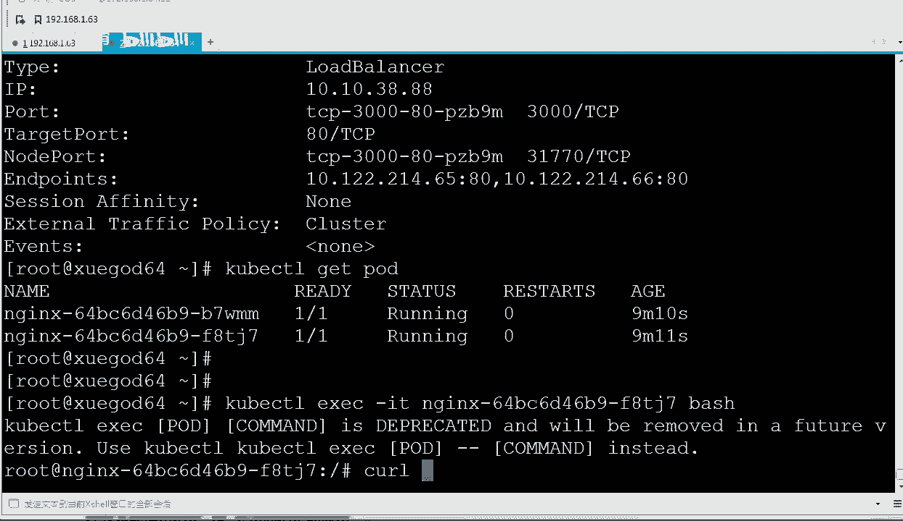

能够成功访问，这证明了集群内部的应用（如一个Web服务）可以通过Service名称或ClusterIP稳定地访问另一个服务（如数据库），而无需关心后端Pod的具体IP地址。

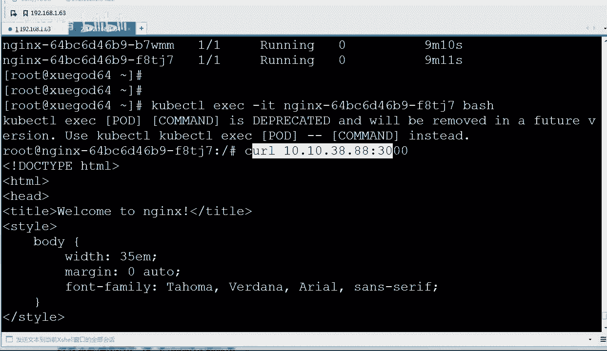

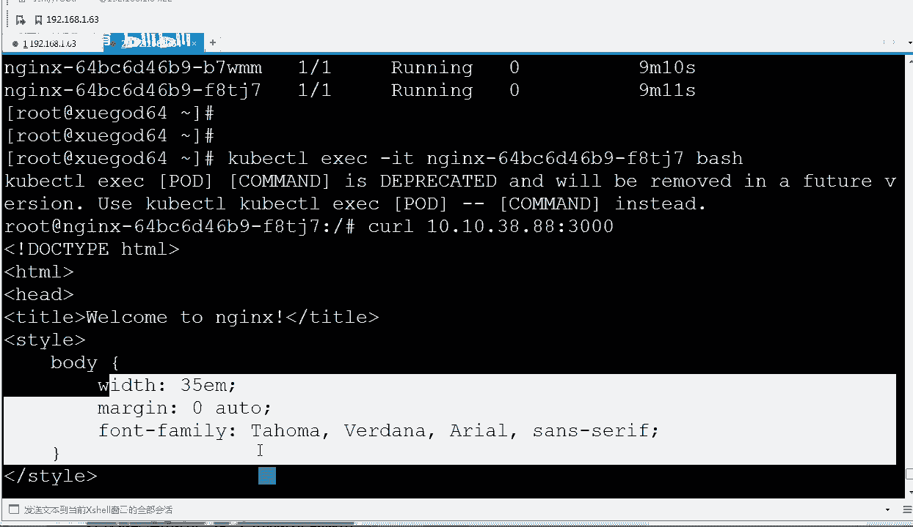

---

## 总结 🎯

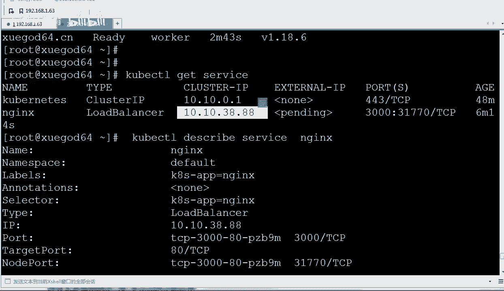

本节课中我们一起学习了：
1.  **使用Dashboard创建应用**： 通过图形化表单快速部署了一个多副本的Nginx应用。
2.  **理解核心概念**： 明确了Pod、Deployment和Service之间的关系。Deployment管理Pod副本，Service为Pod提供稳定的网络访问。
3.  **外部访问**： 通过 `NodePort` 类型的Service，可以从集群外部访问应用。
4.  **服务发现原理**： 理解了Service通过Label选择器关联Pod，并通过ClusterIP提供集群内部稳定的服务发现机制，解决了Pod IP动态变化带来的访问问题。

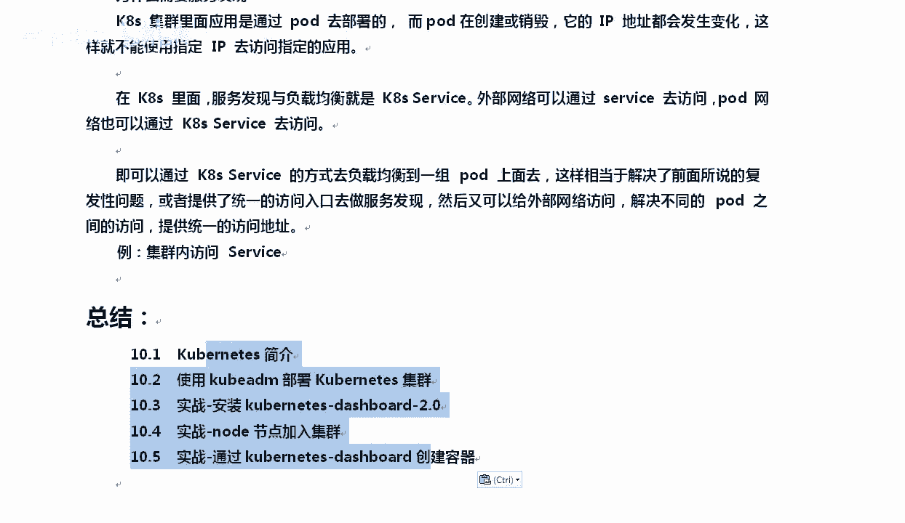

通过这个实战练习，你应该对Kubernetes如何运行和暴露一个基础应用有了直观的认识。接下来，我们将深入学习如何使用kubectl命令行工具来更灵活地管理这些资源。