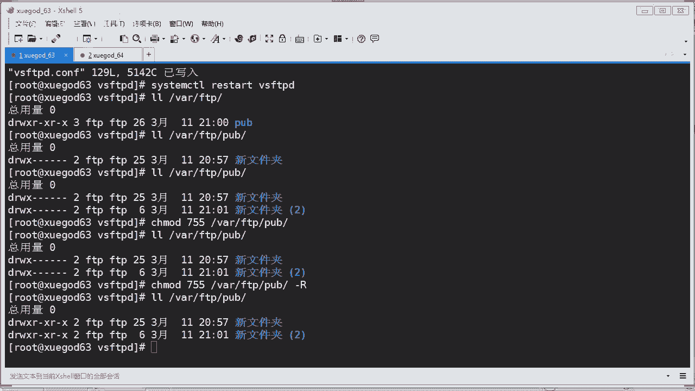
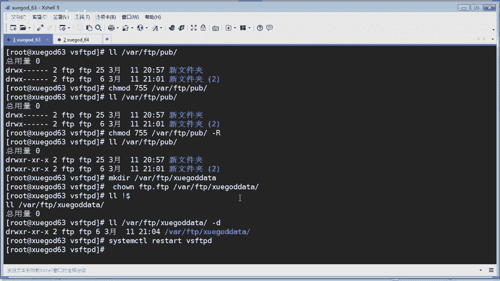

# Linux／Linux运维／RHCE／红帽认证／云计算／Linux资料／Linux教程-- - P1：FTP安装配置_01 - 学神科技 - BV1SK4y1s7Gy

好，第二阶段的第四章。搭建FTP服务器，实现文件共享和NF服务器配置啊，其实这两个呢都是讲文件服务器的，看到没有？都是讲共享是吧？那么其实在我们运维过程中的话，肯定会存在共享啊，共享应该怎么配置，对吧？

那么在windows里面呢，你设置共享，我想你们应该都会设置对吧？比如我要共享一个文件夹给我的同事是吧？或者是搭建个公司的一个文件共享服务器，你们都有做过是吧？有工作经验同学应该都有搭建过是吧？

那么在这个linux下，你应该怎么样去搭建一个文件服务器呢？对吧，那么今天我们又来学习一下这个FTP服务器啊，是在这个上搭建的，还有这个NFNFS啊。今天我们会讲到这个什么VSFTP服务器的理论啊。

包括怎么样安装配置FTP啊，然后实战匿名访问FTP和加密访问FTP啊。最后我们再讲一下这个NF共享，怎么样去配置啊。我们需要用到啊两台虚拟机就可以了啊，一台是做服务端啊，一台做客户端啊OK。先讲讲是吧。

FTP大家都认识啊，其实是不是是做什么用的对吧？那这里的话再啰嗦一下同学们啊，FTP服务器是吧，它的全称是这个对不对？那么是在互联网上提供文件存储和访问服务的计算机。啊，他们依照FTP协议提供服务啊。

其实在以往来说的话，我们使用这FTP最多的是做什么呢？跟我们的网站绑定在一起。比如这个研发部门，它是通过FTP上传这个程序的对吧？上传代码，一般都是通过什么呀？FTP来发布。对不对？

那么现在还用FTP的发布吗？也有，但是比较少。现在用什么发布啊，用这个gitgllla是吧？就是代码代码版本管理，对不对？那后面的话你们会学到这个什么呀，这个代码版本的管理啊，软件，实现一个什么。

实现一个程序的发布啊。是不是把所有人都合在一起了，突然感觉颜变多。对啊，是的啊，所有人都合在一起了。没错啊，新老学员都在同一个课堂了。那么这样老师就不用打开两个课堂呢，是吧？之前有同学反映，哎。

老师你你在说什么，我怎么听不懂是吧？那是因为我回答另外一个老学员那个提问的问题，对吧？不要见怪。那么这一次的话，大家合在一起了啊？那常见的FTP在windows下，你应该有听过这个是吧？

SIIV杠U是吧，这个。这个是比较常用的一个什么呀1个FTV服务器原件，对吧？还有FTV serverever，对不对？还有这个f failed这个sever看到没有？啊。

那linux下呢linux下的话有什么啊，这个prolo fTBD对吧？就是profession FTB啊mo这个是一个unice平台上的一个什么呀FTP服务区程序啊。

OK当然还包括我们今天讲了这个VSVSFTP啊。VSFTP是一个基于GPL发布的类un上使用的FTP软件。很多同学都听到GPL到底什么是GPL啊，是吧？你们经常会听到哎，这个软件是基于GPL发布的。哎。

这个软件又是GGPLGPL是什么东西啊？是自由软件对吧？什么叫自由软件啊，通俗来讲就是免费软件。主要你遵循这个GPL的协议，大家都遵循它啊，每个人都可以对这个软件进行什么？进行一个修改，二次开发啊吧。

然后重新发布，对吧？这种呢就是遵循一个叫GPGPL的协议发布，就是自由软件是吧？免费的啊OK。😊，明白没有？那它的全称是什么呢？rely really什么这个relySEURE啊这个。FTV啊。

是从这个啊来开始的，所以简称为叫什么呀VSFTP啊OK。它有什么特点？你看一下啊，安全高速稳定啊，安全高速稳定啊。那么今天我们就会来搭建这个VSFTP啊，VSFTP肯定是CS模式，对吧？啊。

监定端口的话是20和21啊。你可以看一下，通过这一个这个service里面是话，你会以查看到什么呢？查看到这个FTP啊，它使用的端口是什么呀？21啊，还有一个什么2020呢主要是用传传数据的是吧？

看到没有FTP杠data啊，它是是用了传数据的啊。OK还有两个端口啊，那一般监听端口呢是21啊。用来传输指令啊，前面这是传输数据啊。看看讲到FTP呢，我们了解一下它两种模式啊，它有两种工作模式啊。

一个是主动，你个是被动啊，其实也很好理解是吧？什么叫主动，什么叫被动是吧？比如你要。你喜欢一个女孩子，如果你去追她是吧？主动出击是吧？主动出击，那你肯定是主动去追他。什么叫被动啊？你你长得帅是吧？

那女孩子呢反过来追你倒追你，你这种的话就是被动了是吧？好，那那克始通俗来说吧，来我们讲讲这个FTP的主动和被动啊。😡，FTP呢包括两个通道啊，控制通道和数据传输通道啊，FT的工作模式呢就两种啊。

刚才说了主动和被动啊，对不对？它怎么样是怎么样归类为主动怎么样是被动了是吧？它以这个s端为参照，主动模式就是服务端主动连接客户端传输，对吧？那被动呢被动就是等待客户端来连接我对吧？那这种的话就是被动啊。

很好理解，你看一下它的一个工作原理啊，先讲讲啊，主动模式的工作原理是吧？那么客户端呢连接到FTP服务器的2级端口啊，发送用户名和密码，然后呢，客户端随机开放一个端口啊，这个一般是大端口是吧？

1024以上。发送这个portd命令到FTP服务器，告知服务器客啊客户端采用主动模式并开放端口。那么FTP服务器收到这个这个请求是吧？主动模式命令和端口后，通过服务器的20端口啊。

刚才说20端口是传数据的是吧？和客户端啊，开放了这个什么高位端口对不对？进行一个连接，然后呢，传输数据啊，它的原理就是这样子啊。你看这里有个图是吧？发送请求啊，然后回应啊回应1个SK是吧，回应他哎。

我要我要开一个一个随机端口啊，要跟你连接，而且我是要使用什么主动模式的对吧？那么FDB呢，它就通过2次端口是吧？连接你的这个客户端的随机端口进行传输数据啊，最后呢确认传输啊，OK就是这样子啊。

那被动模式呢其实刚好是刚才说反过来是吧啊PASV是吧，这个pas这个是什么呢？是中文缩写为啊被动模式啊，工作原理呢这个FTP客户端的话，连接服务端的这个21端口，发送用户名和密码。

然后发送一个什么PSV的命令到这个FTP服务器服务器呢在本地随机开放一个端口。注意这个也是高位端口对吧？开放一个端口，然后把开放了端口告知客户端。啊。

然后呢客户端在连接到服务端开放了这个高位端口进行数数据传输啊，这种的话就是被动模式啊，这个图的话其实差不多是吧？刚好是反过来。

只不过看是基于什么基于它使用的是一个随机啊就服务端到底是随使用一个随机端口来连接还是使用20端口来连接，对吧？来区别。那以上就说明了一个主动和被动啊，相对于FTBs来判断了，对吧？

如果s去连接你的客户端，那么说明是主动。如果客户端去连接你的sble开放端口，那么就是被动啊。OK啰嗦了这么多这个原理的东西啊。嗯，来，我们直接进入主题是吧，怎么样去安装1个FTB呢，对吧？

那当然你可以通过IBM包的方式进行安装，对吧？啊，如果你有本地这个样源是吧？或者是我们通过亚么直接安装就可以了，是吧？啊，本地源也行啊，这个网络源也是可以OK。安装非常简单啊，通过yminst杠Y是吧。

然后装上就可以了啊。那呃客户端的话，你要装上这个LFTB啊，其实你在服务端两个你都可以装上去是吧，都没有问题啊。

旁便你测试。

我连接一下啊，这个哎。我的虚拟机没打开啊，稍等，我看看啊。😊，虚拟机。果然是啊还没开启啊，稍等。

嗯。正在开启。好啊，稍等一下啊。

啊，你们先装一下啊，把这个啊可以跟上老师的节奏啊，跟上实验做一下。因为这个今天的内容不难是吧？可以啊，边听边操作啊边听边操作OK。

好，我打开一下啊。

OK啊连接上去了啊，那么我们先来装一下啊ym杠Y是吧，install一下什么呀？VSFTPD是不是这个？对吧没错吧，这个然后还有什么呀？还有一个客户端，我们也可以一并把它装上去啊，同学们。好。

我们也可以把这个客户端啊，这个客户端软件也装上去，叫LFTP啊。

啊，6四这边的话，我们也应该装一下啊。6四这边的话，我们主要装什么呢？

我们只要装客户端就可以了，对吧？LFLFTP。好嘞，那么服务端这边的话已经安装完成对吧？已经安装完成啊，安装完成之后的话，我们就可以啊可以开始来进行配置测试，对吧？那么在配置测试之前，我们来看一下啊。

呃，这里讲到啊这个LFTP啊，从36S开始的话，系统镜像中默认没有FTP客户端的命令呢，取而代之的是取而代之的是LFTP的命令啊，这个是的一个什么呀客户端，啊，它是一个非常功能非常强大的一个下载工具啊。

支持什么协议呢？不但只支持FTP还支支持其他的像什么呀HTTP是吧？还有HPS等等。你看都可以是吧？O。

他这个的话啊非常类似一个笑了是吧？有命令补全啊，历史记录允许多个后台业务执行等功能啊，使用起来非常方便啊。还有书签排队镜像断点续传的功能啊，还是不错，是吧？有点类似迅雷下载工具啊，是吧？好。

那么下面进入主题说我们看一下这个服务端啊，服务端的这个配置的话，这个时是它的一个什么核心配置文件，就是主配置文件。在ETC下面的VSFFPD下面的目录啊，有一个SF文件看见没有？这个是主配置文件啊。

O啊，还有一些其他文件，比如这个是什么呀黑名单啊，黑名单的文件，还有一个什么白名单文件啊，很难理解对吧？我们可以看一下啊，你可以查看一下这个叫user list查看一下对吧？这有说明啊。

如果你配置成什么，它就会怎样怎样，对吧？说明说如果user list denied等于yes，对吧？那绝不允许在这个文件中的用户登录FTB啊，这样的话就变成什么呀？变成了相当于黑名单了，是吧？

甚至不提示输入密码。对不对？来，我们看一下啊。ETC下面的VSFTPD对吧？有一个user list，我们打开看一下，你看。你可以翻译一下这两句话是啥意思，对吧？如果你配置成月始的话，它会怎么样怎么样。

对不对？默认的话就是yes。对吧。你看这里写有啊，像这个什么luuter。😡，对吧还有这个什么病的，还有这些都是什么呢？😡，就这些用户，对吧？O。好，大家你可以看一下另外一个啊，另外一个是什么呀？

FTPus。啊，这个又是什么东西啊？这个就表明说不允许登录，对吧？那么也是这些。你看没有？O。一个是白名单啊，一个是黑名单啊，很好理解，对吧？好啊。那我们看一下，我们进到这个目录看一下啊。

ETC下面的VSFTP。啊，总共刚才我们讲了是吧，这两个是一个黑名单，一个白名单啊，这个是主配置文件啊，还有这个是什么东西啊？这个的话是这个FTB的一些变量啊，或者是些脚本啊，在这里面啊。

一般的话我们不用动它，对不对？OK这个就是VSFTB的一个路径是吧？来，我们打开一下嗯这个。我们先启动嘛，先启动一下，看能不能启动，对吧？看有没有问题啊，VSFTPD。还，没有问题，对吧？

那我们看一下监听端口。啊，21端口你看没有？21端口已经在监听啊，说明它已经启动了是吧？VSFTP啊没有问题，对吧？那么正常情况下呢，我们应该把它设置为是吧，生产环境肯定要设置什么呀？随机启动。对不对？

设置为随机启动啊，这样的话就可以设置随机启动了。O。当然你要把这个IP tables和S关掉，对吧？如果你要开启I table话，那你就要放行什么？放行相应的端口，对不对？放行相应的端口啊。

这个的话要注意。对吧。有同学会有疑问啊，不是有还有个20端口吗？刚才已经讲了二0端口是什么呀？数据端口，如果没有数据传输呢，你是看不到二0端口的，对不对？它都没有启动啊，它都没有数据传输啊。是吧。好。

那往下去看，我然后我我们来看一下他的这个什么呀。启动完成之后，他是不是能用了呢？对不对？来，我们来这个客户端测试一下。嗯，比如LFTP对吧？192。168。2。632。63的话是服务端。

我看一下能不能够登录呢？嘿。看一下啊LOS看一下，貌似可以，对吧？是吧你看能看到有1个PUB的一个一个目录，对吧？看到没有？这个是什么呀？这个是默认默认的一个共享的一个目录，对吧？

默认共享的就是说本身它就生成了这个这个文件是吧？它在哪里呢？在va下的什么呀？FTP对吧？有个PUB，你看是不是有这个目录，这个目录是空的啊。O。来，我们用这个windows来打开看一下啊。呃。

windows我看一下能不能打开。

来。FTp。对吧。你看FTB192。168。2。63。好，我们看一下哎，能打开是吧，看到没有？我们可以看到这个PUB我们点进去啊，这里是没有文件的，它本身就没有嘛，对吧？它是空的，对不对？没错。

它是空的啊，然后这里的话是空的，你说我们能不能够拖一些文件进来呢？我看一下啊，我拖一个文件进来啊，比如这个。

啊，嘿，你看我拖一个文件进来，他说将文件复制到FT服务器发生错误，请检查是否有权限，将文件放到该目录。该服务器上是吧？报错了，权限被拒绝，你看没？这里显示啊，对吧？权限被其实就是没有权限。

是吧那我能够新建文件夹吗？你看新建文件夹也不能，你看也是报错，看到没有，也是被拒绝，那完全是没有新现啊，是吧？就只是一个摆设。对不对？就是一个摆设。那所以的话这个的话就要你去做相应的一些呃配置的。

对不对？做些相应的配置啊，然后的话我们来配一下啊，我们应该怎么样去配呢？啊，来。你先看一下笔记这里啊会有讲到啊嗯FTP的一个配置啊修改配置文件啊。比如我们举个例子啊。

比如公司技术部呢准备搭建一台功能简单的FTP服务器啊，允许所有员工上传和下载文件，并允许创建用户自己的目录，对吧？开放权限啊，就写的权限是吧？允许所有员工上传和下载，设置成允许匿名用户登录。

并且需要将允许匿名用户上传，既然是什么，允许所有员工，我就不需要创那个用户了，对吧？那所有人打开直接就可以上传啊下载啊，看就行了。这完全透明的对吧？像公司一些制度啊等等一些东西是不是完全透明的。

对吧所以我们设置一下怎么样配配置允许匿名用户访问，就说不用输入任何的用户名和密码就可以是吧？看得到啊，或者是创建文件夹等等啊。那这里有个字段是控制什么呢？控制是否允许匿名用户创建目录的这个东西。

所以呢这个时候呢我们先来啊修改一下啊来。

那我们还是返回到这里是吧？这个是什么呀？这是服务端啊，学263这边啊，然后的话呃我先做一个备份啊，我把这个主配置文件做一个备份，这个养成一个良好习惯。同学们，就以后你们做呃就是编辑主配置文件的时候呢。

你可以先做一个备份。以免等一下你。搞错了是吧，你写错了怎么办？你想恢复回来。😡，很麻烦是吧？所以我们先做一个备份啊。好，CP啊，如果你想保足它属性，你也可以这样子杠A，对吧？BSFTB啊。

然后呢做一个备份啊，名称叫VSFTP啊，点back这样可以吗？没问题是吧，我就做一个备份。😡，OK那么这样的话我就知道哦，这个是我的一个备份是吧？以防万一我还可以恢复啊。😊，好嘞。

那我们现在可以啊随便的玩它了，对吧？为什么？因为我们有备份啊，是吧？有备份我们就心安，对吧？比较。😊，嗯，ok然后的话你看啊这里的话是主配置文件，看到啊呃。😊，看到没有，这个就是什么呀？匿名是吧，开启。

匿名开启允许对吧？允许匿名啊，你允许匿名开启，你看没有？yes是吧？还有呢允许允许这个什么呀。呃，本地对吧，允许本地。对不对？还有允许写是吧，写操作也要开启啊。OK那么这样这几样的话我们都要开启是吧？

它是默认的，本身就已经有了是吧？呃，我们看一下有什么东西我们要配的啊。😊，嗯。我们找一找啊，我先把这个什么呀？行号显示一下啊。对吧告诉你在第几行啊，首先嗯这边的话第十二行这个你要配置成yes，对吧？

因为你要允许匿名用户啊，对吧？允许匿名用户啊，对不对？然后的话在还有一个叫我们有一个要求叫允许匿名用户上传文件，上传文件是哪个参数呢？看我们找一个叫upload，对吧？upload是上传，是不是你看。

资噶。还没有？在第几行啊，在第二9行同学们。第29行啊。那我们要把它干什么呀，你要把它启用是吧？启用匿名用户啊，可以上传269是上传吗？对不对？好，我们看还还有一个要求，允许匿名创建是吧，他要创建。

比如新建目录等等。所以这里。这个也要进行是吧，把它启用啊，rightite makeake DI就是创建目录的对吧？还记得这个命令吗？rightite可以写可以创建是吧？创建一个新的目录。OK看得懂吗？

好，然后的话我们就来先配这几项啊，然后保存退出啊，保存并退出啊。这个时候呢你要让它你的配置生效的话，你要重启你的服务。对吧。VSFTPD啊重启它啊重启它OK重启它之后呢，我们再来试一下，好不好？

来。我再刷新那个页面啊，那我现在的话能不能拖文件进来呢啊，我先拖一个文件啊。这个哎。还是不行吗？你看。是吧。我再新建一个目录看一下，也也是不行。对吧什么原因呢？怎么还是不不能写操作呢，是吧？😡，ok。

是什么原因呢？是因为还有一个前线的问题，对吧？好，那么我们来看一下是什么原因啊。刚才我们讲了啊这个他的这个目录呢，在下的FTP对吧？

什么呀PUB你看一下这个目录。这个目录权限呢是root账号的，对吧？是root账号吧。明白没有？O。那么我们要改它改成什么呀？改成FTP的账号是吧？拥有拥有这个这个什么这个用户和属主的权限。对不对？

所以我们要去去改一下啊呃CH。啊，这个OWN对吧？然后改一下啊FTP。FTP点FTP对吧？呃，干脆我就用递归的模式吧，然后哇下的FTP下面的PUB啊，这样子的话，那么它就什么修改了它的一个数主啊。

来看一下这个时候就变了是吧？用户你看有变化了啊，来，我们再来测试一下。

好，刷新啊，那然后我拉一个文件进来，看一下能不能拉进来。还可以是吧，你看。我拉了一个文件进来，没有问题。那我在这里新建一个文件夹可以吗？你看一下哎，也可以，那这个我能重命名吗？ABC它不行。

你看没有你能新建文件夹，但是你不能从命名。OK看到没有？新建没有问题是吧？然后把这个拉到里面去，哎，也不能拉是吧？你在这里面拉东西进来看一下行不行啊，也是没有问题，对吧？OK你返回下页页目录。好。

看到没有？这个的话它是可以啊上传文件，也允许你新建一个文件夹。对，那我能删除吗？我们来看一下啊，我能上传，我能不能删除我上传的东西啊？来点视哎，不行，看见没有？你把东西放进去了，反而不能删除了是吧？

要是你放错了东西，哈是不是？那问题就大了啊，放错了一些不该放的东西。😊，是吧别人就能看，然后呢，你又不能删除，是是很恼活是吧？好OK那这个文件夹我能删除吗？我也测试一下，也是不能删除，对吧？😊，能上还。

但是不能删除，那又怎么办？啊，我们如果你要实现，真的是让他匿名账号也可以呃删除的话要怎么办？我们还需要再增加一个参数啊，就再开放一个权限啊，这个东西。

在哪里呢？大概是在配置文件来啊，我们编辑一下这个配置文件啊。VSFTP对吧？com文件啊，打开它。好，那么这个的话我们把它写到哪里呢？写到嗯那个。可写，我看一下可写在哪里啊。这里是吧。

我就干脆写到这里啊，然后我要写一下啊，这个这个参数选项是没有的，你要自己手工梳啊，你要自己手工梳啊，增加一个叫啊什么呀啊的。对吧。Har的。然后。Right。啊。啊，这个啊。对吧然后等于yes啊。

把它然后保存并退出，最后重启一下重启一下来。重启一下你的服务啊，这个时候的话我们是不是可以删除了呢？来见证一下啊，来，我刷新一下啊。那我首先把这个文件删除掉，我看一下行不行。

是吧然后点确定哎，可以了，是吧？文件夹能不能删除呢？来，我们也试一下删除。确定。哎，文件夹不可以。是吧然后我们点进去之后呢，哎。这里面有没有东西？这个不能删除，对吧？怎么办？也是不能删除啊。呃。

这个应该是什么？嗯，没有什么，没有相关的一个权限，对吧？

那是什么原因呢？我们看一下啊。嗯，LL。看一下哇夏的FTP。你看是FTB吧，然后呢，PUB。这个新建文件，哎，这个也是啊，那应该有权限39万，看到没有？新建文件夹竟然不能删除。对吧。呃。

那可能就是什么呢？来，我们这样子试一下，我们重新新建一个嗯。

那个文件源2对吧？然后呢，我们再来删除。哎，你看没有？我重新新建了一个文件啊，它是可以。但是之前你上传上去的这个啊之前新建的他就不给你。因为这个权限已经变更过了。有没有发现？那这样子啊。

我既然刚才新建了，对吧？我们看一下。

你看他前线应该是一致的呀，是吧？对不对？但是呢他之前呢就不给你删除。啊，从前们要注意是吧？嗯，OK但是这样去配的话，这个权限也太大了不安全。因为你使用这个参数的话，你要考虑啊是吧？匿名用户的话是吧？

匿名用户啊，他这样的话就可以随便创建，并且删除东西。对咱们这个共享的一些内容是吧？是非常不安全的。比如像公司一些制度啊等等，对不对？所以要注意啊，你们设置这个前限要切记，对吧？还有这个目录呢。

一般是呃755前线，对吧？75前限啊，你可以啊对这个目录。你现在是755吗？😡，不是其是吧？都不是是什么呀，700对吧，700你应该你可以修改一下。那我来看一下啊。嗯。7155前线。

Russia夏的一个什么呀？FTPPUB。啊。递归一下。OK。好。重新登录一下，是不是可以删除文件啦。那我现在就要重新登录是吧？我改一下，那我重新打开。

那。啊，然后什么呀？FTP。好。登录进去，我再来删除，看下能不能删除啊。可以了吧。啊，O。这个也是能删除啊，那就可以了。

好。看到没有？这种是匿名用户啊，可以创建文件夹，也可以删除啊。但是这种权限放的太大了。一般的话我们不建议这样去做啊，同学们要注意啊。注意啊，默默认的匿名用户加目录权限是755啊，这个权限不能改变。

要切记啊，不能放的太大。但是这样的话也是不安全啊，我们也不允许，也不建议你使用这条命令啊，把它加上去啊，这个是非常威险的一条参数啊，因为加上去之后呢，匿名用户就可以有写权限了，对吧？随便的参啊，那就。

不好啊，OK。😊，嗯，那么这样子我们再来新建一个吧啊，刚才那个呢是1个PUB就是什么呀？你安装好FTP之后呢，就自带了一个目录。那我们现在自己要有一个一个共享目录，来，我们先创建一个目录。

做一个实验啊。新建一个啊在这个FTB新建一个叫学挂date的一个目录，对吧？然后呢，我们也是什么呀，也是把这个前线。啊，改成FTP啊，它能拥有这个目录的权限，对不对？然后呢，我们再看一下这个前线。嘿。

看到没有？这个斜线就是755，对吧？就是755，它默认就是755，对不对？ok。好啊，那我们创建完成之后呢，我们看一下啊呃。重启下。对吧VS大一下你的VSFTPD对吧？

为什么我用XFTP来操作上传失败呢？你那那你没配好吧，是不是是不是没有配好？

来我们看一下啊，我们这边的话重新打开啊，我刷新你看没有？刷新一下，这里会看到有一个学科d啊，对不对？那我在这里能够创建文件夹吗？可以，对吧？我能够重命名吗？那ABC。好，也可以，没问题是吧？

O那我能删除这个文件夹码呢，点一下。😊，诶。删除对吧？我能够删除这个ABC啊文件夹吗？可以啊，没有问题，对吧？因为这个权限我们已设置好了是吧？放了很大的权限啊。OK你要注意啊。

你设置你的主P设置的这些权那参数的话，它是对这些目录都有生效的，是吧嗯。好，那这样的话你就可以随意的上传啊呃下载呀对吧？都可以，你看上传下载是吧？删除。都没有问题是吧，都没有问题了。OK。

所以你把这个什么otherwriterber这个开启yes之后呢，权限非常的大，对吧？生产环境呢，我们另一名用户呢一般都是只读访问。什么叫只读访问呢？他只能看是吧？不能删，不一般我们不给他写权限。

对不对？所以我们刚才是放的太大了，对吧？O。嗯。真的是放的太大了，对吧？哈。😊。

OK来，那往下去看啊，我们要做一个实验，就是嗯使用加密的方式来访问，对吧？加密方式来访问的话，我们就安全多了，对不对？这里有个例子说，公司内部呢有一台FTP和web服务器是吧？

这个we机啊呃它主要呢用于维护公司的网的内容啊，一般都是这样是吧？包括上传文件啊，对不对？包括上传文件、创建目录、更新页网页等等啊。公司呢现在有两个部门负责维护这个业务啊是吧？

他们分别使用这个team一和team2啊，这两个账号进行什么进行。管理对吧？那先要求呢，仅允许这个tM一和Tam2的账号登录FDP服务器，但不能登录本地系统，对吧？

这这个这个账号它不能登录linux系统啊，明白没有？只能登录什么呀，只能登录FTP服务器。并将这两个账号的该目录限制为啊这个什么呀这个网站的根目录啊，这个目录不能进入该目录以外的任何目录是吧，锁定它。

O。很多情况下，FTB和weber服务器都是相结合的是吧？因为上传代码等等啊，是不是？所以我们来啊来测试一下，按照它的这个要求，对不对？嗯啊，这里有一个分析说将FTB和web服务器放在一起呢。

是企业经常采用的方法，对不对？你们公司是不是这样啊？啊，这样方便实现对网站的维护。为了增强安全性。首先需要请使用啊，请允许本地用户访问，并禁止匿名用户登录，对吧？肯定要匿名，你要禁止匿名用户。

我们刚才是开放了匿名登录，对不对？啊，还要锁定它是吧，只能在这个目录下活动啊，对吧？OK啊，如果需要删除文件，则还需要注意本地权限啊。那么来那么这个时候呢，我们要考虑问题是你首先要有两个账号，对吧？

我们创建两个账号啊，然后给他一个密码。

来啊，我们看一下怎么样去配置。都改了，怎么不行呢？不可能啊，是吧，你改了，你没有重启服务啊，这个牵你的手啊。这位同学啊，那刚才的话我们是测试了匿名用户访问啊，包括新建删除都可以。那现在我们。

来做一个实验啊，我们首先要创建两个用户先是吧？y sir什吧ADD。那他说不允许登录系统，我们可以指定他的shopas being下的noing，对吧？这样的话他就无无法操作本地的shop，对吧？好。

然后呢TEAM1啊，就是这个账号叫TM1。创建。再创这个t2。对吧两个账号。然后的话我们给他一个密码。你可以这样子啊，pass。what对吧，TEAM。二。对不对？然后输入密码123456啊。

123456是吧，我设的密码是123456。对吧那么这样的话呃，这个TM一的密码就创然成功。但是这种太你不是感觉交互是比较麻烦了。那你可以使用这条一条命令用e的方式，对吧？

比如往我这里第二条我用e123456啊，对你的这个TM2附一个密码叫123456啊，这种方式修改密码也是可以的，看到没有？啊。O。好了嗯，账号我们创建成功了是吧？接下来就是要配置什么呀？

配置你的这个主配置文件了。我们刚才配了那么多参数啊，选项是吧？哎，我不想麻烦，我这个时候呢我就可以直接恢复，你看没有？有备份就是好，对吧？有备份就是好，我直接啊把这个什么VSFTB点back是吧？

把它直接什么直接恢复成FTB点com文件，你看这样的话就可以什么覆盖掉你之前的这个配置文件。那他提示你是否覆盖档案覆盖了yes，对吧？好，你看我们的这配置文件就已经恢复回来了啊。然后来同学们。

我们重新打开一下啊，这个时候已经恢复出厂设置了。同学们。对不对？你看没有？这个是已经被注释掉了，对吧？O。那我们这里就要配置了啊，我们也一样要启用它。但是呢这里呢呃哦这个是什么呀？这个先不用搞他，对吧？

来，我我先放到最下面来跟你讲。对吧一步步来啊，来先讲这里啊。😊，把行号显示啊，第十二行对吧？这个是什么呀？匿名用户访问的话是开启的，对不对？那我这要配置什么？我配置的匿名用户不能访问是吧？

no把它配置成no，对吧？😡，O。是吧这个的话可以啊允许本地用户登录，对吧？肯定要开启了。因为我们使用的是tam一和tem2是本地用户，所以这个是yes，对吧？writing handle的话是什么呀？

是一个写是吧？写的操作，那么这个的话也要他允许啊，要不然他怎么上传呢，对不对？要它就无法上传了，对不对？然后的话我们还要进行啊配置一些东西，什么东西呢啊，这个要注意。嗯，我们再往下去找在这个。一百行。

那。第一0百行这里呢，它有一个配置这样的一个东西，你看一下啊呃叫CH rootot，你看没有有没有听过这样的东西，CH rootot啊这个东西啊，这个是用来配什么东西的呢？它主要是用来配置啊，禁止是吧？

对于那个什么设置本地用户的一些权限，比如锁定它的跟目录啊，对吧？锁定用户呃，目录中的一些列表是吧？用户名啊，锁定用户有写的权限等等这些东西啊，在这里可以去配。好，那么我们应该怎么样去配呢啊？来。好。

那我在这里啊再起一行啊再起一行。101对吧？然后呢，我就添加上这个什么呢？我看一下这里有没有这个参数，有的话我就不用添加了啊，locker对吧？要root还没有没有的话，我自己添加啊le。啊。

L oco。L对吧。ro后然后luute。等于什么呀？等于锁定它的目录啊，锁定它目录在哇下的这个3个W。一般我们的这个网站目录啊，在这里是吧？如果你网站目录是在其他目录，你写其他目录嘛，对吧？O。好。

嗯，这个是这个是我们写的对吧？然后102行这里有一个这个什么CH root是什么意思？这个就是锁定它本地使用啊的一个呃要开启是吧？对不对？你要激活它的这个功能。是吧我们也要开启这个东西啊。

然后我们还要配置什么东西呢？啊好，你往下去看啊。嗯，这里还有一个叫。CH list这个是什么东西？😡，这个呢就是激活CHroot的功能啊，来我们也把它启用一下，对吧？启用一下它啊。两个对吧。

一个是这个什么呀？lock本地用户yes哎，这个的话我看一下要不要开启它啊呃。这个。也可以开启的啊，然后我们还需要启用这个什么呢？启用他的这个什么呀？启用啊设定锁定这个用户啊，它它根目录啊。

比如你要显示这个该目录的列表文件吗？如果要，那么我们应该把它启用，对不对？O。看到没有？啊一个是。总共这几个是吧。lock啊，然后我们指定它的这个加目录的话是挖下来3个WH加，对吧？

还有这个listber。是吧yes还有这个什么呀？这个叫CH list file文件对吧？就显示它列表文件锁定啊，这个的话我们也开启它啊OK。貌似这个CHlist这个的话，我们可以不用开启的，对吧？

是不是哦这个lock user这个啊这个我们可可以不用它都可以啊。没关系，那开启它也行啊，然后还有什么呀？我们还要允许锁定的用户有有写前限啊。来，我找一下有没有这个。Aello。是吧。WR I。

エービーアイーはい。没有这个东西，你看没有？这个是没有的那我在这下面的话，自己写一个了，好不好嗯。Hello。Right。Right。对吧。Wri。诶，right。right ABLE啊。

然后是CH rootot。等于什么呀？Yeses啊OK。那总共有几个啊，同学们1234对吧？1234525，我这五行了，对吧？因为我加了这个什么本地用户是吧，允许这个应该也开启了啊。

其实这个的话你可以不开启啊，这个那总共的话只有1234什么呀，四行，对吧？对吧这个可以也也也可以不开启了啊。呃，还有什么呀？同学们。没有了是吧？好，我们这这四行啊，然后。保存退休啊来。保存并退出啊。

保存配置书，你修改了这个配置文件，那你就要看什么呢？要重启它对吧？但是在重启之前啊，我们要考虑一下，因为你启用了这个这个选项，这个参数就说明有这个什么呀，有这个文件存在。如果如果你重学的时候呢。

你没有这个文件存在，它肯定会说找不到文件而报错。来，我们看一下L看一下有没有这个文件。你看根本就没有这个文件的存在，对吧？那怎么办？那你要建立一个这样的文件啊是吧，建立这个文件，这个文件是做什么用的。

就锁定什么呀？锁定你的用户，比如你的用户清单就是在这里。所以我们我们应该编辑一个是吧？编辑一个这个。同学们。编辑一个这样的一个文件，对吧？写上什么呢？写上你的用户名。对吧TM1。team2那。

有两个是吧，两个用户名。对不对？O。最后呢我们来看一下这个。我们我们指定的这个网站跟目录啊，对吧？哎，没有这个目录。所以说你要注意啊，如果你没有这个目录，你看也要创建它。对吧你也要创建它啊。

你要你你要用杠P的方式来递归的方式啊，对吧？HTL。创建它啊，然后我们再来看一下它的前限是什么呀。啊。呃，是755前线是吧？是75前线啊。对不对？755前线的话，那么其他用户哎，他现在是root账号。

root用户对吧？如果你你要用其他用户的话，都可以进行什么进行写入的话，我应该怎么办？我们可以对于这个啊的用户，就是其他用户加一个写的前限是吧？比如啊CH mode是吧？呃，然后什么呢啊用递归的方式。

比如。O加O加什么？O加W然要对这个目录呢进行一个授权。啊，这种方式你们应该会吧，对吧？来我们再看一下这个时候呢啊就是其他用户就有个写权限了。W看到没有？这里是不是有个W，没错吧。😊，O。好。

那它有写权限了，你才能上传啊，对吧？因为你这个的话用的是FFTB的账号上传的，对不对？也就是其他用户。OK这个时候呢我们来重启你的FTP。是吧。res大一下你的VSFTPD啊重启啊。

你看一下你们重启有没有报错，对吧？那么这里的话现在目前是。没有任何的东西，对吧？你可以啊拷一些文件过来，比如CP1下，随便啊，我们拷一个一个文件啊，拷到这个哇下载。对吧我考到这里啊，OK。😊，靠这边啊。

对吧这里有个password文件了，对吧？😊，OK好，然后我们通过客户端的方式来进行查看。好，我们到64这里啊是吧，我们哎刚才我们一直还没退出啊，对吧？来我们退出一下，对不对？退出一下啊。

这个时候呢我们能够这样连接吗？你看。还，他提示什么正在发送明令，为什么呀？超时没有用是吧，怎么办？因为我们已经设置了，他不允许匿名用户访问了，他肯定是连接不上去的那怎么办呢？

我们这个时候的话就要用使用用户名的方式来连接了，对吧？那这里。杠U啊，写上什么，写上你的用户名啊，TTM一是吧？然后密码是多少？123456啊，这样铭文的密码啊，这样写上去OK然后连上去了是吧。

我们看一下，哎，能不能看到，我们可以看到哎，有一个文件，这刚刚我们拷过去的是吧？😊，可以，没有问题是吧？有没有问题？成功了是吧？啊，还是可以哦。嗯。是不是有错误，不是烟ble吗，什么意思？啊。

哪个有问题，你应该把它截图出来啊，同学们啊，你们提问问题的时候呢，哪里报错是吧？看一下你的配置文件是啥这样子的是吧，让大家同学给你分析分析是吧？好，帮你解决问题是吧？你也可以学到东西啊，是吧？

你看你照着老师这样去做的话，基本上没有什么问题吧，对不对？你的环境跟老师又差不多是吧？我也是认为是7。4反正这种系统是吧？关闭防火墙，关闭S然后。对吧就这样啊这样敲就可以了，对不对？没问题啊。

你们做成功了吗？跟着我的这个节奏。

啊，笔记的话，我提前就已经发给你们了是吧，上周就发给你们了，有没有做一下实验呢？是吧你照着我这个笔记做的话，应该是没有问题吧。有没有问题？ok。是吧测试没有问题。

那有些同学说我用这个windows来测试一下，你看好不好？刷新一刷新。系い。你看你能刷新吗？你看一直在low是吧？😡，做的是讲过的实验，你看没有？这个时候呢你要登录，对吧？看到没有？

因为为什么我们不允许匿名用户登录了，所以你必须要登录。那你这个时候就登录了，登录是用什么样账号，你可以用team一和team2，对吧？Tam1AM1对吧？然后密码123456对吧？然后点登录。

那你会看到登录完成之后呢，你又看到啊它有个password啊，这个就是刚才我们拷过去的。他已经锁定了他的这个加目录，就是什么，你你是你不知道是他他里边就没有目录，对吧？就是这个下的3个WH键上面。

那你说我能不能上传一些东西上去呢？来我上传一些代码，比如上传这个PHP代码，还，可以不？对吧那我要把这个文件删除，你说可不可以呢？来，我们测试一下，哎，可以不是吧？看到没有？OK没有问题吧。

你们做成功了吗？登录失败肯定了是吧，会提示失败啊。我还是能够刷新的出来。咩意思啊老细啊。你是没配置完嘛，你配置成功之后呢，你要重启服啊啊。这位兄弟兄弟。兄弟啊windows还是能刷新。

你你的那说明你的权限还没有生效啊，对吧？😊，说明你的前限还没有生效啊。你可以把这个那可能是缓存的是吧，你可以直接把这个干掉是吧，重新再来看一下。

嗯。ok。没问题啊，对不对？我看。😊，有没有同学做出来的，有没有有没有跟上啊？😡，OK。好，那么我们这样子啊，先课间休息一下，好不好？课间休息一下呢，我们接着再讲啊，等一下我们再讲这个使用什么呀。

使用SAL证书来实现加密数据传输，好不，先休息一下啊。好，现在是9点26啊，我们到9点36啊再讲。

