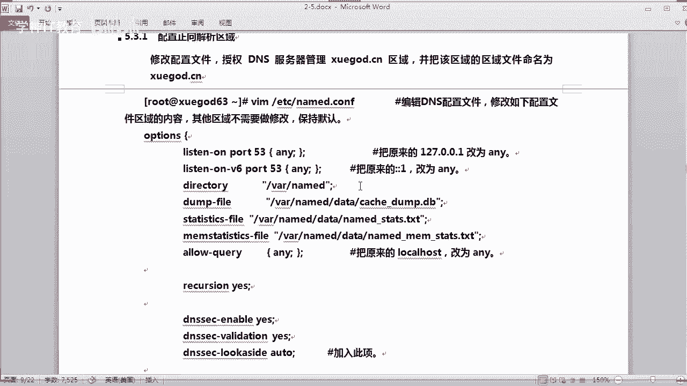
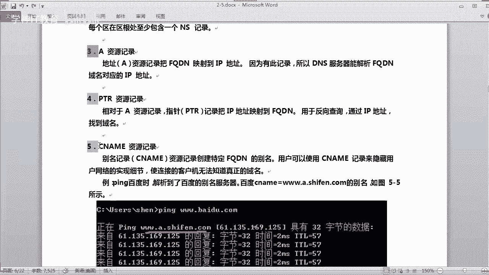

# Linux／Linux运维／RHCE／红帽认证／云计算／Linux资料／Linux教程--2-5-搭建DNS服务器实现域名解析01 - P1：DNS服务器搭建01 - 学神科技 - BV16A411e7QC

今天晚上的话是你们第二阶段的第五章啊，就是第五节课是吧，讲什么呀，讲这个DNS服务器啊，怎么实现这个DNS实现域名解析啊，OK今天怎么这么少人呢，人都去哪了，今天星期二嗯，尽量的来听直播课啊。

因为听直播课的话，你会啊，你会可能会遇到一些问题的话，老师可以给你解答一下是吧，那么课堂的气氛也会活跃一点啊，好来第五章啊，搭建DNS服务器，实现域名解析啊，那么今天的话我们会讲到啊，这以下内容啊。

电视的理论是吧，电视服务器啊，然后怎么样去安装和配置啊，然后做几个实战怎么样啊，搭建在内网搭建一个DNS的服务器啊，然后实现递归的查询是吧啊，递归查询啊，还有搭建电视的一个转发服务器啊对吧。

OK然后最后的话还做一个主从服务器，什么叫主从啊，就说能够有相当于有一个用于备份的是吧，有主冲是吧，就相当于有两台机都是DNS服务器啊，相辅相冲啊，那么我们需要准备啊两台虚拟机就可以了啊。

OK两台虚拟机就可以了，那这里说特别说明一下啊，在以下实验当中配置文件中的内容，说明或调整配置时，如书面上没有出现的内容，并在实验主机中配置文件中出现的内容哈，则不需要修改。

仅需要修改书面上出现加粗字体部分内容啊，这个其实不用在意啊，一会我告诉你哪些要修改，哪些不用修改就可以了是吧，OK你要注意听课啊，因为他这里的话大部分都是抽屉啊，你分不分不出来的吗，OK先讲讲师吧。

DNS我相信大家都知道电子是干什么的，其实讲到DX啊，其实我们现在每一个人啊，每天都在用的DNS做一个什么域名解析是吧，呃就是大到可能是凡是用手机的是吧，大到70岁的大爷，小到小学生用手机的。

那么他都会在用的DNS，其实他并不知道你说是不是因为你要上网是吧，你都要存在一个DX的解析，对不对，无声无息的是存在我们的生活当中啊，DNS那么DNS的话它是叫什么艺名啊。

艺名系统也可以叫艺名解析系统啊，那么在TCPIP网络中有非常重要的地位啊，虽然说非常重要的地位，但是很多人是吧，很多人都不知道，因为没有接触这个东西，都是自动化的帮你完成了，对不对。

能够提供域名和IP地址的解析服务，而不用去记住能够被机器直接读取的IP啊，IP这个数据串对吗，那么通过域名呢，最终得到该域名对应的IP地址的过程，就叫什么呀，异名解析啊，易名解析也叫主机名解析啊。

DNS协议呢运行在UDP的协议之上啊，使用端口是53啊，他的一个监听端口是53啊，DX呢可以是一个分布式的数据库吗，它命名系统采用的是层次的逻辑结构啊，如同一根导致的树啊。

这个逻辑的数形结构的话称为一名空间啊，由于DNS划分了域名空间，所以各个机构可以使用自己的域名空间，创建DNS信息，你看下面这个图啊，像下面那个图域名的话，它可以分为什么。

由上面的根到下面的一一层一层几是吧，分为顶级E2级E3级域，一直往下去，你看这里有地区域是吧，行业线啊，根是吧，跟上面的话会有很多啊是吧，你有很多的玉，你像这种CNJP是吧，UKHKGOVEDU啊。

dog com对吧等等，这种是顶级域啊是吧，还有二级域，有没有二级域，还有三级域呢，是不是一层一层级的分下去啊，他这个就是相当于一个树形的结构啊，因为我们写一个书名，你像WW学卡点C是吧。

那么它是由由几个部分组成是吧，有三个部分来组成嘛对吧，来我们先往下去看看啊，域和域名是吧，DS数的每一个节点呢代表一个玉啊，通过这些节点啊，对整个域名空间划分啊，成为一个层次的一个结构。

域名空间的每个域的名字呢，通过域名进行表示啊，域名通常是由一个完全合格域名FQDN标识，其实在这个以后我们做实验当中啊，会涉及到哎，如果说他不支持这个什么FQDN什么意思，你们应该懂吧。

FKFQDN的话，它是一个完全合格域名啊，知道没有，能够准确地表示出其相对于DNS数，这个玉树根的一个位置，也就是节点到DNS树根的完整表达方式，就像WW百度点com对吧，就是有一个完整的合格域名。

对不对，那么从节点到树根啊，采用反向书写，并将每一个节点啊，用每个节点用这个点来分割是吧，你像W的点是吧，斜杠又点的，然后come对不对，它是以点号来分隔，对于DNS域啊，这个谷歌来说。

那比如完全合格域名的话，就是这样子是吧，一个正确域名是什么呀，啊谷歌点com是吧，谷歌点com对不对，那这个谷歌的话为com的域的一个子域是吧，其表示方法呢，那为这样子去表示，那么如果是WW的话。

就为什么呀，为这个谷歌狱中的一个子域，可以使用什么三个W点，谷歌点home来表示看清有没有，它是从反向来对吧，首先点com，然后这个谷歌，然后前面的三个W啊，是这样的一个一个方向。

通常的话FQDN有原则的一个命名限制啊，长度不能通过啊，256个字节只允许使用字符A到一，C0到九或者是大写的A到C，所以说你看到李域名的话，基本上是什么字母或者是字母加数字组成，对不对。

不会有什么特殊符号的一个啊一个域名是吧，当然有这个可以用这个什么呀，减号也是一个一杠对吧，还有这个点啊，只允许在一名标志之间，例如例如啊，谷歌点号或者是FQDN的结尾使用啊。

其实结尾的话可能就我们一般的话很少用点，对不对，但是我们配置的时候呢可以使用啊，域名不区分啊，大小写，注意啊是吧，不区分大小大小啊，由最顶级到下层可以分为什么根玉顶级域，二级域和子域啊。

NT在域名空间的最顶层的话就是根据啊对吧，其记录者这个什么呀，internet的重要电子信息，由internet域名注册授权机构管理啊，该机构呢把域名空间各部分的管理责任。

分配给连接到internet各个组织啊是吧，那么这个点全球有这个肝呢，就是说全球的话有什么呀，有13个干服务器啊，啊你知道咱们中国有根服务器吗，知不知道有还是没有啊，那D的干预的话，下面是顶级域啊。

也由internet域名注册授权机构管理，它共有三种类型的应用顶级域啊，那么这种呢来看一下组织意又是什么东西，采用三个字符的一个代号，表示电子语中所包含的一个组织的，一个主要功能或活动。

比如这个com呢为商业机构的组织是吧，EDU一般为教育机构，是不是GOV的话为政府机构是吧，这个缪尔为军事机构是吧，还有这个net呢是网络机构，ORG的话就是一种是啊，什么官方组织或非营利机构组织啊。

这个int的话为国际组织啊，IPV6局域要有是吧，嗯我们争取是吧，咱们中国应该争取IPV6的这个局要有是吧，对，现在这个全球13个根服务器的话都不在中国，对不对，反而日本会有是吧。

OK美国美国拥有最多的一个这个根服务器对吧，int那么地址域地址域呢采用两个字符的什么呀，一个国家或者地区的代号，一般这种末尾，这种代号我们一看的话就知道了是吧，如果他是以EDV结尾诶。

那可能是一个什么啊，某某大学或者某某教育机构，是不是，那比如地址域的话，比如这个CN是吧，就是中国是吧，KR的话为韩国，US的话为美国，对不对，非常好理解是吧，反向域，这个是特殊的一个域名。

字为那这个in engine，什么ARVE用于将IP地址映射到名字啊，反向查询啊，反向查询的话才啊，用到这个对于顶级域啊的下值域的话，internet域名注册授权机构呢给这个internet各个组织啊。

当一个组织获得对域名空间某一部分授权之后，该组织呢就负责命名啊，所分配的这个预集子域啊，包括易中的计算机和其他设备，并管理分配域中的主机名和IP地址映射信息啊，其实D词呢就是将存储这些东西的啊。

嗯这里还有一个区是吧，区是什么呢，东西呢看啊区是DNS名称空间的一个部分，其包含了一组存储在D服务器上的资源记录，所谓资源记录呢就是将你的什么域名，将你的IP做一个绑定啊是吧，就告诉你哦。

你这个单词呢就是要解释到这个IP去的啊，就是这个意思啊，区域的概念啊，D服务器回答关于自己区中主机的查询，每个区都有自己的一个授权服务器啊，啊主域名服务器与辅助域名服务器，刚才好像我讲的像主虫对吧。

当区的这个辅助器启动时啊，他以该区的主服务器的话进行连接，并起动一次驱传输啊，那么曲补助服务器呢，定期以这个七组服务器进行通讯啊，类似于主从啊对吧，查看区域数据的是否改变，那么如果改变了。

他就会我也要更新一份对吧，你更新了这个什么DS记录诶，我也更新一份是吧，这样的话方便后期的一个查询啊，好，那来我们看一下这个辅助服务器的一些优点啊，那容错能力啊，你配置了辅助服务器之后呢。

那么在该区的主服务器崩溃的情况下是吧，那么客户机应能解析该区的一个名称是吧，就像它主从备份嘛是吧，实现一个拥在一样，一般把区的一个主服务器和区的辅助，这个服务器安装在不同的子网上。

这样呢如果一个子网的连接中断，那么DS客户群呢，还能直接连接查询到另外一个子网上的，这个什么呀，域名服务器上去是吧，这是容错能力，第二个呢它优点是减少广域链路的通讯量。

如果某个区在远程有大量的一个客户机啊，那么用户就可以在远程啊，添加该区的一个辅助服务器，并把远程的客户机配置成啊，这个先查询这些服务器，这样能够防止也能够通过啊，慢速链路通讯来进行vs查询。

减轻主服务器的负载，其实呢其实就是相当于做主从负载是吧，比如你一个主服务器的压力太大的话，我可以做主从是吧，分一些流量到一个辅助，就是重复继续减少他的压力，O怎么讲这么多电子概念啊。

这里还有啊它还涉及了很多东西，D还有什么东西呢，你看看运行DX的服务器程序的计算机，它会存储什么D的数据库信息，就是一个域名跟IP对应的一个条目，会记录到这个数据库里面去，对不对，那么D啊。

DNS的话会尝试解释客户进行查询的请求，然后反馈给他哦，你要查查这个域名，他的IP是多少，比如你查询这个163点co，我就告诉你是吧，OK在解答查询的时候呢，如果DNS服务器能够提供所请求的信息。

就直接啊直接回复你，那如果电视找不到相应的这个数据库信息呢，比如你查一个六三点co，所以我这个一啊，这个什么DX服务器没有记录信息，那怎么办，他就会为客户去提供另一个，能够帮助解释查询的服务器地址。

如果以上两种方法都失败，那么他就回应客户机没有所请求的信息对吧，OK他有一个叫啊，你像递归查询，还有迭代查询，知道没有，那往下去看啊，并不是说诶我这里没有存储数据心呢，就没有了，并不是是吧。

它可以实现一个递归和迭代的查询，诶，我没有，但是我告诉你有一个人可以查了是吧，他告诉你诶，你可以去问问他对吧，D服务器在解释客户请求的时候，那么如果本地没有电子信的话，它就会损润是吧。

我会问其他DNS啊，因为全世界的话有非常多的DNS服务器，对不对，它都是什么样，它都是互联的啊，一层层级的去连啊，当其他域名的这个服务器返回查询结果时，那么该DNS服务器，会将这个结果也记录到本地缓存。

说我我可以问其他，如果查不到这个DNS信息，我可以问其他DNS服务器，诶，你知不知道这个域名的IP地址啊，诶他说我知道知道，然后就告诉他，告诉他之后呢，他说诶我自己也保存一份是吧。

以便下次还有人来查询的时候呢，诶我就知道这个结果了，对不对，然后呢并把这个结果呢反馈给客户端，就是这样的一个意思，懂了吗，刚才讲到了DNS查询方式呢，有递归查询和迭代查询，也很好理解啊。

那么一个DNS查询过程中，通过八个步骤呢，解释过程就使得客户端顺利的访问，像这个WW点163点com这个域名，但实际应用当中通常这个过程是非常迅速的，你看它虽然是有八个步骤啊，但是它响应非常快。

基本上是什么呀，毫秒级对吧，毫秒级啊肯定不到秒了是吧，基本上不会用到秒，就是毫秒级是吧，你看一下啊，这里给你呃梳理一下他一个整个查询的过程啊，假如我就是拿这个举例子吧对吧，那这个163点co来举例子。

到底他电子是如何解析这个1000点，看的呢你看首先第一步啊，比如我这个是一台PC电脑，就是你家里的电脑啊，首先你要在你的浏览器输入一个WWW，点163点com加地址对吧，那么他就会干什么呢。

他就要访问这个网站，首先它的步骤呢就是要请求本地的DNS，你看到没有它本地电S的缓存，如果没有什么，没有这个163点com的记录是吧，怎么办，他就会联系谁呀，他就会联系这个这个根服务器。

你看这里有个根服务器是吧，联系他诶，就问哎你知不知道这个这个什么呀，这个域名这个服务器地址啊是吧，他说唉我也不知道对吧，那科技术我也不知道，但是呢我知道有一个人知道是吧，谁知道啊，他说我告诉你地址啊。

是谁呀啊，是这个dot com服务器啊，dog com的一个预服务器，他就会什么呀，那么这个本地DNS服务器的话，就会去掉这个dotcom域的服务器去查找。

你知不知道WW163点com对应的IP是多少啊，然后呢他就回答他回答什么，他说负责163点com的主区域服务器，应该知道答案，我这里没有是吧，我告诉你这个是吧，这个这个主区域的这个电视服务器有是吧。

我给你地址，你去问他吧，对不对好，那么你看到没有，他又去问了第六个步骤诶，他就会访问这个163点com的域服务器，看到没有，他又问一次诶，你知不知道1630com IP地址是啥，他就说诶我知道。

因为我这个数据库信息里面有这个IP地址诶，它的IP是1。1。1。1啊，这个是这个模拟的啊，并不是说他地址就是这个啊，就是模拟一下是吧，这样子哎他就回复你是吧，回复完成之后呢。

他说哦原来163点cow是1。1。1是吧，那我也把它缓存一下是吧，以便下次再有人问我的时候呢，我就不用那么复杂的气氛，那么多人了，对不对，然后同时也把这个结果呢反馈给客户端好，那么它就会自动解释是吧。

从这个IP地址去解释，然后呢你就可以看到页面了，其实电子的整个解释呢看是相当的复杂，但是它非常的迅速，反应都是毫秒级响应啊，那看了这个图之后呢，其实我们就知道啊，这个电视原来是这么复杂。

才能拿到一个IP地址是吧，其实并不是，是这个只是最复杂的一个情况啊对吧，因为现在来说的话，像这种常用访问的DNS的话，都不用那么复杂，肯定都有缓存，你说对吗是吧，嗯当没有的时候呢。

他才会走这么复杂的一个一个过程啊，好那么这里的话我就不读了，这个就是刚才啊我描述啊，用那个图描述的一个文字描述啊，你们再看一下就可以了啊，刚才讲到递归查询，什么是递归查询，什么是迭代查询呢。

递归查询呢是电子的用查询模式哈，他在该模式下的话，他是接受客户的请求，必须使用一个准确的杀人结果返回给客户机，如果电视服务器中没有缓存啊，就查不到这个信息，那么该服务器呢会询问其他的这个什么呀。

这个服务器并将返回结果提供给什么呀，客户机这种就叫递归查询，看到没有，递归查询，就是刚才我讲了这个递归查询是吧，那么什么是迭代查询呢，迭代查询呢是这样子，比如客户机发送一个电子请求的时候呢。

电子服务器并不是直接回复产生结果，而是告诉你诶我没有结果啊，你去找另外一台机吧，对吧好，他就会找另外一个DNS服务器，那么后期呢再向另外的FG发送这个请求是吧，诶这个请求发过去呢，然后第二台电视说。

哎我也没有这个结果信息怎么办，我又告诉你，你去找另外一台电视对吧，这种呢就是迭代，就是说我告诉你，你去找他是吧，找了他之后呢，他又不知道，那他就告诉你去找另外一个人找第三者。

那这种的话就是迭代递归就不是这样的，递归查询就说我找了你对吧，你就给我找出结果呢，你一次性张就给我反馈给我就行了，我就没有必要去找第三个人了，明白吗，这种是递归，所以递归和迭代呢就这个区别很好理解是吧。

好那么正向的一个解释的话，以反向解释有啥意思呢啊，正向解析很就是我们常说的是域名解析的IP，就是正项目是吧。

反向呢就是有IP能查到的域名对吧，一般就是用于验证你的服务器的时候呢，就用反向解析啊，比如你查看啊，像这个啊，我们可以看一下这里啊，像类似站长之家的话，这种的话都是可以做一个什么啊，IP反向查询的好了。

我打开看一下，有这个是吧，那假如啊你要查一个IP地址啊，你看他可以查到我当前的IP地址对吧，OK那比如我要查一个叫什么呀，假如我要查一个像嗯，我们学神的这个网站的IP地址。

那么它应该是分配是他的这个什么呀，这个域名是多少，我们可以通过反向的方式来查一下，比如101，那腰里腰对吧，然后多少啊，你看一下我们的学神的IP地址是多少，101。200点是吧，1128。35。

看到没有，那这样我们就可以反向查过来哦，这个IP地址它对应的是什么呀，学卡等CN的域名，看到没有，学神it对吧，我们可以看到是吧，而且他用的是北京阿里云是吧，这种是反向查询啊，反向查询啊，Ok。

好那这个就是反向查询啊，啊来我们接着往下去看啊，DC的资源记录啊，什么是DNS的基岩记录呢，它分为SA啊，资源记录，什么叫自研记录啊，就是每个区在区的开始处呢，包含一个起始的授权记录啊。

简称为SOA记录啊，SOO定义的域的一个全局参数啊，进行整个域的管理，设置一个区域文件，只允许存在一个唯一唯一的一个，SOSA的一个记录，那么这个就是SOO记录，就它会相应的一些比如一些限制的信息啊。

包括一些全局参数的话，都在这个SOA里面去了是吧，NSNSNS记录的话，这个很好理解的，全称叫name server是吧，就是域名服务器记录，什么叫域名服务器录，就是说你你的这个什么，你的这条域名。

到底是由哪个域名服务商来提供解析了，这种就叫记录，明白没有，就是你你比如你买了一个域名是吧，你这个域名到底是交给哪个域名服务商，进行解析呢是吧，这种的话就是记录很好理解吧，啊一般的话会有多个N次记录啊。

因为现在的运营商的话都有很多台的，这个怎么这个电子服务器了对吧，A记录呢也很努力，A记录估计你们用的最多的，还有工作经验的同学都知道，A记录呢，就是说把你的这个什么完全合格域名，映射到IP地址上去对吧。

因为有了此记录呢，所以DS服务器能够解析是吧，你这个完全和个域名对应的IP地址，就是比如WW163点com就是一个什么呀，就是一条什么，你要将这个这个什么呀，WW解析到什么。

解析到你的这个IP里面去对吧，PTR的一个资源记录是什么东西呢，那么相对于A记录来说的话，它是一个叫指针记录是吧，把IP映射映射到什么呀，把IP映射到这个什么FQDN上啊，用于反向查询。

就像刚才我说的是吧。

反向查询还有CNNCNN记录还是干什么呀，就是别名记录哈，别名记录呢你可以这样去理解，比如我要将什么ABC啊，163点com解析到WW点163点com对吧，那么ABC它就相当于一个别名，明白吗。

很好理解是吧，或者呢你可以这样来看啊，比如你拼百度的时候，你是不是看到百度的别名是什么呀，W点A点是吧，什么十分点com是吧，这样的一个别名，看到没有，看到没有，你你可以拼一下来我我打开这个这个什么呀。

我们拼一下啊，百度，你看到没有，他解析出来呢，其实它不是百度的com是吧，它是一个什么WW点A点十分点号是吧，这个呢就是它的一个别名啊。

至于他的一个别名啊，OK啊MX记录的话。

这个的话也很好理解，它是邮件交换资源记录，就比如你要配邮件服务器的时候呢，那你就要涉及到什么max的字节记录，为你的DNS的域名指定邮件交换服务器啊，邮件交换服务器呢是什么呀。

为DNS域名处理或转发邮件的一个主机，那么处理邮件呢它就会用到什么呀，这个MX呢对吧，这个东西有什么作用呢，它会把邮件投递到目的地，或转交给另外一个不同类型的邮件传送者，转发邮件呢。

他只把邮件发送到最终的一个目的服务器，用简单的邮件传输协议SMTP啊，把邮件发送到离最终目的的最近，邮件交换服务器当中，或是邮件经过一定时间的排队对吧，如果没有这个MS记录的话，那那你你你怎么传人是吧。

他肯定会一的这个邮件交换的这个这个D啊，一步步传是吧，好啊，总共的话有几个结构，其实还有其他的是吧，那DX的模式是SESSIVE回事啊，解释啊，嗯工作在这个53对吧，53啊，Ok。

那我们怎么样去安装它呢对吧，加油啊，你以后的话真的是要碰要安装一个DX的情况下，你应该怎么样去搭建一台DNS服务器对吧，这个的话如果你去做运维是吧，如果你公司刚好是像这种IDC机房啊是吧。

或者是一些啊运营商啊，那你就会涉及到什么，设置到这个D服务服务器的维护了是吧，所以你要对这个的话就要有一个深刻的了解，怎么样去维护它啊，安装DS啊，这个BIND啊，BND也就是什么样。

伯克利伯克利英特网名称与系统，看到没有，他这样的是吧，它名称是这个来的，那么现在版本的话叫啊，就前面这个叫beat是吧，beat9看没有第九个版本了是吧，以前的话有四八啊，现在的话有九。

因为九的话现在也可以支持IPV6了，看到没有，还有密钥加密啊啊这种等等啊，一些高级的功能啊，来我们直接来安装一下，我们通过项目的方式安装就可以了啊，OK来，呃有同学说你能不能讲一下rpm包的编译安装。

呃如果把这个全部讲的话，那今天就讲不完了是吧，rpm包安装，其实我们这个什么呀，要么安装不就是rpm包安装吗，同学，源码编译安装的话，你就要去找它官方再下载相应的源码，然后回来进行编译安装，Ok。

那么以后的话，我们会教你一些源码编译安装的方法，但不是每一个软件呢我们都会讲一遍，源码编译安装是吧，其实呢你要懂它的原理，怎么样去装，基本上你就通了啊，生产环境很多时候不让连外网呃，你看什么生产环境。

生产环境如果不连外网的话，那你怎么样去进行更新发布啊，对不对，没有声音的吗，有没有声音，没有声音的是吧，好了是吧，哦好了唉啊刚才我说了什么东西呢，我刚才讲了啊，有同学提问到哦。

那个说老师你能不能讲源码编译啊，如果讲源码编译的话，源码编译的话，那它的步骤就非常的多对吧，那你这堂课就讲不完了是吧，那么源码编译的东西呢，你现在呢嗯不用讲以后呢，我会教你一些用源码编译其他元件。

比如源码编译这个阿帕奇呀，源码编译，Mysql，源码编译angels啊等等啊，像这个啊dance的话，我们就不讲源码编译啊，我们讲的是用rpm包来安装，也就是用YM的方式来进行安装。

老是安装都看不到什么意思，都看不到吗，我我现在还没有安装啊，啊我都还没安装，你怎么看得到，我跟你讲啊是吧，先讲理论的东西啊，安装的话我们通过压模方方式，其实亚姆的方式安装呢就是通过rpm包。

只不过亚膜呢它有一个什么功能呢，自动帮我们解决需要哪些依赖包对吧，那么总共它需要依赖包，你看一下现在是9。9的版本吗是吧，这个是主程序包，还有这个ban的c h root。

这个的话是提高安全性的一个依赖包，看到没有，这里会讲到这个包有什么功能是吧，有什么功能啊，我就不一一介绍了，同学们好吧，还有一个呢是一个工具包，因为工具包呢比如要进行什么这个地域名解析。

比如比如做一些艺名解析的测试啊，那你就会用到这个包，它也是一个依赖的包对吧。

OK那现在的话我们呃来进行准备安装啊，打开你的虚拟机，那么这边的话我准备了两台虚拟机，一台是学科六三，一个学科六四啊，六三这台计划我就做什么呀，呃就是用来安装这个DS的服务器啊，就相当于服务端。

好ym install啊，然后啊执行一下这条命令，安装一下，啊那么刚刚有一位新同学加油啊，咱们班是吧啊，欢迎，欢迎新同学哈，出来自我介绍一下是吧，O那个来啊，那我这边的话安装完成了对吧，安装完成。

你看它有很多的依赖啊，有32个包，对不对。

好那安装完成之后的话，来我们接着往下一步，安装完成之后的话，才会生成什么这个主配置文件啊，主配置文件啊，这也是核心配置文件啊，它包含了这个艺名这个DNS的基本配置，但其实并不包括区域数据啊，不包含。

比如你要进行这个域名映射的数据呢，并不在这个核心配置文件里面，他是在那个区有个区配置啊，在这个RUA下的named这项目里面去啊，会传存存存放什么呀，存放电子数据库文件啊，比如某个区是吧。

OK安装完之后呢。

你可以直接启动它啊，你可以直接启动它来，我们来试一下能不能启动啊，嗯system c t l是吧，然后start下你的这个它的这个名称叫np name d啊，这样启动它是吧。

我们看一下它的一个端口是不是起来了呢，53对吧，我们刚才说的是53端口啊，你看到没有，它是在127啊，这个回环口地址里面去进行阶梯的对吧，所以它配置里面呢可能就配了这个地址，看懂吗。

那我们应该怎么样来用呢，怎么样去配置一个D呢对吧，那首先的话比如啊像咱们的这个DNS的话，一般像这台机的DNS，一般是配置到网络卡里面去的对吧，当然我们也可以查看这个etc的啊。

这个visual这个文件我们看到当前的这个DNS的话，是一个电信的DNS对吧，也就是啊我的网卡里面配置的这个DNS，对不对，你可以看一下，Net one，来我们看一下这个DNS的话，是不是你看到没有。

我这里配有一个D1是吧，就是一个电信的DNS啊，没错就刚才我看到这个DNS，对不对，这是本机的一个配置啊，本机的一个配置，那么现在的话我们的话来配一下怎样，因为我们自己搭建了一个DNS服务器是吧。

我们看一下，能不能用我们自己搭建的一个DF器，来进行解析解析啊，像这种163点com的网址啊，对不对，好那我们知道这个这个name对吧，下面有一个and什么什么什么啊，这里在etc下面有一个com文件。

这个就是主配置文件啊，为了以防万一，还之前我跟同学们讲过了是吧，我们无论配什么这个配置的时候呢，我们应该做一个备份啊，做一个备份啊，当然你可以加一个参数杠A是吧，杠A表示什么还记得吗，这话有什么好处啊。

以防万一，你配错了，你想恢复，对不对，有备份啊，有备无患是吧，有备无患啊，同学们要记住嗯，好我们把这个备份一下，比如我们就备份成叫back，那么这样的话方便以后啊，如果发生什么问题。

你要恢复成呃这个出厂默认设置的时候呢，就非常的快了对吧啊，好这样的话我们就再来编辑啊，编辑一下这个name name啊，然后and然后cf这个文件啊，这个就是D的核心配置文件啊。

总共的话这个内容也不是很多，来我给你看一下啊，呃看下最后一行是吧，61行而已对吧，其实很多的话是一些注解啊，什么东西啊，并其实配置的这里给你们讲一下，配置的主要分有两个区域啊。

一个呢这个是全局的一个区域啊，全局什么叫全局啊，有全局就有局部是吧，全局参数嘛啊，那么比如全局参数呢一般配一些啊，对于是整个整个区域生效了一个什么一些参数，比如listen on。

就是你配他一个监听端口啊，那今天窗口是53，没有错是吧，刚才我们看到他是在回环口地址进行监听的，因为这里已经配置了一个回环口地址，对不对，看到没有，这个呢这个OPPATIENTOPPATIENCE啊。

就是配什么全局配置的，那么还有啊，我一个块一个块跟你讲啊是吧，那他是到这里结束了，看到没有，到这里结束了，就是全局参数，那第二个快的话，这一块的话就是什么配置日志的对吧。

比如生成一些比如解释的一个日志啊，递归的日志啊，它会放到什么data这个NRS这个这个路径下去，这个呢一般我们不用管它啊，不用管它，那我们要管什么东西呢，还有下面这个这个就是区域配置了啊，同学区域配置。

其余配置呢你要对，比如你要嗯对哪个区啊，你可以带，你可以有很多个区域是吧，这个区域的话你要配什么类型啊等等，这些东西的话，这个是很关键，最后的话还可以什么进行加载，比如加载其他一些区域，你看到没有是吧。

我们可以写一下其他一些区域，写到另外的路径进行一个加载也是可以的啊，好那主要是这几个快哈，嗯OK。

那好来我们打开这个笔记啊。

你看一下啊，这里呢是吧，刚才讲了一个是对全局生效的一个参数，这个呢是对某个区域生效的参数啊，主要是这两点的话比较重要啊。

比较两点比较重要啊，那这里呢重点讲解一下，这个什么区域里面的类型参数类型参数啊，就是这个tap啊，Tap。

那么tape的话有有多少种类型呢，你看到没有有好多种啊，有master对吧，有slave对吧，还有其他的一些参数，你看到没有等等等等啊，还有这个forward是吧，转发还有一个head是吧，等等参数。

那么这些类型的话，如果你配置啊，当前是配成这个什么head是吧，嗯如果你配成master的类型的话，它就表示什么主DNS服务器，就说你这台是什么主服务器啊，主DNS服务器就这样的意思。

你配这种slap呢，它就是什么重服务器，也就是说我们说的辅助回去啊，像后期我们讲这个什么MYSQL，主从服务器也是这样啊，matter呢就是主safe呢就是从啊很好理解明白吗。

还有这个什么这个STUB这个是吧，这个呢跟这个slave有点类似，但其只复制主啊，这个主服务器上面的这个NS记录，而不像从服务器那样，复制所有啊这个主服务器的数据啊，这个有点区有点区别，它只同步什么呢。

只同步NS记录是吧，记录是什么东西啊，就是哪我这个域名到底是交给哪个域名商的，这个这个这个记录对吧，所以呢作用啊可能就是没有太，我们不太常用是吧，for war的话就啊for work呢就是转发了。

很好理解，就是每个预配置转发的主要部分，比如我要进行啊，我我不解析是吧，我可以转发到其他DNS去解析明白吗，我是一台电视，但是呢我不想存储这些解释记录，我转交到其他人，这个比如我转发了这个谷歌域名。

去在谷歌DNS啊去解析啊，这种就是转发，还有这个HD就是根域名服务器初始化指定的，这个什么线索区域的一个服务器，就默认的它就是配成这样了对吧，那梦魇呢它就配成这样了啊。

他使用根线索来查找这个根域名服务器，并找到最近的根域名服务器列表啊，是这种啊模式啊，好往下去看啊，然后我们就开始来讲啊，怎么样去啊，大家建一个DNS服务器呢，比如像刚才有同学说哎。

我内网可能呢在生产环境呢，就嗯可能是啊不能提供是吧，不能提供上网的情况下，那你可以自建一个是吧，DNS服务器来进行一个域名解析啊，怎么样去解析呢，你看一下啊，呃我们就开始来编辑一下。

这个这个电子服务器啊。

因为刚才我们已经做了备份了是吧，我们现在做起来的话就轻松多了是吧，就不怕出错了，我们再回复就可以了对吧好，那比如我要进行监听所有地址的话，那我不应该啊写这个回环口地址对吧，我应该改掉。

那如果你是任意地址的话，都可以监听的话，我们应该怎么写呢，你是不是写0。0。0的啊，不用写0。07any就可以了是吧，就是任意地址啊，任意地址啊，还有呢这个呢是支持IPV6的。

虽然说现在IPV6的话并没有普及起来，我们也可以把它调整为对吧，没有关系，对不对，好往下去这个allow这个查询允许查询的话，是这个本地吗，本机吗，我们应该也是改成什么任意地址对吧，也是感觉啊。

B把它设置为一一地址any就可以了对吧，这三项啊，好往下去看，往下去看有什么东西呢，啊这里有一个这样啊，这个什么东西啊，这个是允许啊，允许递归查询对吧，那么这个呢本身的话就是yes的，我们也不用去管它。

还有往下去看，这个是，这个是默认的参数选项啊，我们现在的话也不用管了，我们加多一项啊，加多一项这个什么东西呢，D n s s e c，其实照上面差不多的一个一个选项啊，Look，那注意啊，这里的配置啊。

每一个配置完整呢都有个分号，你看到没有，都有个分号，包括这个这个中括号，配完之后呢，也有一个分号啊，这是它的规则啊，这是它的规则，Ok，往下去看往下去看的话，日志这个的话我们不用管它是吧。

就按他默认的配置就行了，我们关心的是这个区域配置，这里啊，区分这里这里啊，那么比如他这里区配置呢，这个配置的是一个干预是吧，配置的是一个根域，就点就是根据嘛，那当然我们不能配这个根域。

比如我们啊自己写一个自己，比如叫学卡点先对吧，这样的一个一个区域是吧，然后呢我们把这个类型改一下，比如我们改成master master是什么东西啊，刚才说了就是主DNS服务器是吧，主DNS服务器。

OK然后fail的话是配置什么呢，配置你的这个这个区域名称啊，我们也要照着这个嗯这样写吧，学霸点CN点重是吧，这样子写就可以了，OK注意啊，每一个结尾的话，它都有一个分号五这么多啊，就这么多。

我们先配这么多，要保存命运出啊，这个时候的话呃，我们应该我现在能够重启吗，你说我能不能重启，重启肯定会报错了对吧，为什么呀，因为你的这个这个区域你并没有去配来，我试一下给你看啊，是不是报错了。

为什么我给你翻看一下，云中说诶我不知道怎么样去排错，应该怎么办对吧，我们看一下这个报错，你看这里会说什么东西呢，啊你一步步往下看啊，这里是loading是吧，准备loading就失败了。

他说loading，你这个学个点cn job失败，因为你这个文件呢不存在是吧，我把它缩小一点给你看啊，你看这句话看得懂吗，他是说啊fail NO啊，flow就什么意思啊，就是说你的文件都发现不了。

查找不到你的这个文件，那肯定会启动失败了，是不是你的区域文件在哪里啊，没有是不是你写了一个配置，但是并没有升，没有它实质实质的这个物理文件是没有的吗，看清楚没有，所以它启动就失败了，文件找不到。

那怎么办是吧，来我把这个再调大一点哈，那么这个文件没有，你启动肯定它就会进行报错，好那我们现在就要去写一个区域文件啊，这个区域文件在哪里呢，在挖下的一个，这里面啊你看你写区文件呢都是写在这里的啊。

写在这里啊，它指向这里，然后我们也应该是自己写一个啊，嗯我们copy1份这个name lock lock house，这样是吧，好我们自己写一个名称啊，啊你要对应的是吧，跟你刚才那个斜杠点CN点什么呀。

中这个名称要对应它才能够查找到，他是到这个路径去查找的哦，查找这个文件名称知道没有，所以呢我们拿这个模板啊，这里就简单提供了一个模板，然后呢复制一份，明白吗，然后我们再来编辑一下这个学霸挺偏壮的。

这个你看这种呢就是一个一个什么，相当于数据库文件是吧，数据文件也就是区域文件，那这里的话就会记录什么呀，记录你的DNS解析的一个一个记录了，包括什么NX记录啊，A记录啊，还有别名记录啊。

啊这个什么邮件交换MX记录等等等等，都是在这里去配，那你那这里怎么配呢是吧，有些人说看A好像有点复杂，你慢慢理解它之后怎么配它的一个规则啊，你懂它的游戏规则之后呢，那你就觉得它不太复杂了对吧。

什么东西都是这样啊啊来，那这里有个dollar t t l e d表示什么意思啊，表示一天一地就是一天是吧，一天啊，然后下面这个的话就相当于一个什么呀，这个就相当于你的这个根据。

因为它用的是一个这个I的符号啊，A的符号，那么我们可以改啊，我们怎么样改呢，你看我怎么改啊，我可以直接把它改成我们的这个域地址，比如我们改成学卡点三对吧，OK啊SOON刚才讲了什么是SOON，还记得吗。

好然后呢，我们把这个写一下，这里的话它也是用你的域，at是表示你的域名称，我们直接写域名称吧，比如你的啊我们写DNS点学先点啊，他一般的话我们这配置文件里面都是写什么，以点结尾是吧，以点结尾啊。

K后面的话就是一个一个一个啊，像一个地址了对吧，就是我们配预管理邮箱地址啊，在这里我们可以直接写，我们不用它默认这个啊，因为我们用root点学大点C对吧，这样去写啊，O好往下去看啊。

这每一项的话又表示什么意思呢，你看这里有什么零啊，1DEHEW3H表示什么意思啊，零这个的话这个位置表示什么序列号啊，用于标识数据库的变化，那一般的话我们配置在十位以内，如果存在辅助DX的区域。

建议每次更新完数据呢手动加一啊，手动加一这样子啊，就是说A已经更新一下D的话表示什么意思呢，就刷新时间，刷新时间的一天，如果你让他刷新时间会快的话，你可以调整是吧，比如调整一一个小时。

也许就是一个小时吗，看到没有，也许是一个小时，这个下面这个也许表示一小时，但是这个表示什么呢，这个叫从事延时的时间，从域名服务器更新地址数据库失败以后，等待多长时间啊，从事啊一个小时从事对吧。

就这样意思，这个EW呢表示一周是吧，一周这个是什么呀，失效时间就要超过一周的时间呢，仍无法更新地址数据库的话，那它就不再尝试了，明白吗，是这样的意思，一个超时时间啊，失效时三取的话很难理解。

就三个小时嘛对吧，也许就一个小时，这个呢是设置无效地址解释记录的时间，默认缓存时间是吧，就最少缓存时间为三个小时，就这样意思就是默认的一个缓存时间啊，O，一般这些东西我们可以不改它对吧。

我们直接配下面的这些啊，像这个啊记录X记录的话，我们要配什么东西啊，记录的话就是你的域名提供商了一个一个什么，比如我们这一台的话，就是域名提供商对吧，那我写一个他的一个先写下它的域名啊，写个点C啊。

那么这个NS的话应该是什么呢，他用dollar符号表，就是你当前的对吧，你也可以直接写，把上面这个抄下来就可以了，这个，这个就是他的NS记录，好往下去看，往下去看，你们更好理解这个是配置什么呀。

A记录啊，什么是A记录啊，我相信你们都懂什么叫A记录是吧，比如我要把你的这个DNS点穴点CN好吧，我要把你这个预这个呢解析A记录呢，解析到哪个地址去，这种就是A记录嘛，很好理解是吧，解析到192。

168。2点有三是吧，A记录呢你可以有多条，比如你像这里我又在写一个A记录，可以吗，对吧啊，这个4A表示什么意思，同学们你知道吗，4A我们用不上是吧，因为4A的话它是IPV6的A记录是吧。

IPV6我们现在还没普及呢，对不对，所以我们比如把这个WW点学个，点C点，注意啊，我们直接在这里去配置一个一个名称的时候呢，我们一般在末尾呢都有个点，你在浏览器输入呢并没有这个点是吧，它可以省略掉。

在这里配的话，你可以输入一个点啊，OK有同学说我不要这个点可以吗，也可以是吧，那然后的话我们把这个比如这个这条A季度，我们也解释到同样的地址去，对吧，这样子啊，呃老师能不能先总体讲一遍。

这个状配置文件一共有哪些参数，每个参数干嘛的，然后再讲什么配置，嗯老师正在去讲啊，有哪些参数，你像NS记录A记录诶。

刚才不是讲了吗，你没听过吗，来我发回去给你看。

那A记录啊，有PTR有别名记录对吧。

X记录啊，其实呢还有一个叫像这个MX记录啊，因为这个的话可能MX记录也算比较常用的，但是笔记里面并没有对吧，主要是这几张记录，其实如果你去买一个域名呢，这些东西的话，你也不用太担心，为什么。

因为域名天空上它会把这些全部都抑制好了，你只要用鼠标选择就可以了对吧，然后每一个表示什么意思呢，它也有解释，我这里也讲给你讲了一遍，OK哦有有有是吧。

六对吧，六是max max的一个自研记录啊，懂了吗，我意思是一个长的格式，这个格式每个位置对应哪个参数，参数是干嘛之类的，参数是干嘛，你说哪个参数。

那比如你要解释A记录，那你写一个A对吧，那么你要做一个A记录的话，你是不是要将比如你这个什么呀，你这个DNSDNS学个点啊，C的话，这个这个A记录你要解析到哪个地址，就是这样去做对应的呀是吧。

那么你在这个这个什么呀，你在域名填空上应该是这样子的对吧，我相信你们应该这样，我这里是写一个啊全域名的，也你在提供商里面应该看到是这样子的对吧，把DNS对吧，解析到这里去是不是。

然后呢你在域名通过上也是这样显示的，比如把三个W点是吧，解析到这里去，对不对，一样的啊，听懂我意思吗，SOA不明白，来回去看一下概念。

其实讲这些东西的话可能是有点抽象一点是吧，啊像这种没有经常用的，他SOA资源记录是干什么用的，因为每个区的区域的开始之后呢，它会包含一个什么起始的一个授权记录，就叫SOA记录。

一般在我们在一名一名提供商呢，一般他不会叫你配这个东西，为什么呀，因为这个呢他帮你抑制好了，所以呢只有当我们自己搭建这个域名服务器呢，你会才会存在这个SOA是吧，定义这个全局参数的时候呢。

就会有这个东西，这个东西是干什么用的呢。

啊在这里，比如你要定义SOA的，比如像它的缓存时间啊，啊超时时间啊等等等等，知道没有，就是干这个东西用的啊，OK明白了吗，勇敢的心，因为真正的在你去这个页面填空上的话。

这些东西一般人家都帮你配好了1万了啊，不是1W的话表示一周啊，一周啊，一周一周，独步红尘同学是吧，嗯迷没关系啊，迷就对了啊，如果你不迷的话，那你也不用来学是吧，名是对的，慢慢就会理解了哈。

就有些概念的东西的话，听起来好像诶为什么要这个东西啊，它本身它做这个他开发这个程序呢，他考虑到的哈，嗯学尬点C点是吧，我是写全域名而已，看得懂吗，我只是写全域名，有经验的同学应该看懂，对不对。

那比如我还可以你像什么max记录啊，那些东西是吧，或者我写个别名啊，这样这样子啊，尬点先对吧，OK比如我写一个别名啊，这个用大写c name对吧，好我也解析别名的话，因为你可以啊，重新解析到其他地址。

是比如我解释解释到上面这个A记录去可以吗，别名很好理解是吧，学个点CN这个懂吧，就是我将这个东西呢把它这个是它的别名是吧，我解释了这个，而这个呢又解析到这个地址，那么它就会真正的会最终还是解决这个地址。

这个看得懂吧，语法规则，语法规则刚才已经讲了啊，我们在配这个核心配置文件的时候，的语法规则就要注意啊，你配置完每一个的之后呢，它都有一个分号啊，这是注意点，我会提醒你，看到没有，这样的话。

就是你相当于这个的话就相当于什么呀，像你的数据库记录一下哦，这里你要解释的是到哪里去是吧，这条记录解释到哪里去，你做的是A记录呢，还是什么记录对吧，那么这样的话我们就配置完。

一个一个非常简单的一个艺名啊，一个一个解析对吧，这样的话他就建立一个对应关系了好吧，嗯好那么我们先保存退出啊，保存退出啊，那这个时候的话我们来啊先看一下啊。

有同学说这个东西还是不太理解，这里下面有笔记，有说到啊，来给你讲讲啊，这个我应该有一个框说到的啊，这个嗯这里啊呃你看没有SOOA是吧，n less以后max它表示什么意思，这些懂了吧。

SOA它是趋于售前驱使的一些记录，它是区域文件的第一条记录，并且一个区域文件只有一条，里面包含了一些限制的限制的一些啊参数等等，都是在这个SOA里面去配哈，NS的话就是域名授权的名称服务器。

就是说你这个域名到底是托管到哪个域名商，就是这种的一个记录，max的话就是邮件交换A记录更好理解对吧，4A的话，这IPV6才用的，我们现在用不上啊，好PDR的话解释IP的一个指针啊，刚才也讲了好。

别名的话也好理解啊，别名记录啊。

好了，我们刚才的话做了一个配置文，然后我们现在能不能重启呢，对吧，刚才重启它是报错了，现在再重启看一下啊，name是吧，唉他还是报错，OK他还是报错，有没有发现它还是报错，那怎么办，那你还要排错啊。

是吧嗯，我先把这个来看一下，它的一个是什么导致错了啊，你看这里会提到看一下错误在哪里啊，我把这个缩小一点啊，因为它显示不太完整，在加载master file学干尬点，cn job失败，因为什么呀。

top of strong什么意思，没有有错误诶，退出失败，这个啥意思，你看一下你翻译一下是什么意思，少写了个点是吧，就是你在你的这个文件里面有报错，有没有显示第几行，我看一下啊，没有是吧。

有同学说你少写了一个点是吧，嗯来我看一下是不是很明显，是你的配置文件肯定有问题了，我们看一看啊，这个配置文件，哪个哪个少写了一个点，你说第一个吗，这个少一个点吗，嗯我看看啊，还有没有其他的，没有是吧。

我看一下啊，是不是这个原因啊，来重启一下诶，还真的是是吧，还真的是，如果大家要写一个点的话，那么就统一大家有个点是吧，要不然你跟这个对不上了对吧，OK那么重启成功了之后的话，我们来试一下啊对吧。

重启成功，我们来看一下这个这个我们现在的D呢，这台机就是一个DNS服务器对吧，那么在IP地址是多少，我们这台机IP地址是192。16，8。2。63是吧，它也是什么，也是我们的这个N服务器就是记录嘛。

就相当于什么，我就相当于一个域名提供商，对不对，我也是一台一台电视服务器嘛，我也所以可以说是一个页面提供商了，对不对，那么我通过这个2。63，把它当做一个JS来进行解析域名的话，行不行呢对吧。

这是我们关心的问题，我们应该怎么搞，比如我们可以编辑一下你的网卡，network对吧，然后找到你的这个网卡啊，我这个网卡配置的这个dd是什么，一个电信的DNS是吧，配置的是一个电信的电视好。

那现在我就不用电线电视，为什么，因为我自己都已经搭建了一台电视服务器了，我也相当于一个域名提供商了对吧，OK那我就可以干嘛呀，那我就可以直接把它干掉啊，写成我的IP地址，192。168。2。63是吧。

我本机本机的IP就可以了是吧，因为我就可以解释一名啊，然后写保存并退出啊，那这个时候呢你应该重启一下你的网络，怎么能随便写呢，你这不是一个域名服务器，那你写上去它怎么能解析呢。

那我现在把这台机搭建成了一个域名，域名服务器，那是不是我可以写写这个地址啊，对不对，那写完了之后呢，你来看一下啊，比如我们现在要进行一个解析，怎么解释，你要解释一个，我就这样子吧，拼一下啊对吧。

学霸点CN，你看它就会解析到什么，解析到2。63去了，因为本身我们刚才配的这个域名，它就是指向的就是2。63是吧，指向的就是它解析出来就是2。63，对不对，你可以low up这样解释，你看他解析出来。

他就会用这台DX服务器进行解析，看到没有，2。63就是本机解释出来之后呢，你这个域名指向的就是这个IP，对不对，那你说我用这个DNS服务器，能够能够解释其他的域名吗，比如百度，来我解释一下百度。

有同学说不能，那就奇怪了，为什么不能呢，肯定可以呀，你看，对不对，我这个能上网，而且的话也进行了一个呃递归的查询对吧，他就会按层级一层一层去找啊，他找回来了，他会回答你啊是吧，对不对。

能够解释161630吗，肯定也可以啊，是吧，你看没有没问题吧，你看他第一次解释呢会慢一点，然后它会进行一个什么进行一个查询是吧，一层层去查，你第二次在查询的时候呢，它已经缓存到本地数据库了。

那么你一查询的时候马上就可以输出是吧。

有同学说这个是随便写的吗，嗯这个不是随便写啊，你这个就是你的记录吗，啊这位同学同学，你知道什么叫记录吗，那你作为域名的一个服务者，那你肯定要提供一个什么啊，你的域名服务器是的地址是多少。

这个就是你的域名啊，提供者的这个地址用来解析你这个域名的，知道没有。

我已经讲了三遍了哈，没关系啊，慢慢来理解啊，好，那这样的话，我们就已经这个这个DNS服务器的话，就可以成功了，也就是说我现在我现在的话是什么呀，使用的就是本机的IP地址做什么呀，做DNS服务器地址。

你看可以解释任何的一个域名对吧，没问题吧，那好那这样子啊，那我来到学个六四这台机，我把6464的I这个域名是这个D服务器，配置是多少呢，来我们看一下这个斜杠六四这台啊，这台这是一台啊客户机主机是吧。

他现在指向的英语名呢是一个电信运营商的DNS，对吧，我把这个DNS的服务器指向到学个六三的IP，可以吗，你说可不可以，肯定可以啊是吧，来我们给你看一下一样的道理啊，嗯我们直接修改这个好了。

我就懒得修改网卡了，好不好，我把这个改，对吧，我把它定制服务器地址直接写成2。63好嘞，那这个时候呢你说我能够解析吗，诶这个没有吗，哦没有这个命令，那我直接拼，直接拼啊，直接拼一个百度，看看能不能解决。

能够解释，你看到没有出来了吧，是不是能够解析啊，通了吧，没有问题，说明的话你指向这个这个DNS服务器是吧，就相当于我在内网已经建了一个DNS服务器了，它跟外网是联通的，我指向他，我就可以解释了。

我不用指向外部那些D的，对不对，就比如我这个学科六四不能上外网，它一样能够解释地址是吧，能不能拼通呢，就看你能不能连外网了对吧，至少它能够返回这个这个地址啊，Ok。

好那我们讲了这么多啊，我们先休息一下吧，好不好，现在是9。40了啊，我们先休息一下，我们再讲一下啊，怎么样实现。

